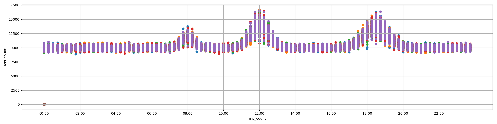

[picoCTF 2018 Writeup](index.md) 第1弾として、Warmup系中心のWriteupです。

- [Forensics Warmup 1](#forensics-warmup-1)
- [Forensics Warmup 2](#forensics-warmup-2)
- [General Warmup 1](#general-warmup-1)
- [General Warmup 2](#general-warmup-2)
- [General Warmup 3](#general-warmup-3)
- [Resources](#resources)
- [Reversing Warmup 1](#reversing-warmup-1)
- [Reversing Warmup 2](#reversing-warmup-2)
- [Crypto Warmup 1](#crypto-warmup-1)
- [Crypto Warmup 2](#crypto-warmup-2)
- [grep 1](#grep-1)
- [grep 2](#grep-2)
- [net cat](#net-cat)
- [HEEEEEEERE'S Johnny!](#heeeeeeere-s-johnny-)
- [strings](#strings)
- [pipe](#pipe)
- [Inspect Me](#inspect-me)
- [Aca-Shell-A](#aca-shell-a)
- [Client Side is Still Bad](#client-side-is-still-bad)
- [Desrouleaux](#desrouleaux)
- [Logon](#logon)
- [Reading Between the Eyes](#reading-between-the-eyes)
- [admin panel](#admin-panel)
- [caesar cipher 1](#caesar-cipher-1)
- [environ](#environ)
- [hertz](#hertz)
- [hertz 2](#hertz-2)
- [hex editor](#hex-editor)
- [ssh-keyz](#ssh-keyz)
- [Irish Name Repo](#irish-name-repo)
- [Mr. Robots](#mr-robots)
- [No Login](#no-login)
- [Secret Agent](#secret-agent)
- [Truly an Artist](#truly-an-artist)
- [quackme](#quackme)
- [quackme up](#quackme-up)
- [Malware Shops](#malware-shops)
- [Ext Super Magic](#ext-super-magic)
- [Lying Out](#lying-out)
- [Safe RSA](#safe-rsa)
- [Super Safe RSA](#super-safe-rsa)
- [Super Safe RSA 2](#super-safe-rsa-2)
- [Super Safe RSA 3](#super-safe-rsa-3)
- [What's My Name?](#what-s-my-name-)

# Forensics Warmup 1
解凍するとJPEG画像が出てくる。


# Forensics Warmup 2
なんか普通に開けたけど、嘘拡張子がついてたっぽい?


# General Warmup 1
`(char) 0x41`は`'A'`と等しいです。

`picoCTF{A}`

# General Warmup 2
27 = 16 + 8 + 2 + 1 = 0b11011

`picoCTF{11011}`

# General Warmup 3
0x3d = 3 * 16 + 13 = 61

`picoCTF{61}`

# Resources
読むと`picoCTF{xiexie_ni_lai_zheli}`って書いてある。
(多分この問題は他の誰かが通したような気がする)

# Reversing Warmup 1
動かす。
```
m1kit@pico-2018-shell-2:~$ /problems/reversing-warmup-1_4_censored/run 
picoCTF{welc0m3_t0_r3VeRs1nG}
```

# Reversing Warmup 2
`base64 デコード`とかで検索する。
```
m1kit@pico-2018-shell-2:~$ echo 'dGg0dF93NHNfczFtcEwz' | base64 -d
th4t_w4s_s1mpL3
```

`picoCTF{th4t_w4s_s1mpL3}`

# Crypto Warmup 1
換字式暗号的な。`A=0, B=1, ..., Z=25`とすると、平文`m`と鍵`k`と暗号文`e`の間には次のような関係が成り立っている。

`m≡e-k`

本番は手動で行ったが、次のようなコードで解読が可能である。
```java
public class Solver {
    public static void main(String ... args) {
        String cipher = "llkjmlmpadkkc";
        String key = "thisisalilkey";
        IntStream.range(0, key.length())
                .map(i -> (cipher.charAt(i)- key.charAt(i) + 26) % 26)
                .forEach(c -> System.out.print((char) (c + 'A')));
    }
}
```

```
SECRETMESSAGE
Process finished with exit code 0
```

`picoCTF{SECRETMESSAGE}`

# Crypto Warmup 2
ROT13って知ってますか問題。知らなくても`{}`の位置的にアルファベットだけが置き換わる換字式暗号っぽいことはわかるし、1文字目の`c`は`p`に置き換わるのはだいたい御察しの通り。
```
$ python -c 'print(raw_input().encode("rot13"))'
cvpbPGS{guvf_vf_pelcgb!}                      
picoCTF{this_is_crypto!}
```

# grep 1
```
$ strings ./file | grep picoCTF
picoCTF{grep_and_you_will_find_52e63a9f}
```

# grep 2
```
m1kit@pico-2018-shell-2:/problems/grep-2_4_censored/files$ find -type f -print0 | xargs -0 more | cat | grep pico
picoCTF{grep_r_and_you_will_find_036bbb25}
```

# net cat
にゃーん
```
m1kit@pico-2018-shell-2:~$ nc 2018shell2.picoctf.com ポート番号
That wasn't so hard was it?
picoCTF{NEtcat_iS_a_NEcESSiTy_8b6a1fbc}
```

# HEEEEEEERE'S Johnny!
```
$ unshadow passwd shadow > t
$ john t --show
root:kissme:0:0:root:/root:/bin/bash
```
```
m1kit@pico-2018-shell-2:~$ nc 2018shell2.picoctf.com ポート番号
Username: root
Password: kissme
picoCTF{J0hn_1$_R1pp3d_289677b5}
```

# strings
```
$ strings strings | grep pico
picoCTF{sTrIngS_sAVeS_Time_d3ffa29c}
```

# pipe
```
$ nc 2018shell2.picoctf.com ポート番号 | grep pico
picoCTF{almost_like_mario_8861411c}
```

# Inspect Me
`chrome`の開発者ツールでコードを`Inspect`していく。結果から言うと、フラグの断片がhtmlファイル、cssファイル、jsファイルにそれぞれ隠されている。

<details><summary>html</summary>

```html
<!doctype html>
<html>
  <head>
    <title>My First Website :)</title>
    <link href="https://fonts.googleapis.com/css?family=Open+Sans|Roboto" rel="stylesheet">
    <link rel="stylesheet" type="text/css" href="mycss.css">
    <script type="application/javascript" src="myjs.js"></script>
  </head>

  <body>
    <div class="container">
      <header>
	<h1>My First Website</h1>
      </header>

      <button class="tablink" onclick="openTab('tabintro', this, '#222')" id="defaultOpen">Intro</button>
      <button class="tablink" onclick="openTab('tababout', this, '#222')">About</button>
      
      <div id="tabintro" class="tabcontent">
	<h3>Intro</h3>
	<p>This is my first website!</p>
      </div>

      <div id="tababout" class="tabcontent">
	<h3>About</h3>
	<p>These are the web skills I've been practicing: <br/>
	  HTML <br/>
	  CSS <br/>
	  JS (JavaScript)
	</p>
	<!-- I learned HTML! Here's part 1/3 of the flag: picoCTF{ur_4_real_1nspe -->
      </div>
      
    </div>
    
  </body>
</html>
```

</details>

1つ目は`picoCTF{ur_4_real_1nspe`

<details><summary>css</summary>

```css
div.container {
    width: 100%;
}

header {
    background-color: #c9d8ef;
    padding: 1em;
    color: white;
    clear: left;
    text-align: center;
}

body {
    font-family: Roboto;
}

h1 {
    color: #222;
}

p {
    font-family: "Open Sans";
}

.tablink {
    background-color: #555;
    color: white;
    float: left;
    border: none;
    outline: none;
    cursor: pointer;
    padding: 14px 16px;
    font-size: 17px;
    width: 50%;
}

.tablink:hover {
    background-color: #777;
}

.tabcontent {
    color: #111;
    display: none;
    padding: 50px;
    text-align: center;
}

#tabintro { background-color: #ccc; }
#tababout { background-color: #ccc; }

/* I learned CSS! Here's part 2/3 of the flag: ct0r_g4dget_402b0bd3} */
```

</details>

2つ目は`ct0r_g4dget_402b0bd3}` (3つ目探す意味なくないとか言わない)

<details><summary>js</summary>

```js
function openTab(tabName,elmnt,color) {
    var i, tabcontent, tablinks;
    tabcontent = document.getElementsByClassName("tabcontent");
    for (i = 0; i < tabcontent.length; i++) {
	tabcontent[i].style.display = "none";
    }
    tablinks = document.getElementsByClassName("tablink");
    for (i = 0; i < tablinks.length; i++) {
	tablinks[i].style.backgroundColor = "";
    }
    document.getElementById(tabName).style.display = "block";
    if(elmnt.style != null) {
	elmnt.style.backgroundColor = color;
    }
}

window.onload = function() {
    openTab('tabintro', this, '#222');
}

/* I learned JavaScript! Here's part 3/3 of the flag:  */
```

</details>

3つ目は` `(虚無)

`picoCTF{ur_4_real_1nspect0r_g4dget_402b0bd3}`

# Aca-Shell-A
途中に出てくる謎データは果たして意味があるんだろうか

<details><summary>shell</summary>

```
Sweet! We have gotten access into the system but we aren't root.
It's some sort of restricted shell! I can't see what you are typing
but I can see your output. I'll be here to help you along.
If you need help, type "echo 'Help Me!'" and I'll see what I can do
There is not much time left!
~/$ cd secret
Now we are cookin'! Take a look around there and tell me what you find!
~/secret$ ls
intel_1
intel_2
intel_3
intel_4
intel_5
profile_ahqueith5aekongieP4ahzugi
profile_ahShaighaxahMooshuP1johgo
profile_aik4hah9ilie9foru0Phoaph0
profile_AipieG5Ua9aewei5ieSoh7aph
profile_bah9Ech9oa4xaicohphahfaiG
profile_ie7sheiP7su2At2ahw6iRikoe
profile_of0Nee4laith8odaeLachoonu
profile_poh9eij4Choophaweiwev6eev
profile_poo3ipohGohThi9Cohverai7e
profile_Xei2uu5suwangohceedaifohs
Sabatoge them! Get rid of all their intel files!
~/secret$ rm *
Nice! Once they are all gone, I think I can drop you a file of an exploit!
Just type "echo 'Drop it in!' " and we can give it a whirl!
~/secret$ echo 'Drop it in!'
Drop it in!
I placed a file in the executables folder as it looks like the only place we can execute from!
Run the script I wrote to have a little more impact on the system!
~/secret$ cd ..
~/$ cd executables
~/executables$ ./dontLookHere
 666f 7499 86ff c4f8 7030 abdc 43b5 9106 c9d3 51b1 44a8 91b2 98dd ac14 3009 ba8f 9ee5 565d 2632 5286 58f5 4812 fe96 160d 8713
 d915 ef49 b3fc 7524 6a42 9f84 b5f3 4429 be92 f80b 0654 1c5a 0dab c42b fd49 7f09 3c4b 363a 97b6 fec5 6ae5 059b c598 a02a 06b4
 5279 8dc7 fef4 5fa3 6aba a4a4 bd73 4100 a96e e2d2 bb92 95f9 62af 703e 4ce4 958b 79ef fd97 afeb 4007 bbfd ef01 7d1b 62a9 66b0
 1fb6 a34d 055e fe26 5e96 25e9 9d2b 33e1 3a1e 7424 31ae 42f3 cc1a f12d a4e0 6b41 d422 6df3 93ce 0c60 c8fd d884 7766 f37f 64df
 b4f7 32da 4f00 2d0e bd08 ec2f 3bd5 fbaf a35a 53b7 a8f6 0fc0 5eea 2834 772d b7b1 3a69 051b d2a1 82b3 5a61 3100 4048 5a2d 9108
 e064 2e3d 31b9 66bf e7c1 4e1f df86 5a6a 5da6 8328 1488 8481 a0cc 58c4 388a 4e8b 184d 411a de41 884d c721 87f1 4b63 c82e fb5a
 1659 047a f799 4901 0278 39c9 34eb 9072 5caa 5283 49c7 e79d 87c2 c0ac 878a dd51 e891 dd8e aedd 0e05 516e df04 c3b6 eb35 3d83
 5ac7 a371 999f 55aa 5c8a b757 e1f1 c752 d686 99a6 86b8 28d8 4020 5669 e24d 3e54 f752 25da eb49 6482 2bb7 ac27 d6ba 88c2 637b
 25b7 bdc9 a3e3 a36b 705b c98a 7238 ff4a e79d 24c0 af64 84dc 80f3 7b75 2eba ee27 ac90 c872 50a8 35be cd87 6c07 f887 2ade 4709
 d23c 3e62 4792 4026 c919 575b d277 2860 0e5a 4036 0e81 f248 8e0e 850c baea 4514 6075 1f7a b1d6 eb08 9c35 9d5c 7273 e798 4694
 978b 7f52 59fb b0f0 0690 2d38 155b f3d6 31fb 7f7d cb11 cf61 1097 2f19 7d01 6b6f abf0 1387 bf9b 81e3 3ef7 e147 2420 5d21 fdc6
 b347 a442 2de2 ff40 a478 a611 35c4 859d dd95 3d5a 4dfe 3e4e f745 7d50 48a5 d7e2 fab2 5cf5 f9b8 3b14 f7a8 8358 3727 1938 cfb9
 1b50 4967 d51b 0d38 b6b1 f2af f3b9 4182 9bfd 1ca0 2d83 f799 405a aeda 4b39 52fb 4f7e 3581 bae4 70d5 803c d902 7075 1c01 21f4
 f840 fc48 68e4 a1da 72cf 3bba cd37 3425 58cb f27b 2dcf 9178 1a3d 5c2d 6819 f9c0 bd11 ce8e 0a73 c4f6 740b 5f73 c441 db8e 754a
 e1dd d5fb 06f9 813b 2f78 f5e8 e9c8 43b6 fae9 e37c 6c42 1a0a 233b 80c4 c7a4 da49 fde3 78df 89eb e937 2981 07b8 ce6e 97fe db55
 3cc4 6c01 acfe f6db 4572 e577 f67e 261a ee92 d9aa 39b1 0c67 30d5 eeba f3d7 5c69 f28e 3fa4 b788 03e0 abd0 81f3 5a4d 7014 7421
 c8ba f729 da4b a225 105c c518 125f 62a3 5e04 f8c4 b855 5815 1dcc 8eb4 67f1 219c d779 6dc6 0223 2951 d81d 4413 9130 1482 b263
 1f2d 8f40 4d53 0207 df9f ea35 7147 2e2e 1021 a225 b393 c9d3 eaed 0ea7 db86 4b98 3f3b 49dc 4f2e 2bcd 4cdb 3d5d 708b 3478 cfd8
 2570 3e91 a8e5 d8ac b088 b1de d2c8 b6ef bc10 2fa2 56b0 2cf9 d32a 8f6d e3a5 a9ca 6d07 ca4a 5a94 4604 7c6d 5bab c66c 03b8 f61d
 10e4 1848 e2a9 ecf8 c8a9 2a9e af4a 9349 2ecc 1b3a 7908 6e57 a047 ddef da5c 6d1e 07ed d146 aff9 2099 5617 3450 cb96 87f3 3c74
 cbf5 57d7 6797 84cb 8acd 6ea5 a3c3 0116 e0d9 e200 5580 56a7 6553 b919 196f 7f76 e811 9dd6 4fc8 376f 9b0b 7e93 ee55 7749 c777
 80a3 e808 c846 54fb 5f2a a8d4 b1b7 ddfd a208 1f44 83e8 cc4e d945 64e1 1002 6392 f934 2e0d 0de8 11a9 e748 efcc cb11 3dae ee53
 9ada e37f b367 18bb 1cf4 f16b b7a3 2c66 024f a6d2 cd2b 1b65 9772 1c97 6ec9 004e 89e2 30f3 44a9 903f bcea 5713 ee56 52e1 e25a
 8bcd 4214 951f fbaf e7e0 a064 8483 daab 773d 1e4a 0a91 9f65 5beb bccc d0cb 2867 5225 be61 0973 7ac0 d012 b5e0 5a53 5c71 af2d
 8ba2 895c 6a9a fabc da65 b008 de4a 601c f05a 17a9 b49f 7c95 aafd abe3 e4bf 04d6 f1a2 98bb 8a34 fad5 cd9d 9c04 5197 9328 d8c4
 537c 334e c8ca ec99 ca62 78d6 4f47 9521 77e1 e749 0d2a 213e 16f3 9afe 3963 0a0b f415 6c59 89b7 a3b7 a954 2a06 277e 6031 49ac
 ff2f 2c02 1eb4 9f41 b885 d1e8 2b2b ffeb e4c1 6f7c a19d 3f11 4e63 1e48 87cd eee5 2335 6568 d935 4119 d4ae cf64 f9e7 fb0e c455
 07fd 42a6 67e8 f68c 8bb9 ac8e 3752 7268 f0c8 1845 628f 161f dec5 2141 3ac2 470b 736a 66ff 7911 48ab 6106 b483 7d6f d0a2 1645
 d1b2 95d2 2037 7250 e5e2 eb44 d307 3637 1ff6 075c 5705 e533 9617 23be 280b 34e0 9072 dc5c e9bd 5d03 3adc 37ee 917c 6117 2ea1
 c866 f456 409c 5aab 957f c466 2424 5947 e931 80b1 584b 586e 3576 fbbe f5a1 bd36 ad5a 363e 31c2 f748 8814 2e87 32cf 5b6d 9f56
 d2c6 4c40 f09a 9ee6 f660 744e aa2d 04b0 b2e6 1ebf 826f d0ba 2dd0 ed1f e831 ea74 22bd f4db 9234 d6d3 d319 d932 756c fac5 6b9f
Looking through the text above, I think I have found the password. I am just having trouble with a username.
Oh drats! They are onto us! We could get kicked out soon!
Quick! Print the username to the screen so we can close are backdoor and log into the account directly!
You have to find another way other than echo! 
~/executables$ whoami
l33th4x0r
Perfect! One second!
Okay, I think I have got what we are looking for. I just need to to copy the file to a place we can read.
Try copying the file called TopSecret in tmp directory into the passwords folder.
~/executables$ cd ..
~/$ cp /tmp/TopSecret passwords
Server shutdown in 10 seconds...
Quick! go read the file before we lose our connection!
~/$ cd passwords
~/passwords$ ls
TopSecret
~/passwords$ cat TopSecret
Major General John M. Schofield's graduation address to the graduating class of 1879 at West Point is as follows: The discipline which makes the soldiers of a free country reliable in battle is not to be gained by harsh or tyrannical treatment.On the contrary, such treatment is far more likely to destroy than to make an army.It is possible to impart instruction and give commands in such a manner and such a tone of voice as to inspire in the soldier no feeling butan intense desire to obey, while the opposite manner and tone of voice cannot fail to excite strong resentment and a desire to disobey.The one mode or other of dealing with subordinates springs from a corresponding spirit in the breast of the commander.He who feels the respect which is due to others, cannot fail to inspire in them respect for himself, while he who feels,and hence manifests disrespect towards others, especially his subordinates, cannot fail to inspire hatred against himself.
picoCTF{CrUsHeD_It_9edaa84a}
```

</details>

# Client Side is Still Bad
Inspect Meと同じ要領で。

<details><summary>js</summary>

```js
  function verify() {
    checkpass = document.getElementById("pass").value;
    split = 4;
    if (checkpass.substring(split*7, split*8) == '}') {
      if (checkpass.substring(split*6, split*7) == '06ac') {
        if (checkpass.substring(split*5, split*6) == 'd_5e') {
         if (checkpass.substring(split*4, split*5) == 's_ba') {
          if (checkpass.substring(split*3, split*4) == 'nt_i') {
            if (checkpass.substring(split*2, split*3) == 'clie') {
              if (checkpass.substring(split, split*2) == 'CTF{') {
                if (checkpass.substring(0,split) == 'pico') {
                  alert("You got the flag!")
                  }
                }
              }
      
            }
          }
        }
      }
    }
    else {
      alert("Incorrect password");
    }
  }
```

</details>

`picoCTF{client_is_bad_5e06ac}`

# Desrouleaux
最初の質問は`grep`を使うと簡単。
```
$ cat ./incidents.json | grep src
            "src_ip": "248.63.150.241",
            "src_ip": "248.63.150.241",
            "src_ip": "236.232.221.165",
            "src_ip": "236.232.221.165",
            "src_ip": "117.17.33.39",
            "src_ip": "248.63.150.241",
            "src_ip": "236.232.221.165",
            "src_ip": "248.63.150.241",
            "src_ip": "161.120.143.78",
            "src_ip": "248.63.150.241",
```
`248.63.150.241`が4回で最多っぽいですね。

次の質問は適当に答えました(おい) 2か3か4とか無難な数字を答えると当たります。
最後の質問は英文の読解力がなくていまいち理解できていませんが、10ticketsに対してユニークはハッシュが7個存在しているので、7/10=1.42が正解となるようです。英語むずかちい。

<details><summary>shell</summary>

```
You'll need to consult the file `incidents.json` to answer the following questions.


What is the most common source IP address? If there is more than one IP address that is the most common, you may give any of the most common ones.
248.63.150.241
Correct!


How many unique destination IP addresses were targeted by the source IP address 236.232.221.165?
3
Correct!


What is the average number of unique destination IP addresses that were sent a file with the same hash? Your answer needs to be correct to 2 decimal places.
1.42
Correct!


Great job. You've earned the flag: picoCTF{J4y_s0n_d3rUUUULo_c74e3495}
```

</details>

# Logon
適当なユーザー名とパスワードでもログオンは可能だが、フラグが表示されない。どうやら特別な権限のあるユーザーとしてログインしないといけないらしい。取り敢えずCookieを覗くと、むちゃくちゃ怪しい値があるので改竄してみる。

`Admin: True`と書き換えてリロードすると、以下のようにフラグが表示される。


`picoCTF{l0g1ns_ar3nt_r34l_82e795f4}`

# Reading Between the Eyes
http://stylesuxx.github.io/steganography/
通すだけ。`picoCTF{r34d1ng_b37w33n_7h3_by73s}`

# admin panel
wireshark最高！！！
```
$ strings ./data.pcap | grep pico
user=admin&password=picoCTF{n0ts3cur3_b186631d}
```

`picoCTF{n0ts3cur3_b186631d}`

# caesar cipher 1
caesar cipherとはアルファベットの文字を全てn文字ずらす暗号。アルファベットが26文字しかないので、26を法として合同なnに対して暗号文は全て一致する。よって、26通り全てで復号化を試すことにより正解を得られる。
`picoCTF{payzgmuujurjigkygxiovnkxlcgihubb}`
がもっともそれらしく復号されると
`picoCTF{justagoodoldcaesarcipherfwacbovv}`

# environ
```
m1kit@pico-2018-shell-2:~$ printenv | grep pico
SECRET_FLAG=picoCTF{eNv1r0nM3nT_v4r14Bl3_fL4g_3758492}
```

# hertz

<details><summary>問題</summary>

```
-------------------------------------------------------------------------------
okneuzsh ytut mh dkpu qcze - hpfhsmspsmkn_ombytuh_zut_hkcizfct_ixcibixogu
-------------------------------------------------------------------------------
hszstcd, bcpxb fpoa xpccmezn ozxt qukx syt hszmuytzl, ftzumne z fkgc kq
czsytu kn gymoy z xmuuku znl z uzwku czd oukhhtl. z dtcckg luthhmneekgn,
pnemulctl, gzh hphszmntl etnscd ftymnl ymx kn syt xmcl xkunmne zmu. yt
ytcl syt fkgc zckqs znl mnskntl:

-mnsukmfk zl zcszut ltm.

yzcstl, yt bttutl lkgn syt lzua gmnlmne hszmuh znl ozcctl kps okzuhtcd:

-okxt pb, amnoy! okxt pb, dkp qtzuqpc jthpms!

hkctxncd yt ozxt qkugzul znl xkpnstl syt ukpnl epnuths. yt qzotl zfkps
znl fcthhtl euzitcd syumot syt skgtu, syt hpuukpnlmne cznl znl syt
zgzamne xkpnszmnh. sytn, ozsoymne hmeys kq hstbytn ltlzcph, yt ftns
skgzulh ymx znl xzlt uzbml oukhhth mn syt zmu, epuecmne mn ymh syukzs
znl hyzamne ymh ytzl. hstbytn ltlzcph, lmhbctzhtl znl hcttbd, ctzntl
ymh zuxh kn syt skb kq syt hszmuozht znl ckkatl okclcd zs syt hyzamne
epuecmne qzot syzs fcthhtl ymx, trpmnt mn msh ctnesy, znl zs syt cmeys
pnsknhputl yzmu, euzmntl znl yptl cmat bzct kza.

fpoa xpccmezn bttbtl zn mnhszns pnltu syt xmuuku znl sytn okitutl syt
fkgc hxzuscd.

-fzoa sk fzuuzoah! yt hzml hstuncd.

yt zlltl mn z butzoytuh sknt:

-qku symh, k ltzucd ftckitl, mh syt etnpmnt oyumhsmnt: fkld znl hkpc
znl fckkl znl kpnh. hckg xphmo, bctzht. hyps dkpu tdth, etnsh. knt
xkxtns. z cmssct sukpfct zfkps sykht gymst okubphocth. hmctnot, zcc.

yt bttutl hmltgzdh pb znl ezit z ckne hckg gymhsct kq ozcc, sytn bzphtl
zgymct mn uzbs zsstnsmkn, ymh titn gymst sttsy ecmhstnmne ytut znl sytut
gmsy ekcl bkmnsh. oyudhkhskxkh. sgk hsukne hyumcc gymhscth znhgtutl
syukpey syt ozcx.

-syznah, kcl oyzb, yt oumtl fumhacd. syzs gmcc lk nmotcd. hgmsoy kqq
syt opuutns, gmcc dkp?

yt hambbtl kqq syt epnuths znl ckkatl euzitcd zs ymh gzsoytu, ezsytumne
zfkps ymh cteh syt ckkht qkclh kq ymh ekgn. syt bcpxb hyzlkgtl qzot znl
hpcctn kizc jkgc utozcctl z butczst, bzsukn kq zush mn syt xmllct zeth.
z bctzhzns hxmct fukat rpmtscd kitu ymh cmbh.
```

</details>

という意味不明な文章が与えられる。ここで注目すべきは、なぜかフラグの文字数よりも明らかに多い文章が与えられているということ。
この暗号文も一種の換字式暗号であるが、caesar cipherと違いアルファベットに対して任意の置換を施しており、鍵は`26!~=4*10^26`通りもある。これは総当たりできないので、このような長い文章から各単語が意味を持つ英単語になるように鍵を特定していくことになる。ここで、(https://www.guballa.de/substitution-solver)[便利なサイト]を用いれば鍵が以下のようになっていることがわかり、平文が解読できる。

今回は`abcdefghijklmnopqrstuvwxyz`がそれぞれ`zfoltqeymjacxnkbruhspigvdw`に対応していた。

<details><summary>平文</summary>


```
-------------------------------------------------------------------------------
congrats here is your flag - substitution_ciphers_are_solvable_vmlvpvmcwr
-------------------------------------------------------------------------------
stately, plump buck mulligan came from the stairhead, bearing a bowl of
lather on which a mirror and a razor lay crossed. a yellow dressinggown,
ungirdled, was sustained gently behind him on the mild morning air. he
held the bowl aloft and intoned:

-introibo ad altare dei.

halted, he peered down the dark winding stairs and called out coarsely:

-come up, kinch! come up, you fearful jesuit!

solemnly he came forward and mounted the round gunrest. he faced about
and blessed gravely thrice the tower, the surrounding land and the
awaking mountains. then, catching sight of stephen dedalus, he bent
towards him and made rapid crosses in the air, gurgling in his throat
and shaking his head. stephen dedalus, displeased and sleepy, leaned
his arms on the top of the staircase and looked coldly at the shaking
gurgling face that blessed him, equine in its length, and at the light
untonsured hair, grained and hued like pale oak.

buck mulligan peeped an instant under the mirror and then covered the
bowl smartly.

-back to barracks! he said sternly.

he added in a preachers tone:

-for this, o dearly beloved, is the genuine christine: body and soul
and blood and ouns. slow music, please. shut your eyes, gents. one
moment. a little trouble about those white corpuscles. silence, all.

he peered sideways up and gave a long slow whistle of call, then paused
awhile in rapt attention, his even white teeth glistening here and there
with gold points. chrysostomos. two strong shrill whistles answered
through the calm.

-thanks, old chap, he cried briskly. that will do nicely. switch off
the current, will you?

he skipped off the gunrest and looked gravely at his watcher, gathering
about his legs the loose folds of his gown. the plump shadowed face and
sullen oval jowl recalled a prelate, patron of arts in the middle ages.
a pleasant smile broke quietly over his lips.
```

</details>

`picoCTF{substitution_ciphers_are_solvable_vmlvpvmcwr}`

# hertz 2
```
Wby toskm nejuv djf xoqip jgye wby lhza rjc. S khv'w nylsygy wbsp sp pokb hv yhpa iejnlyq sv Iskj. Sw'p hlqjpw hp sd S pjlgyr h iejnlyq hleyhra! Jmha, dsvy. Byey'p wby dlhc: iskjKWD{ponpwswowsjv_ksibyep_hey_wjj_yhpa_giaaralvvp}
```
なんか文章が短くなってるし通るのか微妙そうだけど取り敢えずさっきのツールに通す。
```
The quick brown fox jumps over the lazy dog. I can't believe this is such an easy problem in Pico. It's almost as if I solved a problem already! Okay, fine. Here's the flag: picoCTF{substitution_ciphers_are_too_easy_vpyydylnns}
```
典型的な文章だからか知らないけど解析してくれた。嬉しい。

`picoCTF{substitution_ciphers_are_too_easy_vpyydylnns}`

# hex editor
バイナリエディタ最高！！
```
$ strings ./hex_editor.jpg | grep pico
Your flag is: "picoCTF{and_thats_how_u_edit_hex_kittos_8BcA67a2}"
```

# ssh-keyz
パスワード認証でもフラグ貰えるやん...
```
$ ssh m1kit@2018shell2.picoctf.com
picoCTF{who_n33ds_p4ssw0rds_38dj21}
```

# Irish Name Repo
ユーザー名に`' OR 1 = 1;--`と入れるとログインできる、典型的なSQLインジェクション問題でした。
```
Logged in!
Your flag is: picoCTF{con4n_r3411y_1snt_1r1sh_c0d93e2f}
```

# Mr. Robots
ロボットが見るページと言えば、`http://2018shell2.picoctf.com:ポート番号/robots.txt`ですよね。これは検索エンジンの
クローラ向けのページですが、覗いてみましょう。
```
User-agent: *
Disallow: /c4075.html
```
なるほどなるほど、`http://2018shell2.picoctf.com:ポート番号/c4075.html`に見られたくないページがあるんだなァ〜


`picoCTF{th3_w0rld_1s_4_danger0us_pl4c3_3lli0t_c4075}`

# No Login
取り敢えずCookieを見ると謎のsessionが一瞬だけ設定されているのがわかるが、これはエラーメッセージ表示のためのJWTっぽいので今回の主題ではなさそうだった。取り敢えずguessingで`Admin=True`をCookieに追加するも反応なし。ダメ元で`admin=1`を設定するとフラグが出てきた。こんなんで良かったんだろうか...


`picoCTF{n0l0g0n_n0_pr0bl3m_50e16a5c}`

# Secret Agent
HTTPにおいてアクセス元のクライアントが何者であるか、User-agentというヘッダにより送信することができる。
[User Agent Switcher](https://chrome.google.com/webstore/detail/user-agent-switcher-for-c/djflhoibgkdhkhhcedjiklpkjnoahfmg)というchrome拡張を使って、User-agentを偽装してアクセスする。User-agentをGooglebotのそれである`Mozilla/5.0(compatible;Googlebot/2.1;+http://www.google.com/bot.html)`に変更してアクセスすると、フラグが得られる。


`picoCTF{s3cr3t_ag3nt_m4n_134ecd62}`

# Truly an Artist
メタ情報最高！
```
$ strings ./2018.png | grep pico
picoCTF{look_in_image_7e31505f}
```

# quackme
Reversingは専門外なんですけど、何故かやりました。取り敢えずアセンブリに変換して読み進めると、`do_magic`という怪しい関数を発見します。更に、`sekrutBuffer`という怪しいバッファも発見しました。ここで、チームメイトの`eiya`君の発言が問題の解決に繋がりました。

なるほどねー、別の言語に翻訳すればいいのねー！
```java
public class Solver {

    private static final String GREETING = "You have now entered the Duck Web, and you're in for a honkin' good time.\nCan you figure out my trick?";
    private static final int[] MESSAGE = {0x29, 0x06, 0x16, 0x4f, 0x2b, 0x35, 0x30, 0x1e, 0x51, 0x1b, 0x5b, 0x14, 0x4b, 0x08, 0x5d, 0x2b, 0x53, 0x10, 0x54, 0x51, 0x43, 0x4d, 0x5c, 0x54, 0x5d};

    public static void main(String[] args) {
        for (int i = 0; i < 25; i++) {
            System.out.print((char) (GREETING.charAt(i) ^ MESSAGE[i]));
        }
    }
}
```
結果から言うと、`GREETING MESSAGE`と例の謎のバッファのXORを取ったものがフラグになっていました。
```
picoCTF{qu4ckm3_6b15c941}
Process finished with exit code 0
```

# quackme up
これもReversing問題ですが、Reversing問題が嫌いなmikit君はCrypto的に解きました。
取り敢えずは問題で指定されたプログラムを実行します。
```
m1kit@pico-2018-shell-2:/problems/quackme-up_3_censored$ ./main
We're moving along swimmingly. Is this one too fowl for you?
Enter text to encrypt: 0123456789abcdefghijklmnopqrstuvwxyzABCDEFGHIJKLMNOPQRSTUVWXYZ_-{}       
Here's your ciphertext: 15 05 35 25 55 45 75 65 95 85 00 30 20 50 40 70 60 90 80 B0 A0 D0 C0 F0 E0 11 01 31 21 51 41 71 61 91 81 B1 02 32 22 52 42 72 62 92 82 B2 A2 D2 C2 F2 E2 13 03 33 23 53 43 73 63 93 83 B3 E3 C4 A1 C1
Now quack it! : 11 80 20 E0 22 53 72 A1 01 41 55 20 A0 C0 25 E3 95 20 15 35 20 15 00 70 C1
That's all folks.
```
プログラムは入力を受け取った後に、何らかの暗号化を施して出力しているようです。いくつかの入力を試すうちに、次の法則性があることがわかりました。

- 同じ入力に対しては常に同じ出力が出る
- 出力は入力の同位置の文字にしか依存しない

要するに、ただの換字式暗号ということです。上で`0123456789abcdefghijklmnopqrstuvwxyzABCDEFGHIJKLMNOPQRSTUVWXYZ_-{}`という文字列に含まれる文字がそれぞれどの数字に対応付けられているかわかっていますから、逆置換を行えば良いだけとわかります。ということで、次のようなソルバを書けばフラグを得られます。

<details><summary>java</summary>

```java
public class QuackmeUp {

    private static final String PLAINTEXT = "0123456789abcdefghijklmnopqrstuvwxyzABCDEFGHIJKLMNOPQRSTUVWXYZ_-{}";
    private static int[] CIPHER = {
            0x15, 0x05, 0x35, 0x25, 0x55, 0x45, 0x75, 0x65, 0x95, 0x85, 0x00, 0x30, 0x20, 0x50, 0x40, 0x70, 0x60, 0x90, 0x80, 0xB0, 0xA0, 0xD0, 0xC0, 0xF0, 0xE0, 0x11, 0x01, 0x31, 0x21, 0x51, 0x41, 0x71, 0x61, 0x91, 0x81, 0xB1, 0x02, 0x32, 0x22, 0x52, 0x42, 0x72, 0x62, 0x92, 0x82, 0xB2, 0xA2, 0xD2, 0xC2, 0xF2, 0xE2, 0x13, 0x03, 0x33, 0x23, 0x53, 0x43, 0x73, 0x63, 0x93, 0x83, 0xB3, 0xE3, 0xC4, 0xA1, 0xC1
    };
    private static int[] TARGET = {
            0x11, 0x80, 0x20, 0xE0, 0x22, 0x53, 0x72, 0xA1, 0x01, 0x41, 0x55, 0x20, 0xA0, 0xC0, 0x25, 0xE3, 0x95, 0x20, 0x15, 0x35, 0x20, 0x15, 0x00, 0x70, 0xC1
    };

    public static void main(String[] args) {
        for (int t : TARGET) {
            for (int i = 0; i < CIPHER.length; i++) {
                if (t == CIPHER[i]) {
                    System.out.print(PLAINTEXT.charAt(i));
                    continue;
                }
            }
        }
    }
}
```

</details>

```
picoCTF{qu4ckm3_8c02c0af}
Process finished with exit code 0
```

# Malware Shops
> There has been some malware detected, can you help with the analysis?

とのことなので、`plot.png`を開く。



<details><summary>info.txt</summary>

```
You've been given a dataset of about 500 malware binary files that have
been found on your organization's computers. Whenever you find more malware,
you want to be able to tell if you've seen a file like this before.

Binary files are hard to understand. When code is written, there are several
more steps before it becomes software. Some parts of this process are:
i.  Compiling, which turns human-readable source code into assembly code.
    Assembly code is difficult for humans to read, but it closely mimics the most
    basic raw instructions that a computer needs in order to run a program.
ii. Assembling, which turns assembly code into machine code. Machine code is
    impossible for humans to read, but this representation is what a computer
    actually needs to execute.

The malware binary files that were given to you to analyze are all in machine
code, but luckily, you were able to run a program called a disassembler to
turn them back into assembly code.

Assembly code contains *instructions* which tell a computer how to update
its own internal memory, and its progress through reading the assembly code
itself. For instance, the `jmp` instruction means "jump to executing a
different instruction", and the `add` instruction means "add two numbers and
store the result in memory".

Your dataset contains data about all the malware files, including their
file hash, which serves as a name, and the counts of all of the `jmp` and `add`
instructions.

Malware attackers often release many slightly different versions of the same
malware over time. These different versions always have totally different
hashes, but they are likely to have similar numbers of `jmp` and `add`
instructions.

```

</details>

これらを見ながら`netcat`で送られてくる質問に答えるだけ。

```
$ nc 2018shell2.picoctf.com ポート番号
You'll need to consult the file `clusters.png` to answer the following questions.


How many attackers created the malware in this dataset?
5
Correct!


In the following sample of files from the larger dataset, which file was made by the same attacker who made the file ebaf5ccd? Indicate your answer by entering that file's hash.
       hash  jmp_count  add_count
0  ebaf5ccd       13.0       20.0
1  076237a5       14.0       41.0
2  628e79cf        7.0       17.0
3  62d6a26f       39.0       11.0
4  97b1425e       37.0       26.0
5  e63a5d8f       21.0       61.0
6  3ce8eb6f       43.0       35.0
7  353e1b78       16.0       41.0
8  d6e4c0b0       46.0       11.0
9  ad40a6d4       19.0       63.0
628e79cf
Correct!


Great job. You've earned the flag: picoCTF{w4y_0ut_08631993}
```

`picoCTF{w4y_0ut_08631993}`

# Ext Super Magic
ファイルを開こうとすると、壊れていると表示される。メッセージをよく見ると、Superblockが破損しているということだが、何を持って破損と判定しているのだろうか？[Hintにあるドキュメント](http://www.nongnu.org/ext2-doc/ext2.html)をよく読むと、[Magic Number](http://www.nongnu.org/ext2-doc/ext2.html#S-MAGIC)という物を格納する領域がある。この領域は内容物に依らず`0xEF53`で常に固定されており、これ以外の値が挿入されている場合はデータが破損しているという判定が行われるとだろう。ということで、問題のファイルを見てみると案の定その領域が`0x0000`になってしまっているので、今度こそバイナリエディタを使って`0xEF53`に戻してあげると、復旧することができた。イメージの内容物は以下の画像で、上部にフラグが記載されている。


ちなみにフラグは大文字と小文字が混在していてとても見辛かった。

`picoCTF{FDBfbC6141e7F4b8c90C9aE78b963aEf}`

# Lying Out
平常時のネットワークトラフィックのグラフが渡されるので、`netcat`経由で送られるデータの中で画像よりも明らかに多いトラフィックを記録している時間帯のログIDを答えるだけの問題。面倒だけど解説するようなことも何もない...


<details><summary>shell</summary>

```
You'll need to consult the file `traffic.png` to answer the following questions.


Which of these logs have significantly higher traffic than is usual for their time of day? You can see usual traffic on the attached plot. There may be multiple logs with higher than usual traffic, so answer all of them! Give your answer as a list of `log_ID` values separated by spaces. For example, if you want to answer that logs 2 and 7 are the ones with higher than usual traffic, type 2 7.
    log_ID      time  num_IPs
0        0  01:45:00    11614
1        1  03:15:00    11610
2        2  03:15:00     9725
3        3  05:00:00    10231
4        4  07:30:00    10663
5        5  10:30:00     9498
6        6  11:00:00    10333
7        7  11:30:00    16944
8        8  14:15:00    11615
9        9  16:30:00    10266
10      10  16:45:00    10690
11      11  18:30:00    14450
12      12  19:45:00    10498
13      13  22:15:00     9914
0 1 7 8 
Correct!


Great job. You've earned the flag: picoCTF{w4y_0ut_940df760}
```

</details>

# Safe RSA 
問題文でRSA暗号の各値が与えられる。
```
N: 374159235470172130988938196520880526947952521620932362050308663243595788308583992120881359365258949723819911758198013202644666489247987314025169670926273213367237020188587742716017314320191350666762541039238241984934473188656610615918474673963331992408750047451253205158436452814354564283003696666945950908549197175404580533132142111356931324330631843602412540295482841975783884766801266552337129105407869020730226041538750535628619717708838029286366761470986056335230171148734027536820544543251801093230809186222940806718221638845816521738601843083746103374974120575519418797642878012234163709518203946599836959811
e: 3

ciphertext (c): 2205316413931134031046440767620541984801091216351222789180535786851451917462804449135087209259828503848304180574549372616172217553002988241140344023060716738565104171296716554122734607654513009667720334889869007276287692856645210293194853 
```
こういう時は[RsaCtfTool](https://github.com/Ganapati/RsaCtfTool)が便利。
```
$ ./RsaCtfTool.py -n 374159235470172130988938196520880526947952521620932362050308663243595788308583992120881359365258949723819911758198013202644666489247987314025169670926273213367237020188587742716017314320191350666762541039238241984934473188656610615918474673963331992408750047451253205158436452814354564283003696666945950908549197175404580533132142111356931324330631843602412540295482841975783884766801266552337129105407869020730226041538750535628619717708838029286366761470986056335230171148734027536820544543251801093230809186222940806718221638845816521738601843083746103374974120575519418797642878012234163709518203946599836959811 -e 3 --uncipher 2205316413931134031046440767620541984801091216351222789180535786851451917462804449135087209259828503848304180574549372616172217553002988241140344023060716738565104171296716554122734607654513009667720334889869007276287692856645210293194853
[+] Clear text : b'picoCTF{e_w4y_t00_sm411_34096259}'
```

# Super Safe RSA
今回はnetcat経由で問題が与えられる。
```
$ nc 2018shell2.picoctf.com ポート番号
c: 21479737233855220657029126470303207918504478657694669298000364329127614377463476
n: 23409538579885669705645563513862320941065628935201990831636671584732517516033107
e: 65537
```
便利なツールを前にすれば解法は変わらない...と思ったんですけど、素因数分解の性能がさっきのツールだと悪いので素因数分解だけ[msieve](https://sourceforge.net/projects/msieve/)に投げます。

<details><summary>log</summary>

```
Sat Oct 13 14:30:30 2018  
Sat Oct 13 14:30:30 2018  
Sat Oct 13 14:30:30 2018  Msieve v. 1.52 (SVN unknown)
Sat Oct 13 14:30:30 2018  random seeds: b135d3d6 deb663fa
Sat Oct 13 14:30:30 2018  factoring 23409538579885669705645563513862320941065628935201990831636671584732517516033107 (80 digits)
Sat Oct 13 14:30:30 2018  searching for 15-digit factors
Sat Oct 13 14:30:30 2018  commencing quadratic sieve (80-digit input)
Sat Oct 13 14:30:30 2018  using multiplier of 2
Sat Oct 13 14:30:30 2018  using generic 32kb sieve core
Sat Oct 13 14:30:30 2018  sieve interval: 12 blocks of size 32768
Sat Oct 13 14:30:30 2018  processing polynomials in batches of 17
Sat Oct 13 14:30:30 2018  using a sieve bound of 1224943 (47189 primes)
Sat Oct 13 14:30:30 2018  using large prime bound of 122494300 (26 bits)
Sat Oct 13 14:30:30 2018  using trial factoring cutoff of 27 bits
Sat Oct 13 14:30:30 2018  polynomial 'A' values have 10 factors
Sat Oct 13 14:34:13 2018  47547 relations (25236 full + 22311 combined from 251329 partial), need 47285
Sat Oct 13 14:34:13 2018  begin with 276565 relations
Sat Oct 13 14:34:13 2018  reduce to 67059 relations in 2 passes
Sat Oct 13 14:34:13 2018  attempting to read 67059 relations
Sat Oct 13 14:34:13 2018  recovered 67059 relations
Sat Oct 13 14:34:13 2018  recovered 52977 polynomials
Sat Oct 13 14:34:13 2018  attempting to build 47547 cycles
Sat Oct 13 14:34:13 2018  found 47547 cycles in 1 passes
Sat Oct 13 14:34:13 2018  distribution of cycle lengths:
Sat Oct 13 14:34:14 2018     length 1 : 25236
Sat Oct 13 14:34:14 2018     length 2 : 22311
Sat Oct 13 14:34:14 2018  largest cycle: 2 relations
Sat Oct 13 14:34:14 2018  matrix is 47189 x 47547 (7.0 MB) with weight 1459254 (30.69/col)
Sat Oct 13 14:34:14 2018  sparse part has weight 1459254 (30.69/col)
Sat Oct 13 14:34:14 2018  filtering completed in 3 passes
Sat Oct 13 14:34:14 2018  matrix is 32411 x 32471 (5.3 MB) with weight 1117386 (34.41/col)
Sat Oct 13 14:34:14 2018  sparse part has weight 1117386 (34.41/col)
Sat Oct 13 14:34:14 2018  saving the first 48 matrix rows for later
Sat Oct 13 14:34:14 2018  matrix includes 64 packed rows
Sat Oct 13 14:34:14 2018  matrix is 32363 x 32471 (3.6 MB) with weight 831555 (25.61/col)
Sat Oct 13 14:34:14 2018  sparse part has weight 611581 (18.83/col)
Sat Oct 13 14:34:14 2018  using block size 8192 and superblock size 786432 for processor cache size 8192 kB
Sat Oct 13 14:34:14 2018  commencing Lanczos iteration
Sat Oct 13 14:34:14 2018  memory use: 2.1 MB
Sat Oct 13 14:34:15 2018  lanczos halted after 513 iterations (dim = 32354)
Sat Oct 13 14:34:15 2018  recovered 13 nontrivial dependencies
Sat Oct 13 14:34:15 2018  prp39 factor: 137031815558492785416368033228400597191
Sat Oct 13 14:34:15 2018  prp42 factor: 170832871800440965429378408662331075603477
Sat Oct 13 14:34:15 2018  elapsed time 00:03:45
```

</details>

`n`の素因数`p`と`q`が4分弱の計算でわかりましたね。
今回は`p=137031815558492785416368033228400597191`、`q=170832871800440965429378408662331075603477`のようです。あとはさっきと同じ感じで。
```
$ ./RsaCtfTool.py -n 23409538579885669705645563513862320941065628935201990831636671584732517516033107 -e 65537 --uncipher 21479737233855220657029126470303207918504478657694669298000364329127614377463476 -p 137031815558492785416368033228400597191 -q 170832871800440965429378408662331075603477
[+] Clear text : b'picoCTF{us3_l@rg3r_pr1m3$_2461}'
```
# Super Safe RSA 2
今回も`netcat`経由で問題が送られてきます。
```
$ nc 2018shell2.picoctf.com ポート番号
c: 106538392747822460592796230432256283020915444748983035171111150078885196891160377503050459865930224462150387256675033205684214748558489741152827294286580591700117333648964180814440867372751843167694021449253296533436850763226487946427603433085998384074138653260218169018085693870924503924139970737568896146356
n: 115611780537826480280428674588586140326663012945725398245878844265969831296494653747241865386452615273346296226579664147257320976896660727954957466986838285391321837848998841233127568874517709671876808622821719252989403622582393526233971216536637831295293656781882335071118252985516339614702914766600048314301
e: 57552746388247690909699643078758912189410268967976732498768593224854139586006959099497472545783550868866791497812862090182188639566253509460770059057411818491551608313734332746811150168077638571657245215992252145195635852551145050662952787160000511060768525026869998404256861123682690093870342493116452573473
```
色々値がでけえな。まあ取り敢えず例のツールに放り込むと...
```
$ ./RsaCtfTool.py -n 115611780537826480280428674588586140326663012945725398245878844265969831296494653747241865386452615273346296226579664147257320976896660727954957466986838285391321837848998841233127568874517709671876808622821719252989403622582393526233971216536637831295293656781882335071118252985516339614702914766600048314301 -e 57552746388247690909699643078758912189410268967976732498768593224854139586006959099497472545783550868866791497812862090182188639566253509460770059057411818491551608313734332746811150168077638571657245215992252145195635852551145050662952787160000511060768525026869998404256861123682690093870342493116452573473 --uncipher 106538392747822460592796230432256283020915444748983035171111150078885196891160377503050459865930224462150387256675033205684214748558489741152827294286580591700117333648964180814440867372751843167694021449253296533436850763226487946427603433085998384074138653260218169018085693870924503924139970737568896146356
[+] Clear text : b'picoCTF{w@tch_y0ur_Xp0n3nt$_c@r3fu11y_5495627}'
```
今回は面倒な前処理が要りませんでしたね。

# Super Safe RSA 3
またもや`netcat`経由。
```
c: 3305002556892092425017932057561304674200579614066973332503459576951097810669465844418229791168949965006936418675830659093505745824812940298741314481241004181343654691322523030220669176422414546251690408191465798433017621027269290696956657647307880547159672800432208472735393783203463489784857021198292310
n: 7842963859010071232839177723492387484553923972250418941173974931624642562195515146678102113432888521849051509904886644372869513826235033080130538882884881269880189225941717274153392603811958333790745819268983999470037050631582269350956393807024970171772283227868299358228556327305439137287503257921872819
e: 65537
```
問題文から、Multi-prime RSA問題であると推測できます。さっきまでお世話になったツールはMulti-prime RSAには対応していないので、今回は別の方法を使うしかありません...

検索してみると[「Multi-prime RSAを復号してみる（Hack The Vote 2016 The Best RSA）」](http://inaz2.hatenablog.com/entry/2016/12/09/001335)といういい感じの記事がありました。前段階として素因数分解はしておけとのことだったので、[msieve](https://sourceforge.net/projects/msieve/)に素因数分解をさせましょう。

<details><summary>log</summary>

```
Sat Oct 13 14:45:04 2018  
Sat Oct 13 14:45:04 2018  
Sat Oct 13 14:45:04 2018  Msieve v. 1.52 (SVN unknown)
Sat Oct 13 14:45:04 2018  random seeds: 5aeefbc5 e0455861
Sat Oct 13 14:45:04 2018  factoring 7842963859010071232839177723492387484553923972250418941173974931624642562195515146678102113432888521849051509904886644372869513826235033080130538882884881269880189225941717274153392603811958333790745819268983999470037050631582269350956393807024970171772283227868299358228556327305439137287503257921872819 (304 digits)
Sat Oct 13 14:45:05 2018  searching for 15-digit factors
Sat Oct 13 14:45:05 2018  P-1 stage 1 factor found
Sat Oct 13 14:45:05 2018  P+1 stage 1 factor found
Sat Oct 13 14:45:05 2018  ECM stage 2 factor found
Sat Oct 13 14:45:05 2018  ECM stage 1 factor found
Sat Oct 13 14:45:05 2018  ECM stage 2 factor found
Sat Oct 13 14:45:05 2018  ECM stage 2 factor found
Sat Oct 13 14:45:05 2018  ECM stage 1 factor found
Sat Oct 13 14:45:05 2018  ECM stage 2 factor found
Sat Oct 13 14:45:05 2018  ECM stage 2 factor found
Sat Oct 13 14:45:05 2018  commencing quadratic sieve (29-digit input)
Sat Oct 13 14:45:05 2018  using multiplier of 1
Sat Oct 13 14:45:05 2018  using generic 32kb sieve core
Sat Oct 13 14:45:05 2018  sieve interval: 4 blocks of size 32768
Sat Oct 13 14:45:05 2018  processing polynomials in batches of 51
Sat Oct 13 14:45:05 2018  using a sieve bound of 3779 (275 primes)
Sat Oct 13 14:45:05 2018  using large prime bound of 151160 (17 bits)
Sat Oct 13 14:45:05 2018  polynomial 'A' values have 3 factors
Sat Oct 13 14:45:05 2018  908 relations (348 full + 560 combined from 2330 partial), need 371
Sat Oct 13 14:45:05 2018  begin with 2678 relations
Sat Oct 13 14:45:05 2018  reduce to 1314 relations in 2 passes
Sat Oct 13 14:45:05 2018  attempting to read 1314 relations
Sat Oct 13 14:45:05 2018  recovered 1314 relations
Sat Oct 13 14:45:05 2018  recovered 8 polynomials
Sat Oct 13 14:45:05 2018  attempting to build 908 cycles
Sat Oct 13 14:45:05 2018  found 908 cycles in 1 passes
Sat Oct 13 14:45:05 2018  distribution of cycle lengths:
Sat Oct 13 14:45:05 2018     length 1 : 348
Sat Oct 13 14:45:05 2018     length 2 : 560
Sat Oct 13 14:45:05 2018  largest cycle: 2 relations
Sat Oct 13 14:45:05 2018  matrix is 275 x 908 (0.1 MB) with weight 11991 (13.21/col)
Sat Oct 13 14:45:05 2018  sparse part has weight 11991 (13.21/col)
Sat Oct 13 14:45:05 2018  filtering completed in 1 passes
Sat Oct 13 14:45:05 2018  matrix is 275 x 339 (0.0 MB) with weight 3485 (10.28/col)
Sat Oct 13 14:45:05 2018  sparse part has weight 3485 (10.28/col)
Sat Oct 13 14:45:05 2018  commencing Lanczos iteration
Sat Oct 13 14:45:05 2018  memory use: 0.0 MB
Sat Oct 13 14:45:05 2018  lanczos halted after 6 iterations (dim = 270)
Sat Oct 13 14:45:05 2018  recovered 64 nontrivial dependencies
Sat Oct 13 14:45:05 2018  commencing quadratic sieve (29-digit input)
Sat Oct 13 14:45:05 2018  using multiplier of 5
Sat Oct 13 14:45:05 2018  using generic 32kb sieve core
Sat Oct 13 14:45:05 2018  sieve interval: 4 blocks of size 32768
Sat Oct 13 14:45:05 2018  processing polynomials in batches of 51
Sat Oct 13 14:45:05 2018  using a sieve bound of 4027 (275 primes)
Sat Oct 13 14:45:05 2018  using large prime bound of 161080 (17 bits)
Sat Oct 13 14:45:05 2018  polynomial 'A' values have 3 factors
Sat Oct 13 14:45:05 2018  501 relations (252 full + 249 combined from 1565 partial), need 371
Sat Oct 13 14:45:05 2018  begin with 1817 relations
Sat Oct 13 14:45:05 2018  reduce to 705 relations in 2 passes
Sat Oct 13 14:45:05 2018  attempting to read 705 relations
Sat Oct 13 14:45:05 2018  recovered 705 relations
Sat Oct 13 14:45:05 2018  recovered 8 polynomials
Sat Oct 13 14:45:05 2018  attempting to build 501 cycles
Sat Oct 13 14:45:05 2018  found 501 cycles in 1 passes
Sat Oct 13 14:45:05 2018  distribution of cycle lengths:
Sat Oct 13 14:45:05 2018     length 1 : 252
Sat Oct 13 14:45:05 2018     length 2 : 249
Sat Oct 13 14:45:05 2018  largest cycle: 2 relations
Sat Oct 13 14:45:05 2018  matrix is 275 x 501 (0.0 MB) with weight 6518 (13.01/col)
Sat Oct 13 14:45:05 2018  sparse part has weight 6518 (13.01/col)
Sat Oct 13 14:45:05 2018  filtering completed in 3 passes
Sat Oct 13 14:45:05 2018  matrix is 262 x 326 (0.0 MB) with weight 3624 (11.12/col)
Sat Oct 13 14:45:05 2018  sparse part has weight 3624 (11.12/col)
Sat Oct 13 14:45:05 2018  commencing Lanczos iteration
Sat Oct 13 14:45:05 2018  memory use: 0.0 MB
Sat Oct 13 14:45:05 2018  lanczos halted after 6 iterations (dim = 258)
Sat Oct 13 14:45:05 2018  recovered 63 nontrivial dependencies
Sat Oct 13 14:45:05 2018  p10 factor: 2170377211
Sat Oct 13 14:45:05 2018  p10 factor: 2222727523
Sat Oct 13 14:45:05 2018  p10 factor: 2232925829
Sat Oct 13 14:45:05 2018  p10 factor: 2245950743
Sat Oct 13 14:45:05 2018  p10 factor: 2422623079
Sat Oct 13 14:45:05 2018  p10 factor: 2599060241
Sat Oct 13 14:45:05 2018  p10 factor: 2604940139
Sat Oct 13 14:45:05 2018  p10 factor: 2630293189
Sat Oct 13 14:45:05 2018  p10 factor: 2672337673
Sat Oct 13 14:45:05 2018  p10 factor: 2766371749
Sat Oct 13 14:45:05 2018  p10 factor: 2844982067
Sat Oct 13 14:45:05 2018  p10 factor: 2952592289
Sat Oct 13 14:45:05 2018  p10 factor: 3028806631
Sat Oct 13 14:45:05 2018  p10 factor: 3059515801
Sat Oct 13 14:45:05 2018  p10 factor: 3135590701
Sat Oct 13 14:45:05 2018  p10 factor: 3224302517
Sat Oct 13 14:45:05 2018  p10 factor: 3225343903
Sat Oct 13 14:45:05 2018  p10 factor: 3335109389
Sat Oct 13 14:45:05 2018  p10 factor: 3341895631
Sat Oct 13 14:45:05 2018  p10 factor: 3367539067
Sat Oct 13 14:45:05 2018  p10 factor: 3386558629
Sat Oct 13 14:45:05 2018  p10 factor: 3496561543
Sat Oct 13 14:45:05 2018  p10 factor: 3615146231
Sat Oct 13 14:45:05 2018  p10 factor: 3838855673
Sat Oct 13 14:45:05 2018  p10 factor: 3862394629
Sat Oct 13 14:45:05 2018  p10 factor: 3862640009
Sat Oct 13 14:45:05 2018  p10 factor: 3965013209
Sat Oct 13 14:45:05 2018  p10 factor: 3982293257
Sat Oct 13 14:45:05 2018  p10 factor: 4043964649
Sat Oct 13 14:45:05 2018  p10 factor: 4056018203
Sat Oct 13 14:45:05 2018  p10 factor: 4096857593
Sat Oct 13 14:45:05 2018  p10 factor: 4101284669
Sat Oct 13 14:45:05 2018  elapsed time 00:00:01
```

</details>

ということで、素因数は以下の32個であることがわかりました。

<details><summary>primes</summary>

```
p1=2170377211
p2=2222727523
p3=2232925829
p4=2245950743
p5=2422623079
p6=2599060241
p7=2604940139
p8=2630293189
p9=2672337673
p10=2766371749
p11=2844982067
p12=2952592289
p13=3028806631
p14=3059515801
p15=3135590701
p16=3224302517
p17=3225343903
p18=3335109389
p19=3341895631
p20=3367539067
p21=3386558629
p22=3496561543
p23=3615146231
p24=3838855673
p25=3862394629
p26=3862640009
p27=3965013209
p28=3982293257
p29=4043964649
p30=4056018203
p31=4096857593
p32=4101284669
```

</details>

これを先ほどのページのソルバに反映させます。

<details><summary>python</summary>

```python
# Originally obtained from http://inaz2.hatenablog.com/entry/2016/12/09/001335

# solve.py
import gmpy


c = 3305002556892092425017932057561304674200579614066973332503459576951097810669465844418229791168949965006936418675830659093505745824812940298741314481241004181343654691322523030220669176422414546251690408191465798433017621027269290696956657647307880547159672800432208472735393783203463489784857021198292310
e = 65537
divisors = [(2170377211, 1), (2222727523, 1), (2232925829, 1), (2245950743, 1), (2422623079, 1), (2599060241, 1), (2604940139, 1), (2630293189, 1), (2672337673, 1), (2766371749, 1), (2844982067, 1), (2952592289, 1), (3028806631, 1), (3059515801, 1), (3135590701, 1), (3224302517, 1), (3225343903, 1), (3335109389, 1), (3341895631, 1), (3367539067, 1), (3386558629, 1), (3496561543, 1), (3615146231, 1), (3838855673, 1), (3862394629, 1), (3862640009, 1), (3965013209, 1), (3982293257, 1), (4043964649, 1), (4056018203, 1), (4096857593, 1), (4101284669, 1)]

# https://en.wikipedia.org/wiki/Euler%27s_totient_function
n_ary = []
a_ary = []
for p, k in divisors:
    pk = p ** k
    phi = pk * (p-1)/p
    d = gmpy.invert(e, phi)
    mk = pow(c, d, pk)
    n_ary.append(pk)
    a_ary.append(mk)

# http://rosettacode.org/wiki/Chinese_remainder_theorem#Python
def chinese_remainder(n, a):
    sum = 0
    prod = reduce(lambda a, b: a*b, n)

    for n_i, a_i in zip(n, a):
        p = prod / n_i
        sum += a_i * gmpy.invert(p, n_i) * p
    return sum % prod

m = chinese_remainder(n_ary, a_ary)
m = "%x" % m
print m.decode('hex')
```

</details>

```
$ python ./rsa.py
picoCTF{p_&_q_n0_r_$_t!!_3620762}
```

# What's My Name?
Wireshark最高！
```
$ strings ./myname.pcap | grep pico
76picoCTF{w4lt3r_wh1t3_033ad0f914a0b9d213bcc3ce5566038b}
```

第1弾はここまで。[第2弾はこちら](2.md)
