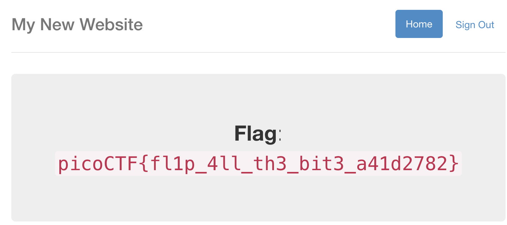
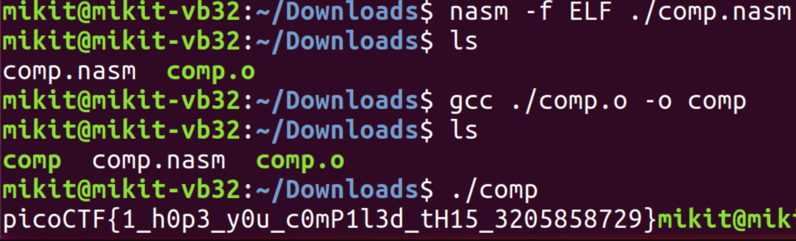

[picoCTF 2018 Writeup](index.md) 第3弾として、残り物系のWriteupです。最後のあたりはとても辛かった...

- [Secure Logon](#secure-logon)
- [script me](#script-me)
- [assembly-4](#assembly-4)
- [Help Me Reset 2](#help-me-reset-2)
- [special-pw](#special-pw)
- [circuit123](#circuit123)

# Secure Logon
Adminとしてログインすればフラグが貰える系のWebサイトが与えられる。当然ユーザー名をAdminにするとログインできない。ここはひとまずユーザー名とパスワードを空欄にしてログインする。

Base64形式でセッションがCookieに入るので取り敢えずHexにデコードしておく。
```
6/535xSVDFKLZ7FwLOBUwkskXj6GVjrk13ScJf6fBAXy7U07kkItwuF7zG9NVkB/lRXKRG2Ow4T+23UYvFVxXw==
```
```
eb fe 77 e7 14 95 0c 52 8b 67 b1 70 2c e0 54 c2 
4b 24 5e 3e 86 56 3a e4 d7 74 9c 25 fe 9f 04 05
f2 ed 4d 3b 92 42 2d c2 e1 7b cc 6f 4d 56 40 7f
95 15 ca 44 6d 8e c3 84 fe db 75 18 bc 55 71 5f
```
さて、これが何を暗号化した値なのかは、実はページに表示されている。


なるほど、ユーザー名とパスワードと管理者フラグが入ったjsonを暗号化しているらしい。但し、この表示は実は罠で、ソースコードを確認するとjsonのキーは辞書順でソートされている。ここにつまづいて少し時間を無駄にした。

<!-- details><summary>python</summary -->

```python
from flask import Flask, render_template, request, url_for, redirect, make_response, flash
import json
from hashlib import md5
from base64 import b64decode
from base64 import b64encode
from Crypto import Random
from Crypto.Cipher import AES

app = Flask(__name__)
app.secret_key = 'seed removed'
flag_value = 'flag removed'

BLOCK_SIZE = 16  # Bytes
pad = lambda s: s + (BLOCK_SIZE - len(s) % BLOCK_SIZE) * \
                chr(BLOCK_SIZE - len(s) % BLOCK_SIZE)
unpad = lambda s: s[:-ord(s[len(s) - 1:])]


@app.route("/")
def main():
    return render_template('index.html')

@app.route('/login', methods=['GET', 'POST'])
def login():
    if request.form['user'] == 'admin':
        message = "I'm sorry the admin password is super secure. You're not getting in that way."
        category = 'danger'
        flash(message, category)
        return render_template('index.html')
    resp = make_response(redirect("/flag"))

    cookie = {}
    cookie['password'] = request.form['password']
    cookie['username'] = request.form['user']
    cookie['admin'] = 0
    print(cookie)
    cookie_data = json.dumps(cookie, sort_keys=True) #これが罠
    encrypted = AESCipher(app.secret_key).encrypt(cookie_data)
    print(encrypted)
    resp.set_cookie('cookie', encrypted)
    return resp

@app.route('/logout')
def logout():
    resp = make_response(redirect("/"))
    resp.set_cookie('cookie', '', expires=0)
    return resp

@app.route('/flag', methods=['GET'])
def flag():
  try:
      encrypted = request.cookies['cookie']
  except KeyError:
      flash("Error: Please log-in again.")
      return redirect(url_for('main'))
  data = AESCipher(app.secret_key).decrypt(encrypted)
  data = json.loads(data)

  try:
     check = data['admin']
  except KeyError:
     check = 0
  if check == 1:
      return render_template('flag.html', value=flag_value)
  flash("Success: You logged in! Not sure you'll be able to see the flag though.", "success")
  return render_template('not-flag.html', cookie=data)

class AESCipher:
    """
    Usage:
        c = AESCipher('password').encrypt('message')
        m = AESCipher('password').decrypt(c)
    Tested under Python 3 and PyCrypto 2.6.1.
    """

    def __init__(self, key):
        self.key = md5(key.encode('utf8')).hexdigest()

    def encrypt(self, raw):
        raw = pad(raw)
        iv = Random.new().read(AES.block_size)
        cipher = AES.new(self.key, AES.MODE_CBC, iv)
        return b64encode(iv + cipher.encrypt(raw))

    def decrypt(self, enc):
        enc = b64decode(enc)
        iv = enc[:16]
        cipher = AES.new(self.key, AES.MODE_CBC, iv)
        return unpad(cipher.decrypt(enc[16:])).decode('utf8')

if __name__ == "__main__":
    app.run()
```

<!-- /details -->

ソースからCBCモードで暗号化されていることがわかる。つまり、先ほどの暗号文は次のような構造になっていた。

```
eb fe 77 e7 14 95 0c 52 8b 67 b1 70 2c e0 54 c2 <- IV
4b 24 5e 3e 86 56 3a e4 d7 74 9c 25 fe 9f 04 05 <- {'admin': 0, 'pa
f2 ed 4d 3b 92 42 2d c2 e1 7b cc 6f 4d 56 40 7f <- ssword': '', 'us
95 15 ca 44 6d 8e c3 84 fe db 75 18 bc 55 71 5f <- ername': ''}
```

初期ベクトルのビットを反転すると、第一ブロックの平文の対応するビットも反転するので、IVを次のように変更する。

```
eb fe 77 e7 14 95 0c 52 8b 67 |b0| 70 2c e0 54 c2 <- IV
4b 24 5e 3e 86 56 3a e4 d7 74 |9c| 25 fe 9f 04 05 <- {'admin': 1, 'pa
f2 ed 4d 3b 92 42 2d c2 e1 7b |cc| 6f 4d 56 40 7f <- ssword': '?, 'us
95 15 ca 44 6d 8e c3 84 fe db |75| 18 bc 55 71 5f <- ername': '?}
```
これを再びbase64エンコードすると`6/535xSVDFKLZ7BwLOBUwkskXj6GVjrk13ScJf6fBAXy7U07kkItwuF7zG9NVkB/lRXKRG2Ow4T+23UYvFVxXw==`となるので、これをCookieにセットしてアクセスすればフラグが得られる。



`picoCTF{fl1p_4ll_th3_bit3_a41d2782}`

# script me
やったープログラミングするだけ問題だー！心の癒しだ〜〜〜〜！

はい。ということで、この問題はある法則に従って`()`のみからなる文字列同士の連結を行なった結果を出力せよという問題でした。法則は以下の通りです。

- 文字列の加法は左結合(左から順に計算する)
- ある文字列の項に対して、その深さをもっとも多い`()`のネストの数とする(例えば`(()(())())`なら3)
- 深さが同じ文字列同士の加法については、単純に文字列同士を連結したものとする。
- 深さが異なる文字列同士の加法については、深さが深い方の文字列の最も浅い括弧の内側に深さの浅い方の文字列を挿入したものとする。(例えば`() + (()) = (()())`)

これをプログラムにすると

<!-- details><summary>java</summary -->

```java
import java.io.PrintStream;
import java.net.Socket;
import java.util.Arrays;
import java.util.Scanner;
import java.util.function.ToIntFunction;
import java.util.stream.IntStream;

public class Main2 {

    public static void main(String[] args) throws Exception {
        Socket socket = new Socket("2018shell2.picoctf.com", 1542);
        PrintStream w = new PrintStream(socket.getOutputStream());

        Scanner sc = new Scanner(socket.getInputStream());
        IntStream.rangeClosed(0, 10).mapToObj(i -> sc.nextLine()).forEach(System.out::println);

        while (true) {
            IntStream.rangeClosed(0, 2).mapToObj(i -> sc.nextLine()).forEach(System.out::println);
            String init = sc.nextLine();
            init = init.substring(0, init.length() - 6);
            sc.nextLine();
            String[] s = Arrays.stream(init.split("\\+")).map(String::trim).toArray(String[]::new);
            ToIntFunction<String> depth = t -> {
                int a = 0;
                int c = 0;
                for (int i = 0; i < t.length(); i++) {
                    if (t.charAt(i) == '(') {
                        c++;
                        a = Math.max(a, c);
                    } else {
                        c--;
                    }
                }
                return a;
            };

            while (s.length > 1) {
                String next;
                if (depth.applyAsInt(s[0]) > depth.applyAsInt(s[1])) {
                    next = s[0].substring(0, s[0].length() - 1) + s[1] + ")";
                } else if (depth.applyAsInt(s[0]) < depth.applyAsInt(s[1])) {
                    next = "(" + s[0] + s[1].substring(1);
                } else {
                    next = s[0] + s[1];
                }
                String[] ns = new String[s.length - 1];
                System.arraycopy(s, 2, ns, 1, s.length - 2);
                ns[0] = next;
                s = ns;
            }
            w.println(s[0]);
            System.out.println(s[0]);
        }
    }
}
```

<!-- /details -->

実行結果は次の通り。

<!-- details><summary>log</summary -->

```
Rules:
() + () = ()()                                      => [combine]
((())) + () = ((())())                              => [absorb-right]
() + ((())) = (()(()))                              => [absorb-left]
(())(()) + () = (())(()())                          => [combined-absorb-right]
() + (())(()) = (()())(())                          => [combined-absorb-left]
(())(()) + ((())) = ((())(())(()))                  => [absorb-combined-right]
((())) + (())(()) = ((())(())(()))                  => [absorb-combined-left]
() + (()) + ((())) = (()()) + ((())) = ((()())(())) => [left-associative]

Example: 
(()) + () = () + (()) = (()())

Let's start with a warmup.
(()()()()()())
> Correct!

Okay, now we're cookin!
()()()()()()
> Correct!

Alright see if you can get this one.
(()())(())(()())(()())(()()()()()()()())
> Correct!

This one's a little bigger!
(((()()()(())()()()()())()(())((()))(((())))((((())))))((()(())((()))(((())))()()))()()()()((())())((())())(()()())(()(()))(()(((()()())()())()())))
> Correct!

Ha. No more messin around. Final Round.
(((()(())())()(())((()))(((())))((((())))))((())(()()()()()()()())((((()))))(((())))((()))(())())((()()(()))(()()()(())()())((((()))))(((())))((()))(())())((()()()()()())()(())((()))(((())))((((()))))(()()()()))(()()())((()(())((()))(((())))()()))()(((((()))))(((())))((()))(())()))(()((()(())((()))(((())))()()))()(()(())((()))(((())))((((())))))(()(())()(()()())))(((()())()(())(()))((()(())((()))(((())))()()))()(((()())()()()(())()())()(((()()())()())()())))((()()()()()())((()(())((()))(((())))()()))()((()(())()()()())((((()))))(((())))((()))(())())(()()()()())(()()()()()()()())(((()()()()()()()())((()())()())())()(((()()())()())()())))(((()()()(())()())()(((()()())()())()()))((()(())((()))(((())))()()))()(((()()()())()()()(())()())((((()))))(((())))((()))(())())(()()()())(()()())((()(())())(()()()(())()())((()())()())())((()())()(()))((())()()()))((()()()((()())()())())((()(())((()))(((())))()()))()((()())(()()())()(())((()))(((())))((((())))))((()()()()()()()(())()())((((()))))(((())))((()))(())())((()()(())(()()()()()()()()))((()())()())())(((()()()()()()()())()()()(())()())((((()))))(((())))((()))(())())(()()()()()()()()()()())((()(())()())()(((()()())()())()()))((()())()(()))(((()()())()()()(())()())()(((()()())()())()()))(((()())()()()(())()())((()())()())())((()(())()(()()()))((((()))))(((())))((()))(())()))((()()()())((()(())((()))(((())))()()))()((())(()()())()(((()()())()())()()))((()()()()()()()()()()())()()()(())()())((()())()(())()()()(())))(((()()()()()()()()())()()()(())()())((()(())((()))(((())))()()))())((()()()()())((()(())((()))(((())))()()))()(((())()(()()()))((((()))))(((())))((()))(())())((()())(())()(()()()))((()()()()()()()())()(((()()())()())()()))(((((()())()())())()(((()()())()())()()))()(())((()))(((())))((((())))))((()())(()()()()()()()())()(())((()))(((())))((((()))))))(((()()()()()()()()())((()())()())())((()(())((()))(((())))()()))())((())(()()()()()()()())((()(())((()))(((())))()()))()(()())(()()())(()()()()()()()()))(()()()((()(())((()))(((())))()()))()(((((()))))(((())))((()))(())()))(((()())()(()))((()(())((()))(((())))()()))()(()(())((()))(((())))((((())))))((()()()()()()()())((((()))))(((())))((()))(())())((()()()())(()()()()()()()())((((()))))(((())))((()))(())()))(((()()()()(())()())()(((()()())()())()()))((()(())((()))(((())))()()))()((()())()(())((()))(((())))((((()))))))
> Correct!
Exception in thread "main" java.util.NoSuchElementException: No line found

	at java.base/java.util.Scanner.nextLine(Scanner.java:1651)
	at Main2.main(Main2.java:19)
Congratulations, here's your flag: picoCTF{5cr1pt1nG_l1k3_4_pRo_0466cdd7}
```

<!-- /details -->

例外が出てもフラグが貰えればよかろうなのだ

# assembly-4
Reversingですが流石にこれは長すぎてJavaに翻訳する気も起きませんでした。ただ、google先生曰く`.nasm`ファイルはコンパイルできるとのことなので、コンパイルしてみると実行することができました。



`picoCTF{1_h0p3_y0u_c0mP1l3d_tH15_3205858729}`

# Help Me Reset 2
ユーザー名のリセットフォームが存在するページが与えられるので、取り敢えず誰のものでもいいからユーザー名が知りたい気持ちになります。SQLi等でごにょごにょするのかと最初は思ったのですが、(掲示板を見ると)ページのソースに何か書いてあるということなので、ページのソースを覗いてみましょう。

<!-- details><summary>html</summary -->

```html

<!doctype html>
<title></title>
<link rel="stylesheet" href="/static/css/style.css">
<link rel="stylesheet" href="/static/css/bootstrap.css">
<link rel="javascript" href="/static/js/bootstrap.js">
<link rel="javascript" href="/static/js/jquery.min.js">
<div class="d-flex flex-column flex-md-row align-items-center p-3 px-md-4 mb-3 bg-white border-bottom box-shadow">
  <h5 class="my-0 mr-md-auto font-weight-normal"><a href="/">Big Service Inc.</a></h1>
  <nav class="my-2 my-md-0 mr-md-3">  
    
      <a href="/login">Log In</a>
    
    </nav>
</div>
<section class="content">
  <div class="container">
  <header>
    
  </header>
  
  
<div class="pricing-header px-3 py-3 pt-md-5 pb-md-4 mx-auto text-center">
    <h1 class="display-4">Pricing</h1>
    <p class="lead">We provide big data for the Big Learning. Lean more about our options with the data plans below.</p>
</div>
<div class="container">
    <div class="card-deck mb-3 text-center">
        <div class="card mb-4 box-shadow">
        <div class="card-header">
            <h4 class="my-0 font-weight-normal">Free</h4>
        </div>
        <div class="card-body">
            <h1 class="card-title pricing-card-title">$0 <small class="text-muted">/ mo</small></h1>
            <ul class="list-unstyled mt-3 mb-4">
            <li>10 Big Data Bots included</li>
            <li>2 GB of data provided</li>
            <li>Email support</li>
            <li>Help center access</li>
            </ul>
            <button type="button" class="btn btn-lg btn-block btn-outline-primary">Sign up for free</button>
        </div>
        </div>
        <div class="card mb-4 box-shadow">
        <div class="card-header">
            <h4 class="my-0 font-weight-normal">Pro</h4>
        </div>
        <div class="card-body">
            <h1 class="card-title pricing-card-title">$15 <small class="text-muted">/ mo</small></h1>
            <ul class="list-unstyled mt-3 mb-4">
            <li>20 Big Data Bots included</li>
            <li>10 GB of data provided</li>
            <li>Priority email support</li>
            <li>Help center access</li>
            </ul>
            <button type="button" class="btn btn-lg btn-block btn-primary">Get started</button>
        </div>
        </div>
        <div class="card mb-4 box-shadow">
        <div class="card-header">
            <h4 class="my-0 font-weight-normal">Enterprise</h4>
        </div>
        <div class="card-body">
            <h1 class="card-title pricing-card-title">$29 <small class="text-muted">/ mo</small></h1>
            <ul class="list-unstyled mt-3 mb-4">
            <li>30 Big Data Bots included</li>
            <li>15 GB of data provided</li>
            <li>Phone and email support</li>
            <li>Help center access</li>
            </ul>
            <button type="button" class="btn btn-lg btn-block btn-primary">Contact us</button>
        </div>
        </div>
    </div>
</div>
<!--Proudly maintained by kant-->

  </div>
</section>
```

<!-- /details -->

ということで、`<!--Proudly maintained by kant-->`に着目することで`kant`というユーザーが存在していることを把握することができます。パスワードリセットフォームにユーザー名を入れると、いくつかの質問が飛んでくるので、それっぽい答えを人力総当たりで入力していきます。ちなみに、3回間違えるとアカウントがロックされるという脅しがありますが、cookieを消せばいいだけの話でした。最終的に、`Favorite color`という質問に対して`pink`と3回答えることでパスワードのリセットに成功しました。運ゲーかな?


`picoCTF{i_thought_i_could_remember_those_e3063a8a}`

# special-pw
問題は以下のプログラムに与える適切な引数を考えるもの。

<!-- details><summary>assembly</summary -->

```
.intel_syntax noprefix
.bits 32
	
.global main	; int main(int argc, char **argv)

main:
	push   ebp
	mov    ebp,esp
	sub    esp,0x10
	mov    DWORD PTR [ebp-0xc],0x0
	mov    eax,DWORD PTR [ebp+0xc]
	mov    eax,DWORD PTR [eax+0x4]
	mov    DWORD PTR [ebp-0x4],eax
	jmp    part_b
part_a:
	add    DWORD PTR [ebp-0xc],0x1
	add    DWORD PTR [ebp-0x4],0x1
part_b:	
	mov    eax,DWORD PTR [ebp-0x4]
	movzx  eax,BYTE PTR [eax]
	test   al,al
	jne    part_a
	mov    DWORD PTR [ebp-0x8],0x0
	jmp    part_d
part_c:	
	mov    eax,DWORD PTR [ebp+0xc]
	add    eax,0x4
	mov    edx,DWORD PTR [eax]
	mov    eax,DWORD PTR [ebp-0x8]
	add    eax,edx
	mov    DWORD PTR [ebp-0x4],eax
	mov    eax,DWORD PTR [ebp-0x4]
	movzx  eax,BYTE PTR [eax]
	xor    eax,0x9d
	mov    edx,eax
	mov    eax,DWORD PTR [ebp-0x4]
	mov    BYTE PTR [eax],dl
	mov    eax,DWORD PTR [ebp-0x4]
	movzx  eax,WORD PTR [eax]
	ror    ax,0x5
	mov    edx,eax
	mov    eax,DWORD PTR [ebp-0x4]
	mov    WORD PTR [eax],dx
	mov    eax,DWORD PTR [ebp-0x4]
	mov    eax,DWORD PTR [eax]
	rol    eax,0xb
	mov    edx,eax
	mov    eax,DWORD PTR [ebp-0x4]
	mov    DWORD PTR [eax],edx
	add    DWORD PTR [ebp-0x8],0x1
part_d:	
	mov    eax,DWORD PTR [ebp-0xc]
	sub    eax,0x3
	cmp    eax,DWORD PTR [ebp-0x8]
	jg     part_c
	mov    eax,DWORD PTR [ebp+0xc]
	mov    eax,DWORD PTR [eax+0x4]
	mov    DWORD PTR [ebp-0x4],eax
	mov    DWORD PTR [ebp-0x10],0x14890ba
	jmp    part_f
part_e:	
	mov    eax,DWORD PTR [ebp-0x4]
	movzx  edx,BYTE PTR [eax]
	mov    eax,DWORD PTR [ebp-0x10]
	movzx  eax,BYTE PTR [eax]
	cmp    dl,al
	je     part_k
	mov    eax,0x0
	jmp    part_h
part_k:	
	add    DWORD PTR [ebp-0x4],0x1
	add    DWORD PTR [ebp-0x10],0x1
part_f:	
	mov    eax,DWORD PTR [ebp-0x10]
	movzx  eax,BYTE PTR [eax]
	test   al,al
	jne    part_e
	mov    eax,DWORD PTR [ebp+0xc]
	add    eax,0x4
	mov    eax,DWORD PTR [eax]
	mov    edx,DWORD PTR [ebp-0x10]
	mov    ecx,0x14890ba
	sub    edx,ecx
	add    eax,edx
	movzx  eax,BYTE PTR [eax]
	test   al,al
	je     part_g
	mov    eax,0x0			; LOGIN_FAILED
	jmp    part_h
part_g:	
	mov    eax,0x1			; LOGIN_SUCCESS
part_h:	
	leave
	ret


014890BA:  7b 18 a6 36 da 3b 2b a6  fe cb 82 ae 96 ff 9f 46   |{..6.;+........F|
014890CA:  8f 36 a7 af fe 93 8e 3f  46 a7 ff 82 cf ce b3 97   |.6.....?F.......|
014890DA:  17 1a a7 36 ef 2b 8a ed  00                        |...6.+...|
```

<!-- /details -->

取り敢えずアセンブリをぶりぶり読んでいくと、入力に与えられた引数に対して*ある処理*を行い、その結果を問題のファイルに記載されている謎のデータと比較していることがわかります。つまり、謎のデータに対して*ある処理*を逆順で施せばフラグが得られるということですね。

肝心の*ある処理*が全くわからなかったのだけれど、eiya君がアセンブリをオブジェクトファイルに変換してくれたので、disasツールでバリバリ読み込んでいくことができるようになった。毎度のようにJavaに翻訳する作業が始まった訳で。頭のいい人はC言語とかに翻訳した方が100倍効率が良いことを知っているのだろうけど、0個のC言語を操るmikit君にはそれができませんでした。ということで、Javaで`boolean`配列を使って仮想敵にメモリを実装し、それに対してアセンブリに書いてあるコードを再現するという頭の悪いムーヴになっております。

<!-- details><summary>java</summary -->

```java
public class SpecialPW {
    private static byte[] INITIAL_MEMORY = {
            (byte) 0x7b, (byte) 0x18, (byte) 0xa6, (byte) 0x36, (byte) 0xda, (byte) 0x3b, (byte) 0x2b, (byte) 0xa6,
            (byte) 0xfe, (byte) 0xcb, (byte) 0x82, (byte) 0xae, (byte) 0x96, (byte) 0xff, (byte) 0x9f, (byte) 0x46,
            (byte) 0x8f, (byte) 0x36, (byte) 0xa7, (byte) 0xaf, (byte) 0xfe, (byte) 0x93, (byte) 0x8e, (byte) 0x3f,
            (byte) 0x46, (byte) 0xa7, (byte) 0xff, (byte) 0x82, (byte) 0xcf, (byte) 0xce, (byte) 0xb3, (byte) 0x97,
            (byte) 0x17, (byte) 0x1a, (byte) 0xa7, (byte) 0x36, (byte) 0xef, (byte) 0x2b, (byte) 0x8a, (byte) 0xed,
    };

    public static void main(String[] args) {
        VirtualMemory m = new VirtualMemory(INITIAL_MEMORY.length);
        for (int i = 0; i < INITIAL_MEMORY.length; i++) {
            m.setByte(i, INITIAL_MEMORY[i]);
            System.out.println(Integer.toHexString(m.getByte(i)));
        }

        for (int i = m.length() - 4; i >= 0; i--) {
            m.rotateRight(i, 32, 11);
            m.rotateLeft(i, 16, 5);
            m.setByte(i, (byte) (m.getByte(i) ^ 0x9d & 0xff));
        }
        for (int i = 0; i < m.length(); i++) {
            System.out.print((char) (m.getByte(i)));
        }
    }

    private static class VirtualMemory {
        final boolean[] memory;

        VirtualMemory(int size) {
            this.memory = new boolean[size * 8];
        }

        long getNumber(int index, int length) {
            long res = 0;
            for (int i = 0; i < length; i++) {
                if (memory[index * 8 + i]) {
                    res |= (1 << i);
                }
            }
            return res;
        }

        void setNumber(int index, int length, long value) {
            for (int i = 0; i < length; i++) {
                memory[index * 8 + i] = (value & 1) == 1;
                value = value >>> 1;
            }
        }

        byte getByte(int index) {
            return (byte) getNumber(index, 8);
        }

        void setByte(int index, byte value) {
            setNumber(index, 8, Byte.toUnsignedLong(value));
        }

        short getShort(int index) {
            return (short) getNumber(index, 16);
        }

        void setShort(int index, short value) {
            setNumber(index, 16, Short.toUnsignedLong(value));
        }

        int getInt(int index) {
            return (int) getNumber(index, 32);
        }

        void setInt(int index, int value) {
            setNumber(index, 32, Integer.toUnsignedLong(value));
        }

        void rotateLeft(int index, int length, int d) {
            boolean[] update = new boolean[length];
            for (int i = 0; i < length; i++) {
                update[(i + d) % length] = memory[index * 8 + i];
            }
            System.arraycopy(update, 0, memory, index * 8, length);
        }

        void rotateRight(int index, int length, int d) {
            rotateLeft(index, length, length - d);
        }

        int length() {
            return memory.length / 8;
        }
    }
}
```

<!-- /details -->

`picoCTF{gEt_y0Ur_sH1fT5_r1gHt_09962bc4f}`

# circuit123
なんとなくこの問題が一番好き。

> Can you crack the key to decrypt map2 for us? The key to map1 is 11443513758266689915

取り敢えず復号化ツールを読んでみる。

<!-- details><summary>decrypt.py</summary -->

```python
#!/usr/bin/python2

from hashlib import sha512
import sys

def verify(x, chalbox):
    length, gates, check = chalbox
    b = [(x >> i) & 1 for i in range(length)]
    for name, args in gates:
        if name == 'true':
            b.append(1)
        else:
            u1 = b[args[0][0]] ^ args[0][1]
            u2 = b[args[1][0]] ^ args[1][1]
            if name == 'or':
                b.append(u1 | u2)
            elif name == 'xor':
                b.append(u1 ^ u2)
    return b[check[0]] ^ check[1]
    
def dec(x, w):
    z = int(sha512(str(int(x))).hexdigest(), 16)
    return '{:x}'.format(w ^ z).decode('hex')

if __name__ == '__main__':
    if len(sys.argv) < 3:
        print 'Usage: ' + sys.argv[0] + ' <key> <map.txt>'
        print 'Example: Try Running ' + sys.argv[0] + ' 11443513758266689915 map1.txt'
        exit(1)
    with open(sys.argv[2], 'r') as f:
        cipher, chalbox = eval(f.read())
    
    key = int(sys.argv[1]) % (1 << chalbox[0])
    print 'Attempting to decrypt ' + sys.argv[2] + '...'
    if verify(key, chalbox):
        print 'Congrats the flag for ' + sys.argv[2] + ' is:', dec(key, cipher)
    else:
        print 'Wrong key for ' + sys.argv[2] + '.'
```

<!-- /details -->

ざっくりと動作を説明するならば、与えられた秘密鍵を初期領域にバイナリとして格納した後に、それ以降の領域についてそれ以前の領域にセットされた値の`OR`や`XOR`を格納している。最後に、指定されたビットが立っているかどうかで秘密鍵の正当性を検証しているようだ。試しに鍵が与えられている`map1.txt`でもう少し詳しい動作を見てみよう。

<!-- details><summary>map1.txt</summary -->

```python
(1091562780682878452932647567206562803258945860781462102555439111325671293639822353361220777655154004326830877696329866178864341430343894025596404608627826L, (64, [('true', []), ('xor', [(0, False), (64, False)]), ('xor', [(65, False), (64, True)]), ('or', [(64, True), (64, False)]), ('or', [(0, True), (64, False)]), ('or', [(67, True), (68, True)]), ('or', [(0, True), (64, True)]), ('or', [(69, False), (70, True)]), ('xor', [(1, False), (64, False)]), ('xor', [(72, False), (71, False)]), ('or', [(64, True), (71, True)]), ('or', [(1, True), (71, True)]), ('or', [(74, True), (75, True)]), ('or', [(1, True), (64, True)]), ('or', [(76, False), (77, True)]), ('xor', [(2, False), (64, False)]), ('xor', [(79, False), (78, False)]), ('or', [(64, True), (78, True)]), ('or', [(2, True), (78, True)]), ('or', [(81, True), (82, True)]), ('or', [(2, True), (64, True)]), ('or', [(83, False), (84, True)]), ('xor', [(3, False), (64, True)]), ('xor', [(86, False), (85, False)]), ('or', [(64, False), (85, True)]), ('or', [(3, True), (85, True)]), ('or', [(88, True), (89, True)]), ('or', [(3, True), (64, False)]), ('or', [(90, False), (91, True)]), ('xor', [(4, False), (64, False)]), ('xor', [(93, False), (92, False)]), ('or', [(64, True), (92, True)]), ('or', [(4, True), (92, True)]), ('or', [(95, True), (96, True)]), ('or', [(4, True), (64, True)]), ('or', [(97, False), (98, True)]), ('xor', [(5, False), (64, True)]), ('xor', [(100, False), (99, False)]), ('or', [(64, False), (99, True)]), ('or', [(5, True), (99, True)]), ('or', [(102, True), (103, True)]), ('or', [(5, True), (64, False)]), ('or', [(104, False), (105, True)]), ('xor', [(6, False), (64, False)]), ('xor', [(107, False), (106, False)]), ('or', [(64, True), (106, True)]), ('or', [(6, True), (106, True)]), ('or', [(109, True), (110, True)]), ('or', [(6, True), (64, True)]), ('or', [(111, False), (112, True)]), ('xor', [(7, False), (64, False)]), ('xor', [(114, False), (113, False)]), ('or', [(64, True), (113, True)]), ('or', [(7, True), (113, True)]), ('or', [(116, True), (117, True)]), ('or', [(7, True), (64, True)]), ('or', [(118, False), (119, True)]), ('xor', [(8, False), (64, False)]), ('xor', [(121, False), (120, False)]), ('or', [(64, True), (120, True)]), ('or', [(8, True), (120, True)]), ('or', [(123, True), (124, True)]), ('or', [(8, True), (64, True)]), ('or', [(125, False), (126, True)]), ('xor', [(9, False), (64, False)]), ('xor', [(128, False), (127, False)]), ('or', [(64, True), (127, True)]), ('or', [(9, True), (127, True)]), ('or', [(130, True), (131, True)]), ('or', [(9, True), (64, True)]), ('or', [(132, False), (133, True)]), ('xor', [(10, False), (64, False)]), ('xor', [(135, False), (134, False)]), ('or', [(64, True), (134, True)]), ('or', [(10, True), (134, True)]), ('or', [(137, True), (138, True)]), ('or', [(10, True), (64, True)]), ('or', [(139, False), (140, True)]), ('xor', [(11, False), (64, True)]), ('xor', [(142, False), (141, False)]), ('or', [(64, False), (141, True)]), ('or', [(11, True), (141, True)]), ('or', [(144, True), (145, True)]), ('or', [(11, True), (64, False)]), ('or', [(146, False), (147, True)]), ('xor', [(12, False), (64, True)]), ('xor', [(149, False), (148, False)]), ('or', [(64, False), (148, True)]), ('or', [(12, True), (148, True)]), ('or', [(151, True), (152, True)]), ('or', [(12, True), (64, False)]), ('or', [(153, False), (154, True)]), ('xor', [(13, False), (64, False)]), ('xor', [(156, False), (155, False)]), ('or', [(64, True), (155, True)]), ('or', [(13, True), (155, True)]), ('or', [(158, True), (159, True)]), ('or', [(13, True), (64, True)]), ('or', [(160, False), (161, True)]), ('xor', [(14, False), (64, True)]), ('xor', [(163, False), (162, False)]), ('or', [(64, False), (162, True)]), ('or', [(14, True), (162, True)]), ('or', [(165, True), (166, True)]), ('or', [(14, True), (64, False)]), ('or', [(167, False), (168, True)]), ('xor', [(15, False), (64, True)]), ('xor', [(170, False), (169, False)]), ('or', [(64, False), (169, True)]), ('or', [(15, True), (169, True)]), ('or', [(172, True), (173, True)]), ('or', [(15, True), (64, False)]), ('or', [(174, False), (175, True)]), ('xor', [(16, False), (64, True)]), ('xor', [(177, False), (176, False)]), ('or', [(64, False), (176, True)]), ('or', [(16, True), (176, True)]), ('or', [(179, True), (180, True)]), ('or', [(16, True), (64, False)]), ('or', [(181, False), (182, True)]), ('xor', [(17, False), (64, True)]), ('xor', [(184, False), (183, False)]), ('or', [(64, False), (183, True)]), ('or', [(17, True), (183, True)]), ('or', [(186, True), (187, True)]), ('or', [(17, True), (64, False)]), ('or', [(188, False), (189, True)]), ('xor', [(18, False), (64, True)]), ('xor', [(191, False), (190, False)]), ('or', [(64, False), (190, True)]), ('or', [(18, True), (190, True)]), ('or', [(193, True), (194, True)]), ('or', [(18, True), (64, False)]), ('or', [(195, False), (196, True)]), ('xor', [(19, False), (64, False)]), ('xor', [(198, False), (197, False)]), ('or', [(64, True), (197, True)]), ('or', [(19, True), (197, True)]), ('or', [(200, True), (201, True)]), ('or', [(19, True), (64, True)]), ('or', [(202, False), (203, True)]), ('xor', [(20, False), (64, True)]), ('xor', [(205, False), (204, False)]), ('or', [(64, False), (204, True)]), ('or', [(20, True), (204, True)]), ('or', [(207, True), (208, True)]), ('or', [(20, True), (64, False)]), ('or', [(209, False), (210, True)]), ('xor', [(21, False), (64, False)]), ('xor', [(212, False), (211, False)]), ('or', [(64, True), (211, True)]), ('or', [(21, True), (211, True)]), ('or', [(214, True), (215, True)]), ('or', [(21, True), (64, True)]), ('or', [(216, False), (217, True)]), ('xor', [(22, False), (64, True)]), ('xor', [(219, False), (218, False)]), ('or', [(64, False), (218, True)]), ('or', [(22, True), (218, True)]), ('or', [(221, True), (222, True)]), ('or', [(22, True), (64, False)]), ('or', [(223, False), (224, True)]), ('xor', [(23, False), (64, False)]), ('xor', [(226, False), (225, False)]), ('or', [(64, True), (225, True)]), ('or', [(23, True), (225, True)]), ('or', [(228, True), (229, True)]), ('or', [(23, True), (64, True)]), ('or', [(230, False), (231, True)]), ('xor', [(24, False), (64, True)]), ('xor', [(233, False), (232, False)]), ('or', [(64, False), (232, True)]), ('or', [(24, True), (232, True)]), ('or', [(235, True), (236, True)]), ('or', [(24, True), (64, False)]), ('or', [(237, False), (238, True)]), ('xor', [(25, False), (64, False)]), ('xor', [(240, False), (239, False)]), ('or', [(64, True), (239, True)]), ('or', [(25, True), (239, True)]), ('or', [(242, True), (243, True)]), ('or', [(25, True), (64, True)]), ('or', [(244, False), (245, True)]), ('xor', [(26, False), (64, True)]), ('xor', [(247, False), (246, False)]), ('or', [(64, False), (246, True)]), ('or', [(26, True), (246, True)]), ('or', [(249, True), (250, True)]), ('or', [(26, True), (64, False)]), ('or', [(251, False), (252, True)]), ('xor', [(27, False), (64, True)]), ('xor', [(254, False), (253, False)]), ('or', [(64, False), (253, True)]), ('or', [(27, True), (253, True)]), ('or', [(256, True), (257, True)]), ('or', [(27, True), (64, False)]), ('or', [(258, False), (259, True)]), ('xor', [(28, False), (64, False)]), ('xor', [(261, False), (260, False)]), ('or', [(64, True), (260, True)]), ('or', [(28, True), (260, True)]), ('or', [(263, True), (264, True)]), ('or', [(28, True), (64, True)]), ('or', [(265, False), (266, True)]), ('xor', [(29, False), (64, True)]), ('xor', [(268, False), (267, False)]), ('or', [(64, False), (267, True)]), ('or', [(29, True), (267, True)]), ('or', [(270, True), (271, True)]), ('or', [(29, True), (64, False)]), ('or', [(272, False), (273, True)]), ('xor', [(30, False), (64, False)]), ('xor', [(275, False), (274, False)]), ('or', [(64, True), (274, True)]), ('or', [(30, True), (274, True)]), ('or', [(277, True), (278, True)]), ('or', [(30, True), (64, True)]), ('or', [(279, False), (280, True)]), ('xor', [(31, False), (64, True)]), ('xor', [(282, False), (281, False)]), ('or', [(64, False), (281, True)]), ('or', [(31, True), (281, True)]), ('or', [(284, True), (285, True)]), ('or', [(31, True), (64, False)]), ('or', [(286, False), (287, True)]), ('xor', [(32, False), (64, True)]), ('xor', [(289, False), (288, False)]), ('or', [(64, False), (288, True)]), ('or', [(32, True), (288, True)]), ('or', [(291, True), (292, True)]), ('or', [(32, True), (64, False)]), ('or', [(293, False), (294, True)]), ('xor', [(33, False), (64, False)]), ('xor', [(296, False), (295, False)]), ('or', [(64, True), (295, True)]), ('or', [(33, True), (295, True)]), ('or', [(298, True), (299, True)]), ('or', [(33, True), (64, True)]), ('or', [(300, False), (301, True)]), ('xor', [(34, False), (64, False)]), ('xor', [(303, False), (302, False)]), ('or', [(64, True), (302, True)]), ('or', [(34, True), (302, True)]), ('or', [(305, True), (306, True)]), ('or', [(34, True), (64, True)]), ('or', [(307, False), (308, True)]), ('xor', [(35, False), (64, False)]), ('xor', [(310, False), (309, False)]), ('or', [(64, True), (309, True)]), ('or', [(35, True), (309, True)]), ('or', [(312, True), (313, True)]), ('or', [(35, True), (64, True)]), ('or', [(314, False), (315, True)]), ('xor', [(36, False), (64, False)]), ('xor', [(317, False), (316, False)]), ('or', [(64, True), (316, True)]), ('or', [(36, True), (316, True)]), ('or', [(319, True), (320, True)]), ('or', [(36, True), (64, True)]), ('or', [(321, False), (322, True)]), ('xor', [(37, False), (64, True)]), ('xor', [(324, False), (323, False)]), ('or', [(64, False), (323, True)]), ('or', [(37, True), (323, True)]), ('or', [(326, True), (327, True)]), ('or', [(37, True), (64, False)]), ('or', [(328, False), (329, True)]), ('xor', [(38, False), (64, True)]), ('xor', [(331, False), (330, False)]), ('or', [(64, False), (330, True)]), ('or', [(38, True), (330, True)]), ('or', [(333, True), (334, True)]), ('or', [(38, True), (64, False)]), ('or', [(335, False), (336, True)]), ('xor', [(39, False), (64, False)]), ('xor', [(338, False), (337, False)]), ('or', [(64, True), (337, True)]), ('or', [(39, True), (337, True)]), ('or', [(340, True), (341, True)]), ('or', [(39, True), (64, True)]), ('or', [(342, False), (343, True)]), ('xor', [(40, False), (64, True)]), ('xor', [(345, False), (344, False)]), ('or', [(64, False), (344, True)]), ('or', [(40, True), (344, True)]), ('or', [(347, True), (348, True)]), ('or', [(40, True), (64, False)]), ('or', [(349, False), (350, True)]), ('xor', [(41, False), (64, True)]), ('xor', [(352, False), (351, False)]), ('or', [(64, False), (351, True)]), ('or', [(41, True), (351, True)]), ('or', [(354, True), (355, True)]), ('or', [(41, True), (64, False)]), ('or', [(356, False), (357, True)]), ('xor', [(42, False), (64, False)]), ('xor', [(359, False), (358, False)]), ('or', [(64, True), (358, True)]), ('or', [(42, True), (358, True)]), ('or', [(361, True), (362, True)]), ('or', [(42, True), (64, True)]), ('or', [(363, False), (364, True)]), ('xor', [(43, False), (64, True)]), ('xor', [(366, False), (365, False)]), ('or', [(64, False), (365, True)]), ('or', [(43, True), (365, True)]), ('or', [(368, True), (369, True)]), ('or', [(43, True), (64, False)]), ('or', [(370, False), (371, True)]), ('xor', [(44, False), (64, True)]), ('xor', [(373, False), (372, False)]), ('or', [(64, False), (372, True)]), ('or', [(44, True), (372, True)]), ('or', [(375, True), (376, True)]), ('or', [(44, True), (64, False)]), ('or', [(377, False), (378, True)]), ('xor', [(45, False), (64, False)]), ('xor', [(380, False), (379, False)]), ('or', [(64, True), (379, True)]), ('or', [(45, True), (379, True)]), ('or', [(382, True), (383, True)]), ('or', [(45, True), (64, True)]), ('or', [(384, False), (385, True)]), ('xor', [(46, False), (64, False)]), ('xor', [(387, False), (386, False)]), ('or', [(64, True), (386, True)]), ('or', [(46, True), (386, True)]), ('or', [(389, True), (390, True)]), ('or', [(46, True), (64, True)]), ('or', [(391, False), (392, True)]), ('xor', [(47, False), (64, True)]), ('xor', [(394, False), (393, False)]), ('or', [(64, False), (393, True)]), ('or', [(47, True), (393, True)]), ('or', [(396, True), (397, True)]), ('or', [(47, True), (64, False)]), ('or', [(398, False), (399, True)]), ('xor', [(48, False), (64, True)]), ('xor', [(401, False), (400, False)]), ('or', [(64, False), (400, True)]), ('or', [(48, True), (400, True)]), ('or', [(403, True), (404, True)]), ('or', [(48, True), (64, False)]), ('or', [(405, False), (406, True)]), ('xor', [(49, False), (64, True)]), ('xor', [(408, False), (407, False)]), ('or', [(64, False), (407, True)]), ('or', [(49, True), (407, True)]), ('or', [(410, True), (411, True)]), ('or', [(49, True), (64, False)]), ('or', [(412, False), (413, True)]), ('xor', [(50, False), (64, True)]), ('xor', [(415, False), (414, False)]), ('or', [(64, False), (414, True)]), ('or', [(50, True), (414, True)]), ('or', [(417, True), (418, True)]), ('or', [(50, True), (64, False)]), ('or', [(419, False), (420, True)]), ('xor', [(51, False), (64, False)]), ('xor', [(422, False), (421, False)]), ('or', [(64, True), (421, True)]), ('or', [(51, True), (421, True)]), ('or', [(424, True), (425, True)]), ('or', [(51, True), (64, True)]), ('or', [(426, False), (427, True)]), ('xor', [(52, False), (64, True)]), ('xor', [(429, False), (428, False)]), ('or', [(64, False), (428, True)]), ('or', [(52, True), (428, True)]), ('or', [(431, True), (432, True)]), ('or', [(52, True), (64, False)]), ('or', [(433, False), (434, True)]), ('xor', [(53, False), (64, False)]), ('xor', [(436, False), (435, False)]), ('or', [(64, True), (435, True)]), ('or', [(53, True), (435, True)]), ('or', [(438, True), (439, True)]), ('or', [(53, True), (64, True)]), ('or', [(440, False), (441, True)]), ('xor', [(54, False), (64, False)]), ('xor', [(443, False), (442, False)]), ('or', [(64, True), (442, True)]), ('or', [(54, True), (442, True)]), ('or', [(445, True), (446, True)]), ('or', [(54, True), (64, True)]), ('or', [(447, False), (448, True)]), ('xor', [(55, False), (64, True)]), ('xor', [(450, False), (449, False)]), ('or', [(64, False), (449, True)]), ('or', [(55, True), (449, True)]), ('or', [(452, True), (453, True)]), ('or', [(55, True), (64, False)]), ('or', [(454, False), (455, True)]), ('xor', [(56, False), (64, True)]), ('xor', [(457, False), (456, False)]), ('or', [(64, False), (456, True)]), ('or', [(56, True), (456, True)]), ('or', [(459, True), (460, True)]), ('or', [(56, True), (64, False)]), ('or', [(461, False), (462, True)]), ('xor', [(57, False), (64, False)]), ('xor', [(464, False), (463, False)]), ('or', [(64, True), (463, True)]), ('or', [(57, True), (463, True)]), ('or', [(466, True), (467, True)]), ('or', [(57, True), (64, True)]), ('or', [(468, False), (469, True)]), ('xor', [(58, False), (64, True)]), ('xor', [(471, False), (470, False)]), ('or', [(64, False), (470, True)]), ('or', [(58, True), (470, True)]), ('or', [(473, True), (474, True)]), ('or', [(58, True), (64, False)]), ('or', [(475, False), (476, True)]), ('xor', [(59, False), (64, False)]), ('xor', [(478, False), (477, False)]), ('or', [(64, True), (477, True)]), ('or', [(59, True), (477, True)]), ('or', [(480, True), (481, True)]), ('or', [(59, True), (64, True)]), ('or', [(482, False), (483, True)]), ('xor', [(60, False), (64, True)]), ('xor', [(485, False), (484, False)]), ('or', [(64, False), (484, True)]), ('or', [(60, True), (484, True)]), ('or', [(487, True), (488, True)]), ('or', [(60, True), (64, False)]), ('or', [(489, False), (490, True)]), ('xor', [(61, False), (64, True)]), ('xor', [(492, False), (491, False)]), ('or', [(64, False), (491, True)]), ('or', [(61, True), (491, True)]), ('or', [(494, True), (495, True)]), ('or', [(61, True), (64, False)]), ('or', [(496, False), (497, True)]), ('xor', [(62, False), (64, True)]), ('xor', [(499, False), (498, False)]), ('or', [(64, False), (498, True)]), ('or', [(62, True), (498, True)]), ('or', [(501, True), (502, True)]), ('or', [(62, True), (64, False)]), ('or', [(503, False), (504, True)]), ('xor', [(63, False), (64, False)]), ('xor', [(506, False), (505, False)]), ('or', [(66, False), (73, True)]), ('or', [(80, False), (87, False)]), ('or', [(508, False), (509, False)]), ('or', [(94, True), (101, False)]), ('or', [(108, True), (115, False)]), ('or', [(511, False), (512, False)]), ('or', [(510, False), (513, False)]), ('or', [(122, True), (129, False)]), ('or', [(136, False), (143, False)]), ('or', [(515, False), (516, False)]), ('or', [(150, True), (157, True)]), ('or', [(164, False), (171, False)]), ('or', [(518, False), (519, False)]), ('or', [(517, False), (520, False)]), ('or', [(514, False), (521, False)]), ('or', [(178, False), (185, False)]), ('or', [(192, False), (199, False)]), ('or', [(523, False), (524, False)]), ('or', [(206, True), (213, True)]), ('or', [(220, True), (227, False)]), ('or', [(526, False), (527, False)]), ('or', [(525, False), (528, False)]), ('or', [(234, False), (241, True)]), ('or', [(248, False), (255, False)]), ('or', [(530, False), (531, False)]), ('or', [(262, True), (269, False)]), ('or', [(276, True), (283, False)]), ('or', [(533, False), (534, False)]), ('or', [(532, False), (535, False)]), ('or', [(529, False), (536, False)]), ('or', [(522, False), (537, False)]), ('or', [(290, False), (297, False)]), ('or', [(304, False), (311, False)]), ('or', [(539, False), (540, False)]), ('or', [(318, False), (325, False)]), ('or', [(332, True), (339, True)]), ('or', [(542, False), (543, False)]), ('or', [(541, False), (544, False)]), ('or', [(346, True), (353, True)]), ('or', [(360, False), (367, True)]), ('or', [(546, False), (547, False)]), ('or', [(374, False), (381, True)]), ('or', [(388, True), (395, True)]), ('or', [(549, False), (550, False)]), ('or', [(548, False), (551, False)]), ('or', [(545, False), (552, False)]), ('or', [(402, True), (409, True)]), ('or', [(416, True), (423, False)]), ('or', [(554, False), (555, False)]), ('or', [(430, True), (437, True)]), ('or', [(444, False), (451, False)]), ('or', [(557, False), (558, False)]), ('or', [(556, False), (559, False)]), ('or', [(458, True), (465, False)]), ('or', [(472, False), (479, True)]), ('or', [(561, False), (562, False)]), ('or', [(486, False), (493, True)]), ('or', [(500, False), (507, False)]), ('or', [(564, False), (565, False)]), ('or', [(563, False), (566, False)]), ('or', [(560, False), (567, False)]), ('or', [(553, False), (568, False)]), ('or', [(538, False), (569, False)])], (570, True)))
```

<!-- /details -->

既知の秘密鍵`11443513758266689915`を与えて実行すると、
```
Congrats the flag for map1.txt is: not_a_flag{Real_flag_will_be_loooooooonger_than_me}
```
と言われる。少しでも秘密鍵を変えると`Wrong key for map1.txt.`と言われるので、恐らく秘密鍵は一意に特定可能なんだろうなあというお気持ちになる。この正当性の条件分岐だが、`map`の最後にある`(570, True)`というタプルにより決定されるようだ。これはすなわち、`570`番目の論理値が`False`でないと正当ではないということを意味している。要するに、初期値をいい感じにして570番目の論理値を`False`にしてね問題。

<!-- details><summary>map2.txt</summary -->

```python
(11290419911155290710690302751351816427340816196576026120444648063369847565343076531411187044376577503480139343099182304342421923153437113486849423485713547L, (128, [('true', []), ('xor', [(0, False), (64, False)]), ('xor', [(129, False), (128, True)]), ('or', [(64, True), (128, False)]), ('or', [(0, True), (128, False)]), ('or', [(131, True), (132, True)]), ('or', [(0, True), (64, True)]), ('or', [(133, False), (134, True)]), ('xor', [(1, False), (65, False)]), ('xor', [(136, False), (135, False)]), ('or', [(65, True), (135, True)]), ('or', [(1, True), (135, True)]), ('or', [(138, True), (139, True)]), ('or', [(1, True), (65, True)]), ('or', [(140, False), (141, True)]), ('xor', [(2, False), (66, False)]), ('xor', [(143, False), (142, False)]), ('or', [(66, True), (142, True)]), ('or', [(2, True), (142, True)]), ('or', [(145, True), (146, True)]), ('or', [(2, True), (66, True)]), ('or', [(147, False), (148, True)]), ('xor', [(3, False), (67, False)]), ('xor', [(150, False), (149, False)]), ('or', [(67, True), (149, True)]), ('or', [(3, True), (149, True)]), ('or', [(152, True), (153, True)]), ('or', [(3, True), (67, True)]), ('or', [(154, False), (155, True)]), ('xor', [(4, False), (68, False)]), ('xor', [(157, False), (156, False)]), ('or', [(68, True), (156, True)]), ('or', [(4, True), (156, True)]), ('or', [(159, True), (160, True)]), ('or', [(4, True), (68, True)]), ('or', [(161, False), (162, True)]), ('xor', [(5, False), (69, False)]), ('xor', [(164, False), (163, False)]), ('or', [(69, True), (163, True)]), ('or', [(5, True), (163, True)]), ('or', [(166, True), (167, True)]), ('or', [(5, True), (69, True)]), ('or', [(168, False), (169, True)]), ('xor', [(6, False), (70, False)]), ('xor', [(171, False), (170, False)]), ('or', [(70, True), (170, True)]), ('or', [(6, True), (170, True)]), ('or', [(173, True), (174, True)]), ('or', [(6, True), (70, True)]), ('or', [(175, False), (176, True)]), ('xor', [(7, False), (71, False)]), ('xor', [(178, False), (177, False)]), ('or', [(71, True), (177, True)]), ('or', [(7, True), (177, True)]), ('or', [(180, True), (181, True)]), ('or', [(7, True), (71, True)]), ('or', [(182, False), (183, True)]), ('xor', [(8, False), (72, False)]), ('xor', [(185, False), (184, False)]), ('or', [(72, True), (184, True)]), ('or', [(8, True), (184, True)]), ('or', [(187, True), (188, True)]), ('or', [(8, True), (72, True)]), ('or', [(189, False), (190, True)]), ('xor', [(9, False), (73, False)]), ('xor', [(192, False), (191, False)]), ('or', [(73, True), (191, True)]), ('or', [(9, True), (191, True)]), ('or', [(194, True), (195, True)]), ('or', [(9, True), (73, True)]), ('or', [(196, False), (197, True)]), ('xor', [(10, False), (74, False)]), ('xor', [(199, False), (198, False)]), ('or', [(74, True), (198, True)]), ('or', [(10, True), (198, True)]), ('or', [(201, True), (202, True)]), ('or', [(10, True), (74, True)]), ('or', [(203, False), (204, True)]), ('xor', [(11, False), (75, False)]), ('xor', [(206, False), (205, False)]), ('or', [(75, True), (205, True)]), ('or', [(11, True), (205, True)]), ('or', [(208, True), (209, True)]), ('or', [(11, True), (75, True)]), ('or', [(210, False), (211, True)]), ('xor', [(12, False), (76, False)]), ('xor', [(213, False), (212, False)]), ('or', [(76, True), (212, True)]), ('or', [(12, True), (212, True)]), ('or', [(215, True), (216, True)]), ('or', [(12, True), (76, True)]), ('or', [(217, False), (218, True)]), ('xor', [(13, False), (77, False)]), ('xor', [(220, False), (219, False)]), ('or', [(77, True), (219, True)]), ('or', [(13, True), (219, True)]), ('or', [(222, True), (223, True)]), ('or', [(13, True), (77, True)]), ('or', [(224, False), (225, True)]), ('xor', [(14, False), (78, False)]), ('xor', [(227, False), (226, False)]), ('or', [(78, True), (226, True)]), ('or', [(14, True), (226, True)]), ('or', [(229, True), (230, True)]), ('or', [(14, True), (78, True)]), ('or', [(231, False), (232, True)]), ('xor', [(15, False), (79, False)]), ('xor', [(234, False), (233, False)]), ('or', [(79, True), (233, True)]), ('or', [(15, True), (233, True)]), ('or', [(236, True), (237, True)]), ('or', [(15, True), (79, True)]), ('or', [(238, False), (239, True)]), ('xor', [(16, False), (80, False)]), ('xor', [(241, False), (240, False)]), ('or', [(80, True), (240, True)]), ('or', [(16, True), (240, True)]), ('or', [(243, True), (244, True)]), ('or', [(16, True), (80, True)]), ('or', [(245, False), (246, True)]), ('xor', [(17, False), (81, False)]), ('xor', [(248, False), (247, False)]), ('or', [(81, True), (247, True)]), ('or', [(17, True), (247, True)]), ('or', [(250, True), (251, True)]), ('or', [(17, True), (81, True)]), ('or', [(252, False), (253, True)]), ('xor', [(18, False), (82, False)]), ('xor', [(255, False), (254, False)]), ('or', [(82, True), (254, True)]), ('or', [(18, True), (254, True)]), ('or', [(257, True), (258, True)]), ('or', [(18, True), (82, True)]), ('or', [(259, False), (260, True)]), ('xor', [(19, False), (83, False)]), ('xor', [(262, False), (261, False)]), ('or', [(83, True), (261, True)]), ('or', [(19, True), (261, True)]), ('or', [(264, True), (265, True)]), ('or', [(19, True), (83, True)]), ('or', [(266, False), (267, True)]), ('xor', [(20, False), (84, False)]), ('xor', [(269, False), (268, False)]), ('or', [(84, True), (268, True)]), ('or', [(20, True), (268, True)]), ('or', [(271, True), (272, True)]), ('or', [(20, True), (84, True)]), ('or', [(273, False), (274, True)]), ('xor', [(21, False), (85, False)]), ('xor', [(276, False), (275, False)]), ('or', [(85, True), (275, True)]), ('or', [(21, True), (275, True)]), ('or', [(278, True), (279, True)]), ('or', [(21, True), (85, True)]), ('or', [(280, False), (281, True)]), ('xor', [(22, False), (86, False)]), ('xor', [(283, False), (282, False)]), ('or', [(86, True), (282, True)]), ('or', [(22, True), (282, True)]), ('or', [(285, True), (286, True)]), ('or', [(22, True), (86, True)]), ('or', [(287, False), (288, True)]), ('xor', [(23, False), (87, False)]), ('xor', [(290, False), (289, False)]), ('or', [(87, True), (289, True)]), ('or', [(23, True), (289, True)]), ('or', [(292, True), (293, True)]), ('or', [(23, True), (87, True)]), ('or', [(294, False), (295, True)]), ('xor', [(24, False), (88, False)]), ('xor', [(297, False), (296, False)]), ('or', [(88, True), (296, True)]), ('or', [(24, True), (296, True)]), ('or', [(299, True), (300, True)]), ('or', [(24, True), (88, True)]), ('or', [(301, False), (302, True)]), ('xor', [(25, False), (89, False)]), ('xor', [(304, False), (303, False)]), ('or', [(89, True), (303, True)]), ('or', [(25, True), (303, True)]), ('or', [(306, True), (307, True)]), ('or', [(25, True), (89, True)]), ('or', [(308, False), (309, True)]), ('xor', [(26, False), (90, False)]), ('xor', [(311, False), (310, False)]), ('or', [(90, True), (310, True)]), ('or', [(26, True), (310, True)]), ('or', [(313, True), (314, True)]), ('or', [(26, True), (90, True)]), ('or', [(315, False), (316, True)]), ('xor', [(27, False), (91, False)]), ('xor', [(318, False), (317, False)]), ('or', [(91, True), (317, True)]), ('or', [(27, True), (317, True)]), ('or', [(320, True), (321, True)]), ('or', [(27, True), (91, True)]), ('or', [(322, False), (323, True)]), ('xor', [(28, False), (92, False)]), ('xor', [(325, False), (324, False)]), ('or', [(92, True), (324, True)]), ('or', [(28, True), (324, True)]), ('or', [(327, True), (328, True)]), ('or', [(28, True), (92, True)]), ('or', [(329, False), (330, True)]), ('xor', [(29, False), (93, False)]), ('xor', [(332, False), (331, False)]), ('or', [(93, True), (331, True)]), ('or', [(29, True), (331, True)]), ('or', [(334, True), (335, True)]), ('or', [(29, True), (93, True)]), ('or', [(336, False), (337, True)]), ('xor', [(30, False), (94, False)]), ('xor', [(339, False), (338, False)]), ('or', [(94, True), (338, True)]), ('or', [(30, True), (338, True)]), ('or', [(341, True), (342, True)]), ('or', [(30, True), (94, True)]), ('or', [(343, False), (344, True)]), ('xor', [(31, False), (95, False)]), ('xor', [(346, False), (345, False)]), ('or', [(95, True), (345, True)]), ('or', [(31, True), (345, True)]), ('or', [(348, True), (349, True)]), ('or', [(31, True), (95, True)]), ('or', [(350, False), (351, True)]), ('xor', [(32, False), (96, False)]), ('xor', [(353, False), (352, False)]), ('or', [(96, True), (352, True)]), ('or', [(32, True), (352, True)]), ('or', [(355, True), (356, True)]), ('or', [(32, True), (96, True)]), ('or', [(357, False), (358, True)]), ('xor', [(33, False), (97, False)]), ('xor', [(360, False), (359, False)]), ('or', [(97, True), (359, True)]), ('or', [(33, True), (359, True)]), ('or', [(362, True), (363, True)]), ('or', [(33, True), (97, True)]), ('or', [(364, False), (365, True)]), ('xor', [(34, False), (98, False)]), ('xor', [(367, False), (366, False)]), ('or', [(98, True), (366, True)]), ('or', [(34, True), (366, True)]), ('or', [(369, True), (370, True)]), ('or', [(34, True), (98, True)]), ('or', [(371, False), (372, True)]), ('xor', [(35, False), (99, False)]), ('xor', [(374, False), (373, False)]), ('or', [(99, True), (373, True)]), ('or', [(35, True), (373, True)]), ('or', [(376, True), (377, True)]), ('or', [(35, True), (99, True)]), ('or', [(378, False), (379, True)]), ('xor', [(36, False), (100, False)]), ('xor', [(381, False), (380, False)]), ('or', [(100, True), (380, True)]), ('or', [(36, True), (380, True)]), ('or', [(383, True), (384, True)]), ('or', [(36, True), (100, True)]), ('or', [(385, False), (386, True)]), ('xor', [(37, False), (101, False)]), ('xor', [(388, False), (387, False)]), ('or', [(101, True), (387, True)]), ('or', [(37, True), (387, True)]), ('or', [(390, True), (391, True)]), ('or', [(37, True), (101, True)]), ('or', [(392, False), (393, True)]), ('xor', [(38, False), (102, False)]), ('xor', [(395, False), (394, False)]), ('or', [(102, True), (394, True)]), ('or', [(38, True), (394, True)]), ('or', [(397, True), (398, True)]), ('or', [(38, True), (102, True)]), ('or', [(399, False), (400, True)]), ('xor', [(39, False), (103, False)]), ('xor', [(402, False), (401, False)]), ('or', [(103, True), (401, True)]), ('or', [(39, True), (401, True)]), ('or', [(404, True), (405, True)]), ('or', [(39, True), (103, True)]), ('or', [(406, False), (407, True)]), ('xor', [(40, False), (104, False)]), ('xor', [(409, False), (408, False)]), ('or', [(104, True), (408, True)]), ('or', [(40, True), (408, True)]), ('or', [(411, True), (412, True)]), ('or', [(40, True), (104, True)]), ('or', [(413, False), (414, True)]), ('xor', [(41, False), (105, False)]), ('xor', [(416, False), (415, False)]), ('or', [(105, True), (415, True)]), ('or', [(41, True), (415, True)]), ('or', [(418, True), (419, True)]), ('or', [(41, True), (105, True)]), ('or', [(420, False), (421, True)]), ('xor', [(42, False), (106, False)]), ('xor', [(423, False), (422, False)]), ('or', [(106, True), (422, True)]), ('or', [(42, True), (422, True)]), ('or', [(425, True), (426, True)]), ('or', [(42, True), (106, True)]), ('or', [(427, False), (428, True)]), ('xor', [(43, False), (107, False)]), ('xor', [(430, False), (429, False)]), ('or', [(107, True), (429, True)]), ('or', [(43, True), (429, True)]), ('or', [(432, True), (433, True)]), ('or', [(43, True), (107, True)]), ('or', [(434, False), (435, True)]), ('xor', [(44, False), (108, False)]), ('xor', [(437, False), (436, False)]), ('or', [(108, True), (436, True)]), ('or', [(44, True), (436, True)]), ('or', [(439, True), (440, True)]), ('or', [(44, True), (108, True)]), ('or', [(441, False), (442, True)]), ('xor', [(45, False), (109, False)]), ('xor', [(444, False), (443, False)]), ('or', [(109, True), (443, True)]), ('or', [(45, True), (443, True)]), ('or', [(446, True), (447, True)]), ('or', [(45, True), (109, True)]), ('or', [(448, False), (449, True)]), ('xor', [(46, False), (110, False)]), ('xor', [(451, False), (450, False)]), ('or', [(110, True), (450, True)]), ('or', [(46, True), (450, True)]), ('or', [(453, True), (454, True)]), ('or', [(46, True), (110, True)]), ('or', [(455, False), (456, True)]), ('xor', [(47, False), (111, False)]), ('xor', [(458, False), (457, False)]), ('or', [(111, True), (457, True)]), ('or', [(47, True), (457, True)]), ('or', [(460, True), (461, True)]), ('or', [(47, True), (111, True)]), ('or', [(462, False), (463, True)]), ('xor', [(48, False), (112, False)]), ('xor', [(465, False), (464, False)]), ('or', [(112, True), (464, True)]), ('or', [(48, True), (464, True)]), ('or', [(467, True), (468, True)]), ('or', [(48, True), (112, True)]), ('or', [(469, False), (470, True)]), ('xor', [(49, False), (113, False)]), ('xor', [(472, False), (471, False)]), ('or', [(113, True), (471, True)]), ('or', [(49, True), (471, True)]), ('or', [(474, True), (475, True)]), ('or', [(49, True), (113, True)]), ('or', [(476, False), (477, True)]), ('xor', [(50, False), (114, False)]), ('xor', [(479, False), (478, False)]), ('or', [(114, True), (478, True)]), ('or', [(50, True), (478, True)]), ('or', [(481, True), (482, True)]), ('or', [(50, True), (114, True)]), ('or', [(483, False), (484, True)]), ('xor', [(51, False), (115, False)]), ('xor', [(486, False), (485, False)]), ('or', [(115, True), (485, True)]), ('or', [(51, True), (485, True)]), ('or', [(488, True), (489, True)]), ('or', [(51, True), (115, True)]), ('or', [(490, False), (491, True)]), ('xor', [(52, False), (116, False)]), ('xor', [(493, False), (492, False)]), ('or', [(116, True), (492, True)]), ('or', [(52, True), (492, True)]), ('or', [(495, True), (496, True)]), ('or', [(52, True), (116, True)]), ('or', [(497, False), (498, True)]), ('xor', [(53, False), (117, False)]), ('xor', [(500, False), (499, False)]), ('or', [(117, True), (499, True)]), ('or', [(53, True), (499, True)]), ('or', [(502, True), (503, True)]), ('or', [(53, True), (117, True)]), ('or', [(504, False), (505, True)]), ('xor', [(54, False), (118, False)]), ('xor', [(507, False), (506, False)]), ('or', [(118, True), (506, True)]), ('or', [(54, True), (506, True)]), ('or', [(509, True), (510, True)]), ('or', [(54, True), (118, True)]), ('or', [(511, False), (512, True)]), ('xor', [(55, False), (119, False)]), ('xor', [(514, False), (513, False)]), ('or', [(119, True), (513, True)]), ('or', [(55, True), (513, True)]), ('or', [(516, True), (517, True)]), ('or', [(55, True), (119, True)]), ('or', [(518, False), (519, True)]), ('xor', [(56, False), (120, False)]), ('xor', [(521, False), (520, False)]), ('or', [(120, True), (520, True)]), ('or', [(56, True), (520, True)]), ('or', [(523, True), (524, True)]), ('or', [(56, True), (120, True)]), ('or', [(525, False), (526, True)]), ('xor', [(57, False), (121, False)]), ('xor', [(528, False), (527, False)]), ('or', [(121, True), (527, True)]), ('or', [(57, True), (527, True)]), ('or', [(530, True), (531, True)]), ('or', [(57, True), (121, True)]), ('or', [(532, False), (533, True)]), ('xor', [(58, False), (122, False)]), ('xor', [(535, False), (534, False)]), ('or', [(122, True), (534, True)]), ('or', [(58, True), (534, True)]), ('or', [(537, True), (538, True)]), ('or', [(58, True), (122, True)]), ('or', [(539, False), (540, True)]), ('xor', [(59, False), (123, False)]), ('xor', [(542, False), (541, False)]), ('or', [(123, True), (541, True)]), ('or', [(59, True), (541, True)]), ('or', [(544, True), (545, True)]), ('or', [(59, True), (123, True)]), ('or', [(546, False), (547, True)]), ('xor', [(60, False), (124, False)]), ('xor', [(549, False), (548, False)]), ('or', [(124, True), (548, True)]), ('or', [(60, True), (548, True)]), ('or', [(551, True), (552, True)]), ('or', [(60, True), (124, True)]), ('or', [(553, False), (554, True)]), ('xor', [(61, False), (125, False)]), ('xor', [(556, False), (555, False)]), ('or', [(125, True), (555, True)]), ('or', [(61, True), (555, True)]), ('or', [(558, True), (559, True)]), ('or', [(61, True), (125, True)]), ('or', [(560, False), (561, True)]), ('xor', [(62, False), (126, False)]), ('xor', [(563, False), (562, False)]), ('or', [(126, True), (562, True)]), ('or', [(62, True), (562, True)]), ('or', [(565, True), (566, True)]), ('or', [(62, True), (126, True)]), ('or', [(567, False), (568, True)]), ('xor', [(63, False), (127, False)]), ('xor', [(570, False), (569, False)]), ('xor', [(0, False), (128, False)]), ('xor', [(572, False), (128, True)]), ('or', [(128, True), (128, False)]), ('or', [(574, True), (132, True)]), ('or', [(0, True), (128, True)]), ('or', [(575, False), (576, True)]), ('xor', [(1, False), (64, False)]), ('xor', [(578, False), (577, False)]), ('or', [(64, True), (577, True)]), ('or', [(1, True), (577, True)]), ('or', [(580, True), (581, True)]), ('or', [(1, True), (64, True)]), ('or', [(582, False), (583, True)]), ('xor', [(2, False), (65, False)]), ('xor', [(585, False), (584, False)]), ('or', [(65, True), (584, True)]), ('or', [(2, True), (584, True)]), ('or', [(587, True), (588, True)]), ('or', [(2, True), (65, True)]), ('or', [(589, False), (590, True)]), ('xor', [(3, False), (66, False)]), ('xor', [(592, False), (591, False)]), ('or', [(66, True), (591, True)]), ('or', [(3, True), (591, True)]), ('or', [(594, True), (595, True)]), ('or', [(3, True), (66, True)]), ('or', [(596, False), (597, True)]), ('xor', [(4, False), (67, False)]), ('xor', [(599, False), (598, False)]), ('or', [(67, True), (598, True)]), ('or', [(4, True), (598, True)]), ('or', [(601, True), (602, True)]), ('or', [(4, True), (67, True)]), ('or', [(603, False), (604, True)]), ('xor', [(5, False), (68, False)]), ('xor', [(606, False), (605, False)]), ('or', [(68, True), (605, True)]), ('or', [(5, True), (605, True)]), ('or', [(608, True), (609, True)]), ('or', [(5, True), (68, True)]), ('or', [(610, False), (611, True)]), ('xor', [(6, False), (69, False)]), ('xor', [(613, False), (612, False)]), ('or', [(69, True), (612, True)]), ('or', [(6, True), (612, True)]), ('or', [(615, True), (616, True)]), ('or', [(6, True), (69, True)]), ('or', [(617, False), (618, True)]), ('xor', [(7, False), (70, False)]), ('xor', [(620, False), (619, False)]), ('or', [(70, True), (619, True)]), ('or', [(7, True), (619, True)]), ('or', [(622, True), (623, True)]), ('or', [(7, True), (70, True)]), ('or', [(624, False), (625, True)]), ('xor', [(8, False), (71, False)]), ('xor', [(627, False), (626, False)]), ('or', [(71, True), (626, True)]), ('or', [(8, True), (626, True)]), ('or', [(629, True), (630, True)]), ('or', [(8, True), (71, True)]), ('or', [(631, False), (632, True)]), ('xor', [(9, False), (72, False)]), ('xor', [(634, False), (633, False)]), ('or', [(72, True), (633, True)]), ('or', [(9, True), (633, True)]), ('or', [(636, True), (637, True)]), ('or', [(9, True), (72, True)]), ('or', [(638, False), (639, True)]), ('xor', [(10, False), (73, False)]), ('xor', [(641, False), (640, False)]), ('or', [(73, True), (640, True)]), ('or', [(10, True), (640, True)]), ('or', [(643, True), (644, True)]), ('or', [(10, True), (73, True)]), ('or', [(645, False), (646, True)]), ('xor', [(11, False), (74, False)]), ('xor', [(648, False), (647, False)]), ('or', [(74, True), (647, True)]), ('or', [(11, True), (647, True)]), ('or', [(650, True), (651, True)]), ('or', [(11, True), (74, True)]), ('or', [(652, False), (653, True)]), ('xor', [(12, False), (75, False)]), ('xor', [(655, False), (654, False)]), ('or', [(75, True), (654, True)]), ('or', [(12, True), (654, True)]), ('or', [(657, True), (658, True)]), ('or', [(12, True), (75, True)]), ('or', [(659, False), (660, True)]), ('xor', [(13, False), (76, False)]), ('xor', [(662, False), (661, False)]), ('or', [(76, True), (661, True)]), ('or', [(13, True), (661, True)]), ('or', [(664, True), (665, True)]), ('or', [(13, True), (76, True)]), ('or', [(666, False), (667, True)]), ('xor', [(14, False), (77, False)]), ('xor', [(669, False), (668, False)]), ('or', [(77, True), (668, True)]), ('or', [(14, True), (668, True)]), ('or', [(671, True), (672, True)]), ('or', [(14, True), (77, True)]), ('or', [(673, False), (674, True)]), ('xor', [(15, False), (78, False)]), ('xor', [(676, False), (675, False)]), ('or', [(78, True), (675, True)]), ('or', [(15, True), (675, True)]), ('or', [(678, True), (679, True)]), ('or', [(15, True), (78, True)]), ('or', [(680, False), (681, True)]), ('xor', [(16, False), (79, False)]), ('xor', [(683, False), (682, False)]), ('or', [(79, True), (682, True)]), ('or', [(16, True), (682, True)]), ('or', [(685, True), (686, True)]), ('or', [(16, True), (79, True)]), ('or', [(687, False), (688, True)]), ('xor', [(17, False), (80, False)]), ('xor', [(690, False), (689, False)]), ('or', [(80, True), (689, True)]), ('or', [(17, True), (689, True)]), ('or', [(692, True), (693, True)]), ('or', [(17, True), (80, True)]), ('or', [(694, False), (695, True)]), ('xor', [(18, False), (81, False)]), ('xor', [(697, False), (696, False)]), ('or', [(81, True), (696, True)]), ('or', [(18, True), (696, True)]), ('or', [(699, True), (700, True)]), ('or', [(18, True), (81, True)]), ('or', [(701, False), (702, True)]), ('xor', [(19, False), (82, False)]), ('xor', [(704, False), (703, False)]), ('or', [(82, True), (703, True)]), ('or', [(19, True), (703, True)]), ('or', [(706, True), (707, True)]), ('or', [(19, True), (82, True)]), ('or', [(708, False), (709, True)]), ('xor', [(20, False), (83, False)]), ('xor', [(711, False), (710, False)]), ('or', [(83, True), (710, True)]), ('or', [(20, True), (710, True)]), ('or', [(713, True), (714, True)]), ('or', [(20, True), (83, True)]), ('or', [(715, False), (716, True)]), ('xor', [(21, False), (84, False)]), ('xor', [(718, False), (717, False)]), ('or', [(84, True), (717, True)]), ('or', [(21, True), (717, True)]), ('or', [(720, True), (721, True)]), ('or', [(21, True), (84, True)]), ('or', [(722, False), (723, True)]), ('xor', [(22, False), (85, False)]), ('xor', [(725, False), (724, False)]), ('or', [(85, True), (724, True)]), ('or', [(22, True), (724, True)]), ('or', [(727, True), (728, True)]), ('or', [(22, True), (85, True)]), ('or', [(729, False), (730, True)]), ('xor', [(23, False), (86, False)]), ('xor', [(732, False), (731, False)]), ('or', [(86, True), (731, True)]), ('or', [(23, True), (731, True)]), ('or', [(734, True), (735, True)]), ('or', [(23, True), (86, True)]), ('or', [(736, False), (737, True)]), ('xor', [(24, False), (87, False)]), ('xor', [(739, False), (738, False)]), ('or', [(87, True), (738, True)]), ('or', [(24, True), (738, True)]), ('or', [(741, True), (742, True)]), ('or', [(24, True), (87, True)]), ('or', [(743, False), (744, True)]), ('xor', [(25, False), (88, False)]), ('xor', [(746, False), (745, False)]), ('or', [(88, True), (745, True)]), ('or', [(25, True), (745, True)]), ('or', [(748, True), (749, True)]), ('or', [(25, True), (88, True)]), ('or', [(750, False), (751, True)]), ('xor', [(26, False), (89, False)]), ('xor', [(753, False), (752, False)]), ('or', [(89, True), (752, True)]), ('or', [(26, True), (752, True)]), ('or', [(755, True), (756, True)]), ('or', [(26, True), (89, True)]), ('or', [(757, False), (758, True)]), ('xor', [(27, False), (90, False)]), ('xor', [(760, False), (759, False)]), ('or', [(90, True), (759, True)]), ('or', [(27, True), (759, True)]), ('or', [(762, True), (763, True)]), ('or', [(27, True), (90, True)]), ('or', [(764, False), (765, True)]), ('xor', [(28, False), (91, False)]), ('xor', [(767, False), (766, False)]), ('or', [(91, True), (766, True)]), ('or', [(28, True), (766, True)]), ('or', [(769, True), (770, True)]), ('or', [(28, True), (91, True)]), ('or', [(771, False), (772, True)]), ('xor', [(29, False), (92, False)]), ('xor', [(774, False), (773, False)]), ('or', [(92, True), (773, True)]), ('or', [(29, True), (773, True)]), ('or', [(776, True), (777, True)]), ('or', [(29, True), (92, True)]), ('or', [(778, False), (779, True)]), ('xor', [(30, False), (93, False)]), ('xor', [(781, False), (780, False)]), ('or', [(93, True), (780, True)]), ('or', [(30, True), (780, True)]), ('or', [(783, True), (784, True)]), ('or', [(30, True), (93, True)]), ('or', [(785, False), (786, True)]), ('xor', [(31, False), (94, False)]), ('xor', [(788, False), (787, False)]), ('or', [(94, True), (787, True)]), ('or', [(31, True), (787, True)]), ('or', [(790, True), (791, True)]), ('or', [(31, True), (94, True)]), ('or', [(792, False), (793, True)]), ('xor', [(32, False), (95, False)]), ('xor', [(795, False), (794, False)]), ('or', [(95, True), (794, True)]), ('or', [(32, True), (794, True)]), ('or', [(797, True), (798, True)]), ('or', [(32, True), (95, True)]), ('or', [(799, False), (800, True)]), ('xor', [(33, False), (96, False)]), ('xor', [(802, False), (801, False)]), ('or', [(96, True), (801, True)]), ('or', [(33, True), (801, True)]), ('or', [(804, True), (805, True)]), ('or', [(33, True), (96, True)]), ('or', [(806, False), (807, True)]), ('xor', [(34, False), (97, False)]), ('xor', [(809, False), (808, False)]), ('or', [(97, True), (808, True)]), ('or', [(34, True), (808, True)]), ('or', [(811, True), (812, True)]), ('or', [(34, True), (97, True)]), ('or', [(813, False), (814, True)]), ('xor', [(35, False), (98, False)]), ('xor', [(816, False), (815, False)]), ('or', [(98, True), (815, True)]), ('or', [(35, True), (815, True)]), ('or', [(818, True), (819, True)]), ('or', [(35, True), (98, True)]), ('or', [(820, False), (821, True)]), ('xor', [(36, False), (99, False)]), ('xor', [(823, False), (822, False)]), ('or', [(99, True), (822, True)]), ('or', [(36, True), (822, True)]), ('or', [(825, True), (826, True)]), ('or', [(36, True), (99, True)]), ('or', [(827, False), (828, True)]), ('xor', [(37, False), (100, False)]), ('xor', [(830, False), (829, False)]), ('or', [(100, True), (829, True)]), ('or', [(37, True), (829, True)]), ('or', [(832, True), (833, True)]), ('or', [(37, True), (100, True)]), ('or', [(834, False), (835, True)]), ('xor', [(38, False), (101, False)]), ('xor', [(837, False), (836, False)]), ('or', [(101, True), (836, True)]), ('or', [(38, True), (836, True)]), ('or', [(839, True), (840, True)]), ('or', [(38, True), (101, True)]), ('or', [(841, False), (842, True)]), ('xor', [(39, False), (102, False)]), ('xor', [(844, False), (843, False)]), ('or', [(102, True), (843, True)]), ('or', [(39, True), (843, True)]), ('or', [(846, True), (847, True)]), ('or', [(39, True), (102, True)]), ('or', [(848, False), (849, True)]), ('xor', [(40, False), (103, False)]), ('xor', [(851, False), (850, False)]), ('or', [(103, True), (850, True)]), ('or', [(40, True), (850, True)]), ('or', [(853, True), (854, True)]), ('or', [(40, True), (103, True)]), ('or', [(855, False), (856, True)]), ('xor', [(41, False), (104, False)]), ('xor', [(858, False), (857, False)]), ('or', [(104, True), (857, True)]), ('or', [(41, True), (857, True)]), ('or', [(860, True), (861, True)]), ('or', [(41, True), (104, True)]), ('or', [(862, False), (863, True)]), ('xor', [(42, False), (105, False)]), ('xor', [(865, False), (864, False)]), ('or', [(105, True), (864, True)]), ('or', [(42, True), (864, True)]), ('or', [(867, True), (868, True)]), ('or', [(42, True), (105, True)]), ('or', [(869, False), (870, True)]), ('xor', [(43, False), (106, False)]), ('xor', [(872, False), (871, False)]), ('or', [(106, True), (871, True)]), ('or', [(43, True), (871, True)]), ('or', [(874, True), (875, True)]), ('or', [(43, True), (106, True)]), ('or', [(876, False), (877, True)]), ('xor', [(44, False), (107, False)]), ('xor', [(879, False), (878, False)]), ('or', [(107, True), (878, True)]), ('or', [(44, True), (878, True)]), ('or', [(881, True), (882, True)]), ('or', [(44, True), (107, True)]), ('or', [(883, False), (884, True)]), ('xor', [(45, False), (108, False)]), ('xor', [(886, False), (885, False)]), ('or', [(108, True), (885, True)]), ('or', [(45, True), (885, True)]), ('or', [(888, True), (889, True)]), ('or', [(45, True), (108, True)]), ('or', [(890, False), (891, True)]), ('xor', [(46, False), (109, False)]), ('xor', [(893, False), (892, False)]), ('or', [(109, True), (892, True)]), ('or', [(46, True), (892, True)]), ('or', [(895, True), (896, True)]), ('or', [(46, True), (109, True)]), ('or', [(897, False), (898, True)]), ('xor', [(47, False), (110, False)]), ('xor', [(900, False), (899, False)]), ('or', [(110, True), (899, True)]), ('or', [(47, True), (899, True)]), ('or', [(902, True), (903, True)]), ('or', [(47, True), (110, True)]), ('or', [(904, False), (905, True)]), ('xor', [(48, False), (111, False)]), ('xor', [(907, False), (906, False)]), ('or', [(111, True), (906, True)]), ('or', [(48, True), (906, True)]), ('or', [(909, True), (910, True)]), ('or', [(48, True), (111, True)]), ('or', [(911, False), (912, True)]), ('xor', [(49, False), (112, False)]), ('xor', [(914, False), (913, False)]), ('or', [(112, True), (913, True)]), ('or', [(49, True), (913, True)]), ('or', [(916, True), (917, True)]), ('or', [(49, True), (112, True)]), ('or', [(918, False), (919, True)]), ('xor', [(50, False), (113, False)]), ('xor', [(921, False), (920, False)]), ('or', [(113, True), (920, True)]), ('or', [(50, True), (920, True)]), ('or', [(923, True), (924, True)]), ('or', [(50, True), (113, True)]), ('or', [(925, False), (926, True)]), ('xor', [(51, False), (114, False)]), ('xor', [(928, False), (927, False)]), ('or', [(114, True), (927, True)]), ('or', [(51, True), (927, True)]), ('or', [(930, True), (931, True)]), ('or', [(51, True), (114, True)]), ('or', [(932, False), (933, True)]), ('xor', [(52, False), (115, False)]), ('xor', [(935, False), (934, False)]), ('or', [(115, True), (934, True)]), ('or', [(52, True), (934, True)]), ('or', [(937, True), (938, True)]), ('or', [(52, True), (115, True)]), ('or', [(939, False), (940, True)]), ('xor', [(53, False), (116, False)]), ('xor', [(942, False), (941, False)]), ('or', [(116, True), (941, True)]), ('or', [(53, True), (941, True)]), ('or', [(944, True), (945, True)]), ('or', [(53, True), (116, True)]), ('or', [(946, False), (947, True)]), ('xor', [(54, False), (117, False)]), ('xor', [(949, False), (948, False)]), ('or', [(117, True), (948, True)]), ('or', [(54, True), (948, True)]), ('or', [(951, True), (952, True)]), ('or', [(54, True), (117, True)]), ('or', [(953, False), (954, True)]), ('xor', [(55, False), (118, False)]), ('xor', [(956, False), (955, False)]), ('or', [(118, True), (955, True)]), ('or', [(55, True), (955, True)]), ('or', [(958, True), (959, True)]), ('or', [(55, True), (118, True)]), ('or', [(960, False), (961, True)]), ('xor', [(56, False), (119, False)]), ('xor', [(963, False), (962, False)]), ('or', [(119, True), (962, True)]), ('or', [(56, True), (962, True)]), ('or', [(965, True), (966, True)]), ('or', [(56, True), (119, True)]), ('or', [(967, False), (968, True)]), ('xor', [(57, False), (120, False)]), ('xor', [(970, False), (969, False)]), ('or', [(120, True), (969, True)]), ('or', [(57, True), (969, True)]), ('or', [(972, True), (973, True)]), ('or', [(57, True), (120, True)]), ('or', [(974, False), (975, True)]), ('xor', [(58, False), (121, False)]), ('xor', [(977, False), (976, False)]), ('or', [(121, True), (976, True)]), ('or', [(58, True), (976, True)]), ('or', [(979, True), (980, True)]), ('or', [(58, True), (121, True)]), ('or', [(981, False), (982, True)]), ('xor', [(59, False), (122, False)]), ('xor', [(984, False), (983, False)]), ('or', [(122, True), (983, True)]), ('or', [(59, True), (983, True)]), ('or', [(986, True), (987, True)]), ('or', [(59, True), (122, True)]), ('or', [(988, False), (989, True)]), ('xor', [(60, False), (123, False)]), ('xor', [(991, False), (990, False)]), ('or', [(123, True), (990, True)]), ('or', [(60, True), (990, True)]), ('or', [(993, True), (994, True)]), ('or', [(60, True), (123, True)]), ('or', [(995, False), (996, True)]), ('xor', [(61, False), (124, False)]), ('xor', [(998, False), (997, False)]), ('or', [(124, True), (997, True)]), ('or', [(61, True), (997, True)]), ('or', [(1000, True), (1001, True)]), ('or', [(61, True), (124, True)]), ('or', [(1002, False), (1003, True)]), ('xor', [(62, False), (125, False)]), ('xor', [(1005, False), (1004, False)]), ('or', [(125, True), (1004, True)]), ('or', [(62, True), (1004, True)]), ('or', [(1007, True), (1008, True)]), ('or', [(62, True), (125, True)]), ('or', [(1009, False), (1010, True)]), ('xor', [(63, False), (126, False)]), ('xor', [(1012, False), (1011, False)]), ('or', [(130, False), (137, False)]), ('or', [(144, True), (151, False)]), ('or', [(1014, False), (1015, False)]), ('or', [(158, False), (165, True)]), ('or', [(172, False), (179, False)]), ('or', [(1017, False), (1018, False)]), ('or', [(1016, False), (1019, False)]), ('or', [(186, True), (193, False)]), ('or', [(200, False), (207, True)]), ('or', [(1021, False), (1022, False)]), ('or', [(214, True), (221, True)]), ('or', [(228, True), (235, False)]), ('or', [(1024, False), (1025, False)]), ('or', [(1023, False), (1026, False)]), ('or', [(1020, False), (1027, False)]), ('or', [(242, True), (249, False)]), ('or', [(256, False), (263, True)]), ('or', [(1029, False), (1030, False)]), ('or', [(270, False), (277, False)]), ('or', [(284, False), (291, False)]), ('or', [(1032, False), (1033, False)]), ('or', [(1031, False), (1034, False)]), ('or', [(298, True), (305, False)]), ('or', [(312, True), (319, False)]), ('or', [(1036, False), (1037, False)]), ('or', [(326, False), (333, True)]), ('or', [(340, True), (347, False)]), ('or', [(1039, False), (1040, False)]), ('or', [(1038, False), (1041, False)]), ('or', [(1035, False), (1042, False)]), ('or', [(1028, False), (1043, False)]), ('or', [(354, True), (361, False)]), ('or', [(368, False), (375, True)]), ('or', [(1045, False), (1046, False)]), ('or', [(382, True), (389, True)]), ('or', [(396, True), (403, True)]), ('or', [(1048, False), (1049, False)]), ('or', [(1047, False), (1050, False)]), ('or', [(410, False), (417, True)]), ('or', [(424, True), (431, False)]), ('or', [(1052, False), (1053, False)]), ('or', [(438, True), (445, False)]), ('or', [(452, False), (459, False)]), ('or', [(1055, False), (1056, False)]), ('or', [(1054, False), (1057, False)]), ('or', [(1051, False), (1058, False)]), ('or', [(466, True), (473, True)]), ('or', [(480, False), (487, True)]), ('or', [(1060, False), (1061, False)]), ('or', [(494, False), (501, False)]), ('or', [(508, False), (515, False)]), ('or', [(1063, False), (1064, False)]), ('or', [(1062, False), (1065, False)]), ('or', [(522, False), (529, False)]), ('or', [(536, True), (543, True)]), ('or', [(1067, False), (1068, False)]), ('or', [(550, True), (557, True)]), ('or', [(564, False), (571, False)]), ('or', [(1070, False), (1071, False)]), ('or', [(1069, False), (1072, False)]), ('or', [(1066, False), (1073, False)]), ('or', [(1059, False), (1074, False)]), ('or', [(1044, False), (1075, False)]), ('or', [(573, False), (579, False)]), ('or', [(586, True), (593, True)]), ('or', [(1077, False), (1078, False)]), ('or', [(600, True), (607, True)]), ('or', [(614, True), (621, False)]), ('or', [(1080, False), (1081, False)]), ('or', [(1079, False), (1082, False)]), ('or', [(628, True), (635, True)]), ('or', [(642, True), (649, True)]), ('or', [(1084, False), (1085, False)]), ('or', [(656, True), (663, True)]), ('or', [(670, False), (677, True)]), ('or', [(1087, False), (1088, False)]), ('or', [(1086, False), (1089, False)]), ('or', [(1083, False), (1090, False)]), ('or', [(684, True), (691, True)]), ('or', [(698, True), (705, False)]), ('or', [(1092, False), (1093, False)]), ('or', [(712, True), (719, True)]), ('or', [(726, True), (733, True)]), ('or', [(1095, False), (1096, False)]), ('or', [(1094, False), (1097, False)]), ('or', [(740, True), (747, True)]), ('or', [(754, False), (761, True)]), ('or', [(1099, False), (1100, False)]), ('or', [(768, True), (775, True)]), ('or', [(782, True), (789, False)]), ('or', [(1102, False), (1103, False)]), ('or', [(1101, False), (1104, False)]), ('or', [(1098, False), (1105, False)]), ('or', [(1091, False), (1106, False)]), ('or', [(796, True), (803, True)]), ('or', [(810, False), (817, False)]), ('or', [(1108, False), (1109, False)]), ('or', [(824, False), (831, False)]), ('or', [(838, True), (845, False)]), ('or', [(1111, False), (1112, False)]), ('or', [(1110, False), (1113, False)]), ('or', [(852, True), (859, True)]), ('or', [(866, False), (873, True)]), ('or', [(1115, False), (1116, False)]), ('or', [(880, False), (887, False)]), ('or', [(894, False), (901, True)]), ('or', [(1118, False), (1119, False)]), ('or', [(1117, False), (1120, False)]), ('or', [(1114, False), (1121, False)]), ('or', [(908, False), (915, True)]), ('or', [(922, True), (929, False)]), ('or', [(1123, False), (1124, False)]), ('or', [(936, False), (943, True)]), ('or', [(950, False), (957, False)]), ('or', [(1126, False), (1127, False)]), ('or', [(1125, False), (1128, False)]), ('or', [(964, True), (971, False)]), ('or', [(978, False), (985, False)]), ('or', [(1130, False), (1131, False)]), ('or', [(992, False), (999, True)]), ('or', [(1006, True), (1013, True)]), ('or', [(1133, False), (1134, False)]), ('or', [(1132, False), (1135, False)]), ('or', [(1129, False), (1136, False)]), ('or', [(1122, False), (1137, False)]), ('or', [(1107, False), (1138, False)]), ('or', [(1076, False), (1139, False)])], (1140, True)))
```

<!-- /details -->

では秘密鍵が未知である`map2`に対してどのように初期値を振ればいいのか計算したい訳だけど、それにちょうど良い方法を一つ思いついた。充足可能性問題(SAT)に帰着する方法だ。初期値や後から決定される値を含めて計1141個の論理変数に対して、ある一つの巨大な論理式を立て、そのような論理式を真にするような論理値の割り当て方が存在するのか検証するのがSATである。充足可能性問題については、論理式を[連言標準形](https://ja.wikipedia.org/wiki/%E9%80%A3%E8%A8%80%E6%A8%99%E6%BA%96%E5%BD%A2)で表現さえすればあとは[ライブラリ](https://pypi.org/project/pysat/)が解いてくれるので、我々は論理式をたてるだけで良い。

で、肝心の論理式のたて方であるが、次のようにすれば良い。
- 操作`true`の対象となる変数は必ず真でなければならない。
- 操作`or`の対象となる変数は、必ず元となる2変数の論理和と一致していなければならない。
- 操作`xor`の対象となる変数は、必ず元となる2変数の排他的論理和と一致していなければならない。
- 最後の条件に該当する変数は、必ず偽でなければならない。

2番目と3番目に関しては連言標準形にするのが少しややこしいが、WolframAlphaの力等をかりればなんとかなる。

> 参考:
>
> `P | Q == R`の連言標準形
>
> `(P | Q | !R) & (!P | R) & (!Q | R)`
>
> `P ^ Q == R`の連言標準形
>
> `(!P | !Q | !R) & (!P | Q | R) & (P | !Q | R) & (P | Q | !R)`
>
> 興味がある人は真理値表を書いて同値であることを確認してみるといい

これをソルバに落とす。

<!-- details><summary>solver.py</summary -->

```python
#!/usr/local/bin/python2

from hashlib import sha512
from pysat.formula import CNF
from pysat.solvers import Minisat22
import sys

def verify(x, chalbox):
    length, gates, check = chalbox
    b = [(x >> i) & 1 for i in range(length)]
    for name, args in gates:
        if name == 'true':
            b.append(1)
        else:
            u1 = b[args[0][0]] ^ args[0][1]
            u2 = b[args[1][0]] ^ args[1][1]
            if name == 'or':
                b.append(u1 | u2)
            elif name == 'xor':
                b.append(u1 ^ u2)
    r = []
    for i in range(len(b)):
        if b[i]:
            r.append(i + 1)
        else:
            r.append(-(i + 1))
    print(r)
    return b[check[0]] ^ check[1]
    
def crack(chalBox):
    length, gates, check = chalbox
    formula = CNF()
    c = length + 1
    formula.append([-(check[0] + 1) if check[1] else (check[0] + 1)])
    for name, args in gates:
        if name == 'true':
            formula.append([c])
        else:
            u = -(args[0][0] + 1) if args[0][1] else (args[0][0] + 1)
            v = -(args[1][0] + 1) if args[1][1] else (args[1][0] + 1)
            if name == 'or':
                formula.append([u, v, -c])
                formula.append([-u, c])
                formula.append([-v, c])
            elif name == 'xor':
                formula.append([-u, -v, -c])
                formula.append([u, v, -c])
                formula.append([u, -v, c])
                formula.append([-u, v, c])
        c += 1
    with Minisat22(bootstrap_with=formula.clauses) as sol:
        if sol.solve():
            model = sol.get_model()
            print(sol.get_model())
            ans = 0
            for i in range(length):
                if model[i] > 0:
                    ans += (1 << i)
            print(ans)
        else:
            print(sol.get_proof())


def dec(x, w):
    z = int(sha512(str(int(x))).hexdigest(), 16)
    return '{:x}'.format(w ^ z).decode('hex')

if __name__ == '__main__':
    if len(sys.argv) < 3:
        print 'Usage: ' + sys.argv[0] + ' <key> <map.txt>'
        print 'Example: Try Running ' + sys.argv[0] + ' 11443513758266689915 map1.txt'
        exit(1)
    with open(sys.argv[2], 'r') as f:
        cipher, chalbox = eval(f.read())
    
    crack(chalbox)
    key = int(sys.argv[1]) % (1 << chalbox[0])
    print 'Attempting to decrypt ' + sys.argv[2] + '...'
    if verify(key, chalbox):
        print 'Congrats the flag for ' + sys.argv[2] + ' is:', dec(key, cipher)
    else:
        print 'Wrong key for ' + sys.argv[2] + '.'
```

<!-- /details -->

これを実行することで、先ほど立てた論理式を真にする初期値`219465169949186335766963147192904921805`が求まる。

<!-- details><summary>log</summary -->

```
$ ./decrypt.py 219465169949186335766963147192904921805 map2.txt 
[1, -2, 3, 4, -5, -6, 7, 8, -9, 10, -11, -12, 13, 14, -15, -16, 17, 18, -19, 20, 21, -22, -23, -24, -25, 26, 27, 28, -29, -30, 31, -32, 33, 34, 35, 36, -37, 38, -39, 40, -41, 42, -43, -44, -45, 46, -47, 48, 49, 50, 51, 52, -53, 54, 55, 56, -57, 58, 59, -60, 61, -62, -63, 64, 65, 66, 67, -68, 69, -70, 71, -72, -73, 74, 75, -76, -77, -78, 79, -80, -81, 82, 83, 84, -85, 86, 87, 88, -89, 90, 91, -92, 93, -94, -95, -96, -97, 98, -99, 100, -101, -102, 103, -104, -105, -106, 107, -108, 109, 110, 111, -112, 113, 114, -115, 116, 117, -118, -119, -120, 121, -122, 123, -124, -125, 126, -127, 128, 129, -130, -131, 132, 133, -134, -135, 136, 137, -138, -139, 140, 141, 142, 143, -144, 145, -146, -147, 148, -149, 150, 151, -152, 153, -154, 155, 156, 157, 158, -159, -160, 161, 162, 163, 164, -165, 166, 167, 168, -169, 170, -171, -172, -173, 174, 175, -176, -177, 178, 179, -180, 181, -182, 183, 184, 185, -186, 187, 188, 189, -190, 191, -192, -193, -194, 195, 196, -197, -198, 199, 200, -201, -202, 203, 204, 205, 206, -207, 208, 209, 210, -211, 212, -213, 214, 215, 216, 217, -218, 219, -220, 221, 222, 223, 224, -225, 226, -227, 228, 229, 230, 231, -232, 233, -234, -235, -236, 237, 238, -239, 240, -241, 242, 243, 244, 245, -246, 247, -248, -249, -250, 251, 252, -253, -254, 255, 256, -257, -258, 259, 260, 261, 262, -263, 264, -265, -266, 267, -268, 269, 270, -271, 272, -273, 274, 275, 276, 277, -278, -279, 280, 281, 282, 283, 284, -285, -286, 287, 288, 289, 290, 291, -292, -293, 294, 295, 296, 297, -298, 299, 300, 301, -302, 303, -304, -305, -306, 307, 308, -309, -310, 311, -312, 313, -314, -315, 316, -317, 318, 319, -320, 321, -322, 323, 324, 325, 326, -327, -328, 329, 330, 331, 332, -333, 334, 335, 336, -337, 338, -339, 340, 341, 342, 343, -344, 345, -346, -347, -348, 349, 350, -351, 352, -353, 354, 355, 356, 357, -358, 359, -360, -361, -362, 363, 364, -365, -366, 367, 368, -369, 370, -371, 372, 373, 374, -375, 376, -377, -378, 379, -380, 381, -382, 383, 384, 385, -386, 387, -388, 389, 390, 391, 392, -393, 394, -395, 396, 397, 398, 399, -400, 401, -402, 403, 404, 405, 406, -407, 408, -409, -410, -411, 412, 413, -414, 415, -416, 417, 418, 419, 420, -421, 422, -423, 424, 425, 426, 427, -428, 429, -430, -431, -432, 433, 434, -435, 436, -437, 438, 439, 440, 441, -442, 443, -444, -445, -446, 447, 448, -449, -450, 451, 452, -453, -454, 455, 456, 457, 458, 459, -460, 461, -462, 463, 464, 465, -466, 467, -468, -469, 470, -471, 472, -473, 474, -475, -476, 477, -478, 479, 480, -481, 482, -483, 484, 485, 486, -487, 488, -489, -490, 491, -492, 493, 494, -495, -496, 497, 498, 499, 500, 501, -502, 503, -504, 505, 506, 507, 508, -509, 510, -511, 512, 513, 514, 515, -516, 517, -518, 519, 520, 521, 522, -523, -524, 525, 526, 527, 528, 529, -530, 531, -532, 533, 534, 535, -536, 537, -538, -539, 540, -541, 542, -543, 544, 545, 546, -547, 548, -549, 550, 551, 552, 553, -554, 555, -556, 557, 558, 559, 560, -561, 562, -563, -564, -565, 566, 567, -568, 569, -570, -571, -572, -573, -574, 575, -576, -577, 578, 579, -580, -581, 582, 583, 584, 585, -586, 587, -588, -589, 590, -591, 592, -593, 594, -595, -596, 597, -598, 599, -600, 601, 602, 603, -604, 605, -606, 607, 608, 609, 610, -611, 612, -613, 614, 615, 616, 617, -618, 619, -620, -621, -622, 623, 624, -625, -626, 627, -628, 629, 630, 631, -632, 633, -634, 635, 636, 637, 638, -639, 640, -641, 642, 643, 644, 645, -646, 647, -648, 649, 650, 651, 652, -653, 654, -655, 656, 657, 658, 659, -660, 661, -662, 663, 664, 665, 666, -667, 668, -669, -670, -671, 672, 673, -674, 675, -676, 677, 678, 679, 680, -681, 682, -683, 684, 685, 686, 687, -688, 689, -690, 691, 692, 693, 694, -695, 696, -697, 698, 699, 700, 701, -702, 703, -704, -705, -706, 707, 708, -709, -710, 711, -712, 713, -714, -715, 716, -717, 718, -719, 720, 721, 722, -723, 724, -725, 726, 727, 728, 729, -730, 731, -732, 733, 734, 735, 736, -737, 738, -739, 740, 741, 742, 743, -744, 745, -746, 747, 748, 749, 750, -751, 752, -753, -754, -755, 756, 757, -758, -759, 760, -761, 762, -763, -764, 765, -766, 767, -768, 769, 770, 771, -772, 773, -774, 775, 776, 777, 778, -779, 780, -781, 782, 783, 784, 785, -786, 787, -788, -789, -790, 791, 792, -793, 794, -795, 796, 797, 798, 799, -800, 801, -802, 803, 804, 805, 806, -807, 808, -809, -810, -811, 812, 813, -814, -815, 816, 817, -818, 819, -820, 821, 822, 823, 824, -825, -826, 827, 828, 829, 830, 831, -832, 833, -834, 835, 836, 837, -838, 839, 840, 841, -842, 843, -844, -845, -846, 847, 848, -849, -850, 851, -852, 853, 854, 855, -856, 857, -858, 859, 860, 861, 862, -863, 864, -865, -866, -867, 868, 869, -870, 871, -872, 873, 874, 875, 876, -877, 878, -879, -880, -881, 882, 883, -884, 885, -886, -887, -888, 889, 890, -891, -892, 893, 894, -895, -896, 897, 898, 899, 900, -901, 902, -903, -904, 905, -906, 907, 908, -909, 910, -911, 912, 913, 914, -915, 916, -917, -918, 919, -920, 921, -922, 923, -924, -925, 926, -927, 928, 929, -930, 931, -932, 933, 934, 935, 936, -937, -938, 939, 940, 941, 942, -943, 944, -945, -946, 947, -948, 949, 950, -951, 952, -953, 954, 955, 956, 957, -958, 959, -960, 961, 962, 963, -964, 965, 966, 967, -968, 969, -970, -971, -972, 973, 974, -975, -976, 977, 978, -979, 980, -981, 982, 983, 984, 985, -986, -987, 988, 989, 990, 991, 992, -993, 994, -995, 996, 997, 998, -999, 1000, 1001, 1002, -1003, 1004, -1005, 1006, 1007, 1008, 1009, -1010, 1011, -1012, 1013, 1014, -1015, -1016, -1017, -1018, -1019, -1020, -1021, -1022, -1023, -1024, -1025, -1026, -1027, -1028, -1029, -1030, -1031, -1032, -1033, -1034, -1035, -1036, -1037, -1038, -1039, -1040, -1041, -1042, -1043, -1044, -1045, -1046, -1047, -1048, -1049, -1050, -1051, -1052, -1053, -1054, -1055, -1056, -1057, -1058, -1059, -1060, -1061, -1062, -1063, -1064, -1065, -1066, -1067, -1068, -1069, -1070, -1071, -1072, -1073, -1074, -1075, -1076, -1077, -1078, -1079, -1080, -1081, -1082, -1083, -1084, -1085, -1086, -1087, -1088, -1089, -1090, -1091, -1092, -1093, -1094, -1095, -1096, -1097, -1098, -1099, -1100, -1101, -1102, -1103, -1104, -1105, -1106, -1107, -1108, -1109, -1110, -1111, -1112, -1113, -1114, -1115, -1116, -1117, -1118, -1119, -1120, -1121, -1122, -1123, -1124, -1125, -1126, -1127, -1128, -1129, -1130, -1131, -1132, -1133, -1134, -1135, -1136, -1137, -1138, -1139, -1140, -1141]
219465169949186335766963147192904921805
Attempting to decrypt map2.txt...
[1, -2, 3, 4, -5, -6, 7, 8, -9, 10, -11, -12, 13, 14, -15, -16, 17, 18, -19, 20, 21, -22, -23, -24, -25, 26, 27, 28, -29, -30, 31, -32, 33, 34, 35, 36, -37, 38, -39, 40, -41, 42, -43, -44, -45, 46, -47, 48, 49, 50, 51, 52, -53, 54, 55, 56, -57, 58, 59, -60, 61, -62, -63, 64, 65, 66, 67, -68, 69, -70, 71, -72, -73, 74, 75, -76, -77, -78, 79, -80, -81, 82, 83, 84, -85, 86, 87, 88, -89, 90, 91, -92, 93, -94, -95, -96, -97, 98, -99, 100, -101, -102, 103, -104, -105, -106, 107, -108, 109, 110, 111, -112, 113, 114, -115, 116, 117, -118, -119, -120, 121, -122, 123, -124, -125, 126, -127, 128, 129, -130, -131, 132, 133, -134, -135, 136, 137, -138, -139, 140, 141, 142, 143, -144, 145, -146, -147, 148, -149, 150, 151, -152, 153, -154, 155, 156, 157, 158, -159, -160, 161, 162, 163, 164, -165, 166, 167, 168, -169, 170, -171, -172, -173, 174, 175, -176, -177, 178, 179, -180, 181, -182, 183, 184, 185, -186, 187, 188, 189, -190, 191, -192, -193, -194, 195, 196, -197, -198, 199, 200, -201, -202, 203, 204, 205, 206, -207, 208, 209, 210, -211, 212, -213, 214, 215, 216, 217, -218, 219, -220, 221, 222, 223, 224, -225, 226, -227, 228, 229, 230, 231, -232, 233, -234, -235, -236, 237, 238, -239, 240, -241, 242, 243, 244, 245, -246, 247, -248, -249, -250, 251, 252, -253, -254, 255, 256, -257, -258, 259, 260, 261, 262, -263, 264, -265, -266, 267, -268, 269, 270, -271, 272, -273, 274, 275, 276, 277, -278, -279, 280, 281, 282, 283, 284, -285, -286, 287, 288, 289, 290, 291, -292, -293, 294, 295, 296, 297, -298, 299, 300, 301, -302, 303, -304, -305, -306, 307, 308, -309, -310, 311, -312, 313, -314, -315, 316, -317, 318, 319, -320, 321, -322, 323, 324, 325, 326, -327, -328, 329, 330, 331, 332, -333, 334, 335, 336, -337, 338, -339, 340, 341, 342, 343, -344, 345, -346, -347, -348, 349, 350, -351, 352, -353, 354, 355, 356, 357, -358, 359, -360, -361, -362, 363, 364, -365, -366, 367, 368, -369, 370, -371, 372, 373, 374, -375, 376, -377, -378, 379, -380, 381, -382, 383, 384, 385, -386, 387, -388, 389, 390, 391, 392, -393, 394, -395, 396, 397, 398, 399, -400, 401, -402, 403, 404, 405, 406, -407, 408, -409, -410, -411, 412, 413, -414, 415, -416, 417, 418, 419, 420, -421, 422, -423, 424, 425, 426, 427, -428, 429, -430, -431, -432, 433, 434, -435, 436, -437, 438, 439, 440, 441, -442, 443, -444, -445, -446, 447, 448, -449, -450, 451, 452, -453, -454, 455, 456, 457, 458, 459, -460, 461, -462, 463, 464, 465, -466, 467, -468, -469, 470, -471, 472, -473, 474, -475, -476, 477, -478, 479, 480, -481, 482, -483, 484, 485, 486, -487, 488, -489, -490, 491, -492, 493, 494, -495, -496, 497, 498, 499, 500, 501, -502, 503, -504, 505, 506, 507, 508, -509, 510, -511, 512, 513, 514, 515, -516, 517, -518, 519, 520, 521, 522, -523, -524, 525, 526, 527, 528, 529, -530, 531, -532, 533, 534, 535, -536, 537, -538, -539, 540, -541, 542, -543, 544, 545, 546, -547, 548, -549, 550, 551, 552, 553, -554, 555, -556, 557, 558, 559, 560, -561, 562, -563, -564, -565, 566, 567, -568, 569, -570, -571, -572, -573, -574, 575, -576, -577, 578, 579, -580, -581, 582, 583, 584, 585, -586, 587, -588, -589, 590, -591, 592, -593, 594, -595, -596, 597, -598, 599, -600, 601, 602, 603, -604, 605, -606, 607, 608, 609, 610, -611, 612, -613, 614, 615, 616, 617, -618, 619, -620, -621, -622, 623, 624, -625, -626, 627, -628, 629, 630, 631, -632, 633, -634, 635, 636, 637, 638, -639, 640, -641, 642, 643, 644, 645, -646, 647, -648, 649, 650, 651, 652, -653, 654, -655, 656, 657, 658, 659, -660, 661, -662, 663, 664, 665, 666, -667, 668, -669, -670, -671, 672, 673, -674, 675, -676, 677, 678, 679, 680, -681, 682, -683, 684, 685, 686, 687, -688, 689, -690, 691, 692, 693, 694, -695, 696, -697, 698, 699, 700, 701, -702, 703, -704, -705, -706, 707, 708, -709, -710, 711, -712, 713, -714, -715, 716, -717, 718, -719, 720, 721, 722, -723, 724, -725, 726, 727, 728, 729, -730, 731, -732, 733, 734, 735, 736, -737, 738, -739, 740, 741, 742, 743, -744, 745, -746, 747, 748, 749, 750, -751, 752, -753, -754, -755, 756, 757, -758, -759, 760, -761, 762, -763, -764, 765, -766, 767, -768, 769, 770, 771, -772, 773, -774, 775, 776, 777, 778, -779, 780, -781, 782, 783, 784, 785, -786, 787, -788, -789, -790, 791, 792, -793, 794, -795, 796, 797, 798, 799, -800, 801, -802, 803, 804, 805, 806, -807, 808, -809, -810, -811, 812, 813, -814, -815, 816, 817, -818, 819, -820, 821, 822, 823, 824, -825, -826, 827, 828, 829, 830, 831, -832, 833, -834, 835, 836, 837, -838, 839, 840, 841, -842, 843, -844, -845, -846, 847, 848, -849, -850, 851, -852, 853, 854, 855, -856, 857, -858, 859, 860, 861, 862, -863, 864, -865, -866, -867, 868, 869, -870, 871, -872, 873, 874, 875, 876, -877, 878, -879, -880, -881, 882, 883, -884, 885, -886, -887, -888, 889, 890, -891, -892, 893, 894, -895, -896, 897, 898, 899, 900, -901, 902, -903, -904, 905, -906, 907, 908, -909, 910, -911, 912, 913, 914, -915, 916, -917, -918, 919, -920, 921, -922, 923, -924, -925, 926, -927, 928, 929, -930, 931, -932, 933, 934, 935, 936, -937, -938, 939, 940, 941, 942, -943, 944, -945, -946, 947, -948, 949, 950, -951, 952, -953, 954, 955, 956, 957, -958, 959, -960, 961, 962, 963, -964, 965, 966, 967, -968, 969, -970, -971, -972, 973, 974, -975, -976, 977, 978, -979, 980, -981, 982, 983, 984, 985, -986, -987, 988, 989, 990, 991, 992, -993, 994, -995, 996, 997, 998, -999, 1000, 1001, 1002, -1003, 1004, -1005, 1006, 1007, 1008, 1009, -1010, 1011, -1012, 1013, 1014, -1015, -1016, -1017, -1018, -1019, -1020, -1021, -1022, -1023, -1024, -1025, -1026, -1027, -1028, -1029, -1030, -1031, -1032, -1033, -1034, -1035, -1036, -1037, -1038, -1039, -1040, -1041, -1042, -1043, -1044, -1045, -1046, -1047, -1048, -1049, -1050, -1051, -1052, -1053, -1054, -1055, -1056, -1057, -1058, -1059, -1060, -1061, -1062, -1063, -1064, -1065, -1066, -1067, -1068, -1069, -1070, -1071, -1072, -1073, -1074, -1075, -1076, -1077, -1078, -1079, -1080, -1081, -1082, -1083, -1084, -1085, -1086, -1087, -1088, -1089, -1090, -1091, -1092, -1093, -1094, -1095, -1096, -1097, -1098, -1099, -1100, -1101, -1102, -1103, -1104, -1105, -1106, -1107, -1108, -1109, -1110, -1111, -1112, -1113, -1114, -1115, -1116, -1117, -1118, -1119, -1120, -1121, -1122, -1123, -1124, -1125, -1126, -1127, -1128, -1129, -1130, -1131, -1132, -1133, -1134, -1135, -1136, -1137, -1138, -1139, -1140, -1141]
Congrats the flag for map2.txt is: picoCTF{36cc0cc10d273941c34694abdb21580d__aw350m3_ari7hm37ic__}
```
<!-- /details -->

`picoCTF{36cc0cc10d273941c34694abdb21580d__aw350m3_ari7hm37ic__}`

いやぁ〜ようやくWriteupも終わったなあ〜
